# Analytics and Reporting

<cite>
**Referenced Files in This Document**
- [analytics_engine.py](file://backend/app/analytics_engine.py)
- [report_generator.py](file://backend/app/report_generator.py)
- [progress_tracker.py](file://backend/app/progress_tracker.py)
- [models.py](file://backend/app/models.py)
- [admin_routes.py](file://backend/app/routes/admin_routes.py)
- [doctor_routes.py](file://backend/app/routes/doctor_routes.py)
- [user_routes.py](file://backend/app/routes/user_routes.py)
- [stress_forecaster.py](file://backend/ml_model/stress_forecaster.py)
- [predictor.py](file://backend/ml_model/predictor.py)
- [main.py](file://backend/app/main.py)
</cite>

## Table of Contents
1. [Introduction](#introduction)
2. [Project Structure](#project-structure)
3. [Core Components](#core-components)
4. [Architecture Overview](#architecture-overview)
5. [Detailed Component Analysis](#detailed-component-analysis)
6. [Dependency Analysis](#dependency-analysis)
7. [Performance Considerations](#performance-considerations)
8. [Troubleshooting Guide](#troubleshooting-guide)
9. [Conclusion](#conclusion)
10. [Appendices](#appendices)

## Introduction
This document provides comprehensive analytics and reporting documentation for the AI Stress Level Analyzer. It covers data analytics capabilities, dashboard components for different user roles, statistical analysis of stress patterns and treatment effectiveness, user engagement metrics, reporting features, data visualization capabilities, and data export functionalities. The system integrates machine learning predictions, trend forecasting, and PDF report generation to deliver actionable insights for administrators, doctors, and users.

## Project Structure
The analytics and reporting system spans backend analytics engines, ML prediction modules, route handlers, and models that define the data contracts. The backend FastAPI application wires routes and initializes analytics engines and ML predictors.

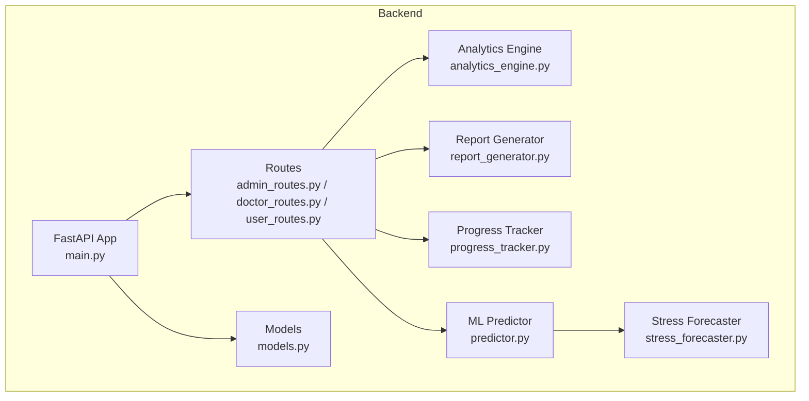

**Diagram sources**
- [main.py:52-79](file://backend/app/main.py#L52-L79)
- [admin_routes.py:9-12](file://backend/app/routes/admin_routes.py#L9-L12)
- [doctor_routes.py:22-22](file://backend/app/routes/doctor_routes.py#L22-L22)
- [user_routes.py:32-39](file://backend/app/routes/user_routes.py#L32-L39)
- [analytics_engine.py:11-18](file://backend/app/analytics_engine.py#L11-L18)
- [report_generator.py:38-48](file://backend/app/report_generator.py#L38-L48)
- [progress_tracker.py:48-134](file://backend/app/progress_tracker.py#L48-L134)
- [predictor.py:32-46](file://backend/ml_model/predictor.py#L32-L46)
- [stress_forecaster.py:7-12](file://backend/ml_model/stress_forecaster.py#L7-L12)
- [models.py:16-46](file://backend/app/models.py#L16-L46)

**Section sources**
- [main.py:52-79](file://backend/app/main.py#L52-L79)
- [admin_routes.py:9-12](file://backend/app/routes/admin_routes.py#L9-L12)
- [doctor_routes.py:22-22](file://backend/app/routes/doctor_routes.py#L22-L22)
- [user_routes.py:32-39](file://backend/app/routes/user_routes.py#L32-L39)

## Core Components
- Analytics Engine: Aggregates platform-wide statistics, demographic trends, and doctor effectiveness.
- Report Generator: Produces PDF reports for users and doctors with structured sections for results, explanations, trends, and recommendations.
- Progress Tracker: Implements gamification and achievement tracking for user engagement.
- ML Predictor: Provides stress predictions, SHAP-based explanations, category-level analysis, risk factor identification, trend analysis, and crisis detection.
- Stress Forecaster: Neural-network autoregressive forecaster for short-term stress trajectory predictions.
- Route Handlers: Expose analytics, reporting, and progress endpoints for Admin, Doctor, and User roles.

**Section sources**
- [analytics_engine.py:20-199](file://backend/app/analytics_engine.py#L20-L199)
- [report_generator.py:41-235](file://backend/app/report_generator.py#L41-L235)
- [progress_tracker.py:48-454](file://backend/app/progress_tracker.py#L48-L454)
- [predictor.py:146-414](file://backend/ml_model/predictor.py#L146-L414)
- [stress_forecaster.py:45-82](file://backend/ml_model/stress_forecaster.py#L45-L82)
- [admin_routes.py:14-62](file://backend/app/routes/admin_routes.py#L14-L62)
- [doctor_routes.py:48-134](file://backend/app/routes/doctor_routes.py#L48-L134)
- [user_routes.py:501-532](file://backend/app/routes/user_routes.py#L501-L532)

## Architecture Overview
The analytics and reporting pipeline integrates route handlers with analytics engines and ML models. Administrators consume advanced platform analytics; doctors access appointment and patient analytics; users receive personalized reports and recommendations.

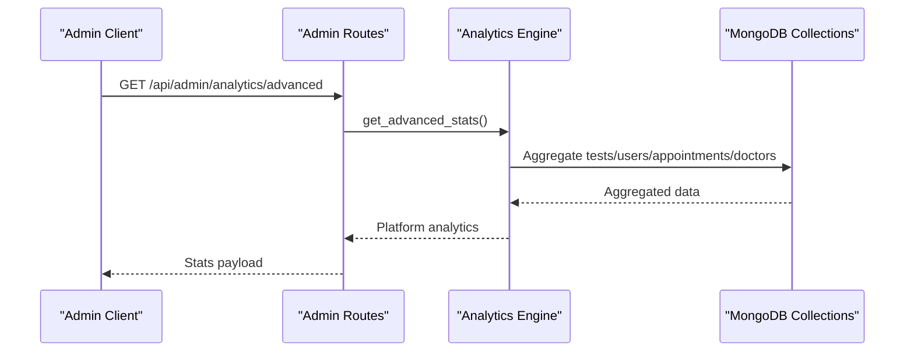

**Diagram sources**
- [admin_routes.py:217-224](file://backend/app/routes/admin_routes.py#L217-L224)
- [analytics_engine.py:20-199](file://backend/app/analytics_engine.py#L20-L199)

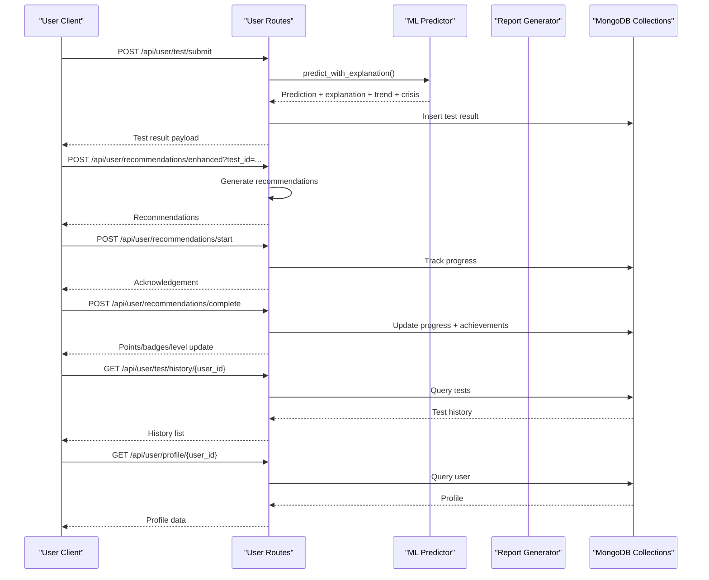

**Diagram sources**
- [user_routes.py:407-499](file://backend/app/routes/user_routes.py#L407-L499)
- [user_routes.py:575-647](file://backend/app/routes/user_routes.py#L575-L647)
- [user_routes.py:649-702](file://backend/app/routes/user_routes.py#L649-L702)
- [user_routes.py:729-753](file://backend/app/routes/user_routes.py#L729-L753)
- [user_routes.py:501-532](file://backend/app/routes/user_routes.py#L501-L532)
- [user_routes.py:45-67](file://backend/app/routes/user_routes.py#L45-L67)
- [predictor.py:146-414](file://backend/ml_model/predictor.py#L146-L414)
- [report_generator.py:41-235](file://backend/app/report_generator.py#L41-L235)

## Detailed Component Analysis

### Analytics Engine
The Analytics Engine computes platform-level insights, including:
- Overview statistics: total tests, weekly/monthly counts, average stress, active users, and crisis alerts.
- Daily trends: counts, average stress, and severe counts grouped by calendar dates.
- Demographics: stress by location, peak hours, and age groups.
- Doctor effectiveness: average stress improvement per doctor based on pre/post appointment comparisons.
- User analytics: personal history, trends, and category changes.

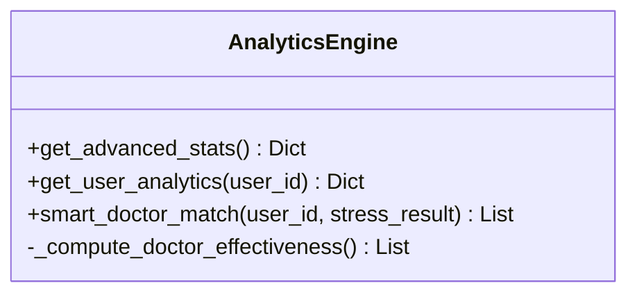

**Diagram sources**
- [analytics_engine.py:11-383](file://backend/app/analytics_engine.py#L11-L383)

**Section sources**
- [analytics_engine.py:20-199](file://backend/app/analytics_engine.py#L20-L199)
- [analytics_engine.py:247-307](file://backend/app/analytics_engine.py#L247-L307)
- [analytics_engine.py:309-378](file://backend/app/analytics_engine.py#L309-L378)

### Report Generator
The Report Generator produces:
- User reports: patient info, assessment results, class probabilities, SHAP-based explanations, category analysis, risk factors, trend analysis, recommendations, and crisis alerts.
- Doctor summaries: patient summary, test history, and trend analysis.
- Fallback plain-text reports when PDF generation is unavailable.

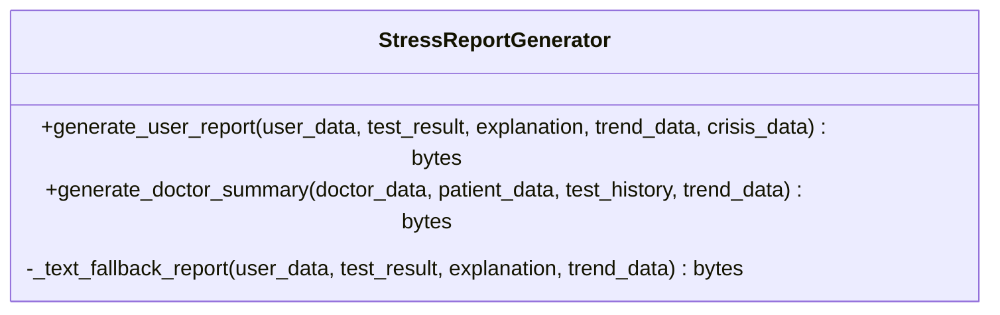

**Diagram sources**
- [report_generator.py:38-340](file://backend/app/report_generator.py#L38-L340)

**Section sources**
- [report_generator.py:41-235](file://backend/app/report_generator.py#L41-L235)
- [report_generator.py:271-337](file://backend/app/report_generator.py#L271-L337)

### Progress Tracker
The Progress Tracker manages:
- Recommendation progress lifecycle: start, complete, dismiss, save for later.
- Achievement tracking: badges, points, level calculation, streaks, and activity metrics.
- Leaderboard retrieval and achievement updates.

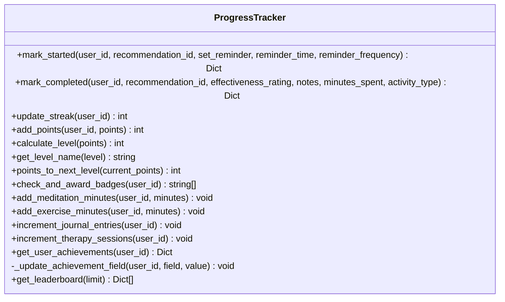

**Diagram sources**
- [progress_tracker.py:48-454](file://backend/app/progress_tracker.py#L48-L454)

**Section sources**
- [progress_tracker.py:135-235](file://backend/app/progress_tracker.py#L135-L235)
- [progress_tracker.py:237-274](file://backend/app/progress_tracker.py#L237-L274)
- [progress_tracker.py:276-290](file://backend/app/progress_tracker.py#L276-L290)
- [progress_tracker.py:292-316](file://backend/app/progress_tracker.py#L292-L316)
- [progress_tracker.py:318-373](file://backend/app/progress_tracker.py#L318-L373)
- [progress_tracker.py:375-397](file://backend/app/progress_tracker.py#L375-L397)
- [progress_tracker.py:399-416](file://backend/app/progress_tracker.py#L399-L416)
- [progress_tracker.py:435-454](file://backend/app/progress_tracker.py#L435-L454)

### ML Predictor and Stress Forecaster
The ML Predictor provides:
- Stress prediction with confidence and continuous score.
- SHAP-based explanations and category-level analysis.
- Risk factor identification and personalized recommendations.
- Trend analysis via linear regression and neural forecaster integration.
- Crisis detection based on severity thresholds and recent history.

The Stress Forecaster performs short-term forecasts using an autoregressive neural network.

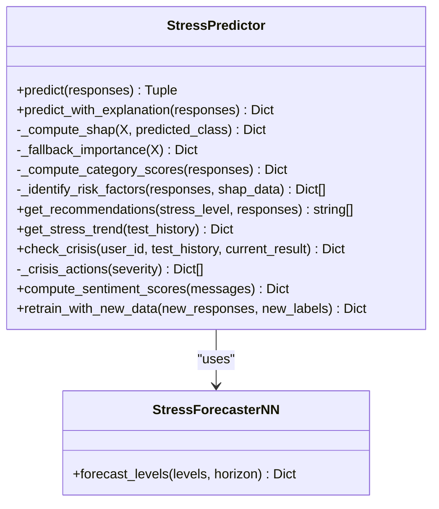

**Diagram sources**
- [predictor.py:32-589](file://backend/ml_model/predictor.py#L32-L589)
- [stress_forecaster.py:7-95](file://backend/ml_model/stress_forecaster.py#L7-L95)

**Section sources**
- [predictor.py:146-414](file://backend/ml_model/predictor.py#L146-L414)
- [predictor.py:416-484](file://backend/ml_model/predictor.py#L416-L484)
- [predictor.py:486-542](file://backend/ml_model/predictor.py#L486-L542)
- [stress_forecaster.py:45-82](file://backend/ml_model/stress_forecaster.py#L45-L82)

### Role-Based Dashboards and Analytics

#### Admin Analytics
Admins can retrieve:
- Platform overview: totals for users, doctors, tests, appointments.
- Appointment status breakdown.
- Stress level distribution.
- Recent activity and user/test counts.

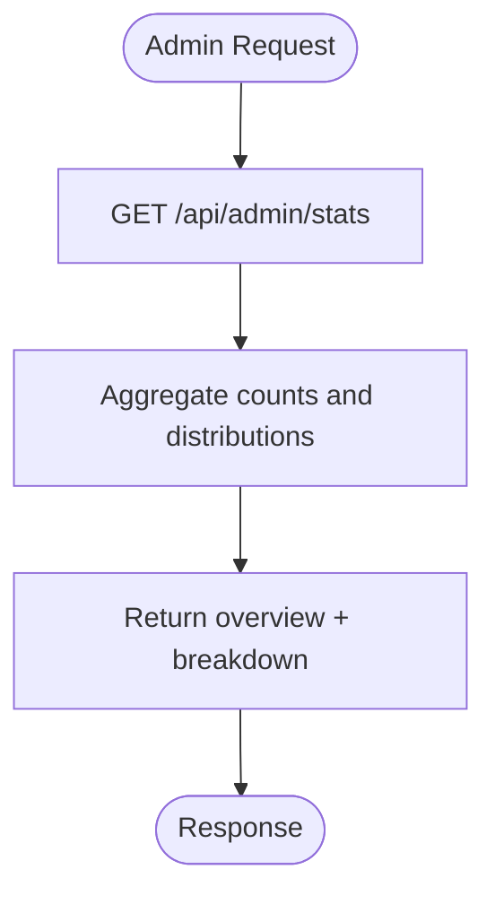

**Diagram sources**
- [admin_routes.py:14-62](file://backend/app/routes/admin_routes.py#L14-L62)

**Section sources**
- [admin_routes.py:14-62](file://backend/app/routes/admin_routes.py#L14-L62)

#### Doctor Insights
Doctors can retrieve:
- Appointments with patient test histories via optimized aggregation.
- Doctor statistics (counts by status).
- Patient test details for a given appointment.

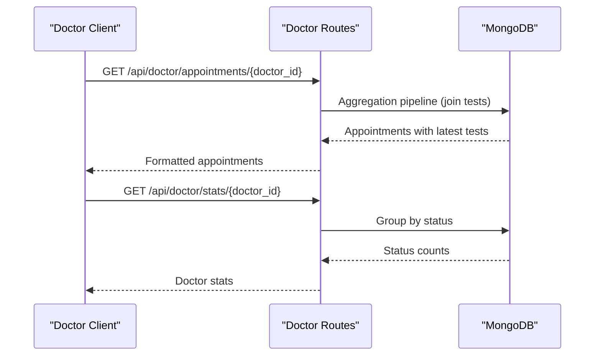

**Diagram sources**
- [doctor_routes.py:48-134](file://backend/app/routes/doctor_routes.py#L48-L134)
- [doctor_routes.py:366-399](file://backend/app/routes/doctor_routes.py#L366-L399)

**Section sources**
- [doctor_routes.py:48-134](file://backend/app/routes/doctor_routes.py#L48-L134)
- [doctor_routes.py:366-399](file://backend/app/routes/doctor_routes.py#L366-L399)

#### User Progress Tracking
Users can track:
- Test history and detailed results.
- Personal analytics: average stress, best/worst levels, time gaps, category trends.
- Achievements, badges, points, and level progression.
- Recommendation progress lifecycle.

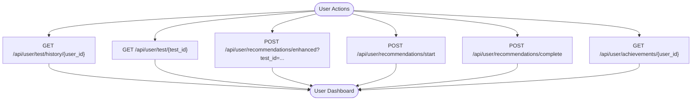

**Diagram sources**
- [user_routes.py:501-532](file://backend/app/routes/user_routes.py#L501-L532)
- [user_routes.py:534-569](file://backend/app/routes/user_routes.py#L534-L569)
- [user_routes.py:575-647](file://backend/app/routes/user_routes.py#L575-L647)
- [user_routes.py:649-702](file://backend/app/routes/user_routes.py#L649-L702)
- [user_routes.py:759-800](file://backend/app/routes/user_routes.py#L759-L800)

**Section sources**
- [user_routes.py:501-532](file://backend/app/routes/user_routes.py#L501-L532)
- [user_routes.py:534-569](file://backend/app/routes/user_routes.py#L534-L569)
- [user_routes.py:575-647](file://backend/app/routes/user_routes.py#L575-L647)
- [user_routes.py:649-702](file://backend/app/routes/user_routes.py#L649-L702)
- [user_routes.py:759-800](file://backend/app/routes/user_routes.py#L759-L800)

### Statistical Analysis and Reporting Features
- Stress Pattern Analysis: Daily trends, age groups, locations, and peak hours.
- Treatment Effectiveness: Doctor effectiveness computed from pre/post appointment stress comparisons.
- User Engagement Metrics: Active users, streaks, badges, points, and level progression.
- Trend Analysis: Linear regression-based trend direction, volatility, recent averages, and forecasts.
- Crisis Detection: Automated alerts based on severity thresholds and recent assessments.
- Reporting: Structured PDF reports for users and doctors, with fallback plain-text option.

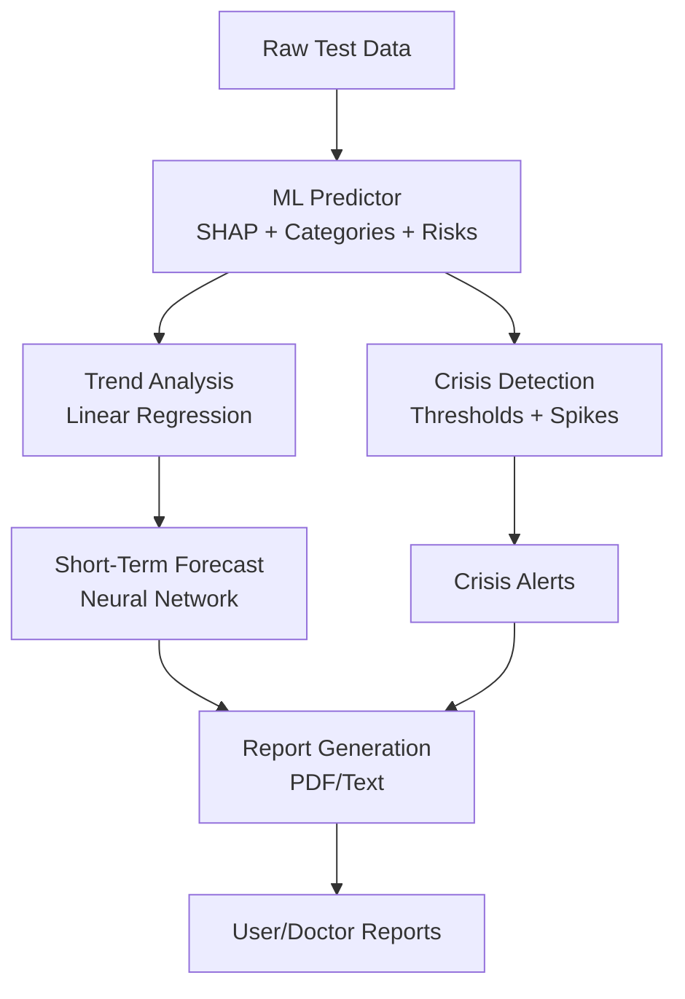

**Diagram sources**
- [predictor.py:363-414](file://backend/ml_model/predictor.py#L363-L414)
- [predictor.py:416-484](file://backend/ml_model/predictor.py#L416-L484)
- [stress_forecaster.py:45-82](file://backend/ml_model/stress_forecaster.py#L45-L82)
- [report_generator.py:41-235](file://backend/app/report_generator.py#L41-L235)

**Section sources**
- [analytics_engine.py:20-199](file://backend/app/analytics_engine.py#L20-L199)
- [predictor.py:363-414](file://backend/ml_model/predictor.py#L363-L414)
- [predictor.py:416-484](file://backend/ml_model/predictor.py#L416-L484)
- [report_generator.py:41-235](file://backend/app/report_generator.py#L41-L235)

### Data Export and Integrations
- PDF Report Generation: Users and doctors can generate comprehensive PDF reports containing assessment results, explanations, trends, and recommendations.
- Plain-Text Fallback: When PDF generation is unavailable, a plain-text report is produced.
- Download Integration: The system supports downloading generated reports and medical records, with appropriate content types and filenames.

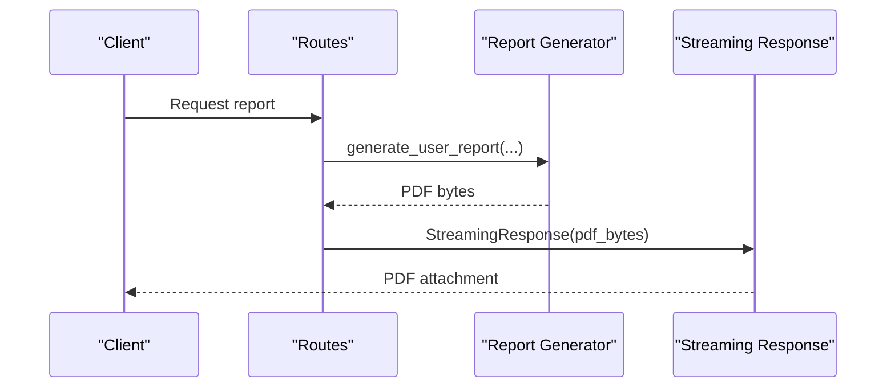

**Diagram sources**
- [report_generator.py:41-235](file://backend/app/report_generator.py#L41-L235)
- [user_routes.py:383-400](file://backend/app/routes/user_routes.py#L383-L400)

**Section sources**
- [report_generator.py:41-235](file://backend/app/report_generator.py#L41-L235)
- [report_generator.py:237-269](file://backend/app/report_generator.py#L237-L269)
- [user_routes.py:383-400](file://backend/app/routes/user_routes.py#L383-L400)

## Dependency Analysis
The analytics and reporting system exhibits clear separation of concerns:
- Routes depend on analytics engines, ML predictors, and report generators.
- Analytics engine aggregates data from MongoDB collections.
- Report generator depends on ReportLab for PDF rendering.
- Progress tracker persists achievements and updates user stats.
- ML predictor and forecaster encapsulate prediction logic and forecasting.

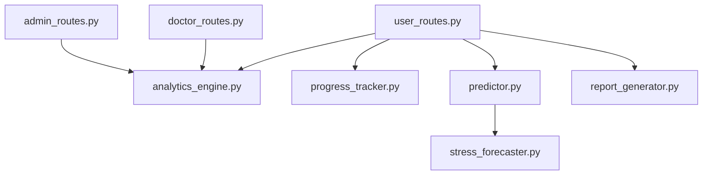

**Diagram sources**
- [admin_routes.py:12-12](file://backend/app/routes/admin_routes.py#L12-L12)
- [doctor_routes.py:17-17](file://backend/app/routes/doctor_routes.py#L17-L17)
- [user_routes.py:38-39](file://backend/app/routes/user_routes.py#L38-L39)
- [analytics_engine.py:14-18](file://backend/app/analytics_engine.py#L14-L18)
- [progress_tracker.py:131-134](file://backend/app/progress_tracker.py#L131-L134)
- [predictor.py:10-10](file://backend/ml_model/predictor.py#L10-L10)
- [stress_forecaster.py:7-12](file://backend/ml_model/stress_forecaster.py#L7-L12)
- [report_generator.py:38-48](file://backend/app/report_generator.py#L38-L48)

**Section sources**
- [admin_routes.py:12-12](file://backend/app/routes/admin_routes.py#L12-L12)
- [doctor_routes.py:17-17](file://backend/app/routes/doctor_routes.py#L17-L17)
- [user_routes.py:38-39](file://backend/app/routes/user_routes.py#L38-L39)

## Performance Considerations
- Aggregation Pipelines: The Analytics Engine and Doctor routes utilize MongoDB aggregation to minimize round-trips and improve query performance.
- Asynchronous Notifications: Doctor routes queue email and SMS notifications asynchronously to avoid blocking responses.
- Efficient Trend Computation: Linear regression and variance calculations are performed on bounded histories to keep computations lightweight.
- Model Integrity: ML models are validated via checksums to prevent runtime errors from corrupted artifacts.

[No sources needed since this section provides general guidance]

## Troubleshooting Guide
- Analytics Failures: Admin analytics endpoint wraps computation in try/catch and returns HTTP 500 on failure.
- Report Generation Issues: Report generator gracefully falls back to plain-text when PDF generation fails.
- Database Connectivity: Health check verifies MongoDB connectivity; failures surface as degraded status.
- Authorization: Routes enforce role-based access and object-level authorization to prevent unauthorized data access.

**Section sources**
- [admin_routes.py:223-224](file://backend/app/routes/admin_routes.py#L223-L224)
- [report_generator.py:237-269](file://backend/app/report_generator.py#L237-L269)
- [main.py:114-132](file://backend/app/main.py#L114-L132)
- [user_routes.py:504-510](file://backend/app/routes/user_routes.py#L504-L510)
- [user_routes.py:537-557](file://backend/app/routes/user_routes.py#L537-L557)

## Conclusion
The AI Stress Level Analyzer delivers robust analytics and reporting capabilities tailored to administrators, doctors, and users. Through aggregation pipelines, ML-driven insights, and structured report generation, stakeholders gain actionable intelligence on stress patterns, treatment outcomes, and user engagement. The modular design ensures scalability, maintainability, and extensibility for future enhancements.

[No sources needed since this section summarizes without analyzing specific files]

## Appendices
- Data Models: Pydantic models define request/response contracts for analytics, reports, and progress tracking, ensuring consistent data structures across the system.

**Section sources**
- [models.py:16-46](file://backend/app/models.py#L16-L46)
- [models.py:78-90](file://backend/app/models.py#L78-L90)
- [models.py:148-204](file://backend/app/models.py#L148-L204)
- [models.py:209-245](file://backend/app/models.py#L209-L245)