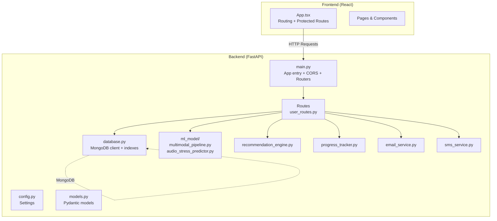
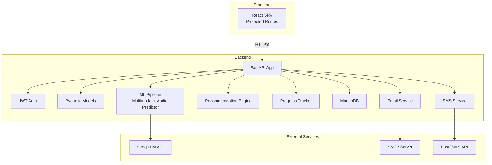
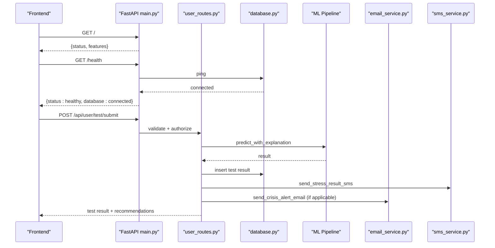
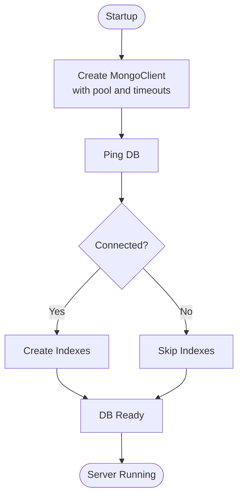
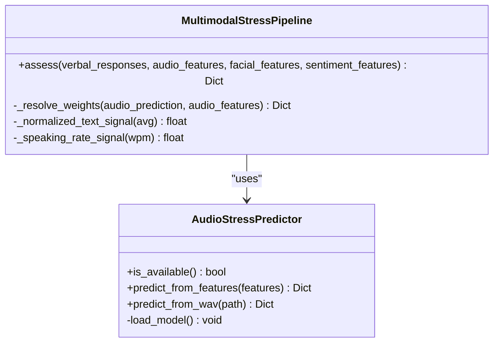
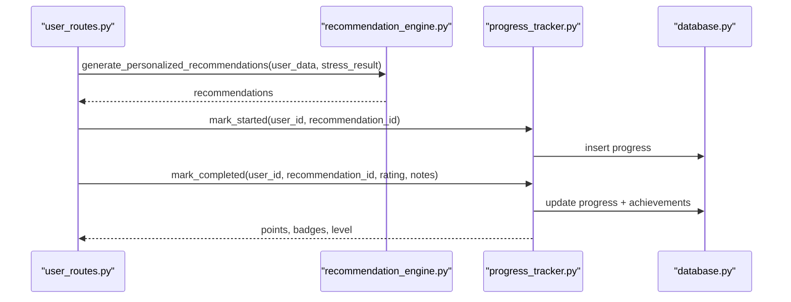
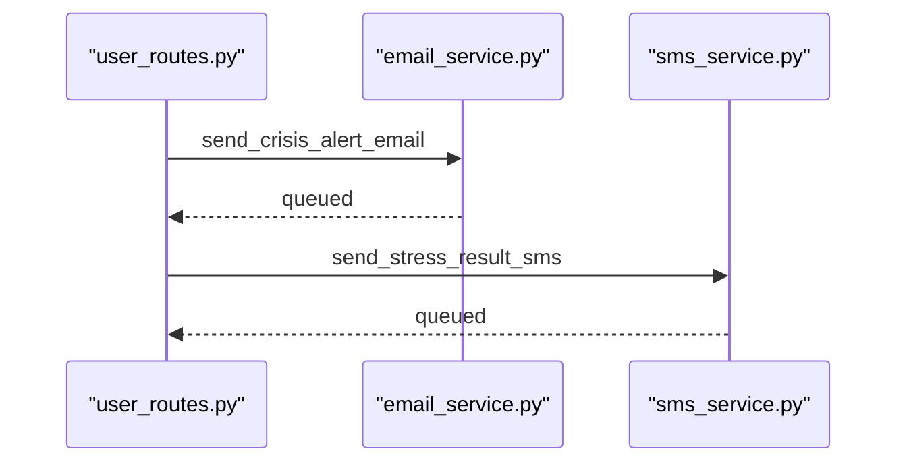
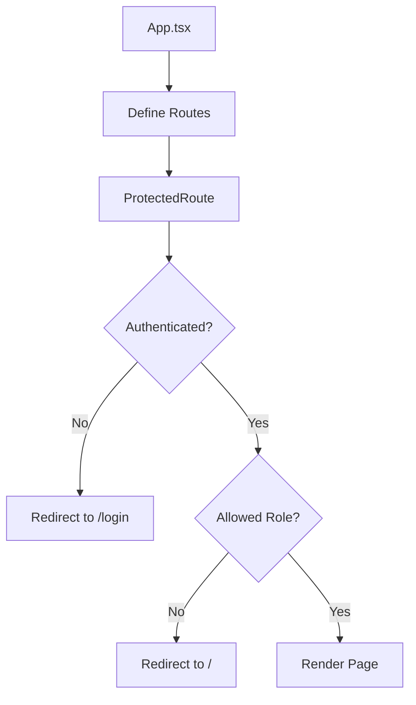
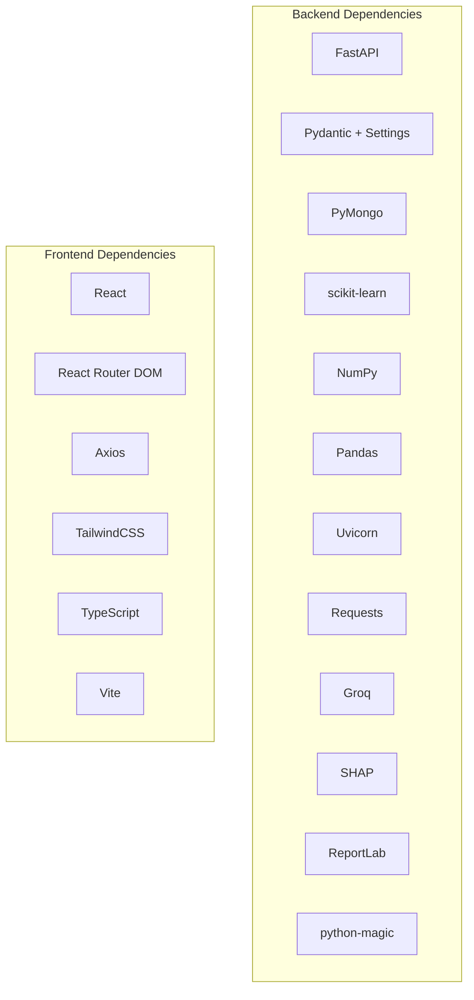
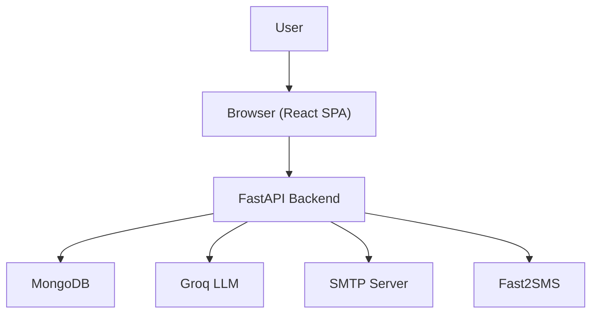

# Architecture Overview

<cite>
**Referenced Files in This Document**
- [backend/app/main.py](file://backend/app/main.py)
- [backend/app/config.py](file://backend/app/config.py)
- [backend/app/database.py](file://backend/app/database.py)
- [backend/app/models.py](file://backend/app/models.py)
- [backend/app/routes/user_routes.py](file://backend/app/routes/user_routes.py)
- [backend/ml_model/multimodal_pipeline.py](file://backend/ml_model/multimodal_pipeline.py)
- [backend/ml_model/audio_stress_predictor.py](file://backend/ml_model/audio_stress_predictor.py)
- [backend/app/recommendation_engine.py](file://backend/app/recommendation_engine.py)
- [backend/app/progress_tracker.py](file://backend/app/progress_tracker.py)
- [backend/app/email_service.py](file://backend/app/email_service.py)
- [backend/app/sms_service.py](file://backend/app/sms_service.py)
- [frontend/src/App.tsx](file://frontend/src/App.tsx)
- [frontend/package.json](file://frontend/package.json)
- [backend/requirements.txt](file://backend/requirements.txt)
- [ARCHITECTURE_EXPLAINED.md](file://ARCHITECTURE_EXPLAINED.md)
</cite>

## Table of Contents
1. [Introduction](#introduction)
2. [Project Structure](#project-structure)
3. [Core Components](#core-components)
4. [Architecture Overview](#architecture-overview)
5. [Detailed Component Analysis](#detailed-component-analysis)
6. [Dependency Analysis](#dependency-analysis)
7. [Performance Considerations](#performance-considerations)
8. [Troubleshooting Guide](#troubleshooting-guide)
9. [Conclusion](#conclusion)
10. [Appendices](#appendices)

## Introduction
This document presents the architecture of the AI Stress Level Analyzer, a full-stack system integrating a React frontend, a FastAPI backend, a MongoDB database, and external AI services. The system performs CBT-based stress assessments using textual responses and optional audio features, integrates a multimodal fusion pipeline, and leverages an external LLM provider for conversational assistance. It includes robust user management, gamification, recommendations, and notification systems.

## Project Structure
The repository is organized into two primary applications:
- Backend: FastAPI application with routing, authentication, ML model integration, analytics, and persistence.
- Frontend: React application with routing, protected routes, and user-facing pages.

**Diagram sources**
- [backend/app/main.py:52-80](file://backend/app/main.py#L52-L80)
- [backend/app/routes/user_routes.py:32-39](file://backend/app/routes/user_routes.py#L32-L39)
- [backend/app/database.py:26-46](file://backend/app/database.py#L26-L46)
- [backend/app/config.py:9-21](file://backend/app/config.py#L9-L21)
- [backend/app/models.py:1-440](file://backend/app/models.py#L1-L440)
- [backend/ml_model/multimodal_pipeline.py:11-183](file://backend/ml_model/multimodal_pipeline.py#L11-L183)
- [backend/ml_model/audio_stress_predictor.py:13-157](file://backend/ml_model/audio_stress_predictor.py#L13-L157)
- [backend/app/recommendation_engine.py:11-554](file://backend/app/recommendation_engine.py#L11-L554)
- [backend/app/progress_tracker.py:48-454](file://backend/app/progress_tracker.py#L48-L454)
- [backend/app/email_service.py:17-493](file://backend/app/email_service.py#L17-L493)
- [backend/app/sms_service.py:29-249](file://backend/app/sms_service.py#L29-L249)
- [frontend/src/App.tsx:16-88](file://frontend/src/App.tsx#L16-L88)

**Section sources**
- [backend/app/main.py:52-80](file://backend/app/main.py#L52-L80)
- [frontend/src/App.tsx:16-88](file://frontend/src/App.tsx#L16-L88)

## Core Components
- React Frontend
  - Routing and protected routes for user, doctor, and admin roles.
  - Uses Axios for HTTP communication with the backend.
- FastAPI Backend
  - Central application entry initializes CORS, registers routers, and exposes health checks.
  - Centralized configuration via Pydantic settings.
  - MongoDB client with connection pooling and automatic index creation.
  - Pydantic models define request/response contracts.
- Machine Learning Layer
  - Multimodal fusion pipeline combining textual, audio, and optional sentiment signals.
  - Audio stress predictor with trained model loading and feature extraction.
  - Enhanced recommendation engine and progress tracker for gamification.
- Notifications
  - Email service with asynchronous delivery and HTML templates.
  - SMS service supporting Fast2SMS with configurable routing and sender settings.

**Section sources**
- [frontend/src/App.tsx:16-88](file://frontend/src/App.tsx#L16-L88)
- [backend/app/main.py:52-80](file://backend/app/main.py#L52-L80)
- [backend/app/config.py:3-21](file://backend/app/config.py#L3-L21)
- [backend/app/database.py:26-46](file://backend/app/database.py#L26-L46)
- [backend/app/models.py:1-440](file://backend/app/models.py#L1-L440)
- [backend/ml_model/multimodal_pipeline.py:11-183](file://backend/ml_model/multimodal_pipeline.py#L11-L183)
- [backend/ml_model/audio_stress_predictor.py:13-157](file://backend/ml_model/audio_stress_predictor.py#L13-L157)
- [backend/app/recommendation_engine.py:11-554](file://backend/app/recommendation_engine.py#L11-L554)
- [backend/app/progress_tracker.py:48-454](file://backend/app/progress_tracker.py#L48-L454)
- [backend/app/email_service.py:17-493](file://backend/app/email_service.py#L17-L493)
- [backend/app/sms_service.py:29-249](file://backend/app/sms_service.py#L29-L249)

## Architecture Overview
The system follows a layered architecture:
- Presentation Layer: React SPA with protected routes and navigation.
- Application Layer: FastAPI REST endpoints handling authentication, validation, orchestration, and integrations.
- Domain Layer: ML models and recommendation engines.
- Persistence Layer: MongoDB with optimized indexes and connection pooling.
- Integration Layer: External services (Groq LLM, email/SMS providers).

**Diagram sources**
- [backend/app/main.py:52-80](file://backend/app/main.py#L52-L80)
- [backend/app/routes/user_routes.py:125-144](file://backend/app/routes/user_routes.py#L125-L144)
- [backend/app/email_service.py:17-493](file://backend/app/email_service.py#L17-L493)
- [backend/app/sms_service.py:29-249](file://backend/app/sms_service.py#L29-L249)
- [backend/ml_model/multimodal_pipeline.py:11-183](file://backend/ml_model/multimodal_pipeline.py#L11-L183)
- [backend/ml_model/audio_stress_predictor.py:13-157](file://backend/ml_model/audio_stress_predictor.py#L13-L157)

## Detailed Component Analysis

### Backend Application Entry and Routing
- Initializes environment variables, CORS policy, and registers routers for auth, user, doctor, admin, and optionally medical records.
- Health check endpoint validates database connectivity.
- Uploads directory is ensured on startup.

**Diagram sources**
- [backend/app/main.py:99-132](file://backend/app/main.py#L99-L132)
- [backend/app/routes/user_routes.py:407-499](file://backend/app/routes/user_routes.py#L407-L499)
- [backend/app/database.py:43-46](file://backend/app/database.py#L43-L46)
- [backend/app/email_service.py:432-489](file://backend/app/email_service.py#L432-L489)
- [backend/app/sms_service.py:222-242](file://backend/app/sms_service.py#L222-L242)

**Section sources**
- [backend/app/main.py:52-80](file://backend/app/main.py#L52-L80)
- [backend/app/main.py:114-132](file://backend/app/main.py#L114-L132)

### Database Layer
- MongoDB client configured with connection pooling, timeouts, and write concerns.
- Automatic index creation for collections to optimize frequent queries.
- Helper functions for admin initialization, user lookup, and medical records integration.

**Diagram sources**
- [backend/app/database.py:30-46](file://backend/app/database.py#L30-L46)
- [backend/app/database.py:164-299](file://backend/app/database.py#L164-L299)

**Section sources**
- [backend/app/database.py:26-46](file://backend/app/database.py#L26-L46)
- [backend/app/database.py:164-299](file://backend/app/database.py#L164-L299)

### Machine Learning Integration
- Multimodal pipeline fuses text, audio, sentiment, and facial signals with adaptive weighting.
- Audio predictor loads a trained model and extracts features from WAV files.
- User routes orchestrate multimodal assessment and fallback scoring.

**Diagram sources**
- [backend/ml_model/multimodal_pipeline.py:11-183](file://backend/ml_model/multimodal_pipeline.py#L11-L183)
- [backend/ml_model/audio_stress_predictor.py:13-157](file://backend/ml_model/audio_stress_predictor.py#L13-L157)

**Section sources**
- [backend/ml_model/multimodal_pipeline.py:74-179](file://backend/ml_model/multimodal_pipeline.py#L74-L179)
- [backend/ml_model/audio_stress_predictor.py:97-153](file://backend/ml_model/audio_stress_predictor.py#L97-L153)
- [backend/app/routes/user_routes.py:308-400](file://backend/app/routes/user_routes.py#L308-L400)

### Recommendations and Gamification
- Enhanced recommendation engine generates categorized, personalized recommendations and ranks them.
- Progress tracker manages streaks, points, badges, and level progression.
- Both components persist state to MongoDB.

**Diagram sources**
- [backend/app/routes/user_routes.py:575-753](file://backend/app/routes/user_routes.py#L575-L753)
- [backend/app/recommendation_engine.py:17-58](file://backend/app/recommendation_engine.py#L17-L58)
- [backend/app/progress_tracker.py:135-235](file://backend/app/progress_tracker.py#L135-L235)
- [backend/app/database.py:118-127](file://backend/app/database.py#L118-L127)

**Section sources**
- [backend/app/recommendation_engine.py:11-554](file://backend/app/recommendation_engine.py#L11-L554)
- [backend/app/progress_tracker.py:48-454](file://backend/app/progress_tracker.py#L48-L454)

### Notifications
- Email service supports async delivery with HTML templates for OTP, welcome, appointments, and crisis alerts.
- SMS service integrates with Fast2SMS for OTP, welcome, appointment updates, and stress result notifications.

**Diagram sources**
- [backend/app/routes/user_routes.py:471-481](file://backend/app/routes/user_routes.py#L471-L481)
- [backend/app/email_service.py:432-489](file://backend/app/email_service.py#L432-L489)
- [backend/app/sms_service.py:222-242](file://backend/app/sms_service.py#L222-L242)

**Section sources**
- [backend/app/email_service.py:17-493](file://backend/app/email_service.py#L17-L493)
- [backend/app/sms_service.py:29-249](file://backend/app/sms_service.py#L29-L249)

### Frontend Integration
- Protected route component enforces authentication and role-based access.
- Pages include home, login, register, OTP verification, dashboards, appointments, and account details.

**Diagram sources**
- [frontend/src/App.tsx:16-28](file://frontend/src/App.tsx#L16-L28)

**Section sources**
- [frontend/src/App.tsx:16-88](file://frontend/src/App.tsx#L16-L88)

## Dependency Analysis
- Technology Stack
  - Backend: FastAPI, Pydantic, Pydantic Settings, PyMongo, scikit-learn, NumPy, Pandas, python-dotenv, uvicorn, requests, groq, pytest, httpx, SHAP, ReportLab, python-magic.
  - Frontend: React, React DOM, React Router DOM, Axios, TailwindCSS, TypeScript, Vite.
- Third-party Dependencies
  - Groq for LLM-based conversion of verbal responses to numeric scores.
  - MongoDB for document storage and indexing.
  - SMTP and Fast2SMS for notifications.

**Diagram sources**
- [backend/requirements.txt:1-22](file://backend/requirements.txt#L1-L22)
- [frontend/package.json:10-26](file://frontend/package.json#L10-L26)

**Section sources**
- [backend/requirements.txt:1-22](file://backend/requirements.txt#L1-L22)
- [frontend/package.json:10-26](file://frontend/package.json#L10-L26)

## Performance Considerations
- Database
  - Connection pooling with maxPoolSize and timeouts to handle concurrent requests efficiently.
  - Extensive index creation for user, doctor, test, appointment, progress, achievement, OTP, and medical records collections.
- Model Loading
  - ML models are loaded at startup and reused across requests to minimize latency.
- Asynchronous Operations
  - Email and SMS are sent asynchronously to avoid blocking API responses.
- Scalability
  - Horizontal scaling of the FastAPI application behind a reverse proxy/load balancer.
  - MongoDB replica set and sharding considerations for high availability and throughput.
  - External services (Groq, SMTP, Fast2SMS) should be monitored for SLAs and rate limits.

[No sources needed since this section provides general guidance]

## Troubleshooting Guide
- CORS Issues
  - Ensure ALLOWED_ORIGINS is configured with actual frontend URLs; invalid origins are ignored.
- Database Connectivity
  - Health check endpoint pings the database; failures indicate connection or timeout issues.
- Model Availability
  - Audio predictor availability depends on model file presence and metadata; missing models trigger warnings.
- Notification Delivery
  - Email and SMS require proper environment configuration; missing credentials disable features with warnings.
- Authentication
  - Protected routes enforce JWT-based authentication; missing or invalid tokens result in unauthorized responses.

**Section sources**
- [backend/app/main.py:32-50](file://backend/app/main.py#L32-L50)
- [backend/app/main.py:114-132](file://backend/app/main.py#L114-L132)
- [backend/app/database.py:43-54](file://backend/app/database.py#L43-L54)
- [backend/ml_model/audio_stress_predictor.py:70-72](file://backend/ml_model/audio_stress_predictor.py#L70-L72)
- [backend/app/email_service.py:24-26](file://backend/app/email_service.py#L24-L26)
- [backend/app/sms_service.py:49-57](file://backend/app/sms_service.py#L49-L57)

## Conclusion
The AI Stress Level Analyzer employs a clean separation of concerns with a React frontend, a FastAPI backend, and a MongoDB-backed persistence layer. Its ML integration combines textual and audio signals with an external LLM for robust stress assessment. The system emphasizes reliability through connection pooling, indexes, asynchronous notifications, and role-based access control. With modular components and clear integration points, it supports scalability and maintainability while delivering personalized recommendations and gamification features.

## Appendices

### System Context Diagram

**Diagram sources**
- [backend/app/main.py:52-80](file://backend/app/main.py#L52-L80)
- [backend/app/routes/user_routes.py:125-144](file://backend/app/routes/user_routes.py#L125-L144)
- [backend/app/email_service.py:17-493](file://backend/app/email_service.py#L17-L493)
- [backend/app/sms_service.py:29-249](file://backend/app/sms_service.py#L29-L249)

### Deployment Topology
- Single-tenant deployment example:
  - Frontend hosted on static hosting or CDN.
  - Backend deployed behind a reverse proxy/load balancer.
  - MongoDB deployed as a managed cluster or replica set.
  - Environment variables configured for external services (Groq, SMTP, Fast2SMS).
- Multi-region considerations:
  - Geo-replicated MongoDB clusters.
  - Regional load balancers and autoscaling for the backend.
  - Regional SMTP/Fast2SMS endpoints if needed.

[No sources needed since this section provides general guidance]