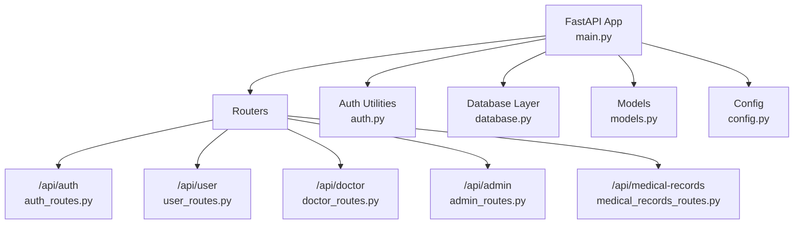
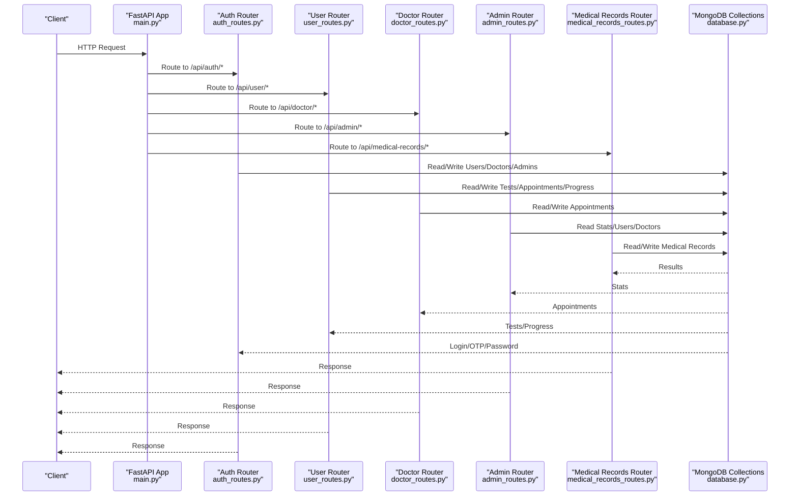
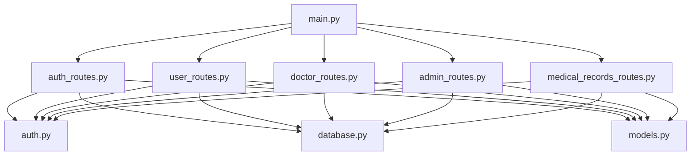

# API Endpoints

<cite>
**Referenced Files in This Document**
- [main.py](file://backend/app/main.py)
- [auth_routes.py](file://backend/app/routes/auth_routes.py)
- [user_routes.py](file://backend/app/routes/user_routes.py)
- [doctor_routes.py](file://backend/app/routes/doctor_routes.py)
- [admin_routes.py](file://backend/app/routes/admin_routes.py)
- [medical_records_routes.py](file://backend/app/routes/medical_records_routes.py)
- [models.py](file://backend/app/models.py)
- [auth.py](file://backend/app/auth.py)
- [database.py](file://backend/app/database.py)
- [config.py](file://backend/app/config.py)
</cite>

## Table of Contents
1. [Introduction](#introduction)
2. [Project Structure](#project-structure)
3. [Core Components](#core-components)
4. [Architecture Overview](#architecture-overview)
5. [Detailed Component Analysis](#detailed-component-analysis)
6. [Dependency Analysis](#dependency-analysis)
7. [Performance Considerations](#performance-considerations)
8. [Troubleshooting Guide](#troubleshooting-guide)
9. [Conclusion](#conclusion)
10. [Appendices](#appendices)

## Introduction
This document provides comprehensive API documentation for the AI Stress Level Analyzer backend. It covers all REST endpoints organized by functionality: Authentication, User Dashboard, Doctor, Admin, and Medical Records. For each endpoint, you will find HTTP methods, URL patterns, request/response schemas, authentication requirements, example requests/responses, error codes, and validation rules. It also documents the API versioning strategy, CORS configuration, and operational notes.

## Project Structure
The backend is built with FastAPI and organized by feature-based routing under backend/app/routes. Central configuration and authentication utilities live in backend/app. The main application initializes routers, sets CORS, and exposes health and root endpoints.

**Diagram sources**
- [main.py:52-79](file://backend/app/main.py#L52-L79)
- [auth_routes.py:32](file://backend/app/routes/auth_routes.py#L32)
- [user_routes.py:32](file://backend/app/routes/user_routes.py#L32)
- [doctor_routes.py:22](file://backend/app/routes/doctor_routes.py#L22)
- [admin_routes.py:9](file://backend/app/routes/admin_routes.py#L9)
- [medical_records_routes.py:40](file://backend/app/routes/medical_records_routes.py#L40)

**Section sources**
- [main.py:52-79](file://backend/app/main.py#L52-L79)

## Core Components
- Authentication and Authorization: JWT-based with role-based access control via require_role dependency.
- Data Access: MongoDB collections for users, doctors, admins, tests, appointments, recommendation progress, achievements, and medical records.
- Models: Pydantic models define request/response schemas for endpoints.
- CORS: Configured via environment variable ALLOWED_ORIGINS with strict validation and defaults.

Key implementation references:
- JWT creation/verification and role checking: [auth.py:45-151](file://backend/app/auth.py#L45-L151)
- MongoDB collections and indexes: [database.py:88-158](file://backend/app/database.py#L88-L158)
- CORS configuration and allowed origins parsing: [main.py:32-68](file://backend/app/main.py#L32-L68)

**Section sources**
- [auth.py:45-151](file://backend/app/auth.py#L45-L151)
- [database.py:88-158](file://backend/app/database.py#L88-L158)
- [main.py:32-68](file://backend/app/main.py#L32-L68)

## Architecture Overview
The API follows a layered architecture:
- Entry point: FastAPI app registers routers and middleware.
- Middleware: CORS is configured centrally.
- Routers: Feature-specific endpoints with role-based authorization.
- Services: Authentication utilities, database access, and external integrations (email/SMS).
- Models: Strong typing for request/response validation.

**Diagram sources**
- [main.py:70-79](file://backend/app/main.py#L70-L79)
- [auth_routes.py:32](file://backend/app/routes/auth_routes.py#L32)
- [user_routes.py:32](file://backend/app/routes/user_routes.py#L32)
- [doctor_routes.py:22](file://backend/app/routes/doctor_routes.py#L22)
- [admin_routes.py:9](file://backend/app/routes/admin_routes.py#L9)
- [medical_records_routes.py:40](file://backend/app/routes/medical_records_routes.py#L40)
- [database.py:88-158](file://backend/app/database.py#L88-L158)

## Detailed Component Analysis

### API Versioning Strategy
- The application defines a version in the FastAPI app metadata and exposes it via the root endpoint.
- Root endpoint returns the current API version and feature flags.
- No explicit URL versioning scheme is implemented; version is exposed in metadata and health checks.

References:
- Version in app metadata: [main.py:56](file://backend/app/main.py#L56)
- Root endpoint response: [main.py:99-112](file://backend/app/main.py#L99-L112)
- Health endpoint includes database status: [main.py:114-132](file://backend/app/main.py#L114-L132)

**Section sources**
- [main.py:56](file://backend/app/main.py#L56)
- [main.py:99-112](file://backend/app/main.py#L99-L112)
- [main.py:114-132](file://backend/app/main.py#L114-L132)

### CORS Configuration
- Origins are loaded from environment variable ALLOWED_ORIGINS and validated to ensure they are absolute URLs with http/https scheme and non-empty netloc.
- Defaults to localhost ports if none provided.
- Allows credentials, all common methods, and headers.

References:
- Origin parsing and validation: [main.py:32-50](file://backend/app/main.py#L32-L50)
- CORS middleware setup: [main.py:62-68](file://backend/app/main.py#L62-L68)

**Section sources**
- [main.py:32-50](file://backend/app/main.py#L32-L50)
- [main.py:62-68](file://backend/app/main.py#L62-L68)

### Authentication Endpoints
Base path: /api/auth

- GET /doctor/state-medical-councils
  - Description: Lists supported state medical councils for NMC verification.
  - Auth: Public.
  - Response: Array of councils.

- POST /register/user
  - Description: Registers a new user and sends OTP for verification.
  - Auth: Public.
  - Request: UserRegister (name, email, password, age, gender, location, has_previous_stress_issues, phone_number).
  - Response: TokenResponse with user details and empty access_token until email verification.

- POST /register/doctor
  - Description: Registers a doctor with NMC verification and admin approval workflow.
  - Auth: Public.
  - Request: DoctorRegister (name, email, password, license_number, state_medical_council, specialization, available_slots, phone_number).
  - Response: TokenResponse with doctor details and empty access_token until admin approval.

- POST /verify-otp
  - Description: Verifies email using OTP.
  - Auth: Public.
  - Request: OTPVerify (email, otp).
  - Response: Success message and user profile.

- POST /resend-otp
  - Description: Resends OTP to email if not yet verified.
  - Auth: Public.
  - Request: ResendOTPRequest (email).
  - Response: Confirmation message.

- POST /upload-medical-document
  - Description: Uploads a medical document for authenticated user.
  - Auth: Requires role user.
  - Request: multipart/form-data with file and current_user dependency.
  - Response: Success message and filename.

- POST /login
  - Description: Logs in user and returns JWT token.
  - Auth: Public.
  - Request: UserLogin (email, password).
  - Response: TokenResponse with user profile and access_token.

- POST /change-password
  - Description: Changes password after verifying current password.
  - Auth: Requires role user/doctor/admin.
  - Request: ChangePassword (email, current_password, new_password).
  - Response: Success message.

- POST /forgot-password
  - Description: Initiates password reset by sending OTP to email.
  - Auth: Public.
  - Request: ForgotPasswordRequest (email).
  - Response: Success message.

- POST /verify-reset-otp
  - Description: Verifies OTP for password reset.
  - Auth: Public.
  - Request: VerifyResetOTPRequest (email, otp).
  - Response: Success message.

- POST /reset-password
  - Description: Resets password after OTP verification.
  - Auth: Public.
  - Request: ResetPasswordRequest (email, otp, new_password).
  - Response: Success message.

Validation rules and error codes:
- Email uniqueness checks during registration.
- OTP validation with expiration and attempt limits.
- Role-based access control enforced by require_role dependency.
- Password length requirement for reset/change endpoints.

Example request/response paths:
- Registration request: [auth_routes.py:68-132](file://backend/app/routes/auth_routes.py#L68-L132)
- Login request: [auth_routes.py:377-439](file://backend/app/routes/auth_routes.py#L377-L439)
- Password reset flow: [auth_routes.py:481-596](file://backend/app/routes/auth_routes.py#L481-L596)

**Section sources**
- [auth_routes.py:63-132](file://backend/app/routes/auth_routes.py#L63-L132)
- [auth_routes.py:377-439](file://backend/app/routes/auth_routes.py#L377-L439)
- [auth_routes.py:481-596](file://backend/app/routes/auth_routes.py#L481-L596)
- [models.py:16-136](file://backend/app/models.py#L16-L136)
- [auth.py:98-151](file://backend/app/auth.py#L98-L151)

### User Dashboard Endpoints
Base path: /api/user

- GET /profile/{user_id}
  - Description: Retrieves user profile by ID.
  - Auth: Requires role user/admin.
  - Path param: user_id (ObjectId).
  - Response: Profile fields including name, email, age, gender, location, has_previous_stress_issues, created_at, is_email_verified.

- PUT /profile/{user_id}
  - Description: Updates user profile.
  - Auth: Requires role user/admin.
  - Path param: user_id (ObjectId).
  - Request: ProfileUpdate (name, age, gender, location, has_previous_stress_issues).
  - Response: Updated profile.

- GET /questionnaire
  - Description: Returns CBT-based stress assessment questionnaire with instructions and scale.
  - Auth: Requires role user.
  - Response: Questions array and instructions.

- POST /test/submit
  - Description: Submits stress test responses and returns ML-based prediction with explanations.
  - Auth: Requires role user.
  - Request: TestSubmission (responses array of 18 integers 1-5).
  - Response: TestResponse with stress_level, stress_label, confidence_score, recommendations, probabilities, category_scores, risk_factors, trend, crisis, and timestamp.

- GET /test/history/{user_id}
  - Description: Retrieves user’s test history.
  - Auth: Requires role user/admin/doctor.
  - Path param: user_id (ObjectId).
  - Response: Array of test summaries.

- GET /test/{test_id}
  - Description: Retrieves detailed test results.
  - Auth: Requires role user/doctor/admin.
  - Path param: test_id (ObjectId).
  - Response: Detailed test with responses, stress_level, stress_label, confidence_score, recommendations, timestamp, and questions.

- POST /recommendations/enhanced
  - Description: Generates personalized recommendations based on test results and user profile.
  - Auth: Requires role user.
  - Query param: test_id (ObjectId).
  - Response: Enhanced recommendations.

- POST /recommendations/start
  - Description: Marks a recommendation as started with optional reminders.
  - Auth: Requires role user.
  - Request: RecommendationProgressCreate (user_id, recommendation_id, set_reminder, reminder_time, reminder_frequency).
  - Response: Progress tracking result.

- POST /recommendations/complete
  - Description: Marks a recommendation as completed and awards points/badges.
  - Auth: Requires role user.
  - Request: RecommendationProgressComplete (user_id, recommendation_id, effectiveness_rating, notes, minutes_spent, activity_type).
  - Response: Progress tracking result.

- DELETE /recommendations/{user_id}/{recommendation_id}
  - Description: Dismisses a recommendation as not helpful.
  - Auth: Requires role user.
  - Path params: user_id, recommendation_id (ObjectIds).
  - Response: Success message.

- POST /recommendations/save
  - Description: Saves a recommendation for later.
  - Auth: Requires role user.
  - Query params: user_id, recommendation_id (ObjectIds).
  - Response: Success message.

- GET /achievements/{user_id}
  - Description: Retrieves user achievements, badges, points, and level.
  - Auth: Requires role user.
  - Path param: user_id (ObjectId).
  - Response: UserAchievementsResponse.

Validation rules and error codes:
- ObjectId validation for user_id/test_id.
- Authorization checks per endpoint.
- Response arrays validated for length and bounds.

Example request/response paths:
- Questionnaire: [user_routes.py:171-184](file://backend/app/routes/user_routes.py#L171-L184)
- Test submission: [user_routes.py:407-499](file://backend/app/routes/user_routes.py#L407-L499)
- Recommendations: [user_routes.py:575-753](file://backend/app/routes/user_routes.py#L575-L753)

**Section sources**
- [user_routes.py:45-123](file://backend/app/routes/user_routes.py#L45-L123)
- [user_routes.py:171-184](file://backend/app/routes/user_routes.py#L171-L184)
- [user_routes.py:407-499](file://backend/app/routes/user_routes.py#L407-L499)
- [user_routes.py:501-569](file://backend/app/routes/user_routes.py#L501-L569)
- [user_routes.py:575-753](file://backend/app/routes/user_routes.py#L575-L753)
- [models.py:16-271](file://backend/app/models.py#L16-L271)

### Doctor Endpoints
Base path: /api/doctor

- GET /appointments/{doctor_id}
  - Description: Retrieves doctor’s appointments with patient test history (optimized with aggregation).
  - Auth: Requires role doctor.
  - Path param: doctor_id (ObjectId).
  - Response: Array of appointments with latest test details.

- GET /appointment/{appointment_id}/patient-tests
  - Description: Retrieves detailed patient test information for an appointment.
  - Auth: Requires role doctor.
  - Path param: appointment_id (ObjectId).
  - Response: Patient name/email, appointment time, and tests.

- PUT /appointment/{appointment_id}
  - Description: Updates appointment status and notes; sends asynchronous notifications.
  - Auth: Requires role doctor.
  - Path param: appointment_id (ObjectId).
  - Request: AppointmentUpdate (status, notes).
  - Response: Success message and status.

- PUT /appointment/{appointment_id}/status
  - Description: Alternative endpoint to update appointment status.
  - Auth: Requires role doctor.
  - Path param: appointment_id (ObjectId).
  - Request: AppointmentUpdate (status, notes).
  - Response: Success message and status.

- GET /stats/{doctor_id}
  - Description: Retrieves doctor statistics (counts by status).
  - Auth: Requires role doctor.
  - Path param: doctor_id (ObjectId).
  - Response: Stats with total_appointments and counts by status.

Validation rules and error codes:
- ObjectId validation for IDs.
- Doctor ownership verification for updates.
- Status validation (pending, approved, rejected, completed).

Example request/response paths:
- Appointments listing: [doctor_routes.py:48-134](file://backend/app/routes/doctor_routes.py#L48-L134)
- Appointment update: [doctor_routes.py:171-267](file://backend/app/routes/doctor_routes.py#L171-L267)
- Stats: [doctor_routes.py:366-399](file://backend/app/routes/doctor_routes.py#L366-L399)

**Section sources**
- [doctor_routes.py:48-134](file://backend/app/routes/doctor_routes.py#L48-L134)
- [doctor_routes.py:171-267](file://backend/app/routes/doctor_routes.py#L171-L267)
- [doctor_routes.py:366-399](file://backend/app/routes/doctor_routes.py#L366-L399)
- [models.py:95-114](file://backend/app/models.py#L95-L114)

### Admin Endpoints
Base path: /api/admin

- GET /stats
  - Description: Comprehensive admin statistics (totals, appointments, stress distribution, recent activity).
  - Auth: Requires role admin.

- GET /users
  - Description: Lists all users with test/appointment counts and latest stress.
  - Auth: Requires role admin.

- GET /doctors
  - Description: Lists all doctors with verification status and appointment counts.
  - Auth: Requires role admin.

- PUT /doctor/{doctor_id}/verify
  - Description: Verifies or unverifies a doctor.
  - Auth: Requires role admin.
  - Path param: doctor_id (ObjectId).
  - Query param: verified (boolean).
  - Response: Success message.

- GET /appointments
  - Description: Lists all appointments.
  - Auth: Requires role admin.

- GET /tests/recent
  - Description: Lists recent tests with user information.
  - Auth: Requires role admin.

- DELETE /user/{user_id}
  - Description: Deletes a user and associated data.
  - Auth: Requires role admin.
  - Path param: user_id (ObjectId).
  - Response: Success message.

- DELETE /doctor/{doctor_id}
  - Description: Deletes a doctor and associated appointments.
  - Auth: Requires role admin.
  - Path param: doctor_id (ObjectId).
  - Response: Success message.

- GET /analytics/advanced
  - Description: Advanced platform analytics including trends, demographics, doctor effectiveness.
  - Auth: Requires role admin.

Validation rules and error codes:
- ObjectId validation for IDs.
- Admin-only access for all endpoints.

Example request/response paths:
- Stats: [admin_routes.py:14-62](file://backend/app/routes/admin_routes.py#L14-L62)
- Users listing: [admin_routes.py:64-98](file://backend/app/routes/admin_routes.py#L64-L98)
- Doctors listing: [admin_routes.py:100-125](file://backend/app/routes/admin_routes.py#L100-L125)
- Analytics: [admin_routes.py:217-224](file://backend/app/routes/admin_routes.py#L217-L224)

**Section sources**
- [admin_routes.py:14-62](file://backend/app/routes/admin_routes.py#L14-L62)
- [admin_routes.py:64-98](file://backend/app/routes/admin_routes.py#L64-L98)
- [admin_routes.py:100-125](file://backend/app/routes/admin_routes.py#L100-L125)
- [admin_routes.py:217-224](file://backend/app/routes/admin_routes.py#L217-L224)

### Medical Records Endpoints
Base path: /api/medical-records

- POST /upload
  - Description: Uploads a medical record file with metadata.
  - Auth: Requires role user.
  - Request: multipart/form-data with user_id, record_name, record_type, description, record_date, doctor_name, hospital_name, notes, tags, file.
  - Response: MedicalRecordResponse.

- GET /user/{user_id}
  - Description: Lists user’s medical records with optional filters.
  - Auth: Requires role user/doctor.
  - Path param: user_id (ObjectId).
  - Query params: record_type, from_date, to_date, search.
  - Response: Array of MedicalRecordResponse.

- GET /{record_id}
  - Description: Retrieves a specific medical record.
  - Auth: Requires role user/doctor.
  - Path param: record_id (ObjectId).
  - Response: MedicalRecordResponse.

- PUT /{record_id}
  - Description: Updates medical record metadata.
  - Auth: Requires role user.
  - Path param: record_id (ObjectId).
  - Request: MedicalRecordUpdate.
  - Response: MedicalRecordResponse.

- DELETE /{record_id}
  - Description: Deletes a medical record (soft delete by default).
  - Auth: Requires role user.
  - Path param: record_id (ObjectId).
  - Query param: permanent (boolean).
  - Response: Success message.

- GET /download/{record_id}
  - Description: Downloads a medical record file; auto-generates PDF for stress test records.
  - Auth: Requires role user/doctor.
  - Path param: record_id (ObjectId).
  - Response: FileResponse or PDF stream.

- POST /download/bulk
  - Description: Downloads multiple medical records as a ZIP file.
  - Auth: Requires role user.
  - Request: BulkDownloadRequest (user_id, record_ids).
  - Response: ZIP stream.

- POST /link-stress-test
  - Description: Adds a stress test to medical records.
  - Auth: Requires role user.
  - Request: TestResultAdd (stress_test_id, add_to_medical_records, record_name, notes).
  - Response: Success message with record_id.

- GET /stats/{user_id}
  - Description: Retrieves medical records statistics for a user.
  - Auth: Requires role user.
  - Path param: user_id (ObjectId).
  - Response: MedicalRecordStats.

Validation rules and error codes:
- File type and size validation.
- Storage limit enforcement per user.
- ObjectId validation for IDs.
- Authorization checks per endpoint.

Example request/response paths:
- Upload: [medical_records_routes.py:149-278](file://backend/app/routes/medical_records_routes.py#L149-L278)
- Listing: [medical_records_routes.py:284-357](file://backend/app/routes/medical_records_routes.py#L284-L357)
- Download: [medical_records_routes.py:786-885](file://backend/app/routes/medical_records_routes.py#L786-L885)
- Bulk download: [medical_records_routes.py:887-935](file://backend/app/routes/medical_records_routes.py#L887-L935)
- Link stress test: [medical_records_routes.py:941-1004](file://backend/app/routes/medical_records_routes.py#L941-L1004)
- Stats: [medical_records_routes.py:1010-1054](file://backend/app/routes/medical_records_routes.py#L1010-L1054)

**Section sources**
- [medical_records_routes.py:149-278](file://backend/app/routes/medical_records_routes.py#L149-L278)
- [medical_records_routes.py:284-357](file://backend/app/routes/medical_records_routes.py#L284-L357)
- [medical_records_routes.py:786-885](file://backend/app/routes/medical_records_routes.py#L786-L885)
- [medical_records_routes.py:887-935](file://backend/app/routes/medical_records_routes.py#L887-L935)
- [medical_records_routes.py:941-1004](file://backend/app/routes/medical_records_routes.py#L941-L1004)
- [medical_records_routes.py:1010-1054](file://backend/app/routes/medical_records_routes.py#L1010-L1054)
- [models.py:299-440](file://backend/app/models.py#L299-L440)

## Dependency Analysis
- Router registration: The main app includes all feature routers.
- Authentication dependency: require_role enforces JWT verification and role checks.
- Database access: All endpoints depend on database.py collections and indexes.
- Models: Pydantic models validate request/response bodies.

**Diagram sources**
- [main.py:70-79](file://backend/app/main.py#L70-L79)
- [auth_routes.py:32](file://backend/app/routes/auth_routes.py#L32)
- [user_routes.py:32](file://backend/app/routes/user_routes.py#L32)
- [doctor_routes.py:22](file://backend/app/routes/doctor_routes.py#L22)
- [admin_routes.py:9](file://backend/app/routes/admin_routes.py#L9)
- [medical_records_routes.py:40](file://backend/app/routes/medical_records_routes.py#L40)
- [auth.py:98-151](file://backend/app/auth.py#L98-L151)
- [database.py:88-158](file://backend/app/database.py#L88-L158)
- [models.py:16-440](file://backend/app/models.py#L16-L440)

**Section sources**
- [main.py:70-79](file://backend/app/main.py#L70-L79)
- [auth.py:98-151](file://backend/app/auth.py#L98-L151)
- [database.py:88-158](file://backend/app/database.py#L88-L158)
- [models.py:16-440](file://backend/app/models.py#L16-L440)

## Performance Considerations
- Connection pooling and timeouts are configured for MongoDB to improve concurrency and reduce latency.
- Aggregation pipelines are used in doctor endpoints to minimize N+1 queries and improve performance.
- Indexes are created for critical collections and common query patterns.

References:
- MongoDB connection pooling and timeouts: [database.py:30-41](file://backend/app/database.py#L30-L41)
- Aggregation pipeline for doctor appointments: [doctor_routes.py:52-87](file://backend/app/routes/doctor_routes.py#L52-L87)
- Index creation: [database.py:164-299](file://backend/app/database.py#L164-L299)

**Section sources**
- [database.py:30-41](file://backend/app/database.py#L30-L41)
- [doctor_routes.py:52-87](file://backend/app/routes/doctor_routes.py#L52-L87)
- [database.py:164-299](file://backend/app/database.py#L164-L299)

## Troubleshooting Guide
Common issues and resolutions:
- Invalid or expired OTP: Check OTP verification endpoints and error messages for expired or invalid codes.
- Unauthorized access: Ensure Authorization header includes a valid bearer token with correct role.
- Database connectivity: Health endpoint returns database status; verify MongoDB connection string and credentials.
- File upload failures: Validate file type, size, and content; ensure upload directory permissions.

References:
- OTP verification and reset flow: [auth_routes.py:481-596](file://backend/app/routes/auth_routes.py#L481-L596)
- JWT verification and role checks: [auth.py:57-151](file://backend/app/auth.py#L57-L151)
- Health endpoint: [main.py:114-132](file://backend/app/main.py#L114-L132)
- File validation and upload: [medical_records_routes.py:68-131](file://backend/app/routes/medical_records_routes.py#L68-L131)

**Section sources**
- [auth_routes.py:481-596](file://backend/app/routes/auth_routes.py#L481-L596)
- [auth.py:57-151](file://backend/app/auth.py#L57-L151)
- [main.py:114-132](file://backend/app/main.py#L114-L132)
- [medical_records_routes.py:68-131](file://backend/app/routes/medical_records_routes.py#L68-L131)

## Conclusion
This API provides a comprehensive set of endpoints for authentication, user dashboard, doctor management, admin analytics, and medical records. It emphasizes strong authentication with JWT, robust validation via Pydantic models, and performance optimizations through MongoDB aggregation and indexing. CORS is configurable via environment variables, and the API version is exposed in application metadata.

## Appendices

### Authentication Requirements
- All endpoints that require authentication use the Authorization header with a bearer token.
- Role-based access control ensures endpoints are only accessible by authorized roles.

References:
- Bearer token extraction and verification: [auth.py:103-151](file://backend/app/auth.py#L103-L151)
- Role checker dependency: [auth.py:98-151](file://backend/app/auth.py#L98-L151)

**Section sources**
- [auth.py:103-151](file://backend/app/auth.py#L103-L151)
- [auth.py:98-151](file://backend/app/auth.py#L98-L151)

### Rate Limiting and Pagination Patterns
- No explicit rate limiting or pagination patterns are implemented in the provided code.
- Pagination is not present in the current endpoint designs; however, listing endpoints return arrays that can be paginated client-side if needed.

References:
- Endpoint listings: [user_routes.py:501-569](file://backend/app/routes/user_routes.py#L501-L569), [admin_routes.py:64-98](file://backend/app/routes/admin_routes.py#L64-L98), [admin_routes.py:142-158](file://backend/app/routes/admin_routes.py#L142-L158), [medical_records_routes.py:284-357](file://backend/app/routes/medical_records_routes.py#L284-L357)

**Section sources**
- [user_routes.py:501-569](file://backend/app/routes/user_routes.py#L501-L569)
- [admin_routes.py:64-98](file://backend/app/routes/admin_routes.py#L64-L98)
- [admin_routes.py:142-158](file://backend/app/routes/admin_routes.py#L142-L158)
- [medical_records_routes.py:284-357](file://backend/app/routes/medical_records_routes.py#L284-L357)