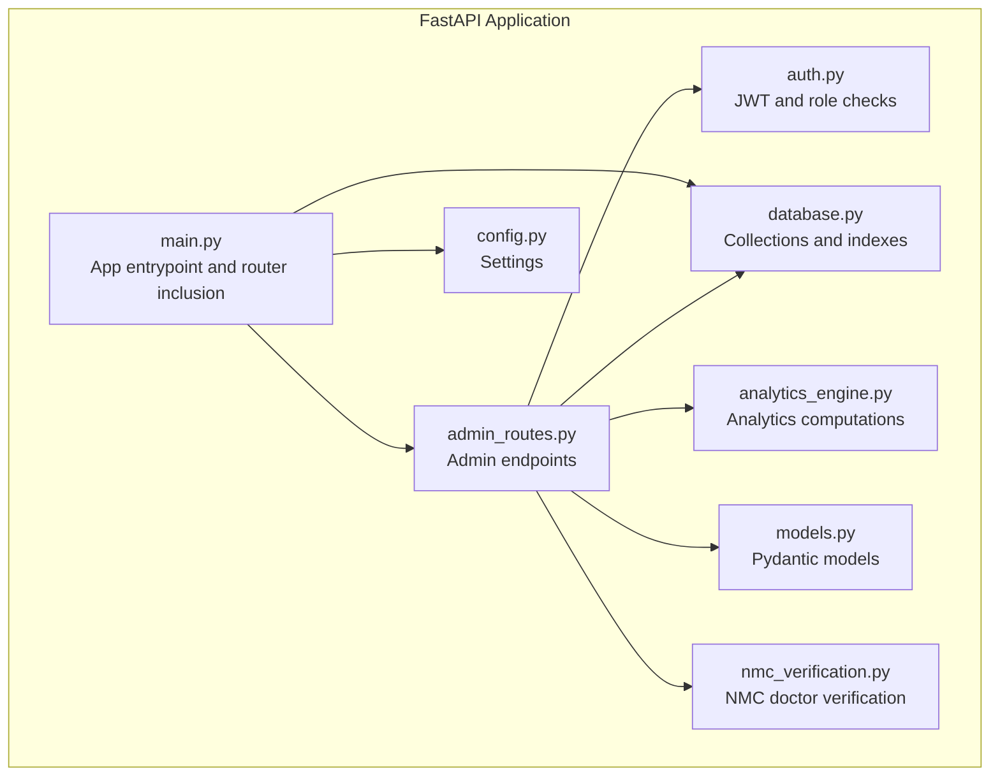
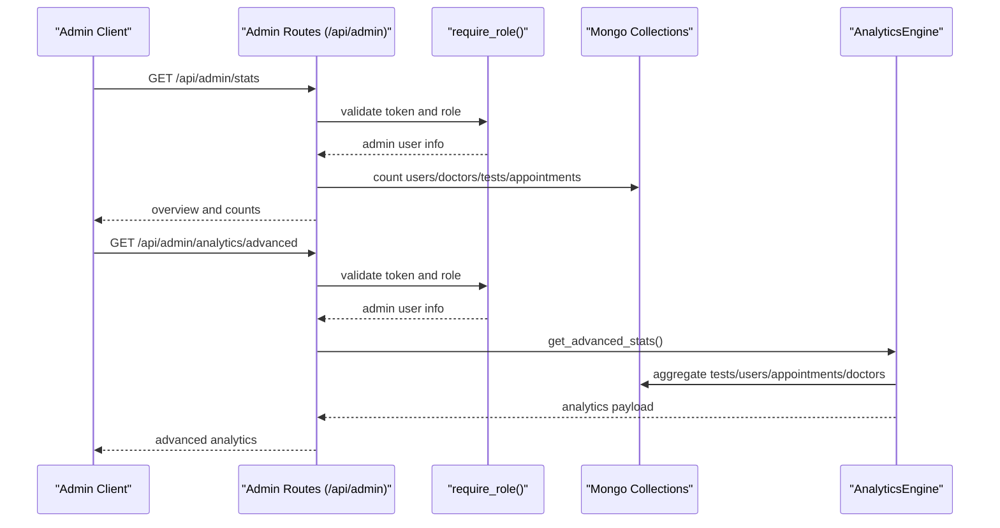
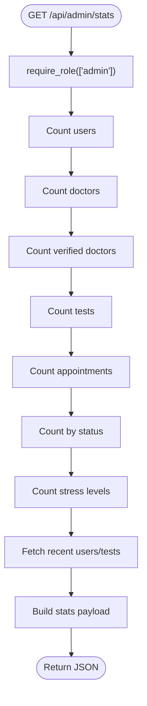
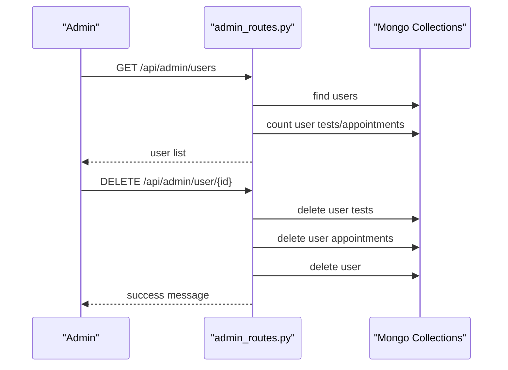
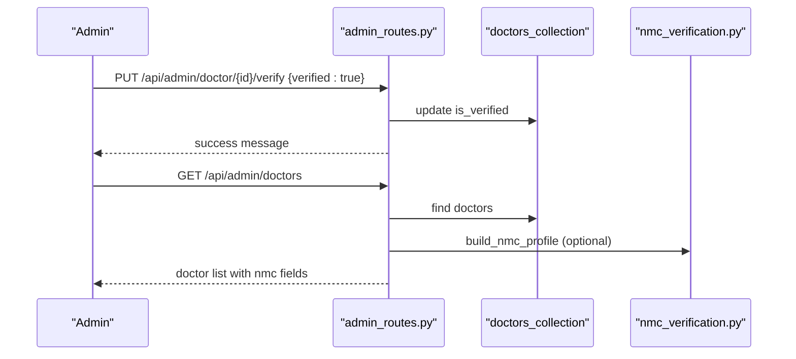
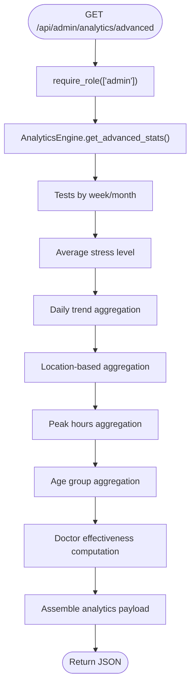
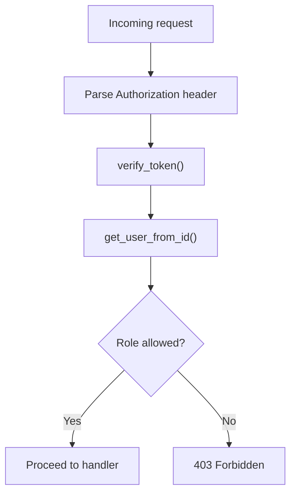
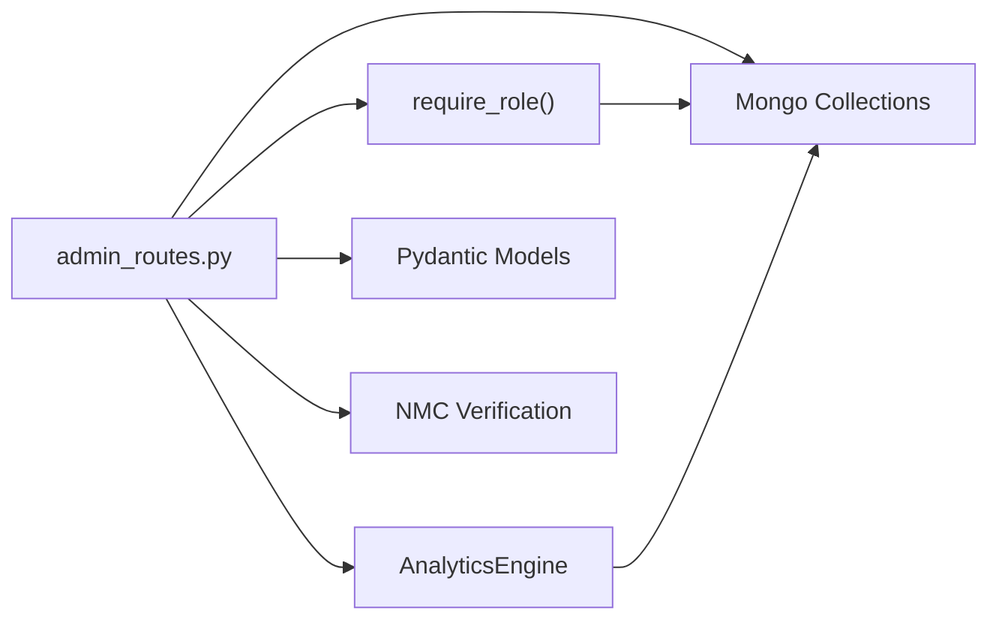

# Admin Dashboard Endpoints

<cite>
**Referenced Files in This Document**
- [admin_routes.py](file://backend/app/routes/admin_routes.py)
- [analytics_engine.py](file://backend/app/analytics_engine.py)
- [auth.py](file://backend/app/auth.py)
- [database.py](file://backend/app/database.py)
- [models.py](file://backend/app/models.py)
- [main.py](file://backend/app/main.py)
- [nmc_verification.py](file://backend/app/nmc_verification.py)
- [config.py](file://backend/app/config.py)
</cite>

## Table of Contents
1. [Introduction](#introduction)
2. [Project Structure](#project-structure)
3. [Core Components](#core-components)
4. [Architecture Overview](#architecture-overview)
5. [Detailed Component Analysis](#detailed-component-analysis)
6. [Dependency Analysis](#dependency-analysis)
7. [Performance Considerations](#performance-considerations)
8. [Troubleshooting Guide](#troubleshooting-guide)
9. [Conclusion](#conclusion)

## Introduction
This document provides comprehensive API documentation for the Admin Dashboard endpoints that power system administration, user management, analytics reporting, and system monitoring. It covers:
- User account management: verification, suspension, deletion
- Doctor verification workflows (including NMC verification)
- System analytics: usage statistics, performance metrics, trend analysis
- Role assignment and access control
- System configuration and environment variables
- Audit logging and administrative actions

Security considerations, audit trail requirements, and system maintenance operations are addressed throughout.

## Project Structure
The backend is a FastAPI application with modular routing and centralized analytics and authentication utilities. The admin module exposes endpoints under /api/admin and leverages shared models, authentication, and analytics engines.

**Diagram sources**
- [main.py:70-78](file://backend/app/main.py#L70-L78)
- [admin_routes.py:9](file://backend/app/routes/admin_routes.py#L9)
- [auth.py:98-151](file://backend/app/auth.py#L98-L151)
- [database.py:88-115](file://backend/app/database.py#L88-L115)
- [analytics_engine.py:11-18](file://backend/app/analytics_engine.py#L11-L18)
- [models.py:16-143](file://backend/app/models.py#L16-L143)
- [nmc_verification.py:147-215](file://backend/app/nmc_verification.py#L147-L215)
- [config.py:3-22](file://backend/app/config.py#L3-L22)

**Section sources**
- [main.py:70-78](file://backend/app/main.py#L70-L78)
- [admin_routes.py:9](file://backend/app/routes/admin_routes.py#L9)

## Core Components
- Admin Routes: Centralized admin endpoints for stats, user/doctor management, appointments, tests, and advanced analytics.
- Analytics Engine: Aggregates platform-wide insights, trends, demographics, and doctor effectiveness.
- Authentication and Authorization: JWT-based with role-based access control (RBAC) enforced via dependency.
- Database Layer: MongoDB collections for users, doctors, tests, appointments, and indexes for performance.
- Models: Pydantic models for request/response schemas across the platform.
- NMC Verification: Integrates with the National Medical Commission (India) registry for doctor verification.
- Configuration: Environment-driven settings for database, email, and OTP behavior.

**Section sources**
- [admin_routes.py:14-225](file://backend/app/routes/admin_routes.py#L14-L225)
- [analytics_engine.py:20-384](file://backend/app/analytics_engine.py#L20-L384)
- [auth.py:98-151](file://backend/app/auth.py#L98-L151)
- [database.py:88-115](file://backend/app/database.py#L88-L115)
- [models.py:16-143](file://backend/app/models.py#L16-L143)
- [nmc_verification.py:147-215](file://backend/app/nmc_verification.py#L147-L215)
- [config.py:3-22](file://backend/app/config.py#L3-L22)

## Architecture Overview
The admin endpoints are protected by a role-check dependency that validates JWT tokens and ensures the caller has the admin role. Admin analytics are computed by an analytics engine that aggregates data from MongoDB collections. Doctor verification integrates with an external NMC service.

**Diagram sources**
- [admin_routes.py:14-62](file://backend/app/routes/admin_routes.py#L14-L62)
- [admin_routes.py:217-225](file://backend/app/routes/admin_routes.py#L217-L225)
- [auth.py:98-151](file://backend/app/auth.py#L98-L151)
- [analytics_engine.py:20-199](file://backend/app/analytics_engine.py#L20-L199)
- [database.py:88-115](file://backend/app/database.py#L88-L115)

## Detailed Component Analysis

### Admin Statistics Endpoint
- Endpoint: GET /api/admin/stats
- Purpose: Returns overview counts, appointment statuses, stress distribution, and recent activity indicators.
- Security: Requires admin role via JWT.
- Response shape: overview, appointments, stress_distribution, recent_users_count, recent_tests_count.

**Diagram sources**
- [admin_routes.py:14-62](file://backend/app/routes/admin_routes.py#L14-L62)
- [auth.py:98-151](file://backend/app/auth.py#L98-L151)

**Section sources**
- [admin_routes.py:14-62](file://backend/app/routes/admin_routes.py#L14-L62)

### User Management Endpoints
- GET /api/admin/users
  - Returns a list of users with test/appointment counts and latest stress level.
  - Security: admin role required.
  - Response: Array of user summaries with id, name, email, created_at, test_count, appointment_count, latest_stress.

- DELETE /api/admin/user/{user_id}
  - Deletes a user and cascades deletion of related tests and appointments.
  - Security: admin role required.
  - Response: Deletion confirmation message.

**Diagram sources**
- [admin_routes.py:64-98](file://backend/app/routes/admin_routes.py#L64-L98)
- [admin_routes.py:181-198](file://backend/app/routes/admin_routes.py#L181-L198)
- [database.py:88-115](file://backend/app/database.py#L88-L115)

**Section sources**
- [admin_routes.py:64-98](file://backend/app/routes/admin_routes.py#L64-L98)
- [admin_routes.py:181-198](file://backend/app/routes/admin_routes.py#L181-L198)

### Doctor Management and Verification
- GET /api/admin/doctors
  - Returns detailed doctor profiles including verification status, NMC fields, and appointment counts.
  - Response: Array of doctor summaries with id, name, email, license_number, state_medical_council, specialization, is_verified, nmc_verified, nmc_profile, nmc_verification, available_slots, created_at, appointment_count.

- PUT /api/admin/doctor/{doctor_id}/verify
  - Updates doctor verification flag.
  - Request body: verified (boolean).
  - Response: Success message indicating verification state change.

- NMC Verification Workflow
  - Integration with NMC public registry for Indian doctors.
  - Utility functions support verification and profile building.

**Diagram sources**
- [admin_routes.py:100-125](file://backend/app/routes/admin_routes.py#L100-L125)
- [admin_routes.py:127-140](file://backend/app/routes/admin_routes.py#L127-L140)
- [nmc_verification.py:88-110](file://backend/app/nmc_verification.py#L88-L110)
- [nmc_verification.py:147-215](file://backend/app/nmc_verification.py#L147-L215)

**Section sources**
- [admin_routes.py:100-125](file://backend/app/routes/admin_routes.py#L100-L125)
- [admin_routes.py:127-140](file://backend/app/routes/admin_routes.py#L127-L140)
- [nmc_verification.py:88-110](file://backend/app/nmc_verification.py#L88-L110)
- [nmc_verification.py:147-215](file://backend/app/nmc_verification.py#L147-L215)

### Appointments and Recent Tests
- GET /api/admin/appointments
  - Returns all appointments ordered by creation time with user/doctor identifiers and status.

- GET /api/admin/tests/recent
  - Returns recent tests with user information and stress metrics.

**Section sources**
- [admin_routes.py:142-158](file://backend/app/routes/admin_routes.py#L142-L158)
- [admin_routes.py:160-179](file://backend/app/routes/admin_routes.py#L160-L179)

### Advanced Analytics Reporting
- GET /api/admin/analytics/advanced
  - Computes platform-wide analytics including:
    - Overview: total tests, weekly/monthly counts, average stress, active users, crisis alerts.
    - Daily trends: date-wise counts, average stress, severe counts.
    - By location: counts and average stress by user location.
    - Peak hours: busiest hours for test-taking.
    - By age group: bucketed averages.
    - Doctor effectiveness: average stress improvement per doctor.
  - Security: admin role required.
  - Response: Structured analytics payload.

**Diagram sources**
- [admin_routes.py:217-225](file://backend/app/routes/admin_routes.py#L217-L225)
- [analytics_engine.py:20-199](file://backend/app/analytics_engine.py#L20-L199)

**Section sources**
- [admin_routes.py:217-225](file://backend/app/routes/admin_routes.py#L217-L225)
- [analytics_engine.py:20-199](file://backend/app/analytics_engine.py#L20-L199)

### Role Assignment and Access Control
- JWT-based authentication with configurable expiration and algorithm.
- Role enforcement via require_role dependency:
  - Validates Authorization header bearer token.
  - Verifies token signature and expiration.
  - Confirms user existence across users/doctors/admins collections.
  - Enforces allowed roles (admin in this module).
- Current user retrieval supported for general use.

**Diagram sources**
- [auth.py:98-151](file://backend/app/auth.py#L98-L151)
- [auth.py:57-72](file://backend/app/auth.py#L57-L72)
- [auth.py:73-96](file://backend/app/auth.py#L73-L96)

**Section sources**
- [auth.py:98-151](file://backend/app/auth.py#L98-L151)
- [auth.py:57-72](file://backend/app/auth.py#L57-L72)
- [auth.py:73-96](file://backend/app/auth.py#L73-L96)

### System Configuration and Environment Variables
- Database: MONGODB_URL
- JWT: JWT_SECRET_KEY, JWT_ALGORITHM, ACCESS_TOKEN_EXPIRE_MINUTES
- Email: SMTP settings for notifications
- OTP: otp_expiry_minutes, otp_length
- Admin initialization: ADMIN_PASSWORD (used during server startup to seed default admin)

**Section sources**
- [config.py:3-22](file://backend/app/config.py#L3-L22)
- [database.py:307-338](file://backend/app/database.py#L307-L338)

### Audit Logging and Administrative Actions
- Administrative actions include:
  - User deletion (with cascading deletes)
  - Doctor deletion (with cascading deletes)
  - Doctor verification toggling
- These operations modify MongoDB collections and can be monitored via database logs and application logs. Consider adding explicit audit trails for compliance-sensitive environments.

**Section sources**
- [admin_routes.py:181-198](file://backend/app/routes/admin_routes.py#L181-L198)
- [admin_routes.py:200-214](file://backend/app/routes/admin_routes.py#L200-L214)
- [admin_routes.py:127-140](file://backend/app/routes/admin_routes.py#L127-L140)

## Dependency Analysis
Admin endpoints depend on:
- Authentication: require_role dependency enforces admin role.
- Database: MongoDB collections for users, doctors, tests, appointments.
- Analytics: AnalyticsEngine computes advanced metrics.
- Models: Pydantic models define request/response schemas.
- NMC Verification: External integration for doctor verification.

**Diagram sources**
- [admin_routes.py:14-225](file://backend/app/routes/admin_routes.py#L14-L225)
- [auth.py:98-151](file://backend/app/auth.py#L98-L151)
- [analytics_engine.py:11-18](file://backend/app/analytics_engine.py#L11-L18)
- [models.py:16-143](file://backend/app/models.py#L16-L143)
- [nmc_verification.py:147-215](file://backend/app/nmc_verification.py#L147-L215)

**Section sources**
- [admin_routes.py:14-225](file://backend/app/routes/admin_routes.py#L14-L225)
- [auth.py:98-151](file://backend/app/auth.py#L98-L151)
- [analytics_engine.py:11-18](file://backend/app/analytics_engine.py#L11-L18)
- [models.py:16-143](file://backend/app/models.py#L16-L143)
- [nmc_verification.py:147-215](file://backend/app/nmc_verification.py#L147-L215)

## Performance Considerations
- Database indexes are created for optimal query performance on users, doctors, tests, appointments, and medical records.
- Analytics queries leverage aggregation pipelines; ensure appropriate indexing for timestamp and user_id fields.
- Connection pooling is configured for MongoDB to handle concurrency efficiently.

**Section sources**
- [database.py:164-302](file://backend/app/database.py#L164-L302)
- [analytics_engine.py:32-48](file://backend/app/analytics_engine.py#L32-L48)

## Troubleshooting Guide
- Health check: GET /health verifies database connectivity.
- CORS configuration: Configure ALLOWED_ORIGINS to restrict frontend origins.
- Admin initialization: Ensure ADMIN_PASSWORD is set; otherwise, default admin will not be created.
- JWT errors: Invalid/expired tokens trigger 401 responses; verify JWT_SECRET_KEY and algorithm settings.
- Analytics failures: Advanced analytics endpoint returns 500 on computation errors; check logs for exceptions.

**Section sources**
- [main.py:114-132](file://backend/app/main.py#L114-L132)
- [main.py:32-50](file://backend/app/main.py#L32-L50)
- [database.py:307-338](file://backend/app/database.py#L307-L338)
- [auth.py:57-72](file://backend/app/auth.py#L57-L72)
- [admin_routes.py:223-225](file://backend/app/routes/admin_routes.py#L223-L225)

## Conclusion
The Admin Dashboard endpoints provide a robust foundation for system administration, user and doctor management, and advanced analytics. Security is enforced via JWT and RBAC, while analytics are computed efficiently using aggregation pipelines and indexes. Administrators can monitor system health, manage users/doctors, and derive actionable insights from platform usage trends.