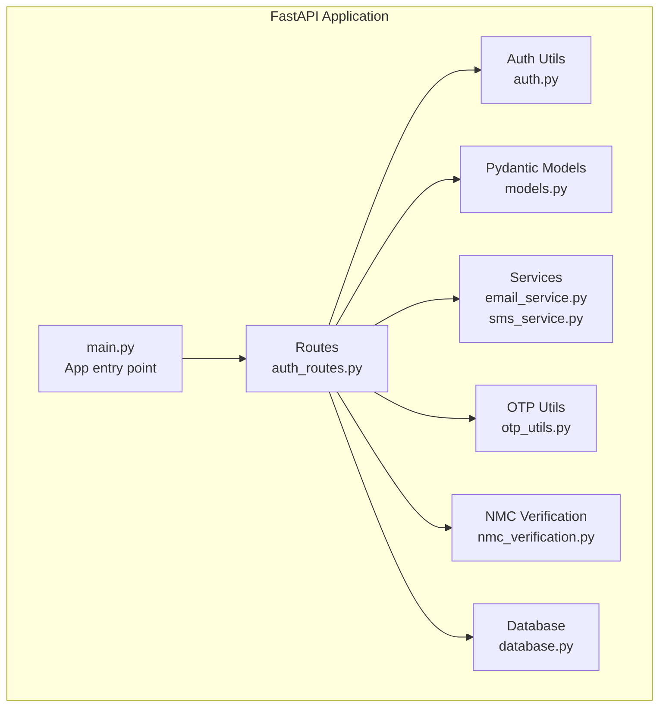
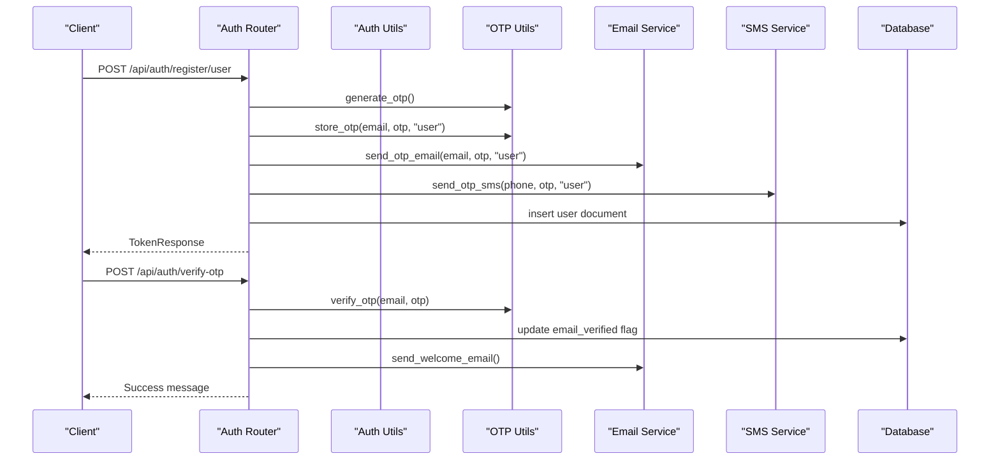
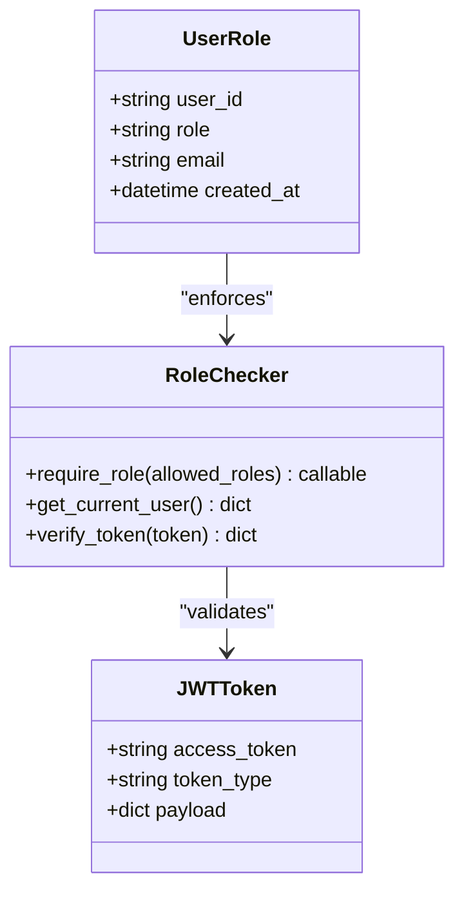
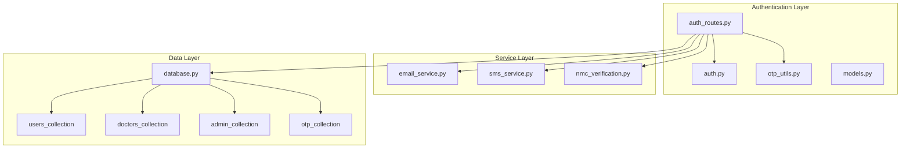

# Authentication Endpoints

<cite>
**Referenced Files in This Document**
- [main.py](file://backend/app/main.py)
- [auth_routes.py](file://backend/app/routes/auth_routes.py)
- [auth.py](file://backend/app/auth.py)
- [models.py](file://backend/app/models.py)
- [otp_utils.py](file://backend/app/otp_utils.py)
- [nmc_verification.py](file://backend/app/nmc_verification.py)
- [email_service.py](file://backend/app/email_service.py)
- [sms_service.py](file://backend/app/sms_service.py)
- [database.py](file://backend/app/database.py)
</cite>

## Table of Contents
1. [Introduction](#introduction)
2. [Project Structure](#project-structure)
3. [Core Components](#core-components)
4. [Architecture Overview](#architecture-overview)
5. [Detailed Component Analysis](#detailed-component-analysis)
6. [Dependency Analysis](#dependency-analysis)
7. [Performance Considerations](#performance-considerations)
8. [Troubleshooting Guide](#troubleshooting-guide)
9. [Conclusion](#conclusion)

## Introduction
This document provides comprehensive API documentation for the authentication system covering user registration, doctor registration with NMC verification, email verification via OTP, login/logout, password reset workflow, and medical document upload. It details HTTP methods, URL patterns, request/response schemas, authentication requirements, error handling, role-based access control, and security measures including password hashing and JWT token creation.

## Project Structure
The authentication system is implemented as part of a FastAPI application with modular routing and centralized authentication utilities.



**Diagram sources**
- [main.py:52-78](file://backend/app/main.py#L52-L78)
- [auth_routes.py:32-36](file://backend/app/routes/auth_routes.py#L32-L36)

**Section sources**
- [main.py:52-78](file://backend/app/main.py#L52-L78)
- [auth_routes.py:32-36](file://backend/app/routes/auth_routes.py#L32-L36)

## Core Components
- Authentication router with base path `/api/auth`
- JWT-based authentication with role-based access control
- OTP-based email verification for registration and password reset
- NMC verification for doctor registration
- Password hashing using bcrypt
- Role-based endpoints with dependency injection

**Section sources**
- [auth_routes.py:32](file://backend/app/routes/auth_routes.py#L32)
- [auth.py:45-55](file://backend/app/auth.py#L45-L55)
- [otp_utils.py:38-40](file://backend/app/otp_utils.py#L38-L40)

## Architecture Overview
The authentication system follows a layered architecture with clear separation of concerns:



**Diagram sources**
- [auth_routes.py:68-132](file://backend/app/routes/auth_routes.py#L68-L132)
- [auth_routes.py:236-304](file://backend/app/routes/auth_routes.py#L236-L304)
- [otp_utils.py:42-90](file://backend/app/otp_utils.py#L42-L90)
- [email_service.py:119-165](file://backend/app/email_service.py#L119-L165)
- [sms_service.py:135-141](file://backend/app/sms_service.py#L135-L141)

## Detailed Component Analysis

### Authentication Endpoints

#### User Registration
- **Method**: POST
- **URL**: `/api/auth/register/user`
- **Purpose**: Register a new user with email verification
- **Request Schema**: UserRegister
- **Response Schema**: TokenResponse
- **Authentication**: Not required
- **Role**: user

**Request Body Fields**:
- name: string (required)
- email: email (required)
- password: string (required, min length 8)
- age: integer (13-120)
- gender: string (allowed: Male, Female, Other, Prefer not to say)
- location: string (min length 2)
- has_previous_stress_issues: boolean (default: false)
- phone_number: string (optional, E.164 format)

**Success Response**:
```json
{
  "user": {
    "id": "string",
    "name": "string",
    "email": "string",
    "role": "user",
    "age": 0,
    "gender": "string",
    "location": "string",
    "email_verified": false
  },
  "message": "Registration successful! Please check your email for the verification code.",
  "access_token": "",
  "token_type": "bearer"
}
```

**Error Scenarios**:
- 400 Bad Request: Email already registered, Invalid gender, Invalid user type
- 500 Internal Server Error: Database insertion failure

**Section sources**
- [auth_routes.py:68-132](file://backend/app/routes/auth_routes.py#L68-L132)
- [models.py:16-31](file://backend/app/models.py#L16-L31)

#### Doctor Registration with NMC Verification
- **Method**: POST
- **URL**: `/api/auth/register/doctor`
- **Purpose**: Register a new doctor with NMC verification and admin approval
- **Request Schema**: DoctorRegister
- **Response Schema**: TokenResponse
- **Authentication**: Not required
- **Role**: doctor

**Request Body Fields**:
- name: string (required)
- email: email (required)
- password: string (required, min length 8)
- license_number: string (required, alphanumeric with dashes, 4-30 chars)
- state_medical_council: string (required, must be valid SMC)
- specialization: string (required)
- available_slots: array of strings (optional)
- phone_number: string (optional, E.164 format)

**Success Response**:
```json
{
  "user": {
    "id": "string",
    "name": "string",
    "email": "string",
    "role": "doctor",
    "is_verified": false,
    "nmc_verified": true,
    "state_medical_council": "string",
    "nmc_profile": {},
    "email_verified": false
  },
  "message": "Registration successful! NMC profile verified. Please verify your email for login; account will be activated after admin approval.",
  "access_token": "",
  "token_type": "bearer"
}
```

**Error Scenarios**:
- 400 Bad Request: License number already registered, Invalid license format
- 503 Service Unavailable: NMC verification service unavailable
- 400 Bad Request: NMC verification failed

**Section sources**
- [auth_routes.py:134-234](file://backend/app/routes/auth_routes.py#L134-L234)
- [models.py:52-61](file://backend/app/models.py#L52-L61)
- [nmc_verification.py:147-214](file://backend/app/nmc_verification.py#L147-L214)

#### Email Verification via OTP
- **Method**: POST
- **URL**: `/api/auth/verify-otp`
- **Purpose**: Verify user's email using 6-digit OTP
- **Request Schema**: OTPVerify
- **Response Schema**: Success message with user details
- **Authentication**: Not required
- **Role**: user/doctor

**Request Body Fields**:
- email: email (required)
- otp: string (exactly 6 digits)

**Success Response**:
```json
{
  "message": "Email verified successfully! You can now log in.",
  "user": {
    "id": "string",
    "name": "string",
    "email": "string",
    "role": "user",
    "email_verified": true,
    "is_verified": false,
    "nmc_verified": false
  }
}
```

**Error Scenarios**:
- 400 Bad Request: Invalid or expired OTP
- 404 Not Found: User not found

**Section sources**
- [auth_routes.py:236-304](file://backend/app/routes/auth_routes.py#L236-L304)
- [models.py:125-127](file://backend/app/models.py#L125-L127)

#### Resend OTP
- **Method**: POST
- **URL**: `/api/auth/resend-otp`
- **Purpose**: Resend OTP to user's email
- **Request Schema**: ResendOTPRequest
- **Response Schema**: Success message
- **Authentication**: Not required
- **Role**: user/doctor

**Section sources**
- [auth_routes.py:306-322](file://backend/app/routes/auth_routes.py#L306-L322)
- [models.py:129-130](file://backend/app/models.py#L129-L130)

#### Login
- **Method**: POST
- **URL**: `/api/auth/login`
- **Purpose**: Authenticate user and return JWT token
- **Request Schema**: UserLogin
- **Response Schema**: TokenResponse
- **Authentication**: Not required
- **Role**: user/doctor/admin

**Request Body Fields**:
- email: email (required)
- password: string (required)

**Success Response**:
```json
{
  "user": {
    "id": "string",
    "name": "string",
    "email": "string",
    "role": "user",
    "email_verified": true
  },
  "access_token": "string",
  "token_type": "bearer"
}
```

**Error Scenarios**:
- 401 Unauthorized: Incorrect email or password
- 403 Forbidden: Email not verified, doctor account not approved
- 401 Unauthorized: Invalid user role

**Section sources**
- [auth_routes.py:377-439](file://backend/app/routes/auth_routes.py#L377-L439)
- [models.py:33-35](file://backend/app/models.py#L33-L35)

#### Logout
- **Method**: POST
- **URL**: `/api/auth/logout`
- **Purpose**: Logout user (JWT token managed client-side)
- **Authentication**: Required (Bearer token)
- **Role**: user/doctor/admin

**Notes**: 
- Logout is handled client-side by clearing the stored JWT token
- No server-side session management is implemented

**Section sources**
- [auth.py:98-151](file://backend/app/auth.py#L98-L151)

#### Change Password
- **Method**: POST
- **URL**: `/api/auth/change-password`
- **Purpose**: Change password for existing user
- **Request Schema**: ChangePassword
- **Response Schema**: Success message
- **Authentication**: Required (Bearer token)
- **Role**: user/doctor/admin

**Request Body Fields**:
- email: email (required)
- current_password: string (required)
- new_password: string (required, min length 8)

**Error Scenarios**:
- 404 Not Found: User not found
- 401 Unauthorized: Current password incorrect

**Section sources**
- [auth_routes.py:442-474](file://backend/app/routes/auth_routes.py#L442-L474)
- [models.py:132-135](file://backend/app/models.py#L132-L135)

#### Medical Document Upload
- **Method**: POST
- **URL**: `/api/auth/upload-medical-document`
- **Purpose**: Upload medical documents for authenticated users
- **Request Schema**: Multipart form-data (file field)
- **Response Schema**: Success message with filename
- **Authentication**: Required (Bearer token)
- **Role**: user

**Request Body Fields**:
- file: UploadFile (required)
  - Allowed types: pdf, jpg, jpeg, png, doc, docx
  - Max size: 10MB

**Success Response**:
```json
{
  "message": "Medical document uploaded successfully",
  "filename": "string"
}
```

**Error Scenarios**:
- 400 Bad Request: Invalid file type, File size exceeds 10MB
- 500 Internal Server Error: Failed to save file

**Section sources**
- [auth_routes.py:324-375](file://backend/app/routes/auth_routes.py#L324-L375)

### Password Reset Workflow (Three-Step Process)

#### Step 1: Request Password Reset
- **Method**: POST
- **URL**: `/api/auth/forgot-password`
- **Purpose**: Send reset OTP to user's email
- **Request Schema**: ForgotPasswordRequest
- **Response Schema**: Success message
- **Authentication**: Not required
- **Role**: user/doctor

**Section sources**
- [auth_routes.py:481-516](file://backend/app/routes/auth_routes.py#L481-L516)

#### Step 2: Verify Reset OTP
- **Method**: POST
- **URL**: `/api/auth/verify-reset-otp`
- **Purpose**: Verify the 6-digit reset OTP
- **Request Schema**: VerifyResetOTPRequest
- **Response Schema**: Success message
- **Authentication**: Not required
- **Role**: user/doctor

**Section sources**
- [auth_routes.py:519-552](file://backend/app/routes/auth_routes.py#L519-L552)

#### Step 3: Reset Password
- **Method**: POST
- **URL**: `/api/auth/reset-password`
- **Purpose**: Set new password after OTP verification
- **Request Schema**: ResetPasswordRequest
- **Response Schema**: Success message
- **Authentication**: Not required
- **Role**: user/doctor

**Section sources**
- [auth_routes.py:555-596](file://backend/app/routes/auth_routes.py#L555-L596)

### Role-Based Access Control
The authentication system implements role-based access control through JWT tokens:



**Diagram sources**
- [auth.py:98-151](file://backend/app/auth.py#L98-L151)
- [auth.py:45-55](file://backend/app/auth.py#L45-L55)

**Section sources**
- [auth.py:98-151](file://backend/app/auth.py#L98-L151)
- [auth.py:45-55](file://backend/app/auth.py#L45-L55)

### Security Measures
- **Password Hashing**: bcrypt with salt generation
- **JWT Tokens**: HS256 algorithm with configurable expiration
- **OTP Security**: Constant-time comparison, 5-minute expiry (registration), 10-minute expiry (password reset)
- **Rate Limiting**: Maximum 3 OTP attempts per verification
- **Email Verification**: Two-step verification for registration
- **SMS Integration**: Optional SMS verification via Fast2SMS API

**Section sources**
- [auth.py:33-43](file://backend/app/auth.py#L33-L43)
- [auth.py:24-31](file://backend/app/auth.py#L24-L31)
- [otp_utils.py:61-90](file://backend/app/otp_utils.py#L61-L90)
- [otp_utils.py:93-120](file://backend/app/otp_utils.py#L93-L120)

## Dependency Analysis



**Diagram sources**
- [auth_routes.py:1-31](file://backend/app/routes/auth_routes.py#L1-L31)
- [database.py:88-146](file://backend/app/database.py#L88-L146)

**Section sources**
- [auth_routes.py:1-31](file://backend/app/routes/auth_routes.py#L1-L31)
- [database.py:88-146](file://backend/app/database.py#L88-L146)

## Performance Considerations
- **Connection Pooling**: MongoDB connection pool with max 50 connections
- **Index Optimization**: Comprehensive indexing for frequent queries
- **Async Operations**: Non-blocking email and SMS sending
- **OTP Storage**: In-memory storage with thread-safe operations
- **JWT Expiration**: Configurable token lifetime (default 24 hours)

## Troubleshooting Guide

### Common Authentication Issues
1. **JWT Token Validation Failures**
   - Check JWT_SECRET_KEY environment variable
   - Verify token expiration time
   - Ensure proper Bearer token format

2. **OTP Verification Problems**
   - Verify OTP expiry (5 minutes for registration, 10 minutes for reset)
   - Check maximum 3 attempts limit
   - Ensure constant-time comparison is working

3. **Email Service Issues**
   - Verify SMTP configuration (SENDER_EMAIL, SENDER_PASSWORD)
   - Check SMTP server settings
   - Monitor email delivery logs

4. **Database Connection Problems**
   - Verify MONGODB_URL configuration
   - Check connection pool settings
   - Monitor database availability

**Section sources**
- [auth.py:24-31](file://backend/app/auth.py#L24-L31)
- [otp_utils.py:61-90](file://backend/app/otp_utils.py#L61-L90)
- [email_service.py:18-26](file://backend/app/email_service.py#L18-L26)
- [database.py:30-46](file://backend/app/database.py#L30-L46)

## Conclusion
The authentication system provides comprehensive user management with robust security measures, role-based access control, and flexible verification mechanisms. The modular design ensures maintainability while the layered architecture supports scalability and performance optimization.