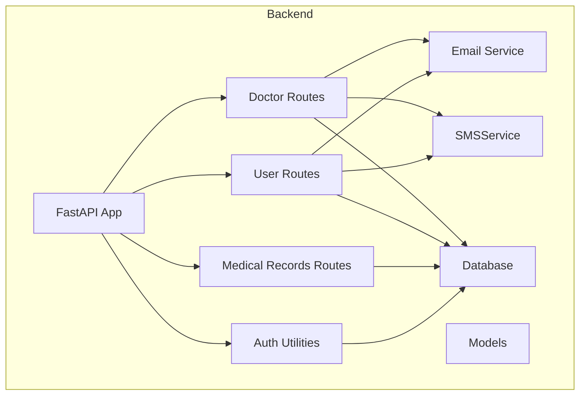
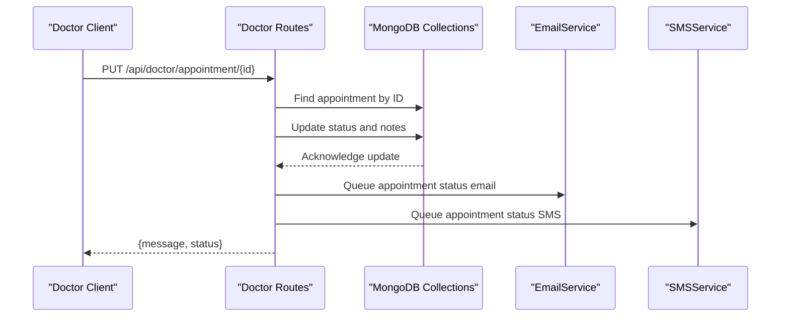
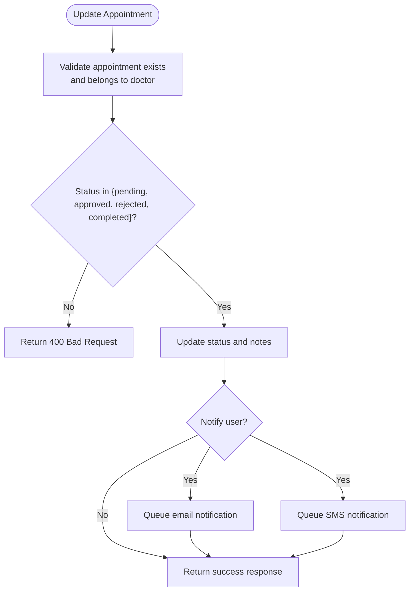
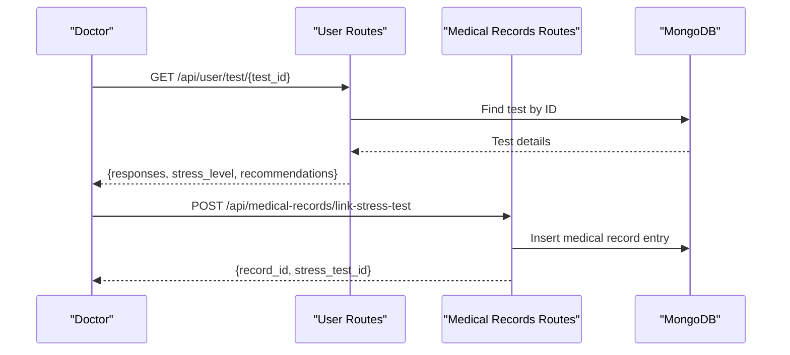
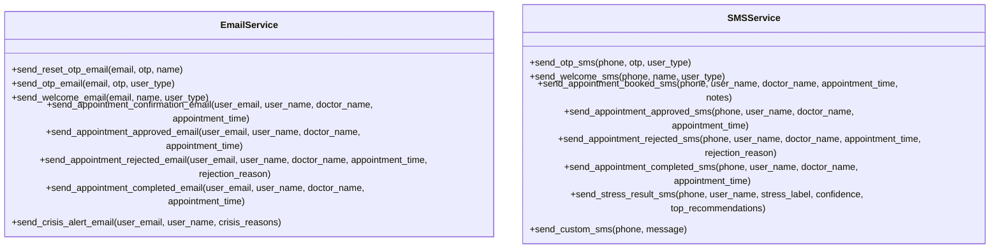
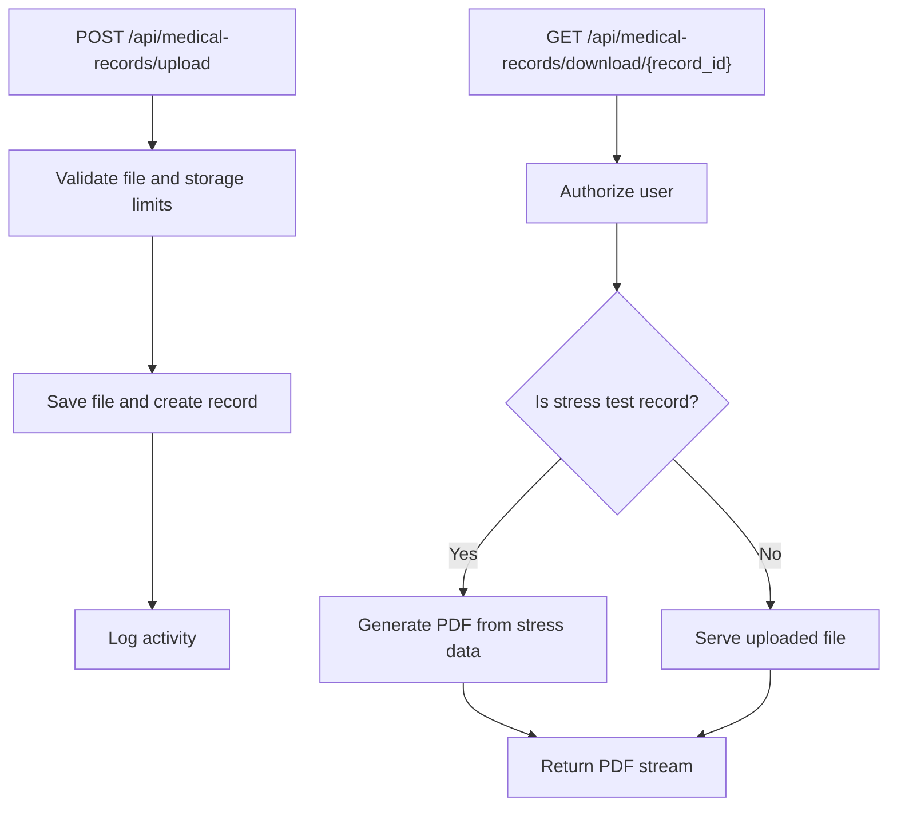
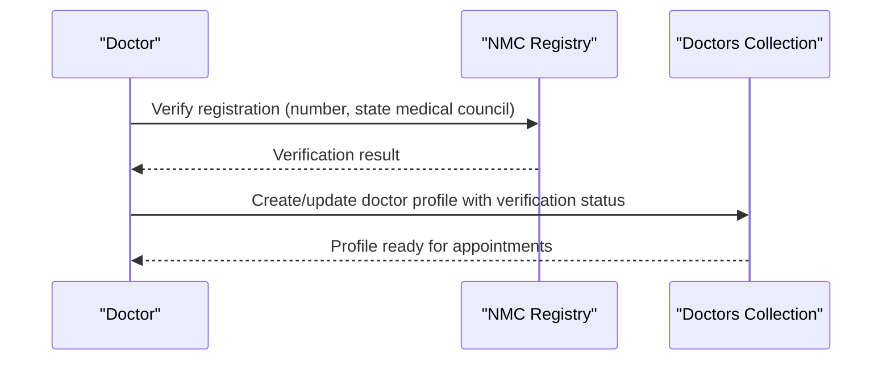
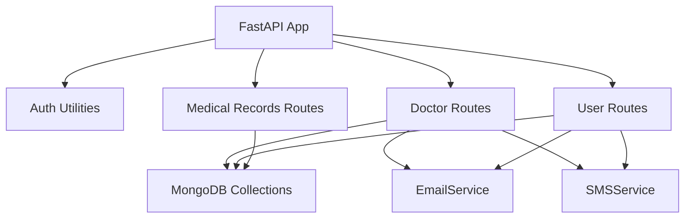

# Doctor Dashboard Endpoints

<cite>
**Referenced Files in This Document**
- [main.py](file://backend/app/main.py)
- [doctor_routes.py](file://backend/app/routes/doctor_routes.py)
- [models.py](file://backend/app/models.py)
- [auth.py](file://backend/app/auth.py)
- [database.py](file://backend/app/database.py)
- [email_service.py](file://backend/app/email_service.py)
- [sms_service.py](file://backend/app/sms_service.py)
- [user_routes.py](file://backend/app/routes/user_routes.py)
- [medical_records_routes.py](file://backend/app/routes/medical_records_routes.py)
- [nmc_verification.py](file://backend/app/nmc_verification.py)
</cite>

## Table of Contents
1. [Introduction](#introduction)
2. [Project Structure](#project-structure)
3. [Core Components](#core-components)
4. [Architecture Overview](#architecture-overview)
5. [Detailed Component Analysis](#detailed-component-analysis)
6. [Dependency Analysis](#dependency-analysis)
7. [Performance Considerations](#performance-considerations)
8. [Troubleshooting Guide](#troubleshooting-guide)
9. [Conclusion](#conclusion)

## Introduction
This document provides comprehensive API documentation for the doctor dashboard endpoints within the AI Stress Detector platform. It covers patient management, appointment scheduling, test result review, consultation notes, and secure patient communication. The documentation includes endpoint definitions, request/response schemas, examples, and operational guidelines for doctor verification, patient consent handling, and HIPAA-compliant data access patterns.

## Project Structure
The backend is structured around FastAPI routers organized by domain:
- Authentication and authorization utilities
- Doctor-specific endpoints for appointments and statistics
- User endpoints for test results and profile management
- Medical records endpoints for secure storage and retrieval
- Supporting services for email and SMS notifications

**Diagram sources**
- [main.py:52-79](file://backend/app/main.py#L52-L79)
- [doctor_routes.py:22](file://backend/app/routes/doctor_routes.py#L22)
- [user_routes.py:32](file://backend/app/routes/user_routes.py#L32)
- [medical_records_routes.py:40](file://backend/app/routes/medical_records_routes.py#L40)

**Section sources**
- [main.py:52-79](file://backend/app/main.py#L52-L79)

## Core Components
- Doctor Routes: Handles doctor-specific operations including appointment listing, status updates, and statistics.
- User Routes: Manages user profile, test results, and related activities.
- Medical Records Routes: Provides secure upload, retrieval, and linking of medical records to stress tests.
- Authentication: Role-based access control with JWT token validation.
- Notifications: Asynchronous email and SMS services for appointment updates and alerts.

**Section sources**
- [doctor_routes.py:48-134](file://backend/app/routes/doctor_routes.py#L48-L134)
- [user_routes.py:45-123](file://backend/app/routes/user_routes.py#L45-L123)
- [medical_records_routes.py:149-278](file://backend/app/routes/medical_records_routes.py#L149-L278)
- [auth.py:98-151](file://backend/app/auth.py#L98-L151)
- [email_service.py:17-493](file://backend/app/email_service.py#L17-L493)
- [sms_service.py:29-249](file://backend/app/sms_service.py#L29-L249)

## Architecture Overview
The doctor dashboard integrates with MongoDB collections for appointments, tests, and users. It leverages asynchronous notifications to minimize response latency during appointment updates. Medical records are optionally linked to stress tests and can be downloaded as PDF reports.

**Diagram sources**
- [doctor_routes.py:171-267](file://backend/app/routes/doctor_routes.py#L171-L267)
- [email_service.py:292-429](file://backend/app/email_service.py#L292-L429)
- [sms_service.py:172-220](file://backend/app/sms_service.py#L172-L220)

## Detailed Component Analysis

### Doctor Appointment Management
Endpoints for retrieving appointments, updating statuses, and fetching statistics.

- GET /api/doctor/appointments/{doctor_id}
  - Description: Retrieve all appointments for a doctor with associated patient test history.
  - Authentication: Requires doctor role.
  - Response: Array of appointment objects with nested test history.
  - Example response fields: id, user_id, user_name, user_email, time_slot, status, notes, created_at, test_history, latest_test.

- GET /api/doctor/appointment/{appointment_id}/patient-tests
  - Description: Retrieve detailed test information for a specific appointment.
  - Response: Includes patient name, email, appointment time, and array of test entries.

- PUT /api/doctor/appointment/{appointment_id}
  - Description: Update appointment status and optional doctor notes.
  - Request body: { status, notes }
  - Behavior: Sends asynchronous email/SMS notifications based on status change.

- PUT /api/doctor/appointment/{appointment_id}/status
  - Description: Alternative endpoint to update appointment status.
  - Request body: { status, notes }

- GET /api/doctor/stats/{doctor_id}
  - Description: Aggregate appointment statistics by status for a doctor.

**Diagram sources**
- [doctor_routes.py:171-364](file://backend/app/routes/doctor_routes.py#L171-L364)

**Section sources**
- [doctor_routes.py:48-134](file://backend/app/routes/doctor_routes.py#L48-L134)
- [doctor_routes.py:136-169](file://backend/app/routes/doctor_routes.py#L136-L169)
- [doctor_routes.py:171-267](file://backend/app/routes/doctor_routes.py#L171-L267)
- [doctor_routes.py:269-364](file://backend/app/routes/doctor_routes.py#L269-L364)
- [doctor_routes.py:366-399](file://backend/app/routes/doctor_routes.py#L366-L399)

### Patient Test Result Review
Endpoints to access and interpret patient test results.

- GET /api/user/test/history/{user_id}
  - Description: Retrieve test history for a user (authorized for user, doctor, admin).
  - Response: Array of test summaries with stress level, label, and timestamp.

- GET /api/user/test/{test_id}
  - Description: Retrieve detailed test results including responses, recommendations, and questions.
  - Authorization: Owner-only for users; doctor/admin can access any patient’s test.

- POST /api/medical-records/link-stress-test
  - Description: Link a stress test to medical records, optionally generating a PDF report.

**Diagram sources**
- [user_routes.py:501-569](file://backend/app/routes/user_routes.py#L501-L569)
- [medical_records_routes.py:941-1004](file://backend/app/routes/medical_records_routes.py#L941-L1004)

**Section sources**
- [user_routes.py:501-569](file://backend/app/routes/user_routes.py#L501-L569)
- [medical_records_routes.py:941-1004](file://backend/app/routes/medical_records_routes.py#L941-L1004)

### Secure Patient Communication
Asynchronous email and SMS notifications for appointment updates.

- EmailService methods:
  - send_appointment_approved_email
  - send_appointment_rejected_email
  - send_appointment_completed_email
  - send_reset_otp_email
  - send_otp_email
  - send_welcome_email

- SMSService methods:
  - send_appointment_approved_sms
  - send_appointment_rejected_sms
  - send_appointment_completed_sms
  - send_stress_result_sms

**Diagram sources**
- [email_service.py:17-493](file://backend/app/email_service.py#L17-L493)
- [sms_service.py:29-249](file://backend/app/sms_service.py#L29-L249)

**Section sources**
- [email_service.py:292-429](file://backend/app/email_service.py#L292-L429)
- [sms_service.py:172-220](file://backend/app/sms_service.py#L172-L220)

### Medical Records Management
Secure storage and retrieval of patient medical documents, with automatic PDF generation for stress tests.

- POST /api/medical-records/upload
  - Description: Upload a medical record file with metadata.
  - Authorization: Must match authenticated user ID.
  - Storage limits enforced per user.

- GET /api/medical-records/user/{user_id}
  - Description: List user’s medical records with optional filters (type, date range, search).

- GET /api/medical-records/{record_id}
  - Description: Retrieve a specific medical record with authorization checks.

- GET /api/medical-records/download/{record_id}
  - Description: Download file or generate PDF for stress test records.

- POST /api/medical-records/link-stress-test
  - Description: Link a stress test to a medical record entry.

**Diagram sources**
- [medical_records_routes.py:149-278](file://backend/app/routes/medical_records_routes.py#L149-L278)
- [medical_records_routes.py:786-885](file://backend/app/routes/medical_records_routes.py#L786-L885)
- [medical_records_routes.py:941-1004](file://backend/app/routes/medical_records_routes.py#L941-L1004)

**Section sources**
- [medical_records_routes.py:149-278](file://backend/app/routes/medical_records_routes.py#L149-L278)
- [medical_records_routes.py:284-407](file://backend/app/routes/medical_records_routes.py#L284-L407)
- [medical_records_routes.py:786-885](file://backend/app/routes/medical_records_routes.py#L786-L885)
- [medical_records_routes.py:941-1004](file://backend/app/routes/medical_records_routes.py#L941-L1004)

### Doctor Verification and Consent
- Doctor verification uses the National Medical Commission (NMC) registry for Indian doctors.
- Consent handling is implicit through role-based access and explicit authorization checks on endpoints.

**Diagram sources**
- [nmc_verification.py:147-214](file://backend/app/nmc_verification.py#L147-L214)
- [database.py:94-103](file://backend/app/database.py#L94-L103)

**Section sources**
- [nmc_verification.py:147-214](file://backend/app/nmc_verification.py#L147-L214)
- [database.py:94-103](file://backend/app/database.py#L94-L103)

## Dependency Analysis
Key dependencies and their roles:
- FastAPI app initializes routers and middleware.
- Authentication enforces role-based access.
- Doctor routes depend on MongoDB collections for appointments and tests.
- Notifications rely on external services (email/SMS providers).
- Medical records depend on file storage and database indexing.

**Diagram sources**
- [main.py:70-79](file://backend/app/main.py#L70-L79)
- [auth.py:98-151](file://backend/app/auth.py#L98-L151)
- [doctor_routes.py:22](file://backend/app/routes/doctor_routes.py#L22)
- [user_routes.py:32](file://backend/app/routes/user_routes.py#L32)
- [medical_records_routes.py:40](file://backend/app/routes/medical_records_routes.py#L40)

**Section sources**
- [main.py:70-79](file://backend/app/main.py#L70-L79)
- [auth.py:98-151](file://backend/app/auth.py#L98-L151)

## Performance Considerations
- Aggregation pipelines optimize appointment retrieval with joined test history in a single query.
- Asynchronous notifications prevent blocking response times.
- Database connection pooling and indexes improve concurrency and query performance.
- File upload validation and storage limits protect server resources.

[No sources needed since this section provides general guidance]

## Troubleshooting Guide
Common issues and resolutions:
- Authentication failures: Ensure Authorization header contains a valid bearer token with correct role.
- Authorization errors: Verify the authenticated user matches the requested resource (e.g., user ID, doctor ID).
- Database connectivity: Health check endpoint validates MongoDB availability.
- Notification delivery: Email/SMS credentials must be configured; otherwise, notifications are disabled.

**Section sources**
- [auth.py:98-151](file://backend/app/auth.py#L98-L151)
- [main.py:114-132](file://backend/app/main.py#L114-L132)
- [email_service.py:17-26](file://backend/app/email_service.py#L17-L26)
- [sms_service.py:40-58](file://backend/app/sms_service.py#L40-L58)

## Conclusion
The doctor dashboard endpoints provide a secure, efficient interface for managing appointments, reviewing patient test results, and communicating with patients through asynchronous notifications. Robust authorization, HIPAA-compliant data handling, and scalable infrastructure ensure reliable operation for healthcare providers.