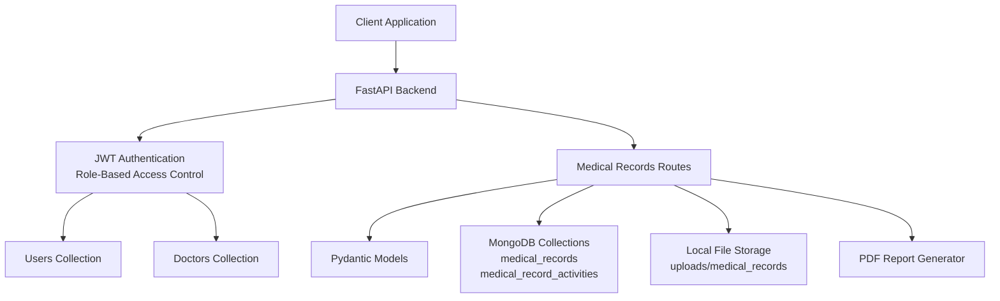
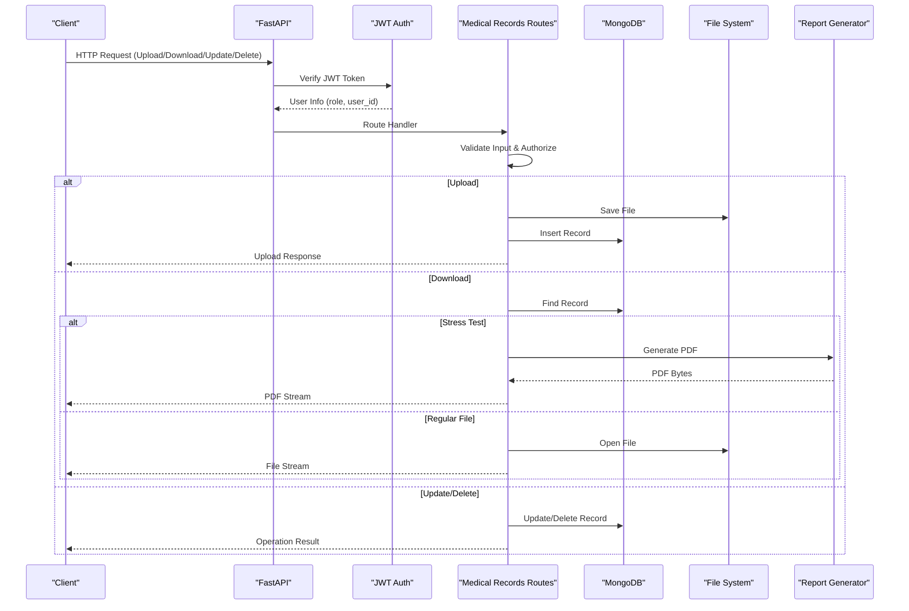
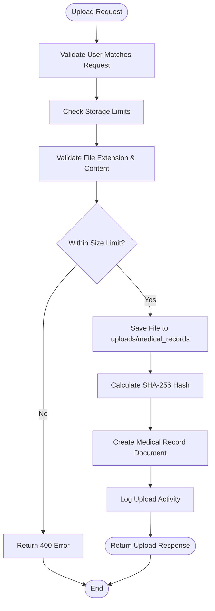
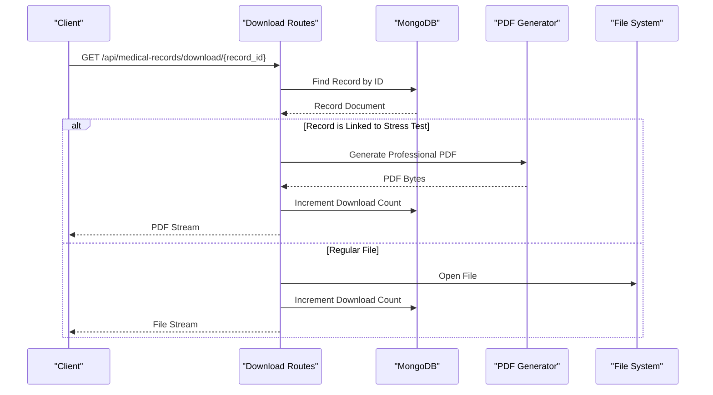
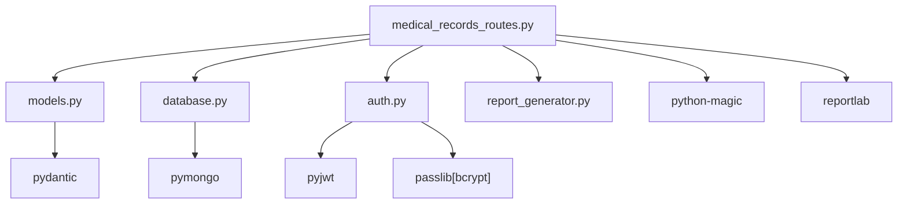

# Medical Records Endpoints

<cite>
**Referenced Files in This Document**
- [medical_records_routes.py](file://backend/app/routes/medical_records_routes.py)
- [models.py](file://backend/app/models.py)
- [database.py](file://backend/app/database.py)
- [auth.py](file://backend/app/auth.py)
- [main.py](file://backend/app/main.py)
- [report_generator.py](file://backend/app/report_generator.py)
- [requirements.txt](file://backend/requirements.txt)
- [README.md](file://README.md)
</cite>

## Table of Contents
1. [Introduction](#introduction)
2. [Project Structure](#project-structure)
3. [Core Components](#core-components)
4. [Architecture Overview](#architecture-overview)
5. [Detailed Component Analysis](#detailed-component-analysis)
6. [Dependency Analysis](#dependency-analysis)
7. [Performance Considerations](#performance-considerations)
8. [Troubleshooting Guide](#troubleshooting-guide)
9. [Conclusion](#conclusion)

## Introduction
This document provides comprehensive API documentation for the medical records management system. It covers secure file upload, document retrieval and download, metadata handling, and automated report generation from test results. The system enforces strict access control, validates file formats and sizes, tracks storage usage, and logs all activities for auditability. It supports both regular document downloads and automatic PDF generation for stress test records.

## Project Structure
The medical records functionality is implemented as part of the FastAPI backend application:
- Routes: `/api/medical-records` endpoints for upload, retrieval, updates, deletion, downloads, bulk downloads, linking stress tests, and statistics
- Models: Pydantic models for request/response schemas and enumerations for record types and file formats
- Database: MongoDB collections for storing medical records and activity logs
- Authentication: JWT-based role-based access control (RBAC) ensuring users can only access their own data
- Report Generation: PDF generation for stress test records using ReportLab

**Diagram sources**
- [main.py:52-80](file://backend/app/main.py#L52-L80)
- [auth.py:98-151](file://backend/app/auth.py#L98-L151)
- [medical_records_routes.py:40-41](file://backend/app/routes/medical_records_routes.py#L40-L41)
- [database.py:148-158](file://backend/app/database.py#L148-L158)

**Section sources**
- [main.py:52-80](file://backend/app/main.py#L52-L80)
- [README.md:700-760](file://README.md#L700-L760)

## Core Components
- Medical Records Routes: Implements all CRUD and utility operations for medical records with validation, authorization, and logging
- Pydantic Models: Defines request/response schemas, enumerations for record types and file formats, and validation rules
- Database Layer: Manages MongoDB collections for medical records and activity logs with optimized indexing
- Authentication: JWT-based RBAC ensuring object-level authorization for user and doctor roles
- Report Generator: Generates professional PDF reports for stress test records

**Section sources**
- [medical_records_routes.py:40-41](file://backend/app/routes/medical_records_routes.py#L40-L41)
- [models.py:276-344](file://backend/app/models.py#L276-L344)
- [database.py:148-158](file://backend/app/database.py#L148-L158)
- [auth.py:98-151](file://backend/app/auth.py#L98-L151)

## Architecture Overview
The medical records system follows a layered architecture with clear separation of concerns:
- Presentation Layer: FastAPI routes handling HTTP requests and responses
- Business Logic Layer: Validation, authorization, file processing, and report generation
- Data Access Layer: MongoDB collections with optimized indexes for performance
- Security Layer: JWT authentication and role-based access control

**Diagram sources**
- [medical_records_routes.py:149-278](file://backend/app/routes/medical_records_routes.py#L149-L278)
- [medical_records_routes.py:786-885](file://backend/app/routes/medical_records_routes.py#L786-L885)
- [medical_records_routes.py:413-500](file://backend/app/routes/medical_records_routes.py#L413-L500)
- [medical_records_routes.py:506-546](file://backend/app/routes/medical_records_routes.py#L506-L546)

## Detailed Component Analysis

### File Upload Workflow
The upload process validates files, enforces size limits, checks allowed formats, and stores documents securely:

**Diagram sources**
- [medical_records_routes.py:149-278](file://backend/app/routes/medical_records_routes.py#L149-L278)

**Section sources**
- [medical_records_routes.py:68-131](file://backend/app/routes/medical_records_routes.py#L68-L131)
- [medical_records_routes.py:149-278](file://backend/app/routes/medical_records_routes.py#L149-L278)

### Document Retrieval and Download
The system supports retrieving individual records and downloading files with automatic PDF generation for stress test records:

**Diagram sources**
- [medical_records_routes.py:786-885](file://backend/app/routes/medical_records_routes.py#L786-L885)
- [medical_records_routes.py:556-783](file://backend/app/routes/medical_records_routes.py#L556-L783)

**Section sources**
- [medical_records_routes.py:786-885](file://backend/app/routes/medical_records_routes.py#L786-L885)

### Metadata Management
The system handles comprehensive metadata for medical records including:
- Basic metadata: record name, type, description, dates, doctor/hospital information
- File metadata: size, format, hash, path, download count
- Tags and categorization for search and filtering
- Linking to stress test results with embedded data

**Section sources**
- [models.py:312-344](file://backend/app/models.py#L312-L344)
- [medical_records_routes.py:229-250](file://backend/app/routes/medical_records_routes.py#L229-L250)

### Report Generation from Test Results
Automated PDF generation creates professional reports for stress test records with:
- Stress level classification and confidence scores
- Detailed question-response analysis
- Category-wise breakdown of symptoms
- Personalized recommendations
- Professional styling and branding

**Section sources**
- [medical_records_routes.py:556-783](file://backend/app/routes/medical_records_routes.py#L556-L783)
- [report_generator.py:38-235](file://backend/app/report_generator.py#L38-L235)

### Access Control and Security
The system implements robust security measures:
- JWT-based authentication with configurable expiration
- Role-based access control (user, doctor, admin)
- Object-level authorization ensuring users can only access their own records
- Input validation via Pydantic models
- File validation with MIME type checking and content signature verification
- Activity logging for all operations

**Section sources**
- [auth.py:98-151](file://backend/app/auth.py#L98-L151)
- [medical_records_routes.py:164-169](file://backend/app/routes/medical_records_routes.py#L164-L169)
- [medical_records_routes.py:294-308](file://backend/app/routes/medical_records_routes.py#L294-L308)

## Dependency Analysis
The medical records system has the following key dependencies:

**Diagram sources**
- [requirements.txt:1-22](file://backend/requirements.txt#L1-L22)
- [medical_records_routes.py:24-38](file://backend/app/routes/medical_records_routes.py#L24-L38)

**Section sources**
- [requirements.txt:1-22](file://backend/requirements.txt#L1-L22)

## Performance Considerations
- Database indexing: Optimized indexes on user_id, record_type, uploaded_at, and compound queries for efficient lookups
- Connection pooling: MongoDB connection pool with maxPoolSize=50 for concurrent operations
- File streaming: Uses StreamingResponse for large file downloads to minimize memory usage
- Storage limits: Per-user storage quotas prevent abuse and ensure fair resource allocation
- Background processing: Report generation occurs synchronously but is lightweight for typical use cases

## Troubleshooting Guide
Common issues and solutions:

### File Upload Failures
- **Invalid file type**: Ensure files match allowed extensions (.pdf, .jpg, .jpeg, .png, .doc, .docx)
- **File too large**: Maximum size is 10MB; compress or convert files if needed
- **Storage limit exceeded**: Users have 100MB storage quota; delete old records to free space
- **Missing filename**: Some clients may send empty filenames; ensure proper file selection

### Download Issues
- **File not found**: Verify record_id exists and belongs to the requesting user
- **Permission denied**: Ensure you're logged in as the correct user role
- **PDF generation failed**: Check that stress test data is properly linked to the record

### Authentication Problems
- **Invalid token**: Re-authenticate to obtain a new JWT token
- **Expired token**: Tokens expire after ACCESS_TOKEN_EXPIRE_MINUTES (default 1440 minutes)
- **Role restrictions**: Users cannot access doctor-only endpoints and vice versa

**Section sources**
- [medical_records_routes.py:68-131](file://backend/app/routes/medical_records_routes.py#L68-L131)
- [auth.py:57-71](file://backend/app/auth.py#L57-L71)

## Conclusion
The medical records system provides a comprehensive, secure, and scalable solution for managing sensitive medical documentation. It combines robust security measures with user-friendly features including automated report generation, bulk operations, and comprehensive search capabilities. The system's modular design and clear separation of concerns make it maintainable and extensible for future enhancements.