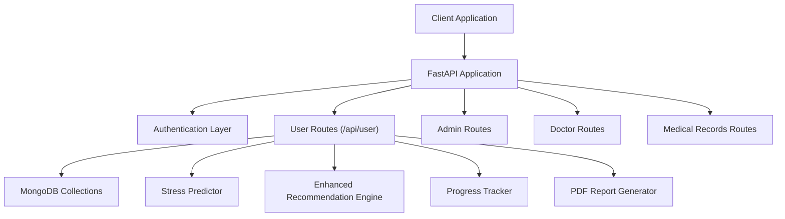
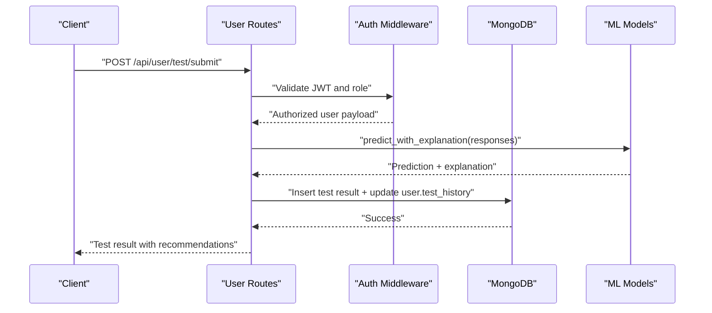
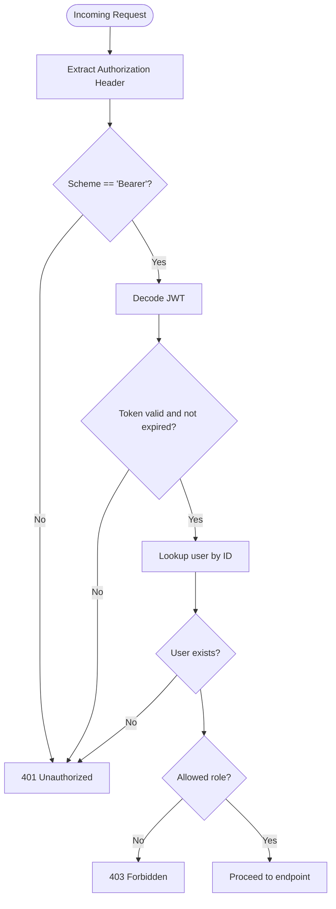
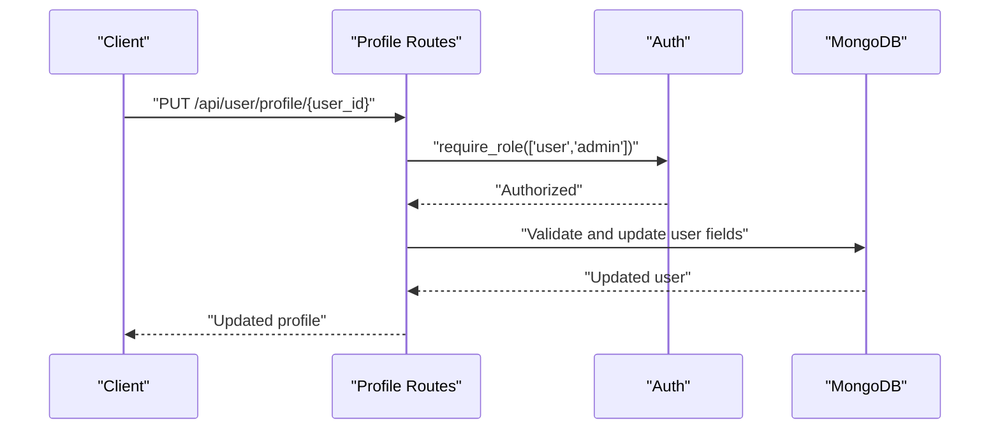
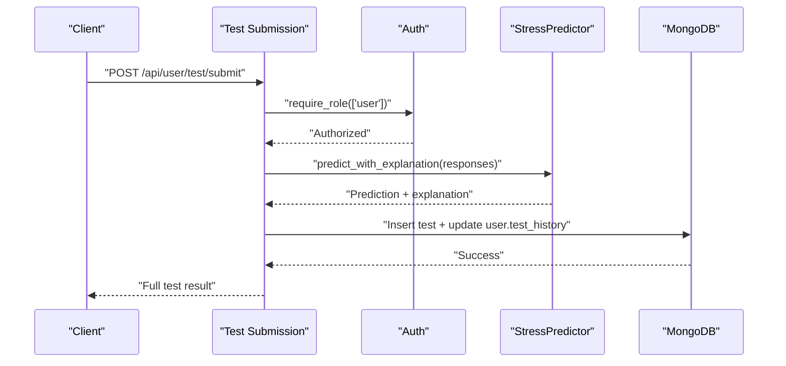
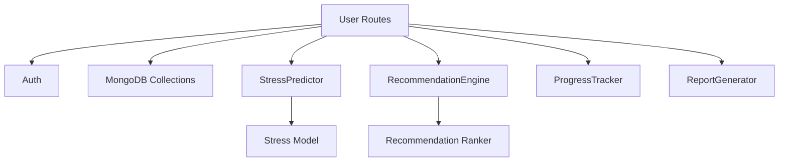

# User Dashboard Endpoints

<cite>
**Referenced Files in This Document**
- [main.py](file://backend/app/main.py)
- [user_routes.py](file://backend/app/routes/user_routes.py)
- [auth.py](file://backend/app/auth.py)
- [models.py](file://backend/app/models.py)
- [database.py](file://backend/app/database.py)
- [recommendation_engine.py](file://backend/app/recommendation_engine.py)
- [progress_tracker.py](file://backend/app/progress_tracker.py)
- [predictor.py](file://backend/ml_model/predictor.py)
- [recommendation_ranker.py](file://backend/ml_model/recommendation_ranker.py)
- [report_generator.py](file://backend/app/report_generator.py)
</cite>

## Table of Contents
1. [Introduction](#introduction)
2. [Project Structure](#project-structure)
3. [Core Components](#core-components)
4. [Architecture Overview](#architecture-overview)
5. [Detailed Component Analysis](#detailed-component-analysis)
6. [Dependency Analysis](#dependency-analysis)
7. [Performance Considerations](#performance-considerations)
8. [Troubleshooting Guide](#troubleshooting-guide)
9. [Conclusion](#conclusion)

## Introduction
This document provides comprehensive API documentation for the user dashboard endpoints in the AI Stress Detector platform. It covers questionnaire submission, test history management, recommendation retrieval, personal information updates, progress tracking, stress assessment completion, result viewing, recommendation filtering, gamification data access, and user profile management. The documentation includes request/response schemas, examples, authentication requirements, validation rules, and error handling tailored for user-specific operations.

## Project Structure
The backend is structured around FastAPI routers organized by functional domains. The user dashboard endpoints reside under `/api/user` and integrate with authentication, database collections, machine learning prediction engines, recommendation systems, and progress tracking modules.

**Diagram sources**
- [main.py:52-79](file://backend/app/main.py#L52-L79)
- [user_routes.py:32-39](file://backend/app/routes/user_routes.py#L32-L39)

**Section sources**
- [main.py:52-79](file://backend/app/main.py#L52-L79)
- [user_routes.py:32-39](file://backend/app/routes/user_routes.py#L32-L39)

## Core Components
- Authentication and Authorization: JWT-based authentication with role-based access control enforced via dependency injection.
- User Routes: Centralized user dashboard endpoints including profile management, questionnaire access, test submission, result retrieval, recommendation generation, progress tracking, and gamification data.
- Machine Learning Prediction Engine: Provides stress predictions, SHAP explanations, category scores, risk factors, trend analysis, and crisis detection.
- Recommendation Engine: Generates personalized recommendations categorized by immediate, daily, weekly, lifestyle, and professional needs.
- Progress Tracker: Manages recommendation progress, streaks, points, badges, and level calculations.
- Database Collections: Users, tests, appointments, recommendation progress, achievements, and reminders collections with optimized indexing.

**Section sources**
- [auth.py:98-151](file://backend/app/auth.py#L98-L151)
- [user_routes.py:32-39](file://backend/app/routes/user_routes.py#L32-L39)
- [predictor.py:32-46](file://backend/ml_model/predictor.py#L32-L46)
- [recommendation_engine.py:11-16](file://backend/app/recommendation_engine.py#L11-L16)
- [progress_tracker.py:48-134](file://backend/app/progress_tracker.py#L48-L134)
- [database.py:88-140](file://backend/app/database.py#L88-L140)

## Architecture Overview
The user dashboard endpoints follow a layered architecture:
- Presentation Layer: FastAPI routes under `/api/user`.
- Business Logic Layer: Orchestration of ML models, recommendation engine, and progress tracker.
- Data Access Layer: MongoDB collections with optimized indexes.
- External Services: SMS/email notifications, Groq LLM for chatbot and scoring fallbacks.

**Diagram sources**
- [user_routes.py:407-499](file://backend/app/routes/user_routes.py#L407-L499)
- [auth.py:98-151](file://backend/app/auth.py#L98-L151)
- [predictor.py:146-185](file://backend/ml_model/predictor.py#L146-L185)

## Detailed Component Analysis

### Authentication and Authorization
- JWT-based authentication with configurable expiration and algorithm.
- Role-based access control using a dependency that validates the Authorization header and checks user existence and role.
- Supported roles for user endpoints include "user" and "admin".

**Diagram sources**
- [auth.py:98-151](file://backend/app/auth.py#L98-L151)

**Section sources**
- [auth.py:24-31](file://backend/app/auth.py#L24-L31)
- [auth.py:98-151](file://backend/app/auth.py#L98-L151)

### User Profile Management
Endpoints:
- GET `/api/user/profile/{user_id}`: Retrieve user profile with validation and authorization.
- PUT `/api/user/profile/{user_id}`: Update user profile with validation rules for gender and optional fields.

Validation rules:
- Age between 13 and 120.
- Gender must be one of "Male", "Female", "Other", "Prefer not to say".
- Location minimum length 2.
- At least one field must be provided for updates.

**Diagram sources**
- [user_routes.py:70-123](file://backend/app/routes/user_routes.py#L70-L123)
- [auth.py:98-151](file://backend/app/auth.py#L98-L151)

**Section sources**
- [user_routes.py:45-67](file://backend/app/routes/user_routes.py#L45-L67)
- [user_routes.py:70-123](file://backend/app/routes/user_routes.py#L70-L123)
- [models.py:137-143](file://backend/app/models.py#L137-L143)

### Questionnaire Access
Endpoint:
- GET `/api/user/questionnaire`: Returns the CBT-based stress assessment questionnaire with instructions and scoring scale.

Response schema:
- questions: Array of question objects with id, question text, and category.
- instructions: String describing the 1-5 scale.
- scale: Object mapping scale values to descriptions.

**Section sources**
- [user_routes.py:171-184](file://backend/app/routes/user_routes.py#L171-L184)

### Stress Assessment Submission
Endpoints:
- POST `/api/user/test/submit`: Submit 18-questionnaire responses and receive ML-predicted stress level, confidence, recommendations, and explainability data.
- POST `/api/user/video-test/submit`: Submit video-based assessment with multimodal pipeline and LLM fallback scoring.

Validation rules:
- Exactly 18 responses for questionnaire submission.
- Each response must be an integer between 1 and 5.
- Verbal responses array must contain exactly 18 natural language answers for video assessment.

Processing logic:
- ML prediction with SHAP explanation, category scores, risk factors, and continuous score.
- Trend analysis and crisis detection computed from test history.
- Test result persisted with user association and SMS/email notifications for alerts.

**Diagram sources**
- [user_routes.py:407-499](file://backend/app/routes/user_routes.py#L407-L499)
- [predictor.py:146-185](file://backend/ml_model/predictor.py#L146-L185)

**Section sources**
- [user_routes.py:407-499](file://backend/app/routes/user_routes.py#L407-L499)
- [user_routes.py:308-400](file://backend/app/routes/user_routes.py#L308-L400)
- [predictor.py:119-144](file://backend/ml_model/predictor.py#L119-L144)

### Test History Management
Endpoints:
- GET `/api/user/test/history/{user_id}`: Retrieve user's test history with authorization checks.
- GET `/api/user/test/{test_id}`: Retrieve detailed test results with question text and authorization.
- GET `/api/user/test/{test_id}/explanation`: Retrieve SHAP explanation, category scores, risk factors, and continuous score.
- GET `/api/user/test/{test_id}/report`: Generate and return a PDF report for a specific test.
- GET `/api/user/stress-trend/{user_id}`: Get stress trend analysis for a user.
- GET `/api/user/analytics/{user_id}`: Get personal analytics for a user.
- GET `/api/user/doctor-match/{user_id}`: Get smart doctor recommendations based on stress profile.

Authorization:
- Users can only access their own data.
- Doctors/admins can access patient data with appropriate permissions.

**Section sources**
- [user_routes.py:501-532](file://backend/app/routes/user_routes.py#L501-L532)
- [user_routes.py:534-569](file://backend/app/routes/user_routes.py#L534-L569)
- [user_routes.py:1178-1227](file://backend/app/routes/user_routes.py#L1178-L1227)
- [user_routes.py:1229-1261](file://backend/app/routes/user_routes.py#L1229-L1261)
- [user_routes.py:1263-1276](file://backend/app/routes/user_routes.py#L1263-L1276)
- [user_routes.py:1279-1294](file://backend/app/routes/user_routes.py#L1279-L1294)
- [user_routes.py:1297-1316](file://backend/app/routes/user_routes.py#L1297-L1316)

### Recommendation Retrieval and Progress Tracking
Endpoints:
- POST `/api/user/recommendations/enhanced`: Get enhanced, personalized recommendations based on test results and user profile.
- POST `/api/user/recommendations/start`: Mark a recommendation as started with optional reminders.
- POST `/api/user/recommendations/complete`: Mark a recommendation as completed and award points/badges.
- DELETE `/api/user/recommendations/{user_id}/{recommendation_id}`: Dismiss a recommendation.
- POST `/api/user/recommendations/save`: Save a recommendation for later.
- GET `/api/user/achievements/{user_id}`: Get user achievements, badges, points, and level.
- GET `/api/user/progress/{user_id}`: Get user's recommendation progress.
- GET `/api/user/leaderboard`: Get top users by points.

Recommendation categories:
- summary: Personalized summary with priority and action required.
- immediate: 0-5 minute immediate relief techniques.
- daily: 15-30 minute daily habits.
- weekly: 1-2 hour per week goals.
- lifestyle: Long-term lifestyle recommendations.
- professional: Professional support recommendations.
- personalized: Tips based on demographics and responses.
- resources: Curated external resources.
- quick_wins: Quick 30-second to 1-minute techniques.

Gamification data:
- Badges, points, level, streaks, meditation/exercise/journal/therapy metrics.
- Level calculation and points to next level.

**Section sources**
- [user_routes.py:575-647](file://backend/app/routes/user_routes.py#L575-L647)
- [user_routes.py:649-702](file://backend/app/routes/user_routes.py#L649-L702)
- [user_routes.py:704-753](file://backend/app/routes/user_routes.py#L704-L753)
- [user_routes.py:759-820](file://backend/app/routes/user_routes.py#L759-L820)
- [user_routes.py:822-858](file://backend/app/routes/user_routes.py#L822-L858)
- [user_routes.py:860-890](file://backend/app/routes/user_routes.py#L860-L890)
- [recommendation_engine.py:17-58](file://backend/app/recommendation_engine.py#L17-L58)
- [recommendation_engine.py:518-551](file://backend/app/recommendation_engine.py#L518-L551)
- [progress_tracker.py:48-454](file://backend/app/progress_tracker.py#L48-L454)

### Chatbot and Doctor Matching
- POST `/api/user/chatbot/chat`: Chat with AI counselor that detects stress levels and suggests practical strategies.
- GET `/api/user/doctor-match/{user_id}`: Smart doctor recommendations based on stress profile and effectiveness.

**Section sources**
- [user_routes.py:1055-1172](file://backend/app/routes/user_routes.py#L1055-L1172)
- [user_routes.py:1297-1316](file://backend/app/routes/user_routes.py#L1297-L1316)

## Dependency Analysis
The user dashboard endpoints depend on:
- Authentication middleware for JWT validation and role checks.
- MongoDB collections for persistence of user profiles, test results, appointments, recommendation progress, and achievements.
- Machine learning models for stress prediction, explainability, trend analysis, and crisis detection.
- Recommendation engine for generating personalized recommendations.
- Progress tracker for gamification and achievement management.
- Report generator for PDF report creation.

**Diagram sources**
- [user_routes.py:32-39](file://backend/app/routes/user_routes.py#L32-L39)
- [predictor.py:32-46](file://backend/ml_model/predictor.py#L32-L46)
- [recommendation_engine.py:11-16](file://backend/app/recommendation_engine.py#L11-L16)
- [recommendation_ranker.py:9-108](file://backend/ml_model/recommendation_ranker.py#L9-L108)
- [progress_tracker.py:48-134](file://backend/app/progress_tracker.py#L48-L134)
- [report_generator.py:38-341](file://backend/app/report_generator.py#L38-L341)

**Section sources**
- [user_routes.py:32-39](file://backend/app/routes/user_routes.py#L32-L39)
- [predictor.py:32-46](file://backend/ml_model/predictor.py#L32-L46)
- [recommendation_engine.py:11-16](file://backend/app/recommendation_engine.py#L11-L16)
- [recommendation_ranker.py:9-108](file://backend/ml_model/recommendation_ranker.py#L9-L108)
- [progress_tracker.py:48-134](file://backend/app/progress_tracker.py#L48-L134)
- [report_generator.py:38-341](file://backend/app/report_generator.py#L38-L341)

## Performance Considerations
- Database indexing: Compound indexes on user_id + timestamp for tests and appointments, unique indexes for progress tracking, and text search for medical records improve query performance.
- Connection pooling: MongoDB client configured with maxPoolSize=50 and timeouts for better concurrency.
- Recommendation ranking: Neural network-based ranker trained on synthetic data to personalize recommendation ordering.
- Trend analysis: Linear regression on continuous scores for trend detection and forecasting.

[No sources needed since this section provides general guidance]

## Troubleshooting Guide
Common errors and resolutions:
- 401 Unauthorized: Missing or invalid Authorization header; ensure Bearer token is provided and valid.
- 403 Forbidden: Insufficient role or attempting to access another user's data; verify user_id matches token subject.
- 400 Bad Request: Invalid ObjectId format or validation failures (e.g., wrong number of responses, out-of-range values).
- 404 Not Found: User or test not found; confirm identifiers exist in the database.
- 500 Internal Server Error: ML model loading failures, database unavailability, or service exceptions; check logs and environment variables.

**Section sources**
- [user_routes.py:501-510](file://backend/app/routes/user_routes.py#L501-L510)
- [user_routes.py:534-557](file://backend/app/routes/user_routes.py#L534-L557)
- [auth.py:103-151](file://backend/app/auth.py#L103-L151)

## Conclusion
The user dashboard endpoints provide a comprehensive suite of features for stress assessment, recommendation delivery, progress tracking, and gamification. They enforce strict authentication and authorization, incorporate robust validation, and leverage machine learning for explainable predictions and personalized recommendations. The modular architecture ensures scalability and maintainability while supporting user-centric workflows.