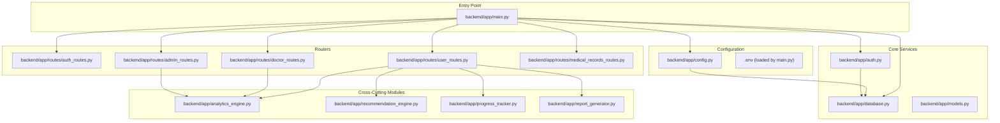
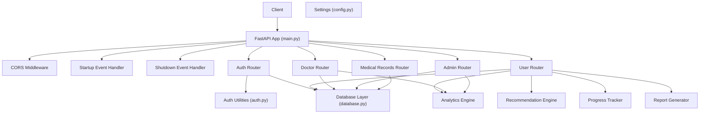
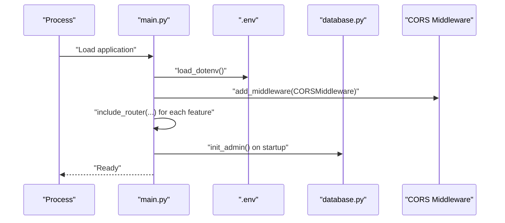
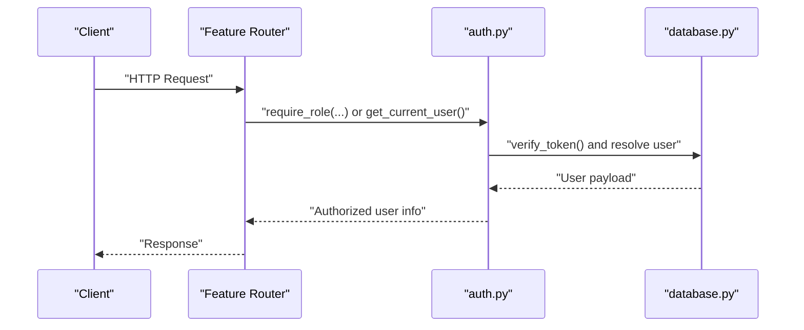
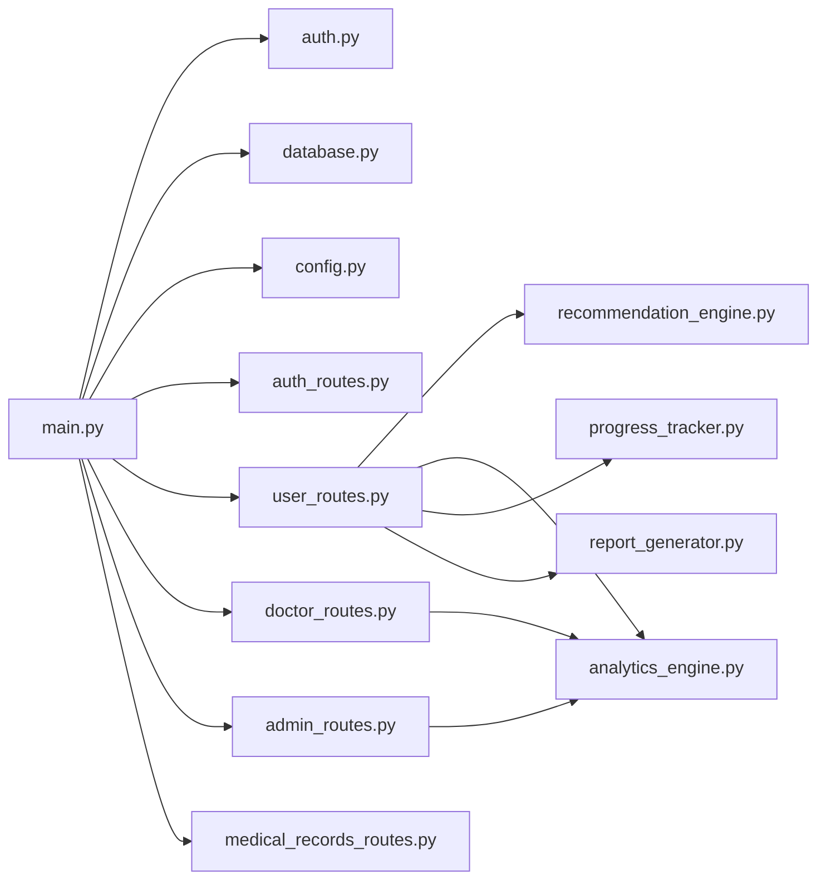

# Application Structure

<cite>
**Referenced Files in This Document**
- [main.py](file://backend/app/main.py)
- [config.py](file://backend/app/config.py)
- [database.py](file://backend/app/database.py)
- [models.py](file://backend/app/models.py)
- [auth.py](file://backend/app/auth.py)
- [auth_routes.py](file://backend/app/routes/auth_routes.py)
- [user_routes.py](file://backend/app/routes/user_routes.py)
- [doctor_routes.py](file://backend/app/routes/doctor_routes.py)
- [admin_routes.py](file://backend/app/routes/admin_routes.py)
- [medical_records_routes.py](file://backend/app/routes/medical_records_routes.py)
- [analytics_engine.py](file://backend/app/analytics_engine.py)
- [recommendation_engine.py](file://backend/app/recommendation_engine.py)
- [progress_tracker.py](file://backend/app/progress_tracker.py)
- [report_generator.py](file://backend/app/report_generator.py)
</cite>

## Table of Contents
1. [Introduction](#introduction)
2. [Project Structure](#project-structure)
3. [Core Components](#core-components)
4. [Architecture Overview](#architecture-overview)
5. [Detailed Component Analysis](#detailed-component-analysis)
6. [Dependency Analysis](#dependency-analysis)
7. [Performance Considerations](#performance-considerations)
8. [Troubleshooting Guide](#troubleshooting-guide)
9. [Conclusion](#conclusion)

## Introduction
This document explains the FastAPI application structure and organization for the AI Stress Level Analyzer. It covers the entry point configuration, application initialization, modular routing system, CORS middleware, environment variable loading, startup/shutdown handlers, application factory pattern, dependency injection, configuration management, logging setup, and error handling patterns. It also provides practical guidance for adding new routes and integrating them into the main application.

## Project Structure
The backend follows a layered, feature-based organization:
- Entry point and application bootstrap live in the main module.
- Feature-specific routers are grouped under a dedicated routes package.
- Shared cross-cutting concerns (authentication, analytics, recommendations, progress tracking, reporting) are implemented as cohesive modules.
- Data access and configuration are centralized.

**Diagram sources**
- [main.py:1-137](file://backend/app/main.py#L1-L137)
- [config.py:1-22](file://backend/app/config.py#L1-L22)
- [database.py:1-509](file://backend/app/database.py#L1-L509)
- [auth.py:1-190](file://backend/app/auth.py#L1-L190)
- [auth_routes.py:1-596](file://backend/app/routes/auth_routes.py#L1-L596)
- [user_routes.py:1-800](file://backend/app/routes/user_routes.py#L1-L800)
- [doctor_routes.py:1-400](file://backend/app/routes/doctor_routes.py#L1-L400)
- [admin_routes.py:1-225](file://backend/app/routes/admin_routes.py#L1-L225)
- [medical_records_routes.py:1-1054](file://backend/app/routes/medical_records_routes.py#L1-L1054)
- [analytics_engine.py:1-384](file://backend/app/analytics_engine.py#L1-L384)
- [recommendation_engine.py:1-554](file://backend/app/recommendation_engine.py#L1-L554)
- [progress_tracker.py:1-454](file://backend/app/progress_tracker.py#L1-L454)
- [report_generator.py:1-341](file://backend/app/report_generator.py#L1-L341)

**Section sources**
- [main.py:1-137](file://backend/app/main.py#L1-L137)
- [config.py:1-22](file://backend/app/config.py#L1-L22)

## Core Components
- Application entry point and initialization:
  - Loads environment variables from a .env file located alongside the backend.
  - Creates a FastAPI app with metadata and registers routers for authentication, user, doctor, admin, and optionally medical records.
  - Configures CORS middleware with validated origins from environment variables.
  - Registers startup and shutdown events for database initialization and cleanup.
- Configuration management:
  - Centralized settings via Pydantic Settings with environment-backed defaults.
- Authentication and authorization:
  - JWT-based authentication with role-aware dependency injection.
  - Password hashing and token lifecycle management.
- Database layer:
  - MongoDB connection with connection pooling, timeouts, and graceful shutdown.
  - Index creation for performance and admin initialization.
- Cross-cutting services:
  - Analytics engine for platform insights.
  - Recommendation engine for personalized care plans.
  - Progress tracker for gamification and achievements.
  - Report generator for PDF exports.

**Section sources**
- [main.py:14-98](file://backend/app/main.py#L14-L98)
- [config.py:1-22](file://backend/app/config.py#L1-L22)
- [auth.py:24-31](file://backend/app/auth.py#L24-L31)
- [database.py:30-82](file://backend/app/database.py#L30-L82)
- [analytics_engine.py:11-20](file://backend/app/analytics_engine.py#L11-L20)
- [recommendation_engine.py:11-16](file://backend/app/recommendation_engine.py#L11-L16)
- [progress_tracker.py:48-50](file://backend/app/progress_tracker.py#L48-L50)
- [report_generator.py:38-49](file://backend/app/report_generator.py#L38-L49)

## Architecture Overview
The application uses a modular FastAPI architecture with explicit separation of concerns:
- Entry point composes the app and wires routers.
- Routers encapsulate feature-specific endpoints and depend on shared services.
- Services (analytics, recommendations, progress tracking, reporting) are injected into routers via dependency injection and factory functions.
- Middleware (CORS) and event handlers (startup/shutdown) are registered centrally.

**Diagram sources**
- [main.py:52-98](file://backend/app/main.py#L52-L98)
- [auth_routes.py:32-32](file://backend/app/routes/auth_routes.py#L32-L32)
- [user_routes.py:32-39](file://backend/app/routes/user_routes.py#L32-L39)
- [doctor_routes.py:22-22](file://backend/app/routes/doctor_routes.py#L22-L22)
- [admin_routes.py:9-12](file://backend/app/routes/admin_routes.py#L9-L12)
- [medical_records_routes.py:40-41](file://backend/app/routes/medical_records_routes.py#L40-L41)
- [auth.py:16-21](file://backend/app/auth.py#L16-L21)
- [database.py:24-46](file://backend/app/database.py#L24-L46)
- [config.py:3-21](file://backend/app/config.py#L3-L21)
- [analytics_engine.py:381-384](file://backend/app/analytics_engine.py#L381-L384)
- [recommendation_engine.py:553-554](file://backend/app/recommendation_engine.py#L553-L554)
- [progress_tracker.py:418-434](file://backend/app/progress_tracker.py#L418-L434)
- [report_generator.py:340-341](file://backend/app/report_generator.py#L340-L341)

## Detailed Component Analysis

### Application Initialization and Entry Point
- Environment loading:
  - Loads .env from the backend directory before importing modules that rely on environment variables.
- CORS configuration:
  - Reads ALLOWED_ORIGINS from environment, validates and normalizes them, and applies strict CORS policy.
- Router composition:
  - Includes routers for auth, user, doctor, admin, and conditionally medical records.
- Startup and shutdown:
  - On startup: initializes admin, ensures upload directories exist, and logs operational status.
  - On shutdown: closes MongoDB connections gracefully.
- Health endpoint:
  - Verifies database connectivity and returns feature availability flags.

**Diagram sources**
- [main.py:14-98](file://backend/app/main.py#L14-L98)
- [database.py:307-338](file://backend/app/database.py#L307-L338)

**Section sources**
- [main.py:14-98](file://backend/app/main.py#L14-L98)
- [database.py:307-338](file://backend/app/database.py#L307-L338)

### Modular Routing System
- Routers are feature-scoped and prefixed for clarity:
  - /api/auth (authentication, OTP, password reset)
  - /api/user (questionnaire, testing, recommendations, progress, achievements)
  - /api/doctor (appointments, doctor stats, notifications)
  - /api/admin (analytics, user/doctor management)
  - /api/medical-records (upload, list, update, delete, download)
- Role-based access control:
  - Each router uses require_role or get_current_user dependencies to enforce authorization.
- Example authorization flow:
  - Endpoint receives current_user dependency.
  - Endpoint validates ObjectId and enforces object-level authorization (e.g., users can only access their own data).

**Diagram sources**
- [auth_routes.py:32-32](file://backend/app/routes/auth_routes.py#L32-L32)
- [user_routes.py:32-39](file://backend/app/routes/user_routes.py#L32-L39)
- [doctor_routes.py:22-22](file://backend/app/routes/doctor_routes.py#L22-L22)
- [admin_routes.py:9-12](file://backend/app/routes/admin_routes.py#L9-L12)
- [medical_records_routes.py:40-41](file://backend/app/routes/medical_records_routes.py#L40-L41)
- [auth.py:98-151](file://backend/app/auth.py#L98-L151)

**Section sources**
- [auth_routes.py:32-32](file://backend/app/routes/auth_routes.py#L32-L32)
- [user_routes.py:32-39](file://backend/app/routes/user_routes.py#L32-L39)
- [doctor_routes.py:22-22](file://backend/app/routes/doctor_routes.py#L22-L22)
- [admin_routes.py:9-12](file://backend/app/routes/admin_routes.py#L9-L12)
- [medical_records_routes.py:40-41](file://backend/app/routes/medical_records_routes.py#L40-L41)
- [auth.py:98-151](file://backend/app/auth.py#L98-L151)

### CORS Middleware Configuration
- Origins are loaded from environment variable ALLOWED_ORIGINS.
- Each origin is validated for scheme and host; invalid entries are ignored with warnings.
- Defaults to a development-friendly origin if none are valid.

**Section sources**
- [main.py:32-50](file://backend/app/main.py#L32-L50)

### Environment Variable Loading and Settings
- .env is loaded at application startup.
- Settings are defined via Pydantic Settings with environment-backed defaults for database URL, SMTP, and OTP configuration.
- Secrets (JWT and admin password) are read from environment variables.

**Section sources**
- [main.py:14-15](file://backend/app/main.py#L14-L15)
- [config.py:3-21](file://backend/app/config.py#L3-L21)
- [database.py:322-338](file://backend/app/database.py#L322-L338)
- [auth.py:24-31](file://backend/app/auth.py#L24-L31)

### Startup and Shutdown Event Handlers
- Startup:
  - Initializes admin user if missing and password is provided.
  - Ensures upload directories exist.
- Shutdown:
  - Closes MongoDB client connection gracefully.

**Section sources**
- [main.py:81-97](file://backend/app/main.py#L81-L97)
- [database.py:70-82](file://backend/app/database.py#L70-L82)

### Application Factory Pattern and Dependency Injection
- Application factory:
  - The FastAPI app instance is created in main.py and returned to the WSGI server.
- Dependency injection:
  - require_role and get_current_user are reusable dependencies used across routers.
  - Analytics engine is constructed via a factory function and injected into routers.
  - Recommendation engine and progress tracker are instantiated and used within routers.

**Section sources**
- [main.py:52-57](file://backend/app/main.py#L52-L57)
- [auth.py:98-151](file://backend/app/auth.py#L98-L151)
- [analytics_engine.py:381-384](file://backend/app/analytics_engine.py#L381-L384)
- [recommendation_engine.py:553-554](file://backend/app/recommendation_engine.py#L553-L554)
- [progress_tracker.py:131-134](file://backend/app/progress_tracker.py#L131-L134)

### Adding New Routes
To add a new feature:
1. Create a new router module under backend/app/routes/<feature>_routes.py with a prefix and tags.
2. Define endpoints and use require_role/get_current_user for authorization.
3. Import the router in main.py and include it with app.include_router(router).
4. If needed, add environment variables to .env and define defaults in config.py.
5. Register any startup/shutdown logic in main.py if required.

Example integration points:
- Import router in main.py and include it.
- Add environment variables and defaults in config.py.
- Use require_role/get_current_user for authorization inside the new router.

**Section sources**
- [main.py:70-78](file://backend/app/main.py#L70-L78)
- [config.py:3-21](file://backend/app/config.py#L3-L21)
- [auth.py:98-151](file://backend/app/auth.py#L98-L151)

### Configuration Management
- Centralized settings via Pydantic Settings with environment-backed defaults.
- Database URL, SMTP settings, and OTP configuration are managed in a single place.
- Secrets are loaded from environment variables.

**Section sources**
- [config.py:3-21](file://backend/app/config.py#L3-L21)

### Logging Setup
- Logging is used across modules for warnings and operational messages (e.g., database connectivity, invalid CORS origins, activity logging).
- Consider adopting structured logging and standardized log levels for production deployments.

**Section sources**
- [main.py:45-48](file://backend/app/main.py#L45-L48)
- [database.py:48-54](file://backend/app/database.py#L48-L54)
- [medical_records_routes.py:142-143](file://backend/app/routes/medical_records_routes.py#L142-L143)

### Error Handling Patterns
- Validation and authorization:
  - ObjectId validation and object-level authorization are enforced in endpoints.
  - Role-based access control via require_role dependency.
- HTTP exceptions:
  - Standardized HTTP status codes and error messages for invalid inputs, unauthorized access, and not-found scenarios.
- Graceful degradation:
  - Database failures are handled with fallbacks and warnings; application continues running without DB.

**Section sources**
- [user_routes.py:48-52](file://backend/app/routes/user_routes.py#L48-L52)
- [user_routes.py:502-510](file://backend/app/routes/user_routes.py#L502-L510)
- [doctor_routes.py:184-187](file://backend/app/routes/doctor_routes.py#L184-L187)
- [admin_routes.py:127-140](file://backend/app/routes/admin_routes.py#L127-L140)
- [medical_records_routes.py:519-524](file://backend/app/routes/medical_records_routes.py#L519-L524)
- [database.py:48-54](file://backend/app/database.py#L48-L54)

## Dependency Analysis
The application exhibits strong cohesion within modules and clear boundaries between routers and services. Dependencies flow from routers to shared services and database layer, with minimal circular dependencies.

**Diagram sources**
- [main.py:17-78](file://backend/app/main.py#L17-L78)
- [auth_routes.py:1-32](file://backend/app/routes/auth_routes.py#L1-L32)
- [user_routes.py:1-39](file://backend/app/routes/user_routes.py#L1-L39)
- [doctor_routes.py:1-22](file://backend/app/routes/doctor_routes.py#L1-L22)
- [admin_routes.py:1-9](file://backend/app/routes/admin_routes.py#L1-L9)
- [medical_records_routes.py:1-41](file://backend/app/routes/medical_records_routes.py#L1-L41)
- [recommendation_engine.py:1-16](file://backend/app/recommendation_engine.py#L1-L16)
- [analytics_engine.py:1-20](file://backend/app/analytics_engine.py#L1-L20)
- [progress_tracker.py:1-14](file://backend/app/progress_tracker.py#L1-L14)
- [report_generator.py:1-10](file://backend/app/report_generator.py#L1-L10)

**Section sources**
- [main.py:17-78](file://backend/app/main.py#L17-L78)

## Performance Considerations
- Database connection pooling and timeouts are configured to improve concurrency and reliability.
- Index creation is performed on startup for frequently queried fields to optimize query performance.
- Aggregation pipelines are used in doctor routes to minimize round-trips and improve response times.
- Consider enabling background tasks for asynchronous operations (e.g., email/SMS) to avoid blocking request handling.

[No sources needed since this section provides general guidance]

## Troubleshooting Guide
Common issues and resolutions:
- CORS errors:
  - Ensure ALLOWED_ORIGINS contains valid http/https URLs without trailing slashes.
- Database connectivity:
  - Verify MONGODB_URL and network access; the app continues running without DB if connection fails.
- Authorization failures:
  - Confirm Authorization header format and token validity; ensure user still exists and has appropriate role.
- File upload issues:
  - Check upload directory permissions and file size/type constraints in medical records routes.
- Admin initialization:
  - Set ADMIN_PASSWORD environment variable to create admin user during startup.

**Section sources**
- [main.py:32-50](file://backend/app/main.py#L32-L50)
- [database.py:322-338](file://backend/app/database.py#L322-L338)
- [auth.py:57-71](file://backend/app/auth.py#L57-L71)
- [medical_records_routes.py:171-177](file://backend/app/routes/medical_records_routes.py#L171-L177)

## Conclusion
The application employs a clean, modular FastAPI architecture with explicit separation of concerns, robust authentication and authorization, centralized configuration, and scalable database design. The modular routing system, dependency injection, and cross-cutting services enable maintainability and extensibility. Following the documented patterns ensures consistent integration of new features while preserving security, performance, and reliability.