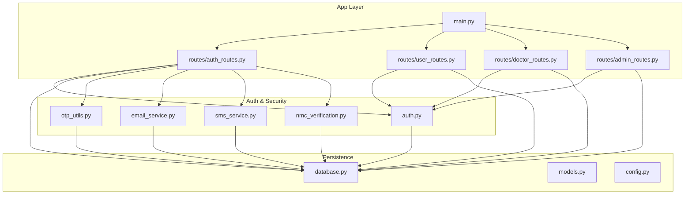
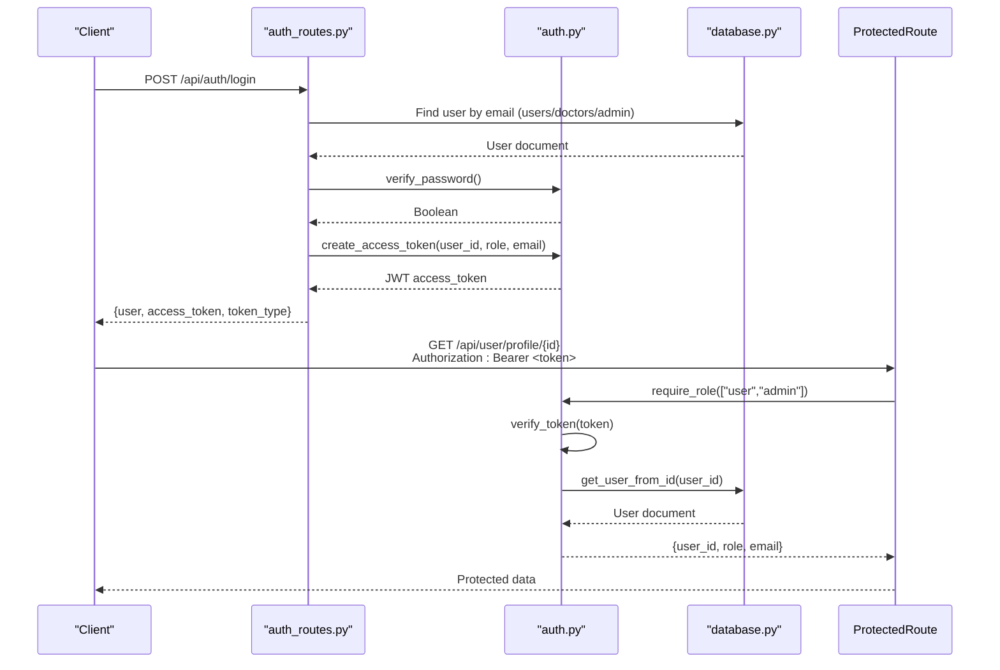
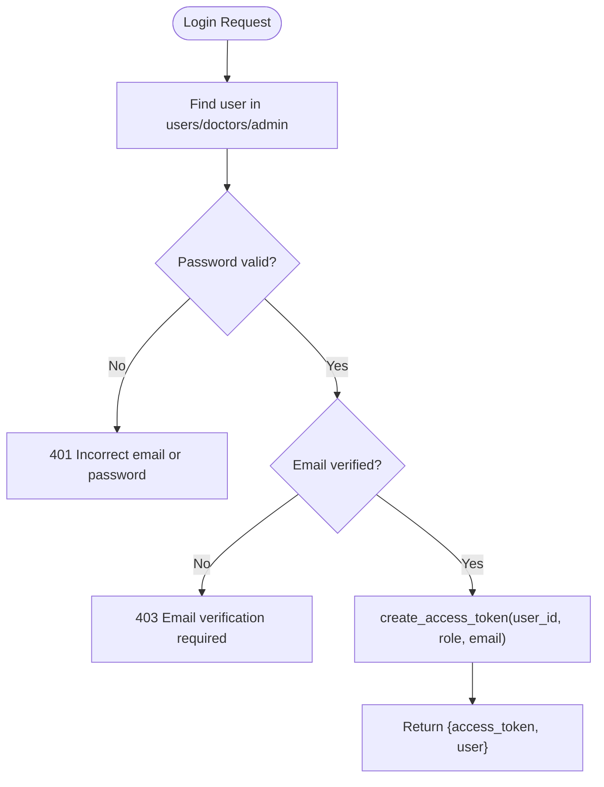
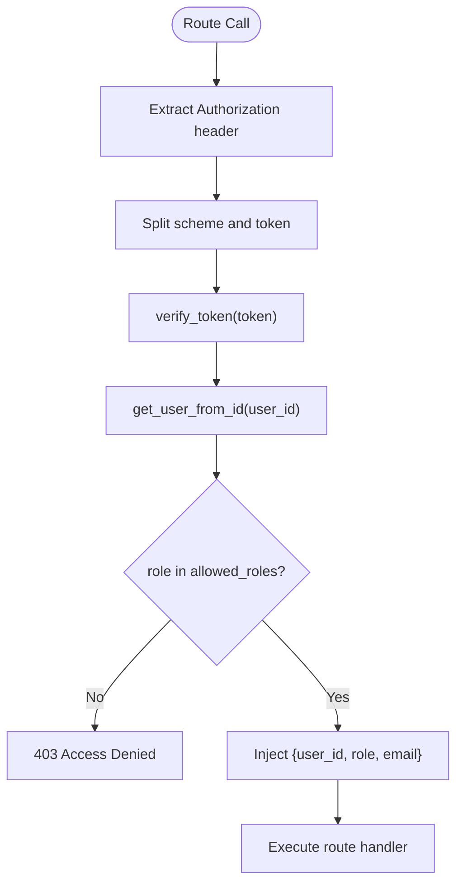
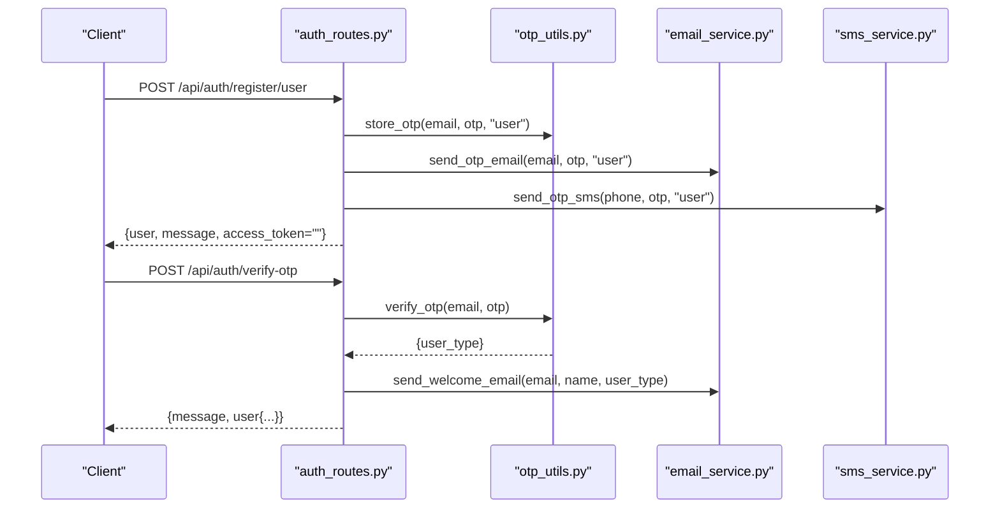
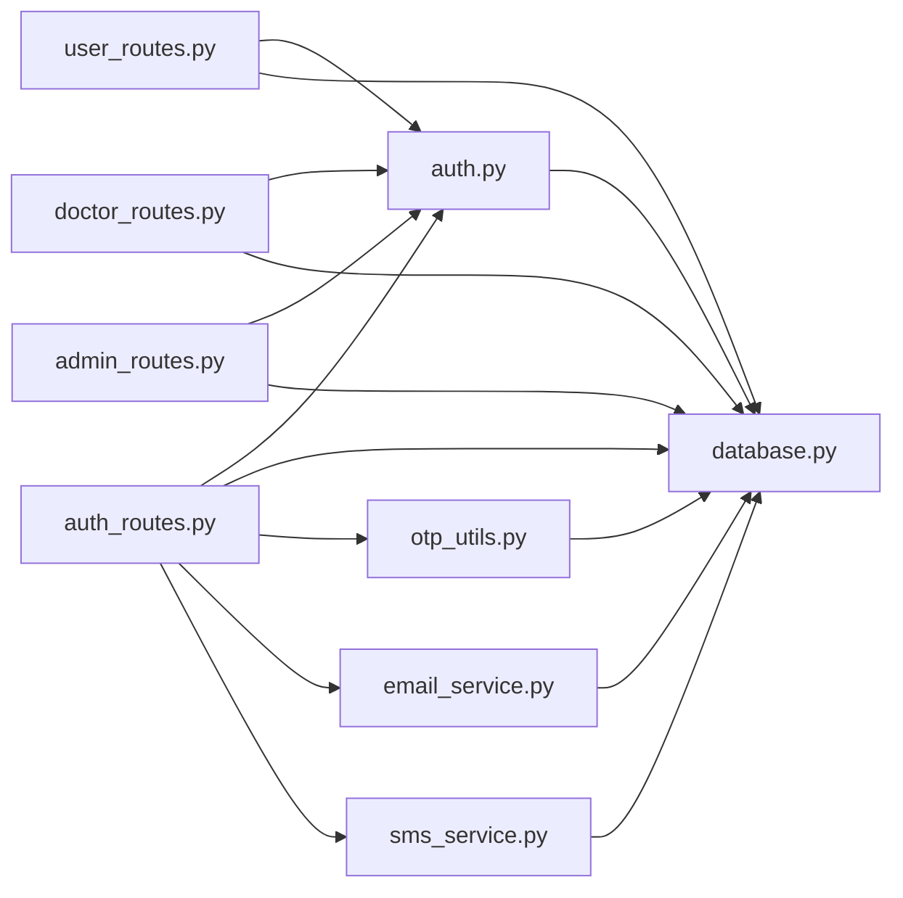

# Authentication System

<cite>
**Referenced Files in This Document**
- [auth.py](file://backend/app/auth.py)
- [auth_routes.py](file://backend/app/routes/auth_routes.py)
- [user_routes.py](file://backend/app/routes/user_routes.py)
- [doctor_routes.py](file://backend/app/routes/doctor_routes.py)
- [admin_routes.py](file://backend/app/routes/admin_routes.py)
- [database.py](file://backend/app/database.py)
- [otp_utils.py](file://backend/app/otp_utils.py)
- [email_service.py](file://backend/app/email_service.py)
- [sms_service.py](file://backend/app/sms_service.py)
- [nmc_verification.py](file://backend/app/nmc_verification.py)
- [config.py](file://backend/app/config.py)
- [main.py](file://backend/app/main.py)
- [models.py](file://backend/app/models.py)
</cite>

## Table of Contents
1. [Introduction](#introduction)
2. [Project Structure](#project-structure)
3. [Core Components](#core-components)
4. [Architecture Overview](#architecture-overview)
5. [Detailed Component Analysis](#detailed-component-analysis)
6. [Dependency Analysis](#dependency-analysis)
7. [Performance Considerations](#performance-considerations)
8. [Troubleshooting Guide](#troubleshooting-guide)
9. [Conclusion](#conclusion)

## Introduction
This document explains the JWT-based authentication system powering the AI Stress Detector platform. It covers token generation and validation, role-based access control (user, doctor, admin), password hashing, email and SMS verification, OTP verification workflows, authentication middleware and dependency injection for protected routes, sessionless JWT usage, and integration with external services. Security measures such as CSRF protection, rate limiting, and secure token storage are addressed conceptually, along with practical guidance for deployment.

## Project Structure
The authentication system spans several modules:
- JWT utilities and RBAC middleware in auth.py
- Route handlers for registration, login, OTP verification, and password reset in auth_routes.py
- Protected routes for user, doctor, and admin roles in dedicated route files
- Database abstraction and collections in database.py
- OTP storage and verification in otp_utils.py
- Email and SMS notification services in email_service.py and sms_service.py
- NMC verification for doctor registration in nmc_verification.py
- Application entrypoint and CORS configuration in main.py
- Pydantic models for request/response validation in models.py
- Environment configuration in config.py

**Diagram sources**
- [main.py:52-80](file://backend/app/main.py#L52-L80)
- [auth_routes.py:32-72](file://backend/app/routes/auth_routes.py#L32-L72)
- [user_routes.py:32-40](file://backend/app/routes/user_routes.py#L32-L40)
- [doctor_routes.py:22-26](file://backend/app/routes/doctor_routes.py#L22-L26)
- [admin_routes.py:9-12](file://backend/app/routes/admin_routes.py#L9-L12)
- [auth.py:18-21](file://backend/app/auth.py#L18-L21)
- [otp_utils.py:8-12](file://backend/app/otp_utils.py#L8-L12)
- [email_service.py:17-27](file://backend/app/email_service.py#L17-L27)
- [sms_service.py:29-58](file://backend/app/sms_service.py#L29-L58)
- [nmc_verification.py:10-12](file://backend/app/nmc_verification.py#L10-L12)
- [database.py:27-41](file://backend/app/database.py#L27-L41)
- [models.py:6-10](file://backend/app/models.py#L6-L10)
- [config.py:1-22](file://backend/app/config.py#L1-L22)

**Section sources**
- [main.py:52-80](file://backend/app/main.py#L52-L80)
- [auth_routes.py:32-72](file://backend/app/routes/auth_routes.py#L32-L72)
- [user_routes.py:32-40](file://backend/app/routes/user_routes.py#L32-L40)
- [doctor_routes.py:22-26](file://backend/app/routes/doctor_routes.py#L22-L26)
- [admin_routes.py:9-12](file://backend/app/routes/admin_routes.py#L9-L12)
- [auth.py:18-21](file://backend/app/auth.py#L18-L21)
- [otp_utils.py:8-12](file://backend/app/otp_utils.py#L8-L12)
- [email_service.py:17-27](file://backend/app/email_service.py#L17-L27)
- [sms_service.py:29-58](file://backend/app/sms_service.py#L29-L58)
- [nmc_verification.py:10-12](file://backend/app/nmc_verification.py#L10-L12)
- [database.py:27-41](file://backend/app/database.py#L27-L41)
- [models.py:6-10](file://backend/app/models.py#L6-L10)
- [config.py:1-22](file://backend/app/config.py#L1-L22)

## Core Components
- JWT utilities and RBAC middleware:
  - Token creation with user_id, role, email, exp, iat
  - Token verification with expiration and invalid token handling
  - Role-based dependency injection via require_role and get_current_user
  - User lookup across users/doctors/admin collections
- OTP system:
  - Generation, storage with expiration, verification with attempt limits
  - Separate flows for registration verification and password reset
- Email and SMS services:
  - Non-blocking async email delivery via SMTP
  - SMS delivery via Fast2SMS API with configurable routing and sender ID
- Database integration:
  - MongoDB collections for users, doctors, admins, OTPs, tests, appointments, etc.
  - Indexes for performance and uniqueness constraints
- Route protection:
  - require_role decorator applied to protected endpoints
  - Role checks and user existence validation on each request

**Section sources**
- [auth.py:45-190](file://backend/app/auth.py#L45-L190)
- [otp_utils.py:38-162](file://backend/app/otp_utils.py#L38-L162)
- [email_service.py:17-67](file://backend/app/email_service.py#L17-L67)
- [sms_service.py:29-58](file://backend/app/sms_service.py#L29-L58)
- [database.py:88-160](file://backend/app/database.py#L88-L160)

## Architecture Overview
The authentication architecture centers on JWT bearer tokens passed in Authorization headers. On each request, the middleware validates the token, resolves the user, enforces role-based permissions, and injects user context into route handlers.

**Diagram sources**
- [auth_routes.py:377-440](file://backend/app/routes/auth_routes.py#L377-L440)
- [auth.py:45-190](file://backend/app/auth.py#L45-L190)
- [database.py:88-103](file://backend/app/database.py#L88-L103)

## Detailed Component Analysis

### JWT Token Generation and Validation
- Token payload includes user_id, role, email, exp, iat
- HS256 signing with a secret key loaded from environment
- Verification handles expired and invalid tokens with appropriate HTTP errors
- Token extraction from Authorization header with Bearer scheme validation

**Diagram sources**
- [auth_routes.py:377-440](file://backend/app/routes/auth_routes.py#L377-L440)
- [auth.py:45-55](file://backend/app/auth.py#L45-L55)

**Section sources**
- [auth.py:45-72](file://backend/app/auth.py#L45-L72)
- [auth_routes.py:377-440](file://backend/app/routes/auth_routes.py#L377-L440)

### Role-Based Access Control (RBAC)
- require_role builds a dependency that extracts Bearer token, verifies it, resolves user, and checks role membership
- get_current_user provides a simplified dependency for authenticated users
- Routes apply require_role with allowed roles per endpoint

**Diagram sources**
- [auth.py:98-151](file://backend/app/auth.py#L98-L151)
- [user_routes.py:46-52](file://backend/app/routes/user_routes.py#L46-L52)
- [doctor_routes.py:49-50](file://backend/app/routes/doctor_routes.py#L49-L50)
- [admin_routes.py:15-16](file://backend/app/routes/admin_routes.py#L15-L16)

**Section sources**
- [auth.py:98-151](file://backend/app/auth.py#L98-L151)
- [user_routes.py:46-52](file://backend/app/routes/user_routes.py#L46-L52)
- [doctor_routes.py:49-50](file://backend/app/routes/doctor_routes.py#L49-L50)
- [admin_routes.py:15-16](file://backend/app/routes/admin_routes.py#L15-L16)

### Password Hashing
- bcrypt is used for password hashing with a 72-byte truncation limit
- Constant-time comparison for OTP verification to prevent timing attacks
- Password verification during login and change-password flows

**Section sources**
- [auth.py:33-43](file://backend/app/auth.py#L33-L43)
- [otp_utils.py:78-82](file://backend/app/otp_utils.py#L78-L82)
- [auth_routes.py:442-474](file://backend/app/routes/auth_routes.py#L442-L474)

### Email and SMS Verification Workflows
- Registration triggers OTP generation and dispatch via email and/or SMS
- OTP verification updates email_verified and notifies user
- Password reset uses a two-phase OTP verification (verify-reset-otp) followed by atomic consumption (reset-password)

**Diagram sources**
- [auth_routes.py:68-132](file://backend/app/routes/auth_routes.py#L68-L132)
- [otp_utils.py:42-91](file://backend/app/otp_utils.py#L42-L91)
- [email_service.py:119-165](file://backend/app/email_service.py#L119-L165)
- [sms_service.py:135-141](file://backend/app/sms_service.py#L135-L141)

**Section sources**
- [auth_routes.py:68-132](file://backend/app/routes/auth_routes.py#L68-L132)
- [auth_routes.py:236-304](file://backend/app/routes/auth_routes.py#L236-L304)
- [otp_utils.py:42-91](file://backend/app/otp_utils.py#L42-L91)
- [email_service.py:119-165](file://backend/app/email_service.py#L119-L165)
- [sms_service.py:135-141](file://backend/app/sms_service.py#L135-L141)

### Doctor Registration and NMC Verification
- License number validated and normalized
- NMC verification performed against official registry
- On success, OTP sent for email verification; doctor accounts remain pending admin approval until verified

**Section sources**
- [auth_routes.py:134-234](file://backend/app/routes/auth_routes.py#L134-L234)
- [nmc_verification.py:147-215](file://backend/app/nmc_verification.py#L147-L215)

### Protected Routes and Dependency Injection
- require_role is applied to endpoints to enforce role-based access
- get_current_user dependency provides authenticated user context
- Object-level authorization ensures users can only access their own data

**Section sources**
- [user_routes.py:46-52](file://backend/app/routes/user_routes.py#L46-L52)
- [user_routes.py:501-532](file://backend/app/routes/user_routes.py#L501-L532)
- [user_routes.py:534-569](file://backend/app/routes/user_routes.py#L534-L569)
- [doctor_routes.py:49-50](file://backend/app/routes/doctor_routes.py#L49-L50)
- [admin_routes.py:15-16](file://backend/app/routes/admin_routes.py#L15-L16)

### Session Management
- Stateless JWT-based sessions: no server-side session storage
- Tokens embedded in Authorization header; clients manage token lifecycle
- Logout is implicit upon token invalidation; no server-side session termination

**Section sources**
- [auth.py:45-55](file://backend/app/auth.py#L45-L55)
- [auth_routes.py:377-440](file://backend/app/routes/auth_routes.py#L377-L440)

### Token Refresh Mechanism
- No explicit token refresh endpoint is implemented
- Clients should re-authenticate to obtain a new access token
- Consider implementing a refresh token flow with a separate endpoint if needed

**Section sources**
- [auth_routes.py:377-440](file://backend/app/routes/auth_routes.py#L377-L440)
- [auth.py:45-55](file://backend/app/auth.py#L45-L55)

### Permission Checking Examples
- User profile access: require_role(["user","admin"]) with object-level check
- Doctor appointment listing: require_role(["doctor"])
- Admin dashboard: require_role(["admin"])

**Section sources**
- [user_routes.py:46-52](file://backend/app/routes/user_routes.py#L46-L52)
- [doctor_routes.py:49-50](file://backend/app/routes/doctor_routes.py#L49-L50)
- [admin_routes.py:15-16](file://backend/app/routes/admin_routes.py#L15-L16)

### Security Measures
- CSRF protection: Not implemented in current code; consider adding SameSite cookies and CSRF tokens for browser clients
- Rate limiting: Not implemented in current code; implement per-endpoint rate limiting using middleware or external services
- Secure token storage: Store JWTs in httpOnly, secure cookies on the client; avoid localStorage for bearer tokens
- Transport security: Enforce HTTPS in production; configure CORS origins carefully
- Secrets management: Load JWT_SECRET_KEY and SMTP/SMS credentials from environment variables

**Section sources**
- [auth.py:24-31](file://backend/app/auth.py#L24-L31)
- [email_service.py:18-26](file://backend/app/email_service.py#L18-L26)
- [sms_service.py:40-57](file://backend/app/sms_service.py#L40-L57)
- [main.py:32-68](file://backend/app/main.py#L32-L68)

## Dependency Analysis
The authentication system exhibits clear separation of concerns:
- Route handlers depend on auth utilities and database collections
- OTP, email, and SMS services are injected into route handlers
- RBAC middleware depends on JWT verification and user resolution
- Database module centralizes collection access and indexing

**Diagram sources**
- [auth_routes.py:10-26](file://backend/app/routes/auth_routes.py#L10-L26)
- [user_routes.py:18-26](file://backend/app/routes/user_routes.py#L18-L26)
- [doctor_routes.py:18-21](file://backend/app/routes/doctor_routes.py#L18-L21)
- [admin_routes.py:4-6](file://backend/app/routes/admin_routes.py#L4-L6)
- [auth.py:18-21](file://backend/app/auth.py#L18-L21)
- [otp_utils.py:8](file://backend/app/otp_utils.py#L8)
- [email_service.py:17-27](file://backend/app/email_service.py#L17-L27)
- [sms_service.py:29-48](file://backend/app/sms_service.py#L29-L48)
- [database.py:88-160](file://backend/app/database.py#L88-L160)

**Section sources**
- [auth_routes.py:10-26](file://backend/app/routes/auth_routes.py#L10-L26)
- [user_routes.py:18-26](file://backend/app/routes/user_routes.py#L18-L26)
- [doctor_routes.py:18-21](file://backend/app/routes/doctor_routes.py#L18-L21)
- [admin_routes.py:4-6](file://backend/app/routes/admin_routes.py#L4-L6)
- [auth.py:18-21](file://backend/app/auth.py#L18-L21)
- [otp_utils.py:8](file://backend/app/otp_utils.py#L8)
- [email_service.py:17-27](file://backend/app/email_service.py#L17-L27)
- [sms_service.py:29-48](file://backend/app/sms_service.py#L29-L48)
- [database.py:88-160](file://backend/app/database.py#L88-L160)

## Performance Considerations
- Database connection pooling and timeouts are configured for MongoDB
- Indexes are created on frequently queried fields (emails, timestamps, composite keys)
- OTP storage supports both in-memory and persistent backends; production should use persistent storage with TTL
- Asynchronous email/SMS sending avoids blocking API responses

**Section sources**
- [database.py:30-41](file://backend/app/database.py#L30-L41)
- [database.py:164-302](file://backend/app/database.py#L164-L302)
- [otp_utils.py:15-16](file://backend/app/otp_utils.py#L15-L16)
- [email_service.py:58-66](file://backend/app/email_service.py#L58-L66)
- [sms_service.py:129-133](file://backend/app/sms_service.py#L129-L133)

## Troubleshooting Guide
- Login failures:
  - Incorrect email/password: 401 Unauthorized
  - Unverified email: 403 Forbidden with verification prompt
  - Doctor pending admin approval: 403 Forbidden with approval notice
- Token errors:
  - Missing Authorization header: 401 Unauthorized
  - Invalid Bearer scheme: 401 Unauthorized
  - Expired or invalid token: 401 Unauthorized
- OTP issues:
  - Expired or invalid OTP: 400 Bad Request with guidance
  - Too many attempts: 400 Bad Request with remaining attempts
- Database connectivity:
  - Health check endpoint reports database status; handle degraded mode gracefully

**Section sources**
- [auth_routes.py:392-414](file://backend/app/routes/auth_routes.py#L392-L414)
- [auth.py:103-149](file://backend/app/auth.py#L103-L149)
- [otp_utils.py:61-91](file://backend/app/otp_utils.py#L61-L91)
- [otp_utils.py:93-121](file://backend/app/otp_utils.py#L93-L121)
- [main.py:114-132](file://backend/app/main.py#L114-L132)

## Conclusion
The authentication system provides a robust, stateless JWT-based solution with strong RBAC, secure password handling, and integrated email/SMS verification. The modular design enables clear separation of concerns, while middleware-based dependency injection simplifies route protection. For production hardening, implement CSRF protection, rate limiting, and secure token storage practices, and consider adding a token refresh endpoint if required.