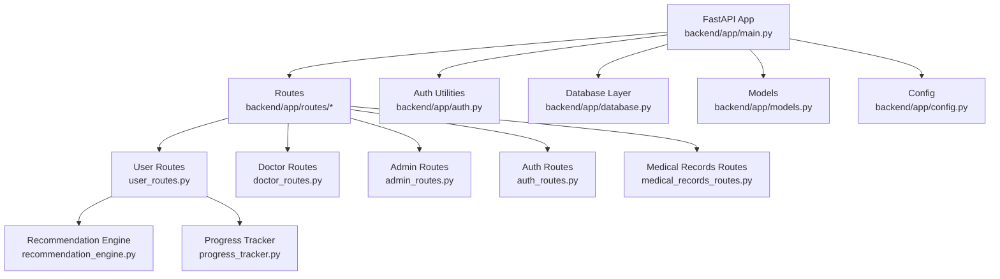
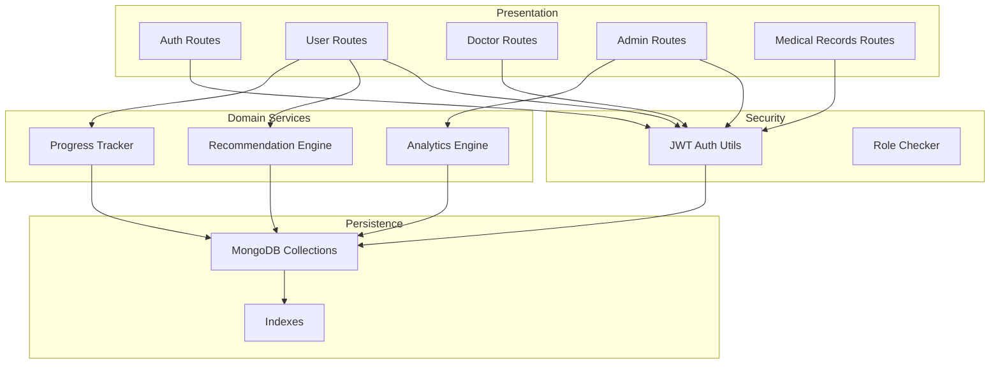
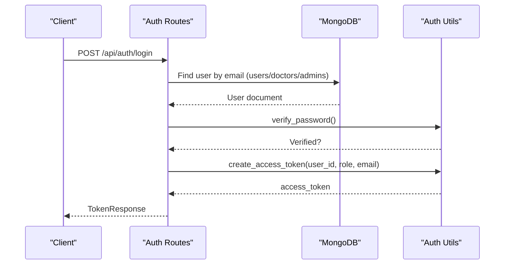
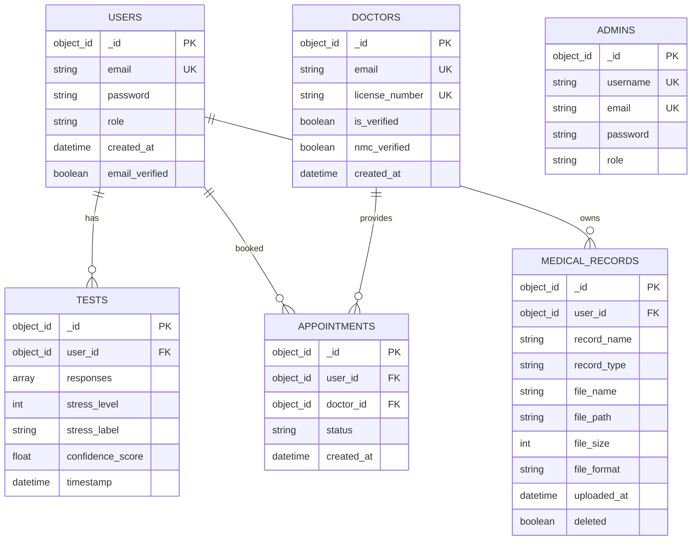
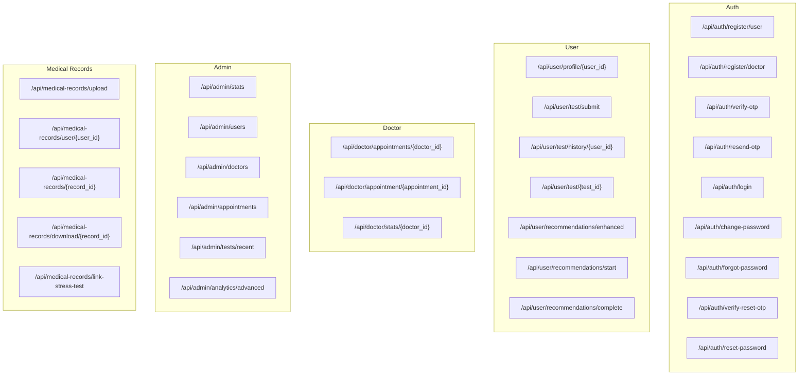
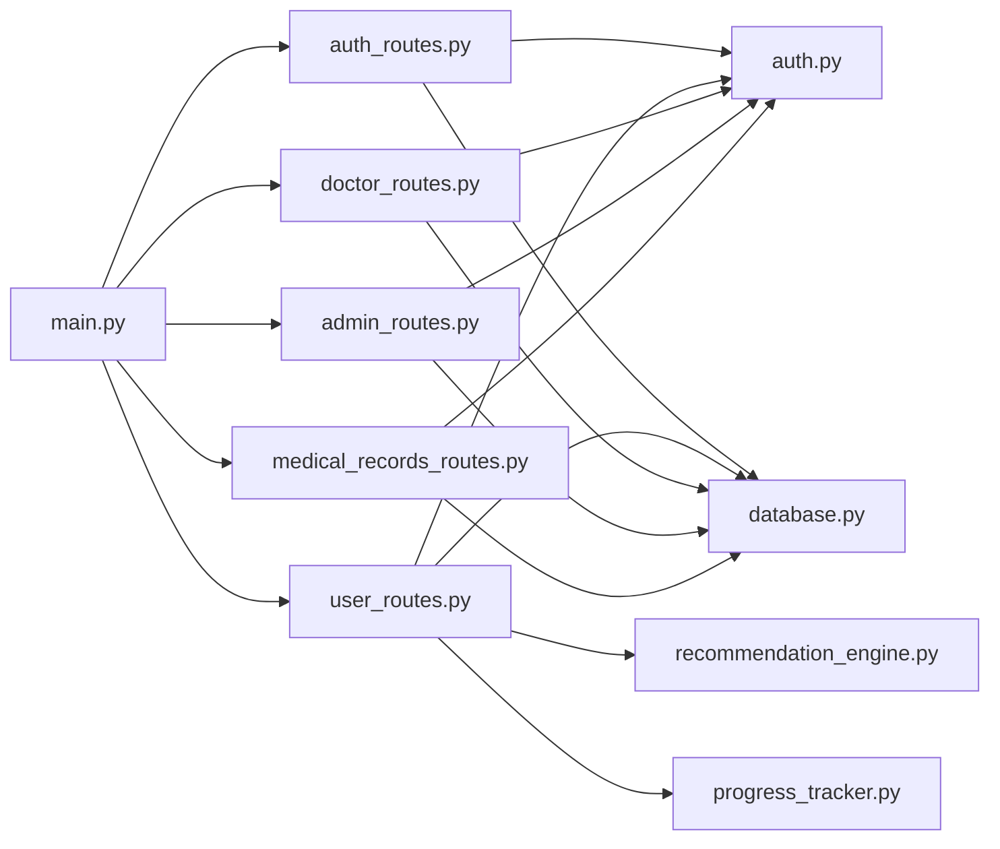

# Backend Application

<cite>
**Referenced Files in This Document**
- [main.py](file://backend/app/main.py)
- [config.py](file://backend/app/config.py)
- [models.py](file://backend/app/models.py)
- [database.py](file://backend/app/database.py)
- [auth.py](file://backend/app/auth.py)
- [auth_routes.py](file://backend/app/routes/auth_routes.py)
- [user_routes.py](file://backend/app/routes/user_routes.py)
- [doctor_routes.py](file://backend/app/routes/doctor_routes.py)
- [admin_routes.py](file://backend/app/routes/admin_routes.py)
- [medical_records_routes.py](file://backend/app/routes/medical_records_routes.py)
- [recommendation_engine.py](file://backend/app/recommendation_engine.py)
- [progress_tracker.py](file://backend/app/progress_tracker.py)
</cite>

## Table of Contents
1. [Introduction](#introduction)
2. [Project Structure](#project-structure)
3. [Core Components](#core-components)
4. [Architecture Overview](#architecture-overview)
5. [Detailed Component Analysis](#detailed-component-analysis)
6. [Dependency Analysis](#dependency-analysis)
7. [Performance Considerations](#performance-considerations)
8. [Troubleshooting Guide](#troubleshooting-guide)
9. [Conclusion](#conclusion)
10. [Appendices](#appendices)

## Introduction
This document describes the backend application for the AI Stress Level Analyzer built with FastAPI and MongoDB. It covers application structure, authentication and authorization, database design, API organization, configuration management, error handling, and operational guidance. The system supports user stress testing, doctor appointment management, admin analytics, and optional medical records management with secure storage and retrieval.

## Project Structure
The backend follows a modular FastAPI structure with clear separation of concerns:
- Application entry point initializes FastAPI, loads environment variables, sets CORS, includes routers, and performs health checks.
- Configuration is centralized via Pydantic settings.
- Authentication utilities manage JWT creation, validation, and role-based access control.
- Routes are grouped by domain: authentication, user, doctor, admin, and optional medical records.
- Database module encapsulates MongoDB connection, collections, indexes, and helper functions.
- Supporting modules provide recommendation generation, progress tracking, and analytics.

**Diagram sources**
- [main.py:52-80](file://backend/app/main.py#L52-L80)
- [user_routes.py:32-39](file://backend/app/routes/user_routes.py#L32-L39)
- [doctor_routes.py:22-22](file://backend/app/routes/doctor_routes.py#L22-L22)
- [admin_routes.py:9-12](file://backend/app/routes/admin_routes.py#L9-L12)
- [auth_routes.py:32-32](file://backend/app/routes/auth_routes.py#L32-L32)
- [medical_records_routes.py:40-41](file://backend/app/routes/medical_records_routes.py#L40-L41)
- [recommendation_engine.py:11-16](file://backend/app/recommendation_engine.py#L11-L16)
- [progress_tracker.py:48-49](file://backend/app/progress_tracker.py#L48-L49)

**Section sources**
- [main.py:52-80](file://backend/app/main.py#L52-L80)
- [config.py:3-22](file://backend/app/config.py#L3-L22)

## Core Components
- FastAPI Application: Initializes CORS, includes routers, handles startup/shutdown events, and exposes health checks.
- Configuration: Centralized settings via Pydantic settings with environment variable loading.
- Authentication: JWT-based with bcrypt password hashing, token verification, and role-based dependency injection.
- Database: MongoDB connection with connection pooling, indexes, and helper functions for collections.
- Models: Pydantic models for request/response validation across all domains.
- Route Modules: Modular API endpoints organized by functional domain.

**Section sources**
- [main.py:52-137](file://backend/app/main.py#L52-L137)
- [config.py:3-22](file://backend/app/config.py#L3-L22)
- [auth.py:24-190](file://backend/app/auth.py#L24-L190)
- [database.py:26-509](file://backend/app/database.py#L26-L509)
- [models.py:16-440](file://backend/app/models.py#L16-L440)

## Architecture Overview
The backend uses a layered architecture:
- Presentation Layer: FastAPI routers and endpoints.
- Domain Services: Recommendation engine, progress tracker, analytics engine.
- Persistence Layer: MongoDB collections with optimized indexes.
- Security Layer: JWT middleware, role-based access control, and input validation.

**Diagram sources**
- [auth_routes.py:32-32](file://backend/app/routes/auth_routes.py#L32-L32)
- [user_routes.py:32-39](file://backend/app/routes/user_routes.py#L32-L39)
- [doctor_routes.py:22-22](file://backend/app/routes/doctor_routes.py#L22-L22)
- [admin_routes.py:9-12](file://backend/app/routes/admin_routes.py#L9-L12)
- [medical_records_routes.py:40-41](file://backend/app/routes/medical_records_routes.py#L40-L41)
- [recommendation_engine.py:11-16](file://backend/app/recommendation_engine.py#L11-L16)
- [progress_tracker.py:48-49](file://backend/app/progress_tracker.py#L48-L49)
- [auth.py:98-151](file://backend/app/auth.py#L98-L151)
- [database.py:164-302](file://backend/app/database.py#L164-L302)

## Detailed Component Analysis

### Authentication and Authorization
- JWT Configuration: Secret key, algorithm, and expiration are loaded from environment variables.
- Password Hashing: bcrypt with truncation to 72 bytes.
- Token Creation and Verification: Payload includes user_id, role, and email; expiration enforced.
- Role-Based Access Control: Dependency injects current user context validated by bearer token and role checks.
- Login Flow: Validates credentials across users, doctors, and admins; enforces email verification and doctor approval.

**Diagram sources**
- [auth_routes.py:377-440](file://backend/app/routes/auth_routes.py#L377-L440)
- [auth.py:33-72](file://backend/app/auth.py#L33-L72)
- [auth.py:45-55](file://backend/app/auth.py#L45-L55)

**Section sources**
- [auth.py:24-190](file://backend/app/auth.py#L24-L190)
- [auth_routes.py:377-440](file://backend/app/routes/auth_routes.py#L377-L440)

### Database Design and Indexing
- Collections: users, doctors, admins, tests, appointments, recommendation_progress, user_achievements, resources, reminders, otps, medical_records, medical_record_activities.
- Connection Pooling: maxPoolSize=50, timeouts, retryWrites, majority write concern.
- Indexes: optimized compound and single-field indexes for frequent queries (e.g., user_id, timestamps, email uniqueness).
- Helper Functions: admin initialization, user lookup across roles, database stats, and medical record utilities.

**Diagram sources**
- [database.py:88-158](file://backend/app/database.py#L88-L158)
- [models.py:300-333](file://backend/app/models.py#L300-L333)

**Section sources**
- [database.py:26-509](file://backend/app/database.py#L26-L509)
- [models.py:300-333](file://backend/app/models.py#L300-L333)

### API Endpoints Organization
- Authentication: Registration (user/doctor), OTP verification, resend OTP, login, change password, forgot/reset password.
- User: Profile read/update, questionnaire, video and text-based stress tests, test history, recommendations, progress tracking, achievements, chatbot.
- Doctor: Appointments listing with patient tests, update appointment status, doctor stats.
- Admin: Platform stats, user/doctors listing, verification, recent tests, deletion, advanced analytics.
- Medical Records: Upload, list, get, update, delete, download (including auto-generated PDF for stress tests), bulk download, linking tests, stats.

**Diagram sources**
- [auth_routes.py:68-596](file://backend/app/routes/auth_routes.py#L68-L596)
- [user_routes.py:45-800](file://backend/app/routes/user_routes.py#L45-L800)
- [doctor_routes.py:48-400](file://backend/app/routes/doctor_routes.py#L48-L400)
- [admin_routes.py:14-225](file://backend/app/routes/admin_routes.py#L14-L225)
- [medical_records_routes.py:149-1054](file://backend/app/routes/medical_records_routes.py#L149-L1054)

**Section sources**
- [auth_routes.py:68-596](file://backend/app/routes/auth_routes.py#L68-L596)
- [user_routes.py:45-800](file://backend/app/routes/user_routes.py#L45-L800)
- [doctor_routes.py:48-400](file://backend/app/routes/doctor_routes.py#L48-L400)
- [admin_routes.py:14-225](file://backend/app/routes/admin_routes.py#L14-L225)
- [medical_records_routes.py:149-1054](file://backend/app/routes/medical_records_routes.py#L149-L1054)

### Configuration Management
- Environment Variables: Loaded via dotenv at startup; settings class centralizes configuration for MongoDB, SMTP, OTP.
- CORS: Configurable origins with validation and defaults.
- Admin Initialization: Creates default admin if not present and ADMIN_PASSWORD is set.

**Section sources**
- [main.py:14-15](file://backend/app/main.py#L14-L15)
- [main.py:32-50](file://backend/app/main.py#L32-L50)
- [config.py:3-22](file://backend/app/config.py#L3-L22)
- [database.py:307-339](file://backend/app/database.py#L307-L339)

### Modular Route Organization and Dependency Injection
- Routers: Each domain has its own router with tags for grouping.
- Dependencies: require_role and get_current_user enforce authorization and inject user context.
- Aggregation Pipelines: Optimized queries for doctor appointments and analytics.

**Section sources**
- [auth_routes.py:32-32](file://backend/app/routes/auth_routes.py#L32-L32)
- [user_routes.py:32-39](file://backend/app/routes/user_routes.py#L32-L39)
- [doctor_routes.py:22-22](file://backend/app/routes/doctor_routes.py#L22-L22)
- [admin_routes.py:9-12](file://backend/app/routes/admin_routes.py#L9-L12)
- [auth.py:98-151](file://backend/app/auth.py#L98-L151)

### Error Handling, Validation, and Response Formatting
- Validation: Pydantic models define strict input schemas; ObjectId validation for identifiers.
- HTTP Exceptions: Consistent error responses with appropriate status codes.
- Response Formatting: Standardized response models (e.g., TokenResponse) and pagination-friendly lists.

**Section sources**
- [models.py:16-440](file://backend/app/models.py#L16-L440)
- [auth_routes.py:72-91](file://backend/app/routes/auth_routes.py#L72-L91)
- [user_routes.py:49-53](file://backend/app/routes/user_routes.py#L49-L53)

### Example API Usage Patterns
- Authentication:
  - Register a user: POST /api/auth/register/user with UserRegister payload.
  - Login: POST /api/auth/login with UserLogin payload.
  - Verify OTP: POST /api/auth/verify-otp with OTPVerify payload.
- User:
  - Submit test: POST /api/user/test/submit with TestSubmission payload.
  - Get recommendations: POST /api/user/recommendations/enhanced with test_id query parameter.
  - Start recommendation: POST /api/user/recommendations/start with RecommendationProgressCreate payload.
- Doctor:
  - Update appointment: PUT /api/doctor/appointment/{appointment_id} with AppointmentUpdate payload.
- Admin:
  - Get stats: GET /api/admin/stats.
- Medical Records:
  - Upload record: POST /api/medical-records/upload with form fields and file.
  - Download record: GET /api/medical-records/download/{record_id}.

**Section sources**
- [auth_routes.py:68-596](file://backend/app/routes/auth_routes.py#L68-L596)
- [user_routes.py:407-499](file://backend/app/routes/user_routes.py#L407-L499)
- [doctor_routes.py:171-267](file://backend/app/routes/doctor_routes.py#L171-L267)
- [admin_routes.py:14-62](file://backend/app/routes/admin_routes.py#L14-L62)
- [medical_records_routes.py:149-278](file://backend/app/routes/medical_records_routes.py#L149-L278)

## Dependency Analysis
- FastAPI app depends on routers, auth utilities, and database initialization.
- Routes depend on models, auth dependencies, and database collections.
- Domain services (recommendation engine, progress tracker) depend on database collections and ML components.

**Diagram sources**
- [main.py:17-78](file://backend/app/main.py#L17-L78)
- [auth_routes.py:10-11](file://backend/app/routes/auth_routes.py#L10-L11)
- [user_routes.py:14-28](file://backend/app/routes/user_routes.py#L14-L28)
- [doctor_routes.py:17-18](file://backend/app/routes/doctor_routes.py#L17-L18)
- [admin_routes.py:4-5](file://backend/app/routes/admin_routes.py#L4-L5)
- [medical_records_routes.py:34-38](file://backend/app/routes/medical_records_routes.py#L34-L38)
- [auth.py:18-18](file://backend/app/auth.py#L18-L18)
- [database.py:88-158](file://backend/app/database.py#L88-L158)
- [recommendation_engine.py:9-9](file://backend/app/recommendation_engine.py#L9-L9)
- [progress_tracker.py:133-134](file://backend/app/progress_tracker.py#L133-L134)

**Section sources**
- [main.py:17-78](file://backend/app/main.py#L17-L78)
- [auth.py:18-18](file://backend/app/auth.py#L18-L18)
- [database.py:88-158](file://backend/app/database.py#L88-L158)

## Performance Considerations
- Connection Pooling: MongoDB client configured with maxPoolSize=50 and timeouts for concurrency.
- Indexes: Compound and single-field indexes on frequently queried fields (user_id, timestamps, email uniqueness).
- Aggregation Pipelines: Optimized queries for doctor appointments and analytics to reduce round trips.
- Asynchronous Notifications: Email/SMS sent asynchronously to avoid blocking responses.

**Section sources**
- [database.py:30-41](file://backend/app/database.py#L30-L41)
- [database.py:164-302](file://backend/app/database.py#L164-L302)
- [doctor_routes.py:52-87](file://backend/app/routes/doctor_routes.py#L52-L87)
- [doctor_routes.py:208-260](file://backend/app/routes/doctor_routes.py#L208-L260)

## Troubleshooting Guide
- CORS Issues: Ensure ALLOWED_ORIGINS contains valid http/https URLs; defaults to localhost ports if unspecified.
- Database Connectivity: Health endpoint pings MongoDB; verify MONGODB_URL and network access.
- JWT Errors: Confirm JWT_SECRET_KEY is set; token expiration and invalid signatures raise 401.
- Role Access Denied: require_role enforces role-based access; verify Authorization header format and user existence.
- File Upload Limits: Medical records upload validates file size and type; adjust MAX_FILE_SIZE and allowed extensions as needed.

**Section sources**
- [main.py:32-50](file://backend/app/main.py#L32-L50)
- [main.py:118-131](file://backend/app/main.py#L118-L131)
- [auth.py:24-31](file://backend/app/auth.py#L24-L31)
- [auth.py:98-151](file://backend/app/auth.py#L98-L151)
- [medical_records_routes.py:44-48](file://backend/app/routes/medical_records_routes.py#L44-L48)
- [medical_records_routes.py:120-131](file://backend/app/routes/medical_records_routes.py#L120-L131)

## Conclusion
The backend provides a robust, modular FastAPI application with strong authentication, optimized database access, and comprehensive APIs for stress assessment, recommendations, appointments, and optional medical records. The design emphasizes security, scalability, and maintainability through clear separation of concerns, dependency injection, and standardized validation.

## Appendices
- Environment Variables: MONGODB_URL, JWT_SECRET_KEY, ACCESS_TOKEN_EXPIRE_MINUTES, ALLOWED_ORIGINS, ADMIN_PASSWORD, SMTP settings, OTP configurations.
- Notes: Admin initialization requires ADMIN_PASSWORD; missing secrets will prevent admin creation and JWT signing.

**Section sources**
- [config.py:3-22](file://backend/app/config.py#L3-L22)
- [database.py:321-339](file://backend/app/database.py#L321-L339)
- [auth.py:24-31](file://backend/app/auth.py#L24-L31)
- [main.py:32-50](file://backend/app/main.py#L32-L50)