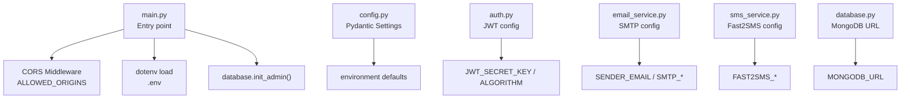
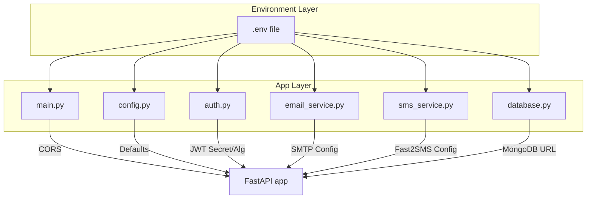
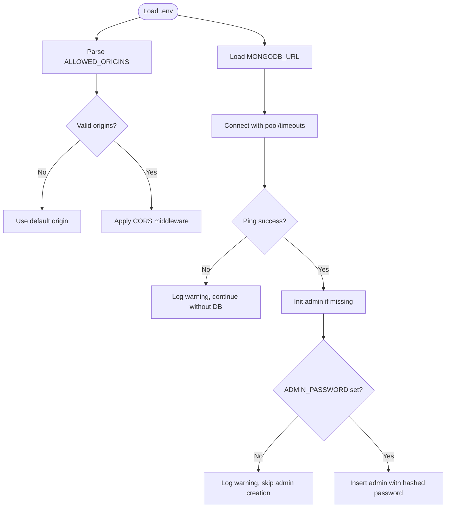
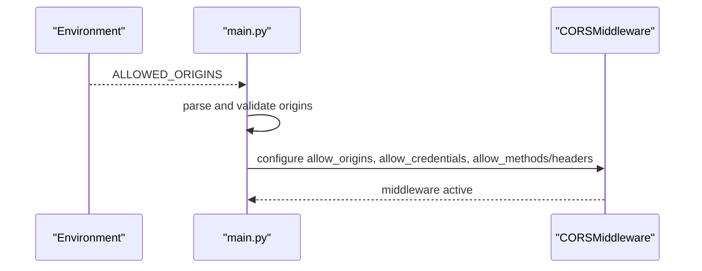
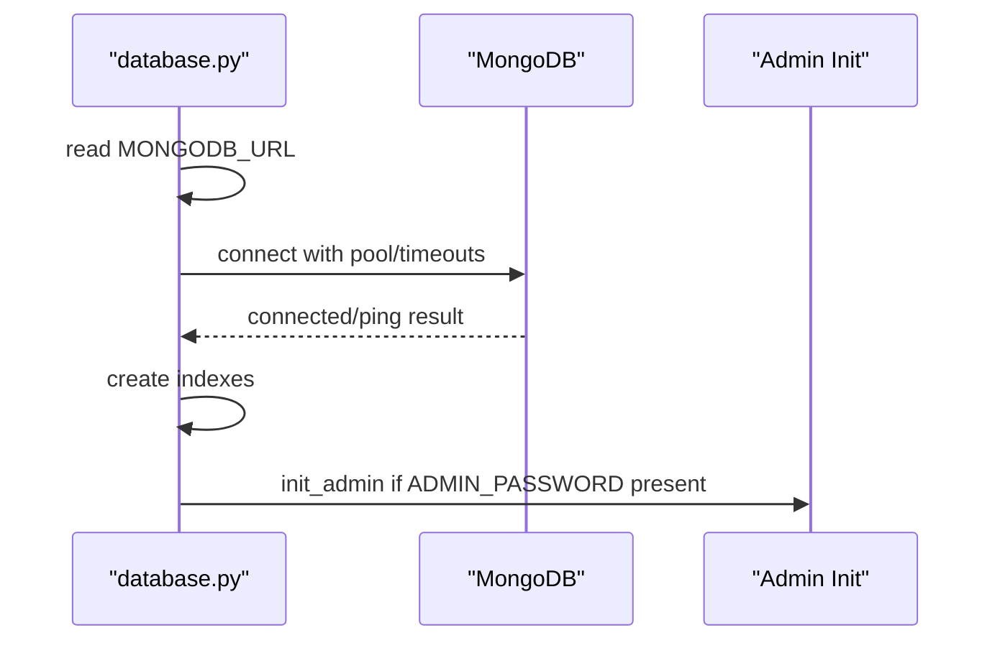
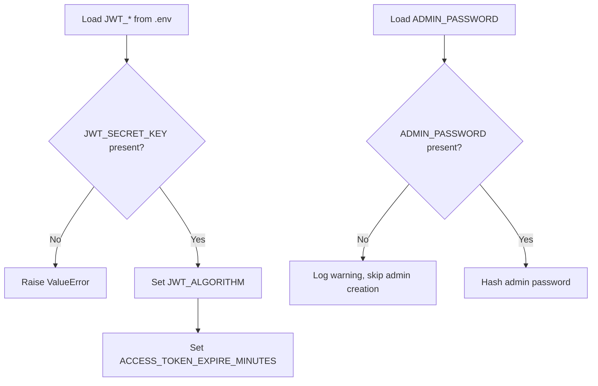
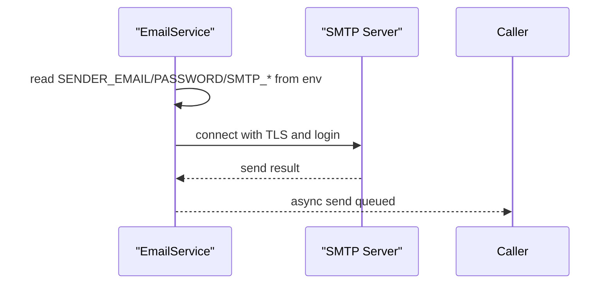
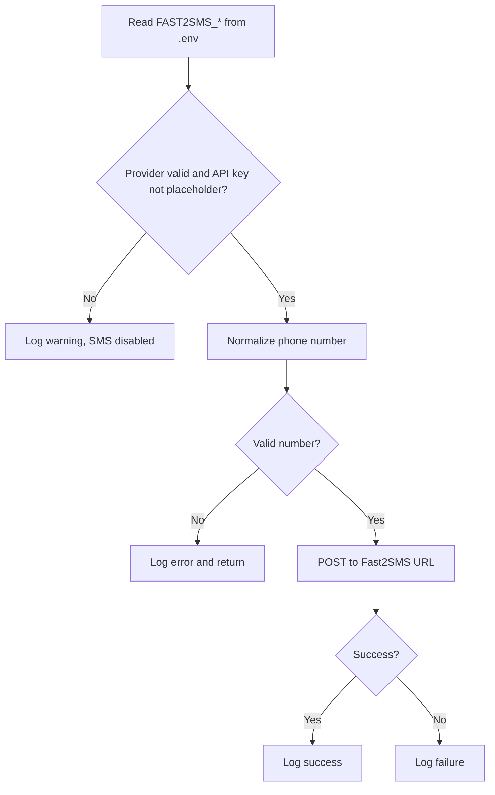
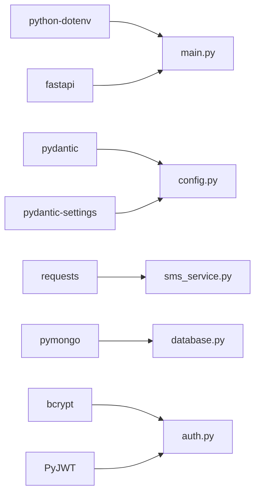

# Configuration Management

<cite>
**Referenced Files in This Document**
- [config.py](file://backend/app/config.py)
- [main.py](file://backend/app/main.py)
- [database.py](file://backend/app/database.py)
- [email_service.py](file://backend/app/email_service.py)
- [sms_service.py](file://backend/app/sms_service.py)
- [auth.py](file://backend/app/auth.py)
- [requirements.txt](file://backend/requirements.txt)
- [README.md](file://README.md)
- [start.sh](file://start.sh)
- [start.bat](file://start.bat)
</cite>

## Table of Contents
1. [Introduction](#introduction)
2. [Project Structure](#project-structure)
3. [Core Components](#core-components)
4. [Architecture Overview](#architecture-overview)
5. [Detailed Component Analysis](#detailed-component-analysis)
6. [Dependency Analysis](#dependency-analysis)
7. [Performance Considerations](#performance-considerations)
8. [Troubleshooting Guide](#troubleshooting-guide)
9. [Conclusion](#conclusion)
10. [Appendices](#appendices)

## Introduction
This document explains how the application loads and validates configuration, manages environment variables, and applies security and operational defaults. It covers CORS configuration, database connection settings, security parameters, and integrations with external services such as email/SMS providers and AI APIs. It also provides environment-specific guidance for development, staging, and production deployments, along with configuration security best practices and sensitive data handling recommendations.

## Project Structure
The configuration system spans several backend modules:
- Centralized environment loading and validation
- CORS middleware configuration from environment variables
- Database connection settings and admin initialization
- Email and SMS provider integrations
- Authentication and JWT security parameters
- External service keys for AI chatbot APIs

**Diagram sources**
- [main.py:14-68](file://backend/app/main.py#L14-L68)
- [config.py:1-22](file://backend/app/config.py#L1-L22)
- [auth.py:24-31](file://backend/app/auth.py#L24-L31)
- [email_service.py:18-22](file://backend/app/email_service.py#L18-L22)
- [sms_service.py:41-47](file://backend/app/sms_service.py#L41-L47)
- [database.py:27-27](file://backend/app/database.py#L27-L27)

**Section sources**
- [main.py:14-68](file://backend/app/main.py#L14-L68)
- [config.py:1-22](file://backend/app/config.py#L1-L22)

## Core Components
- Environment loading and validation
  - The application loads environment variables early in the entry point and in individual modules that depend on them at import time. This ensures consistent configuration across the app lifecycle.
  - Pydantic Settings centralizes configuration fields and defaults, while ignoring extra environment variables to prevent accidental misconfiguration.

- CORS configuration
  - Origins are loaded from ALLOWED_ORIGINS, validated for proper scheme and host, normalized, and applied to the FastAPI CORS middleware. Defaults are enforced if parsing fails.

- Database configuration
  - MongoDB URL is read from MONGODB_URL with a sensible local default. Connection pooling, timeouts, and write concerns are configured for reliability and performance.

- Security parameters
  - JWT secret key and algorithm are required and loaded from environment variables. Token expiration is configurable. Admin password is required for initial admin creation.

- External services
  - Email via SMTP with asynchronous delivery and robust error handling.
  - SMS via Fast2SMS with optional routing, language, country code, sender ID, and URL customization.
  - AI chatbot integration via Groq API key and model selection.

**Section sources**
- [main.py:14-68](file://backend/app/main.py#L14-L68)
- [config.py:1-22](file://backend/app/config.py#L1-L22)
- [database.py:27-41](file://backend/app/database.py#L27-L41)
- [auth.py:24-31](file://backend/app/auth.py#L24-L31)
- [email_service.py:18-26](file://backend/app/email_service.py#L18-L26)
- [sms_service.py:41-57](file://backend/app/sms_service.py#L41-L57)
- [README.md:445-478](file://README.md#L445-L478)

## Architecture Overview
The configuration architecture integrates environment-driven settings across modules, ensuring centralized control and consistent defaults.

**Diagram sources**
- [main.py:14-68](file://backend/app/main.py#L14-L68)
- [config.py:1-22](file://backend/app/config.py#L1-L22)
- [auth.py:24-31](file://backend/app/auth.py#L24-L31)
- [email_service.py:18-22](file://backend/app/email_service.py#L18-L22)
- [sms_service.py:41-47](file://backend/app/sms_service.py#L41-L47)
- [database.py:27-27](file://backend/app/database.py#L27-L27)

## Detailed Component Analysis

### Environment Variable Loading and Validation
- Early load
  - The entry point loads .env before importing route modules to ensure environment-dependent imports behave consistently.
- Module-level loads
  - Individual modules (authentication, email, SMS, database) also load .env to capture their own environment dependencies at import time.
- Validation and defaults
  - Pydantic Settings defines typed fields with defaults and ignores unknown variables.
  - CORS parsing validates scheme and host, normalizes trailing slashes, and falls back to a safe default origin if none are valid.
  - Database connection attempts to ping the server and logs warnings if unavailable; continues without DB connectivity if needed.
  - Admin initialization requires ADMIN_PASSWORD; otherwise logs warnings and skips creation.

**Diagram sources**
- [main.py:32-50](file://backend/app/main.py#L32-L50)
- [database.py:31-54](file://backend/app/database.py#L31-L54)
- [database.py:321-336](file://backend/app/database.py#L321-L336)

**Section sources**
- [main.py:14-68](file://backend/app/main.py#L14-L68)
- [config.py:1-22](file://backend/app/config.py#L1-L22)
- [database.py:31-54](file://backend/app/database.py#L31-L54)
- [database.py:321-336](file://backend/app/database.py#L321-L336)

### CORS Configuration
- Source of truth
  - ALLOWED_ORIGINS is read from the environment and split into candidate origins.
- Validation and normalization
  - Each origin is stripped, normalized (removed trailing slash), and validated for scheme and host.
  - Invalid entries are ignored with a warning; if all are invalid, a default origin is used.
- Middleware application
  - The validated list is passed to the FastAPI CORS middleware with credentials allowed and broad headers/methods.

**Diagram sources**
- [main.py:32-68](file://backend/app/main.py#L32-L68)

**Section sources**
- [main.py:32-68](file://backend/app/main.py#L32-L68)

### Database Connection Settings
- Connection parameters
  - MONGODB_URL is read from the environment with a local default.
  - Connection pooling, timeouts, and write concerns are configured for resilience and performance.
- Health checks and fallbacks
  - On startup, the app pings the server; if unavailable, it logs a warning and proceeds without DB connectivity.
- Indexes and collections
  - Indexes are created for performance on user, doctor, test, appointment, progress, achievement, OTP, and medical records collections.
- Admin initialization
  - Admin user is created only if ADMIN_PASSWORD is present; otherwise, a warning is logged.

**Diagram sources**
- [database.py:27-41](file://backend/app/database.py#L27-L41)
- [database.py:164-302](file://backend/app/database.py#L164-L302)
- [database.py:321-336](file://backend/app/database.py#L321-L336)

**Section sources**
- [database.py:27-41](file://backend/app/database.py#L27-L41)
- [database.py:164-302](file://backend/app/database.py#L164-L302)
- [database.py:321-336](file://backend/app/database.py#L321-L336)

### Security Parameters (JWT and Secrets)
- JWT configuration
  - JWT_SECRET_KEY is required; legacy SECRET_KEY is supported for backward compatibility.
  - Algorithm defaults to HS256 if not provided.
  - ACCESS_TOKEN_EXPIRE_MINUTES controls token lifetime.
- Admin password
  - ADMIN_PASSWORD is required for admin initialization; absence triggers warnings and skips creation.

**Diagram sources**
- [auth.py:24-31](file://backend/app/auth.py#L24-L31)
- [database.py:321-336](file://backend/app/database.py#L321-L336)

**Section sources**
- [auth.py:24-31](file://backend/app/auth.py#L24-L31)
- [database.py:321-336](file://backend/app/database.py#L321-L336)

### External Services Configuration

#### Email Provider (SMTP)
- Configuration fields
  - SENDER_EMAIL, SENDER_PASSWORD, SMTP_SERVER, SMTP_PORT.
- Behavior
  - Credentials are optional; if missing, email features are disabled with a warning.
  - Emails are sent asynchronously with retries and structured HTML templates for OTP, welcome, appointment confirmations, and crisis alerts.

**Diagram sources**
- [email_service.py:18-26](file://backend/app/email_service.py#L18-L26)
- [email_service.py:27-56](file://backend/app/email_service.py#L27-L56)

**Section sources**
- [email_service.py:18-26](file://backend/app/email_service.py#L18-L26)
- [email_service.py:27-56](file://backend/app/email_service.py#L27-L56)

#### SMS Provider (Fast2SMS)
- Configuration fields
  - SMS_PROVIDER, FAST2SMS_API_KEY (required), FAST2SMS_ROUTE, FAST2SMS_LANGUAGE, FAST2SMS_COUNTRY_CODE, FAST2SMS_SENDER_ID, FAST2SMS_URL.
- Behavior
  - Provider is considered enabled only if provider is recognized and API key is not a placeholder.
  - Phone numbers are normalized and validated for Fast2SMS requirements.
  - SMS sending is asynchronous with background threads and structured messages for OTP, welcome, appointments, and stress results.

**Diagram sources**
- [sms_service.py:41-57](file://backend/app/sms_service.py#L41-L57)
- [sms_service.py:66-88](file://backend/app/sms_service.py#L66-L88)
- [sms_service.py:107-127](file://backend/app/sms_service.py#L107-L127)

**Section sources**
- [sms_service.py:41-57](file://backend/app/sms_service.py#L41-L57)
- [sms_service.py:66-88](file://backend/app/sms_service.py#L66-L88)
- [sms_service.py:107-127](file://backend/app/sms_service.py#L107-L127)

#### AI APIs (Groq)
- Configuration fields
  - GROQ_API_KEY, GROQ_CHAT_MODEL.
- Behavior
  - These keys enable AI chatbot functionality integrated elsewhere in the system.

**Section sources**
- [README.md:455-458](file://README.md#L455-L458)

### Configuration Validation and Defaults
- Typed configuration with defaults
  - Pydantic Settings provides typed fields with sensible defaults and ignores unknown variables.
- Runtime validation
  - CORS parsing validates and normalizes origins; invalid entries are ignored with warnings.
  - Database connection attempts ping and logs warnings if unavailable.
  - Admin initialization requires ADMIN_PASSWORD; otherwise warns and skips.

**Section sources**
- [config.py:1-22](file://backend/app/config.py#L1-L22)
- [main.py:32-50](file://backend/app/main.py#L32-L50)
- [database.py:31-54](file://backend/app/database.py#L31-L54)
- [database.py:321-336](file://backend/app/database.py#L321-L336)

### Environment-Specific Configurations and Deployment Scenarios
- Development
  - Local MongoDB URL and default origins are acceptable.
  - JWT_SECRET_KEY must be set; ADMIN_PASSWORD is required for admin creation.
  - Optional: SMTP credentials for email testing; Fast2SMS for SMS testing.
- Staging
  - Point MONGODB_URL to staging cluster; set ALLOWED_ORIGINS to staging frontend domains.
  - Use strong JWT_SECRET_KEY and rotate ACCESS_TOKEN_EXPIRE_MINUTES as appropriate.
  - Configure GROQ_API_KEY for AI features.
- Production
  - Enforce strict ALLOWED_ORIGINS to production domains only.
  - Use managed MongoDB with replica sets and network policies; tune connection pool and timeouts.
  - Store secrets in a secure vault; never commit .env to version control.
  - Enable HTTPS termination at reverse proxy; configure CORS and rate limits accordingly.

**Section sources**
- [README.md:445-478](file://README.md#L445-L478)
- [start.sh:1-94](file://start.sh#L1-L94)
- [start.bat:1-68](file://start.bat#L1-L68)

## Dependency Analysis
The configuration system depends on environment variables and external libraries. The primary dependencies for configuration are:
- dotenv for environment loading
- Pydantic and Pydantic Settings for typed configuration
- FastAPI for CORS middleware
- Requests for SMS provider integration
- PyMongo for database connectivity
- bcrypt and PyJWT for authentication

**Diagram sources**
- [requirements.txt:1-22](file://backend/requirements.txt#L1-L22)
- [main.py:10-12](file://backend/app/main.py#L10-L12)
- [config.py:1-1](file://backend/app/config.py#L1-L1)
- [auth.py:12-13](file://backend/app/auth.py#L12-L13)
- [email_service.py:3-3](file://backend/app/email_service.py#L3-L3)
- [sms_service.py:24-24](file://backend/app/sms_service.py#L24-L24)
- [database.py:15-15](file://backend/app/database.py#L15-L15)

**Section sources**
- [requirements.txt:1-22](file://backend/requirements.txt#L1-L22)

## Performance Considerations
- Connection pooling and timeouts
  - MongoDB connection pool is tuned with max/min pool sizes and socket/server timeouts to improve concurrency and responsiveness.
- Background tasks
  - Email and SMS sending are asynchronous to avoid blocking API responses.
- Indexes
  - Extensive indexes are created on frequently queried fields and compound indexes to optimize common queries.

**Section sources**
- [database.py:32-41](file://backend/app/database.py#L32-L41)
- [email_service.py:58-66](file://backend/app/email_service.py#L58-L66)
- [sms_service.py:129-133](file://backend/app/sms_service.py#L129-L133)
- [database.py:164-302](file://backend/app/database.py#L164-L302)

## Troubleshooting Guide
- CORS issues
  - Ensure ALLOWED_ORIGINS contains valid http/https URLs without trailing slashes; invalid entries are ignored.
- Database connectivity
  - If MongoDB is unreachable, the app logs a warning and continues without DB; verify MONGODB_URL and network access.
- Admin initialization
  - ADMIN_PASSWORD must be set; otherwise, admin creation is skipped with warnings.
- Email/SMS disabled
  - Missing credentials or placeholder values disable email/SMS features; check environment variables and remove placeholders.
- JWT errors
  - JWT_SECRET_KEY must be set; missing or invalid values cause runtime errors during token operations.

**Section sources**
- [main.py:32-50](file://backend/app/main.py#L32-L50)
- [database.py:31-54](file://backend/app/database.py#L31-L54)
- [database.py:321-336](file://backend/app/database.py#L321-L336)
- [email_service.py:24-26](file://backend/app/email_service.py#L24-L26)
- [sms_service.py:49-57](file://backend/app/sms_service.py#L49-L57)
- [auth.py:24-31](file://backend/app/auth.py#L24-L31)

## Conclusion
The application’s configuration management relies on environment-driven settings with strong defaults and validation. CORS, database, security, and external service integrations are all controlled via environment variables. By following the environment-specific guidance and security best practices outlined here, teams can deploy reliably across development, staging, and production environments.

## Appendices

### Environment Variables Reference
- Required
  - JWT_SECRET_KEY
  - ADMIN_PASSWORD
  - MONGODB_URL
- Optional
  - ALLOWED_ORIGINS
  - ACCESS_TOKEN_EXPIRE_MINUTES
  - SMTP_* (for email)
  - FAST2SMS_* (for SMS)
  - GROQ_API_KEY, GROQ_CHAT_MODEL (for AI)

**Section sources**
- [README.md:445-478](file://README.md#L445-L478)

### Configuration Security Best Practices
- Never commit .env to version control; use a secure secret manager in production.
- Rotate JWT_SECRET_KEY regularly and enforce HTTPS.
- Use application passwords or dedicated credentials for email providers.
- Validate and sanitize environment variables at startup.
- Limit CORS origins to production domains only.
- Monitor and audit admin creation and password changes.

[No sources needed since this section provides general guidance]