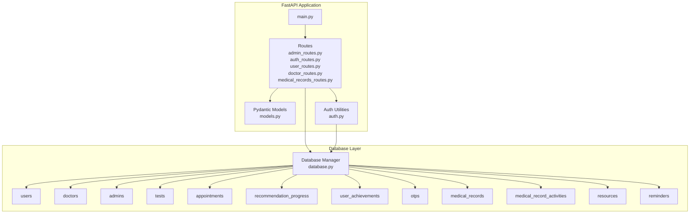
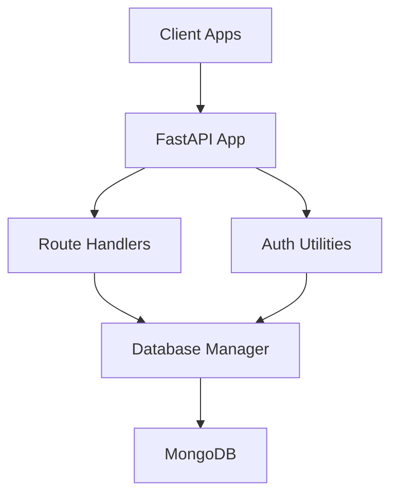
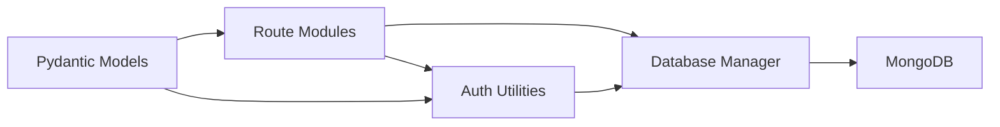

# Database Design

<cite>
**Referenced Files in This Document**
- [database.py](file://backend/app/database.py)
- [models.py](file://backend/app/models.py)
- [config.py](file://backend/app/config.py)
- [main.py](file://backend/app/main.py)
- [auth.py](file://backend/app/auth.py)
- [admin_routes.py](file://backend/app/routes/admin_routes.py)
- [auth_routes.py](file://backend/app/routes/auth_routes.py)
- [user_routes.py](file://backend/app/routes/user_routes.py)
- [doctor_routes.py](file://backend/app/routes/doctor_routes.py)
- [medical_records_routes.py](file://backend/app/routes/medical_records_routes.py)
</cite>

## Table of Contents
1. [Introduction](#introduction)
2. [Project Structure](#project-structure)
3. [Core Components](#core-components)
4. [Architecture Overview](#architecture-overview)
5. [Detailed Component Analysis](#detailed-component-analysis)
6. [Dependency Analysis](#dependency-analysis)
7. [Performance Considerations](#performance-considerations)
8. [Troubleshooting Guide](#troubleshooting-guide)
9. [Conclusion](#conclusion)
10. [Appendices](#appendices)

## Introduction
This document describes the MongoDB database design and schema for the AI Stress Detector project. It covers collection structure, entity relationships, data modeling decisions, Pydantic models used for validation and serialization, database connection management and pooling, indexing strategies, and operational aspects such as initialization and admin account creation. It also outlines CRUD operations, aggregation pipelines, query optimization, data integrity constraints, validation rules, and migration strategies.

## Project Structure
The backend is organized around a FastAPI application with modular routing. Database access is centralized in a single module that manages collections, connection pooling, indexes, and administrative tasks. Authentication utilities integrate with the database to manage users, doctors, and admins. Medical records functionality is provided as an optional module.

**Diagram sources**
- [main.py:70-79](file://backend/app/main.py#L70-L79)
- [database.py:88-159](file://backend/app/database.py#L88-L159)
- [models.py:16-440](file://backend/app/models.py#L16-L440)
- [auth.py:16-19](file://backend/app/auth.py#L16-L19)

**Section sources**
- [main.py:52-80](file://backend/app/main.py#L52-L80)
- [database.py:88-159](file://backend/app/database.py#L88-L159)

## Core Components
- Database manager: centralizes connection, pools, indexes, and helper functions.
- Collections: users, doctors, admins, tests, appointments, recommendation_progress, user_achievements, otps, medical_records, medical_record_activities, resources, reminders.
- Pydantic models: define validation and serialization for all entities and DTOs.
- Authentication utilities: JWT token creation/verification and role-based access control.
- Route modules: expose endpoints for CRUD, aggregation, and analytics.

Key responsibilities:
- Connection pooling and graceful shutdown.
- Index creation for performance.
- Admin initialization from environment variables.
- Helper functions for user lookup, achievements, and medical records.

**Section sources**
- [database.py:30-83](file://backend/app/database.py#L30-L83)
- [database.py:164-302](file://backend/app/database.py#L164-L302)
- [database.py:307-339](file://backend/app/database.py#L307-L339)
- [database.py:344-390](file://backend/app/database.py#L344-L390)
- [database.py:421-502](file://backend/app/database.py#L421-L502)

## Architecture Overview
The system uses a single MongoDB instance accessed via a pooled client. Routes depend on the database manager for all persistence operations. Authentication utilities enforce role-based access and validate JWT tokens. Optional medical records routes extend functionality with file uploads, downloads, and PDF generation.

**Diagram sources**
- [main.py:52-80](file://backend/app/main.py#L52-L80)
- [auth.py:98-151](file://backend/app/auth.py#L98-L151)
- [database.py:30-83](file://backend/app/database.py#L30-L83)

## Detailed Component Analysis

### Database Connection and Pooling
- Connection pooling: maxPoolSize=50, minPoolSize=10, with timeouts for server selection, connection, and socket operations.
- Write concern: majority acknowledgment.
- Graceful shutdown closes the client.
- Health check endpoint pings the database.

Operational implications:
- Improved concurrency under load.
- Reduced connection overhead.
- Robust error handling with fallback behavior when DB is unavailable.

**Section sources**
- [database.py:30-41](file://backend/app/database.py#L30-L41)
- [database.py:70-82](file://backend/app/database.py#L70-L82)
- [main.py:114-132](file://backend/app/main.py#L114-L132)

### Admin Initialization
- On startup, the system attempts to create a default admin user if none exists.
- Password is loaded from environment variable ADMIN_PASSWORD.
- Default admin email is set; after first login, administrators must change the default password.

Security considerations:
- Admin password must be set via environment variable.
- Default admin credentials must be changed post-initialization.

**Section sources**
- [database.py:307-339](file://backend/app/database.py#L307-L339)
- [main.py:81-88](file://backend/app/main.py#L81-L88)

### Indexes and Query Optimization
Indexes are created per collection to optimize frequent queries:

- Users: unique email, created_at descending, email_verified.
- Doctors: unique email, unique license_number, is_verified, nmc_verified, state_medical_council, email_verified.
- Tests: user_id ascending, timestamp descending, compound (user_id, timestamp desc).
- Appointments: user_id, doctor_id, status, created_at descending; compound (doctor_id, created_at desc), (doctor_id, status).
- Recommendation progress: unique (user_id, recommendation_id), user_id, status, started_at, completed_at.
- Achievements: unique user_id, points descending, level descending, streak_days descending.
- OTPs: unique email, created_at descending, expires_at with TTL.
- Medical records: user_id, record_type, uploaded_at descending, deleted, compound (user_id, uploaded_at desc), (user_id, record_type), (user_id, deleted, uploaded_at desc), is_linked_to_stress_test, linked_test_id, file_hash; text index on record_name, description, notes.
- Activities: record_id, timestamp, compound (record_id, timestamp).

Benefits:
- Efficient lookups for user profiles, doctor verification, test history, appointment lists, progress tracking, and medical record searches.

**Section sources**
- [database.py:164-298](file://backend/app/database.py#L164-L298)

### Schema Definitions

#### Users
- Fields include personal info, contact details, role, verification flags, timestamps, and optional test history.
- Unique constraints: email.
- Validation: Pydantic validators enforce gender choices and age ranges.

**Section sources**
- [database.py:89-93](file://backend/app/database.py#L89-L93)
- [models.py:16-31](file://backend/app/models.py#L16-L31)

#### Doctors
- Fields include professional info, license, council, specialization, availability, verification flags, and timestamps.
- Unique constraints: email, license_number.
- Validation: license number format enforced during registration.

**Section sources**
- [database.py:94-99](file://backend/app/database.py#L94-L99)
- [models.py:52-72](file://backend/app/models.py#L52-L72)
- [auth_routes.py:159-163](file://backend/app/routes/auth_routes.py#L159-L163)

#### Admins
- Fields include credentials, role, and metadata.
- Used for administrative access and analytics.

**Section sources**
- [database.py:99-103](file://backend/app/database.py#L99-L103)
- [auth.py:16-18](file://backend/app/auth.py#L16-L18)

#### Tests
- Fields include user_id, responses, computed stress metrics, recommendations, timestamps, and derived fields.
- Indexed by user_id and timestamp for efficient history retrieval.

**Section sources**
- [database.py:106-110](file://backend/app/database.py#L106-L110)
- [models.py:78-90](file://backend/app/models.py#L78-L90)
- [user_routes.py:407-499](file://backend/app/routes/user_routes.py#L407-L499)

#### Appointments
- Fields include user and doctor identifiers, time slot, status, notes, and timestamps.
- Indexed by user_id, doctor_id, status, created_at; optimized aggregation for doctor views.

**Section sources**
- [database.py:111-115](file://backend/app/database.py#L111-L115)
- [models.py:95-114](file://backend/app/models.py#L95-L114)
- [doctor_routes.py:48-134](file://backend/app/routes/doctor_routes.py#L48-L134)

#### Recommendation Progress
- Tracks recommendation lifecycle per user with status, reminders, and completion metadata.
- Unique composite index prevents duplicate tracking entries.

**Section sources**
- [database.py:118-122](file://backend/app/database.py#L118-L122)
- [models.py:173-204](file://backend/app/models.py#L173-L204)

#### User Achievements
- Tracks gamification metrics: badges, points, levels, streaks, activity counts.
- Unique index on user_id ensures one achievement record per user.

**Section sources**
- [database.py:123-127](file://backend/app/database.py#L123-L127)
- [models.py:209-226](file://backend/app/models.py#L209-L226)

#### OTPs
- Persistent OTPs with TTL for expiration.
- Unique index on email.

**Section sources**
- [database.py:142-146](file://backend/app/database.py#L142-L146)
- [models.py:125-131](file://backend/app/models.py#L125-L131)

#### Medical Records
- Fields include user_id, metadata, file info, linking to stress tests, and audit fields.
- Text index supports free-text search across record attributes.
- Compound indexes optimize common queries by user and date/type.

**Section sources**
- [database.py:149-153](file://backend/app/database.py#L149-L153)
- [models.py:300-352](file://backend/app/models.py#L300-L352)
- [medical_records_routes.py:284-357](file://backend/app/routes/medical_records_routes.py#L284-L357)

#### Medical Record Activities
- Audit trail for record events (upload, download, update, delete, link).

**Section sources**
- [database.py:154-158](file://backend/app/database.py#L154-L158)
- [models.py:434-440](file://backend/app/models.py#L434-L440)

#### Resources and Reminders
- Additional collections for external resources and reminders.

**Section sources**
- [database.py:130-139](file://backend/app/database.py#L130-L139)
- [models.py:250-271](file://backend/app/models.py#L250-L271)

### Pydantic Models for Validation and Serialization
- UserRegister/UserResponse: validates age, gender, location, and optional phone number.
- DoctorRegister/DoctorResponse: validates license number format and includes availability slots.
- TestSubmission/TestResponse: enforces 18-question responses and numeric ranges.
- AppointmentCreate/AppointmentResponse/AppointmentUpdate: enforces status values and optional notes.
- TokenResponse/OTPVerify/ResendOTPRequest/ChangePassword: validates OTP length and password constraints.
- Enhanced recommendation models: detailed recommendation structure with categories, difficulty, and scheduling.
- Gamification models: achievements, progress tracking, and level calculations.
- Medical record models: enums for types and formats, upload/update/filter DTOs, download and bulk-download requests.
- Analytics models: statistics for medical records.
- Chatbot models: messaging and stress detection responses.
- Record activity model: audit actions.

Validation rules:
- Age bounds, gender enumeration, OTP length, password minimum length, and response ranges.
- Enums for record types and file formats.
- Object ID validation in routes for safety.

**Section sources**
- [models.py:16-440](file://backend/app/models.py#L16-L440)

### Authentication and Role-Based Access Control
- JWT-based authentication with configurable secret, algorithm, and expiration.
- Token creation/verification utilities.
- Role-based dependency injection ensures endpoints enforce access policies.
- Admin-only endpoints validated via role checker.

**Section sources**
- [auth.py:23-55](file://backend/app/auth.py#L23-L55)
- [auth.py:98-151](file://backend/app/auth.py#L98-L151)
- [auth_routes.py:377-439](file://backend/app/routes/auth_routes.py#L377-L439)

### CRUD Operations and Aggregation Pipelines

#### Users
- Create: Registration endpoints insert user documents and generate OTPs.
- Read: Profile endpoints support self-view and admin access.
- Update: Profile update endpoint validates fields and applies updates.
- Delete: Admin endpoints remove users and associated data.

**Section sources**
- [auth_routes.py:68-132](file://backend/app/routes/auth_routes.py#L68-L132)
- [user_routes.py:45-123](file://backend/app/routes/user_routes.py#L45-L123)
- [admin_routes.py:181-198](file://backend/app/routes/admin_routes.py#L181-L198)

#### Doctors
- Create: Doctor registration validates license number, performs NMC verification, and stores profile.
- Read: Doctor endpoints support verification status and appointment statistics.
- Update: Admin can toggle verification; doctor endpoints update status with asynchronous notifications.
- Delete: Admin removes doctor and associated appointments.

**Section sources**
- [auth_routes.py:134-234](file://backend/app/routes/auth_routes.py#L134-L234)
- [doctor_routes.py:48-134](file://backend/app/routes/doctor_routes.py#L48-L134)
- [admin_routes.py:200-214](file://backend/app/routes/admin_routes.py#L200-L214)

#### Tests
- Create: Submit test responses and receive ML predictions with explanations.
- Read: Retrieve test history and detailed results with authorization checks.
- Update: Not applicable; tests are immutable.

**Section sources**
- [user_routes.py:407-499](file://backend/app/routes/user_routes.py#L407-L499)
- [user_routes.py:501-569](file://backend/app/routes/user_routes.py#L501-L569)

#### Appointments
- Create: Users request appointments; doctors approve/reject/complete with notifications.
- Read: Doctor endpoints aggregate appointments with patient test history via aggregation.
- Update: Status transitions with asynchronous email/SMS notifications.
- Delete: Not exposed; handled via status updates.

Aggregation pipeline highlights:
- Join appointments with latest tests per user.
- Sort and limit test history for performance.

**Section sources**
- [doctor_routes.py:48-134](file://backend/app/routes/doctor_routes.py#L48-L134)
- [doctor_routes.py:171-267](file://backend/app/routes/doctor_routes.py#L171-L267)
- [doctor_routes.py:366-399](file://backend/app/routes/doctor_routes.py#L366-L399)

#### Medical Records
- Create: Upload with file validation, storage checks, and metadata persistence.
- Read: List by user with filtering and search; get single record with authorization.
- Update: Metadata updates without replacing files.
- Delete: Soft delete by default; hard delete available with file removal.
- Download: Stream files or auto-generate PDF for stress test records.
- Bulk download: ZIP multiple records.

**Section sources**
- [medical_records_routes.py:149-278](file://backend/app/routes/medical_records_routes.py#L149-L278)
- [medical_records_routes.py:284-407](file://backend/app/routes/medical_records_routes.py#L284-L407)
- [medical_records_routes.py:413-500](file://backend/app/routes/medical_records_routes.py#L413-L500)
- [medical_records_routes.py:506-547](file://backend/app/routes/medical_records_routes.py#L506-L547)
- [medical_records_routes.py:786-800](file://backend/app/routes/medical_records_routes.py#L786-L800)

#### Recommendations and Achievements
- Track recommendation progress, mark completion, dismiss, and save for later.
- Retrieve achievements and calculate level/points.

**Section sources**
- [user_routes.py:649-753](file://backend/app/routes/user_routes.py#L649-L753)
- [user_routes.py:759-803](file://backend/app/routes/user_routes.py#L759-L803)

### Data Integrity Constraints and Validation Rules
- Unique indexes on email (users/doctors/admins), license_number (doctors), and (user_id, recommendation_id) (progress).
- TTL index on OTPs for automatic cleanup.
- Text search index on medical records for discoverability.
- Pydantic validation ensures field types, lengths, and enumerations.
- Object ID validation and authorization checks in routes prevent unauthorized access.

**Section sources**
- [database.py:177-191](file://backend/app/database.py#L177-L191)
- [database.py:248-251](file://backend/app/database.py#L248-L251)
- [database.py:280-285](file://backend/app/database.py#L280-L285)
- [models.py:16-31](file://backend/app/models.py#L16-L31)
- [models.py:52-72](file://backend/app/models.py#L52-L72)
- [models.py:125-131](file://backend/app/models.py#L125-L131)
- [models.py:300-352](file://backend/app/models.py#L300-L352)

### Migration Strategies
- Index creation runs at startup; ensure downtime windows for background index builds if needed.
- Admin initialization relies on environment variables; set ADMIN_PASSWORD before first startup.
- For schema changes:
  - Add new indexes via create_indexes().
  - Introduce new collections as needed.
  - Maintain backward compatibility in models and routes.
  - Use aggregation pipelines to minimize breaking changes to consumers.

**Section sources**
- [database.py:504-509](file://backend/app/database.py#L504-L509)
- [database.py:307-339](file://backend/app/database.py#L307-L339)

## Dependency Analysis
The application exhibits clear separation of concerns:
- Routes depend on database manager and auth utilities.
- Database manager encapsulates MongoDB client and collections.
- Models define shared validation and serialization contracts.
- Auth utilities centralize JWT logic and role enforcement.

**Diagram sources**
- [database.py:88-159](file://backend/app/database.py#L88-L159)
- [auth.py:16-19](file://backend/app/auth.py#L16-L19)
- [models.py:16-440](file://backend/app/models.py#L16-L440)

**Section sources**
- [main.py:70-79](file://backend/app/main.py#L70-L79)
- [database.py:88-159](file://backend/app/database.py#L88-L159)
- [auth.py:98-151](file://backend/app/auth.py#L98-L151)

## Performance Considerations
- Connection pooling reduces latency and improves throughput.
- Strategic indexes reduce query times for common operations.
- Aggregation pipelines minimize round trips (e.g., doctor appointment listing).
- Background index creation avoids blocking primary operations.
- Asynchronous notifications decouple I/O from request handling.

[No sources needed since this section provides general guidance]

## Troubleshooting Guide
Common issues and resolutions:
- Database connectivity failures: verify MONGODB_URL and network access; check serverSelectionTimeout and connectTimeout settings.
- Admin initialization warnings: set ADMIN_PASSWORD environment variable before startup.
- Index creation failures: review permissions and ensure background index builds are allowed.
- Authorization errors: confirm JWT presence and validity; verify role claims.
- Medical records upload failures: check file size limits, allowed extensions, and storage quotas.

**Section sources**
- [database.py:30-54](file://backend/app/database.py#L30-L54)
- [database.py:321-326](file://backend/app/database.py#L321-L326)
- [database.py:300-302](file://backend/app/database.py#L300-L302)
- [auth.py:103-151](file://backend/app/auth.py#L103-L151)
- [medical_records_routes.py:171-187](file://backend/app/routes/medical_records_routes.py#L171-L187)

## Conclusion
The MongoDB design leverages connection pooling, targeted indexes, and aggregation pipelines to deliver responsive performance. Pydantic models ensure robust validation and serialization across the stack. Administrative initialization and role-based access control provide strong security foundations. The schema supports core features—stress testing, appointments, recommendations, gamification, and medical records—while enabling extensibility for future enhancements.

[No sources needed since this section summarizes without analyzing specific files]

## Appendices

### Environment Variables
- MONGODB_URL: MongoDB connection string.
- ADMIN_PASSWORD: Initial admin password for secure bootstrap.
- JWT_SECRET_KEY or SECRET_KEY: Secret for JWT signing.
- ACCESS_TOKEN_EXPIRE_MINUTES: Token lifetime.
- SMTP_* and related email/SMS configuration variables.

**Section sources**
- [config.py:9-21](file://backend/app/config.py#L9-L21)
- [database.py:321-326](file://backend/app/database.py#L321-L326)
- [auth.py:24-31](file://backend/app/auth.py#L24-L31)