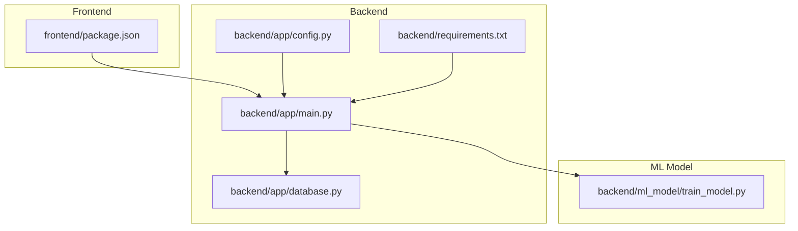
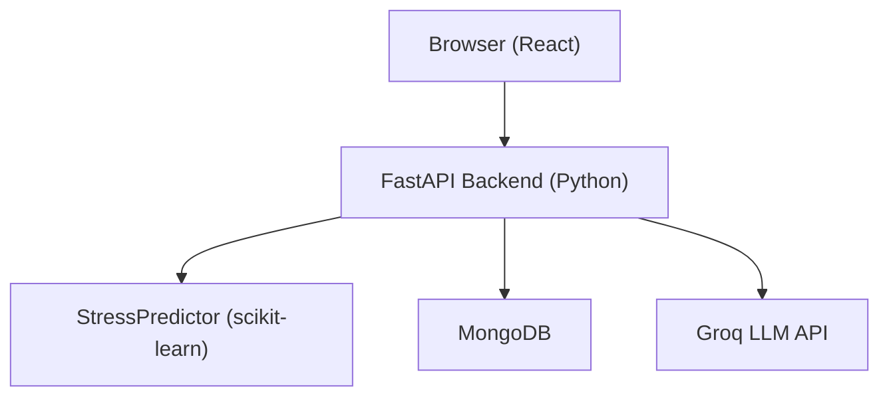
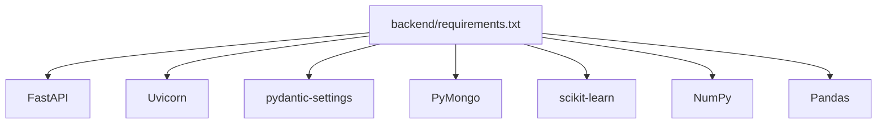

# Deployment and Operations

<cite>
**Referenced Files in This Document**
- [README.md](file://README.md)
- [ARCHITECTURE_EXPLAINED.md](file://ARCHITECTURE_EXPLAINED.md)
- [backend/app/main.py](file://backend/app/main.py)
- [backend/app/config.py](file://backend/app/config.py)
- [backend/app/database.py](file://backend/app/database.py)
- [backend/requirements.txt](file://backend/requirements.txt)
- [backend/start.sh](file://backend/start.sh)
- [backend/test.sh](file://backend/test.sh)
- [frontend/package.json](file://frontend/package.json)
</cite>

## Table of Contents
1. [Introduction](#introduction)
2. [Project Structure](#project-structure)
3. [Core Components](#core-components)
4. [Architecture Overview](#architecture-overview)
5. [Detailed Component Analysis](#detailed-component-analysis)
6. [Dependency Analysis](#dependency-analysis)
7. [Performance Considerations](#performance-considerations)
8. [Troubleshooting Guide](#troubleshooting-guide)
9. [Conclusion](#conclusion)
10. [Appendices](#appendices)

## Introduction
This document provides comprehensive deployment and operations guidance for the AI Stress Level Analyzer. It covers production deployment across Railway, Render, and Heroku; environment configuration; scaling considerations; monitoring and maintenance; CI/CD and automated testing; backup and recovery; disaster recovery planning; operational best practices; performance tuning; troubleshooting; development versus production differences; and operational security considerations.

## Project Structure
The system consists of:
- A FastAPI backend (Python) serving REST endpoints, integrating machine learning inference and MongoDB persistence.
- A React frontend (TypeScript) consuming the backend API.
- A machine learning module that trains and serves a stress prediction model.
- Scripts for quick start and system testing.

**Diagram sources**
- [backend/app/main.py:1-137](file://backend/app/main.py#L1-L137)
- [backend/app/config.py:1-22](file://backend/app/config.py#L1-L22)
- [backend/app/database.py:1-509](file://backend/app/database.py#L1-L509)
- [backend/requirements.txt:1-22](file://backend/requirements.txt#L1-L22)
- [frontend/package.json:1-27](file://frontend/package.json#L1-L27)

**Section sources**
- [README.md:698-760](file://README.md#L698-L760)

## Core Components
- Application entry and routing: FastAPI app with CORS, routers, health check, and startup/shutdown hooks.
- Configuration: Centralized settings via Pydantic settings with environment-backed defaults.
- Database: MongoDB connection with connection pooling, index creation, and graceful shutdown.
- ML model: Trained model loaded at startup with auto-recovery and metadata.
- Frontend: Vite-based React app configured for API consumption.

**Section sources**
- [backend/app/main.py:52-137](file://backend/app/main.py#L52-L137)
- [backend/app/config.py:3-22](file://backend/app/config.py#L3-L22)
- [backend/app/database.py:30-83](file://backend/app/database.py#L30-L83)
- [backend/requirements.txt:1-22](file://backend/requirements.txt#L1-L22)
- [frontend/package.json:1-27](file://frontend/package.json#L1-L27)

## Architecture Overview
The runtime architecture integrates the frontend, backend, ML model, and MongoDB. The backend exposes REST endpoints, performs validation, invokes ML inference, and persists results.

**Diagram sources**
- [ARCHITECTURE_EXPLAINED.md:68-86](file://ARCHITECTURE_EXPLAINED.md#L68-L86)
- [README.md:644-662](file://README.md#L644-L662)

## Detailed Component Analysis

### Backend Deployment (Railway / Render / Heroku)
- Platform setup
  - Set environment variables for secrets and external services.
  - Configure the MongoDB connection string and admin password.
  - Provide the Groq API key and model identifier.
- Build and run
  - Backend uses Uvicorn to serve the FastAPI app.
  - The application loads environment variables early and initializes database connections on startup.
- CORS and security
  - Configure ALLOWED_ORIGINS to include production frontend URLs.
  - Use strong JWT_SECRET_KEY and rotate periodically.
- Health and readiness
  - Use the /health endpoint to validate database connectivity.
  - Ensure the ML model is present or can auto-retrain on startup.

Operational steps
- Railway
  - Create a new project and connect your Git repository.
  - Set environment variables in the Railway dashboard.
  - Choose a Python buildpack/runtime and configure the process to run the FastAPI app.
- Render
  - Connect your repository and set environment variables.
  - Configure the web service to use the backend directory and run the FastAPI app.
- Heroku
  - Provision a Python dyno.
  - Set environment variables and configure the web process to start the backend.

**Section sources**
- [README.md:644-662](file://README.md#L644-L662)
- [backend/app/main.py:14-16](file://backend/app/main.py#L14-L16)
- [backend/app/main.py:32-50](file://backend/app/main.py#L32-L50)
- [backend/app/main.py:114-132](file://backend/app/main.py#L114-L132)
- [backend/app/database.py:30-46](file://backend/app/database.py#L30-L46)

### Frontend Deployment (Vercel / Netlify)
- Build configuration
  - Set the build command to produce a static site.
  - Provide the backend URL via VITE_API_URL.
- Environment isolation
  - Use production environment variables for the API base URL.
- Domain and SSL
  - Configure custom domains and ensure HTTPS termination at the CDN edge.

**Section sources**
- [README.md:656-661](file://README.md#L656-L661)
- [frontend/package.json:5-9](file://frontend/package.json#L5-L9)

### Environment Configuration
Critical environment variables
- Required
  - JWT_SECRET_KEY: Strong secret for JWT signing.
  - ADMIN_PASSWORD: Initial admin password at first startup.
  - MONGODB_URL: MongoDB connection string.
- Optional services
  - GROQ_API_KEY and GROQ_CHAT_MODEL: For the AI chatbot.
  - SMTP_* and FROM_EMAIL: For OTP verification.
  - SMS provider keys (if used).
  - ALLOWED_ORIGINS: Comma-separated list of frontend origins.
  - ACCESS_TOKEN_EXPIRE_MINUTES: JWT expiry duration.

Validation and defaults
- CORS origins are parsed and validated; defaults to localhost if none provided.
- Settings are loaded via Pydantic settings with an env file.

**Section sources**
- [README.md:445-478](file://README.md#L445-L478)
- [backend/app/config.py:3-22](file://backend/app/config.py#L3-L22)
- [backend/app/main.py:32-50](file://backend/app/main.py#L32-L50)

### Scaling Considerations
- Horizontal scaling
  - Run multiple backend instances behind a load balancer.
  - Ensure MongoDB is deployed with replica sets and appropriate read preferences.
- Concurrency and timeouts
  - The backend uses Uvicorn; tune worker count and keepalive timeouts per platform.
  - MongoDB connection pooling is configured; ensure adequate pool sizes for peak concurrency.
- Model inference
  - The model is loaded once at startup; keep instances warm to avoid cold-start latency.
- Static assets
  - Serve the frontend from a CDN for improved global latency.

**Section sources**
- [backend/app/database.py:30-41](file://backend/app/database.py#L30-L41)
- [backend/requirements.txt:10](file://backend/requirements.txt#L10)

### Monitoring and Maintenance
- Health checks
  - Use the /health endpoint to verify database connectivity and overall service status.
- Logging
  - Integrate application logs with platform logging (Railway/Render/Heroku logs).
  - Ensure logs do not emit secrets; sanitize environment variable outputs.
- Database maintenance
  - Monitor index usage and rebuild indexes if necessary.
  - Track collection sizes and growth trends.
- ML model observability
  - Track model metadata and accuracy over time.
  - Alert on model staleness or performance degradation.

**Section sources**
- [backend/app/main.py:114-132](file://backend/app/main.py#L114-L132)
- [backend/app/database.py:164-302](file://backend/app/database.py#L164-L302)

### CI/CD Pipeline and Automated Testing
- CI/CD
  - Use platform-native pipelines or GitHub Actions to build and deploy.
  - Separate workflows for linting, unit tests, and deployment to staging/prod.
- Automated testing
  - Backend test script validates health, endpoints, and file presence.
  - Frontend tests can be integrated via npm scripts.
- Rollback and canary
  - Implement staged rollouts and automated rollback on health check failures.

**Section sources**
- [backend/test.sh:1-198](file://backend/test.sh#L1-L198)
- [frontend/package.json:5-9](file://frontend/package.json#L5-L9)

### Backup and Recovery Procedures
- Database backups
  - Use MongoDB Atlas backup or cloud provider snapshot mechanisms.
  - Schedule regular automated backups and retain multiple recovery points.
- Model artifacts
  - Store model binaries and metadata in a secure artifact repository.
  - Version and tag model releases.
- DR planning
  - Define RTO/RPO targets; replicate MongoDB across regions.
  - Automate failover and DNS switchover procedures.

[No sources needed since this section provides general guidance]

### Operational Best Practices
- Secrets management
  - Never commit secrets; use platform-managed secrets or encrypted env files.
- Network security
  - Restrict inbound traffic to necessary ports; enable WAF/CDN protection.
- Resource limits
  - Set CPU/memory limits and autoscaling policies.
- Observability
  - Enable structured logging and metrics; integrate with APM/Sentry.
- Patching
  - Regularly update Python dependencies and OS packages.

[No sources needed since this section provides general guidance]

### Performance Tuning
- Database
  - Ensure indexes exist and monitor slow queries.
  - Use connection pooling and tune timeouts.
- Inference
  - Keep model warm; avoid frequent reloads.
  - Consider quantization or model distillation if latency is critical.
- CDN and caching
  - Cache static assets and API responses where safe.

**Section sources**
- [backend/app/database.py:164-302](file://backend/app/database.py#L164-L302)

### Troubleshooting Common Issues
- MongoDB connectivity
  - Verify the connection string and network access.
  - Check replica set status and authentication.
- CORS errors
  - Confirm ALLOWED_ORIGINS includes the production frontend origin.
- Model not found
  - The model auto-reloads on startup; ensure dataset availability or trigger manual training.
- Frontend API errors
  - Confirm VITE_API_URL points to the correct backend URL and that CORS is configured.

**Section sources**
- [README.md:664-696](file://README.md#L664-L696)
- [backend/app/main.py:32-50](file://backend/app/main.py#L32-L50)
- [backend/app/database.py:30-46](file://backend/app/database.py#L30-L46)

### Development vs Production Differences
- Environment variables
  - Use distinct .env files for development and production secrets.
- CORS
  - Allow localhost origins during development; restrict to production domains in production.
- Database
  - Use local MongoDB for development; Atlas for production.
- Logging and observability
  - Enable structured logging and metrics in production.
- Model lifecycle
  - In development, model auto-retraining is acceptable; in production, pin model versions and monitor drift.

**Section sources**
- [backend/app/main.py:32-50](file://backend/app/main.py#L32-L50)
- [README.md:445-478](file://README.md#L445-L478)

### Operational Security Considerations
- Secrets
  - Store JWT_SECRET_KEY, database passwords, and API keys in platform secrets.
- Transport
  - Enforce HTTPS/TLS at CDN and platform layers.
- Access control
  - Use role-based access control and enforce JWT validation on all protected endpoints.
- Audit
  - Log administrative actions and monitor for anomalies.

**Section sources**
- [README.md:630-641](file://README.md#L630-L641)
- [backend/app/main.py:114-132](file://backend/app/main.py#L114-L132)

## Dependency Analysis
Runtime dependencies and their roles:
- FastAPI and Uvicorn: Web framework and ASGI server.
- Pydantic and pydantic-settings: Configuration loading and validation.
- PyMongo: MongoDB driver with connection pooling.
- scikit-learn, NumPy, Pandas: ML training/inference.
- Requests and aiosmtplib: HTTP and async email.
- pytest and httpx: Testing and HTTP client for tests.

**Diagram sources**
- [backend/requirements.txt:1-22](file://backend/requirements.txt#L1-L22)

**Section sources**
- [backend/requirements.txt:1-22](file://backend/requirements.txt#L1-L22)

## Performance Considerations
- Database
  - Connection pooling and timeouts are configured; ensure pool sizes match expected concurrency.
  - Indexes are created on startup; monitor query performance and adjust indexes as needed.
- Model
  - Model is loaded once at startup; keep instances warm to avoid cold-start latency.
- Frontend
  - Serve via CDN and enable compression; optimize bundle size.

**Section sources**
- [backend/app/database.py:30-41](file://backend/app/database.py#L30-L41)
- [backend/app/database.py:164-302](file://backend/app/database.py#L164-L302)

## Troubleshooting Guide
- Health endpoint failures
  - Inspect database connectivity and error logs.
- CORS failures
  - Validate ALLOWED_ORIGINS and trailing slashes.
- Model issues
  - Confirm model file presence and auto-retraining logs.
- Frontend connectivity
  - Verify VITE_API_URL and platform proxy settings.

**Section sources**
- [backend/app/main.py:114-132](file://backend/app/main.py#L114-L132)
- [backend/test.sh:35-82](file://backend/test.sh#L35-L82)

## Conclusion
This guide outlines a production-ready deployment and operations strategy for the AI Stress Level Analyzer. By following environment segregation, platform-specific configurations, health monitoring, CI/CD automation, and security best practices, teams can reliably operate the system at scale while maintaining performance and resilience.

## Appendices

### Appendix A: Quick Start and Test Scripts
- Quick start script provisions backend and frontend environments and launches both servers.
- Test script validates MongoDB, backend, frontend, ML model, and critical files.

**Section sources**
- [backend/start.sh:1-94](file://backend/start.sh#L1-L94)
- [backend/test.sh:1-198](file://backend/test.sh#L1-L198)