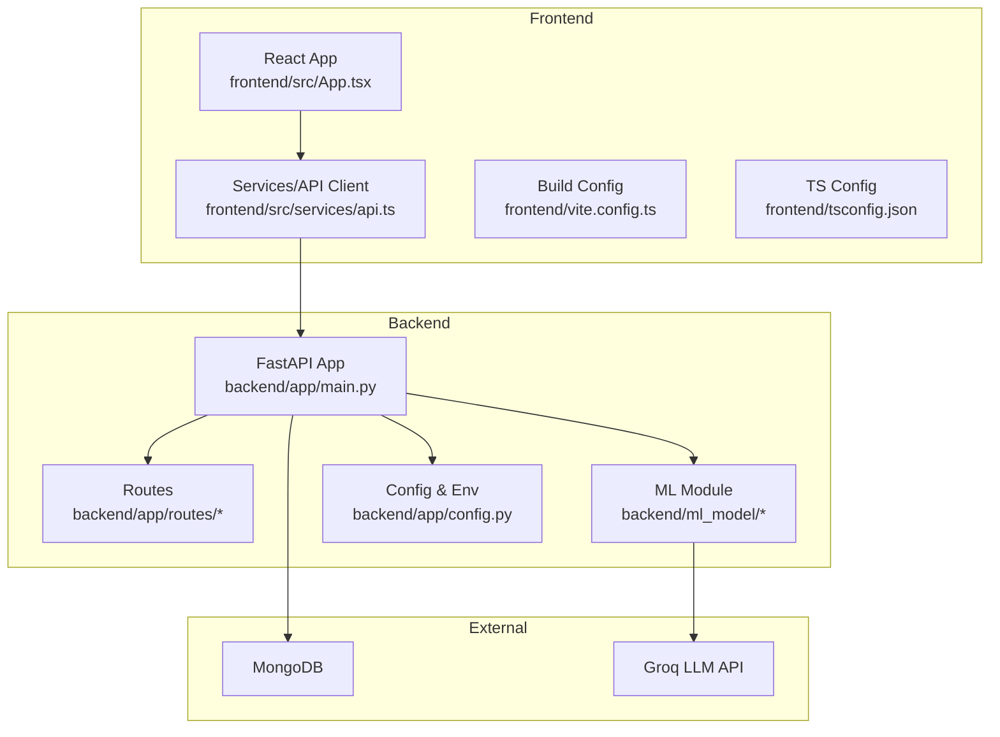
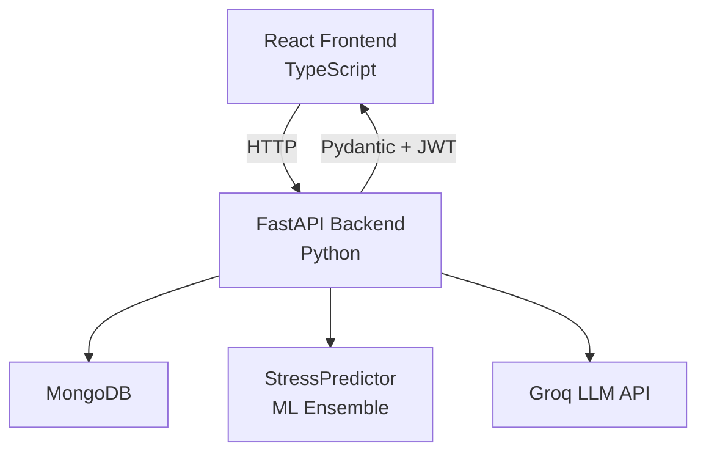
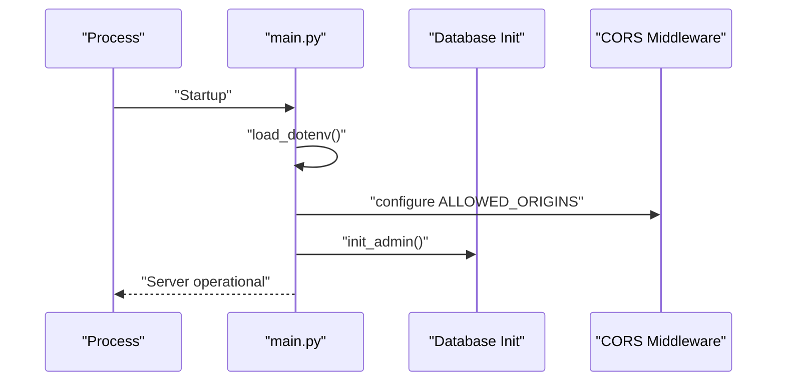
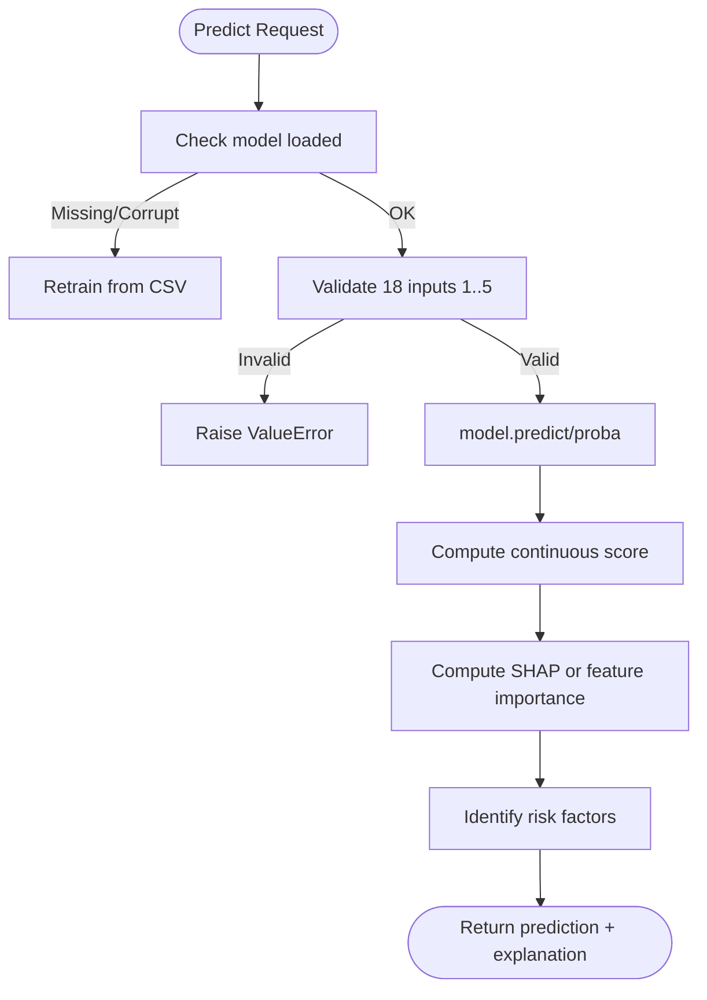
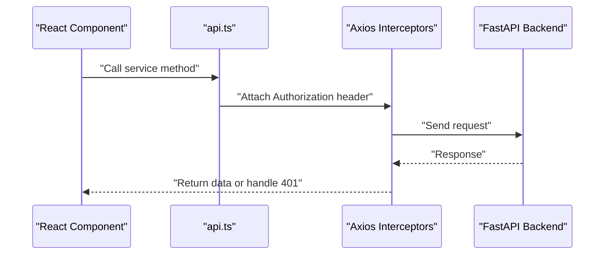
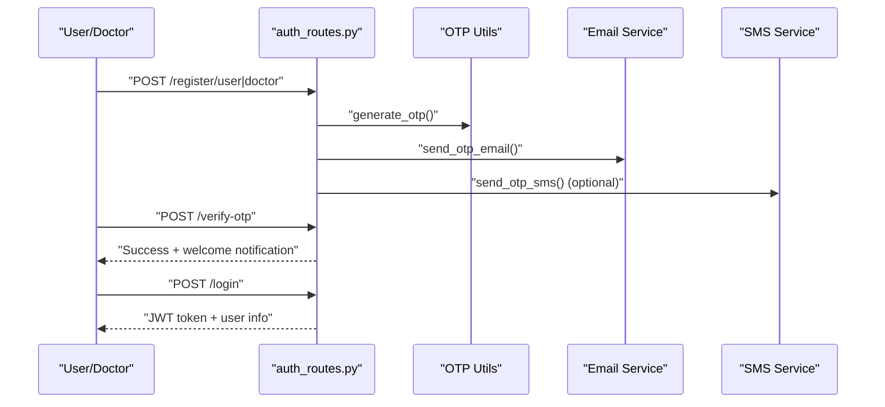
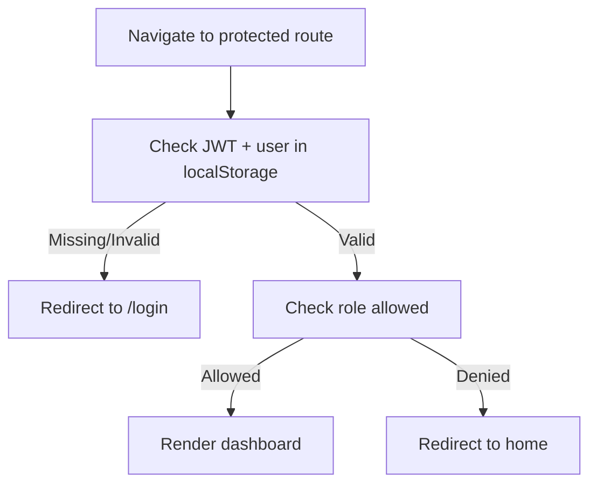
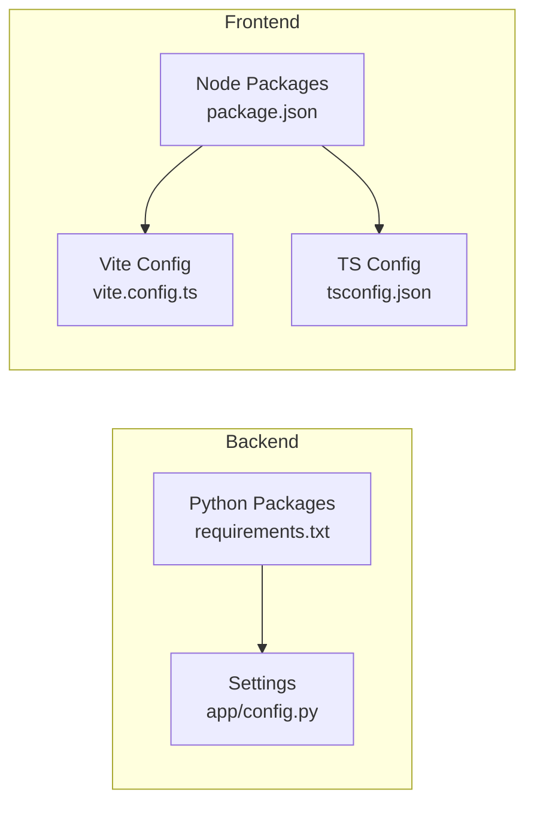

# Development Guidelines

<cite>
**Referenced Files in This Document**
- [README.md](file://README.md)
- [ARCHITECTURE_EXPLAINED.md](file://ARCHITECTURE_EXPLAINED.md)
- [backend/requirements.txt](file://backend/requirements.txt)
- [frontend/package.json](file://frontend/package.json)
- [backend/app/main.py](file://backend/app/main.py)
- [backend/app/config.py](file://backend/app/config.py)
- [frontend/vite.config.ts](file://frontend/vite.config.ts)
- [frontend/tsconfig.json](file://frontend/tsconfig.json)
- [backend/ml_model/predictor.py](file://backend/ml_model/predictor.py)
- [frontend/src/services/api.ts](file://frontend/src/services/api.ts)
- [backend/app/routes/auth_routes.py](file://backend/app/routes/auth_routes.py)
- [frontend/src/App.tsx](file://frontend/src/App.tsx)
- [frontend/src/main.tsx](file://frontend/src/main.tsx)
- [start.sh](file://start.sh)
- [test.sh](file://test.sh)
</cite>

## Table of Contents
1. [Introduction](#introduction)
2. [Project Structure](#project-structure)
3. [Core Components](#core-components)
4. [Architecture Overview](#architecture-overview)
5. [Detailed Component Analysis](#detailed-component-analysis)
6. [Dependency Analysis](#dependency-analysis)
7. [Performance Considerations](#performance-considerations)
8. [Troubleshooting Guide](#troubleshooting-guide)
9. [Conclusion](#conclusion)
10. [Appendices](#appendices)

## Introduction
This document provides comprehensive development guidelines for the AI Stress Level Analyzer. It consolidates contributing guidelines, development environment setup, debugging techniques, coding standards for Python backend and TypeScript frontend, project structure conventions, naming patterns, architectural guidelines, feature extension practices, backward compatibility considerations, development workflow, version control practices, collaborative procedures, and code review quality gates.

## Project Structure
The project follows a clear separation of concerns:
- Backend (Python/FastAPI): application entry point, routing, authentication, ML integration, and database access
- Frontend (TypeScript/React): UI, routing, services, and type-safe API clients
- Machine Learning module: trained models, predictors, and training utilities
- Data assets: public datasets and audio assets used for training and inference

**Diagram sources**
- [backend/app/main.py:52-80](file://backend/app/main.py#L52-L80)
- [frontend/src/App.tsx:30-85](file://frontend/src/App.tsx#L30-L85)
- [frontend/src/services/api.ts:12-19](file://frontend/src/services/api.ts#L12-L19)
- [backend/app/config.py:3-22](file://backend/app/config.py#L3-L22)

**Section sources**
- [README.md:698-761](file://README.md#L698-L761)
- [backend/app/main.py:52-80](file://backend/app/main.py#L52-L80)
- [frontend/src/App.tsx:30-85](file://frontend/src/App.tsx#L30-L85)

## Core Components
- Backend entry point initializes FastAPI, CORS, routers, and database connections
- ML predictor encapsulates model loading, prediction, SHAP explanations, and safety retraining
- Frontend API service centralizes HTTP client configuration, interceptors, and typed endpoints
- Authentication routes handle user/doctor/admin registration, OTP verification, login, and password reset flows
- Frontend routing enforces role-based protection and navigates dashboards

**Section sources**
- [backend/app/main.py:52-137](file://backend/app/main.py#L52-L137)
- [backend/ml_model/predictor.py:32-590](file://backend/ml_model/predictor.py#L32-L590)
- [frontend/src/services/api.ts:12-439](file://frontend/src/services/api.ts#L12-L439)
- [backend/app/routes/auth_routes.py:68-596](file://backend/app/routes/auth_routes.py#L68-L596)
- [frontend/src/App.tsx:16-28](file://frontend/src/App.tsx#L16-L28)

## Architecture Overview
The system integrates React frontend, FastAPI backend, MongoDB, and external AI services. The ML module supports both questionnaire-based and audio-based stress detection, with optional multimodal fusion.

**Diagram sources**
- [README.md:69-86](file://README.md#L69-L86)
- [ARCHITECTURE_EXPLAINED.md:520-552](file://ARCHITECTURE_EXPLAINED.md#L520-L552)
- [backend/ml_model/predictor.py:32-118](file://backend/ml_model/predictor.py#L32-L118)

## Detailed Component Analysis

### Backend Application Entry Point
- Loads environment variables before importing modules that depend on them
- Configures CORS dynamically from environment
- Includes routers conditionally and initializes admin on startup
- Provides health check and root endpoints

**Diagram sources**
- [backend/app/main.py:14-98](file://backend/app/main.py#L14-L98)

**Section sources**
- [backend/app/main.py:14-98](file://backend/app/main.py#L14-L98)

### ML Predictor and Safety Retraining
- Loads trained model and SHAP-compatible sub-model at import time
- Validates model integrity via SHA256 hashes
- Retrains automatically if model files are missing or corrupted
- Computes predictions, SHAP explanations, category scores, risk factors, and continuous scores

**Diagram sources**
- [backend/ml_model/predictor.py:81-144](file://backend/ml_model/predictor.py#L81-L144)

**Section sources**
- [backend/ml_model/predictor.py:81-185](file://backend/ml_model/predictor.py#L81-L185)

### Frontend API Client and Interceptors
- Centralized base URL from environment variable
- Automatic Authorization header injection using JWT tokens
- Global 401 handler to redirect unauthenticated users to login
- Typed services for authentication, chatbot, medical records, and analytics

**Diagram sources**
- [frontend/src/services/api.ts:12-235](file://frontend/src/services/api.ts#L12-L235)

**Section sources**
- [frontend/src/services/api.ts:12-235](file://frontend/src/services/api.ts#L12-L235)

### Authentication Routes and OTP Flow
- Registration for user and doctor with OTP delivery via email/SMS
- NMC license validation for doctors
- Login with role-based access control and email verification gating
- Password reset flow with three steps: request OTP, verify OTP, reset password

**Diagram sources**
- [backend/app/routes/auth_routes.py:68-322](file://backend/app/routes/auth_routes.py#L68-L322)

**Section sources**
- [backend/app/routes/auth_routes.py:68-322](file://backend/app/routes/auth_routes.py#L68-L322)

### Frontend Routing and Protected Routes
- Role-based protected routes enforce access control
- Redirects unauthenticated users to login
- Supports dashboards for user, doctor, and admin

**Diagram sources**
- [frontend/src/App.tsx:16-28](file://frontend/src/App.tsx#L16-L28)

**Section sources**
- [frontend/src/App.tsx:16-28](file://frontend/src/App.tsx#L16-L28)

## Dependency Analysis
- Backend dependencies pinned in requirements.txt
- Frontend dependencies and dev tools in package.json
- Environment configuration centralized in backend settings and .env
- Frontend build and proxy configured in vite.config.ts and tsconfig.json

**Diagram sources**
- [backend/requirements.txt:1-22](file://backend/requirements.txt#L1-L22)
- [frontend/package.json:1-27](file://frontend/package.json#L1-L27)
- [backend/app/config.py:3-22](file://backend/app/config.py#L3-L22)
- [frontend/vite.config.ts:1-19](file://frontend/vite.config.ts#L1-L19)
- [frontend/tsconfig.json:1-22](file://frontend/tsconfig.json#L1-L22)

**Section sources**
- [backend/requirements.txt:1-22](file://backend/requirements.txt#L1-L22)
- [frontend/package.json:1-27](file://frontend/package.json#L1-L27)
- [backend/app/config.py:3-22](file://backend/app/config.py#L3-L22)
- [frontend/vite.config.ts:1-19](file://frontend/vite.config.ts#L1-L19)
- [frontend/tsconfig.json:1-22](file://frontend/tsconfig.json#L1-L22)

## Performance Considerations
- Model loading at import time avoids repeated I/O during requests; integrity checks ensure reliability
- SHAP explainer is lazily initialized and falls back to feature importance when unavailable
- Frontend uses strict TypeScript configuration to catch errors early and optimize builds
- CORS is restricted to configured origins to reduce overhead and improve security

[No sources needed since this section provides general guidance]

## Troubleshooting Guide
- Backend health check verifies database connectivity
- Quick-start and test scripts automate environment checks and service readiness
- Frontend proxy forwards API calls to backend; verify ports and allowed origins

**Section sources**
- [backend/app/main.py:114-132](file://backend/app/main.py#L114-L132)
- [start.sh:6-15](file://start.sh#L6-L15)
- [test.sh:39-82](file://test.sh#L39-L82)
- [frontend/vite.config.ts:10-17](file://frontend/vite.config.ts#L10-L17)

## Conclusion
These guidelines establish a consistent development workflow, coding standards, and operational practices across the AI Stress Level Analyzer’s Python backend and TypeScript frontend. They emphasize environment isolation, explicit configuration, automated testing, and clear contribution processes to ensure maintainability and scalability.

[No sources needed since this section summarizes without analyzing specific files]

## Appendices

### Development Environment Setup
- Backend
  - Create and activate a Python virtual environment
  - Install dependencies from requirements.txt
  - Train ML model if not present
  - Start backend server
- Frontend
  - Install Node dependencies
  - Start development server
- Quick launch
  - Use provided shell scripts to start both backend and frontend

**Section sources**
- [README.md:396-442](file://README.md#L396-L442)
- [start.sh:17-71](file://start.sh#L17-L71)

### Debugging Techniques
- Backend
  - Health endpoint to verify database connectivity
  - Logging and warnings for invalid configurations
- Frontend
  - Axios interceptors handle auth errors centrally
  - Strict TS configuration catches unused locals and parameters
- Automated checks
  - Test script validates backend, frontend, and file presence

**Section sources**
- [backend/app/main.py:114-132](file://backend/app/main.py#L114-L132)
- [frontend/src/services/api.ts:224-235](file://frontend/src/services/api.ts#L224-L235)
- [frontend/tsconfig.json:14-18](file://frontend/tsconfig.json#L14-L18)
- [test.sh:35-82](file://test.sh#L35-L82)

### Coding Standards

#### Python Backend
- Use FastAPI with Pydantic models for request/response validation
- Centralize environment configuration via pydantic-settings
- Encapsulate ML logic in dedicated predictor class with integrity checks
- Keep routes modular and focused on orchestration

**Section sources**
- [backend/app/config.py:3-22](file://backend/app/config.py#L3-L22)
- [backend/ml_model/predictor.py:32-118](file://backend/ml_model/predictor.py#L32-L118)
- [backend/app/routes/auth_routes.py:68-133](file://backend/app/routes/auth_routes.py#L68-L133)

#### TypeScript Frontend
- Use React with TypeScript strict mode
- Centralize HTTP client configuration and interceptors
- Define typed services for each domain (auth, chatbot, analytics)
- Enforce role-based protected routes

**Section sources**
- [frontend/tsconfig.json:14-18](file://frontend/tsconfig.json#L14-L18)
- [frontend/src/services/api.ts:12-439](file://frontend/src/services/api.ts#L12-L439)
- [frontend/src/App.tsx:16-28](file://frontend/src/App.tsx#L16-L28)

### Project Structure Conventions and Naming Patterns
- Backend
  - Feature-based routing under app/routes/*
  - Shared services under app/*.py
  - ML models and training under ml_model/*
- Frontend
  - Feature-based components under src/components/*
  - Pages under src/pages/*
  - Services under src/services/*
  - Types under src/types/*

**Section sources**
- [README.md:698-761](file://README.md#L698-L761)
- [backend/app/main.py:70-78](file://backend/app/main.py#L70-L78)

### Adding New Features and Extending Functionality
- Backend
  - Add new routes under app/routes/ with appropriate Pydantic models
  - Integrate new services and keep routes thin
  - Update CORS origins if needed
- Frontend
  - Add new pages under src/pages/*
  - Extend services in src/services/api.ts
  - Add protected routes in src/App.tsx
- ML
  - Extend predictor methods or add new predictors
  - Maintain model integrity via SHA256 and metadata

**Section sources**
- [backend/app/routes/auth_routes.py:68-133](file://backend/app/routes/auth_routes.py#L68-L133)
- [frontend/src/services/api.ts:237-439](file://frontend/src/services/api.ts#L237-L439)
- [frontend/src/App.tsx:30-85](file://frontend/src/App.tsx#L30-L85)
- [backend/ml_model/predictor.py:544-586](file://backend/ml_model/predictor.py#L544-L586)

### Maintaining Backward Compatibility
- API versioning in FastAPI app
- Preserve endpoint signatures and response shapes
- Keep environment variables documented and additive
- Avoid breaking changes to ML model interfaces

**Section sources**
- [backend/app/main.py:53-57](file://backend/app/main.py#L53-L57)
- [README.md:445-478](file://README.md#L445-L478)

### Development Workflow, Version Control, and Collaboration
- Branch by feature; keep commits focused and descriptive
- Run automated tests before opening PRs
- Use scripts to validate environment and service readiness
- Document breaking changes and migration steps

**Section sources**
- [test.sh:1-198](file://test.sh#L1-L198)
- [start.sh:1-94](file://start.sh#L1-L94)

### Code Review Process and Quality Gates
- Pull requests should include:
  - Passing automated tests
  - Updated documentation and environment variables
  - Clear descriptions of changes and rationale
- Merge criteria:
  - Two approvals from maintainers
  - Successful CI checks (if configured)
  - Verified environment scripts still pass

[No sources needed since this section provides general guidance]