# API Integration

<cite>
**Referenced Files in This Document**
- [api.ts](file://frontend/src/services/api.ts)
- [index.ts](file://frontend/src/types/index.ts)
- [App.tsx](file://frontend/src/App.tsx)
- [main.tsx](file://frontend/src/main.tsx)
- [LoginPage.tsx](file://frontend/src/pages/LoginPage.tsx)
- [OTPVerificationPage.tsx](file://frontend/src/pages/OTPVerificationPage.tsx)
- [vite.config.ts](file://frontend/vite.config.ts)
- [vite-env.d.ts](file://frontend/vite-env.d.ts)
- [package.json](file://frontend/package.json)
</cite>

## Table of Contents
1. [Introduction](#introduction)
2. [Project Structure](#project-structure)
3. [Core Components](#core-components)
4. [Architecture Overview](#architecture-overview)
5. [Detailed Component Analysis](#detailed-component-analysis)
6. [Dependency Analysis](#dependency-analysis)
7. [Performance Considerations](#performance-considerations)
8. [Troubleshooting Guide](#troubleshooting-guide)
9. [Conclusion](#conclusion)
10. [Appendices](#appendices)

## Introduction
This document describes the frontend API integration layer and service architecture for the AI Stress Detector application. It focuses on the HTTP client configuration, authentication token management, request/response interceptors, error handling strategies, API endpoint definitions, data transformation patterns, TypeScript type definitions, authentication flows (login, register, OTP verification), protected endpoint access, session management, caching strategies, retry mechanisms, loading states, offline handling, API versioning, error boundaries, and debugging techniques for API communication.

## Project Structure
The frontend API integration is centered around a single Axios-based HTTP client and a set of typed services exported from a single module. Authentication and routing are handled in the main application shell, while pages orchestrate user actions and present feedback.

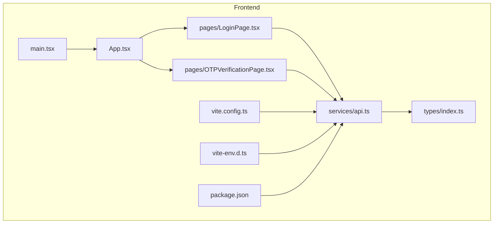

**Diagram sources**
- [main.tsx:1-11](file://frontend/src/main.tsx#L1-L11)
- [App.tsx:1-88](file://frontend/src/App.tsx#L1-L88)
- [api.ts:1-439](file://frontend/src/services/api.ts#L1-L439)
- [index.ts:1-206](file://frontend/src/types/index.ts#L1-L206)
- [LoginPage.tsx:1-249](file://frontend/src/pages/LoginPage.tsx#L1-L249)
- [OTPVerificationPage.tsx:1-235](file://frontend/src/pages/OTPVerificationPage.tsx#L1-L235)
- [vite.config.ts:1-19](file://frontend/vite.config.ts#L1-L19)
- [vite-env.d.ts:1-7](file://frontend/vite-env.d.ts#L1-L7)
- [package.json:1-27](file://frontend/package.json#L1-L27)

**Section sources**
- [main.tsx:1-11](file://frontend/src/main.tsx#L1-L11)
- [App.tsx:1-88](file://frontend/src/App.tsx#L1-L88)
- [api.ts:1-439](file://frontend/src/services/api.ts#L1-L439)
- [index.ts:1-206](file://frontend/src/types/index.ts#L1-L206)
- [vite.config.ts:1-19](file://frontend/vite.config.ts#L1-L19)
- [vite-env.d.ts:1-7](file://frontend/vite-env.d.ts#L1-L7)
- [package.json:1-27](file://frontend/package.json#L1-L27)

## Core Components
- HTTP client and interceptors
  - Base URL resolution via environment variable
  - Request interceptor adds Authorization header using a token stored in local storage
  - Response interceptor handles 401 Unauthorized by clearing local storage and redirecting to login
- Authentication service
  - Registration endpoints for user and doctor
  - OTP verification and resend OTP
  - Login, saveAuth, getUser, getToken, logout, isAuthenticated helpers
- Medical records service
  - CRUD operations for medical records with multipart uploads
  - Stats retrieval and blob downloads
- Explainability and analytics services
  - Test explanations, reports, stress trends, user analytics, doctor matching
- Admin analytics service
  - Advanced analytics aggregation with robust normalization functions
- Type definitions
  - Users, roles, auth responses, tests, appointments, analytics, ML explainability types, and advanced admin stats

**Section sources**
- [api.ts:12-235](file://frontend/src/services/api.ts#L12-L235)
- [api.ts:237-347](file://frontend/src/services/api.ts#L237-L347)
- [api.ts:359-396](file://frontend/src/services/api.ts#L359-L396)
- [api.ts:402-429](file://frontend/src/services/api.ts#L402-L429)
- [api.ts:431-436](file://frontend/src/services/api.ts#L431-L436)
- [index.ts:1-206](file://frontend/src/types/index.ts#L1-L206)

## Architecture Overview
The frontend integrates with a backend via a proxied Axios client. Environment variables configure the base URL, and Vite’s dev server proxies API traffic to the backend. Authentication tokens are attached automatically to outgoing requests, and unauthorized responses trigger automatic sign-out and navigation.

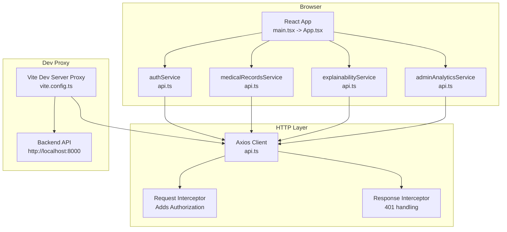

**Diagram sources**
- [api.ts:12-235](file://frontend/src/services/api.ts#L12-L235)
- [vite.config.ts:7-18](file://frontend/vite.config.ts#L7-L18)
- [main.tsx:1-11](file://frontend/src/main.tsx#L1-L11)
- [App.tsx:1-88](file://frontend/src/App.tsx#L1-L88)

## Detailed Component Analysis

### HTTP Client and Interceptors
- Base URL resolution
  - Uses VITE_API_URL environment variable; defaults to http://localhost:8000
- Request interceptor
  - Reads token from local storage and attaches Authorization: Bearer header
- Response interceptor
  - On 401 Unauthorized, clears user and token from local storage and navigates to /login

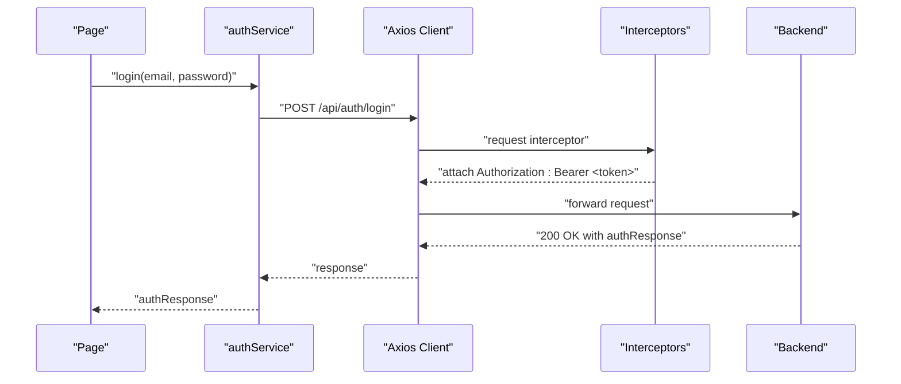

**Diagram sources**
- [api.ts:12-235](file://frontend/src/services/api.ts#L12-L235)
- [api.ts:317-323](file://frontend/src/services/api.ts#L317-L323)
- [LoginPage.tsx:31-70](file://frontend/src/pages/LoginPage.tsx#L31-L70)

**Section sources**
- [api.ts:12-235](file://frontend/src/services/api.ts#L12-L235)
- [vite-env.d.ts:1-7](file://frontend/vite-env.d.ts#L1-L7)
- [vite.config.ts:7-18](file://frontend/vite.config.ts#L7-L18)

### Authentication Service
- Registration
  - User registration endpoint with profile fields
  - Doctor registration endpoint with license and slots
- OTP Management
  - Verify OTP and resend OTP
- Login and Session
  - Login endpoint returns access token and user
  - saveAuth stores user and access_token
  - getUser, getToken, logout, isAuthenticated helpers
- Token propagation
  - Interceptor reads token from local storage and sets Authorization header

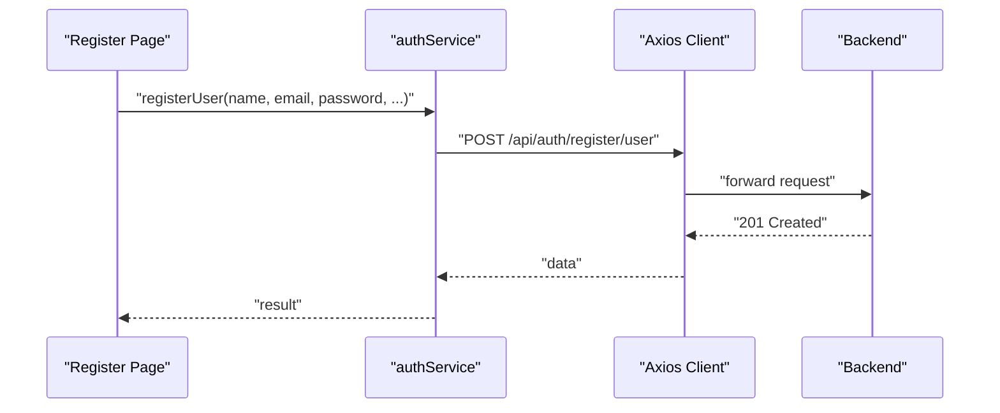

**Diagram sources**
- [api.ts:237-282](file://frontend/src/services/api.ts#L237-L282)

**Section sources**
- [api.ts:237-347](file://frontend/src/services/api.ts#L237-L347)

### OTP Verification Flow
- OTP input page supports manual entry, paste, and auto-focus between inputs
- Submits OTP to backend and redirects to login on success
- Resends OTP and handles errors gracefully

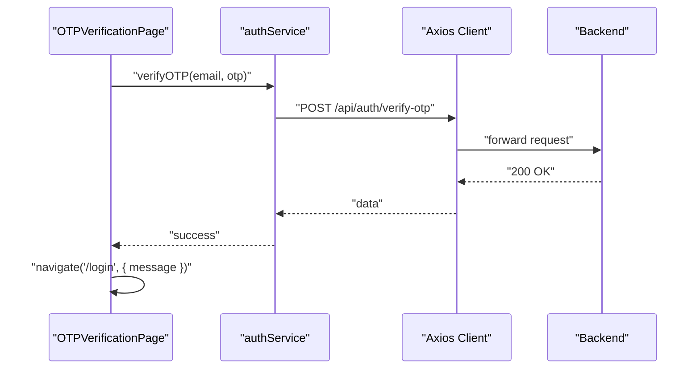

**Diagram sources**
- [OTPVerificationPage.tsx:64-91](file://frontend/src/pages/OTPVerificationPage.tsx#L64-L91)
- [api.ts:302-315](file://frontend/src/services/api.ts#L302-L315)

**Section sources**
- [OTPVerificationPage.tsx:1-235](file://frontend/src/pages/OTPVerificationPage.tsx#L1-L235)
- [api.ts:302-315](file://frontend/src/services/api.ts#L302-L315)

### Protected Routes and Session Management
- ProtectedRoute checks authentication and role before rendering child routes
- Redirects to login if not authenticated or role mismatch
- Relies on authService.getUser and authService.isAuthenticated

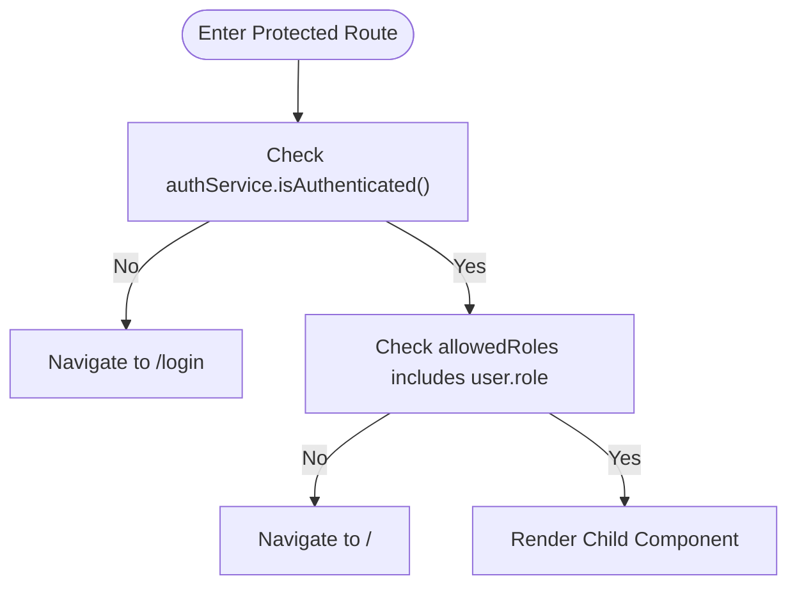

**Diagram sources**
- [App.tsx:15-28](file://frontend/src/App.tsx#L15-L28)
- [api.ts:339-347](file://frontend/src/services/api.ts#L339-L347)

**Section sources**
- [App.tsx:15-28](file://frontend/src/App.tsx#L15-L28)
- [api.ts:339-347](file://frontend/src/services/api.ts#L339-L347)

### Medical Records Service
- Fetches records with optional filters
- Retrieves user statistics
- Uploads documents as multipart/form-data
- Updates/deletes records
- Downloads records as Blob

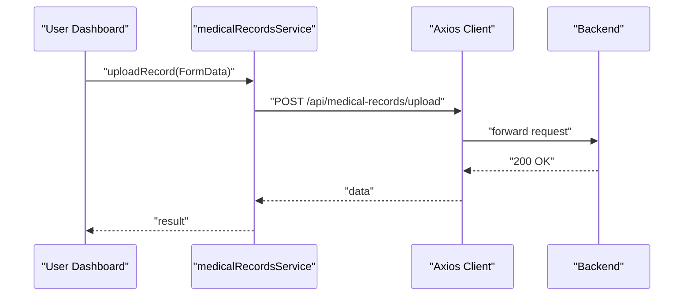

**Diagram sources**
- [api.ts:359-396](file://frontend/src/services/api.ts#L359-L396)

**Section sources**
- [api.ts:359-396](file://frontend/src/services/api.ts#L359-L396)

### Explainability and Analytics Services
- Sends chatbot messages
- Downloads explanations and reports as Blob
- Retrieves stress trends, user analytics, and doctor matches

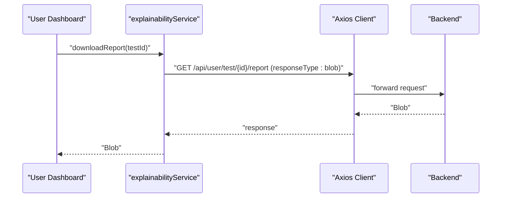

**Diagram sources**
- [api.ts:402-429](file://frontend/src/services/api.ts#L402-L429)

**Section sources**
- [api.ts:402-429](file://frontend/src/services/api.ts#L402-L429)

### Admin Analytics Service and Data Normalization
- Fetches advanced analytics and normalizes heterogeneous backend shapes into a stable type
- Includes normalization helpers for daily trends, locations, peak hours, age groups, and doctor effectiveness

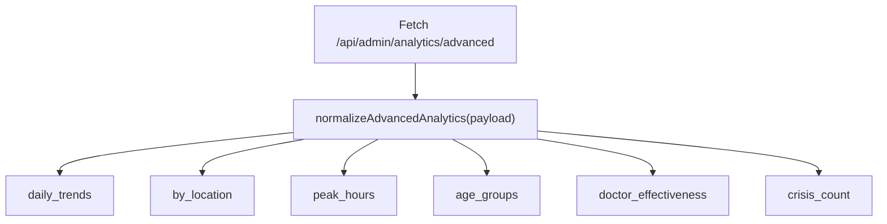

**Diagram sources**
- [api.ts:431-436](file://frontend/src/services/api.ts#L431-L436)
- [api.ts:198-213](file://frontend/src/services/api.ts#L198-L213)
- [api.ts:85-104](file://frontend/src/services/api.ts#L85-L104)
- [api.ts:106-128](file://frontend/src/services/api.ts#L106-L128)
- [api.ts:130-151](file://frontend/src/services/api.ts#L130-L151)
- [api.ts:153-175](file://frontend/src/services/api.ts#L153-L175)
- [api.ts:177-196](file://frontend/src/services/api.ts#L177-L196)

**Section sources**
- [api.ts:431-436](file://frontend/src/services/api.ts#L431-L436)
- [api.ts:198-213](file://frontend/src/services/api.ts#L198-L213)

### TypeScript Type Definitions
- User, Doctor, Appointment, Test, AuthResponse, ChatbotMessage/Response, ML explainability types, UserAnalytics, DoctorMatch, AdvancedAdminStats
- Used across services and pages to enforce shape and safety

**Section sources**
- [index.ts:1-206](file://frontend/src/types/index.ts#L1-L206)

## Dependency Analysis
- Axios is the primary HTTP client
- React Router DOM manages routing and protected routes
- Vite dev server proxies /api/* to the backend
- Environment variables drive base URL configuration

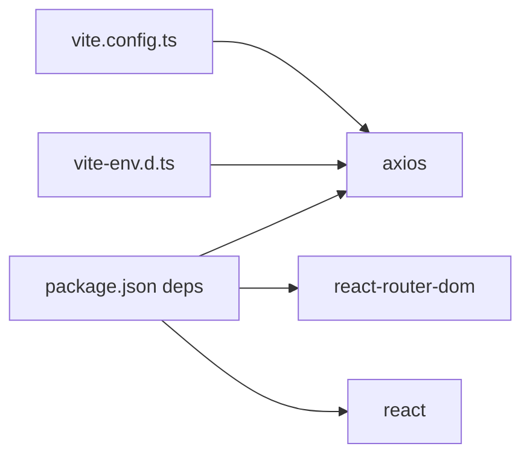

**Diagram sources**
- [package.json:10-26](file://frontend/package.json#L10-L26)
- [vite.config.ts:1-19](file://frontend/vite.config.ts#L1-L19)
- [vite-env.d.ts:1-7](file://frontend/vite-env.d.ts#L1-L7)

**Section sources**
- [package.json:10-26](file://frontend/package.json#L10-L26)
- [vite.config.ts:1-19](file://frontend/vite.config.ts#L1-L19)
- [vite-env.d.ts:1-7](file://frontend/vite-env.d.ts#L1-L7)

## Performance Considerations
- Prefer normalized data structures for analytics to minimize re-renders and simplify consumers
- Use Blob responses for large downloads to avoid memory pressure
- Debounce or throttle frequent requests in UI components
- Consider caching strategies for read-heavy endpoints (see Offline Handling)
- Keep interceptors lightweight to avoid blocking critical paths

## Troubleshooting Guide
- 401 Unauthorized
  - Symptom: Automatic redirect to login after any request
  - Cause: Response interceptor clears local storage and navigates on 401
  - Action: Ensure token is present and valid; refresh token flow is not implemented in current code
- CORS and Proxy
  - Symptom: Requests blocked in dev
  - Cause: Missing or incorrect proxy configuration
  - Action: Confirm vite.config.ts proxy forwards /api to backend and VITE_API_URL aligns with proxy target
- Environment Variables
  - Symptom: Wrong base URL in production
  - Action: Set VITE_API_URL in deployment environment
- Loading States
  - Symptom: UI appears frozen during requests
  - Action: Use page-level loading flags and disable submit buttons during async operations
- Error Messages
  - Symptom: Unclear failure reasons
  - Action: Inspect error.response.data.detail and surface user-friendly messages

**Section sources**
- [api.ts:224-235](file://frontend/src/services/api.ts#L224-L235)
- [vite.config.ts:10-17](file://frontend/vite.config.ts#L10-L17)
- [vite-env.d.ts:1-7](file://frontend/vite-env.d.ts#L1-L7)
- [LoginPage.tsx:55-69](file://frontend/src/pages/LoginPage.tsx#L55-L69)
- [OTPVerificationPage.tsx:84-91](file://frontend/src/pages/OTPVerificationPage.tsx#L84-L91)

## Conclusion
The frontend API integration layer centers on a robust Axios client with automatic token injection and centralized 401 handling. Authentication flows are cleanly separated into services, and pages orchestrate user interactions with clear loading and error states. Data normalization ensures stable consumption of analytics endpoints. The architecture is straightforward to extend with additional services and can be hardened with token refresh, retry, and offline strategies.

## Appendices

### API Endpoint Inventory
- Authentication
  - POST /api/auth/register/user
  - POST /api/auth/register/doctor
  - POST /api/auth/login
  - POST /api/auth/verify-otp
  - POST /api/auth/resend-otp
  - GET /api/auth/doctor/state-medical-councils
  - POST /api/auth/upload-medical-document
- Medical Records
  - GET /api/medical-records/user/{userId}
  - GET /api/medical-records/stats/{userId}
  - POST /api/medical-records/upload
  - PUT /api/medical-records/{recordId}
  - DELETE /api/medical-records/{recordId}
  - GET /api/medical-records/{recordId}/download
- User Analytics and Explanations
  - POST /api/user/chatbot/chat
  - GET /api/user/test/{testId}/explanation
  - GET /api/user/test/{testId}/report
  - GET /api/user/stress-trend/{userId}
  - GET /api/user/analytics/{userId}
  - GET /api/user/doctor-match/{userId}
- Admin Analytics
  - GET /api/admin/analytics/advanced

**Section sources**
- [api.ts:237-347](file://frontend/src/services/api.ts#L237-L347)
- [api.ts:359-396](file://frontend/src/services/api.ts#L359-L396)
- [api.ts:402-429](file://frontend/src/services/api.ts#L402-L429)
- [api.ts:431-436](file://frontend/src/services/api.ts#L431-L436)

### Authentication Flows (Login, Register, OTP)
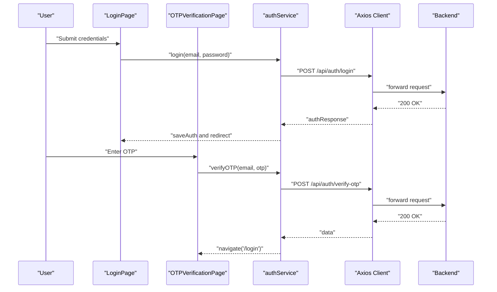

**Diagram sources**
- [LoginPage.tsx:31-70](file://frontend/src/pages/LoginPage.tsx#L31-L70)
- [OTPVerificationPage.tsx:64-91](file://frontend/src/pages/OTPVerificationPage.tsx#L64-L91)
- [api.ts:317-323](file://frontend/src/services/api.ts#L317-L323)
- [api.ts:302-315](file://frontend/src/services/api.ts#L302-L315)

### Protected Endpoint Access
- ProtectedRoute enforces authentication and role checks before rendering
- Relies on authService.getUser and authService.isAuthenticated

**Section sources**
- [App.tsx:15-28](file://frontend/src/App.tsx#L15-L28)
- [api.ts:339-347](file://frontend/src/services/api.ts#L339-L347)

### Session Management
- saveAuth persists user and access_token
- logout removes persisted session data
- getUser and getToken provide typed accessors

**Section sources**
- [api.ts:325-347](file://frontend/src/services/api.ts#L325-L347)

### Caching Strategies
- Current implementation does not include explicit caching
- Recommended approaches:
  - HTTP cache headers on backend
  - In-memory cache keyed by endpoint and parameters
  - React Query or SWR for server state and caching

[No sources needed since this section provides general guidance]

### Retry Mechanisms
- Not implemented in current code
- Recommended approaches:
  - Axios interceptors for transient failures
  - Exponential backoff with jitter
  - Respect Retry-After headers when provided

[No sources needed since this section provides general guidance]

### Loading States
- Pages manage loading flags during async operations
- Disable submit buttons and show spinners to improve UX

**Section sources**
- [LoginPage.tsx:42-70](file://frontend/src/pages/LoginPage.tsx#L42-L70)
- [OTPVerificationPage.tsx:64-91](file://frontend/src/pages/OTPVerificationPage.tsx#L64-L91)

### Offline Handling
- Not implemented in current code
- Recommended approaches:
  - Service workers for precaching and offline fallbacks
  - Detect navigator.onLine and queue requests
  - Sync queued requests when online

[No sources needed since this section provides general guidance]

### API Versioning
- No explicit versioning scheme observed in current endpoints
- Recommended approaches:
  - /api/v1/... paths
  - Accept-Version header negotiation
  - Deprecation headers and grace periods

[No sources needed since this section provides general guidance]

### Error Boundary Implementation
- Not implemented in current code
- Recommended approaches:
  - React Error Boundary component wrapping route elements
  - Centralized toast/snackbar for user-visible errors
  - Logging errors to monitoring service

[No sources needed since this section provides general guidance]

### Debugging Techniques for API Communication
- Enable browser network inspection to verify Authorization headers and response codes
- Log request/response bodies in development
- Use Vite proxy logs to confirm request forwarding
- Validate environment variables at runtime

**Section sources**
- [vite.config.ts:10-17](file://frontend/vite.config.ts#L10-L17)
- [vite-env.d.ts:1-7](file://frontend/vite-env.d.ts#L1-L7)