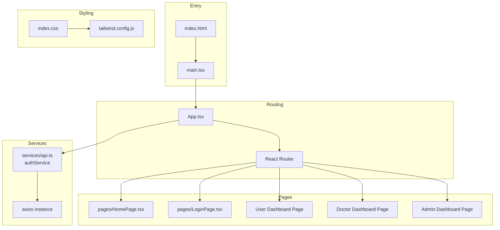
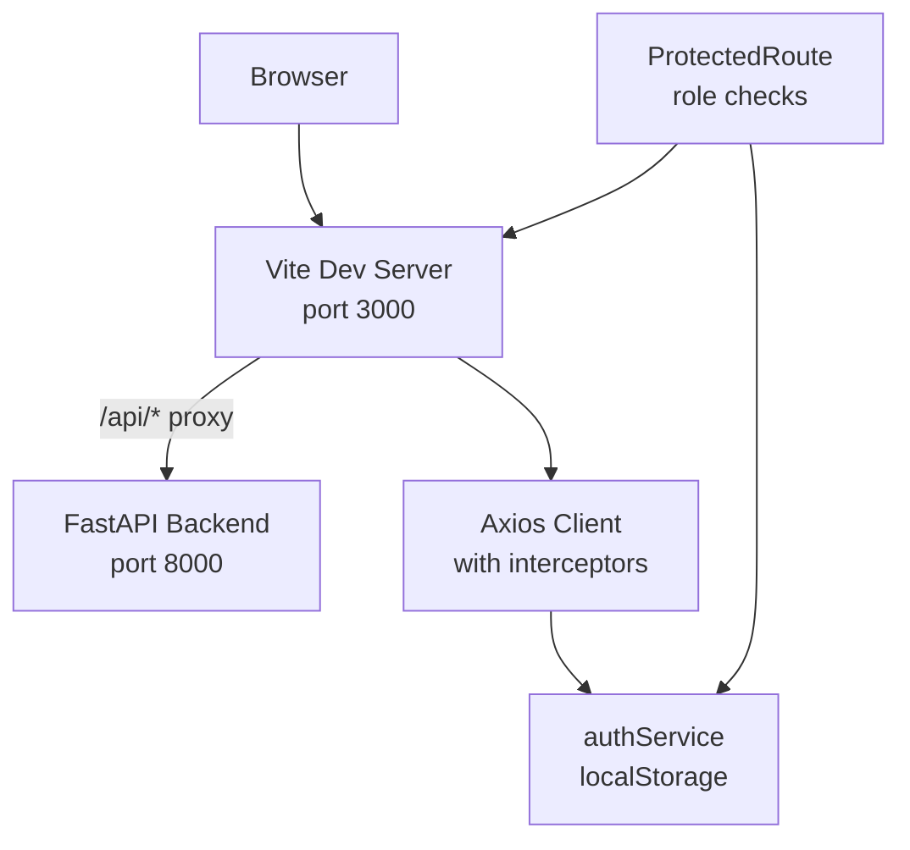
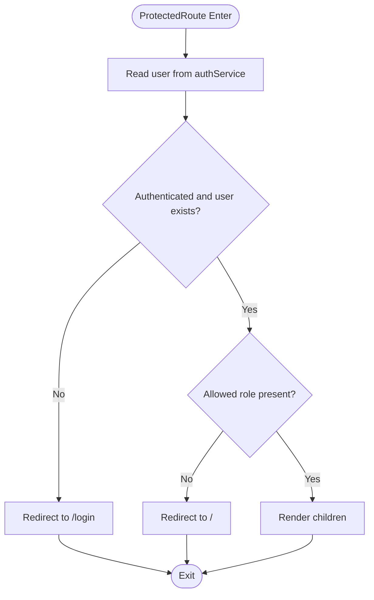
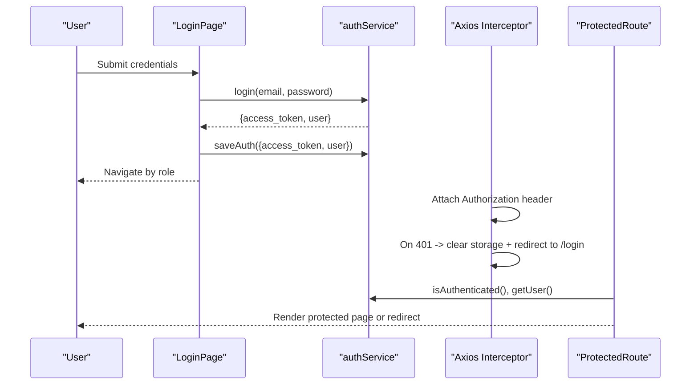
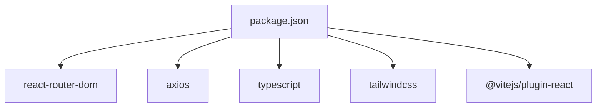

# Application Structure

<cite>
**Referenced Files in This Document**
- [App.tsx](file://frontend/src/App.tsx)
- [main.tsx](file://frontend/src/main.tsx)
- [vite.config.ts](file://frontend/vite.config.ts)
- [package.json](file://frontend/package.json)
- [tsconfig.json](file://frontend/tsconfig.json)
- [vite-env.d.ts](file://frontend/vite-env.d.ts)
- [index.html](file://frontend/index.html)
- [api.ts](file://frontend/src/services/api.ts)
- [index.css](file://frontend/src/index.css)
- [tailwind.config.js](file://frontend/tailwind.config.js)
- [HomePage.tsx](file://frontend/src/pages/HomePage.tsx)
- [LoginPage.tsx](file://frontend/src/pages/LoginPage.tsx)
- [index.ts](file://frontend/src/types/index.ts)
</cite>

## Table of Contents
1. [Introduction](#introduction)
2. [Project Structure](#project-structure)
3. [Core Components](#core-components)
4. [Architecture Overview](#architecture-overview)
5. [Detailed Component Analysis](#detailed-component-analysis)
6. [Dependency Analysis](#dependency-analysis)
7. [Performance Considerations](#performance-considerations)
8. [Troubleshooting Guide](#troubleshooting-guide)
9. [Conclusion](#conclusion)
10. [Appendices](#appendices)

## Introduction
This document explains the React application structure and configuration for the AI Stress Detector frontend. It covers the component hierarchy starting from the root entry point, routing configuration with React Router, and role-based protected routes. It also documents the Vite build configuration, TypeScript setup, and package dependencies. Guidance is included for adding new routes, creating protected routes, and implementing authentication guards. Development versus production configurations, environment variable handling, and build optimization strategies are addressed.

## Project Structure
The frontend is organized around a clear separation of concerns:
- Entry point initializes the React application and mounts the root component.
- Routing is configured declaratively with protected routes and role checks.
- Services encapsulate API communication and authentication state.
- Pages represent top-level views.
- Types define shared interfaces for domain entities.
- Styling leverages Tailwind CSS with custom animations and utilities.

**Diagram sources**
- [main.tsx:1-11](file://frontend/src/main.tsx#L1-L11)
- [index.html:1-14](file://frontend/index.html#L1-L14)
- [App.tsx:30-88](file://frontend/src/App.tsx#L30-L88)
- [api.ts:12-235](file://frontend/src/services/api.ts#L12-L235)
- [index.css:1-20](file://frontend/src/index.css#L1-L20)
- [tailwind.config.js:1-34](file://frontend/tailwind.config.js#L1-L34)

**Section sources**
- [main.tsx:1-11](file://frontend/src/main.tsx#L1-L11)
- [index.html:1-14](file://frontend/index.html#L1-L14)
- [App.tsx:30-88](file://frontend/src/App.tsx#L30-L88)
- [api.ts:12-235](file://frontend/src/services/api.ts#L12-L235)
- [index.css:1-20](file://frontend/src/index.css#L1-L20)
- [tailwind.config.js:1-34](file://frontend/tailwind.config.js#L1-L34)

## Core Components
- Entry point: Initializes React and renders the root App component.
- Root routing: Declares public and protected routes with role-based access control.
- Authentication service: Centralizes API calls, token handling, and user state persistence.
- Pages: Representational components for home, login, and role-specific dashboards.
- Build and dev server: Vite configuration with proxy to backend and TypeScript compilation.
- Styling: Tailwind CSS with custom animations and utilities.

Key responsibilities:
- App.tsx orchestrates routing and protected route enforcement.
- api.ts manages authentication state and HTTP client configuration.
- vite.config.ts defines dev server port, host, and proxy for backend API.
- package.json scripts define dev/build/preview commands.
- tsconfig.json configures strict TypeScript settings and module resolution.

**Section sources**
- [main.tsx:1-11](file://frontend/src/main.tsx#L1-L11)
- [App.tsx:15-28](file://frontend/src/App.tsx#L15-L28)
- [App.tsx:30-88](file://frontend/src/App.tsx#L30-L88)
- [api.ts:237-347](file://frontend/src/services/api.ts#L237-L347)
- [vite.config.ts:1-19](file://frontend/vite.config.ts#L1-L19)
- [package.json:1-27](file://frontend/package.json#L1-L27)
- [tsconfig.json:1-22](file://frontend/tsconfig.json#L1-L22)

## Architecture Overview
The application follows a layered architecture:
- Presentation layer: React components and pages.
- Routing layer: ProtectedRoute wrapper enforces authentication and roles.
- Service layer: authService and axios interceptors handle auth tokens and error redirection.
- Backend integration: Vite proxy forwards API calls to the backend server.

**Diagram sources**
- [vite.config.ts:7-18](file://frontend/vite.config.ts#L7-L18)
- [api.ts:12-235](file://frontend/src/services/api.ts#L12-L235)
- [App.tsx:15-28](file://frontend/src/App.tsx#L15-L28)

**Section sources**
- [vite.config.ts:1-19](file://frontend/vite.config.ts#L1-L19)
- [api.ts:12-235](file://frontend/src/services/api.ts#L12-L235)
- [App.tsx:15-28](file://frontend/src/App.tsx#L15-L28)

## Detailed Component Analysis

### Protected Route Implementation
The ProtectedRoute component enforces:
- Authentication: Redirects unauthenticated users to the login page.
- Role-based access: Ensures the current user’s role matches the allowed roles list.
- Children rendering: Renders the wrapped component when authorized.

**Diagram sources**
- [App.tsx:15-28](file://frontend/src/App.tsx#L15-L28)
- [api.ts:330-346](file://frontend/src/services/api.ts#L330-L346)

**Section sources**
- [App.tsx:15-28](file://frontend/src/App.tsx#L15-L28)
- [api.ts:330-346](file://frontend/src/services/api.ts#L330-L346)

### Authentication Flow and Guards
The authentication flow integrates with the login page and global axios interceptors:
- LoginPage collects credentials, calls authService.login, persists tokens, and navigates by role.
- Global axios interceptor attaches Authorization headers and handles 401 responses by clearing local storage and redirecting to login.
- ProtectedRoute relies on authService.isAuthenticated and authService.getUser for access decisions.

**Diagram sources**
- [LoginPage.tsx:31-70](file://frontend/src/pages/LoginPage.tsx#L31-L70)
- [api.ts:317-347](file://frontend/src/services/api.ts#L317-L347)
- [api.ts:216-235](file://frontend/src/services/api.ts#L216-L235)
- [App.tsx:15-28](file://frontend/src/App.tsx#L15-L28)

**Section sources**
- [LoginPage.tsx:31-70](file://frontend/src/pages/LoginPage.tsx#L31-L70)
- [api.ts:216-235](file://frontend/src/services/api.ts#L216-L235)
- [api.ts:317-347](file://frontend/src/services/api.ts#L317-L347)
- [App.tsx:15-28](file://frontend/src/App.tsx#L15-L28)

### Routing Configuration and Protected Routes
Routing is declared in App.tsx with:
- Public routes: Home, Login, Register, OTP verification, Forgot password.
- Protected routes: User, Doctor, Admin dashboards, Appointments, Account Details.
- ProtectedRoute wrapper ensures authentication and role checks.

Guidelines for adding new routes:
- Define the page component under pages/.
- Add a Route declaration in App.tsx.
- Wrap protected pages with ProtectedRoute and specify allowed roles.
- Ensure authService.getUser returns a role field for access control.

**Section sources**
- [App.tsx:30-88](file://frontend/src/App.tsx#L30-L88)

### Entry Point and Initialization
The application bootstraps from main.tsx:
- Creates the root DOM node and renders the App inside React.StrictMode.
- Imports global styles via index.css.

Initialization steps:
- ReactDOM.createRoot mounts the application.
- StrictMode enables extra development-time checks.

**Section sources**
- [main.tsx:1-11](file://frontend/src/main.tsx#L1-L11)
- [index.html:1-14](file://frontend/index.html#L1-L14)

### Build Configuration and Environment Variables
Build and development configuration:
- Vite dev server runs on port 3000, host enabled, with proxy for /api/* to backend.
- Scripts: dev, build, preview.
- TypeScript strict mode, ESNext modules, JSX transform, and bundler module resolution.
- Environment variable VITE_API_URL controls the backend base URL; defaults to localhost:8000.

Optimization strategies:
- Use Vite’s built-in tree-shaking and code splitting.
- Keep TypeScript strict settings for safety.
- Leverage Tailwind purging via content globs.

**Section sources**
- [vite.config.ts:1-19](file://frontend/vite.config.ts#L1-L19)
- [package.json:1-27](file://frontend/package.json#L1-L27)
- [tsconfig.json:1-22](file://frontend/tsconfig.json#L1-L22)
- [vite-env.d.ts:1-7](file://frontend/vite-env.d.ts#L1-L7)
- [api.ts:12](file://frontend/src/services/api.ts#L12)

### Styling and Design System
Tailwind CSS is configured with:
- Content scanning for template paths.
- Custom animations and keyframes.
- Extended shadow and gradient utilities.
- Global base and utility layers.

Custom CSS includes:
- Animations, glass effects, gradients, and responsive utilities.
- Enhanced recommendation cards and progress tracker styles.

**Section sources**
- [tailwind.config.js:1-34](file://frontend/tailwind.config.js#L1-L34)
- [index.css:1-20](file://frontend/src/index.css#L1-L20)

### Type Definitions
Shared types define:
- User, Doctor, Appointment, Test, and Analytics structures.
- Role union ('user' | 'doctor' | 'admin').
- Enhanced analytics and recommendation interfaces.

These types support type-safe service calls and UI components.

**Section sources**
- [index.ts:1-206](file://frontend/src/types/index.ts#L1-L206)

## Dependency Analysis
External dependencies and their roles:
- react, react-dom: UI framework and renderer.
- react-router-dom: Declarative routing and navigation.
- axios: HTTP client with interceptors for auth and error handling.
- lucide-react: Icons library.
- @vitejs/plugin-react: Fast refresh and JSX transform.
- tailwindcss, postcss, autoprefixer: Utility-first CSS framework and tooling.
- typescript: Type checking and compile-time safety.

Internal relationships:
- App.tsx depends on authService for role checks.
- api.ts encapsulates axios and exposes typed services.
- Pages consume services and types for rendering and state.

**Diagram sources**
- [package.json:10-26](file://frontend/package.json#L10-L26)

**Section sources**
- [package.json:10-26](file://frontend/package.json#L10-L26)

## Performance Considerations
- Prefer lazy loading for heavy pages using React.lazy and Suspense.
- Split bundles with dynamic imports to reduce initial load.
- Keep axios interceptors minimal to avoid overhead.
- Use Tailwind utilities efficiently; purge unused styles in production builds.
- Enable production builds for preview and deployment.

## Troubleshooting Guide
Common issues and resolutions:
- 401 Unauthorized responses: Axios interceptor clears local storage and redirects to login. Verify token presence and expiration.
- Authentication redirects loop: Ensure authService.isAuthenticated and authService.getUser return consistent values.
- Proxy failures: Confirm VITE_DEV_SERVER_PORT and backend availability; verify proxy target and changeOrigin settings.
- Missing environment variables: Ensure VITE_API_URL is set in development; defaults to localhost:8000 if unset.
- Build errors: Validate TypeScript strictness and module resolution settings; confirm JSX transform and bundler compatibility.

**Section sources**
- [api.ts:224-235](file://frontend/src/services/api.ts#L224-L235)
- [api.ts:344-346](file://frontend/src/services/api.ts#L344-L346)
- [vite.config.ts:7-18](file://frontend/vite.config.ts#L7-L18)
- [vite-env.d.ts:1-7](file://frontend/vite-env.d.ts#L1-L7)
- [tsconfig.json:14-18](file://frontend/tsconfig.json#L14-L18)

## Conclusion
The React application employs a clean, modular structure with explicit routing and robust authentication guards. Vite streamlines development and build processes, while TypeScript and Tailwind enhance reliability and maintainability. Following the documented patterns ensures consistent additions of routes, protection mechanisms, and integrations with the backend.

## Appendices

### Adding New Routes
Steps:
- Create a new page component under pages/.
- Add a Route in App.tsx pointing to the new page.
- For protected pages:
  - Wrap with ProtectedRoute.
  - Specify allowedRoles matching the user.role returned by authService.getUser.
- Ensure authService.getUser returns a role field for access control.

**Section sources**
- [App.tsx:30-88](file://frontend/src/App.tsx#L30-L88)
- [api.ts:330-346](file://frontend/src/services/api.ts#L330-L346)

### Creating Protected Routes
- Use the ProtectedRoute wrapper with allowedRoles.
- Implement role checks against authService.getUser().role.
- Redirect unauthorized users to '/' and unauthenticated users to '/login'.

**Section sources**
- [App.tsx:15-28](file://frontend/src/App.tsx#L15-L28)

### Implementing Authentication Guards
- LoginPage calls authService.login and persists tokens via saveAuth.
- Global axios interceptor attaches Authorization headers and handles 401 by clearing storage and redirecting to login.
- ProtectedRoute uses isAuthenticated and getUser for runtime checks.

**Section sources**
- [LoginPage.tsx:31-70](file://frontend/src/pages/LoginPage.tsx#L31-L70)
- [api.ts:216-235](file://frontend/src/services/api.ts#L216-L235)
- [api.ts:325-347](file://frontend/src/services/api.ts#L325-L347)

### Development vs Production Configurations
- Development: Vite dev server with proxy to backend, hot reload, and strict TypeScript checks.
- Production: Vite build compiles TypeScript and assets; preview serves the optimized bundle.

Environment variables:
- VITE_API_URL controls the backend base URL; defaults to localhost:8000 if undefined.

**Section sources**
- [vite.config.ts:1-19](file://frontend/vite.config.ts#L1-L19)
- [package.json:5-9](file://frontend/package.json#L5-L9)
- [vite-env.d.ts:1-7](file://frontend/vite-env.d.ts#L1-L7)
- [api.ts:12](file://frontend/src/services/api.ts#L12)