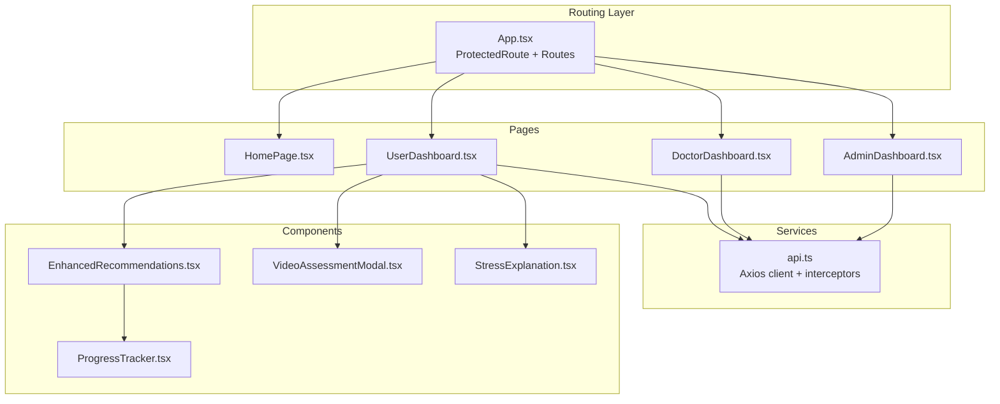
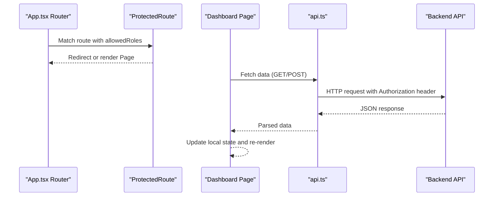
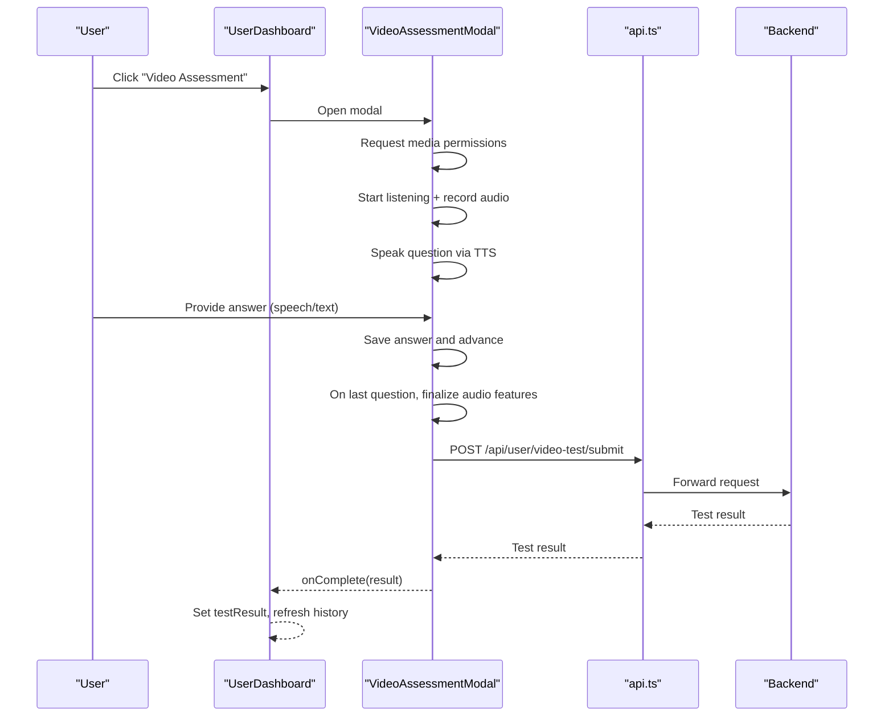
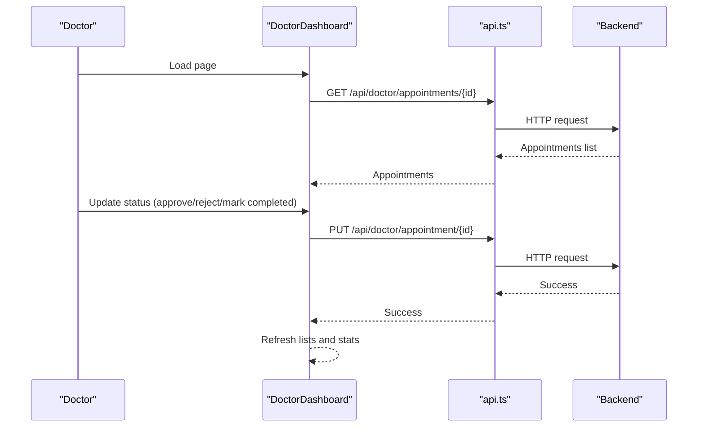
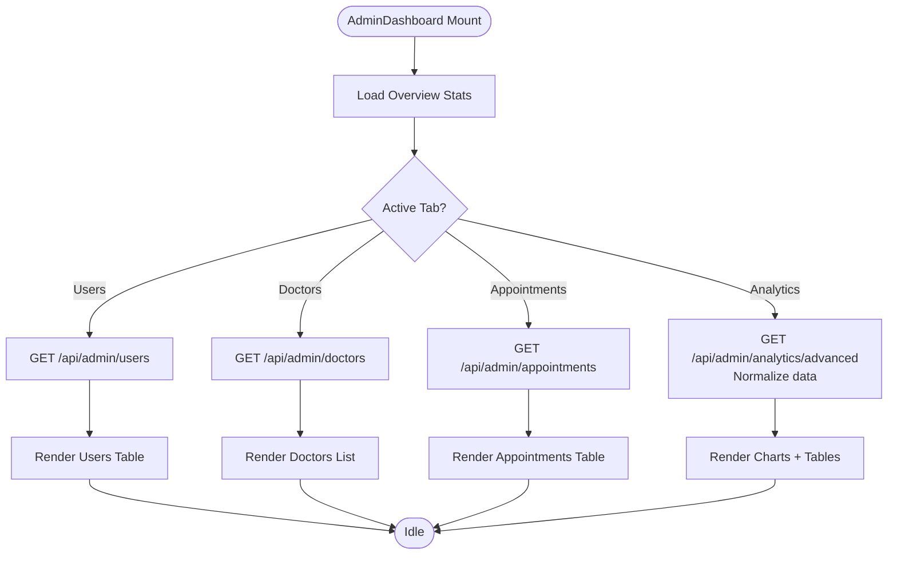
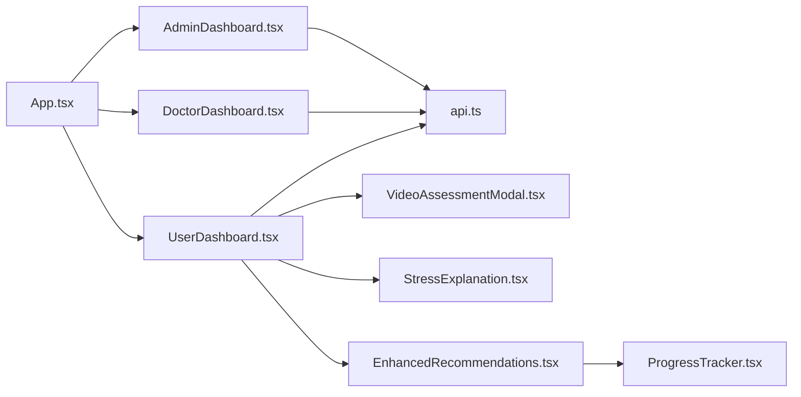

# Dashboard Pages

<cite>
**Referenced Files in This Document**
- [App.tsx](file://frontend/src/App.tsx)
- [UserDashboard.tsx](file://frontend/src/pages/UserDashboard.tsx)
- [DoctorDashboard.tsx](file://frontend/src/pages/DoctorDashboard.tsx)
- [AdminDashboard.tsx](file://frontend/src/pages/AdminDashboard.tsx)
- [HomePage.tsx](file://frontend/src/pages/HomePage.tsx)
- [api.ts](file://frontend/src/services/api.ts)
- [EnhancedRecommendations.tsx](file://frontend/src/components/EnhancedRecommendations.tsx)
- [ProgressTracker.tsx](file://frontend/src/components/ProgressTracker.tsx)
- [VideoAssessmentModal.tsx](file://frontend/src/components/VideoAssessmentModal.tsx)
- [StressExplanation.tsx](file://frontend/src/components/StressExplanation.tsx)
</cite>

## Table of Contents
1. [Introduction](#introduction)
2. [Project Structure](#project-structure)
3. [Core Components](#core-components)
4. [Architecture Overview](#architecture-overview)
5. [Detailed Component Analysis](#detailed-component-analysis)
6. [Dependency Analysis](#dependency-analysis)
7. [Performance Considerations](#performance-considerations)
8. [Troubleshooting Guide](#troubleshooting-guide)
9. [Conclusion](#conclusion)

## Introduction
This document explains the three-role dashboard implementations and the main landing page. It covers:
- UserDashboard layout integrating stress assessment, progress tracking, and recommendations
- DoctorDashboard for patient management, appointment scheduling, and test result review
- AdminDashboard for analytics, user management, and system monitoring
- HomePage with navigation, hero sections, and feature highlights
It also documents page-specific state management, data fetching patterns, backend integration, responsive design, UX optimizations, and role-based content rendering.

## Project Structure
The frontend is a React application with TypeScript and Tailwind CSS. Routing is handled by React Router. Authentication and API interactions are centralized in a shared service module. Dashboards are page-level components that orchestrate local state, fetch data from backend endpoints, and render reusable components for recommendations, progress, and explanations.

**Diagram sources**
- [App.tsx:30-88](file://frontend/src/App.tsx#L30-L88)
- [UserDashboard.tsx:69-919](file://frontend/src/pages/UserDashboard.tsx#L69-L919)
- [DoctorDashboard.tsx:7-256](file://frontend/src/pages/DoctorDashboard.tsx#L7-L256)
- [AdminDashboard.tsx:7-632](file://frontend/src/pages/AdminDashboard.tsx#L7-L632)
- [HomePage.tsx:5-407](file://frontend/src/pages/HomePage.tsx#L5-L407)
- [api.ts:12-439](file://frontend/src/services/api.ts#L12-L439)
- [EnhancedRecommendations.tsx:13-158](file://frontend/src/components/EnhancedRecommendations.tsx#L13-L158)
- [ProgressTracker.tsx:9-77](file://frontend/src/components/ProgressTracker.tsx#L9-L77)
- [VideoAssessmentModal.tsx:33-670](file://frontend/src/components/VideoAssessmentModal.tsx#L33-L670)
- [StressExplanation.tsx:35-257](file://frontend/src/components/StressExplanation.tsx#L35-L257)

**Section sources**
- [App.tsx:30-88](file://frontend/src/App.tsx#L30-L88)
- [api.ts:12-439](file://frontend/src/services/api.ts#L12-L439)

## Core Components
- ProtectedRoute enforces role-based access to dashboards and protected pages.
- api.ts centralizes HTTP client configuration, auth token injection, response error handling, and exports typed services for authentication, medical records, chatbot, explainability, and admin analytics.
- HomePage.tsx renders the marketing landing page with navigation, hero, features, services, and CTA sections.
- UserDashboard.tsx orchestrates stress assessment (text and video), chatbot, history, appointments, and records.
- DoctorDashboard.tsx manages doctor’s appointments, stats, and patient test history.
- AdminDashboard.tsx provides overview, user and doctor management, appointment listing, and advanced analytics.
- Reusable components: EnhancedRecommendations.tsx, ProgressTracker.tsx, VideoAssessmentModal.tsx, StressExplanation.tsx.

**Section sources**
- [App.tsx:15-28](file://frontend/src/App.tsx#L15-L28)
- [api.ts:12-439](file://frontend/src/services/api.ts#L12-L439)
- [HomePage.tsx:5-407](file://frontend/src/pages/HomePage.tsx#L5-L407)
- [UserDashboard.tsx:69-919](file://frontend/src/pages/UserDashboard.tsx#L69-L919)
- [DoctorDashboard.tsx:7-256](file://frontend/src/pages/DoctorDashboard.tsx#L7-L256)
- [AdminDashboard.tsx:7-632](file://frontend/src/pages/AdminDashboard.tsx#L7-L632)
- [EnhancedRecommendations.tsx:13-158](file://frontend/src/components/EnhancedRecommendations.tsx#L13-L158)
- [ProgressTracker.tsx:9-77](file://frontend/src/components/ProgressTracker.tsx#L9-L77)
- [VideoAssessmentModal.tsx:33-670](file://frontend/src/components/VideoAssessmentModal.tsx#L33-L670)
- [StressExplanation.tsx:35-257](file://frontend/src/components/StressExplanation.tsx#L35-L257)

## Architecture Overview
The dashboards follow a consistent pattern:
- Route protection ensures only authenticated users with correct roles can access dashboards.
- Each dashboard initializes by loading relevant data (e.g., appointments, stats, analytics).
- Local state drives UI interactions (tabs, timers, forms).
- Backend APIs are consumed via the shared Axios client configured with auth headers and global error handling.

**Diagram sources**
- [App.tsx:15-28](file://frontend/src/App.tsx#L15-L28)
- [App.tsx:40-82](file://frontend/src/App.tsx#L40-L82)
- [api.ts:215-235](file://frontend/src/services/api.ts#L215-L235)
- [UserDashboard.tsx:129-163](file://frontend/src/pages/UserDashboard.tsx#L129-L163)
- [DoctorDashboard.tsx:19-35](file://frontend/src/pages/DoctorDashboard.tsx#L19-L35)
- [AdminDashboard.tsx:29-75](file://frontend/src/pages/AdminDashboard.tsx#L29-L75)

## Detailed Component Analysis

### UserDashboard
- Layout and navigation
  - Sidebar and mobile tabs organize access to Test, AI Counselor, History, Appointments, and Medical Records.
  - Avatar button navigates to Account Details.
- Stress assessment
  - Text-based questionnaire with 18 questions, timer, and auto-submit on timeout.
  - Video-assessment modal integrates camera/microphone, speech synthesis/recognition, and audio feature extraction.
- Chatbot
  - Real-time messaging with detected stress level and confidence.
- History and appointments
  - Displays latest test results and upcoming appointments with status badges.
- Recommendations and progress
  - After test completion, displays personalized recommendations and links to EnhancedRecommendations component.
- State management
  - Active tab, questionnaire, responses, timers, test result, history, doctors, appointments, chat messages, and modal visibility.
- Data fetching
  - Loads questionnaire, test history, doctors, appointments, and sends test submissions.
- Integration points
  - API endpoints for questionnaire, test submission, chatbot, appointments, and records.
  - Components: VideoAssessmentModal, StressExplanation, EnhancedRecommendations.

**Diagram sources**
- [UserDashboard.tsx:398-679](file://frontend/src/pages/UserDashboard.tsx#L398-L679)
- [VideoAssessmentModal.tsx:74-94](file://frontend/src/components/VideoAssessmentModal.tsx#L74-L94)
- [VideoAssessmentModal.tsx:240-260](file://frontend/src/components/VideoAssessmentModal.tsx#L240-L260)
- [api.ts:402-429](file://frontend/src/services/api.ts#L402-L429)

**Section sources**
- [UserDashboard.tsx:69-919](file://frontend/src/pages/UserDashboard.tsx#L69-L919)
- [VideoAssessmentModal.tsx:33-670](file://frontend/src/components/VideoAssessmentModal.tsx#L33-L670)
- [StressExplanation.tsx:35-257](file://frontend/src/components/StressExplanation.tsx#L35-L257)
- [EnhancedRecommendations.tsx:13-158](file://frontend/src/components/EnhancedRecommendations.tsx#L13-L158)

### DoctorDashboard
- Role-specific responsibilities
  - Lists doctor’s appointments with patient info and latest test summary.
  - Provides status update actions (approve, reject, mark completed).
  - Shows stats cards for total/pending/approved/completed appointments.
- State management
  - Appointments array, selected appointment for detailed view, and stats.
- Data fetching
  - Loads appointments and stats for the logged-in doctor.
- UI patterns
  - Status badges with color-coded semantics.
  - Modal overlay for detailed test history.

**Diagram sources**
- [DoctorDashboard.tsx:19-47](file://frontend/src/pages/DoctorDashboard.tsx#L19-L47)
- [DoctorDashboard.tsx:37-47](file://frontend/src/pages/DoctorDashboard.tsx#L37-L47)
- [api.ts:12-439](file://frontend/src/services/api.ts#L12-L439)

**Section sources**
- [DoctorDashboard.tsx:7-256](file://frontend/src/pages/DoctorDashboard.tsx#L7-L256)

### AdminDashboard
- Overview
  - Displays total users, doctors, tests, appointments, and stress distribution.
- Management
  - Users list with delete action.
  - Doctors list with verification toggle and delete action.
  - Appointments list with status filtering.
- Advanced analytics
  - Crisis alerts, daily trends, locations, age groups, doctor effectiveness, and peak hours.
  - Normalization helpers convert backend shapes to normalized frontend types.
- State management
  - Active tab, stats, lists, and loading flags.
- Data fetching
  - Stats, lists, and advanced analytics via dedicated services.

**Diagram sources**
- [AdminDashboard.tsx:18-75](file://frontend/src/pages/AdminDashboard.tsx#L18-L75)
- [AdminDashboard.tsx:431-455](file://frontend/src/pages/AdminDashboard.tsx#L431-L455)
- [api.ts:431-436](file://frontend/src/services/api.ts#L431-L436)

**Section sources**
- [AdminDashboard.tsx:7-632](file://frontend/src/pages/AdminDashboard.tsx#L7-L632)
- [api.ts:58-213](file://frontend/src/services/api.ts#L58-L213)

### HomePage
- Navigation bar with logo, title, login, and sign-up buttons.
- Hero section with headline, description, and primary CTA.
- Stats section highlighting platform metrics.
- Services section with icons, descriptions, and action buttons.
- Features section showcasing platform capabilities.
- How It Works process with four steps.
- Call-to-action banner and footer with links and emergency contacts.

Responsive design and UX:
- Mobile-first layout with stacked grids and centered CTAs.
- Hover animations, subtle shadows, and gradient accents.
- Interactive elements with transitions and focus states.

**Section sources**
- [HomePage.tsx:5-407](file://frontend/src/pages/HomePage.tsx#L5-L407)

## Dependency Analysis
- Routing and guards
  - App.tsx defines routes and wraps dashboards with ProtectedRoute to enforce role-based access.
- Authentication and HTTP
  - api.ts configures base URL, auth interceptor, and response error handler.
  - authService provides login, registration, OTP, and token management.
- Dashboard-to-service relationships
  - UserDashboard uses chatbotService, explainabilityService, medicalRecordsService.
  - DoctorDashboard uses doctor-specific endpoints.
  - AdminDashboard uses admin endpoints and adminAnalyticsService.
- Component composition
  - UserDashboard composes VideoAssessmentModal, StressExplanation, and EnhancedRecommendations.
  - EnhancedRecommendations composes ProgressTracker.

**Diagram sources**
- [App.tsx:30-88](file://frontend/src/App.tsx#L30-L88)
- [UserDashboard.tsx:69-919](file://frontend/src/pages/UserDashboard.tsx#L69-L919)
- [DoctorDashboard.tsx:7-256](file://frontend/src/pages/DoctorDashboard.tsx#L7-L256)
- [AdminDashboard.tsx:7-632](file://frontend/src/pages/AdminDashboard.tsx#L7-L632)
- [api.ts:12-439](file://frontend/src/services/api.ts#L12-L439)
- [EnhancedRecommendations.tsx:13-158](file://frontend/src/components/EnhancedRecommendations.tsx#L13-L158)
- [ProgressTracker.tsx:9-77](file://frontend/src/components/ProgressTracker.tsx#L9-L77)
- [VideoAssessmentModal.tsx:33-670](file://frontend/src/components/VideoAssessmentModal.tsx#L33-L670)
- [StressExplanation.tsx:35-257](file://frontend/src/components/StressExplanation.tsx#L35-L257)

**Section sources**
- [App.tsx:15-28](file://frontend/src/App.tsx#L15-L28)
- [api.ts:215-235](file://frontend/src/services/api.ts#L215-L235)

## Performance Considerations
- Minimize re-renders
  - Use memoization for derived data (e.g., sorted history).
  - Separate concerns: keep heavy computations out of render paths.
- Efficient data fetching
  - Debounce or batch requests where appropriate.
  - Use server-side pagination for large lists (users, doctors, appointments).
- Media handling
  - Stop streams and cancel speech synthesis on unmount to avoid leaks.
- Rendering optimization
  - Virtualize long lists (e.g., test history, analytics charts).
  - Lazy-load heavy components until needed.

## Troubleshooting Guide
- Authentication failures
  - Unauthorized responses trigger automatic logout and redirect to login.
- Network errors
  - API client surfaces errors; ensure proper error boundaries and user-friendly messages.
- Video assessment issues
  - Permission prompts and browser support detection guide users to enable camera/microphone.
  - Graceful fallbacks for speech recognition limitations.
- State synchronization
  - After mutations (e.g., appointment status update, test submission), refresh related lists to reflect server state.

**Section sources**
- [api.ts:224-235](file://frontend/src/services/api.ts#L224-L235)
- [VideoAssessmentModal.tsx:74-94](file://frontend/src/components/VideoAssessmentModal.tsx#L74-L94)
- [DoctorDashboard.tsx:37-47](file://frontend/src/pages/DoctorDashboard.tsx#L37-L47)
- [UserDashboard.tsx:204-228](file://frontend/src/pages/UserDashboard.tsx#L204-L228)

## Conclusion
The three dashboards implement a cohesive, role-based experience with robust state management, clear data flows, and reusable components. The HomePage provides an engaging onboarding experience. Together, they deliver a secure, responsive, and user-centric mental health platform with integrated assessments, recommendations, and administrative insights.