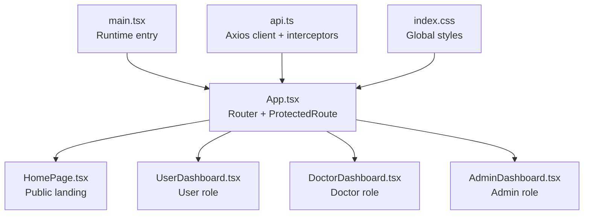
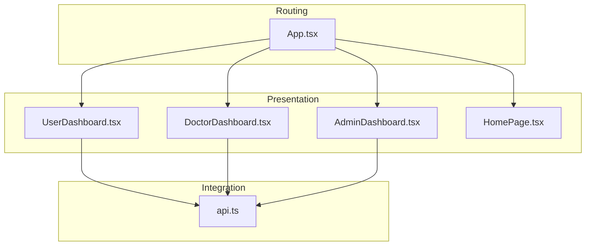
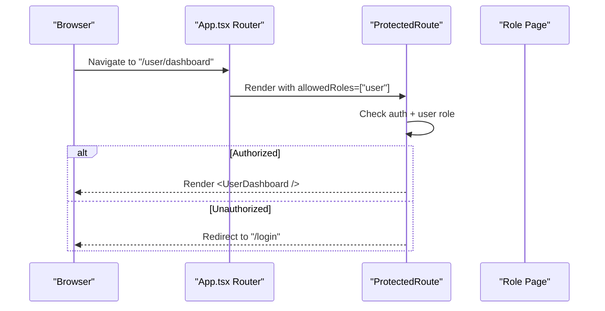
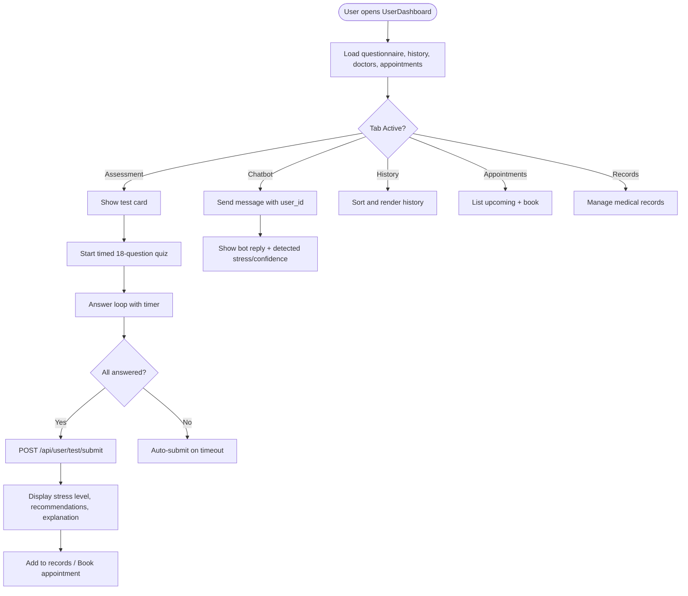
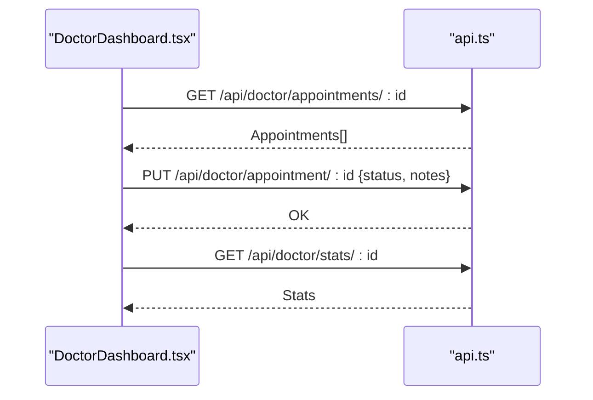
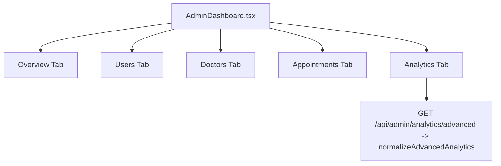
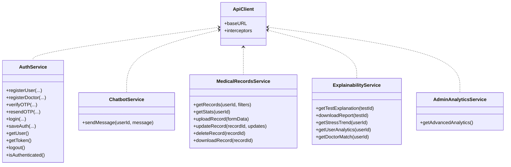
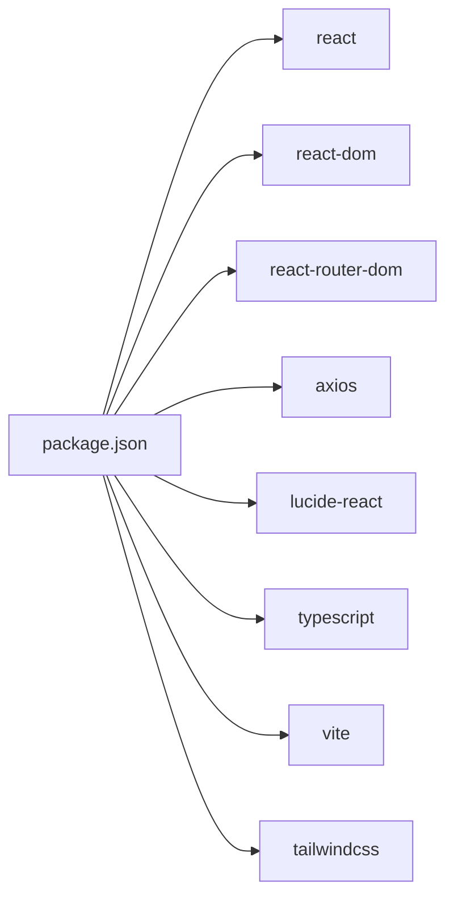

# Frontend Application

<cite>
**Referenced Files in This Document**
- [main.tsx](file://frontend/src/main.tsx)
- [App.tsx](file://frontend/src/App.tsx)
- [package.json](file://frontend/package.json)
- [tsconfig.json](file://frontend/tsconfig.json)
- [HomePage.tsx](file://frontend/src/pages/HomePage.tsx)
- [UserDashboard.tsx](file://frontend/src/pages/UserDashboard.tsx)
- [DoctorDashboard.tsx](file://frontend/src/pages/DoctorDashboard.tsx)
- [AdminDashboard.tsx](file://frontend/src/pages/AdminDashboard.tsx)
- [api.ts](file://frontend/src/services/api.ts)
- [index.css](file://frontend/src/index.css)
- [vite.config.ts](file://frontend/vite.config.ts)
- [tailwind.config.js](file://frontend/tailwind.config.js)
</cite>

## Table of Contents
1. [Introduction](#introduction)
2. [Project Structure](#project-structure)
3. [Core Components](#core-components)
4. [Architecture Overview](#architecture-overview)
5. [Detailed Component Analysis](#detailed-component-analysis)
6. [Dependency Analysis](#dependency-analysis)
7. [Performance Considerations](#performance-considerations)
8. [Troubleshooting Guide](#troubleshooting-guide)
9. [Conclusion](#conclusion)
10. [Appendices](#appendices)

## Introduction
This document describes the frontend application for the React-based AI Stress Level Analyzer. It covers the React component hierarchy, routing configuration, state management patterns, role-based dashboards, forms and assessments, data visualization, API integration, TypeScript types, component composition, styling and theming, accessibility, responsive design, and performance optimization strategies.

## Project Structure
The frontend is a Vite + React + TypeScript application using Tailwind CSS for styling. The runtime entry point initializes the React root and mounts the App shell, which defines routes and protected access per role.

**Diagram sources**
- [main.tsx:1-11](file://frontend/src/main.tsx#L1-L11)
- [App.tsx:1-88](file://frontend/src/App.tsx#L1-L88)
- [HomePage.tsx:1-407](file://frontend/src/pages/HomePage.tsx#L1-L407)
- [UserDashboard.tsx:1-919](file://frontend/src/pages/UserDashboard.tsx#L1-L919)
- [DoctorDashboard.tsx:1-256](file://frontend/src/pages/DoctorDashboard.tsx#L1-L256)
- [AdminDashboard.tsx:1-632](file://frontend/src/pages/AdminDashboard.tsx#L1-L632)
- [api.ts:1-439](file://frontend/src/services/api.ts#L1-L439)
- [index.css](file://frontend/src/index.css)

**Section sources**
- [main.tsx:1-11](file://frontend/src/main.tsx#L1-L11)
- [App.tsx:1-88](file://frontend/src/App.tsx#L1-L88)
- [package.json:1-27](file://frontend/package.json#L1-L27)
- [tsconfig.json:1-22](file://frontend/tsconfig.json#L1-L22)

## Core Components
- Runtime bootstrap: Creates the React root and renders the App component.
- App shell: Declares routes and a reusable ProtectedRoute wrapper enforcing authentication and role checks.
- Role-specific dashboards:
  - UserDashboard: Assessment flow, chatbot, history, appointments, and records.
  - DoctorDashboard: Appointments, stats, and patient history.
  - AdminDashboard: Overview, user/doctor management, appointments, and advanced analytics.
- API layer: Axios client with base URL, auth interceptor, and service modules for auth, chatbot, medical records, explainability, and admin analytics.

**Section sources**
- [main.tsx:1-11](file://frontend/src/main.tsx#L1-L11)
- [App.tsx:15-28](file://frontend/src/App.tsx#L15-L28)
- [UserDashboard.tsx:1-919](file://frontend/src/pages/UserDashboard.tsx#L1-L919)
- [DoctorDashboard.tsx:1-256](file://frontend/src/pages/DoctorDashboard.tsx#L1-L256)
- [AdminDashboard.tsx:1-632](file://frontend/src/pages/AdminDashboard.tsx#L1-L632)
- [api.ts:14-235](file://frontend/src/services/api.ts#L14-L235)

## Architecture Overview
The frontend follows a layered architecture:
- Presentation layer: React components organized by role.
- Routing layer: React Router DOM with protected routes.
- State layer: React hooks for local component state; centralized auth and services.
- Integration layer: Axios client with interceptors for auth and error handling.
- Styling layer: Tailwind utility classes with global CSS.

**Diagram sources**
- [App.tsx:30-88](file://frontend/src/App.tsx#L30-L88)
- [UserDashboard.tsx:1-919](file://frontend/src/pages/UserDashboard.tsx#L1-L919)
- [DoctorDashboard.tsx:1-256](file://frontend/src/pages/DoctorDashboard.tsx#L1-L256)
- [AdminDashboard.tsx:1-632](file://frontend/src/pages/AdminDashboard.tsx#L1-L632)
- [api.ts:14-439](file://frontend/src/services/api.ts#L14-L439)

## Detailed Component Analysis

### Routing and Protected Access
- ProtectedRoute enforces authentication and role checks. Unauthorized or unauthenticated users are redirected to login or home.
- Routes define entry points for public pages and role-scoped dashboards.

**Diagram sources**
- [App.tsx:15-28](file://frontend/src/App.tsx#L15-L28)
- [App.tsx:40-47](file://frontend/src/App.tsx#L40-L47)

**Section sources**
- [App.tsx:15-28](file://frontend/src/App.tsx#L15-L28)
- [App.tsx:30-88](file://frontend/src/App.tsx#L30-L88)

### User Dashboard: Assessment, Chatbot, History, Appointments, Records
- Assessment flow:
  - Loads questionnaire, tracks answers, enforces time limit, auto-submits on timeout, and displays results with recommendations and ML explanation.
- Chatbot:
  - Sends messages with user_id and displays detected stress level and confidence.
- History:
  - Sorts and displays past assessments with confidence metrics.
- Appointments:
  - Lists upcoming/pending appointments and supports booking.
- Medical Records:
  - Integrates with medical records service for retrieval, uploads, updates, deletions, and downloads.

**Diagram sources**
- [UserDashboard.tsx:129-228](file://frontend/src/pages/UserDashboard.tsx#L129-L228)
- [UserDashboard.tsx:250-279](file://frontend/src/pages/UserDashboard.tsx#L250-L279)
- [UserDashboard.tsx:138-163](file://frontend/src/pages/UserDashboard.tsx#L138-L163)
- [UserDashboard.tsx:230-242](file://frontend/src/pages/UserDashboard.tsx#L230-L242)

**Section sources**
- [UserDashboard.tsx:1-919](file://frontend/src/pages/UserDashboard.tsx#L1-L919)

### Doctor Dashboard: Appointments and Stats
- Displays appointment statistics and lists upcoming/pending/completed appointments.
- Allows updating appointment status and viewing patient test history.

**Diagram sources**
- [DoctorDashboard.tsx:19-47](file://frontend/src/pages/DoctorDashboard.tsx#L19-L47)

**Section sources**
- [DoctorDashboard.tsx:1-256](file://frontend/src/pages/DoctorDashboard.tsx#L1-L256)

### Admin Dashboard: Management and Analytics
- Overview: Totals, appointments, and stress distribution.
- Management: Users, doctors (verification and deletion), appointments.
- Analytics: Advanced insights including daily trends, locations, age groups, doctor effectiveness, and peak hours.

**Diagram sources**
- [AdminDashboard.tsx:65-75](file://frontend/src/pages/AdminDashboard.tsx#L65-L75)
- [api.ts:431-436](file://frontend/src/services/api.ts#L431-L436)

**Section sources**
- [AdminDashboard.tsx:1-632](file://frontend/src/pages/AdminDashboard.tsx#L1-L632)
- [api.ts:198-213](file://frontend/src/services/api.ts#L198-L213)

### API Integration Layer
- Axios client:
  - Base URL from environment variable.
  - Request interceptor attaches Authorization: Bearer token.
  - Response interceptor handles 401 by clearing auth and redirecting to login.
- Services:
  - authService: registration, OTP verification, login, token/user storage.
  - chatbotService: sends user messages to AI counselor endpoint.
  - medicalRecordsService: CRUD and download for medical records.
  - explainabilityService: explanations, reports, trends, analytics, doctor match.
  - adminAnalyticsService: normalized advanced analytics.

**Diagram sources**
- [api.ts:14-235](file://frontend/src/services/api.ts#L14-L235)
- [api.ts:237-347](file://frontend/src/services/api.ts#L237-L347)
- [api.ts:349-357](file://frontend/src/services/api.ts#L349-L357)
- [api.ts:359-396](file://frontend/src/services/api.ts#L359-L396)
- [api.ts:402-429](file://frontend/src/services/api.ts#L402-L429)
- [api.ts:431-436](file://frontend/src/services/api.ts#L431-L436)

**Section sources**
- [api.ts:14-235](file://frontend/src/services/api.ts#L14-L235)
- [api.ts:237-347](file://frontend/src/services/api.ts#L237-L347)
- [api.ts:349-357](file://frontend/src/services/api.ts#L349-L357)
- [api.ts:359-396](file://frontend/src/services/api.ts#L359-L396)
- [api.ts:402-429](file://frontend/src/services/api.ts#L402-L429)
- [api.ts:431-436](file://frontend/src/services/api.ts#L431-L436)

### Public Home Page
- Responsive hero, features, services, steps, and footer.
- Uses Tailwind utilities and Lucide icons.

**Section sources**
- [HomePage.tsx:1-407](file://frontend/src/pages/HomePage.tsx#L1-L407)

## Dependency Analysis
- Build and toolchain: Vite, TypeScript, Tailwind CSS.
- Runtime dependencies: React, React DOM, React Router DOM, Axios, Lucide React.
- Dev dependencies: @types/react, @types/react-dom, @vitejs/plugin-react, autoprefixer, postcss, tailwindcss, typescript, vite.

**Diagram sources**
- [package.json:10-26](file://frontend/package.json#L10-L26)

**Section sources**
- [package.json:1-27](file://frontend/package.json#L1-L27)

## Performance Considerations
- Minimize re-renders:
  - Use React.memo for static components.
  - Use useMemo/useCallback for derived data and event handlers.
- Lazy loading:
  - Split large components and defer heavy computations.
- Network efficiency:
  - Reuse Axios client; avoid redundant requests.
  - Debounce chat input and search filters.
- Bundle optimization:
  - Tree shaking via ES modules.
  - Code splitting with dynamic imports for non-critical routes.
- Rendering:
  - Virtualize long lists (history, analytics).
  - Prefer CSS transforms for animations.

## Troubleshooting Guide
- Authentication errors:
  - 401 responses trigger automatic logout and redirect to login.
- Form submission:
  - Duplicate submissions prevented by a submitting flag during assessment.
  - Validation ensures all questions are answered before submission.
- Network failures:
  - Service methods surface error messages; UI alerts guide users.

**Section sources**
- [api.ts:224-235](file://frontend/src/services/api.ts#L224-L235)
- [UserDashboard.tsx:204-228](file://frontend/src/pages/UserDashboard.tsx#L204-L228)

## Conclusion
The frontend implements a clean separation of concerns with role-based dashboards, robust API integration via Axios interceptors, and a responsive UI leveraging Tailwind CSS. The architecture supports scalability, maintainability, and a good user experience across devices.

## Appendices

### Accessibility and Responsive Design Guidelines
- Accessibility:
  - Use semantic HTML and ARIA attributes where needed.
  - Ensure keyboard navigation and focus management.
  - Provide meaningful labels and screen-reader-friendly content.
- Responsive design:
  - Utilize Tailwind’s responsive prefixes (sm, md, lg, xl).
  - Test on mobile, tablet, and desktop breakpoints.
  - Ensure touch targets are adequately sized.

### Theming and Customization
- Theming:
  - Centralize color palettes in Tailwind configuration and CSS variables.
  - Use consistent spacing and typography scales.
- Customization:
  - Extend components with optional props for variant styling.
  - Provide dark mode support via Tailwind dark: prefix and CSS variables.

### Cross-Browser Compatibility
- Transpile and polyfill as needed using Vite and TypeScript settings.
- Avoid unsupported APIs or include polyfills.
- Validate behavior across major browsers and adjust styles accordingly.