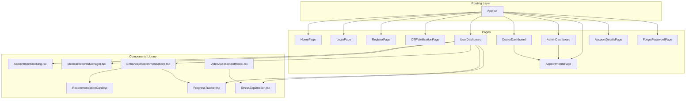
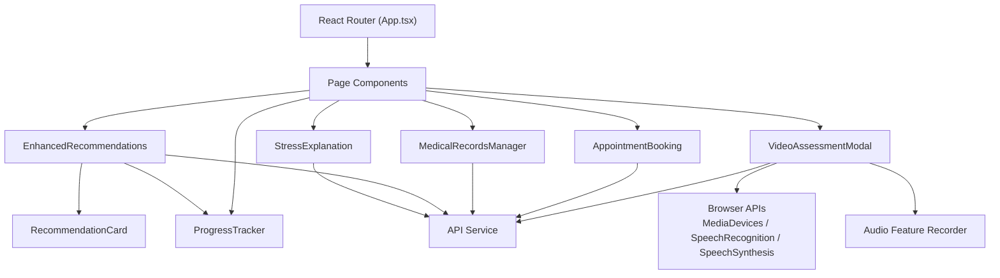
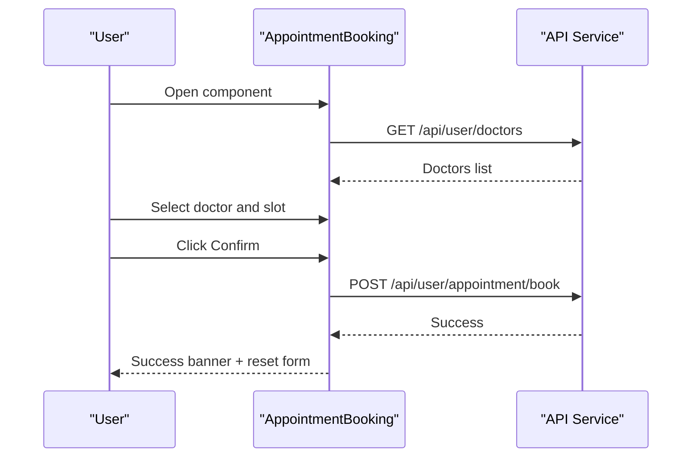
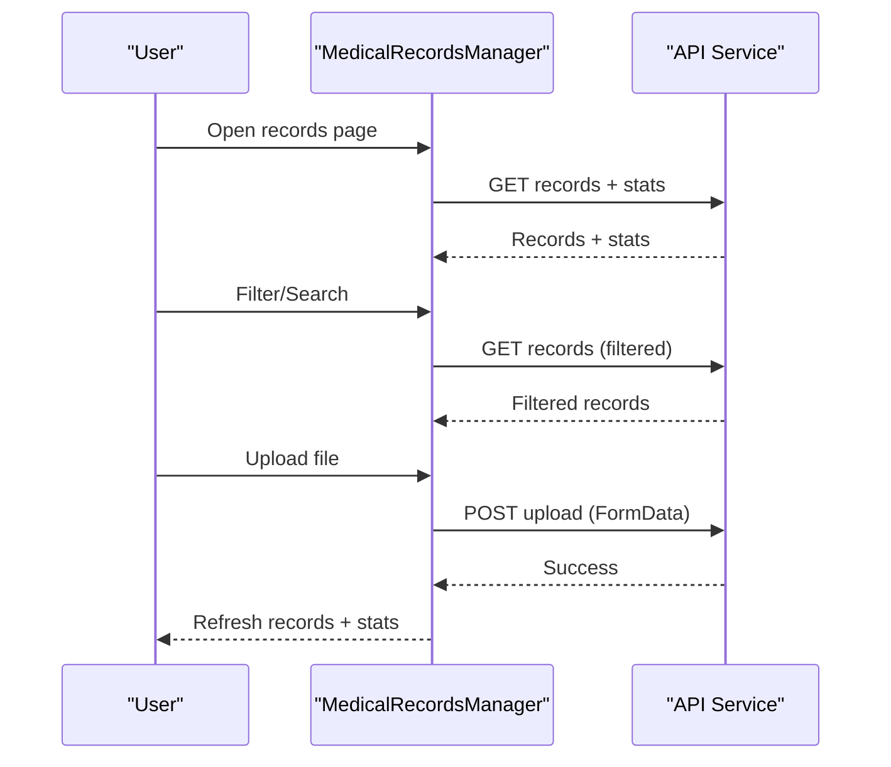
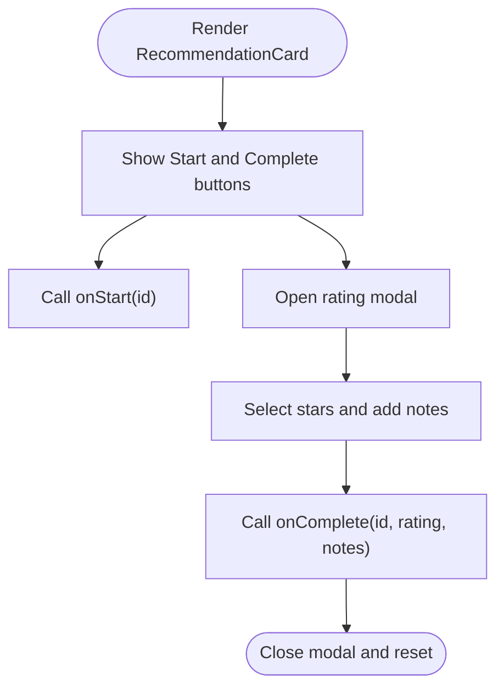
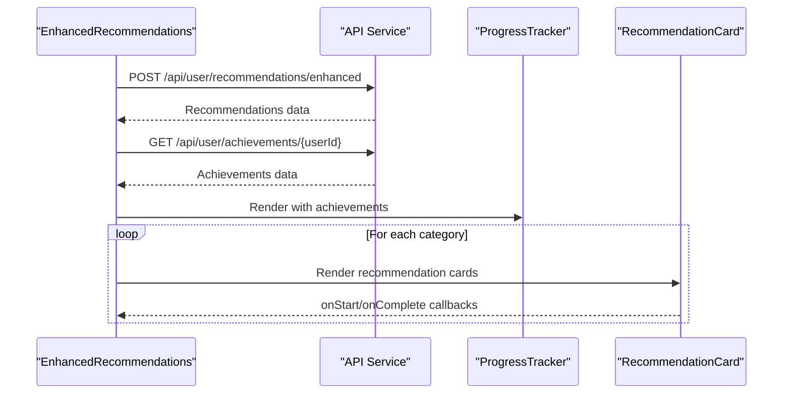
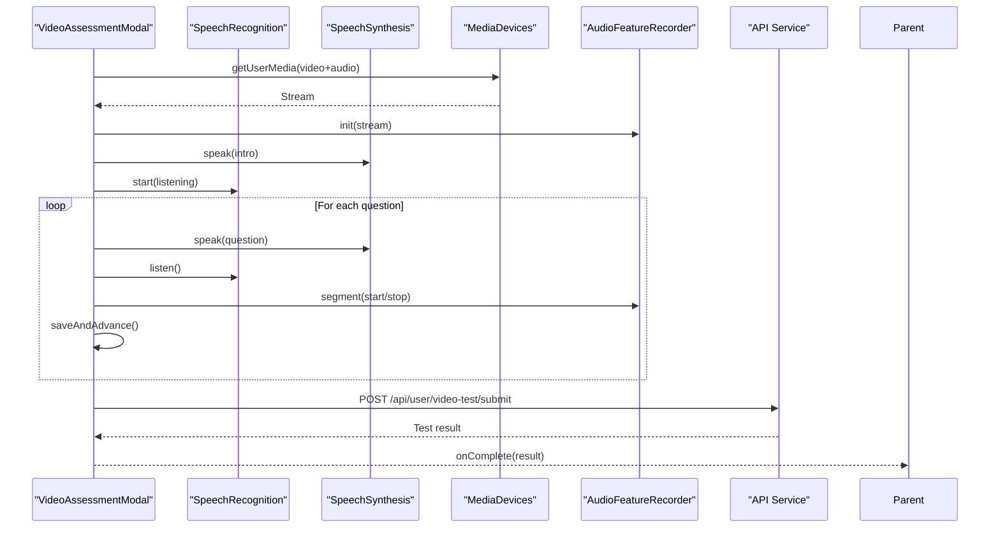
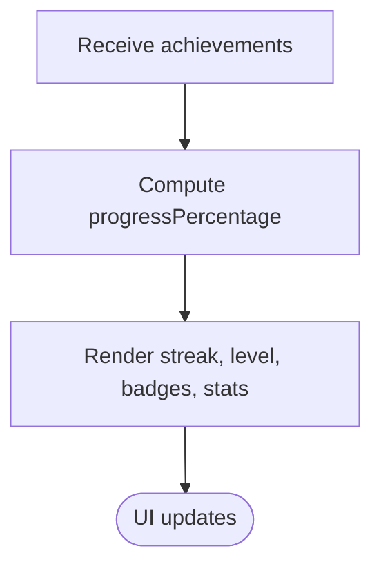
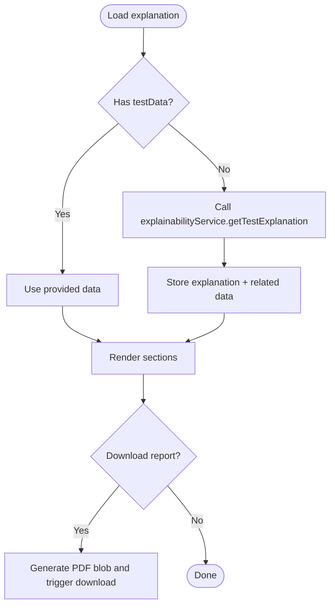
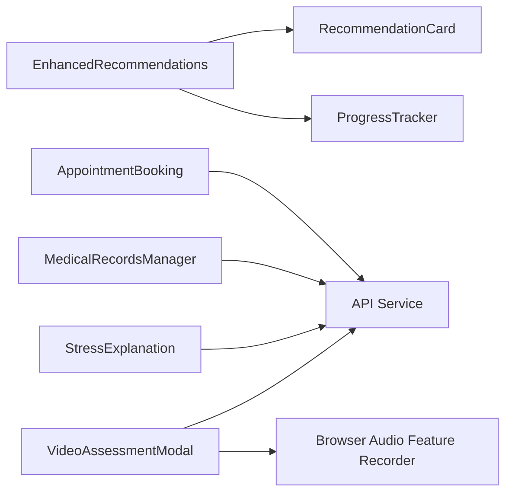

# UI Components

<cite>
**Referenced Files in This Document**
- [App.tsx](file://frontend/src/App.tsx)
- [tailwind.config.js](file://frontend/tailwind.config.js)
- [package.json](file://frontend/package.json)
- [AppointmentBooking.tsx](file://frontend/src/components/AppointmentBooking.tsx)
- [MedicalRecordsManager.tsx](file://frontend/src/components/MedicalRecordsManager.tsx)
- [RecommendationCard.tsx](file://frontend/src/components/RecommendationCard.tsx)
- [EnhancedRecommendations.tsx](file://frontend/src/components/EnhancedRecommendations.tsx)
- [VideoAssessmentModal.tsx](file://frontend/src/components/VideoAssessmentModal.tsx)
- [ProgressTracker.tsx](file://frontend/src/components/ProgressTracker.tsx)
- [StressExplanation.tsx](file://frontend/src/components/StressExplanation.tsx)
</cite>

## Table of Contents
1. [Introduction](#introduction)
2. [Project Structure](#project-structure)
3. [Core Components](#core-components)
4. [Architecture Overview](#architecture-overview)
5. [Detailed Component Analysis](#detailed-component-analysis)
6. [Dependency Analysis](#dependency-analysis)
7. [Performance Considerations](#performance-considerations)
8. [Accessibility and Compatibility](#accessibility-and-compatibility)
9. [Testing Strategies](#testing-strategies)
10. [Troubleshooting Guide](#troubleshooting-guide)
11. [Conclusion](#conclusion)

## Introduction
This document describes the React UI component library and design system used in the frontend. It focuses on reusable components for healthcare workflows: appointment booking, medical records management, recommendations, assessments, progress tracking, and explanatory insights. It explains component props, TypeScript interfaces, event handlers, state management patterns, Tailwind CSS integration, responsive design, composition patterns, performance techniques, accessibility, cross-browser compatibility, and testing strategies.

## Project Structure
The frontend is a Vite + React + TypeScript application with Tailwind CSS configured for utility-first styling. Routing is handled via React Router. Components are organized under a dedicated components folder and consumed by page-level views.

**Diagram sources**
- [App.tsx:1-88](file://frontend/src/App.tsx#L1-L88)
- [EnhancedRecommendations.tsx:1-158](file://frontend/src/components/EnhancedRecommendations.tsx#L1-L158)
- [ProgressTracker.tsx:1-77](file://frontend/src/components/ProgressTracker.tsx#L1-L77)
- [RecommendationCard.tsx:1-113](file://frontend/src/components/RecommendationCard.tsx#L1-L113)
- [VideoAssessmentModal.tsx:1-670](file://frontend/src/components/VideoAssessmentModal.tsx#L1-L670)
- [StressExplanation.tsx:1-257](file://frontend/src/components/StressExplanation.tsx#L1-L257)
- [MedicalRecordsManager.tsx:1-715](file://frontend/src/components/MedicalRecordsManager.tsx#L1-L715)
- [AppointmentBooking.tsx:1-335](file://frontend/src/components/AppointmentBooking.tsx#L1-L335)

**Section sources**
- [App.tsx:1-88](file://frontend/src/App.tsx#L1-L88)
- [package.json:1-27](file://frontend/package.json#L1-L27)

## Core Components
This section summarizes the primary components and their responsibilities, props, and state management patterns.

- AppointmentBooking
  - Purpose: Allows users to select a doctor, available time slot, add notes, and confirm booking.
  - Key props: userId
  - State: doctors, selectedDoctor, selectedSlot, notes, loading, booking, success, error
  - Events: handleBookAppointment, formatSlot, groupSlotsByDate
  - Styling: Tailwind utility classes, animations, responsive grids

- MedicalRecordsManager
  - Purpose: Upload, view, filter, search, download, and delete medical records; displays storage statistics.
  - Key props: userId
  - State: records, stats, loading, showUploadModal, searchQuery, filterType, selectedRecords, uploadForm, uploadProgress, dragActive
  - Events: fetchRecords, fetchStats, handleUpload, handleDownload, handleBulkDownload, handleDelete
  - Styling: Tailwind utility classes, modal overlays, drag-and-drop area

- RecommendationCard
  - Purpose: Renders a single recommendation with actions to start and mark complete; collects rating and notes.
  - Key props: recommendation, onStart, onComplete
  - State: showRating, rating, notes
  - Events: handleComplete, submitCompletion
  - Styling: Tailwind utility classes, star rating UI

- EnhancedRecommendations
  - Purpose: Loads categorized recommendations, achievement summary, and quick wins; orchestrates start/complete actions.
  - Key props: testId, userId
  - State: recommendations, achievements, loading, activeCategory
  - Events: loadRecommendations, loadAchievements, handleStart, handleComplete
  - Composition: Uses RecommendationCard and ProgressTracker

- VideoAssessmentModal
  - Purpose: Conducts a 18-question AI-assisted stress assessment using camera/microphone and browser APIs; submits results.
  - Key props: questions, onComplete, onClose
  - State: phase, currentQ, transcript, fallbackText, isAISpeaking, isRecording, timeLeft, speechSupported, error
  - Events: requestPermissions, startAssignment, saveAndAdvance, startListening, stopListening
  - Advanced: Uses MediaDevices, SpeechRecognition, SpeechSynthesis, BrowserAudioFeatureRecorder

- ProgressTracker
  - Purpose: Visualizes user streak, level progress, badges, and activity stats.
  - Key props: achievements
  - State: derived from props
  - Rendering: progress percentage calculation, badge grid, stat grid

- StressExplanation
  - Purpose: Presents AI-generated explanation, category scores, risk factors, probabilities, trends, and a downloadable PDF report.
  - Key props: testId, testData
  - State: explanation, categoryScores, riskFactors, continuousScore, probabilities, trend, crisis, loading, downloading
  - Events: loadExplanation, handleDownloadReport
  - Rendering: severity color mapping, trend icons, gauge visualization, bar charts

**Section sources**
- [AppointmentBooking.tsx:1-335](file://frontend/src/components/AppointmentBooking.tsx#L1-L335)
- [MedicalRecordsManager.tsx:1-715](file://frontend/src/components/MedicalRecordsManager.tsx#L1-L715)
- [RecommendationCard.tsx:1-113](file://frontend/src/components/RecommendationCard.tsx#L1-L113)
- [EnhancedRecommendations.tsx:1-158](file://frontend/src/components/EnhancedRecommendations.tsx#L1-L158)
- [VideoAssessmentModal.tsx:1-670](file://frontend/src/components/VideoAssessmentModal.tsx#L1-L670)
- [ProgressTracker.tsx:1-77](file://frontend/src/components/ProgressTracker.tsx#L1-L77)
- [StressExplanation.tsx:1-257](file://frontend/src/components/StressExplanation.tsx#L1-L257)

## Architecture Overview
The UI follows a layered architecture:
- Routing layer defines protected routes and navigates to page components.
- Page components orchestrate domain-specific layouts and compose reusable components.
- Reusable components encapsulate UI and logic for booking, records, recommendations, assessments, progress, and explanations.
- Services handle API communication and file operations.

**Diagram sources**
- [App.tsx:1-88](file://frontend/src/App.tsx#L1-L88)
- [EnhancedRecommendations.tsx:1-158](file://frontend/src/components/EnhancedRecommendations.tsx#L1-L158)
- [RecommendationCard.tsx:1-113](file://frontend/src/components/RecommendationCard.tsx#L1-L113)
- [ProgressTracker.tsx:1-77](file://frontend/src/components/ProgressTracker.tsx#L1-L77)
- [VideoAssessmentModal.tsx:1-670](file://frontend/src/components/VideoAssessmentModal.tsx#L1-L670)
- [StressExplanation.tsx:1-257](file://frontend/src/components/StressExplanation.tsx#L1-L257)
- [MedicalRecordsManager.tsx:1-715](file://frontend/src/components/MedicalRecordsManager.tsx#L1-L715)
- [AppointmentBooking.tsx:1-335](file://frontend/src/components/AppointmentBooking.tsx#L1-L335)

## Detailed Component Analysis

### AppointmentBooking
- Props: userId
- State management: useState for doctors, selection, notes, and UI flags; useEffect for initial load
- Event handlers: handleBookAppointment, formatSlot, groupSlotsByDate
- Data flow: Fetches doctor list, selects doctor and slot, posts booking payload, resets form on success
- Styling: Gradient headers, animated transitions, responsive grid, Tailwind utilities, icons from lucide-react

**Diagram sources**
- [AppointmentBooking.tsx:1-335](file://frontend/src/components/AppointmentBooking.tsx#L1-L335)

**Section sources**
- [AppointmentBooking.tsx:1-335](file://frontend/src/components/AppointmentBooking.tsx#L1-L335)

### MedicalRecordsManager
- Props: userId
- State: records, stats, filters, upload form, drag-and-drop state, progress
- Event handlers: handleFileChange, handleDrag, handleDrop, handleUpload, handleDownload, handleBulkDownload, handleDelete
- Data flow: Fetch records and stats, apply filters/search, upload via FormData, download and bulk-download via blob URLs
- Styling: Modal overlay, drag zone, grid cards, icons per file type, progress bar

**Diagram sources**
- [MedicalRecordsManager.tsx:1-715](file://frontend/src/components/MedicalRecordsManager.tsx#L1-L715)

**Section sources**
- [MedicalRecordsManager.tsx:1-715](file://frontend/src/components/MedicalRecordsManager.tsx#L1-L715)

### RecommendationCard
- Props: recommendation, onStart, onComplete
- State: local rating and notes for completion feedback
- Event handlers: handleComplete, submitCompletion
- Composition: Used by EnhancedRecommendations to render individual recommendations

**Diagram sources**
- [RecommendationCard.tsx:1-113](file://frontend/src/components/RecommendationCard.tsx#L1-L113)

**Section sources**
- [RecommendationCard.tsx:1-113](file://frontend/src/components/RecommendationCard.tsx#L1-L113)

### EnhancedRecommendations
- Props: testId, userId
- State: recommendations, achievements, loading, activeCategory
- Event handlers: loadRecommendations, loadAchievements, handleStart, handleComplete
- Composition: Renders ProgressTracker and RecommendationCard instances; manages category tabs and quick wins

**Diagram sources**
- [EnhancedRecommendations.tsx:1-158](file://frontend/src/components/EnhancedRecommendations.tsx#L1-L158)
- [ProgressTracker.tsx:1-77](file://frontend/src/components/ProgressTracker.tsx#L1-L77)
- [RecommendationCard.tsx:1-113](file://frontend/src/components/RecommendationCard.tsx#L1-L113)

**Section sources**
- [EnhancedRecommendations.tsx:1-158](file://frontend/src/components/EnhancedRecommendations.tsx#L1-L158)

### VideoAssessmentModal
- Props: questions, onComplete, onClose
- State: phase, currentQ, transcript/fallbackText, isAISpeaking/isRecording, timeLeft, speechSupported, error
- Browser APIs: MediaDevices, SpeechRecognition, SpeechSynthesis, custom audio feature recorder
- Flow: Permission -> Intro -> AI speaks -> User answers -> Next/Finish -> Submit -> onComplete

**Diagram sources**
- [VideoAssessmentModal.tsx:1-670](file://frontend/src/components/VideoAssessmentModal.tsx#L1-L670)

**Section sources**
- [VideoAssessmentModal.tsx:1-670](file://frontend/src/components/VideoAssessmentModal.tsx#L1-L670)

### ProgressTracker
- Props: achievements
- Rendering: Calculates progress percentage, renders streak, level info, badges grid, and stats grid

**Diagram sources**
- [ProgressTracker.tsx:1-77](file://frontend/src/components/ProgressTracker.tsx#L1-L77)

**Section sources**
- [ProgressTracker.tsx:1-77](file://frontend/src/components/ProgressTracker.tsx#L1-L77)

### StressExplanation
- Props: testId, testData
- State: explanation, categoryScores, riskFactors, continuousScore, probabilities, trend, crisis, loading, downloading
- Rendering: Crisis alert, continuous score gauge, SHAP-style factor bars, category severity cards, risk factor cards, probability bars, trend summary, download button

**Diagram sources**
- [StressExplanation.tsx:1-257](file://frontend/src/components/StressExplanation.tsx#L1-L257)

**Section sources**
- [StressExplanation.tsx:1-257](file://frontend/src/components/StressExplanation.tsx#L1-L257)

## Dependency Analysis
- Internal dependencies:
  - EnhancedRecommendations composes RecommendationCard and ProgressTracker
  - VideoAssessmentModal depends on browser APIs and a custom audio feature recorder
  - StressExplanation depends on explainability service
- External dependencies:
  - React, React Router DOM, Axios, lucide-react
  - Tailwind CSS for styling

**Diagram sources**
- [EnhancedRecommendations.tsx:1-158](file://frontend/src/components/EnhancedRecommendations.tsx#L1-L158)
- [RecommendationCard.tsx:1-113](file://frontend/src/components/RecommendationCard.tsx#L1-L113)
- [ProgressTracker.tsx:1-77](file://frontend/src/components/ProgressTracker.tsx#L1-L77)
- [VideoAssessmentModal.tsx:1-670](file://frontend/src/components/VideoAssessmentModal.tsx#L1-L670)
- [StressExplanation.tsx:1-257](file://frontend/src/components/StressExplanation.tsx#L1-L257)
- [MedicalRecordsManager.tsx:1-715](file://frontend/src/components/MedicalRecordsManager.tsx#L1-L715)
- [AppointmentBooking.tsx:1-335](file://frontend/src/components/AppointmentBooking.tsx#L1-L335)

**Section sources**
- [package.json:1-27](file://frontend/package.json#L1-L27)

## Performance Considerations
- Lazy loading and conditional rendering:
  - Components render skeletons or empty states while loading to avoid blocking the UI.
- Efficient re-renders:
  - Use minimal state slices; avoid unnecessary object/array mutations; memoize derived values (e.g., progress percentage).
- API caching:
  - Consider caching recommendations and records where appropriate to reduce network calls.
- File operations:
  - Use blob URLs for downloads; revoke URLs after use to free memory.
- Audio/video:
  - Stop streams and speech synthesis on unmount; cancel timers to prevent leaks.
- Tailwind:
  - Keep utility classes scoped and avoid excessive nesting; leverage JIT mode for production builds.

## Accessibility and Compatibility
- ARIA and semantics:
  - Buttons and controls use native elements with accessible labels; ensure focus order is logical.
- Screen readers:
  - Announce dynamic content changes (e.g., AI speaking, recording status).
- Cross-browser:
  - SpeechRecognition and SpeechSynthesis vary by browser; gracefully degrade when unsupported.
  - MediaDevices permissions must be handled with user gesture; provide clear error messaging.
- Color contrast:
  - Severity indicators use sufficient contrast; avoid color-only communication.
- Responsive:
  - Components use responsive grids and breakpoints; ensure readability on small screens.

## Testing Strategies
- Unit tests:
  - Test component rendering with mock props and state.
  - Mock API services to isolate UI behavior.
- Interaction tests:
  - Simulate user flows: selecting doctor/slot, uploading files, starting assessments, rating recommendations.
- Browser API tests:
  - Mock MediaDevices, SpeechRecognition, and SpeechSynthesis for deterministic tests.
- Integration tests:
  - Verify end-to-end flows: routing, protected routes, data fetching, and submission.
- Snapshot/percy:
  - Capture key UI states for visual regression detection.

## Troubleshooting Guide
- Appointment booking errors:
  - Validate required selections; display localized error messages; ensure network connectivity.
- Medical records upload failures:
  - Check file size/format constraints; confirm JWT auth is attached; handle server-side validation errors.
- Assessment permission denied:
  - Prompt user to enable camera/mic; detect unsupported browsers; provide fallback text input.
- Speech recognition issues:
  - Detect unsupported environments; provide typed fallback; handle “not allowed” errors.
- Download problems:
  - Verify blob generation and URL creation; ensure user-initiated download triggers.

**Section sources**
- [VideoAssessmentModal.tsx:1-670](file://frontend/src/components/VideoAssessmentModal.tsx#L1-L670)
- [StressExplanation.tsx:1-257](file://frontend/src/components/StressExplanation.tsx#L1-L257)
- [MedicalRecordsManager.tsx:1-715](file://frontend/src/components/MedicalRecordsManager.tsx#L1-L715)
- [AppointmentBooking.tsx:1-335](file://frontend/src/components/AppointmentBooking.tsx#L1-L335)

## Conclusion
The component library provides a cohesive, accessible, and responsive foundation for healthcare workflows. By leveraging React patterns, Tailwind utilities, and robust service integrations, the components deliver clear user experiences across appointment booking, records management, recommendations, assessments, progress tracking, and explanatory insights. Adopting the recommended composition patterns, performance techniques, and testing strategies will help maintain quality and scalability.