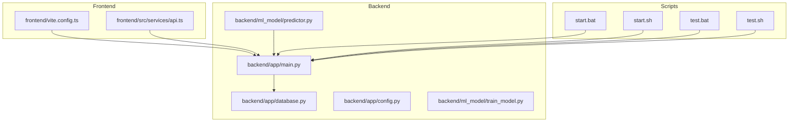
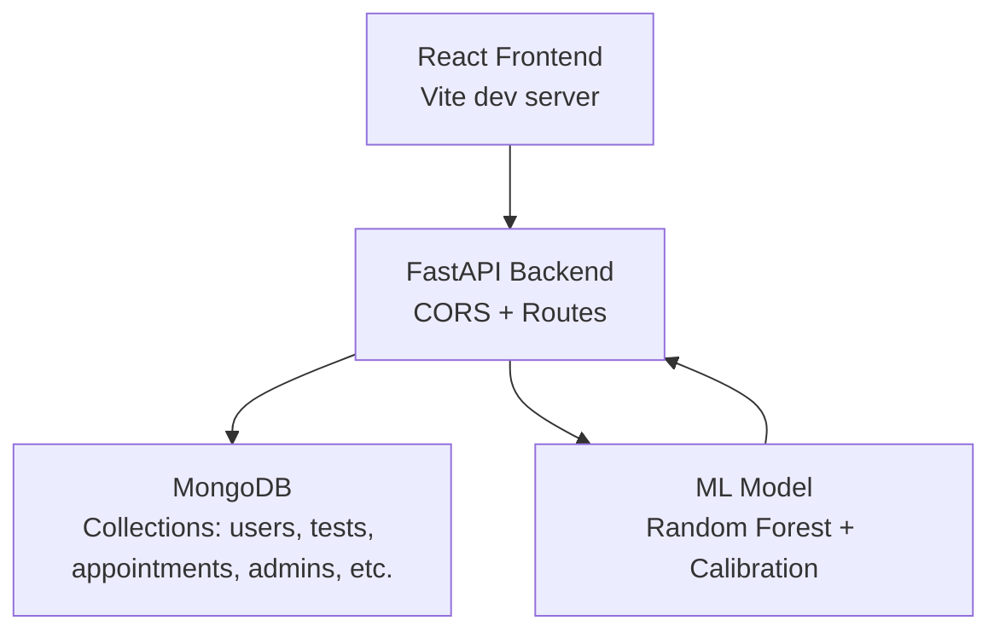
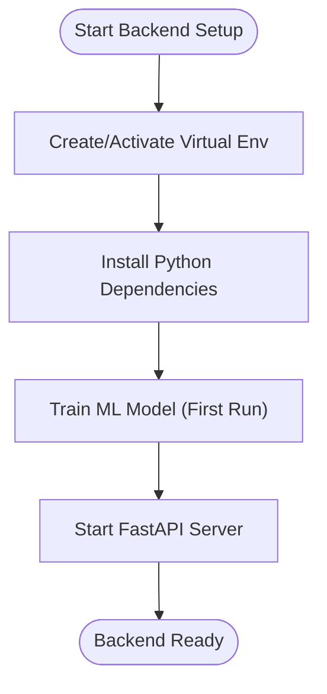
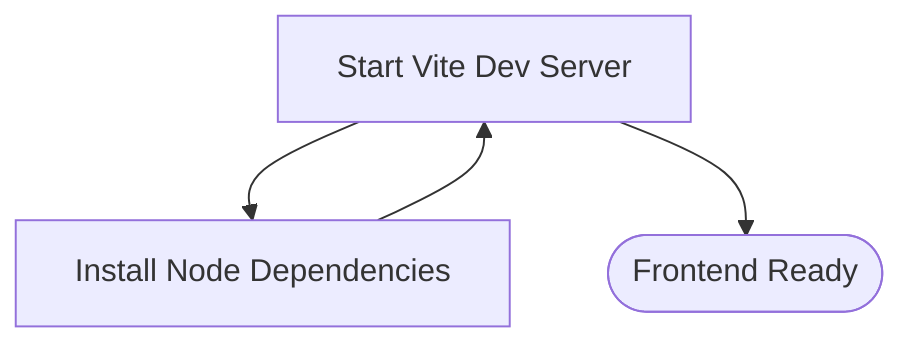
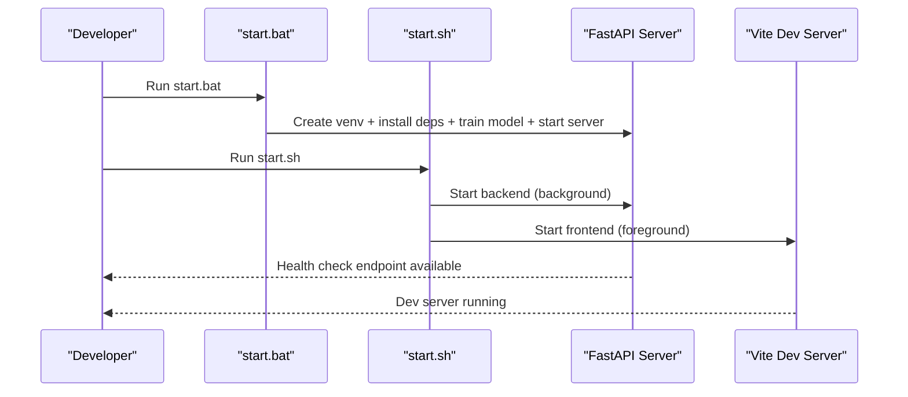
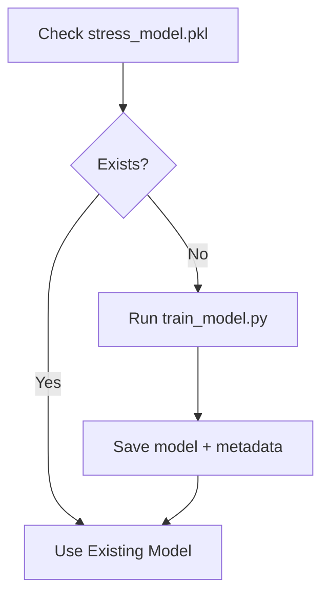
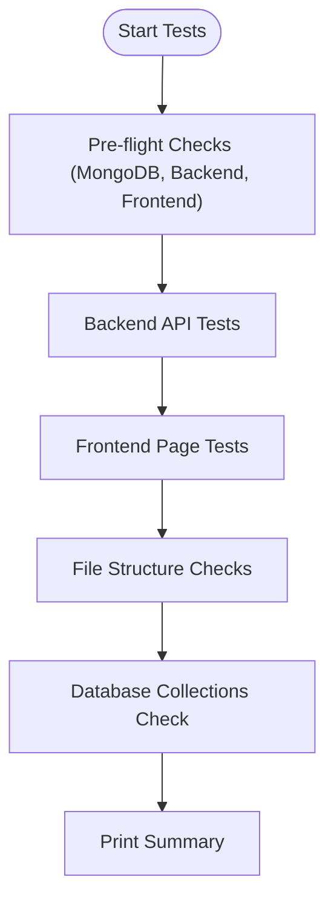
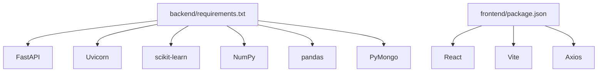

# Getting Started

<cite>
**Referenced Files in This Document**
- [README.md](file://README.md)
- [backend/requirements.txt](file://backend/requirements.txt)
- [frontend/package.json](file://frontend/package.json)
- [start.bat](file://start.bat)
- [start.sh](file://start.sh)
- [test.bat](file://test.bat)
- [test.sh](file://test.sh)
- [backend/app/main.py](file://backend/app/main.py)
- [backend/app/config.py](file://backend/app/config.py)
- [backend/app/database.py](file://backend/app/database.py)
- [backend/ml_model/train_model.py](file://backend/ml_model/train_model.py)
- [backend/ml_model/predictor.py](file://backend/ml_model/predictor.py)
- [frontend/vite.config.ts](file://frontend/vite.config.ts)
- [frontend/src/services/api.ts](file://frontend/src/services/api.ts)
- [backend/ml_model/VOICE_STRESS_TRAINING.md](file://backend/ml_model/VOICE_STRESS_TRAINING.md)
</cite>

## Table of Contents
1. [Introduction](#introduction)
2. [Project Structure](#project-structure)
3. [Core Components](#core-components)
4. [Architecture Overview](#architecture-overview)
5. [Detailed Component Analysis](#detailed-component-analysis)
6. [Dependency Analysis](#dependency-analysis)
7. [Performance Considerations](#performance-considerations)
8. [Troubleshooting Guide](#troubleshooting-guide)
9. [Conclusion](#conclusion)
10. [Appendices](#appendices)

## Introduction
This guide helps you install, configure, and run the AI Stress Level Analyzer locally on Windows and Unix-based systems. You will set up the backend (Python/FastAPI), frontend (React/Vite), machine learning model, and MongoDB. It includes quick start with provided scripts, environment configuration, first-time model training, local development servers, verification steps, and troubleshooting tips.

## Project Structure
The project is organized into:
- backend: FastAPI application, ML model training and inference, and database integration
- frontend: React application with Vite dev server and API client
- scripts: Windows and Unix startup and test automation
- data: public datasets for model training and audio datasets for voice stress (optional)

**Diagram sources**
- [backend/app/main.py:134-137](file://backend/app/main.py#L134-L137)
- [backend/app/database.py:26-54](file://backend/app/database.py#L26-L54)
- [backend/app/config.py:3-22](file://backend/app/config.py#L3-L22)
- [backend/ml_model/train_model.py:79-195](file://backend/ml_model/train_model.py#L79-L195)
- [backend/ml_model/predictor.py:32-118](file://backend/ml_model/predictor.py#L32-L118)
- [frontend/vite.config.ts:7-18](file://frontend/vite.config.ts#L7-L18)
- [frontend/src/services/api.ts:12-22](file://frontend/src/services/api.ts#L12-L22)
- [start.bat:34-67](file://start.bat#L34-L67)
- [start.sh:20-87](file://start.sh#L20-L87)
- [test.bat:20-46](file://test.bat#L20-L46)
- [test.sh:51-96](file://test.sh#L51-L96)

**Section sources**
- [README.md:698-767](file://README.md#L698-L767)

## Core Components
- Backend (FastAPI)
  - Entry point initializes routes, CORS, and database on startup
  - Health check validates MongoDB connectivity
- Database (MongoDB)
  - Connection pooling, timeouts, and index creation for performance
- ML Model
  - Random Forest ensemble with calibration and optional SHAP explanations
  - Auto-retraining if model file is missing or corrupted
- Frontend (React/Vite)
  - Dev server with proxy to backend
  - API client configured via environment variable

**Section sources**
- [backend/app/main.py:81-132](file://backend/app/main.py#L81-L132)
- [backend/app/database.py:30-54](file://backend/app/database.py#L30-L54)
- [backend/ml_model/predictor.py:81-118](file://backend/ml_model/predictor.py#L81-L118)
- [frontend/vite.config.ts:7-18](file://frontend/vite.config.ts#L7-L18)
- [frontend/src/services/api.ts:12-22](file://frontend/src/services/api.ts#L12-L22)

## Architecture Overview
The system consists of a React frontend, a FastAPI backend, and MongoDB. The ML model resides in the backend’s ML module and powers stress predictions.

**Diagram sources**
- [backend/app/main.py:70-79](file://backend/app/main.py#L70-L79)
- [backend/app/database.py:88-158](file://backend/app/database.py#L88-L158)
- [backend/ml_model/predictor.py:32-46](file://backend/ml_model/predictor.py#L32-L46)

## Detailed Component Analysis

### Prerequisites
- Python 3.10+
- Node.js 18+ and npm
- MongoDB running locally or reachable via URI

Verification steps:
- Confirm Python version meets requirement
- Confirm Node.js and npm are installed
- Confirm MongoDB is running or provide a valid MongoDB URI

**Section sources**
- [README.md:379-384](file://README.md#L379-L384)

### Installation and Setup

#### Backend (Python/FastAPI)
- Create and activate a virtual environment
- Install dependencies from requirements.txt
- Train the ML model (required on first run)
- Start the backend server

**Diagram sources**
- [backend/requirements.txt:1-22](file://backend/requirements.txt#L1-L22)
- [backend/ml_model/train_model.py:79-195](file://backend/ml_model/train_model.py#L79-L195)
- [backend/app/main.py:134-137](file://backend/app/main.py#L134-L137)

**Section sources**
- [README.md:396-416](file://README.md#L396-L416)

#### Frontend (React/Vite)
- Install Node dependencies
- Start the development server

**Diagram sources**
- [frontend/package.json:5-9](file://frontend/package.json#L5-L9)
- [frontend/vite.config.ts:7-18](file://frontend/vite.config.ts#L7-L18)

**Section sources**
- [README.md:421-434](file://README.md#L421-L434)

### Environment Variables
Create a backend .env file with required and optional variables. Required keys include JWT secret, admin password, and MongoDB URL. Optional keys include AI chatbot credentials, email SMTP settings, SMS provider settings, CORS origins, and token expiration.

Verification:
- Confirm .env exists in backend directory
- Ensure ALLOWED_ORIGINS includes frontend URLs

**Section sources**
- [README.md:445-478](file://README.md#L445-L478)
- [backend/app/main.py:32-50](file://backend/app/main.py#L32-L50)
- [backend/app/config.py:3-22](file://backend/app/config.py#L3-L22)

### Database Configuration
- Default connection string targets localhost
- On first run, the backend creates an admin user if none exists
- Collections are created automatically; indexes are created on startup

Verification:
- Confirm database connectivity
- Confirm admin account creation
- Confirm collections exist or will be created on first use

**Section sources**
- [README.md:482-503](file://README.md#L482-L503)
- [backend/app/database.py:30-54](file://backend/app/database.py#L30-L54)
- [backend/app/database.py:307-338](file://backend/app/database.py#L307-L338)

### Quick Start Scripts
- Windows: start.bat
  - Creates/activates venv, installs dependencies, trains model if missing, starts backend
- Unix: start.sh
  - Checks MongoDB, sets up backend, starts backend in background, sets up and starts frontend, prints URLs

**Diagram sources**
- [start.bat:34-67](file://start.bat#L34-L67)
- [start.sh:43-87](file://start.sh#L43-L87)

**Section sources**
- [start.bat:1-68](file://start.bat#L1-L68)
- [start.sh:1-94](file://start.sh#L1-L94)

### Local Development Servers
- Backend: http://localhost:8000
- Frontend: http://localhost:3000 or http://localhost:5173
- API docs: http://localhost:8000/docs

Proxy configuration forwards /api/* to backend.

**Section sources**
- [README.md:413-434](file://README.md#L413-L434)
- [frontend/vite.config.ts:10-17](file://frontend/vite.config.ts#L10-L17)
- [backend/app/main.py:99-112](file://backend/app/main.py#L99-L112)

### First-Time Model Training
- The ML model is trained automatically if the model file is missing or corrupted
- You can trigger training manually via the training script

**Diagram sources**
- [backend/ml_model/predictor.py:81-118](file://backend/ml_model/predictor.py#L81-L118)
- [backend/ml_model/train_model.py:79-195](file://backend/ml_model/train_model.py#L79-L195)

**Section sources**
- [README.md:409-410](file://README.md#L409-L410)
- [backend/ml_model/predictor.py:81-118](file://backend/ml_model/predictor.py#L81-L118)

### Testing Procedures
- Windows: test.bat runs backend tests using pytest
- Unix: test.sh performs pre-flight checks, backend API tests, frontend page tests, file structure checks, and database collection checks

**Diagram sources**
- [test.bat:31-45](file://test.bat#L31-L45)
- [test.sh:35-197](file://test.sh#L35-L197)

**Section sources**
- [test.bat:1-46](file://test.bat#L1-L46)
- [test.sh:1-198](file://test.sh#L1-L198)

### Development Workflow
- Backend
  - Modify routes, models, or ML logic; restart server to apply changes
  - Use health endpoint to verify backend availability
- Frontend
  - Modify components or services; Vite hot reload applies changes
  - Ensure proxy configuration matches backend port
- ML
  - Retrain model when adding new data or updating features
  - Use predictor for inference and explanations

**Section sources**
- [backend/app/main.py:114-132](file://backend/app/main.py#L114-L132)
- [frontend/vite.config.ts:10-17](file://frontend/vite.config.ts#L10-L17)
- [backend/ml_model/predictor.py:119-144](file://backend/ml_model/predictor.py#L119-L144)

## Dependency Analysis
- Backend dependencies include FastAPI, Uvicorn, scikit-learn, NumPy, pandas, PyMongo, Pydantic, JWT, bcrypt, and others
- Frontend dependencies include React, Vite, Tailwind, Axios, and TypeScript

**Diagram sources**
- [backend/requirements.txt:1-22](file://backend/requirements.txt#L1-L22)
- [frontend/package.json:10-26](file://frontend/package.json#L10-L26)

**Section sources**
- [backend/requirements.txt:1-22](file://backend/requirements.txt#L1-L22)
- [frontend/package.json:10-26](file://frontend/package.json#L10-L26)

## Performance Considerations
- Backend uses connection pooling and optimized timeouts for MongoDB
- Indexes are created on frequently queried fields to improve performance
- ML model uses a calibrated ensemble to balance accuracy and reliability

**Section sources**
- [backend/app/database.py:30-54](file://backend/app/database.py#L30-L54)
- [backend/app/database.py:164-302](file://backend/app/database.py#L164-L302)
- [backend/ml_model/train_model.py:94-127](file://backend/ml_model/train_model.py#L94-L127)

## Troubleshooting Guide
Common issues and resolutions:
- MongoDB not running
  - Start MongoDB service or set a valid MONGODB_URL
- Backend port already in use
  - Change port in backend app configuration
- Model not found
  - Run model training script or rely on auto-retraining
- Frontend API connection issues
  - Ensure backend is running, ALLOWED_ORIGINS includes frontend URL, and proxy settings are correct

**Section sources**
- [README.md:664-696](file://README.md#L664-L696)
- [backend/app/main.py:32-50](file://backend/app/main.py#L32-L50)
- [frontend/vite.config.ts:10-17](file://frontend/vite.config.ts#L10-L17)
- [backend/ml_model/predictor.py:81-118](file://backend/ml_model/predictor.py#L81-L118)

## Conclusion
You now have the essentials to install, configure, and run the AI Stress Level Analyzer locally. Use the provided scripts for quick start, verify installations with the test scripts, and refer to the troubleshooting section for common issues. For advanced ML scenarios, consult the voice stress training guide.

## Appendices

### Verification Checklist
- Backend
  - Health endpoint responds
  - Root endpoint responds
  - API docs available
- Frontend
  - Home, login, and register pages accessible
- Database
  - Collections created or will be created on first use
- ML
  - Model file present or auto-trained

**Section sources**
- [test.sh:89-107](file://test.sh#L89-L107)
- [test.sh:114-118](file://test.sh#L114-L118)
- [test.sh:151-167](file://test.sh#L151-L167)
- [backend/ml_model/predictor.py:81-118](file://backend/ml_model/predictor.py#L81-L118)

### Voice Stress Training (Optional)
For audio-based stress detection, prepare manifests from datasets and train audio models. The repository includes scripts and guidance for DAIC-WOZ and general audio datasets.

**Section sources**
- [backend/ml_model/VOICE_STRESS_TRAINING.md:1-189](file://backend/ml_model/VOICE_STRESS_TRAINING.md#L1-L189)