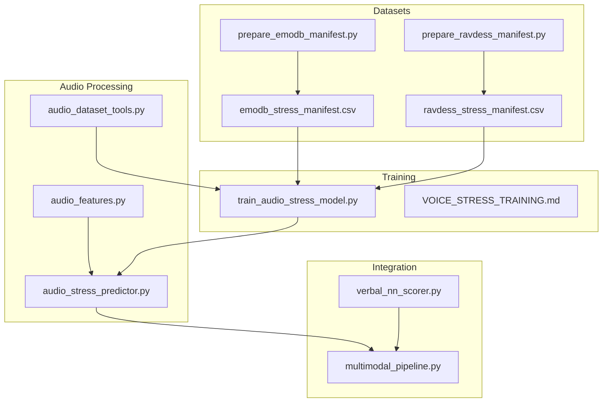
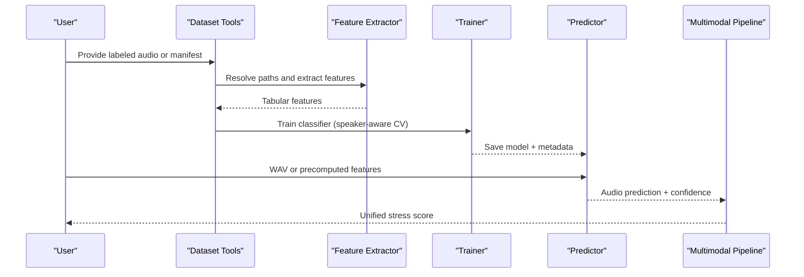
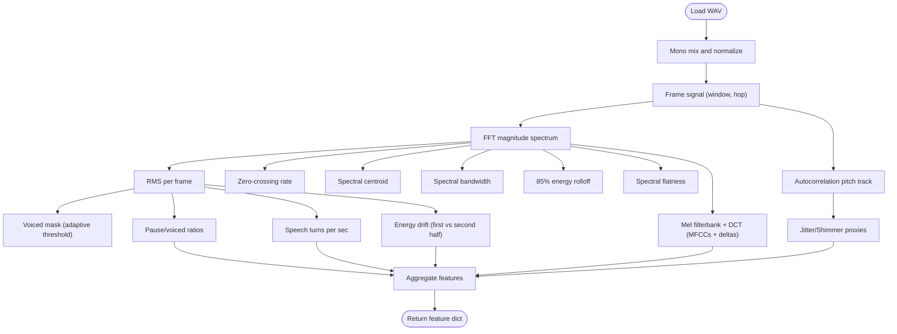
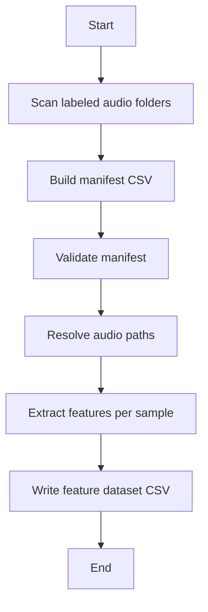
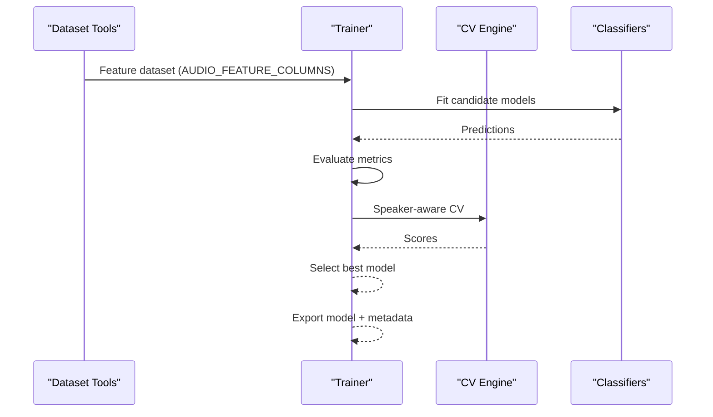
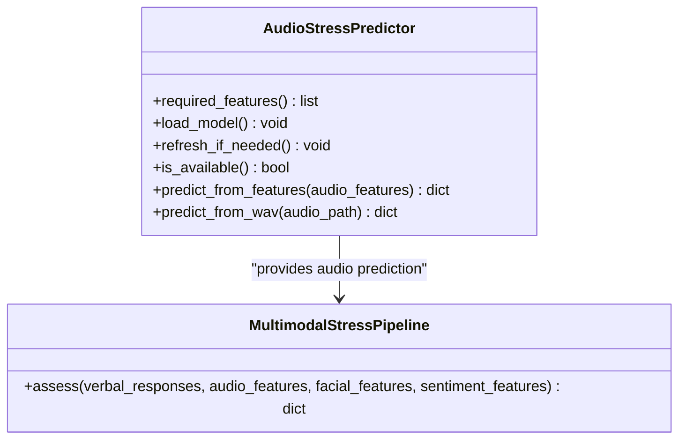
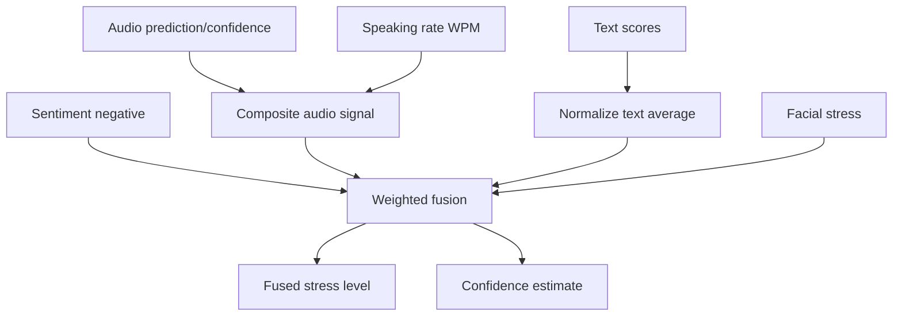
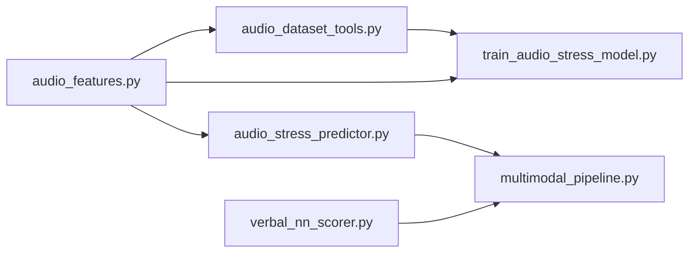

# Audio Processing

<cite>
**Referenced Files in This Document**
- [audio_features.py](file://backend/ml_model/audio_features.py)
- [audio_dataset_tools.py](file://backend/ml_model/audio_dataset_tools.py)
- [train_audio_stress_model.py](file://backend/ml_model/train_audio_stress_model.py)
- [audio_stress_predictor.py](file://backend/ml_model/audio_stress_predictor.py)
- [multimodal_pipeline.py](file://backend/ml_model/multimodal_pipeline.py)
- [VOICE_STRESS_TRAINING.md](file://backend/ml_model/VOICE_STRESS_TRAINING.md)
- [prepare_emodb_manifest.py](file://backend/ml_model/prepare_emodb_manifest.py)
- [prepare_ravdess_manifest.py](file://backend/ml_model/prepare_ravdess_manifest.py)
- [emodb_stress_manifest.csv](file://backend/ml_model/emodb_stress_manifest.csv)
- [ravdess_stress_manifest.csv](file://backend/ml_model/ravdess_stress_manifest.csv)
- [verbal_nn_scorer.py](file://backend/ml_model/verbal_nn_scorer.py)
- [stress_model_meta.json](file://backend/ml_model/stress_model_meta.json)
</cite>

## Table of Contents
1. [Introduction](#introduction)
2. [Project Structure](#project-structure)
3. [Core Components](#core-components)
4. [Architecture Overview](#architecture-overview)
5. [Detailed Component Analysis](#detailed-component-analysis)
6. [Dependency Analysis](#dependency-analysis)
7. [Performance Considerations](#performance-considerations)
8. [Troubleshooting Guide](#troubleshooting-guide)
9. [Conclusion](#conclusion)

## Introduction
This document describes the audio processing system for voice-based stress detection. It covers the end-to-end pipeline from raw audio to multimodal stress assessment, including preprocessing, feature extraction, model training, and integration with textual and facial modalities. It also documents audio quality requirements, processing latency considerations, and optimization techniques for real-time scenarios.

## Project Structure
The audio processing system resides in the backend machine learning module and is organized around:
- Feature extraction and preprocessing
- Dataset preparation and manifests
- Model training and evaluation
- Prediction and multimodal fusion

**Diagram sources**
- [audio_features.py](file://backend/ml_model/audio_features.py)
- [audio_dataset_tools.py](file://backend/ml_model/audio_dataset_tools.py)
- [audio_stress_predictor.py](file://backend/ml_model/audio_stress_predictor.py)
- [train_audio_stress_model.py](file://backend/ml_model/train_audio_stress_model.py)
- [VOICE_STRESS_TRAINING.md](file://backend/ml_model/VOICE_STRESS_TRAINING.md)
- [prepare_emodb_manifest.py](file://backend/ml_model/prepare_emodb_manifest.py)
- [prepare_ravdess_manifest.py](file://backend/ml_model/prepare_ravdess_manifest.py)
- [emodb_stress_manifest.csv](file://backend/ml_model/emodb_stress_manifest.csv)
- [ravdess_stress_manifest.csv](file://backend/ml_model/ravdess_stress_manifest.csv)
- [multimodal_pipeline.py](file://backend/ml_model/multimodal_pipeline.py)
- [verbal_nn_scorer.py](file://backend/ml_model/verbal_nn_scorer.py)

**Section sources**
- [audio_features.py](file://backend/ml_model/audio_features.py)
- [audio_dataset_tools.py](file://backend/ml_model/audio_dataset_tools.py)
- [train_audio_stress_model.py](file://backend/ml_model/train_audio_stress_model.py)
- [audio_stress_predictor.py](file://backend/ml_model/audio_stress_predictor.py)
- [multimodal_pipeline.py](file://backend/ml_model/multimodal_pipeline.py)
- [VOICE_STRESS_TRAINING.md](file://backend/ml_model/VOICE_STRESS_TRAINING.md)
- [prepare_emodb_manifest.py](file://backend/ml_model/prepare_emodb_manifest.py)
- [prepare_ravdess_manifest.py](file://backend/ml_model/prepare_ravdess_manifest.py)
- [emodb_stress_manifest.csv](file://backend/ml_model/emodb_stress_manifest.csv)
- [ravdess_stress_manifest.csv](file://backend/ml_model/ravdess_stress_manifest.csv)
- [verbal_nn_scorer.py](file://backend/ml_model/verbal_nn_scorer.py)
- [stress_model_meta.json](file://backend/ml_model/stress_model_meta.json)

## Core Components
- Audio feature extractor: Loads PCM WAV files, normalizes, segments into frames, computes spectral and prosodic features, and derives pitch and jitter/shimmer proxies.
- Dataset tools: Builds manifests from labeled audio folders, resolves paths, and generates tabular feature datasets.
- Audio stress trainer: Builds classifiers, splits data speaker-wise, evaluates via cross-validation, and exports metadata.
- Audio predictor: Loads trained model and metadata, validates feature coverage, and produces stress predictions.
- Multimodal pipeline: Fuses audio, text, and auxiliary signals into a unified stress score with dynamic weighting and confidence estimation.

**Section sources**
- [audio_features.py](file://backend/ml_model/audio_features.py)
- [audio_dataset_tools.py](file://backend/ml_model/audio_dataset_tools.py)
- [train_audio_stress_model.py](file://backend/ml_model/train_audio_stress_model.py)
- [audio_stress_predictor.py](file://backend/ml_model/audio_stress_predictor.py)
- [multimodal_pipeline.py](file://backend/ml_model/multimodal_pipeline.py)

## Architecture Overview
The system follows a classic ML pipeline: data preparation → feature extraction → model training → inference → multimodal fusion.

**Diagram sources**
- [audio_dataset_tools.py](file://backend/ml_model/audio_dataset_tools.py)
- [audio_features.py](file://backend/ml_model/audio_features.py)
- [train_audio_stress_model.py](file://backend/ml_model/train_audio_stress_model.py)
- [audio_stress_predictor.py](file://backend/ml_model/audio_stress_predictor.py)
- [multimodal_pipeline.py](file://backend/ml_model/multimodal_pipeline.py)

## Detailed Component Analysis

### Audio Feature Extraction
The feature extractor performs:
- PCM WAV loading and mono conversion
- Peak-normalization and DC removal
- Framing with configurable window size and hop
- Spectral features: RMS, ZCR, spectral centroid/bandwidth, spectral rolloff, spectral flatness
- MFCC computation with Mel filterbanks and DCT, plus delta features
- Pitch estimation via autocorrelation with adaptive thresholds
- Prosody proxies: jitter, shimmer, pause/voiced ratios, speech turns per second, energy drift

**Diagram sources**
- [audio_features.py](file://backend/ml_model/audio_features.py)

**Section sources**
- [audio_features.py](file://backend/ml_model/audio_features.py)

### Dataset Preparation and Manifests
- Manifest creation from labeled folders: scans label-specific directories and builds CSV with standardized columns.
- Manifest validation: ensures required fields and consistent stress levels.
- Path resolution: supports absolute and relative paths with dataset root fallback.
- Feature dataset generation: runs feature extraction for each sample and writes a CSV with all audio features appended.

**Diagram sources**
- [audio_dataset_tools.py](file://backend/ml_model/audio_dataset_tools.py)
- [prepare_emodb_manifest.py](file://backend/ml_model/prepare_emodb_manifest.py)
- [prepare_ravdess_manifest.py](file://backend/ml_model/prepare_ravdess_manifest.py)

**Section sources**
- [audio_dataset_tools.py](file://backend/ml_model/audio_dataset_tools.py)
- [prepare_emodb_manifest.py](file://backend/ml_model/prepare_emodb_manifest.py)
- [prepare_ravdess_manifest.py](file://backend/ml_model/prepare_ravdess_manifest.py)
- [emodb_stress_manifest.csv](file://backend/ml_model/emodb_stress_manifest.csv)
- [ravdess_stress_manifest.csv](file://backend/ml_model/ravdess_stress_manifest.csv)

### Model Training and Evaluation
- Classifier ensemble: VotingClassifier combining Random Forest, Extremely-Randomized Trees, and Logistic Regression with preprocessing pipelines.
- Speaker-aware splitting: GroupShuffleSplit by speaker_id when available; otherwise stratified random split.
- Cross-validation: StratifiedGroupKFold preferred when sufficient speakers; otherwise StratifiedKFold.
- Metrics: Accuracy, balanced accuracy, classification report, confusion matrix, top feature importance.
- Metadata: Stores feature source, dataset root, counts, split method, model type, and evaluation statistics.

**Diagram sources**
- [train_audio_stress_model.py](file://backend/ml_model/train_audio_stress_model.py)

**Section sources**
- [train_audio_stress_model.py](file://backend/ml_model/train_audio_stress_model.py)
- [VOICE_STRESS_TRAINING.md](file://backend/ml_model/VOICE_STRESS_TRAINING.md)

### Audio Prediction and Integration
- Predictor loads the trained model and metadata, validates required features, and optionally imputes missing values.
- Provides stress prediction with confidence and per-class probabilities.
- Integrates with multimodal pipeline to fuse audio with text and auxiliary signals.

**Diagram sources**
- [audio_stress_predictor.py](file://backend/ml_model/audio_stress_predictor.py)
- [multimodal_pipeline.py](file://backend/ml_model/multimodal_pipeline.py)

**Section sources**
- [audio_stress_predictor.py](file://backend/ml_model/audio_stress_predictor.py)
- [multimodal_pipeline.py](file://backend/ml_model/multimodal_pipeline.py)
- [verbal_nn_scorer.py](file://backend/ml_model/verbal_nn_scorer.py)

### Multimodal Fusion
- Text scoring: Neural network-based 1–5 scoring for 18 questions.
- Audio fusion: Uses trained model prediction confidence and/or heuristic features; combines with speaking rate and sentiment signals.
- Dynamic weights: Adjust based on audio confidence and whether imputation was used.
- Final stress level: Determined by weighted fusion with margin-based confidence.

**Diagram sources**
- [multimodal_pipeline.py](file://backend/ml_model/multimodal_pipeline.py)
- [verbal_nn_scorer.py](file://backend/ml_model/verbal_nn_scorer.py)

**Section sources**
- [multimodal_pipeline.py](file://backend/ml_model/multimodal_pipeline.py)
- [verbal_nn_scorer.py](file://backend/ml_model/verbal_nn_scorer.py)

## Dependency Analysis
Key internal dependencies:
- audio_features.py defines AUDIO_FEATURE_COLUMNS and feature extraction routines used by audio_dataset_tools.py and audio_stress_predictor.py.
- train_audio_stress_model.py depends on audio_dataset_tools.py for dataset building and audio_features.py for feature columns.
- audio_stress_predictor.py depends on joblib-pickled model and JSON metadata produced by training.
- multimodal_pipeline.py integrates audio predictor and verbal neural scorer.

**Diagram sources**
- [audio_features.py](file://backend/ml_model/audio_features.py)
- [audio_dataset_tools.py](file://backend/ml_model/audio_dataset_tools.py)
- [audio_stress_predictor.py](file://backend/ml_model/audio_stress_predictor.py)
- [train_audio_stress_model.py](file://backend/ml_model/train_audio_stress_model.py)
- [multimodal_pipeline.py](file://backend/ml_model/multimodal_pipeline.py)
- [verbal_nn_scorer.py](file://backend/ml_model/verbal_nn_scorer.py)

**Section sources**
- [audio_features.py](file://backend/ml_model/audio_features.py)
- [audio_dataset_tools.py](file://backend/ml_model/audio_dataset_tools.py)
- [train_audio_stress_model.py](file://backend/ml_model/train_audio_stress_model.py)
- [audio_stress_predictor.py](file://backend/ml_model/audio_stress_predictor.py)
- [multimodal_pipeline.py](file://backend/ml_model/multimodal_pipeline.py)
- [verbal_nn_scorer.py](file://backend/ml_model/verbal_nn_scorer.py)

## Performance Considerations
- Latency-sensitive inference:
  - Prefer precomputed features when streaming audio to avoid repeated FFT and MFCC computations.
  - Use efficient framing parameters (frame_ms=25, hop_ms=10) to balance temporal resolution and compute cost.
  - Cache Mel filterbanks and DCT bases to reduce recomputation overhead.
- Speaker independence:
  - Train/test splits should be speaker-aware to avoid leakage; the trainer automatically selects StratifiedGroupKFold when speaker_id is present.
- Quality and diversity:
  - Use diverse recording conditions, devices, and demographics; balance classes across low/moderate/high/severe.
- Model selection:
  - Ensemble of RF/ET/LR often yields robust performance; tune class weights and depth to prevent overfitting.

[No sources needed since this section provides general guidance]

## Troubleshooting Guide
Common issues and resolutions:
- Unsupported WAV sample width or empty files: ensure PCM WAV files and non-empty audio.
- Missing required manifest columns: verify presence of sample_id, audio_path, stress_label, stress_level, speaker_id.
- Speaker-independent evaluation failures: confirm speaker_id is present for group-based CV; otherwise fall back to stratified CV.
- Model loading errors: check model and metadata existence and integrity; re-run training if needed.
- Low audio coverage: predictor reports available vs required features; ensure all AUDIO_FEATURE_COLUMNS are present or allow imputation.

**Section sources**
- [audio_features.py](file://backend/ml_model/audio_features.py)
- [audio_dataset_tools.py](file://backend/ml_model/audio_dataset_tools.py)
- [train_audio_stress_model.py](file://backend/ml_model/train_audio_stress_model.py)
- [audio_stress_predictor.py](file://backend/ml_model/audio_stress_predictor.py)

## Conclusion
The audio processing system provides a robust, speaker-aware pipeline for voice-based stress detection. It combines classical audio features with modern ML techniques, supports cross-dataset validation, and integrates seamlessly with multimodal signals. By following the recommended dataset guidelines and leveraging speaker-aware evaluation, teams can achieve reliable performance suitable for production deployment.