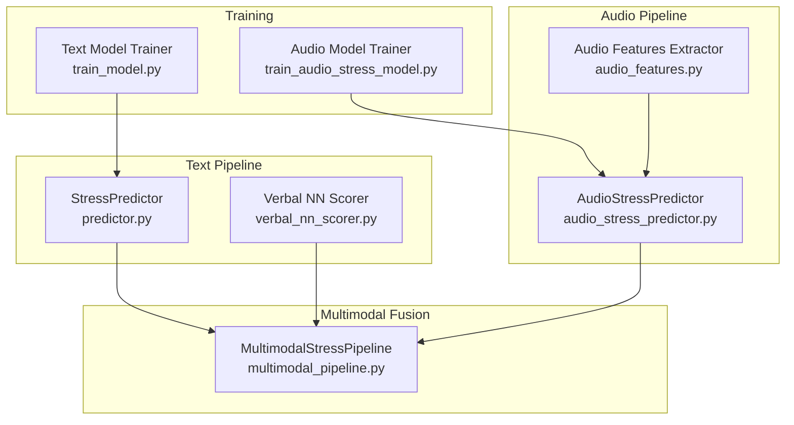
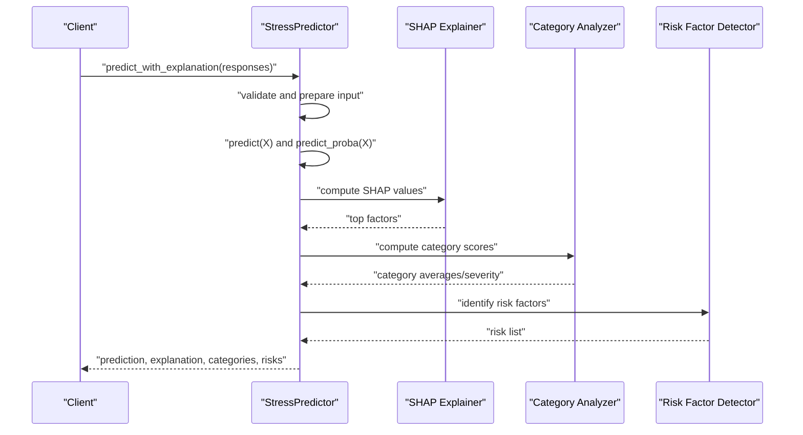
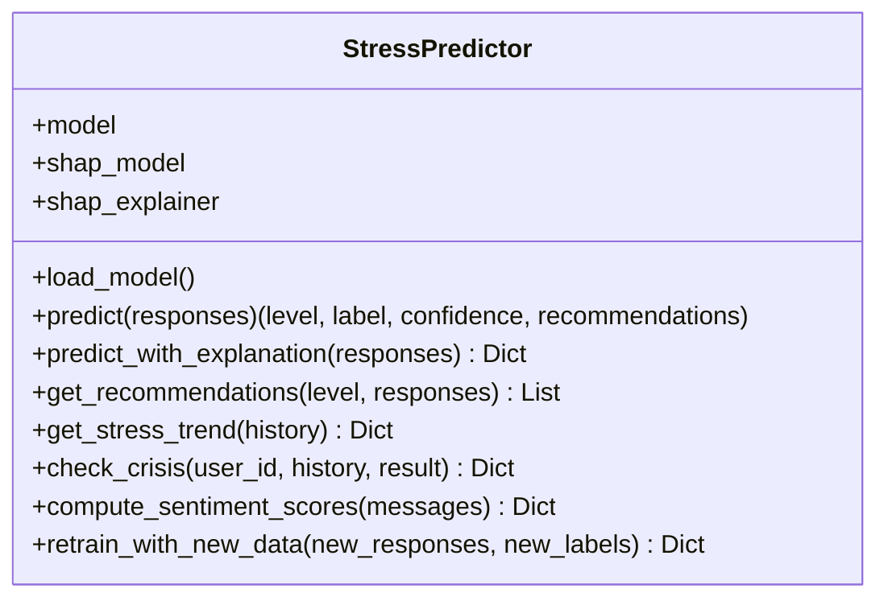
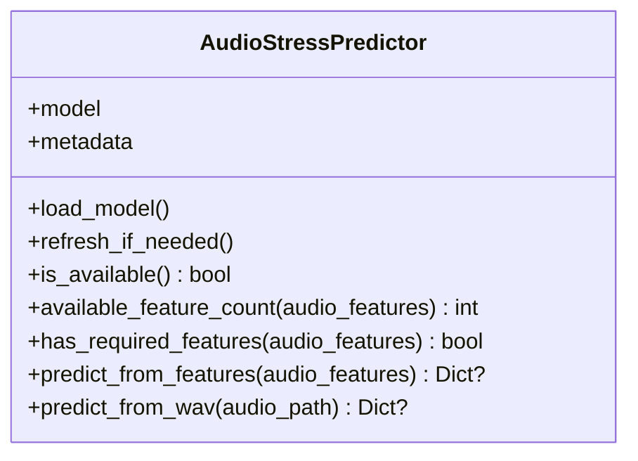
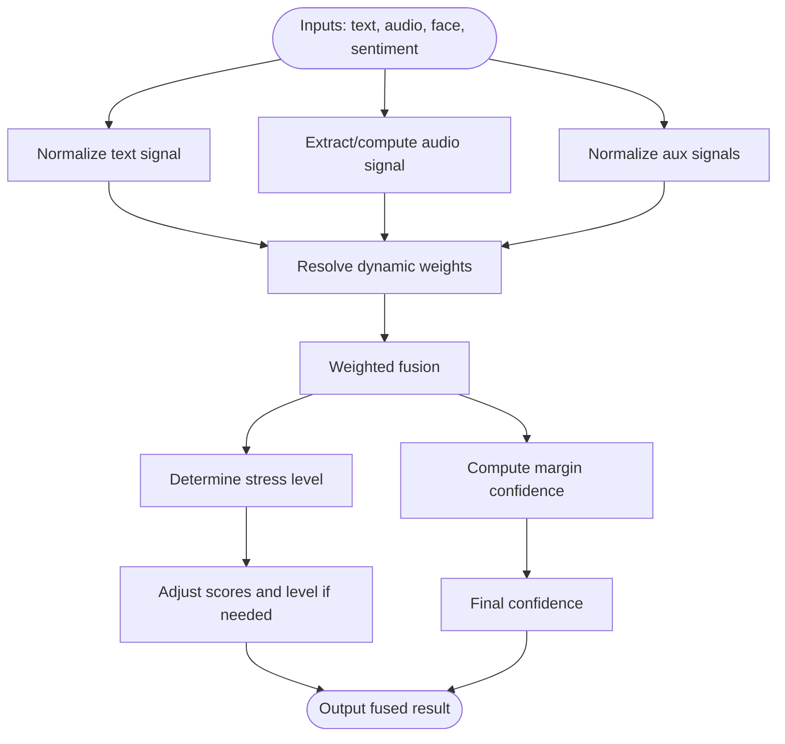
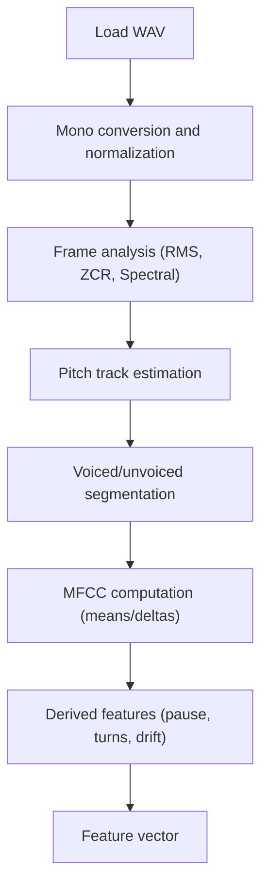
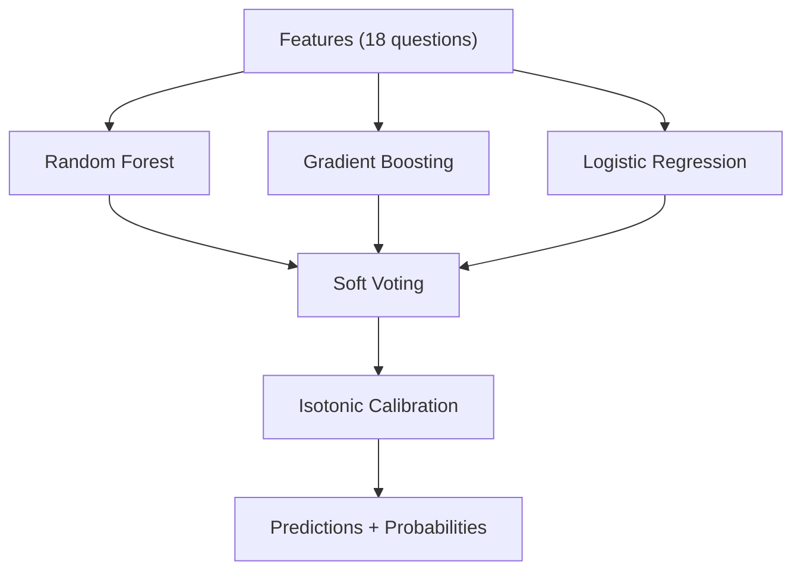
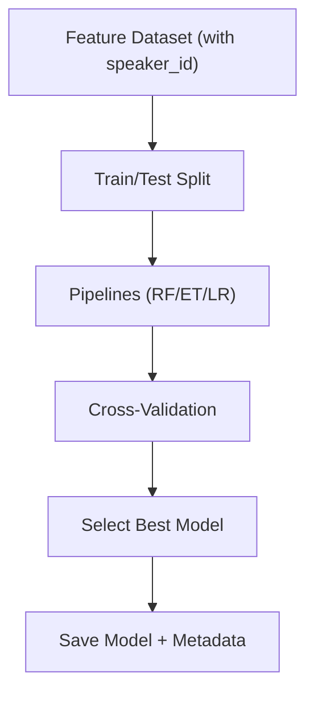
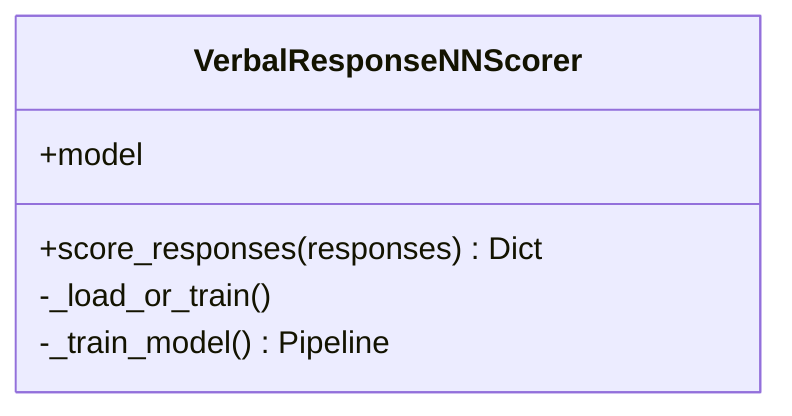
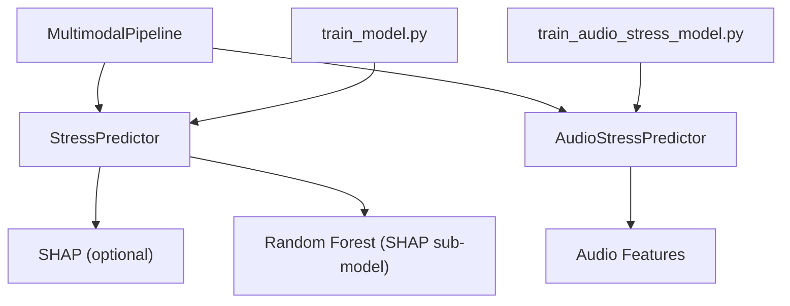

# Machine Learning Engine

<cite>
**Referenced Files in This Document**
- [predictor.py](file://backend/ml_model/predictor.py)
- [audio_stress_predictor.py](file://backend/ml_model/audio_stress_predictor.py)
- [multimodal_pipeline.py](file://backend/ml_model/multimodal_pipeline.py)
- [audio_features.py](file://backend/ml_model/audio_features.py)
- [train_model.py](file://backend/ml_model/train_model.py)
- [train_audio_stress_model.py](file://backend/ml_model/train_audio_stress_model.py)
- [verbal_nn_scorer.py](file://backend/ml_model/verbal_nn_scorer.py)
- [stress_model_meta.json](file://backend/ml_model/stress_model_meta.json)
- [audio_stress_model_meta.json](file://backend/ml_model/audio_stress_model_meta.json)
- [emodb_stress_features.csv](file://backend/ml_model/emodb_stress_features.csv)
</cite>

## Table of Contents
1. [Introduction](#introduction)
2. [Project Structure](#project-structure)
3. [Core Components](#core-components)
4. [Architecture Overview](#architecture-overview)
5. [Detailed Component Analysis](#detailed-component-analysis)
6. [Dependency Analysis](#dependency-analysis)
7. [Performance Considerations](#performance-considerations)
8. [Troubleshooting Guide](#troubleshooting-guide)
9. [Conclusion](#conclusion)
10. [Appendices](#appendices)

## Introduction
This document explains the machine learning engine powering the AI Stress Level Analyzer. It covers the StressPredictor class, model loading and validation, prediction workflows, and the multimodal pipeline that combines textual and audio signals. It also documents the Random Forest-based ensemble model, training data preparation, audio feature extraction and speech analysis, explainability via SHAP, confidence scoring, performance metrics, feature importance, continuous learning, and deployment considerations.

## Project Structure
The ML engine resides under backend/ml_model and orchestrates:
- Text-based stress prediction with a calibrated ensemble model
- Audio-based stress prediction with a trained pipeline
- Multimodal fusion of text, audio, and auxiliary signals
- Training utilities for both text and audio models
- Audio feature extraction and preprocessing

**Diagram sources**
- [predictor.py:32-590](file://backend/ml_model/predictor.py#L32-L590)
- [verbal_nn_scorer.py:12-151](file://backend/ml_model/verbal_nn_scorer.py#L12-L151)
- [audio_features.py:261-352](file://backend/ml_model/audio_features.py#L261-L352)
- [audio_stress_predictor.py:13-157](file://backend/ml_model/audio_stress_predictor.py#L13-L157)
- [multimodal_pipeline.py:11-183](file://backend/ml_model/multimodal_pipeline.py#L11-L183)
- [train_model.py:79-195](file://backend/ml_model/train_model.py#L79-L195)
- [train_audio_stress_model.py:261-417](file://backend/ml_model/train_audio_stress_model.py#L261-L417)

**Section sources**
- [predictor.py:32-590](file://backend/ml_model/predictor.py#L32-L590)
- [audio_stress_predictor.py:13-157](file://backend/ml_model/audio_stress_predictor.py#L13-L157)
- [multimodal_pipeline.py:11-183](file://backend/ml_model/multimodal_pipeline.py#L11-L183)
- [audio_features.py:261-352](file://backend/ml_model/audio_features.py#L261-L352)
- [train_model.py:79-195](file://backend/ml_model/train_model.py#L79-L195)
- [train_audio_stress_model.py:261-417](file://backend/ml_model/train_audio_stress_model.py#L261-L417)

## Core Components
- StressPredictor: Loads and validates trained models, performs predictions, computes SHAP-based explanations, category scores, risk factors, confidence, and multimodal adjustments.
- AudioStressPredictor: Loads a trained audio model and predicts stress from pre-extracted or freshly computed audio features.
- MultimodalStressPipeline: Fuses text, audio, and auxiliary signals into a unified stress score with dynamic weighting and confidence estimation.
- VerbalResponseNNScorer: Converts natural language responses into 1–5 scores using a lightweight neural network.
- Training modules: train_model.py (text) and train_audio_stress_model.py (audio) define model architectures, training loops, cross-validation, and metadata generation.

Key responsibilities:
- Integrity checks for model pickles via SHA-256 hashes
- Calibration of probabilities for robust confidence
- SHAP-based explainability for text models
- Speaker-aware training and evaluation for audio models
- Confidence-weighted fusion across modalities

**Section sources**
- [predictor.py:32-590](file://backend/ml_model/predictor.py#L32-L590)
- [audio_stress_predictor.py:13-157](file://backend/ml_model/audio_stress_predictor.py#L13-L157)
- [multimodal_pipeline.py:11-183](file://backend/ml_model/multimodal_pipeline.py#L11-L183)
- [verbal_nn_scorer.py:12-151](file://backend/ml_model/verbal_nn_scorer.py#L12-L151)
- [train_model.py:79-195](file://backend/ml_model/train_model.py#L79-L195)
- [train_audio_stress_model.py:261-417](file://backend/ml_model/train_audio_stress_model.py#L261-L417)

## Architecture Overview
The system integrates three primary prediction pathways:
- Text pathway: 18-question survey → ensemble model → calibrated probabilities → SHAP explainability → category analysis → risk factor identification → recommendations
- Audio pathway: WAV → feature extraction → trained audio model → prediction with confidence
- Multimodal pathway: Normalized signals from text and audio → dynamic weights → fused stress level → adjusted scores and confidence

**Diagram sources**
- [predictor.py:119-185](file://backend/ml_model/predictor.py#L119-L185)
- [predictor.py:187-256](file://backend/ml_model/predictor.py#L187-L256)
- [predictor.py:258-306](file://backend/ml_model/predictor.py#L258-L306)

**Section sources**
- [predictor.py:119-185](file://backend/ml_model/predictor.py#L119-L185)
- [predictor.py:187-256](file://backend/ml_model/predictor.py#L187-L256)
- [predictor.py:258-306](file://backend/ml_model/predictor.py#L258-L306)

## Detailed Component Analysis

### StressPredictor: Text-based Prediction and Explainability
- Model loading and validation:
  - Loads a calibrated ensemble model and a separate tree model for SHAP
  - Validates integrity via SHA-256 hashes from metadata and environment variables
  - Retrains automatically if loading fails or model is missing
- Prediction workflow:
  - Accepts 18 integer responses (1–5) per question
  - Produces stress level, label, and confidence derived from class probabilities
- Explainability:
  - Uses SHAP TreeExplainer when available; falls back to model-level feature importances
  - Returns top contributing questions and their impact direction
- Category and risk analysis:
  - Computes per-category averages and severity
  - Flags potential crises and risk factors (e.g., sleep issues, cardiovascular symptoms, combined withdrawal)
- Recommendations:
  - Personalized advice based on stress level and specific high responses
- Trending and crisis detection:
  - Tracks historical results to infer trends and predict next level
  - Detects crisis states based on thresholds and recent spikes

**Diagram sources**
- [predictor.py:32-590](file://backend/ml_model/predictor.py#L32-L590)

**Section sources**
- [predictor.py:32-590](file://backend/ml_model/predictor.py#L32-L590)

### AudioStressPredictor: Voice-based Stress Detection
- Model loading:
  - Loads a trained pipeline from joblib with metadata
  - Refreshes model if underlying file changes
- Feature handling:
  - Supports precomputed features or live extraction from WAV
  - Validates required features and imputes missing ones
- Prediction:
  - Returns stress level, label, confidence, and per-class probabilities
  - Reports model type, split method, and feature coverage

**Diagram sources**
- [audio_stress_predictor.py:13-157](file://backend/ml_model/audio_stress_predictor.py#L13-L157)

**Section sources**
- [audio_stress_predictor.py:13-157](file://backend/ml_model/audio_stress_predictor.py#L13-L157)

### MultimodalStressPipeline: Combined Predictions
- Inputs:
  - Text responses (18 items) scored by VerbalResponseNNScorer
  - Optional audio features or trained audio model predictions
  - Optional facial and sentiment features
- Signal normalization:
  - Text: normalized average score (0–1)
  - Speech rate: deviation from baseline mapped to 0–1
  - Composite audio: weighted combination of model prediction and speaking rate
- Dynamic weighting:
  - Adjusts weights based on audio model confidence and feature completeness
- Fusion:
  - Weighted sum of normalized signals yields fused stress level and confidence
- Confidence calibration:
  - Combines text confidence, audio confidence, and fusion margin
- Adjustment heuristics:
  - Boosts text scores and stress level when audio confirms high stress

**Diagram sources**
- [multimodal_pipeline.py:11-183](file://backend/ml_model/multimodal_pipeline.py#L11-L183)

**Section sources**
- [multimodal_pipeline.py:11-183](file://backend/ml_model/multimodal_pipeline.py#L11-L183)

### Audio Feature Extraction and Speech Analysis
- Audio preprocessing:
  - Loads PCM WAV, converts to mono, normalizes peak amplitude
- Frame-wise analysis:
  - RMS energy, zero-crossing rate, spectral centroid, bandwidth, rolloff, spectral flatness
  - Pitch estimation with autocorrelation and jitter/shimmer metrics
  - Voiced/unvoiced segmentation and pause ratio
  - Speech turns per second and energy drift
- MFCC features:
  - Mean and std for 13 MFCCs, plus delta features
  - Mel filterbanks and DCT bases cached for efficiency
- Output:
  - Dense feature vector suitable for trained audio classifiers

**Diagram sources**
- [audio_features.py:60-95](file://backend/ml_model/audio_features.py#L60-L95)
- [audio_features.py:261-352](file://backend/ml_model/audio_features.py#L261-L352)

**Section sources**
- [audio_features.py:60-95](file://backend/ml_model/audio_features.py#L60-L95)
- [audio_features.py:261-352](file://backend/ml_model/audio_features.py#L261-L352)

### Training Data Preparation and Model Architectures

#### Text Model (Random Forest + Gradient Boosting + Logistic Regression)
- Dataset:
  - 100k rows CSV with 18 questions and stress_level target
- Preprocessing:
  - Stratified train/test split
- Base learners:
  - Random Forest (tree-based)
  - Gradient Boosting (boosted trees)
  - Logistic Regression (linear)
- Ensemble:
  - Soft voting with weights
  - Isotonic calibration for probabilities
- Evaluation:
  - Test accuracy and 5-fold cross-validation
  - Classification report and top features
- Metadata:
  - SHA-256 hashes for integrity, feature importances, and training parameters

**Diagram sources**
- [train_model.py:94-112](file://backend/ml_model/train_model.py#L94-L112)
- [train_model.py:114-117](file://backend/ml_model/train_model.py#L114-L117)
- [train_model_meta.json:1-31](file://backend/ml_model/stress_model_meta.json#L1-L31)

**Section sources**
- [train_model.py:79-195](file://backend/ml_model/train_model.py#L79-L195)
- [stress_model_meta.json:1-31](file://backend/ml_model/stress_model_meta.json#L1-L31)

#### Audio Model (Speaker-aware Training)
- Dataset:
  - Manifest-driven feature CSV with speaker_id and stress_level
- Preprocessing:
  - Explicit train/test split or speaker-aware grouping
- Candidate models:
  - Random Forest + Extra Trees + Logistic Regression pipelines (with imputation and scaling)
  - Voting ensemble with soft voting
- Evaluation:
  - Balanced accuracy, classification report, confusion matrix
  - Cross-validation with stratified group K-fold when applicable
- Metadata:
  - Top feature importances, class distribution, speaker counts, and accuracy notes

**Diagram sources**
- [train_audio_stress_model.py:299-339](file://backend/ml_model/train_audio_stress_model.py#L299-L339)
- [train_audio_stress_model.py:357-416](file://backend/ml_model/train_audio_stress_model.py#L357-L416)
- [audio_stress_model_meta.json:1-211](file://backend/ml_model/audio_stress_model_meta.json#L1-L211)

**Section sources**
- [train_audio_stress_model.py:261-417](file://backend/ml_model/train_audio_stress_model.py#L261-L417)
- [audio_stress_model_meta.json:1-211](file://backend/ml_model/audio_stress_model_meta.json#L1-L211)

### Verbal NN Scorer: Natural Language to Scores
- Purpose:
  - Convert free-text responses into 1–5 scores using a lightweight MLP
- Training:
  - Synthetic corpus with intensity words and stress-related terms
  - TF-IDF vectorization followed by MLP
- Inference:
  - Predicts per-response scores and per-item confidence
  - Inverts Q15 (satisfaction) direction to align with stress

**Diagram sources**
- [verbal_nn_scorer.py:12-151](file://backend/ml_model/verbal_nn_scorer.py#L12-L151)

**Section sources**
- [verbal_nn_scorer.py:12-151](file://backend/ml_model/verbal_nn_scorer.py#L12-L151)

### SHAP Explainability and Confidence Scoring
- SHAP:
  - Uses a dedicated tree-based model for SHAP TreeExplainer
  - Returns top contributing features and per-feature impact
  - Falls back to model-level feature importances if SHAP is unavailable
- Confidence:
  - Text: derived from max class probability
  - Audio: model’s predict_proba confidence
  - Multimodal: weighted combination of input confidences and fusion margin
- Continuous stress score:
  - Weighted sum of class probabilities mapped to 0–100

**Section sources**
- [predictor.py:187-256](file://backend/ml_model/predictor.py#L187-L256)
- [predictor.py:159-185](file://backend/ml_model/predictor.py#L159-L185)
- [audio_stress_predictor.py:106-135](file://backend/ml_model/audio_stress_predictor.py#L106-L135)

### Performance Metrics and Feature Importance
- Text model:
  - Accuracy and cross-validation mean/std reported during training
  - Feature importance from Random Forest sub-model
- Audio model:
  - Balanced accuracy, macro and weighted averages
  - Top feature importances (e.g., MFCC deltas, pitch statistics)
  - Confusion matrix and class distribution
  - Accuracy note emphasizing speaker independence

**Section sources**
- [train_model.py:120-133](file://backend/ml_model/train_model.py#L120-L133)
- [stress_model_meta.json:27-31](file://backend/ml_model/stress_model_meta.json#L27-L31)
- [audio_stress_model_meta.json:108-180](file://backend/ml_model/audio_stress_model_meta.json#L108-L180)
- [audio_stress_model_meta.json:130-141](file://backend/ml_model/audio_stress_model_meta.json#L130-L141)

### Continuous Learning Strategies
- Text model:
  - Append new labeled samples to the training CSV and trigger retraining
  - Validates response lengths and label ranges
- Audio model:
  - Train from manifest or precomputed features
  - Supports speaker-aware splits and cross-validation
- Integrity and availability:
  - SHA-256 checks for model files
  - Automatic retraining on load failure

**Section sources**
- [predictor.py:544-586](file://backend/ml_model/predictor.py#L544-L586)
- [train_audio_stress_model.py:261-417](file://backend/ml_model/train_audio_stress_model.py#L261-L417)
- [verbal_nn_scorer.py:28-47](file://backend/ml_model/verbal_nn_scorer.py#L28-L47)

## Dependency Analysis
- Cohesion:
  - Each module encapsulates a single responsibility (text, audio, fusion, training)
- Coupling:
  - Multimodal pipeline depends on text and audio predictors
  - Text predictor depends on SHAP-compatible tree model
  - Audio predictor depends on feature extractor and trained pipeline
- External dependencies:
  - scikit-learn for models, pipelines, cross-validation, and metrics
  - joblib for audio model persistence
  - pickle/json for text model and metadata
  - optional SHAP for explainability

**Diagram sources**
- [predictor.py:32-590](file://backend/ml_model/predictor.py#L32-L590)
- [multimodal_pipeline.py:11-183](file://backend/ml_model/multimodal_pipeline.py#L11-L183)
- [audio_stress_predictor.py:13-157](file://backend/ml_model/audio_stress_predictor.py#L13-L157)
- [audio_features.py:261-352](file://backend/ml_model/audio_features.py#L261-L352)
- [train_model.py:79-195](file://backend/ml_model/train_model.py#L79-L195)
- [train_audio_stress_model.py:261-417](file://backend/ml_model/train_audio_stress_model.py#L261-L417)

**Section sources**
- [predictor.py:32-590](file://backend/ml_model/predictor.py#L32-L590)
- [multimodal_pipeline.py:11-183](file://backend/ml_model/multimodal_pipeline.py#L11-L183)
- [audio_stress_predictor.py:13-157](file://backend/ml_model/audio_stress_predictor.py#L13-L157)
- [audio_features.py:261-352](file://backend/ml_model/audio_features.py#L261-L352)
- [train_model.py:79-195](file://backend/ml_model/train_model.py#L79-L195)
- [train_audio_stress_model.py:261-417](file://backend/ml_model/train_audio_stress_model.py#L261-L417)

## Performance Considerations
- Model calibration:
  - Isotonic calibration improves probability reliability for confidence
- Cross-validation:
  - Stratified sampling preserves class distributions
  - Group-aware CV for audio reduces speaker leakage
- Feature engineering:
  - Extensive audio features capture prosodic and spectral cues
  - Normalization and imputation improve robustness
- Fusion stability:
  - Dynamic weights adapt to model reliability and feature availability
- Scalability:
  - Lightweight text scoring via neural network enables fast inference
  - Audio pipeline supports batch feature extraction and model reuse

[No sources needed since this section provides general guidance]

## Troubleshooting Guide
- Model load failures:
  - Integrity hash mismatch triggers automatic retraining
  - Missing metadata or environment variables are handled gracefully
- Audio model unavailability:
  - Falls back to heuristic signals (e.g., speaking rate)
  - Reports missing feature counts and imputation status
- Training issues:
  - Text trainer validates dataset columns and synthesizes data if missing
  - Audio trainer supports explicit splits and speaker-aware grouping
- Explainability:
  - SHAP fallback ensures explanations even without SHAP installation

**Section sources**
- [predictor.py:81-99](file://backend/ml_model/predictor.py#L81-L99)
- [predictor.py:100-112](file://backend/ml_model/predictor.py#L100-L112)
- [audio_stress_predictor.py:37-68](file://backend/ml_model/audio_stress_predictor.py#L37-L68)
- [train_model.py:54-76](file://backend/ml_model/train_model.py#L54-L76)
- [train_audio_stress_model.py:146-185](file://backend/ml_model/train_audio_stress_model.py#L146-L185)

## Conclusion
The AI Stress Level Analyzer employs a robust, explainable, and continuously learnable ML engine. The text pathway leverages a calibrated ensemble with SHAP-based interpretability, while the audio pathway uses speaker-aware training and comprehensive acoustic features. The multimodal fusion harmonizes diverse signals with adaptive confidence weighting, enabling reliable stress assessments and actionable insights.

[No sources needed since this section summarizes without analyzing specific files]

## Appendices

### Appendix A: Model Metadata Highlights
- Text model metadata includes dataset path, row counts, features, model type, accuracy, and SHA-256 hashes.
- Audio model metadata includes feature source, split method, candidate results, cross-validation metrics, class distribution, speaker counts, and top feature importances.

**Section sources**
- [stress_model_meta.json:1-31](file://backend/ml_model/stress_model_meta.json#L1-L31)
- [audio_stress_model_meta.json:1-211](file://backend/ml_model/audio_stress_model_meta.json#L1-L211)

### Appendix B: Training Data Example
- The EMODB stress features CSV demonstrates the structured format used for audio training, including audio paths, stress labels, speaker IDs, and computed features.

**Section sources**
- [emodb_stress_features.csv:1-57](file://backend/ml_model/emodb_stress_features.csv#L1-L57)