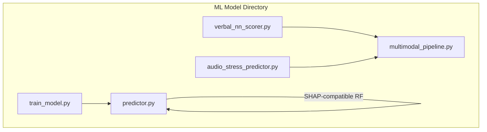
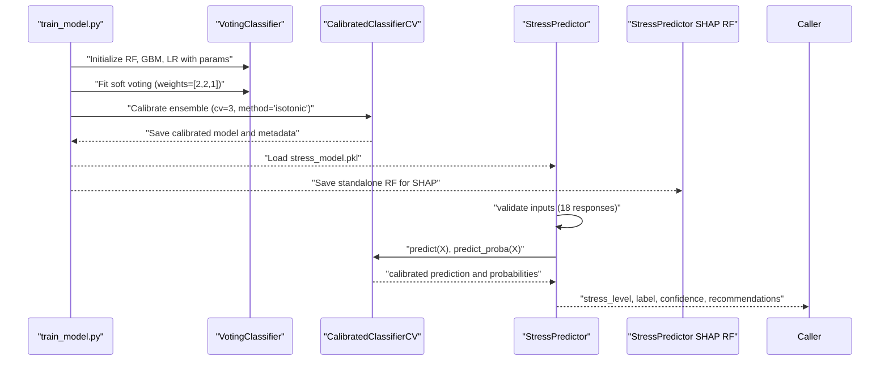
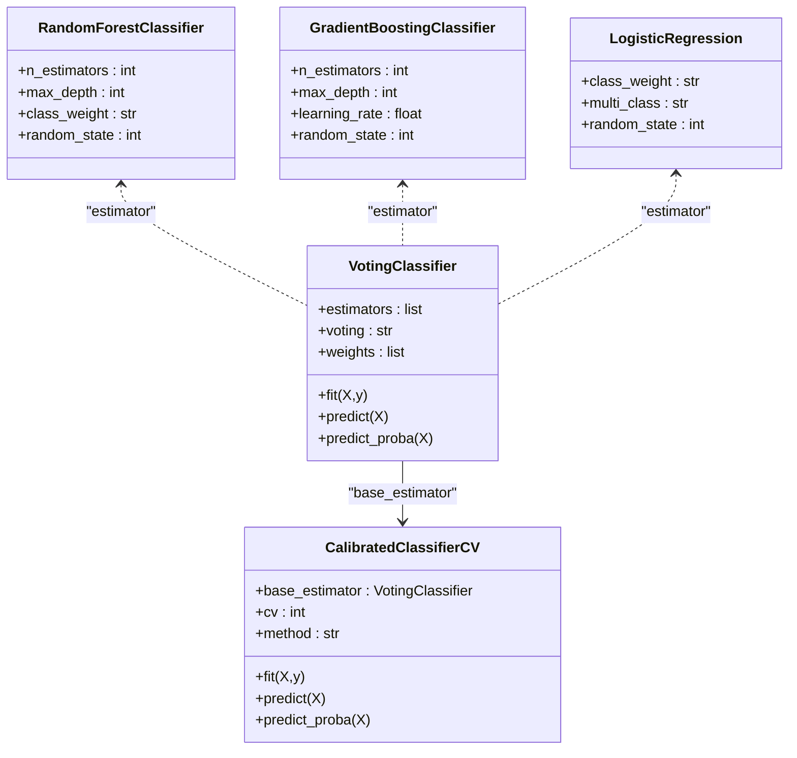
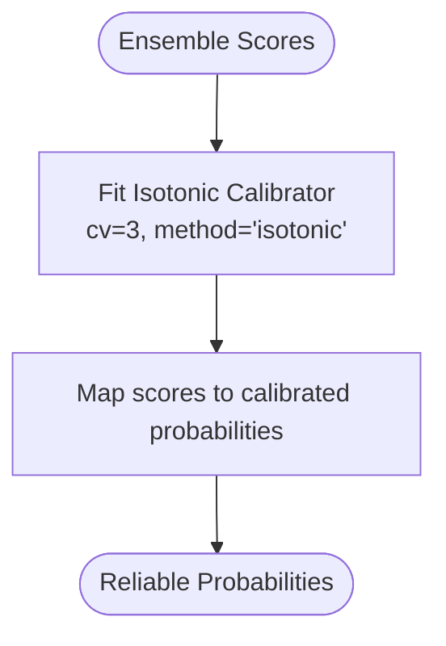
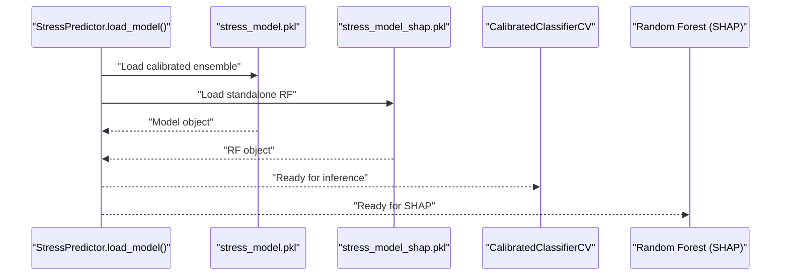
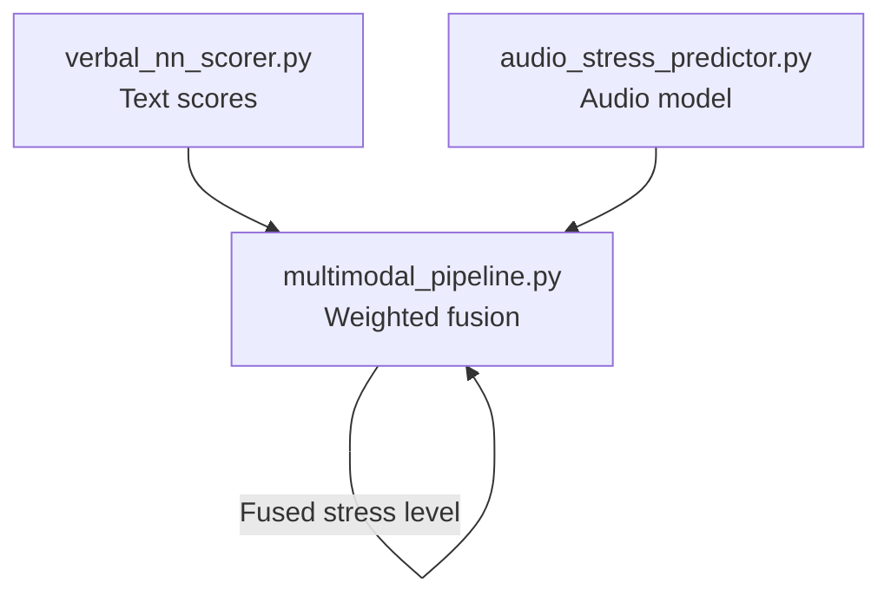
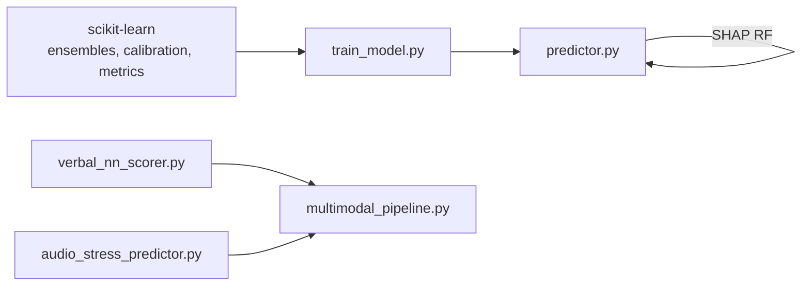

# Algorithm Selection and Configuration

<cite>
**Referenced Files in This Document**
- [train_model.py](file://backend/ml_model/train_model.py)
- [predictor.py](file://backend/ml_model/predictor.py)
- [multimodal_pipeline.py](file://backend/ml_model/multimodal_pipeline.py)
- [audio_stress_predictor.py](file://backend/ml_model/audio_stress_predictor.py)
- [verbal_nn_scorer.py](file://backend/ml_model/verbal_nn_scorer.py)
- [README.md](file://README.md)
</cite>

## Table of Contents
1. [Introduction](#introduction)
2. [Project Structure](#project-structure)
3. [Core Components](#core-components)
4. [Architecture Overview](#architecture-overview)
5. [Detailed Component Analysis](#detailed-component-analysis)
6. [Dependency Analysis](#dependency-analysis)
7. [Performance Considerations](#performance-considerations)
8. [Troubleshooting Guide](#troubleshooting-guide)
9. [Conclusion](#conclusion)

## Introduction
This document explains the algorithm selection and configuration system used for stress level prediction. The system employs a three-base estimator architecture composed of Random Forest, Gradient Boosting, and Logistic Regression, combined via soft voting with custom weights favoring tree-based models. The ensemble is calibrated using Isotonic calibration to produce well-calibrated probabilities. We also describe the rationale behind hyperparameter choices, initialization parameters, and how calibration improves reliability for downstream applications such as explainability and risk assessment.

## Project Structure
The machine learning components are organized under backend/ml_model:
- Training and inference for the questionnaire-based model
- Multimodal fusion integrating text, audio, and auxiliary signals
- Audio stress predictor and verbal neural network scorer for complementary modalities

**Diagram sources**
- [train_model.py:79-191](file://backend/ml_model/train_model.py#L79-L191)
- [predictor.py:32-118](file://backend/ml_model/predictor.py#L32-L118)
- [multimodal_pipeline.py:11-183](file://backend/ml_model/multimodal_pipeline.py#L11-L183)
- [audio_stress_predictor.py:13-157](file://backend/ml_model/audio_stress_predictor.py#L13-L157)
- [verbal_nn_scorer.py:12-151](file://backend/ml_model/verbal_nn_scorer.py#L12-L151)

**Section sources**
- [README.md:719-760](file://README.md#L719-L760)

## Core Components
- Three-base estimators:
  - Random Forest: 150 estimators, max_depth=12, balanced class weights
  - Gradient Boosting: 150 estimators, max_depth=6, learning_rate=0.1
  - Logistic Regression: balanced class weights, multinomial multi_class
- Soft voting ensemble with weights [2, 2, 1] favoring Random Forest and Gradient Boosting
- Isotonic calibration via CalibratedClassifierCV with CV folds=3

These components are orchestrated during training and used for inference in the StressPredictor class.

**Section sources**
- [train_model.py:94-117](file://backend/ml_model/train_model.py#L94-L117)
- [predictor.py:32-46](file://backend/ml_model/predictor.py#L32-L46)

## Architecture Overview
The system trains a calibrated ensemble and exposes a predictor interface. The multimodal pipeline integrates the trained model with audio and textual signals.

**Diagram sources**
- [train_model.py:79-191](file://backend/ml_model/train_model.py#L79-L191)
- [predictor.py:119-144](file://backend/ml_model/predictor.py#L119-L144)

## Detailed Component Analysis

### Three-Base Estimator Architecture and Ensemble Configuration
- Random Forest
  - 150 estimators, max_depth=12, balanced class weights
  - Provides robustness, handles non-linear relationships, and offers feature importance
- Gradient Boosting
  - 150 estimators, max_depth=6, learning_rate=0.1
  - Strong predictive power for tabular data with controlled depth
- Logistic Regression
  - Balanced class weights, multinomial multi_class
  - Linear decision boundaries with probabilistic outputs suitable for calibration
- Ensemble
  - Soft voting with weights [2, 2, 1] to emphasize tree-based models
  - Improves generalization and reduces variance compared to individual models

**Diagram sources**
- [train_model.py:94-117](file://backend/ml_model/train_model.py#L94-L117)

**Section sources**
- [train_model.py:94-117](file://backend/ml_model/train_model.py#L94-L117)

### Calibration with Isotonic Regression
- The ensemble is wrapped in CalibratedClassifierCV with cv=3 and method="isotonic"
- Isotonic calibration fits a non-decreasing function to map ensemble scores to well-calibrated probabilities
- Improves reliability of predicted probabilities for downstream tasks like SHAP explanations and risk scoring

**Diagram sources**
- [train_model.py:114-117](file://backend/ml_model/train_model.py#L114-L117)

**Section sources**
- [train_model.py:114-117](file://backend/ml_model/train_model.py#L114-L117)

### Inference Pipeline and Model Persistence
- The trained CalibratedClassifierCV is persisted to stress_model.pkl
- A standalone Random Forest model is saved for SHAP compatibility (TreeExplainer requires a tree-based model)
- Metadata (including ensemble weights, hyperparameters, and performance) is saved to stress_model_meta.json
- StressPredictor loads the model, validates inputs, and returns predictions with confidence and recommendations

**Diagram sources**
- [predictor.py:81-118](file://backend/ml_model/predictor.py#L81-L118)
- [train_model.py:147-188](file://backend/ml_model/train_model.py#L147-L188)

**Section sources**
- [predictor.py:81-118](file://backend/ml_model/predictor.py#L81-L118)
- [train_model.py:147-188](file://backend/ml_model/train_model.py#L147-L188)

### Multimodal Fusion and Complementary Signals
While the questionnaire model uses the three-base ensemble described above, the multimodal pipeline integrates:
- Text scores from a neural network scorer
- Audio stress prediction from a trained audio model
- Auxiliary signals (e.g., speaking rate)
- Weighted fusion with dynamic weights depending on signal reliability

This demonstrates a broader system design that complements the core three-base estimator architecture with additional modalities.

**Diagram sources**
- [verbal_nn_scorer.py:12-151](file://backend/ml_model/verbal_nn_scorer.py#L12-L151)
- [audio_stress_predictor.py:13-157](file://backend/ml_model/audio_stress_predictor.py#L13-L157)
- [multimodal_pipeline.py:11-183](file://backend/ml_model/multimodal_pipeline.py#L11-L183)

**Section sources**
- [multimodal_pipeline.py:74-179](file://backend/ml_model/multimodal_pipeline.py#L74-L179)

## Dependency Analysis
- train_model.py depends on scikit-learn estimators and calibration utilities to construct and persist the ensemble
- predictor.py depends on the persisted model and metadata to perform inference and SHAP-compatible predictions
- multimodal_pipeline.py integrates external predictors (audio_stress_predictor.py, verbal_nn_scorer.py) for fusion

**Diagram sources**
- [train_model.py:7-12](file://backend/ml_model/train_model.py#L7-L12)
- [predictor.py:10, 32-46](file://backend/ml_model/predictor.py#L10,L32-L46)
- [multimodal_pipeline.py:5-6](file://backend/ml_model/multimodal_pipeline.py#L5-L6)

**Section sources**
- [train_model.py:7-12](file://backend/ml_model/train_model.py#L7-L12)
- [predictor.py:10, 32-46](file://backend/ml_model/predictor.py#L10,L32-L46)
- [multimodal_pipeline.py:5-6](file://backend/ml_model/multimodal_pipeline.py#L5-L6)

## Performance Considerations
- Ensemble soft voting with weights [2, 2, 1] emphasizes Random Forest and Gradient Boosting, which tend to generalize well on tabular data and provide reliable probability estimates when calibrated
- Isotonic calibration improves probability reliability, which benefits explainability (SHAP) and risk scoring
- Cross-validation accuracy is reported during training to monitor generalization
- SHAP-compatible Random Forest is preserved separately to enable local interpretability

[No sources needed since this section provides general guidance]

## Troubleshooting Guide
- Model integrity: The predictor validates model hashes against metadata/environment variables and will retrain if integrity fails
- Missing model: On startup, if the model file is absent, the system automatically retrains from the dataset
- Calibration and metadata: Ensure stress_model_meta.json is present and consistent with the persisted model

**Section sources**
- [predictor.py:55-71](file://backend/ml_model/predictor.py#L55-L71)
- [predictor.py:81-96](file://backend/ml_model/predictor.py#L81-L96)
- [train_model.py:157-188](file://backend/ml_model/train_model.py#L157-L188)

## Conclusion
The algorithm selection and configuration system combines three complementary models—Random Forest, Gradient Boosting, and Logistic Regression—into a soft-voting ensemble with Isotonic calibration. The configuration prioritizes tree-based models via custom weights, improves probability reliability, and preserves a SHAP-compatible Random Forest for explainability. This design yields robust, interpretable, and well-calibrated predictions suitable for clinical and user-facing applications.