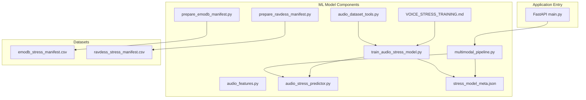
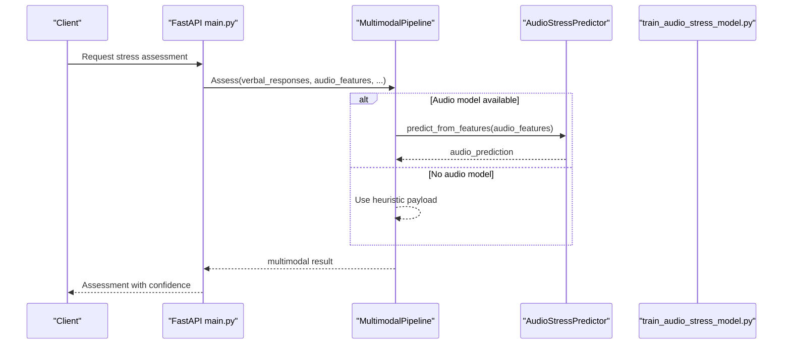
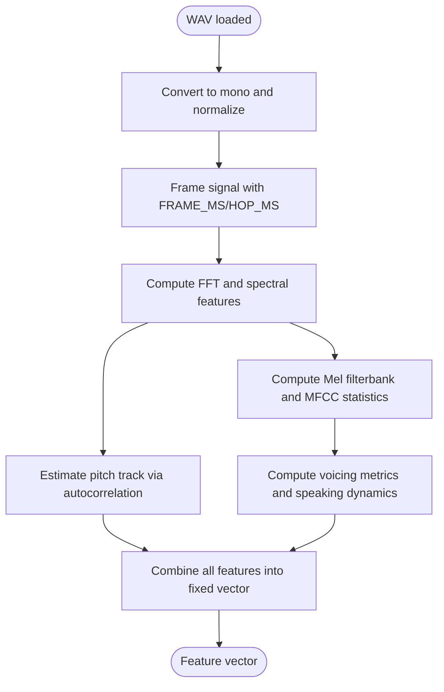
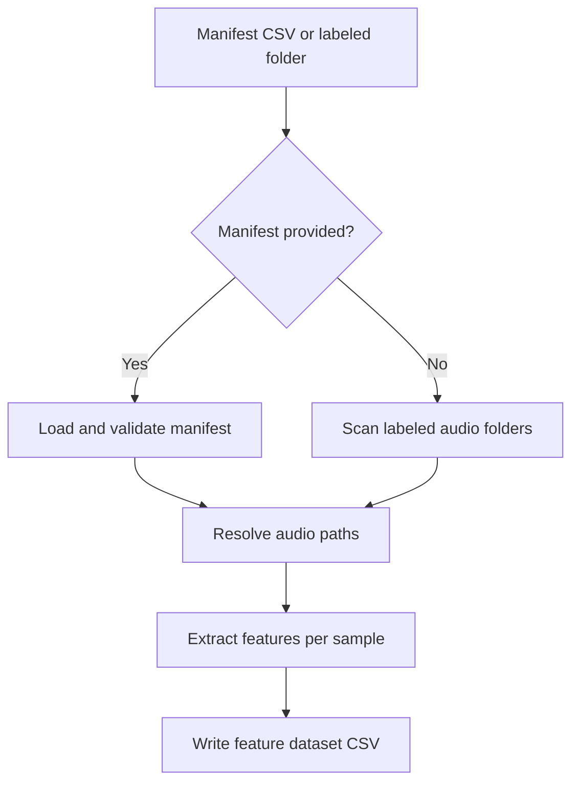
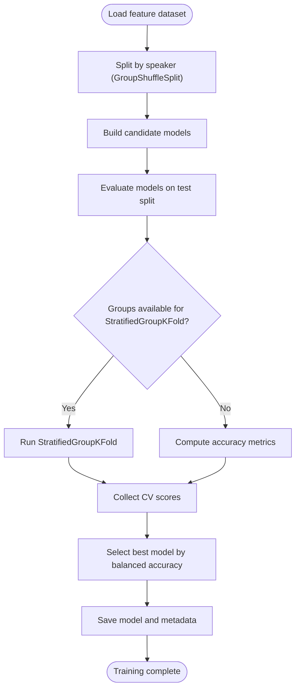
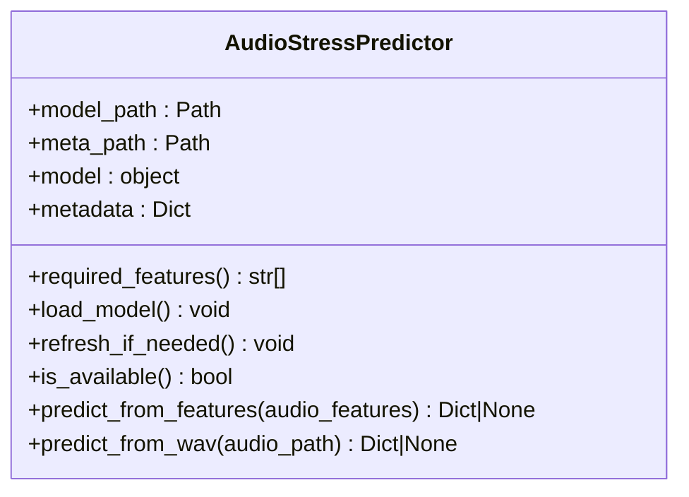
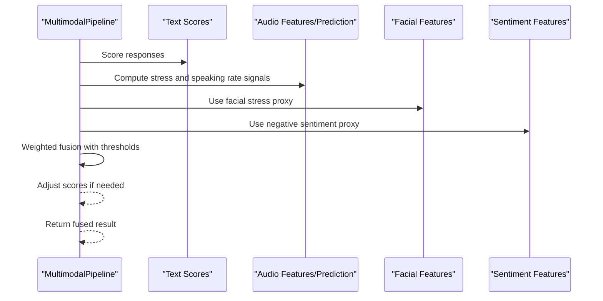
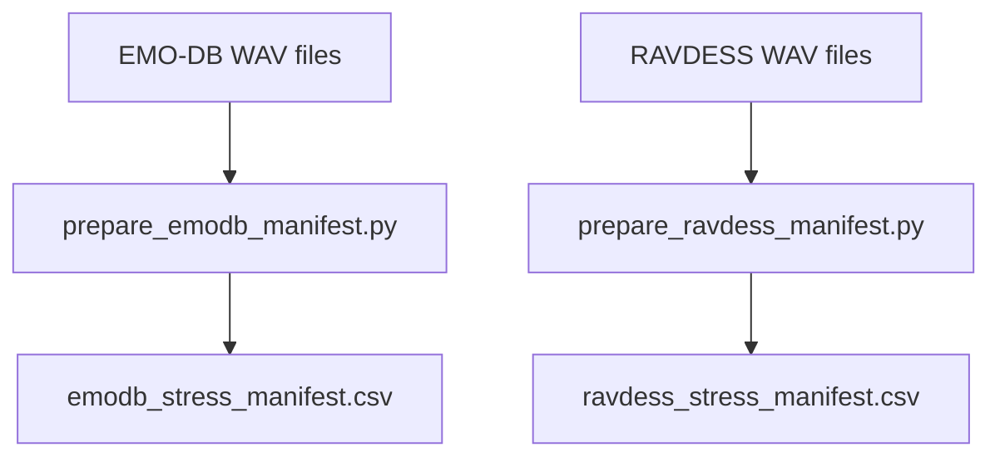
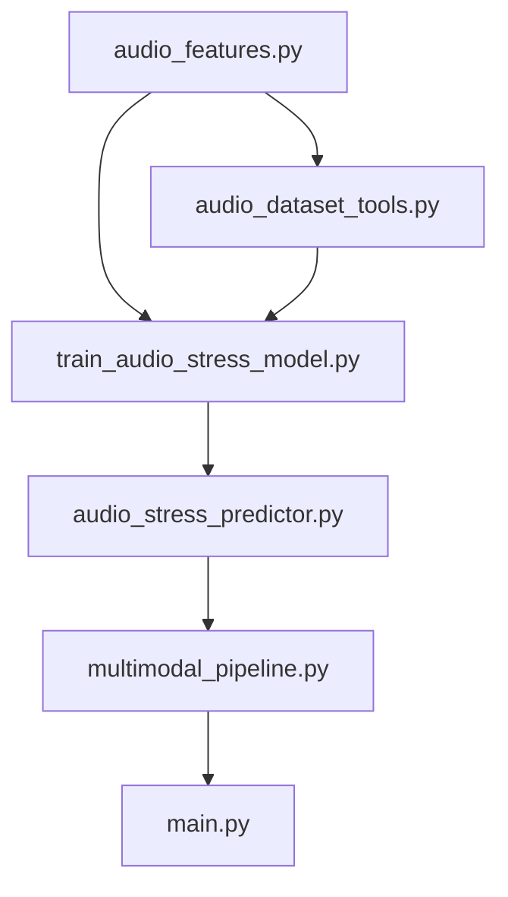

# Audio Model Training

<cite>
**Referenced Files in This Document**
- [main.py](file://backend/app/main.py)
- [train_audio_stress_model.py](file://backend/ml_model/train_audio_stress_model.py)
- [audio_features.py](file://backend/ml_model/audio_features.py)
- [audio_stress_predictor.py](file://backend/ml_model/audio_stress_predictor.py)
- [multimodal_pipeline.py](file://backend/ml_model/multimodal_pipeline.py)
- [audio_dataset_tools.py](file://backend/ml_model/audio_dataset_tools.py)
- [VOICE_STRESS_TRAINING.md](file://backend/ml_model/VOICE_STRESS_TRAINING.md)
- [stress_model_meta.json](file://backend/ml_model/stress_model_meta.json)
- [prepare_emodb_manifest.py](file://backend/ml_model/prepare_emodb_manifest.py)
- [prepare_ravdess_manifest.py](file://backend/ml_model/prepare_ravdess_manifest.py)
- [emodb_stress_manifest.csv](file://backend/ml_model/emodb_stress_manifest.csv)
- [ravdess_stress_manifest.csv](file://backend/ml_model/ravdess_stress_manifest.csv)
</cite>

## Table of Contents
1. [Introduction](#introduction)
2. [Project Structure](#project-structure)
3. [Core Components](#core-components)
4. [Architecture Overview](#architecture-overview)
5. [Detailed Component Analysis](#detailed-component-analysis)
6. [Dependency Analysis](#dependency-analysis)
7. [Performance Considerations](#performance-considerations)
8. [Troubleshooting Guide](#troubleshooting-guide)
9. [Conclusion](#conclusion)

## Introduction
This document describes the audio-based stress detection model training system. It covers the voice stress training pipeline, audio feature extraction processes, model architecture for speech-based stress prediction, integration with the multimodal system, and how audio predictions combine with questionnaire responses. It also documents dataset preparation for audio samples, feature engineering for voice characteristics, training procedures specific to audio-based stress detection, performance comparisons with text-based models, and deployment considerations for audio processing.

## Project Structure
The audio stress detection system resides in the backend/ml_model directory and integrates with the FastAPI application entry point. Key components include:
- Audio feature extraction engine
- Dataset preparation utilities
- Training pipeline for audio stress models
- Prediction interface for audio features
- Multimodal fusion pipeline combining audio, text, and auxiliary signals

**Diagram sources**
- [main.py:1-137](file://backend/app/main.py#L1-L137)
- [train_audio_stress_model.py:1-449](file://backend/ml_model/train_audio_stress_model.py#L1-L449)
- [audio_features.py:1-352](file://backend/ml_model/audio_features.py#L1-L352)
- [audio_stress_predictor.py:1-157](file://backend/ml_model/audio_stress_predictor.py#L1-L157)
- [multimodal_pipeline.py:1-183](file://backend/ml_model/multimodal_pipeline.py#L1-L183)
- [audio_dataset_tools.py:1-292](file://backend/ml_model/audio_dataset_tools.py#L1-L292)
- [prepare_emodb_manifest.py:1-120](file://backend/ml_model/prepare_emodb_manifest.py#L1-L120)
- [prepare_ravdess_manifest.py:1-121](file://backend/ml_model/prepare_ravdess_manifest.py#L1-L121)
- [VOICE_STRESS_TRAINING.md:1-189](file://backend/ml_model/VOICE_STRESS_TRAINING.md#L1-L189)
- [stress_model_meta.json:1-31](file://backend/ml_model/stress_model_meta.json#L1-L31)

**Section sources**
- [main.py:1-137](file://backend/app/main.py#L1-L137)
- [VOICE_STRESS_TRAINING.md:1-189](file://backend/ml_model/VOICE_STRESS_TRAINING.md#L1-L189)

## Core Components
- Audio feature extraction: Extracts robust voice characteristics from WAV files, including energy, spectral features, MFCCs, pitch, jitter/shimmer proxies, and speaking dynamics.
- Dataset preparation: Scans labeled audio folders, builds manifests, and computes tabular features for training.
- Audio stress training: Implements multiple candidate models, cross-validation strategies, and speaker-aware splits.
- Audio predictor: Loads trained models and predicts stress levels from audio features or raw WAV files.
- Multimodal pipeline: Fuses audio, text, and auxiliary signals into a unified stress assessment.

**Section sources**
- [audio_features.py:1-352](file://backend/ml_model/audio_features.py#L1-L352)
- [audio_dataset_tools.py:1-292](file://backend/ml_model/audio_dataset_tools.py#L1-L292)
- [train_audio_stress_model.py:1-449](file://backend/ml_model/train_audio_stress_model.py#L1-L449)
- [audio_stress_predictor.py:1-157](file://backend/ml_model/audio_stress_predictor.py#L1-L157)
- [multimodal_pipeline.py:1-183](file://backend/ml_model/multimodal_pipeline.py#L1-L183)

## Architecture Overview
The system follows a modular pipeline:
- Data ingestion via manifests or direct WAV scanning
- Feature extraction into a standardized feature vector
- Model training with cross-validation and speaker-aware evaluation
- Prediction serving via a predictor interface
- Multimodal fusion combining audio, text, and auxiliary signals

**Diagram sources**
- [main.py:1-137](file://backend/app/main.py#L1-L137)
- [multimodal_pipeline.py:1-183](file://backend/ml_model/multimodal_pipeline.py#L1-L183)
- [audio_stress_predictor.py:1-157](file://backend/ml_model/audio_stress_predictor.py#L1-L157)

## Detailed Component Analysis

### Audio Feature Extraction Engine
The feature extraction module converts raw WAV signals into a fixed-size vector of voice characteristics:
- Signal preprocessing: mono conversion, normalization, framing
- Spectral features: RMS, ZCR, spectral centroid/bandwidth, rolloff, spectral flatness
- MFCCs: Mean and standard deviation for each coefficient, plus Delta coefficients
- Pitch estimation: autocorrelation-based pitch track with local jitter/shimmer proxies
- Voicing and speaking dynamics: voiced/unvoiced ratios, pause ratio, speech turns per second, energy drift

**Diagram sources**
- [audio_features.py:60-352](file://backend/ml_model/audio_features.py#L60-L352)

**Section sources**
- [audio_features.py:1-352](file://backend/ml_model/audio_features.py#L1-L352)

### Dataset Preparation Utilities
The dataset tools support two workflows:
- Manifest-based: scans labeled audio folders and builds a CSV manifest with required fields.
- Feature computation: loads a manifest, resolves audio paths, extracts features, and saves a feature dataset.

Key capabilities:
- Manifest validation and normalization
- Speaker ID inference from file paths
- Robust audio path resolution
- Optional skipping of unreadable files

**Diagram sources**
- [audio_dataset_tools.py:160-238](file://backend/ml_model/audio_dataset_tools.py#L160-L238)

**Section sources**
- [audio_dataset_tools.py:1-292](file://backend/ml_model/audio_dataset_tools.py#L1-L292)

### Audio Stress Training Pipeline
The training pipeline:
- Validates presence of required audio features
- Splits data by speaker to ensure speaker independence
- Evaluates multiple candidate models (Ensemble, SVM, Random Forest, Logistic Regression)
- Computes cross-validation metrics when group structure permits
- Produces a trained model and comprehensive metadata

**Diagram sources**
- [train_audio_stress_model.py:261-417](file://backend/ml_model/train_audio_stress_model.py#L261-L417)

**Section sources**
- [train_audio_stress_model.py:1-449](file://backend/ml_model/train_audio_stress_model.py#L1-L449)

### Audio Stress Predictor
The predictor:
- Loads a trained model and associated metadata
- Validates required features against model configuration
- Supports prediction from pre-extracted features or raw WAV files
- Returns structured results including stress level, confidence, and feature coverage

**Diagram sources**
- [audio_stress_predictor.py:13-157](file://backend/ml_model/audio_stress_predictor.py#L13-L157)

**Section sources**
- [audio_stress_predictor.py:1-157](file://backend/ml_model/audio_stress_predictor.py#L1-L157)

### Multimodal Fusion Pipeline
The multimodal pipeline:
- Normalizes text scores and applies speaking rate heuristics
- Incorporates audio predictions or heuristic payloads
- Fuses signals using adaptive weights based on audio confidence and feature availability
- Adjusts scores when audio indicates elevated stress

**Diagram sources**
- [multimodal_pipeline.py:74-183](file://backend/ml_model/multimodal_pipeline.py#L74-L183)

**Section sources**
- [multimodal_pipeline.py:1-183](file://backend/ml_model/multimodal_pipeline.py#L1-L183)

### Dataset Preparation Scripts and Examples
- EMO-DB stress proxy mapping: Converts emotion codes to stress labels and builds a manifest with speaker splits.
- RAVDESS stress proxy mapping: Maps emotion/intensity combinations to stress labels and builds a manifest with actor splits.
- Example manifests demonstrate the required schema and fields.

**Diagram sources**
- [prepare_emodb_manifest.py:47-103](file://backend/ml_model/prepare_emodb_manifest.py#L47-L103)
- [prepare_ravdess_manifest.py:50-104](file://backend/ml_model/prepare_ravdess_manifest.py#L50-L104)

**Section sources**
- [prepare_emodb_manifest.py:1-120](file://backend/ml_model/prepare_emodb_manifest.py#L1-L120)
- [prepare_ravdess_manifest.py:1-121](file://backend/ml_model/prepare_ravdess_manifest.py#L1-L121)
- [emodb_stress_manifest.csv:1-537](file://backend/ml_model/emodb_stress_manifest.csv#L1-L537)
- [ravdess_stress_manifest.csv:1-1442](file://backend/ml_model/ravdess_stress_manifest.csv#L1-L1442)

## Dependency Analysis
The system exhibits clear module boundaries:
- audio_features.py is imported by audio_dataset_tools.py and train_audio_stress_model.py
- audio_stress_predictor.py depends on trained model artifacts and metadata
- multimodal_pipeline.py depends on audio_stress_predictor and text scoring utilities
- Application entry point (main.py) orchestrates API exposure and routes

**Diagram sources**
- [audio_features.py:1-352](file://backend/ml_model/audio_features.py#L1-L352)
- [audio_dataset_tools.py:1-292](file://backend/ml_model/audio_dataset_tools.py#L1-L292)
- [train_audio_stress_model.py:1-449](file://backend/ml_model/train_audio_stress_model.py#L1-L449)
- [audio_stress_predictor.py:1-157](file://backend/ml_model/audio_stress_predictor.py#L1-L157)
- [multimodal_pipeline.py:1-183](file://backend/ml_model/multimodal_pipeline.py#L1-L183)
- [main.py:1-137](file://backend/app/main.py#L1-L137)

**Section sources**
- [audio_features.py:1-352](file://backend/ml_model/audio_features.py#L1-L352)
- [audio_dataset_tools.py:1-292](file://backend/ml_model/audio_dataset_tools.py#L1-L292)
- [train_audio_stress_model.py:1-449](file://backend/ml_model/train_audio_stress_model.py#L1-L449)
- [audio_stress_predictor.py:1-157](file://backend/ml_model/audio_stress_predictor.py#L1-L157)
- [multimodal_pipeline.py:1-183](file://backend/ml_model/multimodal_pipeline.py#L1-L183)
- [main.py:1-137](file://backend/app/main.py#L1-L137)

## Performance Considerations
- Speaker-aware evaluation: Prefer GroupShuffleSplit and StratifiedGroupKFold when speaker_id is available to avoid leakage.
- Balanced datasets: Ensure equal representation across stress classes to prevent bias.
- Feature completeness: The predictor reports missing features and imputation usage; aim for full feature coverage.
- Cross-validation: Use StratifiedGroupKFold when groups are available; otherwise fall back to StratifiedKFold.
- Accuracy vs balanced accuracy: Prioritize balanced accuracy for speaker-independent evaluation.

[No sources needed since this section provides general guidance]

## Troubleshooting Guide
Common issues and resolutions:
- Missing audio features: Ensure the manifest includes all required features defined by AUDIO_FEATURE_COLUMNS.
- Unreadable audio files: Use skip_failed option in dataset tools to bypass problematic files.
- Speaker-independent evaluation: Verify speaker_id presence and correct splitting strategy.
- Model loading failures: Confirm model and metadata files exist and are readable.
- Multimodal fusion warnings: Review audio confidence and feature coverage to adjust fusion weights.

**Section sources**
- [audio_dataset_tools.py:160-238](file://backend/ml_model/audio_dataset_tools.py#L160-L238)
- [audio_stress_predictor.py:37-72](file://backend/ml_model/audio_stress_predictor.py#L37-L72)
- [train_audio_stress_model.py:357-365](file://backend/ml_model/train_audio_stress_model.py#L357-L365)

## Conclusion
The audio-based stress detection system provides a robust pipeline for extracting voice characteristics, preparing datasets, training speaker-aware models, and integrating audio predictions into a multimodal assessment framework. By following the recommended dataset preparation, feature engineering, and training procedures, teams can achieve reliable speaker-independent performance suitable for production deployment.