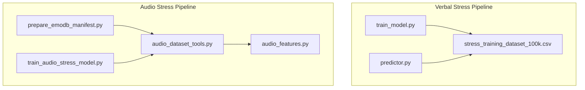
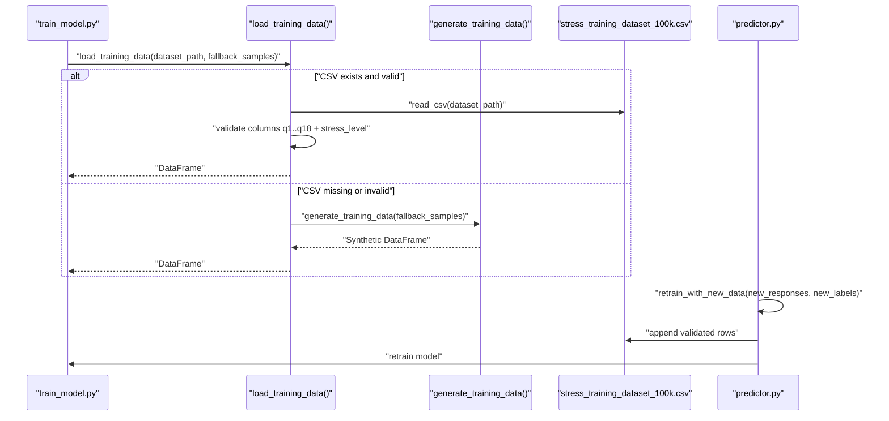
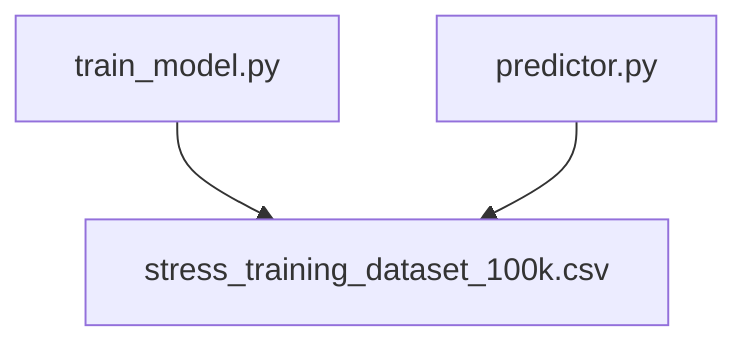

# Data Preparation and Loading

<cite>
**Referenced Files in This Document**
- [train_model.py](file://backend/ml_model/train_model.py)
- [predictor.py](file://backend/ml_model/predictor.py)
- [stress_training_dataset_100k.csv](file://backend/ml_model/stress_training_dataset_100k.csv)
- [audio_dataset_tools.py](file://backend/ml_model/audio_dataset_tools.py)
- [prepare_emodb_manifest.py](file://backend/ml_model/prepare_emodb_manifest.py)
- [train_audio_stress_model.py](file://backend/ml_model/train_audio_stress_model.py)
- [audio_features.py](file://backend/ml_model/audio_features.py)
- [ARCHITECTURE_EXPLAINED.md](file://ARCHITECTURE_EXPLAINED.md)
</cite>

## Table of Contents
1. [Introduction](#introduction)
2. [Project Structure](#project-structure)
3. [Core Components](#core-components)
4. [Architecture Overview](#architecture-overview)
5. [Detailed Component Analysis](#detailed-component-analysis)
6. [Dependency Analysis](#dependency-analysis)
7. [Performance Considerations](#performance-considerations)
8. [Troubleshooting Guide](#troubleshooting-guide)
9. [Conclusion](#conclusion)

## Introduction
This document explains the data preparation and loading system for the AI Stress Detector’s verbal stress detection pipeline. It focuses on the load_training_data function that supports both real CSV datasets and synthetic data generation, the expected feature column structure (q1–q18) and target variable encoding for stress levels (0–3), the fallback mechanism when external datasets are unavailable, and the validation and error handling procedures. It also covers examples of custom dataset formatting and integration with the training pipeline.

## Project Structure
The data preparation and loading system spans several modules:
- Verbal stress training and inference: train_model.py, predictor.py, stress_training_dataset_100k.csv
- Audio stress dataset preparation: audio_dataset_tools.py, prepare_emodb_manifest.py, train_audio_stress_model.py, audio_features.py
- Architectural context: ARCHITECTURE_EXPLAINED.md

**Diagram sources**
- [train_model.py:1-195](file://backend/ml_model/train_model.py#L1-L195)
- [predictor.py:1-590](file://backend/ml_model/predictor.py#L1-L590)
- [stress_training_dataset_100k.csv:1-200](file://backend/ml_model/stress_training_dataset_100k.csv#L1-L200)
- [audio_dataset_tools.py:1-292](file://backend/ml_model/audio_dataset_tools.py#L1-L292)
- [prepare_emodb_manifest.py:1-120](file://backend/ml_model/prepare_emodb_manifest.py#L1-L120)
- [train_audio_stress_model.py:137-307](file://backend/ml_model/train_audio_stress_model.py#L137-L307)
- [audio_features.py:1-57](file://backend/ml_model/audio_features.py#L1-L57)

**Section sources**
- [train_model.py:1-195](file://backend/ml_model/train_model.py#L1-L195)
- [predictor.py:1-590](file://backend/ml_model/predictor.py#L1-L590)
- [stress_training_dataset_100k.csv:1-200](file://backend/ml_model/stress_training_dataset_100k.csv#L1-L200)
- [audio_dataset_tools.py:1-292](file://backend/ml_model/audio_dataset_tools.py#L1-L292)
- [prepare_emodb_manifest.py:1-120](file://backend/ml_model/prepare_emodb_manifest.py#L1-L120)
- [train_audio_stress_model.py:137-307](file://backend/ml_model/train_audio_stress_model.py#L137-L307)
- [audio_features.py:1-57](file://backend/ml_model/audio_features.py#L1-L57)
- [ARCHITECTURE_EXPLAINED.md:194-232](file://ARCHITECTURE_EXPLAINED.md#L194-L232)

## Core Components
- load_training_data: Loads CSV data if present, validates required columns, and falls back to synthetic data when the dataset is missing.
- generate_training_data: Creates synthetic samples with realistic distributions across stress levels and response ranges.
- EXPECTED_FEATURE_COLUMNS and TARGET_COLUMN: Define the canonical feature and target schema for the verbal stress model.
- StressPredictor.retrain_with_new_data: Validates and appends new labeled samples to the training dataset and retrains the model.

Key responsibilities:
- Enforce schema compliance (columns q1–q18 and stress_level).
- Validate data types and value ranges (responses 1–5; stress_level 0–3).
- Provide robust fallback to synthetic data to keep the training pipeline resilient.
- Integrate seamlessly with the training and inference workflows.

**Section sources**
- [train_model.py:14-76](file://backend/ml_model/train_model.py#L14-L76)
- [predictor.py:544-586](file://backend/ml_model/predictor.py#L544-L586)

## Architecture Overview
The data preparation and loading architecture ensures that the training pipeline can operate with either a real dataset or synthetic data. The predictor can also append new labeled data to the dataset and trigger retraining.

**Diagram sources**
- [train_model.py:54-76](file://backend/ml_model/train_model.py#L54-L76)
- [train_model.py:26-51](file://backend/ml_model/train_model.py#L26-L51)
- [stress_training_dataset_100k.csv:1-200](file://backend/ml_model/stress_training_dataset_100k.csv#L1-L200)
- [predictor.py:544-586](file://backend/ml_model/predictor.py#L544-L586)

## Detailed Component Analysis

### load_training_data Function
Purpose:
- Load training data from a CSV when available.
- Validate that the dataset contains the expected columns.
- Fall back to synthetic data generation if the dataset is missing or invalid.

Behavior:
- If dataset_path exists, read CSV and validate columns against EXPECTED_FEATURE_COLUMNS + [TARGET_COLUMN].
- Raise an error if any required columns are missing.
- Return the validated DataFrame.
- If the dataset is unavailable, generate synthetic data using generate_training_data with the specified fallback sample count.

Validation and error handling:
- Missing required columns: raises a ValueError with the list of missing columns.
- Nonexistent dataset: prints a fallback message and generates synthetic data.

Integration:
- Called during training to obtain the DataFrame used for X and y splits.
- Used by the predictor’s retraining flow to append new labeled data.

**Section sources**
- [train_model.py:54-76](file://backend/ml_model/train_model.py#L54-L76)
- [train_model.py:14-15](file://backend/ml_model/train_model.py#L14-L15)

### generate_training_data Function
Purpose:
- Generate synthetic training data with realistic distributions across stress levels.

Mechanics:
- Randomly assigns a stress level (0–3) according to predefined class priors.
- Generates 18 responses sampled from ranges appropriate to each stress level, then adds small random noise to mimic real-world variability.
- Ensures responses remain within bounds (1–5) after noise addition.
- Returns a DataFrame with columns q1–q18 and stress_level.

Distribution characteristics:
- Low stress (0): responses mostly in 1–2
- Moderate stress (1): responses mostly in 2–3
- High stress (2): responses mostly in 3–4
- Severe stress (3): responses mostly in 4–5
- Noise ±1 around the base range to simulate realistic variability

**Section sources**
- [train_model.py:26-51](file://backend/ml_model/train_model.py#L26-L51)

### Data Schema and Target Encoding
Schema:
- Features: q1, q2, ..., q18 (18 columns)
- Target: stress_level (integer in {0, 1, 2, 3})
- Example header row and sample row are provided in the dataset file.

Target encoding:
- 0 = Low
- 1 = Moderate
- 2 = High
- 3 = Severe

Validation:
- During loading, the presence of all expected columns is enforced.
- During inference and retraining, response values are constrained to 1–5 and stress labels to 0–3.

**Section sources**
- [train_model.py:14-15](file://backend/ml_model/train_model.py#L14-L15)
- [stress_training_dataset_100k.csv:1-200](file://backend/ml_model/stress_training_dataset_100k.csv#L1-L200)
- [predictor.py:544-567](file://backend/ml_model/predictor.py#L544-L567)
- [ARCHITECTURE_EXPLAINED.md:194-232](file://ARCHITECTURE_EXPLAINED.md#L194-L232)

### Fallback Mechanism and Synthetic Data Generation
Fallback behavior:
- If the dataset file is not found or is invalid, the loader prints a message indicating fallback and generates synthetic data.
- The synthetic generator creates a DataFrame with the expected schema and realistic distributions.

Benefits:
- Keeps the training pipeline operational even when external datasets are unavailable.
- Provides a consistent baseline for model training and evaluation.

**Section sources**
- [train_model.py:72-76](file://backend/ml_model/train_model.py#L72-L76)
- [train_model.py:26-51](file://backend/ml_model/train_model.py#L26-L51)

### Data Validation and Error Handling
Validation steps:
- Column presence: ensure q1–q18 and stress_level are present.
- Response range: enforce 1–5 for all responses.
- Label validity: enforce 0–3 for stress_level.
- Dataset integrity: during model loading, integrity checks compare computed SHA-256 hashes with expected values from metadata or environment variables.

Error handling:
- Missing columns: raises ValueError with the list of missing columns.
- Invalid response values: raises ValueError with a descriptive message.
- Model integrity failure: triggers automatic retraining to replace corrupted pickles.

**Section sources**
- [train_model.py:63-66](file://backend/ml_model/train_model.py#L63-L66)
- [predictor.py:544-567](file://backend/ml_model/predictor.py#L544-L567)
- [predictor.py:73-79](file://backend/ml_model/predictor.py#L73-L79)

### Custom Dataset Formatting and Integration
To integrate a custom dataset:
- Ensure the CSV contains columns q1–q18 and stress_level.
- Responses must be integers from 1 to 5; stress_level must be 0–3.
- Place the CSV in the same directory as the training module or pass the path to load_training_data.
- Optionally, update the dataset filename used by train_stress_model to point to your CSV.

Re-training with new data:
- Use StressPredictor.retrain_with_new_data to append validated labeled rows to the dataset and retrain the model.
- The function validates input shapes, response ranges, and label values before writing to disk and triggering retraining.

**Section sources**
- [train_model.py:79-83](file://backend/ml_model/train_model.py#L79-L83)
- [predictor.py:544-586](file://backend/ml_model/predictor.py#L544-L586)
- [stress_training_dataset_100k.csv:1-200](file://backend/ml_model/stress_training_dataset_100k.csv#L1-L200)

### Audio Stress Dataset Preparation (Supplementary)
While the primary focus is the verbal questionnaire dataset, the audio stress pipeline demonstrates complementary data preparation patterns:
- Manifest creation from labeled audio folders.
- Feature extraction and dataset assembly.
- Explicit train/test split detection and stratification.

These utilities illustrate robust validation, error handling, and reproducible dataset construction that align with the verbal pipeline’s design principles.

**Section sources**
- [audio_dataset_tools.py:64-137](file://backend/ml_model/audio_dataset_tools.py#L64-L137)
- [prepare_emodb_manifest.py:47-102](file://backend/ml_model/prepare_emodb_manifest.py#L47-L102)
- [train_audio_stress_model.py:137-157](file://backend/ml_model/train_audio_stress_model.py#L137-L157)
- [audio_features.py:29-57](file://backend/ml_model/audio_features.py#L29-L57)

## Dependency Analysis
The verbal stress pipeline exhibits clear separation of concerns:
- train_model.py defines the schema, loading, and training logic.
- predictor.py consumes the trained model, validates inputs, and exposes retraining capabilities.
- stress_training_dataset_100k.csv stores the training data and serves as the integration point for both training and retraining.

**Diagram sources**
- [train_model.py:79-83](file://backend/ml_model/train_model.py#L79-L83)
- [predictor.py:544-586](file://backend/ml_model/predictor.py#L544-L586)
- [stress_training_dataset_100k.csv:1-200](file://backend/ml_model/stress_training_dataset_100k.csv#L1-L200)

**Section sources**
- [train_model.py:79-83](file://backend/ml_model/train_model.py#L79-L83)
- [predictor.py:544-586](file://backend/ml_model/predictor.py#L544-L586)
- [stress_training_dataset_100k.csv:1-200](file://backend/ml_model/stress_training_dataset_100k.csv#L1-L200)

## Performance Considerations
- Synthetic data generation is lightweight and deterministic for small fallback sizes; larger fallback counts increase initial overhead.
- Column validation and schema enforcement prevent costly runtime errors and ensure consistent DataFrame shapes for modeling.
- Integrity checks on model pickles avoid performance degradation from corrupted models while maintaining reliability.

## Troubleshooting Guide
Common issues and resolutions:
- Missing required columns in CSV: Ensure q1–q18 and stress_level are present; the loader will raise a ValueError listing missing columns.
- Invalid response values: Verify all responses are integers from 1 to 5; the predictor and retraining routines enforce this constraint.
- Invalid stress labels: Ensure labels are 0–3; mismatches will trigger a ValueError.
- Model integrity failures: If the stored model hash does not match expectations, the predictor will automatically retrain to replace the model.

**Section sources**
- [train_model.py:63-66](file://backend/ml_model/train_model.py#L63-L66)
- [predictor.py:544-567](file://backend/ml_model/predictor.py#L544-L567)
- [predictor.py:73-79](file://backend/ml_model/predictor.py#L73-L79)

## Conclusion
The data preparation and loading system provides a robust, schema-enforced pipeline for training and evaluating the verbal stress detection model. It gracefully handles missing or invalid datasets by generating synthetic data with realistic distributions, validates inputs rigorously, and integrates seamlessly with retraining workflows. These design choices ensure reliability, maintainability, and ease of integration with both real and synthetic datasets.