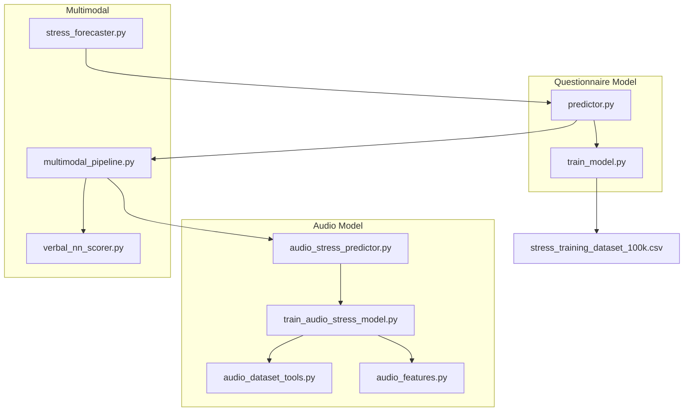
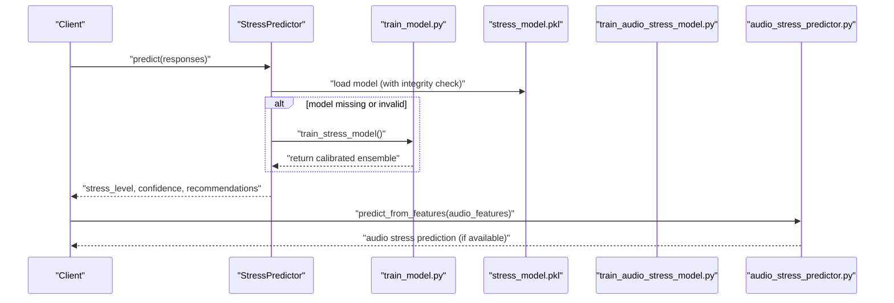
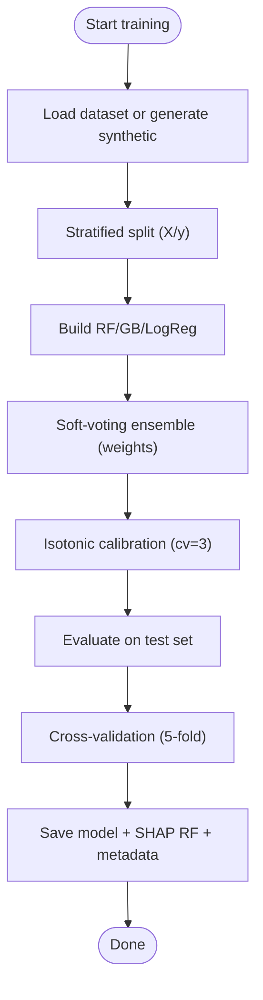
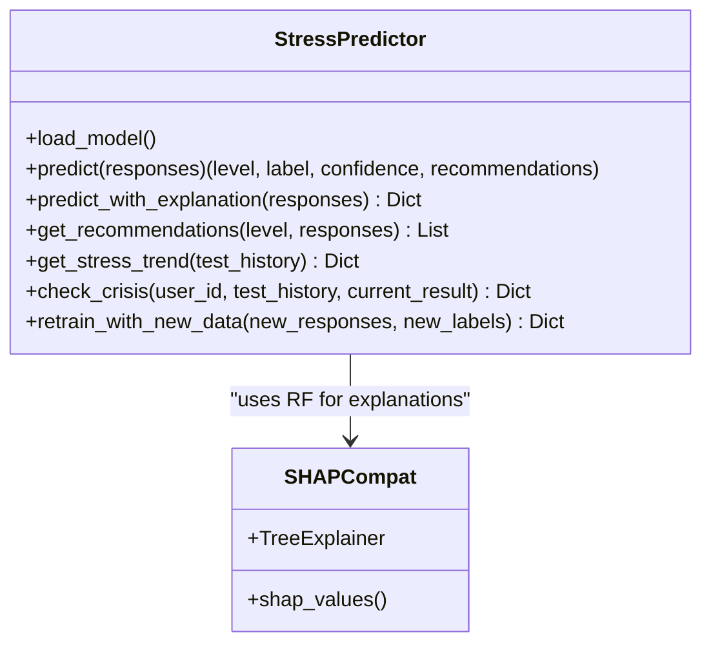
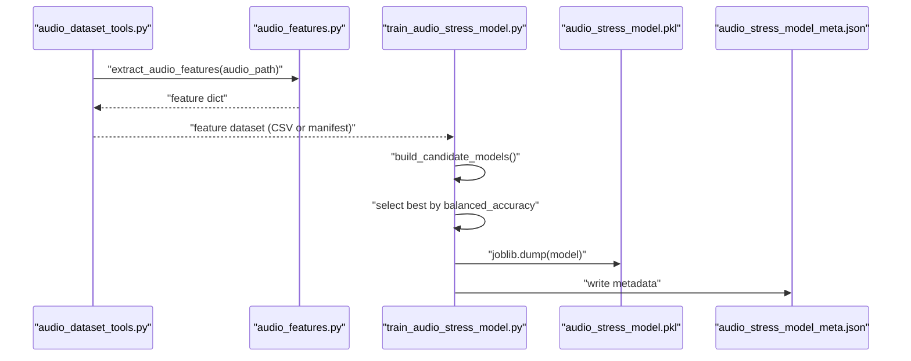
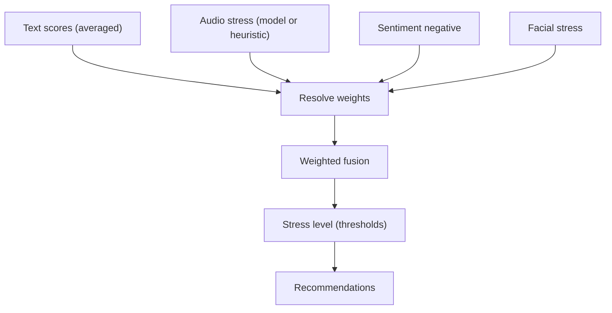
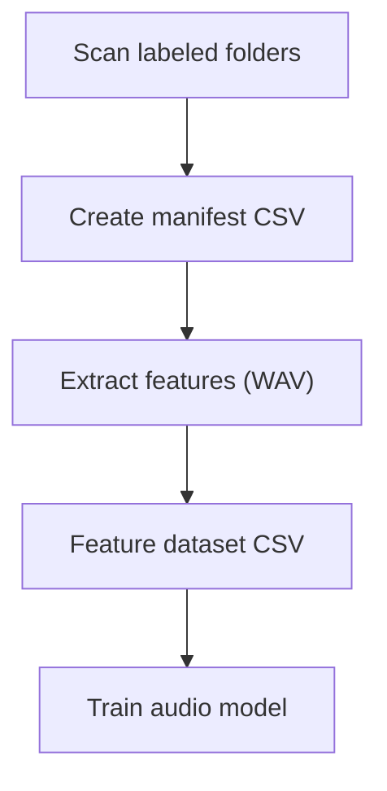
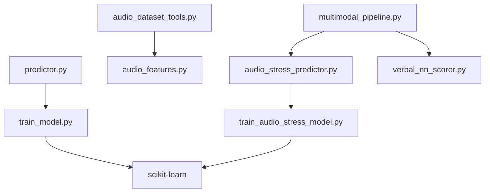

# Model Training

<cite>
**Referenced Files in This Document**
- [train_model.py](file://backend/ml_model/train_model.py)
- [predictor.py](file://backend/ml_model/predictor.py)
- [multimodal_pipeline.py](file://backend/ml_model/multimodal_pipeline.py)
- [audio_features.py](file://backend/ml_model/audio_features.py)
- [audio_dataset_tools.py](file://backend/ml_model/audio_dataset_tools.py)
- [audio_stress_predictor.py](file://backend/ml_model/audio_stress_predictor.py)
- [train_audio_stress_model.py](file://backend/ml_model/train_audio_stress_model.py)
- [stress_training_dataset_100k.csv](file://backend/ml_model/stress_training_dataset_100k.csv)
- [VOICE_STRESS_TRAINING.md](file://backend/ml_model/VOICE_STRESS_TRAINING.md)
- [prepare_emodb_manifest.py](file://backend/ml_model/prepare_emodb_manifest.py)
- [prepare_ravdess_manifest.py](file://backend/ml_model/prepare_ravdess_manifest.py)
- [prepare_daic_woz_manifest.py](file://backend/ml_model/prepare_daic_woz_manifest.py)
- [verbal_nn_scorer.py](file://backend/ml_model/verbal_nn_scorer.py)
- [stress_forecaster.py](file://backend/ml_model/stress_forecaster.py)
</cite>

## Table of Contents
1. [Introduction](#introduction)
2. [Project Structure](#project-structure)
3. [Core Components](#core-components)
4. [Architecture Overview](#architecture-overview)
5. [Detailed Component Analysis](#detailed-component-analysis)
6. [Dependency Analysis](#dependency-analysis)
7. [Performance Considerations](#performance-considerations)
8. [Troubleshooting Guide](#troubleshooting-guide)
9. [Conclusion](#conclusion)
10. [Appendices](#appendices)

## Introduction
This document describes the model training system for the AI Stress Detector. It covers the questionnaire-based Random Forest ensemble, the audio stress classifier, multimodal fusion, and supporting utilities for dataset preparation, training, evaluation, and deployment. It explains training data preparation, cross-validation, class balancing, feature engineering, and automated retraining workflows. It also documents dataset augmentation strategies, model versioning, and performance benchmarking guidance.

## Project Structure
The machine learning training and serving logic resides under backend/ml_model. Key modules include:
- Questionnaire model training and predictor
- Audio feature extraction and training pipeline
- Multimodal fusion and recommendation
- Dataset preparation scripts for public corpora
- Training guide and best practices

**Diagram sources**
- [train_model.py:1-195](file://backend/ml_model/train_model.py#L1-L195)
- [predictor.py:1-590](file://backend/ml_model/predictor.py#L1-L590)
- [multimodal_pipeline.py:1-183](file://backend/ml_model/multimodal_pipeline.py#L1-L183)
- [audio_features.py:1-352](file://backend/ml_model/audio_features.py#L1-L352)
- [audio_dataset_tools.py:1-292](file://backend/ml_model/audio_dataset_tools.py#L1-L292)
- [audio_stress_predictor.py:1-157](file://backend/ml_model/audio_stress_predictor.py#L1-L157)
- [train_audio_stress_model.py:1-449](file://backend/ml_model/train_audio_stress_model.py#L1-L449)
- [stress_training_dataset_100k.csv:1-200](file://backend/ml_model/stress_training_dataset_100k.csv#L1-L200)

**Section sources**
- [train_model.py:1-195](file://backend/ml_model/train_model.py#L1-L195)
- [predictor.py:1-590](file://backend/ml_model/predictor.py#L1-L590)
- [multimodal_pipeline.py:1-183](file://backend/ml_model/multimodal_pipeline.py#L1-L183)
- [audio_features.py:1-352](file://backend/ml_model/audio_features.py#L1-L352)
- [audio_dataset_tools.py:1-292](file://backend/ml_model/audio_dataset_tools.py#L1-L292)
- [audio_stress_predictor.py:1-157](file://backend/ml_model/audio_stress_predictor.py#L1-L157)
- [train_audio_stress_model.py:1-449](file://backend/ml_model/train_audio_stress_model.py#L1-L449)
- [stress_training_dataset_100k.csv:1-200](file://backend/ml_model/stress_training_dataset_100k.csv#L1-L200)

## Core Components
- Questionnaire Random Forest ensemble training and calibration
  - Implements a soft-voting ensemble of Random Forest, Gradient Boosting, and Logistic Regression with probability calibration.
  - Uses stratified splits and cross-validation; saves model artifacts and metadata.
  - Provides SHAP-compatible Random Forest sub-model for explainability.
- Audio stress classifier training
  - Builds feature datasets from manifests or precomputed CSVs.
  - Supports speaker-aware splitting and cross-validation.
  - Compares multiple candidate models and selects the best.
- Multimodal fusion pipeline
  - Fuses text, audio, sentiment, and facial signals into a weighted stress score.
  - Adjusts weights based on audio model confidence and feature coverage.
- Dataset preparation and augmentation
  - Manifest creation from labeled folders and feature extraction.
  - Scripts to prepare public corpora (EMO-DB, RAVDESS, DAIC-WOZ) as stress proxies.
- Automated retraining and versioning
  - Predictor validates model integrity via SHA-256 hashes and auto-retains when needed.
  - Supports adding new labeled data to the questionnaire dataset and retraining.

**Section sources**
- [train_model.py:79-191](file://backend/ml_model/train_model.py#L79-L191)
- [train_audio_stress_model.py:261-417](file://backend/ml_model/train_audio_stress_model.py#L261-L417)
- [multimodal_pipeline.py:11-183](file://backend/ml_model/multimodal_pipeline.py#L11-L183)
- [audio_dataset_tools.py:160-237](file://backend/ml_model/audio_dataset_tools.py#L160-L237)
- [prepare_emodb_manifest.py:47-102](file://backend/ml_model/prepare_emodb_manifest.py#L47-L102)
- [prepare_ravdess_manifest.py:50-103](file://backend/ml_model/prepare_ravdess_manifest.py#L50-L103)
- [prepare_daic_woz_manifest.py:215-337](file://backend/ml_model/prepare_daic_woz_manifest.py#L215-L337)
- [predictor.py:81-118](file://backend/ml_model/predictor.py#L81-L118)

## Architecture Overview
The system comprises two primary pipelines:
- Questionnaire pipeline: trains a calibrated ensemble and exposes a predictor with SHAP explanations.
- Audio pipeline: extracts robust voice features, builds speaker-aware datasets, and trains classifiers with cross-validation.

**Diagram sources**
- [predictor.py:81-144](file://backend/ml_model/predictor.py#L81-L144)
- [train_model.py:79-191](file://backend/ml_model/train_model.py#L79-L191)
- [audio_stress_predictor.py:97-153](file://backend/ml_model/audio_stress_predictor.py#L97-L153)

## Detailed Component Analysis

### Questionnaire Random Forest Ensemble Training
- Data loading and fallback
  - Loads from a large CSV dataset or generates synthetic data when unavailable.
  - Validates required columns and shapes.
- Model definition and training
  - Random Forest, Gradient Boosting, and Logistic Regression with class balancing.
  - Soft-voting ensemble with explicit weights; isotonic probability calibration.
- Evaluation and persistence
  - Stratified train/test split; 5-fold cross-validation; prints classification report.
  - Saves calibrated ensemble and a standalone SHAP-compatible Random Forest.
  - Writes metadata including dataset info, metrics, and feature importances.

**Diagram sources**
- [train_model.py:79-191](file://backend/ml_model/train_model.py#L79-L191)

**Section sources**
- [train_model.py:54-77](file://backend/ml_model/train_model.py#L54-L77)
- [train_model.py:88-134](file://backend/ml_model/train_model.py#L88-L134)
- [train_model.py:147-191](file://backend/ml_model/train_model.py#L147-L191)

### Questionnaire Prediction and Explainability
- Integrity-checked model loading with automatic retraining on failure.
- Prediction returns stress level, confidence, and recommendations.
- SHAP-based explanations using the saved Random Forest sub-model; falls back to feature importances if SHAP is unavailable.
- Category-level scoring and risk factor identification.

**Diagram sources**
- [predictor.py:32-590](file://backend/ml_model/predictor.py#L32-L590)

**Section sources**
- [predictor.py:81-118](file://backend/ml_model/predictor.py#L81-L118)
- [predictor.py:119-185](file://backend/ml_model/predictor.py#L119-L185)
- [predictor.py:187-257](file://backend/ml_model/predictor.py#L187-L257)
- [predictor.py:258-306](file://backend/ml_model/predictor.py#L258-L306)
- [predictor.py:544-586](file://backend/ml_model/predictor.py#L544-L586)

### Audio Feature Extraction and Training Pipeline
- Feature extraction
  - Extracts robust acoustic features from WAV files including energy, spectral, pitch, jitter/shimmer, and speaking dynamics.
- Dataset preparation
  - Manifest scanning from labeled folders and feature dataset generation.
  - Resolves audio paths and supports skipping unreadable files.
- Audio model training
  - Candidate models include ensemble and baselines; selection based on balanced accuracy.
  - Speaker-aware cross-validation when speaker_id is available; otherwise stratified K-Fold.
  - Saves model and comprehensive metadata.

**Diagram sources**
- [audio_dataset_tools.py:160-237](file://backend/ml_model/audio_dataset_tools.py#L160-L237)
- [audio_features.py:261-352](file://backend/ml_model/audio_features.py#L261-L352)
- [train_audio_stress_model.py:261-417](file://backend/ml_model/train_audio_stress_model.py#L261-L417)

**Section sources**
- [audio_features.py:60-94](file://backend/ml_model/audio_features.py#L60-L94)
- [audio_features.py:261-352](file://backend/ml_model/audio_features.py#L261-L352)
- [audio_dataset_tools.py:160-237](file://backend/ml_model/audio_dataset_tools.py#L160-L237)
- [train_audio_stress_model.py:261-417](file://backend/ml_model/train_audio_stress_model.py#L261-L417)

### Multimodal Fusion and Recommendations
- Combines text, audio, sentiment, and facial signals into a fused stress score.
- Adjusts weights based on audio model confidence and feature coverage.
- Provides confidence margins and adjusted scores when audio evidence is strong.

**Diagram sources**
- [multimodal_pipeline.py:74-183](file://backend/ml_model/multimodal_pipeline.py#L74-L183)

**Section sources**
- [multimodal_pipeline.py:11-183](file://backend/ml_model/multimodal_pipeline.py#L11-L183)
- [verbal_nn_scorer.py:121-151](file://backend/ml_model/verbal_nn_scorer.py#L121-L151)

### Dataset Preparation and Augmentation
- Manifest creation from labeled folders and feature extraction.
- Public corpus preparation:
  - EMO-DB: emotion-to-stress proxy mapping with speaker splits.
  - RAVDESS: emotion-intensity-to-stress proxy mapping.
  - DAIC-WOZ: PHQ-derived stress labels with participant segment extraction.

**Diagram sources**
- [audio_dataset_tools.py:64-137](file://backend/ml_model/audio_dataset_tools.py#L64-L137)
- [prepare_emodb_manifest.py:47-102](file://backend/ml_model/prepare_emodb_manifest.py#L47-L102)
- [prepare_ravdess_manifest.py:50-103](file://backend/ml_model/prepare_ravdess_manifest.py#L50-L103)
- [prepare_daic_woz_manifest.py:215-337](file://backend/ml_model/prepare_daic_woz_manifest.py#L215-L337)

**Section sources**
- [audio_dataset_tools.py:64-137](file://backend/ml_model/audio_dataset_tools.py#L64-L137)
- [prepare_emodb_manifest.py:47-102](file://backend/ml_model/prepare_emodb_manifest.py#L47-L102)
- [prepare_ravdess_manifest.py:50-103](file://backend/ml_model/prepare_ravdess_manifest.py#L50-L103)
- [prepare_daic_woz_manifest.py:215-337](file://backend/ml_model/prepare_daic_woz_manifest.py#L215-L337)

## Dependency Analysis
- Cohesion and coupling
  - Questionnaire and audio pipelines are decoupled; each manages its own training, persistence, and prediction.
  - Multimodal pipeline depends on audio predictor and text scorer.
- External dependencies
  - Scikit-learn ensembles, calibration, cross-validation, and pipelines.
  - Joblib and Pickle for model persistence.
  - Pandas and NumPy for data manipulation and numerical routines.

**Diagram sources**
- [train_model.py:8-12](file://backend/ml_model/train_model.py#L8-L12)
- [train_audio_stress_model.py:10-18](file://backend/ml_model/train_audio_stress_model.py#L10-L18)
- [audio_dataset_tools.py:9-12](file://backend/ml_model/audio_dataset_tools.py#L9-L12)
- [audio_features.py:1-10](file://backend/ml_model/audio_features.py#L1-L10)
- [audio_stress_predictor.py:7-10](file://backend/ml_model/audio_stress_predictor.py#L7-L10)
- [multimodal_pipeline.py:5-6](file://backend/ml_model/multimodal_pipeline.py#L5-L6)
- [verbal_nn_scorer.py:7-9](file://backend/ml_model/verbal_nn_scorer.py#L7-L9)

**Section sources**
- [train_model.py:8-12](file://backend/ml_model/train_model.py#L8-L12)
- [train_audio_stress_model.py:10-18](file://backend/ml_model/train_audio_stress_model.py#L10-L18)
- [audio_dataset_tools.py:9-12](file://backend/ml_model/audio_dataset_tools.py#L9-L12)
- [audio_features.py:1-10](file://backend/ml_model/audio_features.py#L1-L10)
- [audio_stress_predictor.py:7-10](file://backend/ml_model/audio_stress_predictor.py#L7-L10)
- [multimodal_pipeline.py:5-6](file://backend/ml_model/multimodal_pipeline.py#L5-L6)
- [verbal_nn_scorer.py:7-9](file://backend/ml_model/verbal_nn_scorer.py#L7-L9)

## Performance Considerations
- Cross-validation and evaluation
  - Use stratified splits and cross-validation to avoid class imbalance bias.
  - Prefer balanced accuracy and confusion matrices for audio models; accuracy alone can be misleading.
- Speaker-aware evaluation
  - When speaker_id is available, prefer speaker-independent splits and cross-validation to reflect real-world generalization.
- Calibration
  - Isotonic calibration improves probability reliability for downstream fusion and thresholds.
- Feature engineering
  - Hand-crafted voice features are robust baselines; consider augmenting with embeddings and transcripts for richer audio modeling.
- Class balancing
  - Use class_weight strategies in tree-based models; consider oversampling or synthetic augmentation if severe class is underrepresented.

[No sources needed since this section provides general guidance]

## Troubleshooting Guide
- Model integrity failures
  - The predictor checks SHA-256 hashes against metadata and environment variables; on mismatch, it triggers retraining.
- Missing or corrupted audio
  - The audio dataset tools can skip unreadable files; inspect logs for skipped samples and fix corrupted recordings.
- Manifest validation
  - Required columns and label consistency are enforced; mismatches raise explicit errors.
- Metadata completeness
  - Ensure metadata includes feature lists, model type, and selected model name for proper predictor behavior.

**Section sources**
- [predictor.py:55-71](file://backend/ml_model/predictor.py#L55-L71)
- [predictor.py:88-96](file://backend/ml_model/predictor.py#L88-L96)
- [audio_dataset_tools.py:112-137](file://backend/ml_model/audio_dataset_tools.py#L112-L137)
- [audio_dataset_tools.py:177-184](file://backend/ml_model/audio_dataset_tools.py#L177-L184)

## Conclusion
The system integrates a calibrated questionnaire ensemble with a speaker-aware audio classifier and a multimodal fusion pipeline. Robust dataset preparation, cross-validation, and integrity-checked model persistence enable reliable deployment. The training guide emphasizes realistic accuracy targets and speaker-independent evaluation for credible performance.

[No sources needed since this section summarizes without analyzing specific files]

## Appendices

### Training Data Preparation from the 100K+ Sample Dataset
- The questionnaire training loads from a large CSV with 18 features and a stress level target.
- If the dataset is missing, the system generates synthetic samples with realistic distributions.

**Section sources**
- [stress_training_dataset_100k.csv:1-200](file://backend/ml_model/stress_training_dataset_100k.csv#L1-L200)
- [train_model.py:54-77](file://backend/ml_model/train_model.py#L54-L77)

### Cross-Validation Procedures
- Questionnaire model: 5-fold cross-validation on the full dataset after ensemble training.
- Audio model: Attempts speaker-aware StratifiedGroupKFold when sufficient speakers exist; otherwise falls back to StratifiedKFold.

**Section sources**
- [train_model.py:122-124](file://backend/ml_model/train_model.py#L122-L124)
- [train_audio_stress_model.py:188-232](file://backend/ml_model/train_audio_stress_model.py#L188-L232)

### Ensemble Architecture and Hyperparameters
- Ensemble: Random Forest + Gradient Boosting + Logistic Regression with soft voting and weights.
- Calibration: Isotonic calibration with 3-fold CV.
- Class balancing: Applied in tree-based models; logistic regression uses balanced class weights.

**Section sources**
- [train_model.py:95-111](file://backend/ml_model/train_model.py#L95-L111)
- [train_model.py:114-117](file://backend/ml_model/train_model.py#L114-L117)

### Feature Engineering and Target Encoding
- Audio features: Energy, spectral, pitch, jitter/shimmer, pause/voiced ratios, speaking turn density.
- Target encoding: Stress labels mapped to numeric levels; manifests enforce label consistency.

**Section sources**
- [audio_features.py:29-57](file://backend/ml_model/audio_features.py#L29-L57)
- [audio_dataset_tools.py:14-19](file://backend/ml_model/audio_dataset_tools.py#L14-L19)
- [audio_dataset_tools.py:121-132](file://backend/ml_model/audio_dataset_tools.py#L121-L132)

### Class Balancing Strategies
- Tree-based models: Use balanced or balanced_subsample class weights.
- Logistic Regression: Balanced class weights.
- Dataset augmentation: Add new labeled samples to the questionnaire dataset and retrain.

**Section sources**
- [train_model.py:96-103](file://backend/ml_model/train_model.py#L96-L103)
- [train_audio_stress_model.py:39-77](file://backend/ml_model/train_audio_stress_model.py#L39-L77)
- [predictor.py:544-586](file://backend/ml_model/predictor.py#L544-L586)

### Training Pipeline Configuration
- Audio training accepts either a manifest CSV or a precomputed feature CSV.
- Supports speaker-aware splitting and cross-validation; saves model and metadata.

**Section sources**
- [train_audio_stress_model.py:261-286](file://backend/ml_model/train_audio_stress_model.py#L261-L286)
- [train_audio_stress_model.py:292-364](file://backend/ml_model/train_audio_stress_model.py#L292-L364)

### Hyperparameter Tuning
- The audio trainer compares multiple candidate models and selects the best based on balanced accuracy.
- Manual tuning can adjust estimator parameters and preprocessing pipelines.

**Section sources**
- [train_audio_stress_model.py:86-134](file://backend/ml_model/train_audio_stress_model.py#L86-L134)
- [train_audio_stress_model.py:309-333](file://backend/ml_model/train_audio_stress_model.py#L309-L333)

### Performance Evaluation Metrics
- Questionnaire: Test accuracy, 5-fold CV accuracy, classification report, feature importance.
- Audio: Accuracy, balanced accuracy, confusion matrix, cross-validation method note, speaker counts.

**Section sources**
- [train_model.py:120-133](file://backend/ml_model/train_model.py#L120-L133)
- [train_audio_stress_model.py:341-349](file://backend/ml_model/train_audio_stress_model.py#L341-L349)
- [train_audio_stress_model.py:357-416](file://backend/ml_model/train_audio_stress_model.py#L357-L416)

### Data Preprocessing, Outlier Handling, and Validation
- Audio preprocessing: Imputation for missing features in pipelines; robust feature extraction robust to noise.
- Validation: Manifest validation, label consistency checks, and explicit error messages for missing columns.

**Section sources**
- [train_audio_stress_model.py:34-47](file://backend/ml_model/train_audio_stress_model.py#L34-L47)
- [audio_dataset_tools.py:112-137](file://backend/ml_model/audio_dataset_tools.py#L112-L137)

### Automated Retraining Workflow and Model Versioning
- Automatic retraining when model integrity checks fail.
- Model and SHAP model saved with SHA-256 metadata; environment variables can override expected hashes.
- Adding new labeled data updates the dataset and retrains.

**Section sources**
- [predictor.py:81-118](file://backend/ml_model/predictor.py#L81-L118)
- [predictor.py:544-586](file://backend/ml_model/predictor.py#L544-L586)

### Dataset Augmentation Capabilities
- Manifest scanning from labeled folders and feature extraction.
- Public corpus scripts for EMO-DB, RAVDESS, and DAIC-WOZ to bootstrap audio training.

**Section sources**
- [audio_dataset_tools.py:64-137](file://backend/ml_model/audio_dataset_tools.py#L64-L137)
- [prepare_emodb_manifest.py:47-102](file://backend/ml_model/prepare_emodb_manifest.py#L47-L102)
- [prepare_ravdess_manifest.py:50-103](file://backend/ml_model/prepare_ravdess_manifest.py#L50-L103)
- [prepare_daic_woz_manifest.py:215-337](file://backend/ml_model/prepare_daic_woz_manifest.py#L215-L337)

### Model Versioning
- Metadata includes model type, feature lists, random state, and SHA-256 hashes for integrity verification.

**Section sources**
- [train_model.py:160-184](file://backend/ml_model/train_model.py#L160-L184)
- [train_audio_stress_model.py:370-401](file://backend/ml_model/train_audio_stress_model.py#L370-L401)

### Examples of Custom Training Scenarios
- Train audio model directly from a manifest or a precomputed feature CSV.
- Use the training guide’s recommended folder layout and manifest fields for robust pipelines.

**Section sources**
- [train_audio_stress_model.py:261-286](file://backend/ml_model/train_audio_stress_model.py#L261-L286)
- [VOICE_STRESS_TRAINING.md:112-147](file://backend/ml_model/VOICE_STRESS_TRAINING.md#L112-L147)

### Performance Benchmarking
- Realistic accuracy targets emphasize speaker-independent evaluation and balanced datasets.
- The training guide outlines recommended dataset sizes and best practices for credible benchmarks.

**Section sources**
- [VOICE_STRESS_TRAINING.md:17-26](file://backend/ml_model/VOICE_STRESS_TRAINING.md#L17-L26)
- [VOICE_STRESS_TRAINING.md:180-189](file://backend/ml_model/VOICE_STRESS_TRAINING.md#L180-L189)