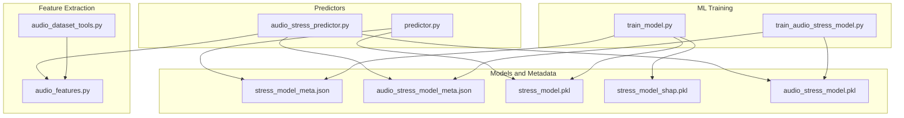
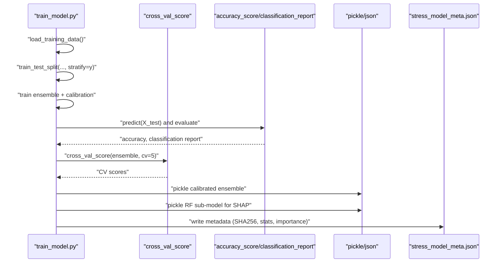
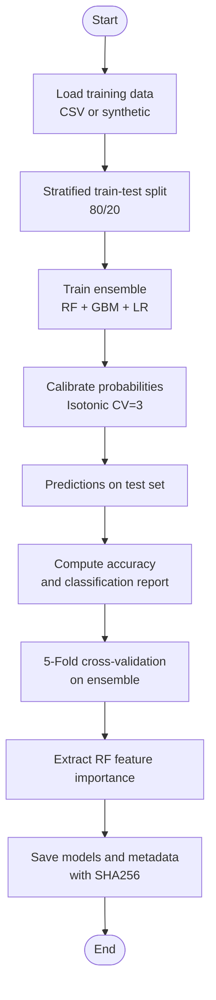
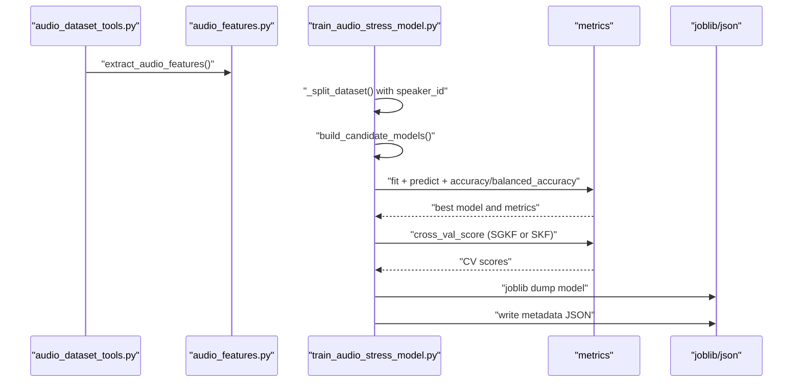
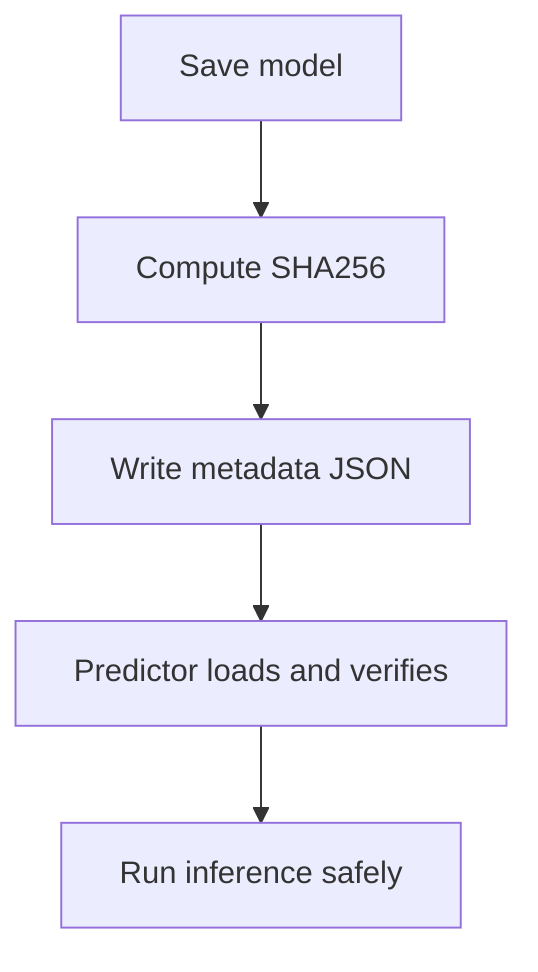
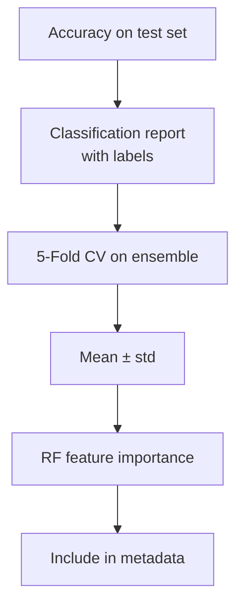
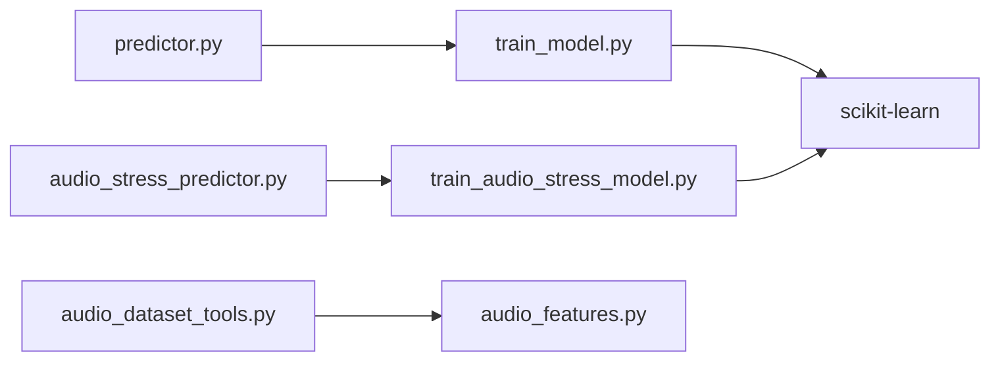

# Training Process and Evaluation

<cite>
**Referenced Files in This Document**
- [train_model.py](file://backend/ml_model/train_model.py)
- [predictor.py](file://backend/ml_model/predictor.py)
- [audio_stress_predictor.py](file://backend/ml_model/audio_stress_predictor.py)
- [audio_features.py](file://backend/ml_model/audio_features.py)
- [audio_dataset_tools.py](file://backend/ml_model/audio_dataset_tools.py)
- [train_audio_stress_model.py](file://backend/ml_model/train_audio_stress_model.py)
- [stress_model_meta.json](file://backend/ml_model/stress_model_meta.json)
- [audio_stress_model_meta.json](file://backend/ml_model/audio_stress_model_meta.json)
- [README.md](file://README.md)
</cite>

## Table of Contents
1. [Introduction](#introduction)
2. [Project Structure](#project-structure)
3. [Core Components](#core-components)
4. [Architecture Overview](#architecture-overview)
5. [Detailed Component Analysis](#detailed-component-analysis)
6. [Dependency Analysis](#dependency-analysis)
7. [Performance Considerations](#performance-considerations)
8. [Troubleshooting Guide](#troubleshooting-guide)
9. [Conclusion](#conclusion)

## Introduction
This document explains the complete training process and evaluation methodology for the AI Stress Detector’s machine learning components. It covers:
- Stratified train-test split procedures
- Cross-validation strategies and accuracy scoring
- Performance metrics computation (including classification reports with stress level labels)
- Model saving and integrity verification via SHA256 checksums
- Feature importance extraction from Random Forest
- Training data statistics and model metadata generation

Two complementary models are covered:
- A questionnaire-based Random Forest model for CBT-style question responses
- An audio-based model for voice stress detection using engineered acoustic features

## Project Structure
The machine learning pipeline resides under backend/ml_model and includes training scripts, predictors, and supporting utilities for audio feature extraction and dataset preparation.

**Diagram sources**
- [train_model.py:79-190](file://backend/ml_model/train_model.py#L79-L190)
- [train_audio_stress_model.py:261-416](file://backend/ml_model/train_audio_stress_model.py#L261-L416)
- [predictor.py:32-118](file://backend/ml_model/predictor.py#L32-L118)
- [audio_stress_predictor.py:13-157](file://backend/ml_model/audio_stress_predictor.py#L13-L157)
- [audio_features.py:29-57](file://backend/ml_model/audio_features.py#L29-L57)
- [audio_dataset_tools.py:160-237](file://backend/ml_model/audio_dataset_tools.py#L160-L237)

**Section sources**
- [README.md:698-760](file://README.md#L698-L760)

## Core Components
- Questionnaire-based training and evaluation pipeline
- Audio-based training and evaluation pipeline with speaker-aware splits
- Predictors for inference and explainability
- Feature extraction utilities for audio models
- Model persistence and metadata generation with integrity checks

**Section sources**
- [train_model.py:79-190](file://backend/ml_model/train_model.py#L79-L190)
- [train_audio_stress_model.py:261-416](file://backend/ml_model/train_audio_stress_model.py#L261-L416)
- [predictor.py:32-118](file://backend/ml_model/predictor.py#L32-L118)
- [audio_stress_predictor.py:13-157](file://backend/ml_model/audio_stress_predictor.py#L13-L157)
- [audio_features.py:29-57](file://backend/ml_model/audio_features.py#L29-L57)
- [audio_dataset_tools.py:160-237](file://backend/ml_model/audio_dataset_tools.py#L160-L237)

## Architecture Overview
The training and evaluation architecture integrates data loading, preprocessing, model training, cross-validation, evaluation, and persistence.

**Diagram sources**
- [train_model.py:88-156](file://backend/ml_model/train_model.py#L88-L156)
- [train_model.py:122-133](file://backend/ml_model/train_model.py#L122-L133)
- [train_model.py:160-184](file://backend/ml_model/train_model.py#L160-L184)

## Detailed Component Analysis

### Questionnaire-Based Training and Evaluation
- Data loading with fallback to synthetic data
- Stratified 80/20 train-test split
- Ensemble training (Random Forest + Gradient Boosting + Logistic Regression) with soft voting
- Probability calibration via isotonic calibration
- 5-fold cross-validation on the base ensemble
- Classification report with stress labels: Low, Moderate, High, Severe
- Feature importance from the Random Forest sub-model
- Model saving: calibrated ensemble pickle and standalone RF for SHAP
- Integrity verification via SHA256 checksums
- Metadata generation with training statistics and model parameters

**Diagram sources**
- [train_model.py:79-190](file://backend/ml_model/train_model.py#L79-L190)

**Section sources**
- [train_model.py:54-76](file://backend/ml_model/train_model.py#L54-L76)
- [train_model.py:88-90](file://backend/ml_model/train_model.py#L88-L90)
- [train_model.py:105-117](file://backend/ml_model/train_model.py#L105-L117)
- [train_model.py:119-133](file://backend/ml_model/train_model.py#L119-L133)
- [train_model.py:122-127](file://backend/ml_model/train_model.py#L122-L127)
- [train_model.py:135-145](file://backend/ml_model/train_model.py#L135-L145)
- [train_model.py:147-184](file://backend/ml_model/train_model.py#L147-L184)

### Audio-Based Training and Evaluation
- Manifest-driven dataset preparation with speaker-aware splits
- Candidate model selection (Random Forest, Extra Trees, Logistic Regression, SVM)
- Speaker-aware cross-validation when speaker_id is available
- Stratified K-Fold cross-validation fallback
- Permutation feature importance extraction
- Classification report and confusion matrix
- Model persistence and comprehensive metadata

**Diagram sources**
- [audio_dataset_tools.py:160-237](file://backend/ml_model/audio_dataset_tools.py#L160-L237)
- [audio_features.py:261-351](file://backend/ml_model/audio_features.py#L261-L351)
- [train_audio_stress_model.py:261-416](file://backend/ml_model/train_audio_stress_model.py#L261-L416)

**Section sources**
- [train_audio_stress_model.py:146-185](file://backend/ml_model/train_audio_stress_model.py#L146-L185)
- [train_audio_stress_model.py:188-232](file://backend/ml_model/train_audio_stress_model.py#L188-L232)
- [train_audio_stress_model.py:235-258](file://backend/ml_model/train_audio_stress_model.py#L235-L258)
- [train_audio_stress_model.py:261-416](file://backend/ml_model/train_audio_stress_model.py#L261-L416)

### Model Persistence and Integrity Verification
- Questionnaire model: saves calibrated ensemble pickle and standalone RF for SHAP
- Audio model: saves trained pipeline via joblib
- Both write JSON metadata with training statistics and SHA256 checksums
- Predictors verify model integrity against metadata or environment-provided hashes

**Diagram sources**
- [train_model.py:147-184](file://backend/ml_model/train_model.py#L147-L184)
- [train_audio_stress_model.py:366-401](file://backend/ml_model/train_audio_stress_model.py#L366-L401)
- [predictor.py:73-118](file://backend/ml_model/predictor.py#L73-L118)
- [audio_stress_predictor.py:37-56](file://backend/ml_model/audio_stress_predictor.py#L37-L56)

**Section sources**
- [train_model.py:18-23](file://backend/ml_model/train_model.py#L18-L23)
- [predictor.py:47-71](file://backend/ml_model/predictor.py#L47-L71)
- [audio_stress_predictor.py:44-56](file://backend/ml_model/audio_stress_predictor.py#L44-L56)

### Performance Metrics and Reporting
- Questionnaire model: accuracy on test set, 5-fold CV accuracy, classification report with labels Low/Moderate/High/Severe
- Audio model: accuracy, balanced accuracy, stratified group K-Fold or stratified K-Fold CV, classification report, confusion matrix, top feature importance

**Diagram sources**
- [train_model.py:119-133](file://backend/ml_model/train_model.py#L119-L133)
- [train_model.py:122-127](file://backend/ml_model/train_model.py#L122-L127)
- [train_model.py:135-145](file://backend/ml_model/train_model.py#L135-L145)
- [train_audio_stress_model.py:341-355](file://backend/ml_model/train_audio_stress_model.py#L341-L355)
- [train_audio_stress_model.py:357-414](file://backend/ml_model/train_audio_stress_model.py#L357-L414)

**Section sources**
- [train_model.py:119-133](file://backend/ml_model/train_model.py#L119-L133)
- [train_model.py:122-127](file://backend/ml_model/train_model.py#L122-L127)
- [train_model.py:135-145](file://backend/ml_model/train_model.py#L135-L145)
- [train_audio_stress_model.py:341-355](file://backend/ml_model/train_audio_stress_model.py#L341-L355)
- [train_audio_stress_model.py:357-414](file://backend/ml_model/train_audio_stress_model.py#L357-L414)

## Dependency Analysis
- train_model.py depends on scikit-learn for modeling, cross-validation, and metrics
- train_audio_stress_model.py depends on scikit-learn pipelines, imputers, scalers, and cross-validation strategies
- audio_dataset_tools.py depends on audio_features.py for feature extraction
- predictors depend on persisted models and metadata for inference and integrity checks

**Diagram sources**
- [train_model.py:8-12](file://backend/ml_model/train_model.py#L8-L12)
- [train_audio_stress_model.py:10-18](file://backend/ml_model/train_audio_stress_model.py#L10-L18)
- [audio_dataset_tools.py:9-12](file://backend/ml_model/audio_dataset_tools.py#L9-L12)
- [predictor.py:10](file://backend/ml_model/predictor.py#L10)
- [audio_stress_predictor.py:10](file://backend/ml_model/audio_stress_predictor.py#L10)

**Section sources**
- [train_model.py:8-12](file://backend/ml_model/train_model.py#L8-L12)
- [train_audio_stress_model.py:10-18](file://backend/ml_model/train_audio_stress_model.py#L10-L18)
- [audio_dataset_tools.py:9-12](file://backend/ml_model/audio_dataset_tools.py#L9-L12)
- [predictor.py:10](file://backend/ml_model/predictor.py#L10)
- [audio_stress_predictor.py:10](file://backend/ml_model/audio_stress_predictor.py#L10)

## Performance Considerations
- Stratification ensures representative class distribution in train/test splits
- Cross-validation provides robust estimates of generalization performance
- Balanced class weights mitigate class imbalance effects
- Speaker-aware splits in audio training improve external validity
- Permutation importance offers stable feature ranking even with correlated features

[No sources needed since this section provides general guidance]

## Troubleshooting Guide
- Missing or corrupted model files trigger auto-retraining in predictors
- Integrity checks compare computed SHA256 against metadata or environment variables
- Audio model availability is refreshed based on file modification timestamps
- Ensure required environment variables for audio model metadata are present if relying on environment overrides

**Section sources**
- [predictor.py:81-118](file://backend/ml_model/predictor.py#L81-L118)
- [predictor.py:73-76](file://backend/ml_model/predictor.py#L73-L76)
- [audio_stress_predictor.py:58-68](file://backend/ml_model/audio_stress_predictor.py#L58-L68)

## Conclusion
The training and evaluation methodology combines robust data handling, stratified sampling, cross-validation, and comprehensive reporting. Integrity is ensured via SHA256 checksums and metadata, while explainability is enabled through dedicated SHAP-compatible models. The audio pipeline emphasizes speaker-aware evaluation and permutation-based feature importance, complementing the questionnaire-based approach.