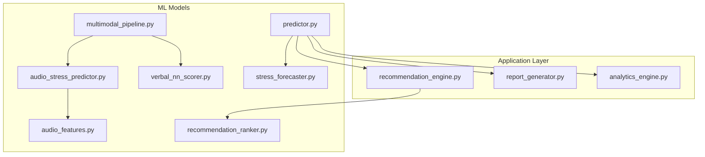
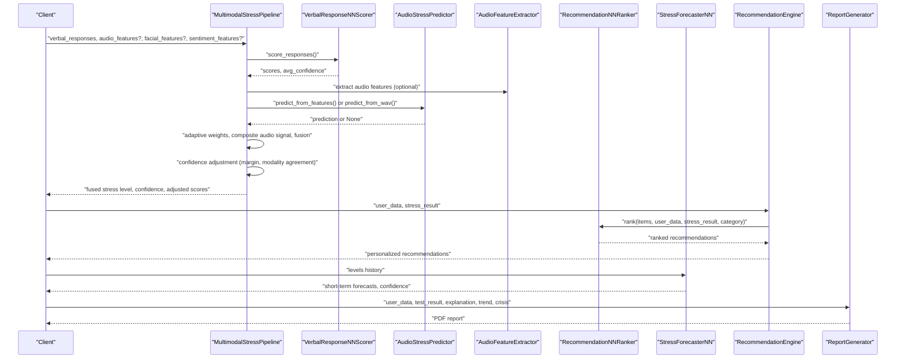
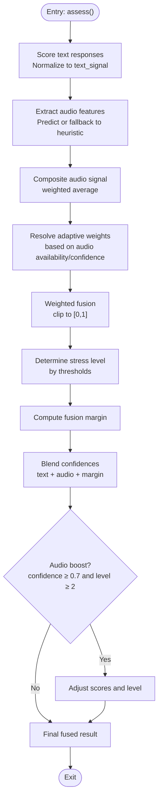
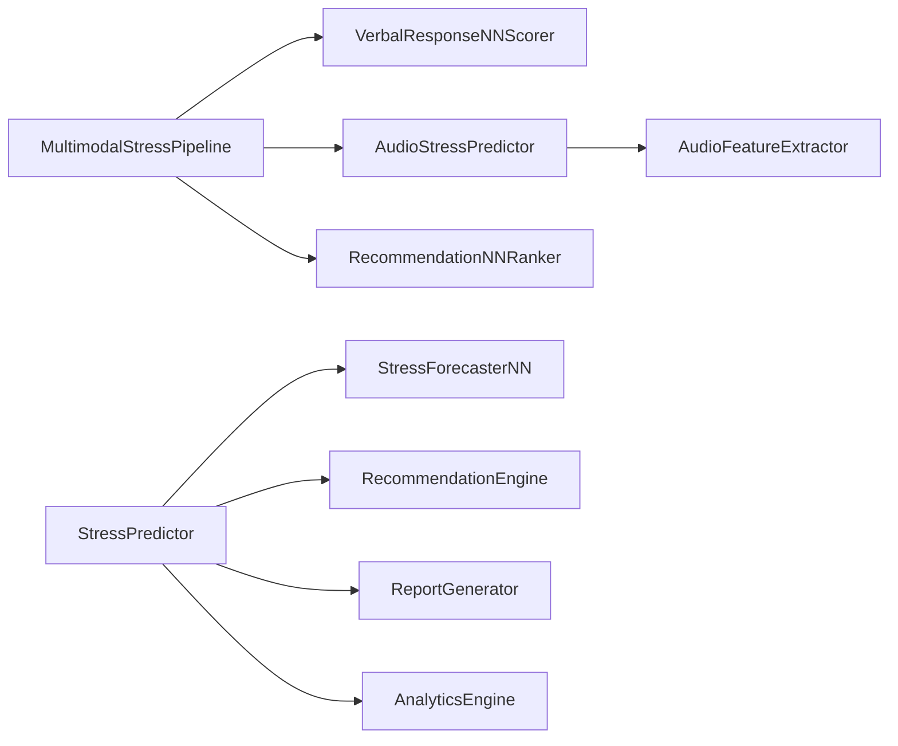

# Multimodal Pipeline

<cite>
**Referenced Files in This Document**
- [multimodal_pipeline.py](file://backend/ml_model/multimodal_pipeline.py)
- [audio_stress_predictor.py](file://backend/ml_model/audio_stress_predictor.py)
- [verbal_nn_scorer.py](file://backend/ml_model/verbal_nn_scorer.py)
- [audio_features.py](file://backend/ml_model/audio_features.py)
- [recommendation_ranker.py](file://backend/ml_model/recommendation_ranker.py)
- [stress_forecaster.py](file://backend/ml_model/stress_forecaster.py)
- [predictor.py](file://backend/ml_model/predictor.py)
- [recommendation_engine.py](file://backend/app/recommendation_engine.py)
- [report_generator.py](file://backend/app/report_generator.py)
- [analytics_engine.py](file://backend/app/analytics_engine.py)
</cite>

## Table of Contents
1. [Introduction](#introduction)
2. [Project Structure](#project-structure)
3. [Core Components](#core-components)
4. [Architecture Overview](#architecture-overview)
5. [Detailed Component Analysis](#detailed-component-analysis)
6. [Dependency Analysis](#dependency-analysis)
7. [Performance Considerations](#performance-considerations)
8. [Troubleshooting Guide](#troubleshooting-guide)
9. [Conclusion](#conclusion)
10. [Appendices](#appendices)

## Introduction
This document explains the multimodal pipeline that integrates text-based questionnaire responses with audio-based stress analysis to produce robust, explainable, and actionable predictions. It covers feature fusion strategies, weighted combination algorithms, decision-making logic, recommendation ranking, stress forecasting, and trend analysis. It also documents real-time processing considerations, performance optimization, integration with external APIs, model coordination, and result synthesis processes.

## Project Structure
The multimodal pipeline lives under the machine learning module and integrates with the broader backend application stack that includes analytics, recommendations, and reporting.

**Diagram sources**
- [multimodal_pipeline.py](file://backend/ml_model/multimodal_pipeline.py)
- [audio_stress_predictor.py](file://backend/ml_model/audio_stress_predictor.py)
- [verbal_nn_scorer.py](file://backend/ml_model/verbal_nn_scorer.py)
- [audio_features.py](file://backend/ml_model/audio_features.py)
- [recommendation_ranker.py](file://backend/ml_model/recommendation_ranker.py)
- [stress_forecaster.py](file://backend/ml_model/stress_forecaster.py)
- [predictor.py](file://backend/ml_model/predictor.py)
- [recommendation_engine.py](file://backend/app/recommendation_engine.py)
- [report_generator.py](file://backend/app/report_generator.py)
- [analytics_engine.py](file://backend/app/analytics_engine.py)

**Section sources**
- [multimodal_pipeline.py](file://backend/ml_model/multimodal_pipeline.py)
- [recommendation_engine.py](file://backend/app/recommendation_engine.py)
- [report_generator.py](file://backend/app/report_generator.py)
- [analytics_engine.py](file://backend/app/analytics_engine.py)

## Core Components
- MultimodalStressPipeline: Fuses text, audio, sentiment, and facial signals into a fused stress level and confidence, with adaptive weighting and confidence adjustment.
- AudioStressPredictor: Loads a trained audio classifier, validates feature availability, and predicts stress levels from audio features.
- VerbalResponseNNScorer: Scores 18-questionnaire responses into 1–5 scores using a lightweight neural network and computes per-response confidence.
- AudioFeatureExtractor: Computes a compact set of voice features from WAV files for downstream audio modeling.
- RecommendationNNRanker: Neural-network-based ranker that personalizes recommendation lists based on stress level, category, difficulty, effectiveness, age, and priority.
- StressForecasterNN: Autoregressive neural network forecaster for short-term stress trajectory predictions.
- StressPredictor: Legacy questionnaire-only predictor with SHAP explanations, category scoring, trend analysis, and crisis detection; coordinates with forecasting and recommendation/reporting engines.
- RecommendationEngine: Generates categorized, prioritized, and personalized recommendations and re-ranks them using the NN ranker.
- ReportGenerator: Produces user and doctor-facing PDF reports synthesizing results, explanations, trends, and recommendations.
- AnalyticsEngine: Provides population-level insights and doctor effectiveness metrics.

**Section sources**
- [multimodal_pipeline.py](file://backend/ml_model/multimodal_pipeline.py)
- [audio_stress_predictor.py](file://backend/ml_model/audio_stress_predictor.py)
- [verbal_nn_scorer.py](file://backend/ml_model/verbal_nn_scorer.py)
- [audio_features.py](file://backend/ml_model/audio_features.py)
- [recommendation_ranker.py](file://backend/ml_model/recommendation_ranker.py)
- [stress_forecaster.py](file://backend/ml_model/stress_forecaster.py)
- [predictor.py](file://backend/ml_model/predictor.py)
- [recommendation_engine.py](file://backend/app/recommendation_engine.py)
- [report_generator.py](file://backend/app/report_generator.py)
- [analytics_engine.py](file://backend/app/analytics_engine.py)

## Architecture Overview
The multimodal pipeline orchestrates three modalities:
- Text: 18-item questionnaire scored by a neural network.
- Audio: Optional trained model prediction from engineered voice features; fallback to heuristic signals.
- Auxiliary: Sentiment and facial signals (weak auxiliary) integrated as additional inputs.

Processing stages:
- Feature extraction and normalization
- Adaptive weighting based on audio model availability and confidence
- Composite audio signal construction
- Weighted fusion into a fused stress level and confidence
- Confidence adjustment via fusion margin and modality agreement
- Optional boosting when audio model supports it
- Recommendation generation and ranking
- Stress forecasting and trend analysis
- Report synthesis and analytics

**Diagram sources**
- [multimodal_pipeline.py](file://backend/ml_model/multimodal_pipeline.py)
- [verbal_nn_scorer.py](file://backend/ml_model/verbal_nn_scorer.py)
- [audio_stress_predictor.py](file://backend/ml_model/audio_stress_predictor.py)
- [audio_features.py](file://backend/ml_model/audio_features.py)
- [recommendation_ranker.py](file://backend/ml_model/recommendation_ranker.py)
- [stress_forecaster.py](file://backend/ml_model/stress_forecaster.py)
- [recommendation_engine.py](file://backend/app/recommendation_engine.py)
- [report_generator.py](file://backend/app/report_generator.py)

## Detailed Component Analysis

### MultimodalStressPipeline
Responsibilities:
- Normalize text scores to a 0–1 signal.
- Compute speaking rate signal as a robust audio heuristic.
- Construct a composite audio signal from trained model output and speaking rate.
- Resolve adaptive weights based on audio model confidence and feature coverage.
- Fuse modalities into a unified stress signal and level.
- Adjust confidence using a margin metric and combine text/audio confidences.
- Apply optional boosts when audio model is confident and supports higher stress levels.
- Return detailed multimodal metadata for explainability and synthesis.

Key algorithms:
- Normalization and thresholds define stress level bins.
- Fusion margin measures proximity to decision boundaries.
- Confidence blending combines text, audio, and fusion margin signals.

**Diagram sources**
- [multimodal_pipeline.py](file://backend/ml_model/multimodal_pipeline.py)

**Section sources**
- [multimodal_pipeline.py](file://backend/ml_model/multimodal_pipeline.py)

### AudioStressPredictor
Responsibilities:
- Load a trained audio classifier and metadata.
- Validate model freshness and handle missing artifacts.
- Prepare feature vectors for prediction, imputing missing features.
- Predict stress level, confidence, and normalized stress.
- Optionally extract features from a WAV file and predict.

Integration points:
- Used by the multimodal pipeline for trained model predictions.
- Provides feature coverage diagnostics for fusion.

**Section sources**
- [audio_stress_predictor.py](file://backend/ml_model/audio_stress_predictor.py)
- [audio_features.py](file://backend/ml_model/audio_features.py)

### VerbalResponseNNScorer
Responsibilities:
- Train or load a neural network to map natural language responses to 1–5 scores.
- Enforce strict input validation (18 responses).
- Invert the score for a specific question to align directionality.
- Return per-response scores and confidence statistics.

**Section sources**
- [verbal_nn_scorer.py](file://backend/ml_model/verbal_nn_scorer.py)

### AudioFeatureExtractor
Responsibilities:
- Load and normalize mono audio from WAV files.
- Extract robust voice features including spectral statistics, MFCCs, pitch, shimmer/jitter, pause ratios, and energy drift.
- Provide a fixed feature vector for downstream audio models.

**Section sources**
- [audio_features.py](file://backend/ml_model/audio_features.py)

### RecommendationNNRanker
Responsibilities:
- Train a synthetic dataset capturing preferences across categories, difficulties, effectiveness, age, and priorities.
- Predict ranking scores for recommendations and sort descending.
- Integrate with the recommendation engine to personalize lists.

**Section sources**
- [recommendation_ranker.py](file://backend/ml_model/recommendation_ranker.py)
- [recommendation_engine.py](file://backend/app/recommendation_engine.py)

### StressForecasterNN
Responsibilities:
- Train a synthetic autoregressive neural network on stress trajectories.
- Forecast short-term levels given a history window.
- Compute confidence based on historical variance.

**Section sources**
- [stress_forecaster.py](file://backend/ml_model/stress_forecaster.py)
- [predictor.py](file://backend/ml_model/predictor.py)

### StressPredictor (Legacy Questionnaire Model)
Responsibilities:
- Predict stress levels from questionnaire responses.
- Provide SHAP-based explanations and category-level scores.
- Detect crises and generate recommendations.
- Perform trend analysis and integrate forecasting.

**Section sources**
- [predictor.py](file://backend/ml_model/predictor.py)

### RecommendationEngine and ReportGenerator
Responsibilities:
- Generate categorized, prioritized, and personalized recommendations.
- Re-rank recommendations using the NN ranker.
- Produce user and doctor PDF reports synthesizing results, explanations, trends, and recommendations.

**Section sources**
- [recommendation_engine.py](file://backend/app/recommendation_engine.py)
- [report_generator.py](file://backend/app/report_generator.py)

### AnalyticsEngine
Responsibilities:
- Compute population-level analytics and doctor effectiveness.
- Support doctor matching and resource allocation.

**Section sources**
- [analytics_engine.py](file://backend/app/analytics_engine.py)

## Dependency Analysis
The multimodal pipeline depends on:
- AudioStressPredictor for trained model predictions.
- VerbalResponseNNScorer for text scoring.
- AudioFeatureExtractor for audio feature engineering.
- RecommendationNNRanker for recommendation personalization.
- StressForecasterNN for short-term forecasting.
- StressPredictor for legacy workflows, trend analysis, and report synthesis.

**Diagram sources**
- [multimodal_pipeline.py](file://backend/ml_model/multimodal_pipeline.py)
- [audio_stress_predictor.py](file://backend/ml_model/audio_stress_predictor.py)
- [verbal_nn_scorer.py](file://backend/ml_model/verbal_nn_scorer.py)
- [audio_features.py](file://backend/ml_model/audio_features.py)
- [recommendation_ranker.py](file://backend/ml_model/recommendation_ranker.py)
- [stress_forecaster.py](file://backend/ml_model/stress_forecaster.py)
- [predictor.py](file://backend/ml_model/predictor.py)
- [recommendation_engine.py](file://backend/app/recommendation_engine.py)
- [report_generator.py](file://backend/app/report_generator.py)
- [analytics_engine.py](file://backend/app/analytics_engine.py)

**Section sources**
- [multimodal_pipeline.py](file://backend/ml_model/multimodal_pipeline.py)
- [audio_stress_predictor.py](file://backend/ml_model/audio_stress_predictor.py)
- [verbal_nn_scorer.py](file://backend/ml_model/verbal_nn_scorer.py)
- [audio_features.py](file://backend/ml_model/audio_features.py)
- [recommendation_ranker.py](file://backend/ml_model/recommendation_ranker.py)
- [stress_forecaster.py](file://backend/ml_model/stress_forecaster.py)
- [predictor.py](file://backend/ml_model/predictor.py)
- [recommendation_engine.py](file://backend/app/recommendation_engine.py)
- [report_generator.py](file://backend/app/report_generator.py)
- [analytics_engine.py](file://backend/app/analytics_engine.py)

## Performance Considerations
- Audio feature extraction and model inference are CPU-bound; batch processing and caching can improve throughput.
- Adaptive weighting reduces reliance on audio when unavailable, maintaining performance.
- Confidence blending avoids overconfidence when close to decision boundaries.
- Recommendation ranking uses a lightweight neural network; keep feature sets minimal for latency-sensitive deployments.
- Forecasting uses a small autoregressive network; tune window size for accuracy/performance trade-offs.
- Integrity checks for pickled models prevent runtime failures due to corrupted artifacts.

[No sources needed since this section provides general guidance]

## Troubleshooting Guide
Common issues and resolutions:
- Audio model not available: The pipeline falls back to heuristic signals and adjusts weights accordingly.
- Missing audio features: The predictor reports available vs. required features and imputation status.
- Model integrity errors: SHA-256 checks guard against corrupted model files; retrain or replace artifacts.
- Insufficient data for forecasting: Forecaster returns an insufficient-data status and required minimum points.
- Inconsistent questionnaire counts: Verbal scorer enforces exactly 18 responses and raises explicit errors otherwise.

**Section sources**
- [multimodal_pipeline.py](file://backend/ml_model/multimodal_pipeline.py)
- [audio_stress_predictor.py](file://backend/ml_model/audio_stress_predictor.py)
- [verbal_nn_scorer.py](file://backend/ml_model/verbal_nn_scorer.py)
- [stress_forecaster.py](file://backend/ml_model/stress_forecaster.py)

## Conclusion
The multimodal pipeline integrates text and audio signals with auxiliary inputs to produce a robust, explainable, and confidence-aware stress assessment. It adapts weights dynamically, blends confidences, and applies optional audio-driven boosts. The system coordinates recommendation ranking, forecasting, and reporting to deliver a complete solution for stress monitoring and intervention.

[No sources needed since this section summarizes without analyzing specific files]

## Appendices

### Example Workflows

- Multimodal Prediction Workflow
  - Input: 18 textual responses, optional audio features and auxiliary signals.
  - Steps: Score text, extract/compute audio signals, resolve adaptive weights, fuse signals, adjust confidence, optionally boost, and return fused result with metadata.

- Confidence Adjustment Based on Modality Agreement
  - When audio model is confident and supports higher stress levels, scores and level are boosted to reflect stronger evidence.

- Uncertainty Quantification
  - Fusion margin determines proximity to thresholds; confidence blends text, audio, and margin signals.

- Real-Time Processing Considerations
  - Prefer heuristic fallbacks when audio model is unavailable.
  - Cache feature extraction and model artifacts to minimize latency.
  - Use streaming audio feature extraction for real-time scenarios.

- Integration with External APIs and Services
  - RecommendationEngine integrates with the NN ranker for personalization.
  - ReportGenerator produces PDFs for users and doctors.
  - AnalyticsEngine computes population-level insights and doctor effectiveness.

[No sources needed since this section provides general guidance]