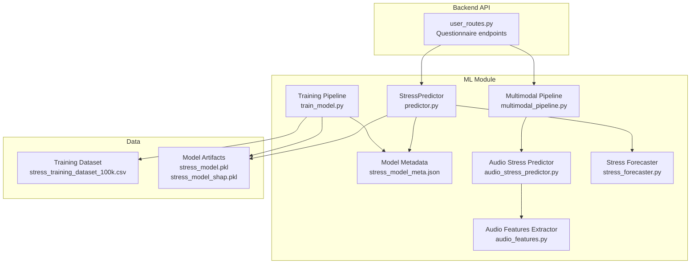
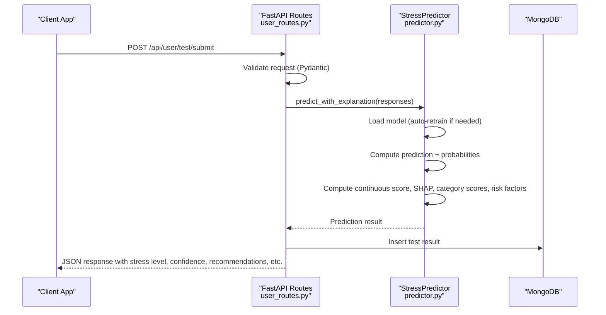
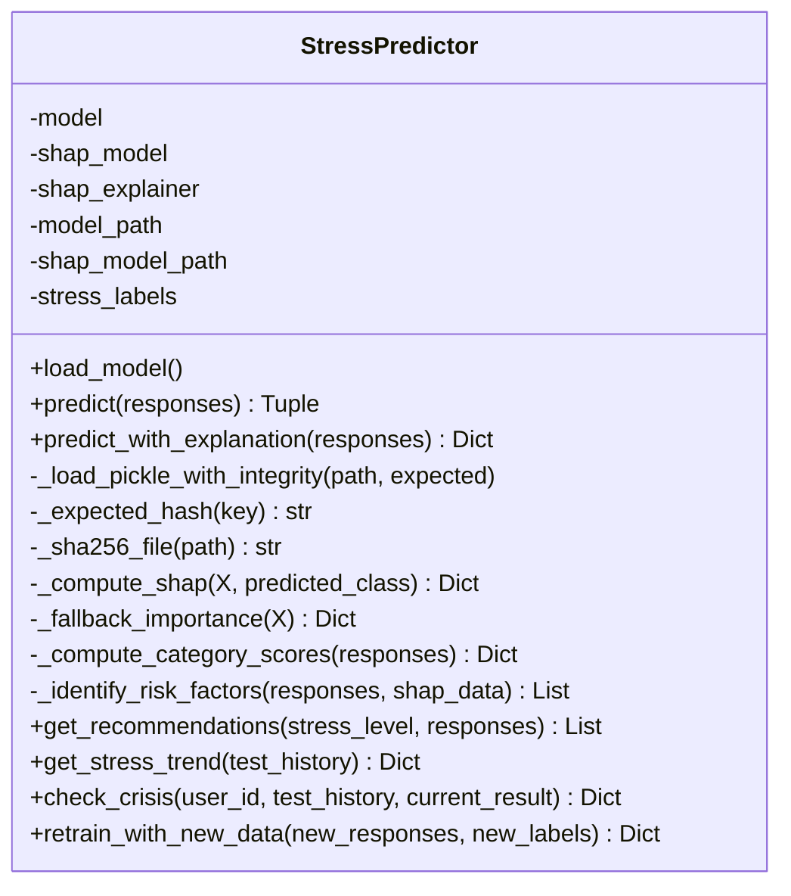
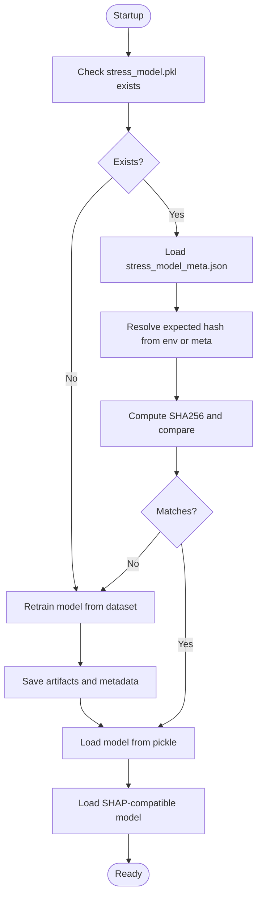
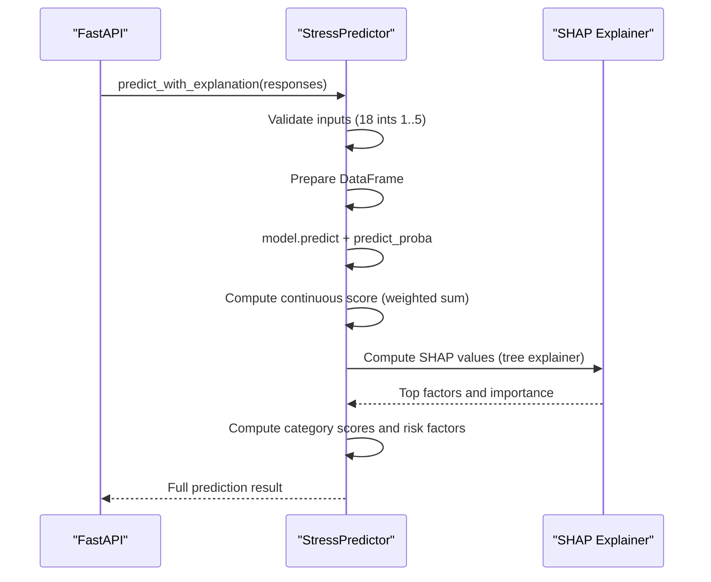
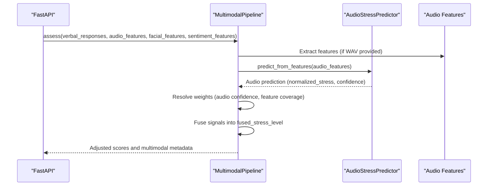
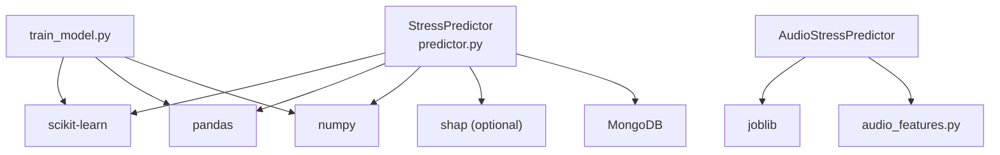

# Prediction System

<cite>
**Referenced Files in This Document**
- [predictor.py](file://backend/ml_model/predictor.py)
- [train_model.py](file://backend/ml_model/train_model.py)
- [stress_model_meta.json](file://backend/ml_model/stress_model_meta.json)
- [user_routes.py](file://backend/app/routes/user_routes.py)
- [models.py](file://backend/app/models.py)
- [multimodal_pipeline.py](file://backend/ml_model/multimodal_pipeline.py)
- [audio_stress_predictor.py](file://backend/ml_model/audio_stress_predictor.py)
- [audio_features.py](file://backend/ml_model/audio_features.py)
- [stress_forecaster.py](file://backend/ml_model/stress_forecaster.py)
- [README.md](file://README.md)
- [ARCHITECTURE_EXPLAINED.md](file://ARCHITECTURE_EXPLAINED.md)
</cite>

## Table of Contents
1. [Introduction](#introduction)
2. [Project Structure](#project-structure)
3. [Core Components](#core-components)
4. [Architecture Overview](#architecture-overview)
5. [Detailed Component Analysis](#detailed-component-analysis)
6. [Dependency Analysis](#dependency-analysis)
7. [Performance Considerations](#performance-considerations)
8. [Troubleshooting Guide](#troubleshooting-guide)
9. [Conclusion](#conclusion)
10. [Appendices](#appendices)

## Introduction
This document provides a comprehensive guide to the prediction system component responsible for stress level classification using an 18-question CBT-based questionnaire. It explains the StressPredictor class architecture, model loading and validation mechanisms, prediction workflow, and explainability features. It also covers continuous stress scoring, recommendation generation, clinical risk factor identification, model integrity checking with SHA256 hashes, automatic retraining, and deployment considerations.

## Project Structure
The prediction system resides in the machine learning module and integrates with the FastAPI backend routes. The key elements include:
- StressPredictor class for inference and explainability
- Training pipeline for model generation and metadata
- Metadata and integrity validation via SHA256
- Integration endpoints for questionnaire submissions
- Multimodal fusion pipeline for video-based assessments
- Audio stress predictor for voice-only assessments

**Diagram sources**
- [user_routes.py:407-499](file://backend/app/routes/user_routes.py#L407-L499)
- [predictor.py:32-590](file://backend/ml_model/predictor.py#L32-L590)
- [train_model.py:79-195](file://backend/ml_model/train_model.py#L79-L195)
- [multimodal_pipeline.py:74-183](file://backend/ml_model/multimodal_pipeline.py#L74-L183)
- [audio_stress_predictor.py:13-157](file://backend/ml_model/audio_stress_predictor.py#L13-L157)
- [audio_features.py:261-352](file://backend/ml_model/audio_features.py#L261-L352)
- [stress_forecaster.py:7-96](file://backend/ml_model/stress_forecaster.py#L7-L96)

**Section sources**
- [README.md:69-86](file://README.md#L69-L86)
- [ARCHITECTURE_EXPLAINED.md:18-66](file://ARCHITECTURE_EXPLAINED.md#L18-L66)

## Core Components
- StressPredictor: Loads trained models, validates integrity, performs predictions, and returns explainability, category scores, risk factors, and recommendations.
- Training Pipeline: Generates or loads training data, builds an ensemble model, saves artifacts and metadata, and computes SHA256 hashes.
- Metadata and Integrity: Stores model metadata and SHA256 hashes for validation.
- Multimodal Pipeline: Fuses text, audio, and sentiment signals for adaptive multimodal assessments.
- Audio Stress Predictor: Loads a trained audio model and predicts stress from extracted acoustic features.
- Stress Forecaster: Provides short-term forecasts based on historical stress levels.

**Section sources**
- [predictor.py:32-590](file://backend/ml_model/predictor.py#L32-L590)
- [train_model.py:79-195](file://backend/ml_model/train_model.py#L79-L195)
- [stress_model_meta.json:1-31](file://backend/ml_model/stress_model_meta.json#L1-L31)
- [multimodal_pipeline.py:11-183](file://backend/ml_model/multimodal_pipeline.py#L11-L183)
- [audio_stress_predictor.py:13-157](file://backend/ml_model/audio_stress_predictor.py#L13-L157)
- [stress_forecaster.py:7-96](file://backend/ml_model/stress_forecaster.py#L7-L96)

## Architecture Overview
The prediction system integrates with FastAPI endpoints to process questionnaire submissions and return structured results including stress level, confidence, continuous score, recommendations, category scores, risk factors, and SHAP-based explanations. The multimodal pipeline optionally incorporates audio and sentiment signals for enhanced assessments.

**Diagram sources**
- [user_routes.py:407-499](file://backend/app/routes/user_routes.py#L407-L499)
- [predictor.py:119-185](file://backend/ml_model/predictor.py#L119-L185)

**Section sources**
- [user_routes.py:407-499](file://backend/app/routes/user_routes.py#L407-L499)
- [predictor.py:81-118](file://backend/ml_model/predictor.py#L81-L118)

## Detailed Component Analysis

### StressPredictor Class
The StressPredictor encapsulates model loading, integrity validation, prediction, and explainability. It supports:
- Model loading with automatic retraining if the pickle is invalid or missing
- Integrity validation via SHA256 hashes from metadata or environment variables
- Prediction with confidence and continuous stress score (0–100)
- SHAP-based explanations and feature importance fallback
- Category-level analysis and clinical risk factor identification
- Trend analysis and crisis detection
- Recommendation generation tailored to stress level and specific responses

**Diagram sources**
- [predictor.py:32-590](file://backend/ml_model/predictor.py#L32-L590)

**Section sources**
- [predictor.py:32-590](file://backend/ml_model/predictor.py#L32-L590)

### Model Loading and Validation Mechanisms
- Automatic model loading at import time; if missing or corrupted, the system retrains from the dataset.
- Integrity validation using SHA256 hashes retrieved from metadata or environment variables.
- Separate SHAP-compatible tree model is loaded for explainability.

**Diagram sources**
- [predictor.py:81-118](file://backend/ml_model/predictor.py#L81-L118)
- [train_model.py:157-184](file://backend/ml_model/train_model.py#L157-L184)
- [stress_model_meta.json:1-31](file://backend/ml_model/stress_model_meta.json#L1-L31)

**Section sources**
- [predictor.py:73-118](file://backend/ml_model/predictor.py#L73-L118)
- [train_model.py:157-184](file://backend/ml_model/train_model.py#L157-L184)
- [stress_model_meta.json:1-31](file://backend/ml_model/stress_model_meta.json#L1-L31)

### Prediction Workflow
- Input validation enforces 18 responses within 1–5 range.
- Prediction returns stress level, label, confidence, and recommendations.
- Extended prediction includes continuous score, probabilities, SHAP explanation, category scores, and risk factors.

**Diagram sources**
- [predictor.py:119-185](file://backend/ml_model/predictor.py#L119-L185)

**Section sources**
- [predictor.py:119-185](file://backend/ml_model/predictor.py#L119-L185)

### 18-Question CBT Questionnaire Input Format
- 18 questions mapped to q1–q18, each scored 1–5.
- Categories: Emotional, Physical, Cognitive, Behavioral, Stressors.
- The backend exposes a GET endpoint to retrieve the questionnaire and instructions.

**Section sources**
- [user_routes.py:150-184](file://backend/app/routes/user_routes.py#L150-L184)
- [README.md:341-376](file://README.md#L341-L376)

### Stress Level Classification and Confidence Scoring
- Classes: Low (0), Moderate (1), High (2), Severe (3).
- Confidence equals the predicted class probability.
- Continuous stress score computed as a weighted sum of class probabilities: [0, 33.3, 66.6, 100.0].

**Section sources**
- [predictor.py:39-44](file://backend/ml_model/predictor.py#L39-L44)
- [predictor.py:159-162](file://backend/ml_model/predictor.py#L159-L162)

### Explainability and Risk Factors
- SHAP-based explanations using a tree model for top contributors.
- Fallback to model-level feature importance if SHAP is unavailable.
- Risk factors include sleep disruption, combined withdrawal/suicidal ideation proxy, cardiovascular stress indicators, compound external stressors, and global high stress.

**Section sources**
- [predictor.py:187-306](file://backend/ml_model/predictor.py#L187-L306)

### Recommendation Generation Logic
- Tailored recommendations by stress level and specific high-scoring responses (e.g., sleep, irritability, social withdrawal, work-life balance).

**Section sources**
- [predictor.py:308-361](file://backend/ml_model/predictor.py#L308-L361)

### Continuous Stress Score Calculation
- Weighted aggregation of class probabilities into a 0–100 continuous score.
- Used for trend analysis and forecasting.

**Section sources**
- [predictor.py:159-162](file://backend/ml_model/predictor.py#L159-L162)
- [stress_forecaster.py:45-82](file://backend/ml_model/stress_forecaster.py#L45-L82)

### Model Persistence, Loading Strategies, and Deployment
- Persisted artifacts: stress_model.pkl and stress_model_shap.pkl.
- Metadata includes dataset path, rows, features, target, model type, hyperparameters, and SHA256 hashes.
- Auto-recovery on startup if artifacts are missing or corrupted.
- Environment variables can override expected hashes for validation.

**Section sources**
- [train_model.py:147-184](file://backend/ml_model/train_model.py#L147-L184)
- [stress_model_meta.json:1-31](file://backend/ml_model/stress_model_meta.json#L1-L31)
- [predictor.py:55-71](file://backend/ml_model/predictor.py#L55-L71)

### Multimodal Assessment Integration
- The multimodal pipeline fuses text, audio, sentiment, and facial signals into a fused stress score with adaptive weighting.
- Audio features are extracted from WAV files and optionally fed into a trained audio model.

**Diagram sources**
- [multimodal_pipeline.py:74-183](file://backend/ml_model/multimodal_pipeline.py#L74-L183)
- [audio_stress_predictor.py:97-153](file://backend/ml_model/audio_stress_predictor.py#L97-L153)
- [audio_features.py:261-352](file://backend/ml_model/audio_features.py#L261-L352)

**Section sources**
- [multimodal_pipeline.py:74-183](file://backend/ml_model/multimodal_pipeline.py#L74-L183)
- [audio_stress_predictor.py:97-153](file://backend/ml_model/audio_stress_predictor.py#L97-L153)
- [audio_features.py:261-352](file://backend/ml_model/audio_features.py#L261-L352)

### Prediction API Usage Examples
- Submit questionnaire responses via POST /api/user/test/submit.
- Retrieve the questionnaire via GET /api/user/questionnaire.
- Response includes stress_level, stress_label, confidence_score, continuous_score, recommendations, explanation, category_scores, risk_factors, and probabilities.

**Section sources**
- [user_routes.py:171-184](file://backend/app/routes/user_routes.py#L171-L184)
- [user_routes.py:407-499](file://backend/app/routes/user_routes.py#L407-L499)
- [models.py:78-90](file://backend/app/models.py#L78-L90)

### Response Validation and Error Handling
- Pydantic models enforce input validation for responses and test submissions.
- HTTP 400 for invalid counts or out-of-range values.
- HTTP 500 for prediction errors with detailed messages.
- Crisis detection and SMS/email notifications triggered on severe assessments.

**Section sources**
- [models.py:78-90](file://backend/app/models.py#L78-L90)
- [user_routes.py:407-499](file://backend/app/routes/user_routes.py#L407-L499)

## Dependency Analysis
The prediction system depends on:
- scikit-learn for model training and inference
- pandas and numpy for data processing
- optional SHAP for explainability
- MongoDB for storing test results and history
- Optional audio pipeline for voice-based assessments

**Diagram sources**
- [predictor.py:10](file://backend/ml_model/predictor.py#L10)
- [audio_stress_predictor.py:7-9](file://backend/ml_model/audio_stress_predictor.py#L7-L9)
- [train_model.py:8-12](file://backend/ml_model/train_model.py#L8-L12)

**Section sources**
- [predictor.py:10](file://backend/ml_model/predictor.py#L10)
- [audio_stress_predictor.py:7-9](file://backend/ml_model/audio_stress_predictor.py#L7-L9)
- [train_model.py:8-12](file://backend/ml_model/train_model.py#L8-L12)

## Performance Considerations
- Model is loaded once at import time for near-instant inference.
- SHAP computations are optional and fall back to model-level feature importance.
- Continuous scoring and trend analysis leverage lightweight numpy operations.
- Multimodal fusion adapts weights based on audio confidence and feature availability.

[No sources needed since this section provides general guidance]

## Troubleshooting Guide
Common issues and resolutions:
- Model not found or corrupted: The system auto-retries training on startup.
- Integrity check failures: Verify SHA256 hashes in metadata or environment variables.
- Missing SHAP: Fallback to feature importance; ensure a tree-based model is available.
- Audio model not available: The multimodal pipeline gracefully reduces audio influence.
- Prediction errors: Inspect HTTP 500 responses for detailed messages.

**Section sources**
- [predictor.py:81-118](file://backend/ml_model/predictor.py#L81-L118)
- [predictor.py:187-256](file://backend/ml_model/predictor.py#L187-L256)
- [audio_stress_predictor.py:58-72](file://backend/ml_model/audio_stress_predictor.py#L58-L72)

## Conclusion
The prediction system provides a robust, explainable, and continuously improving stress assessment pipeline. It validates model integrity, supports multimodal inputs, and offers actionable insights through recommendations and risk factor identification. Its design emphasizes reliability, transparency, and adaptability for real-world deployments.

[No sources needed since this section summarizes without analyzing specific files]

## Appendices

### API Definitions
- GET /api/user/questionnaire: Returns questions and response scale.
- POST /api/user/test/submit: Submits 18-question responses and returns prediction results.

**Section sources**
- [user_routes.py:171-184](file://backend/app/routes/user_routes.py#L171-L184)
- [user_routes.py:407-499](file://backend/app/routes/user_routes.py#L407-L499)

### Model Integrity and Retraining
- SHA256 hashes stored in metadata and environment variables.
- Automatic retraining from dataset if artifacts are missing or invalid.

**Section sources**
- [predictor.py:55-71](file://backend/ml_model/predictor.py#L55-L71)
- [train_model.py:157-184](file://backend/ml_model/train_model.py#L157-L184)