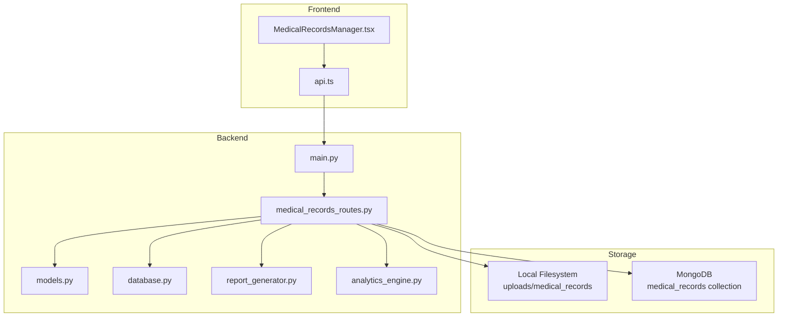
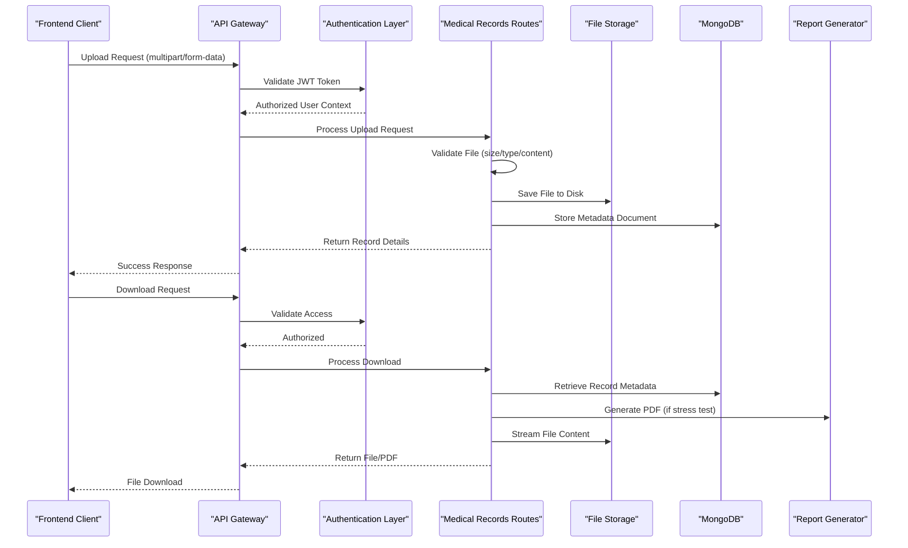
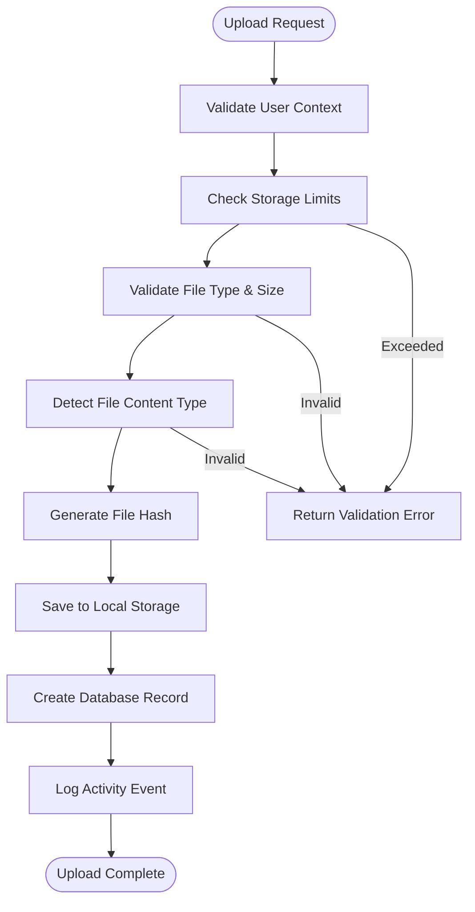
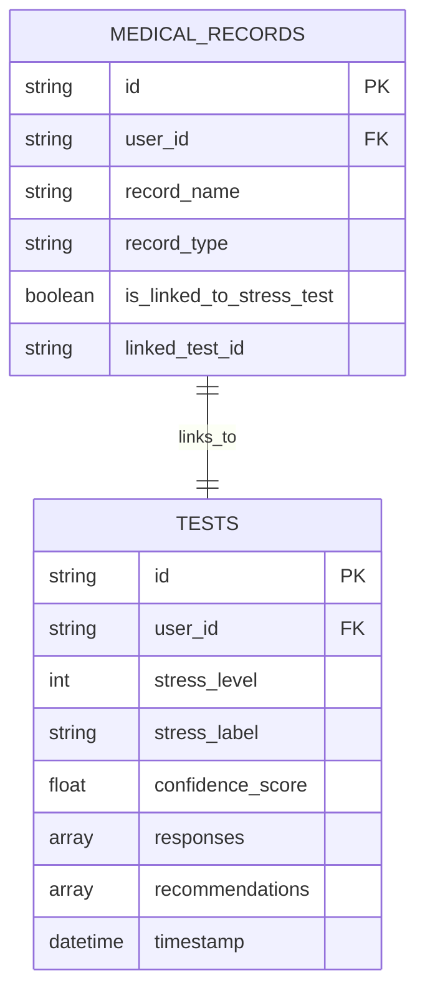
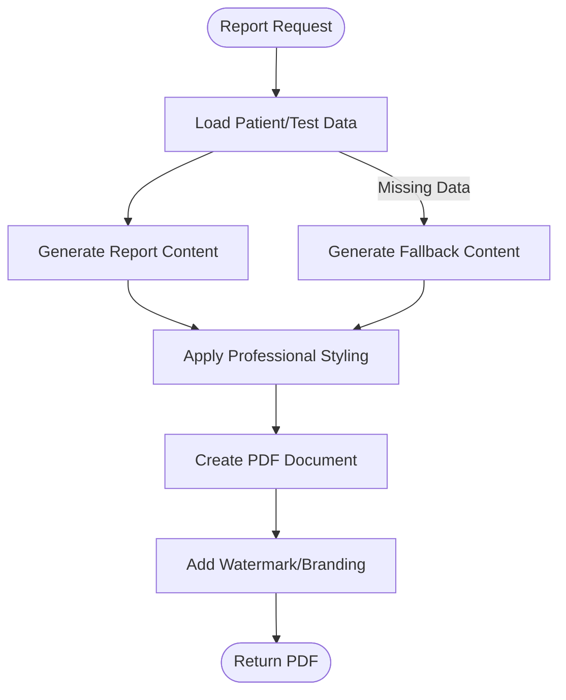
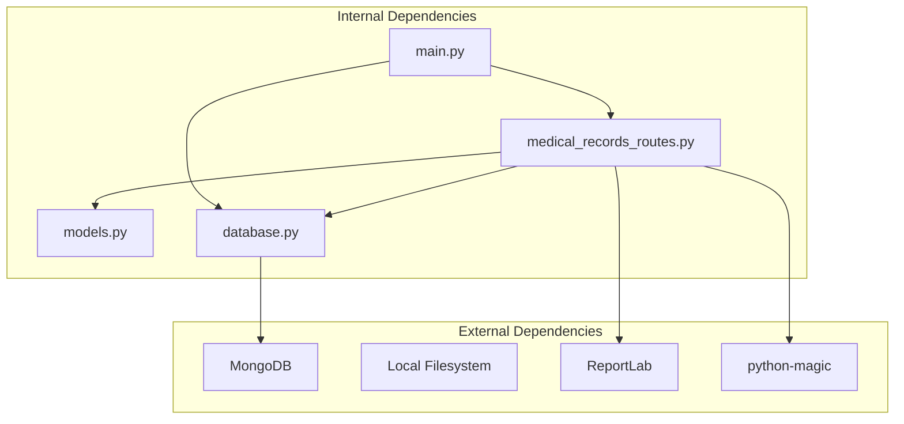

# Medical Records System

<cite>
**Referenced Files in This Document**
- [models.py](file://backend/app/models.py)
- [medical_records_routes.py](file://backend/app/routes/medical_records_routes.py)
- [database.py](file://backend/app/database.py)
- [report_generator.py](file://backend/app/report_generator.py)
- [analytics_engine.py](file://backend/app/analytics_engine.py)
- [main.py](file://backend/app/main.py)
- [MedicalRecordsManager.tsx](file://frontend/src/components/MedicalRecordsManager.tsx)
- [api.ts](file://frontend/src/services/api.ts)
- [README.md](file://README.md)
</cite>

## Table of Contents
1. [Introduction](#introduction)
2. [Project Structure](#project-structure)
3. [Core Components](#core-components)
4. [Architecture Overview](#architecture-overview)
5. [Detailed Component Analysis](#detailed-component-analysis)
6. [Dependency Analysis](#dependency-analysis)
7. [Performance Considerations](#performance-considerations)
8. [Troubleshooting Guide](#troubleshooting-guide)
9. [Conclusion](#conclusion)

## Introduction
This document provides comprehensive documentation for the Medical Records System within the AI Stress Level Analyzer platform. It covers file upload and storage mechanisms, metadata extraction processes, access control implementations, integration between medical records and test results, report generation capabilities, analytics engine functionality, security measures, compliance considerations, data retention policies, and the user interface components for managing medical records along with backend APIs for record operations.

## Project Structure
The Medical Records System is implemented as part of a full-stack FastAPI backend with a React frontend. The backend manages MongoDB collections for storing medical records, handles file uploads to a local filesystem, enforces strict access controls, and integrates with the analytics engine and report generator. The frontend provides a user-friendly interface for uploading, organizing, downloading, and deleting medical records.

**Diagram sources**
- [main.py:52-92](file://backend/app/main.py#L52-L92)
- [medical_records_routes.py:40-48](file://backend/app/routes/medical_records_routes.py#L40-L48)
- [database.py:148-158](file://backend/app/database.py#L148-L158)
- [models.py:299-352](file://backend/app/models.py#L299-L352)

**Section sources**
- [README.md:69-86](file://README.md#L69-L86)
- [main.py:52-92](file://backend/app/main.py#L52-L92)

## Core Components
The Medical Records System consists of several core components working together to provide a secure, scalable, and user-friendly solution for managing health-related documents.

### Backend Components
- **Medical Records Routes**: Handles all CRUD operations for medical records, file uploads, downloads, and bulk operations
- **Database Layer**: Manages MongoDB collections and provides helper functions for storage calculations and record linking
- **Models**: Defines Pydantic models for request/response validation and data structures
- **Report Generator**: Creates professional PDF reports for stress test records
- **Analytics Engine**: Provides population-level insights and user-specific analytics

### Frontend Components
- **MedicalRecordsManager**: React component for uploading, viewing, filtering, and managing medical records
- **API Service**: Centralized service for making authenticated requests to backend endpoints

**Section sources**
- [medical_records_routes.py:149-278](file://backend/app/routes/medical_records_routes.py#L149-L278)
- [database.py:447-492](file://backend/app/database.py#L447-L492)
- [models.py:299-352](file://backend/app/models.py#L299-L352)
- [MedicalRecordsManager.tsx:54-94](file://frontend/src/components/MedicalRecordsManager.tsx#L54-L94)

## Architecture Overview
The Medical Records System follows a layered architecture with clear separation of concerns:

**Diagram sources**
- [medical_records_routes.py:149-278](file://backend/app/routes/medical_records_routes.py#L149-L278)
- [medical_records_routes.py:786-885](file://backend/app/routes/medical_records_routes.py#L786-L885)
- [database.py:447-492](file://backend/app/database.py#L447-L492)

The system implements several key architectural principles:
- **Separation of Concerns**: File storage, metadata management, and business logic are clearly separated
- **Security by Design**: Multi-layered access control and validation at every boundary
- **Scalability**: Local filesystem storage with MongoDB for metadata, supporting horizontal scaling
- **Auditability**: Comprehensive activity logging for all operations

## Detailed Component Analysis

### File Upload and Storage Mechanism
The file upload system implements robust validation, secure storage, and efficient retrieval mechanisms.

#### Upload Processing Flow

**Diagram sources**
- [medical_records_routes.py:164-187](file://backend/app/routes/medical_records_routes.py#L164-L187)
- [medical_records_routes.py:68-131](file://backend/app/routes/medical_records_routes.py#L68-L131)

#### Storage Configuration and Limits
- **Maximum File Size**: 10MB per file
- **Allowed Formats**: PDF, JPG, JPEG, PNG, DOC, DOCX
- **Storage Limit**: 100MB per user account
- **File Naming**: Unique hashed filenames to prevent conflicts and maintain privacy

#### Security Measures in File Handling
- **Content Validation**: Both MIME type detection and file signature verification
- **Path Sanitization**: Unicode normalization and safe filename generation
- **Access Control**: User-specific directory structure and object-level authorization
- **Integrity Checking**: SHA-256 hash verification for file integrity

**Section sources**
- [medical_records_routes.py:44-48](file://backend/app/routes/medical_records_routes.py#L44-L48)
- [medical_records_routes.py:68-131](file://backend/app/routes/medical_records_routes.py#L68-L131)
- [medical_records_routes.py:189-196](file://backend/app/routes/medical_records_routes.py#L189-L196)

### Metadata Extraction and Management
The system captures comprehensive metadata during the upload process and maintains it in MongoDB for efficient querying and reporting.

#### Metadata Structure
The medical record metadata includes:
- **Basic Information**: Record name, type, description, and dates
- **Provider Information**: Doctor name, hospital/clinic name
- **Technical Details**: File name, size, format, hash, and path
- **Usage Statistics**: Download count and timestamps
- **Integration Fields**: Links to stress tests and tagging system

#### Filtering and Search Capabilities
The system supports sophisticated filtering and search operations:
- **Type-based Filtering**: Filter by record type (prescription, lab report, etc.)
- **Date Range Queries**: Filter by upload or record date ranges
- **Full-Text Search**: Search across record names, descriptions, and notes
- **Tag-based Organization**: Categorize records with custom tags

**Section sources**
- [models.py:299-352](file://backend/app/models.py#L299-L352)
- [medical_records_routes.py:310-330](file://backend/app/routes/medical_records_routes.py#L310-L330)

### Access Control Implementation
The system implements multi-layered access control to ensure data privacy and security.

#### Role-Based Access Control (RBAC)
- **User Role**: Can only access their own records
- **Doctor Role**: Can access records of patients they are treating
- **Admin Role**: Full access to all records for administrative purposes

#### Object-Level Authorization
Every operation validates that the requesting user has legitimate access to the specific record:
- **Read Operations**: Verify user ownership or doctor-patient relationship
- **Write Operations**: Enforce ownership restrictions
- **Delete Operations**: Support both soft delete and permanent deletion

#### Authentication Integration
- **JWT Token Validation**: All requests require valid bearer tokens
- **Session Management**: Token-based authentication with configurable expiration
- **Automatic Token Injection**: Frontend automatically attaches tokens to requests

**Section sources**
- [medical_records_routes.py:295-308](file://backend/app/routes/medical_records_routes.py#L295-L308)
- [medical_records_routes.py:435-440](file://backend/app/routes/medical_records_routes.py#L435-L440)
- [api.ts:215-222](file://frontend/src/services/api.ts#L215-L222)

### Integration Between Medical Records and Test Results
The system seamlessly integrates medical records with stress test results, creating a comprehensive health history.

#### Stress Test Linking Mechanism

**Diagram sources**
- [database.py:447-492](file://backend/app/database.py#L447-L492)
- [models.py:357-377](file://backend/app/models.py#L357-L377)

#### Automatic PDF Generation
When downloading stress test records, the system automatically generates professional PDF reports containing:
- **Assessment Summary**: Stress level, confidence score, and severity
- **Detailed Questionnaire Responses**: Categorized responses with explanations
- **Personalized Recommendations**: Tailored suggestions based on assessment results
- **Clinical Disclaimer**: Important disclaimers about AI-generated content

#### Data Synchronization
The system maintains data consistency through:
- **Embedded Data**: Stress test data is embedded within the medical record document
- **Reference Integrity**: Maintains links to original test documents
- **Fallback Mechanisms**: Graceful degradation when test data is unavailable

**Section sources**
- [medical_records_routes.py:805-872](file://backend/app/routes/medical_records_routes.py#L805-L872)
- [database.py:447-492](file://backend/app/database.py#L447-L492)

### Report Generation System
The report generation system creates comprehensive, professional reports for both users and healthcare providers.

#### Report Types
- **User Reports**: Personalized stress assessment reports with recommendations
- **Doctor Summaries**: Concise patient summaries for clinical review
- **Stress Test Reports**: Professional PDFs with detailed analysis

#### Report Content Structure
Reports include standardized sections:
- **Header Information**: Platform branding and report metadata
- **Patient Information**: Demographic and contact details
- **Assessment Results**: Stress level, confidence scores, and trend analysis
- **Recommendations**: Personalized action items and resources
- **Clinical Insights**: AI-driven explanations and risk factor identification

#### PDF Generation Pipeline

**Diagram sources**
- [report_generator.py:38-235](file://backend/app/report_generator.py#L38-L235)
- [medical_records_routes.py:556-783](file://backend/app/routes/medical_records_routes.py#L556-L783)

**Section sources**
- [report_generator.py:38-235](file://backend/app/report_generator.py#L38-L235)
- [medical_records_routes.py:556-783](file://backend/app/routes/medical_records_routes.py#L556-L783)

### Analytics Engine for Medical Record Processing
The analytics engine processes medical record data to generate insights and support decision-making.

#### Population-Level Analytics
The system provides comprehensive analytics including:
- **Usage Statistics**: Total records, storage utilization, and growth trends
- **Demographic Insights**: Distribution by age, location, and stress patterns
- **Clinical Trends**: Seasonal variations and geographic differences
- **Resource Utilization**: Effectiveness of different record types

#### User-Specific Analytics
Individual user analytics include:
- **Personal History**: Timeline of all medical records and stress assessments
- **Pattern Recognition**: Long-term trends and improvement indicators
- **Category Analysis**: Breakdown by record type and clinical significance
- **Recommendation Tracking**: Effectiveness of prescribed interventions

#### Doctor Effectiveness Metrics
The system evaluates healthcare provider performance through:
- **Outcome Analysis**: Comparison of pre- and post-consultation stress levels
- **Patient Satisfaction**: Tracking of treatment adherence and improvement
- **Specialization Matching**: Correlation between doctor expertise and patient outcomes

**Section sources**
- [analytics_engine.py:20-199](file://backend/app/analytics_engine.py#L20-L199)
- [analytics_engine.py:247-307](file://backend/app/analytics_engine.py#L247-L307)
- [analytics_engine.py:309-378](file://backend/app/analytics_engine.py#L309-L378)

### Security Measures and Compliance
The system implements comprehensive security measures to protect sensitive health information.

#### Data Protection Measures
- **Encryption**: File encryption at rest and secure transmission protocols
- **Access Logging**: Comprehensive audit trails for all record access and modifications
- **Data Minimization**: Only collect necessary information for system functionality
- **Secure Deletion**: Proper disposal of deleted files and associated metadata

#### Privacy Controls
- **Granular Permissions**: Role-based access with explicit permission boundaries
- **Data Ownership**: Clear enforcement of user data ownership principles
- **Audit Trails**: Complete logs of who accessed what information and when
- **Consent Management**: Mechanisms for managing patient consent for data sharing

#### Regulatory Compliance
- **HIPAA Considerations**: Design principles aligned with HIPAA requirements
- **GDPR Alignment**: Data handling practices consistent with GDPR principles
- **Data Retention**: Automated cleanup of expired or unnecessary records
- **Right to Erasure**: Support for complete data removal upon request

**Section sources**
- [medical_records_routes.py:133-144](file://backend/app/routes/medical_records_routes.py#L133-L144)
- [database.py:417-445](file://backend/app/database.py#L417-L445)

### Data Retention Policies
The system implements automated data lifecycle management:

#### Storage Limits
- **Per-User Quota**: 100MB storage limit per user account
- **Automatic Cleanup**: Removal of oldest records when limits are approached
- **Quota Monitoring**: Real-time tracking of storage usage and remaining capacity

#### Record Lifecycle
- **Creation Timestamps**: Precise tracking of when records are added
- **Activity Logs**: Comprehensive audit trails for all operations
- **Archival Options**: Support for long-term storage of important records
- **Deletion Procedures**: Secure removal of files and associated metadata

#### Compliance Features
- **Retention Scheduling**: Configurable retention periods for different record types
- **Export Capabilities**: Secure export of records for external archival
- **Deletion Certificates**: Audit trails confirming proper data disposal

**Section sources**
- [medical_records_routes.py:48-49](file://backend/app/routes/medical_records_routes.py#L48-L49)
- [medical_records_routes.py:171-177](file://backend/app/routes/medical_records_routes.py#L171-L177)
- [database.py:494-501](file://backend/app/database.py#L494-L501)

### User Interface Components
The frontend provides an intuitive interface for managing medical records with comprehensive functionality.

#### Medical Records Manager Component
The main interface includes:
- **Upload Interface**: Drag-and-drop file upload with progress indication
- **Record Gallery**: Grid-based display of uploaded documents with metadata
- **Search and Filter**: Advanced filtering by type, date, and content
- **Bulk Operations**: Select and download multiple records simultaneously
- **Statistics Dashboard**: Visual display of storage usage and record counts

#### User Experience Features
- **Responsive Design**: Mobile-friendly interface for all device types
- **Real-time Updates**: Instant refresh of record lists after operations
- **Error Handling**: Clear feedback for upload failures and validation errors
- **Accessibility**: Keyboard navigation and screen reader support

#### Integration with Backend Services
The frontend communicates with backend services through:
- **Authenticated Requests**: Automatic token injection for all API calls
- **Error Propagation**: User-friendly error messages for system issues
- **Loading States**: Visual feedback during long-running operations
- **Offline Handling**: Graceful degradation when network connectivity is lost

**Section sources**
- [MedicalRecordsManager.tsx:54-94](file://frontend/src/components/MedicalRecordsManager.tsx#L54-L94)
- [MedicalRecordsManager.tsx:171-226](file://frontend/src/components/MedicalRecordsManager.tsx#L171-L226)
- [api.ts:360-396](file://frontend/src/services/api.ts#L360-L396)

### Backend APIs for Record Operations
The backend exposes comprehensive RESTful APIs for medical record management.

#### Core Endpoints
- **Upload Endpoint**: `/api/medical-records/upload` - Handles file uploads with metadata
- **List Endpoint**: `/api/medical-records/user/{user_id}` - Retrieves user's records with filtering
- **Detail Endpoint**: `/api/medical-records/{record_id}` - Gets specific record details
- **Update Endpoint**: `/api/medical-records/{record_id}` - Updates record metadata
- **Delete Endpoint**: `/api/medical-records/{record_id}` - Deletes records (soft/hard)
- **Download Endpoint**: `/api/medical-records/{record_id}/download` - Downloads files/PDFs
- **Bulk Download**: `/api/medical-records/download/bulk` - Downloads multiple records
- **Statistics**: `/api/medical-records/stats/{user_id}` - Returns usage statistics

#### Request/Response Patterns
Each endpoint follows consistent patterns:
- **Validation**: Strict input validation using Pydantic models
- **Authorization**: Multi-layered access control checks
- **Error Handling**: Standardized error responses with appropriate HTTP status codes
- **Response Formatting**: Consistent JSON response structures

#### Advanced Features
- **File Type Detection**: Automatic MIME type validation and content verification
- **Hash Generation**: SHA-256 hashes for file integrity verification
- **Activity Logging**: Comprehensive audit trail for all operations
- **Bulk Processing**: Efficient handling of multiple record operations

**Section sources**
- [medical_records_routes.py:149-278](file://backend/app/routes/medical_records_routes.py#L149-L278)
- [medical_records_routes.py:284-407](file://backend/app/routes/medical_records_routes.py#L284-L407)
- [medical_records_routes.py:786-935](file://backend/app/routes/medical_records_routes.py#L786-L935)

## Dependency Analysis
The Medical Records System exhibits well-managed dependencies with clear boundaries and minimal coupling.

**Diagram sources**
- [medical_records_routes.py:24-38](file://backend/app/routes/medical_records_routes.py#L24-L38)
- [database.py:15-22](file://backend/app/database.py#L15-L22)
- [main.py:17-28](file://backend/app/main.py#L17-L28)

### Coupling and Cohesion
- **High Cohesion**: Related functionality is grouped within specific modules
- **Low Coupling**: Modules communicate through well-defined interfaces
- **Clear Boundaries**: Each component has a single responsibility
- **Interface Stability**: Public APIs remain consistent across versions

### External Dependencies
- **MongoDB**: Primary database for metadata storage
- **Filesystem**: Local storage for actual document files
- **ReportLab**: PDF generation for reports
- **python-magic**: MIME type detection and content validation

**Section sources**
- [medical_records_routes.py:24-27](file://backend/app/routes/medical_records_routes.py#L24-L27)
- [database.py:15-22](file://backend/app/database.py#L15-L22)

## Performance Considerations
The system is designed with performance optimization in mind across multiple dimensions.

### Database Performance
- **Index Optimization**: Strategic indexing on frequently queried fields
- **Connection Pooling**: Efficient MongoDB connection management
- **Query Optimization**: Aggregation pipelines for complex analytics
- **Caching Strategies**: Reduced load on frequently accessed data

### File Storage Performance
- **Asynchronous Processing**: Non-blocking file operations
- **Streaming Responses**: Large file downloads without memory overhead
- **Compression**: ZIP archives for bulk downloads
- **CDN Ready**: File paths designed for CDN integration

### API Performance
- **Rate Limiting**: Protection against abuse and resource exhaustion
- **Pagination**: Efficient handling of large record sets
- **Caching**: Response caching for static content
- **Compression**: GZIP compression for API responses

### Scalability Considerations
- **Horizontal Scaling**: Stateless design enabling multiple service instances
- **Load Balancing**: Built-in support for distributing traffic
- **Database Sharding**: Potential for partitioning large datasets
- **Cloud Migration**: File storage designed for cloud object storage

## Troubleshooting Guide
Common issues and their solutions:

### Upload Failures
- **File Too Large**: Check 10MB limit and compress files
- **Invalid Format**: Verify file extensions match allowed types
- **Storage Quota Exceeded**: Delete old records or upgrade storage plan
- **Permission Denied**: Verify user authentication and authorization

### Download Issues
- **File Not Found**: Confirm record still exists and isn't deleted
- **Access Denied**: Check user permissions for the specific record
- **PDF Generation Errors**: Verify ReportLab installation and dependencies
- **Network Timeout**: Large files may require extended timeout configuration

### Database Connectivity
- **Connection Refused**: Verify MongoDB service is running
- **Authentication Failed**: Check database credentials and user permissions
- **Index Errors**: Recreate indexes if corrupted or missing
- **Timeout Issues**: Adjust connection pool settings and timeouts

### Frontend Integration
- **Token Expired**: Re-authenticate user and refresh access tokens
- **CORS Issues**: Configure allowed origins in environment variables
- **API Not Found**: Verify backend service is running and reachable
- **File Upload Stuck**: Check browser console for JavaScript errors

**Section sources**
- [medical_records_routes.py:171-187](file://backend/app/routes/medical_records_routes.py#L171-L187)
- [medical_records_routes.py:795-803](file://backend/app/routes/medical_records_routes.py#L795-L803)
- [api.ts:224-235](file://frontend/src/services/api.ts#L224-L235)

## Conclusion
The Medical Records System in the AI Stress Level Analyzer provides a comprehensive, secure, and scalable solution for managing health-related documents. Its multi-layered architecture ensures robust security while maintaining excellent user experience. The system's integration with stress testing capabilities creates a unified platform for mental health monitoring and care coordination.

Key strengths include:
- **Security-First Design**: Multi-layered access control and comprehensive audit trails
- **Scalable Architecture**: Well-designed components that support growth
- **User-Friendly Interface**: Intuitive management tools for both patients and healthcare providers
- **Professional Reporting**: High-quality PDF generation for clinical and personal use
- **Analytics Integration**: Rich insights derived from medical record data

The system successfully balances functionality, security, and usability while providing a foundation for future enhancements and regulatory compliance.