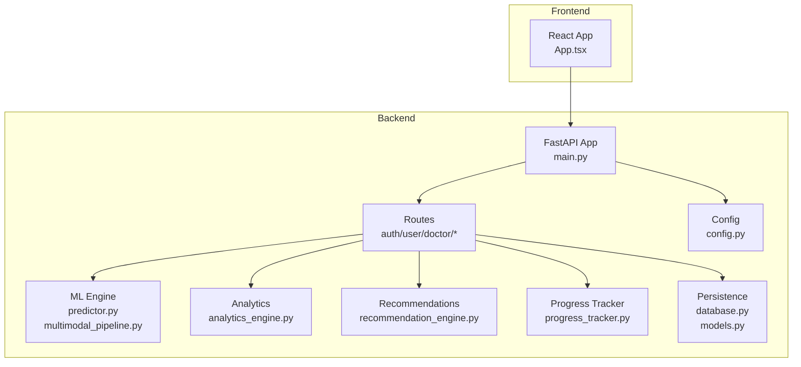
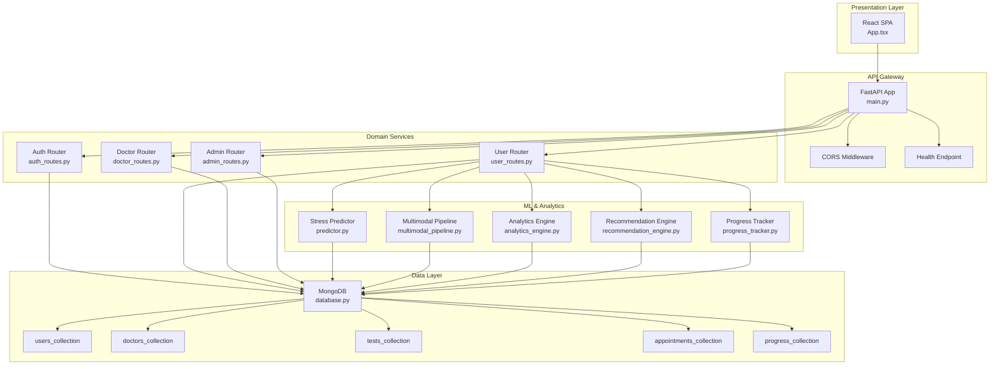
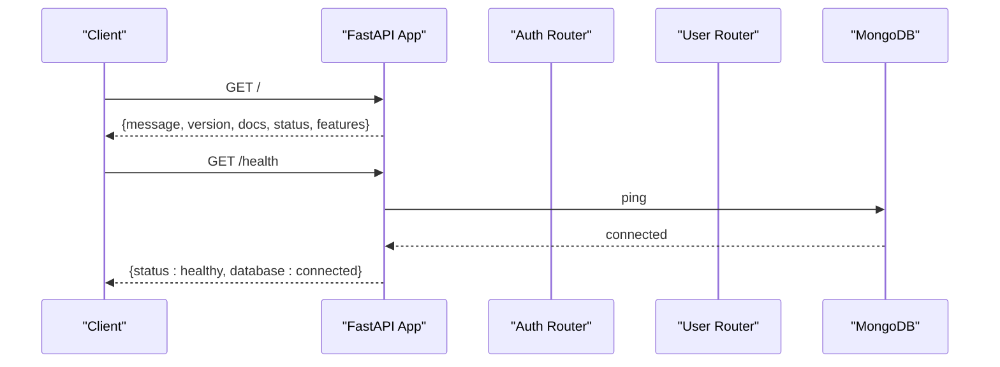
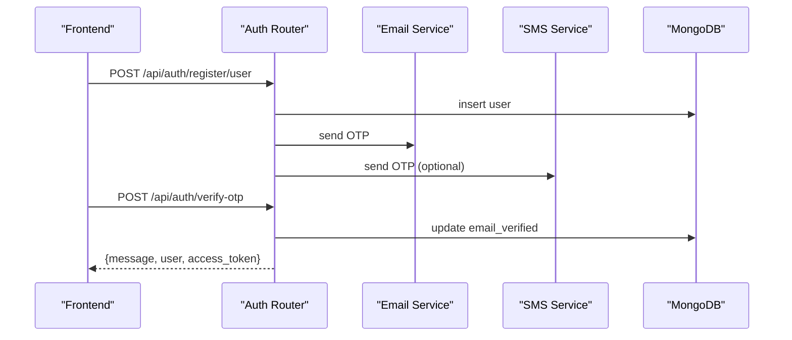
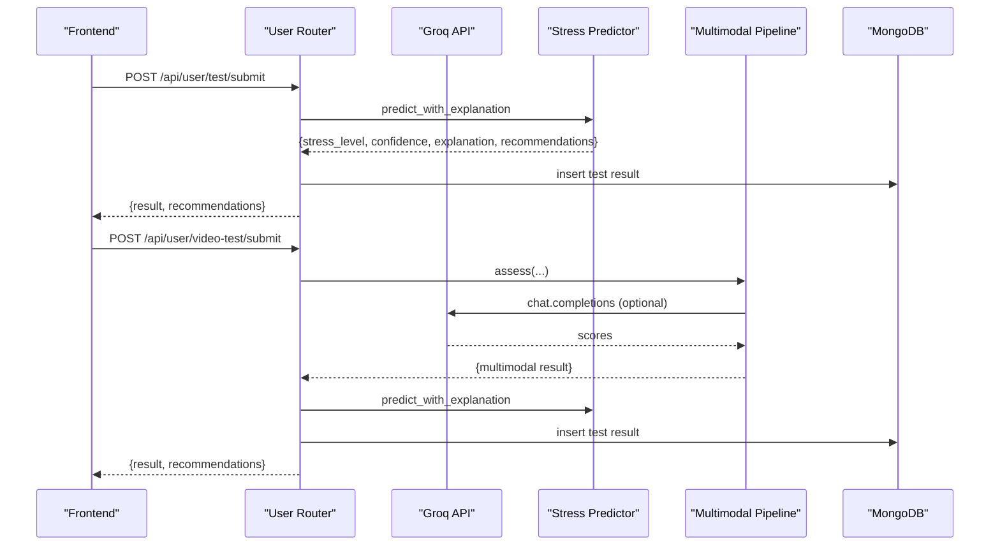
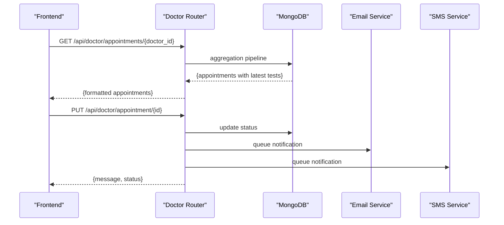
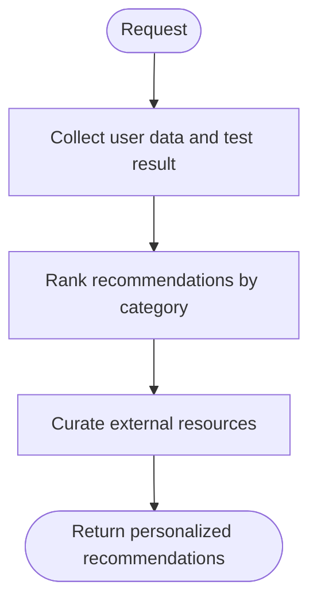
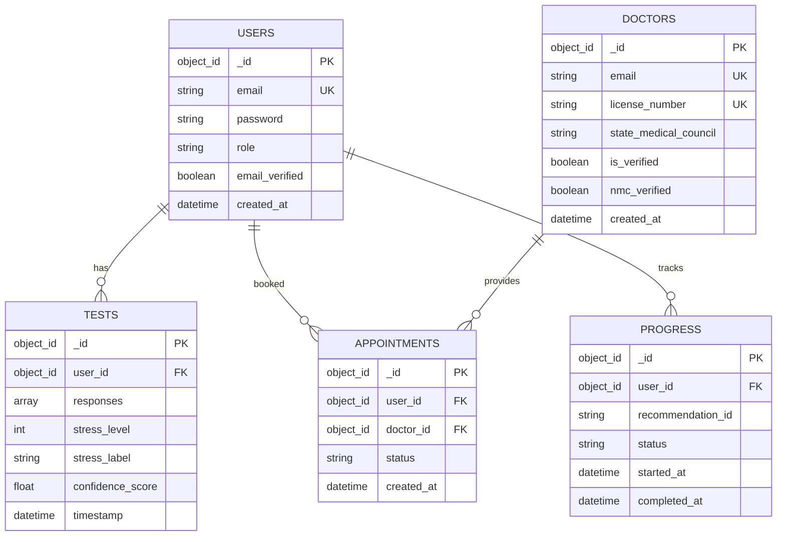
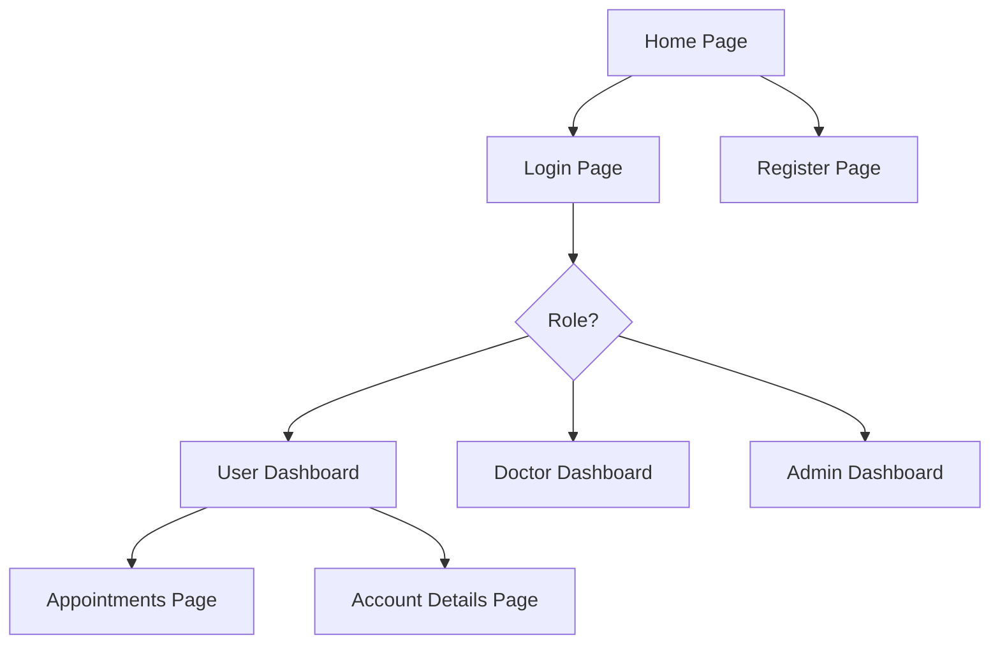
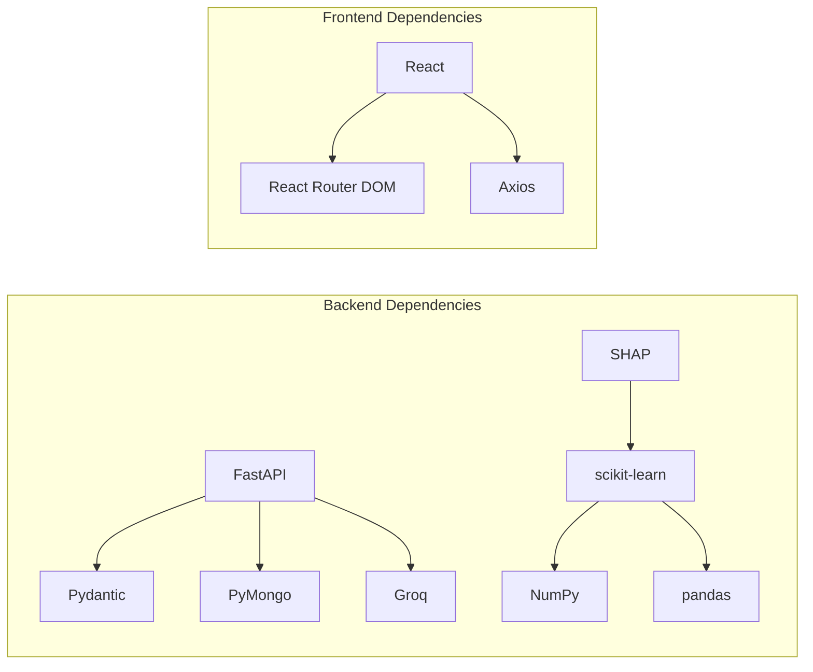

# Architecture Overview

<cite>
**Referenced Files in This Document**
- [backend/app/main.py](file://backend/app/main.py)
- [backend/app/config.py](file://backend/app/config.py)
- [backend/app/database.py](file://backend/app/database.py)
- [backend/app/models.py](file://backend/app/models.py)
- [backend/app/routers/auth_routes.py](file://backend/app/routes/auth_routes.py)
- [backend/app/routers/user_routes.py](file://backend/app/routes/user_routes.py)
- [backend/app/routers/doctor_routes.py](file://backend/app/routes/doctor_routes.py)
- [backend/app/analytics_engine.py](file://backend/app/analytics_engine.py)
- [backend/app/recommendation_engine.py](file://backend/app/recommendation_engine.py)
- [backend/app/progress_tracker.py](file://backend/app/progress_tracker.py)
- [backend/ml_model/predictor.py](file://backend/ml_model/predictor.py)
- [backend/ml_model/multimodal_pipeline.py](file://backend/ml_model/multimodal_pipeline.py)
- [frontend/src/App.tsx](file://frontend/src/App.tsx)
- [frontend/package.json](file://frontend/package.json)
- [backend/requirements.txt](file://backend/requirements.txt)
</cite>

## Table of Contents
1. [Introduction](#introduction)
2. [Project Structure](#project-structure)
3. [Core Components](#core-components)
4. [Architecture Overview](#architecture-overview)
5. [Detailed Component Analysis](#detailed-component-analysis)
6. [Dependency Analysis](#dependency-analysis)
7. [Performance Considerations](#performance-considerations)
8. [Troubleshooting Guide](#troubleshooting-guide)
9. [Conclusion](#conclusion)

## Introduction
This document presents the architecture of the AI Stress Level Analyzer system, a FastAPI-powered backend integrated with a React-based frontend. The system follows a three-tier architecture:
- Presentation tier: React SPA with protected routing and role-based navigation
- Application tier: FastAPI with modular route handlers organized by functional domain
- Data tier: MongoDB with connection pooling, indexing, and administrative utilities

The system emphasizes modularity, scalability, and maintainability through:
- Microservices-style API organization with dedicated routers for authentication, user, doctor, and admin domains
- A machine learning inference engine supporting both questionnaire-based and multimodal audio/video assessments
- An analytics engine for population-level insights and doctor effectiveness metrics
- A recommendation engine with personalization and gamification via a progress tracker

Integration points include:
- External AI service via Groq for LLM-based verbal-to-score conversion
- Email and SMS notification services for user lifecycle events
- Administrative controls for database initialization and maintenance

## Project Structure
The repository is split into two primary directories:
- backend: FastAPI application, route handlers, ML models, analytics, and persistence layer
- frontend: React SPA with routing, protected routes, and UI components

**Diagram sources**
- [backend/app/main.py:52-80](file://backend/app/main.py#L52-L80)
- [backend/app/routes/auth_routes.py:32-78](file://backend/app/routes/auth_routes.py#L32-L78)
- [backend/app/routes/user_routes.py:32-39](file://backend/app/routes/user_routes.py#L32-L39)
- [backend/app/routes/doctor_routes.py:22-22](file://backend/app/routes/doctor_routes.py#L22-L22)
- [backend/app/analytics_engine.py:11-19](file://backend/app/analytics_engine.py#L11-L19)
- [backend/app/recommendation_engine.py:11-16](file://backend/app/recommendation_engine.py#L11-L16)
- [backend/app/progress_tracker.py:48-49](file://backend/app/progress_tracker.py#L48-L49)
- [backend/app/database.py:26-46](file://backend/app/database.py#L26-L46)
- [backend/app/models.py:1-20](file://backend/app/models.py#L1-L20)
- [backend/app/config.py:3-22](file://backend/app/config.py#L3-L22)
- [frontend/src/App.tsx:1-88](file://frontend/src/App.tsx#L1-L88)

**Section sources**
- [backend/app/main.py:52-80](file://backend/app/main.py#L52-L80)
- [frontend/src/App.tsx:1-88](file://frontend/src/App.tsx#L1-L88)

## Core Components
- FastAPI Application: Initializes CORS, includes modular routers, sets up database connections, and exposes health checks.
- Route Handlers: Modular routers under /api/auth, /api/user, /api/doctor, and optional admin routes, each encapsulating domain-specific logic.
- Machine Learning Engine: Local predictor with SHAP explanations and multimodal fusion pipeline integrating audio, text, and auxiliary signals.
- Analytics Engine: Aggregates platform-wide insights, doctor effectiveness, and user-level analytics.
- Recommendation Engine: Personalized, categorized recommendations with ranking and resource curation.
- Progress Tracker: Gamification and achievement tracking with streaks, badges, and level progression.
- Persistence Layer: MongoDB with connection pooling, extensive indexing, and admin initialization utilities.
- Frontend: React SPA with protected routing, role-based access, and navigation.

**Section sources**
- [backend/app/main.py:52-132](file://backend/app/main.py#L52-L132)
- [backend/app/database.py:26-505](file://backend/app/database.py#L26-L505)
- [backend/app/models.py:1-440](file://backend/app/models.py#L1-L440)
- [backend/app/analytics_engine.py:11-384](file://backend/app/analytics_engine.py#L11-L384)
- [backend/app/recommendation_engine.py:11-554](file://backend/app/recommendation_engine.py#L11-L554)
- [backend/app/progress_tracker.py:48-454](file://backend/app/progress_tracker.py#L48-L454)
- [backend/ml_model/predictor.py:32-590](file://backend/ml_model/predictor.py#L32-L590)
- [backend/ml_model/multimodal_pipeline.py:11-183](file://backend/ml_model/multimodal_pipeline.py#L11-L183)
- [frontend/src/App.tsx:16-88](file://frontend/src/App.tsx#L16-L88)

## Architecture Overview
The system employs a layered, modular design with clear separation of concerns:
- Presentation Layer: React SPA handles user interactions, protected routing, and role-based navigation.
- API Gateway: FastAPI centralizes request routing, authentication, and cross-cutting concerns like CORS and health checks.
- Domain Services: Modular route handlers encapsulate business logic for authentication, user assessments, doctor operations, and admin tasks.
- Machine Learning Inference: Dedicated ML modules provide robust prediction capabilities with explainability and multimodal fusion.
- Analytics and Recommendations: Engines deliver insights and personalization to improve user outcomes.
- Data Access: MongoDB with connection pooling, indexes, and administrative utilities ensures reliable persistence.

**Diagram sources**
- [backend/app/main.py:52-132](file://backend/app/main.py#L52-L132)
- [backend/app/routes/auth_routes.py:32-78](file://backend/app/routes/auth_routes.py#L32-L78)
- [backend/app/routes/user_routes.py:32-39](file://backend/app/routes/user_routes.py#L32-L39)
- [backend/app/routes/doctor_routes.py:22-22](file://backend/app/routes/doctor_routes.py#L22-L22)
- [backend/app/analytics_engine.py:11-19](file://backend/app/analytics_engine.py#L11-L19)
- [backend/app/recommendation_engine.py:11-16](file://backend/app/recommendation_engine.py#L11-L16)
- [backend/app/progress_tracker.py:48-49](file://backend/app/progress_tracker.py#L48-L49)
- [backend/app/database.py:88-159](file://backend/app/database.py#L88-L159)
- [backend/ml_model/predictor.py:32-46](file://backend/ml_model/predictor.py#L32-L46)
- [backend/ml_model/multimodal_pipeline.py:11-12](file://backend/ml_model/multimodal_pipeline.py#L11-L12)

## Detailed Component Analysis

### Backend Entry Point and Routing
- FastAPI app initializes environment variables, loads configuration, sets up CORS, includes modular routers, and registers startup/shutdown hooks for database initialization and cleanup.
- Health endpoint validates database connectivity.

**Diagram sources**
- [backend/app/main.py:99-132](file://backend/app/main.py#L99-L132)
- [backend/app/database.py:43-46](file://backend/app/database.py#L43-L46)

**Section sources**
- [backend/app/main.py:52-132](file://backend/app/main.py#L52-L132)

### Authentication and User Lifecycle
- Registration supports user and doctor accounts with OTP verification, email/SMS notifications, and NMC verification for doctors.
- Login enforces email verification and doctor approval checks.
- Forgot password flow uses OTP verification with atomic consumption of verified codes.

**Diagram sources**
- [backend/app/routes/auth_routes.py:68-132](file://backend/app/routes/auth_routes.py#L68-L132)
- [backend/app/routes/auth_routes.py:236-304](file://backend/app/routes/auth_routes.py#L236-L304)

**Section sources**
- [backend/app/routes/auth_routes.py:68-304](file://backend/app/routes/auth_routes.py#L68-L304)

### User Stress Assessment and Prediction
- Supports traditional questionnaire submission and multimodal video assessment with optional audio, facial, and sentiment features.
- Integrates Groq LLM for verbal-to-score conversion with fallbacks to keyword scoring and neural scorer.
- Generates SHAP-based explanations, category-level scores, risk factor identification, and trend/crisis analysis.

**Diagram sources**
- [backend/app/routes/user_routes.py:407-499](file://backend/app/routes/user_routes.py#L407-L499)
- [backend/app/routes/user_routes.py:308-400](file://backend/app/routes/user_routes.py#L308-L400)
- [backend/ml_model/predictor.py:119-185](file://backend/ml_model/predictor.py#L119-L185)
- [backend/ml_model/multimodal_pipeline.py:74-179](file://backend/ml_model/multimodal_pipeline.py#L74-L179)

**Section sources**
- [backend/app/routes/user_routes.py:125-400](file://backend/app/routes/user_routes.py#L125-L400)
- [backend/ml_model/predictor.py:119-590](file://backend/ml_model/predictor.py#L119-L590)
- [backend/ml_model/multimodal_pipeline.py:74-183](file://backend/ml_model/multimodal_pipeline.py#L74-L183)

### Doctor Operations and Notifications
- Doctor endpoints aggregate appointments with patient test histories in a single optimized query.
- Appointment status updates trigger asynchronous email/SMS notifications.

**Diagram sources**
- [backend/app/routes/doctor_routes.py:48-134](file://backend/app/routes/doctor_routes.py#L48-L134)
- [backend/app/routes/doctor_routes.py:171-267](file://backend/app/routes/doctor_routes.py#L171-L267)

**Section sources**
- [backend/app/routes/doctor_routes.py:48-267](file://backend/app/routes/doctor_routes.py#L48-L267)

### Analytics and Recommendation Engines
- Analytics engine computes platform-wide statistics, daily trends, location-based insights, peak hours, age distributions, and doctor effectiveness.
- Recommendation engine personalizes actionable items across categories (immediate, daily, weekly, lifestyle, professional) with ranking and curated resources.

**Diagram sources**
- [backend/app/analytics_engine.py:20-199](file://backend/app/analytics_engine.py#L20-L199)
- [backend/app/recommendation_engine.py:17-58](file://backend/app/recommendation_engine.py#L17-L58)

**Section sources**
- [backend/app/analytics_engine.py:20-384](file://backend/app/analytics_engine.py#L20-L384)
- [backend/app/recommendation_engine.py:17-554](file://backend/app/recommendation_engine.py#L17-L554)

### Persistence and Indexing Strategy
- MongoDB connection pooling with timeouts and retry writes.
- Extensive indexing on user, doctor, test, appointment, progress, achievement, and medical record collections.
- Admin initialization and database statistics utilities.

**Diagram sources**
- [backend/app/database.py:88-159](file://backend/app/database.py#L88-L159)
- [backend/app/models.py:16-123](file://backend/app/models.py#L16-L123)

**Section sources**
- [backend/app/database.py:26-505](file://backend/app/database.py#L26-L505)
- [backend/app/models.py:16-123](file://backend/app/models.py#L16-L123)

### Frontend Integration and Navigation
- React SPA with protected routes enforcing role-based access.
- Router configuration defines public and authenticated paths for user, doctor, and admin dashboards.

**Diagram sources**
- [frontend/src/App.tsx:30-88](file://frontend/src/App.tsx#L30-L88)

**Section sources**
- [frontend/src/App.tsx:16-88](file://frontend/src/App.tsx#L16-L88)

## Dependency Analysis
- Backend dependencies include FastAPI, Pydantic, PyMongo, scikit-learn, NumPy, pandas, python-dotenv, Groq SDK, SHAP, and report generation libraries.
- Frontend dependencies include React, React Router DOM, Axios, and Tailwind CSS toolchain.

**Diagram sources**
- [backend/requirements.txt:1-22](file://backend/requirements.txt#L1-L22)
- [frontend/package.json:10-26](file://frontend/package.json#L10-L26)

**Section sources**
- [backend/requirements.txt:1-22](file://backend/requirements.txt#L1-L22)
- [frontend/package.json:10-26](file://frontend/package.json#L10-L26)

## Performance Considerations
- Database connection pooling and timeouts minimize latency and improve concurrency.
- Extensive indexing on frequently queried fields accelerates reads for user profiles, test history, appointments, and medical records.
- Aggregation pipelines reduce round-trips and N+1 query patterns for doctor appointment listings.
- Asynchronous notifications decouple user experience from email/SMS processing.
- Model integrity checks and automatic retraining ensure ML reliability without manual intervention.

[No sources needed since this section provides general guidance]

## Troubleshooting Guide
- Database connectivity issues: Use the health endpoint to verify MongoDB availability and connection parameters.
- Authentication failures: Ensure OTP verification is completed and email verification is enabled for non-admin roles.
- ML prediction errors: Validate model integrity hashes and confirm model files exist; the system auto-reloads or retrains when necessary.
- Notification failures: Check email/SMS service configurations and logs for async delivery errors.

**Section sources**
- [backend/app/main.py:114-132](file://backend/app/main.py#L114-L132)
- [backend/app/database.py:43-54](file://backend/app/database.py#L43-L54)
- [backend/app/routes/auth_routes.py:236-304](file://backend/app/routes/auth_routes.py#L236-L304)
- [backend/ml_model/predictor.py:81-98](file://backend/ml_model/predictor.py#L81-L98)

## Conclusion
The AI Stress Level Analyzer system demonstrates a well-structured, modular architecture that balances scalability, maintainability, and user-centric outcomes. The FastAPI backend organizes functionality into cohesive routers, while the React frontend delivers a responsive, role-aware experience. The ML inference engine, analytics, and recommendation systems work together to provide actionable insights and personalized support. Robust persistence with connection pooling and indexing, combined with asynchronous notifications and admin utilities, ensures reliable operation at scale.