# AI Chatbot Functionality

<cite>
**Referenced Files in This Document**
- [main.py](file://backend/app/main.py)
- [user_routes.py](file://backend/app/routes/user_routes.py)
- [models.py](file://backend/app/models.py)
- [recommendation_engine.py](file://backend/app/recommendation_engine.py)
- [progress_tracker.py](file://backend/app/progress_tracker.py)
- [predictor.py](file://backend/ml_model/predictor.py)
- [multimodal_pipeline.py](file://backend/ml_model/multimodal_pipeline.py)
- [audio_stress_predictor.py](file://backend/ml_model/audio_stress_predictor.py)
- [api.ts](file://frontend/src/services/api.ts)
- [UserDashboard.tsx](file://frontend/src/pages/UserDashboard.tsx)
</cite>

## Table of Contents
1. [Introduction](#introduction)
2. [System Architecture](#system-architecture)
3. [Groq AI API Integration](#groq-ai-api-integration)
4. [Conversation Flow Management](#conversation-flow-management)
5. [Sentiment Analysis Capabilities](#sentiment-analysis-capabilities)
6. [Real-time Stress Detection Algorithms](#real-time-stress-detection-algorithms)
7. [Response Generation Logic](#response-generation-logic)
8. [Contextual Awareness Features](#contextual-awareness-features)
9. [Chatbot Role in Stress Counseling](#chatbot-role-in-stress-counseling)
10. [Crisis Intervention Protocols](#crisis-intervention-protocols)
11. [Escalation Procedures](#escalation-procedures)
12. [Conversation State Management](#conversation-state-management)
13. [Message Routing](#message-routing)
14. [Integration with User Assessment System](#integration-with-user-assessment-system)
15. [Personalized Stress Management Advice](#personalized-stress-management-advice)
16. [Resource Connection Features](#resource-connection-features)
17. [Performance Considerations](#performance-considerations)
18. [Troubleshooting Guide](#troubleshooting-guide)
19. [Conclusion](#conclusion)

## Introduction

The AI chatbot system integrated with the stress detection platform represents a comprehensive solution for mental health support and stress management. This system combines advanced machine learning algorithms with real-time AI assistance to provide personalized stress counseling, crisis intervention, and ongoing support for users experiencing stress-related challenges.

The platform leverages a multi-modal approach that analyzes user conversations, integrates with existing stress assessment data, and utilizes sophisticated AI models to deliver intelligent, context-aware responses. The chatbot serves as both a therapeutic companion and a gateway to professional care when needed.

## System Architecture

The AI chatbot system follows a microservices architecture with clear separation of concerns between the web interface, backend API, machine learning models, and external integrations.

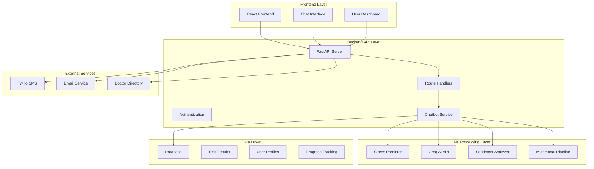

**Diagram sources**
- [main.py:52-80](file://backend/app/main.py#L52-L80)
- [user_routes.py:1055-1172](file://backend/app/routes/user_routes.py#L1055-L1172)

The architecture ensures scalability, maintainability, and robust integration between all components while maintaining user privacy and security standards.

**Section sources**
- [main.py:1-137](file://backend/app/main.py#L1-L137)
- [user_routes.py:1055-1172](file://backend/app/routes/user_routes.py#L1055-L1172)

## Groq AI API Integration

The chatbot leverages the Groq AI API for real-time conversation processing and stress level detection. The integration includes intelligent model selection, fallback mechanisms, and comprehensive error handling.

### Model Selection and Fallback Strategy

The system implements a sophisticated model selection mechanism that prioritizes the most suitable AI models for optimal performance:

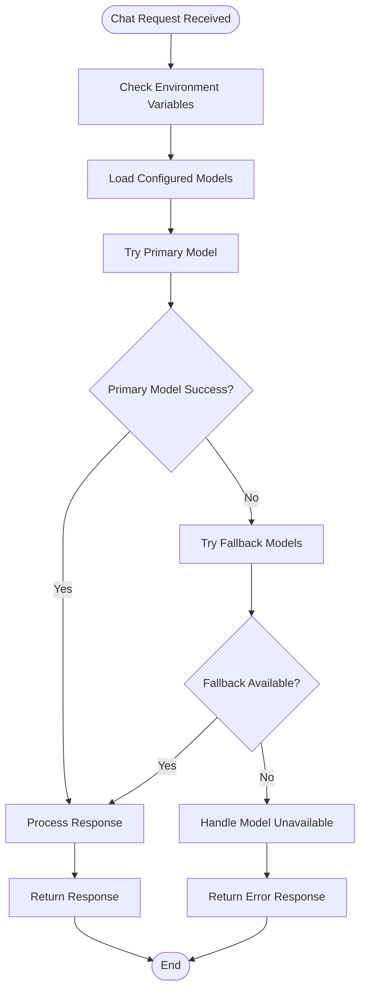

**Diagram sources**
- [user_routes.py:131-144](file://backend/app/routes/user_routes.py#L131-L144)
- [user_routes.py:1099-1122](file://backend/app/routes/user_routes.py#L1099-L1122)

### API Configuration and Security

The Groq integration includes comprehensive security measures and configuration management:

- **Environment-based Configuration**: Models are configured through environment variables for flexibility and security
- **API Key Management**: Secure handling of API keys with proper validation and error reporting
- **Rate Limiting**: Built-in protection against excessive API calls
- **Timeout Handling**: Graceful degradation when API calls exceed timeout limits

**Section sources**
- [user_routes.py:125-144](file://backend/app/routes/user_routes.py#L125-L144)
- [user_routes.py:1059-1064](file://backend/app/routes/user_routes.py#L1059-L1064)

## Conversation Flow Management

The chatbot implements sophisticated conversation flow management that adapts to user needs, maintains context awareness, and provides structured therapeutic interactions.

### Conversation State Tracking

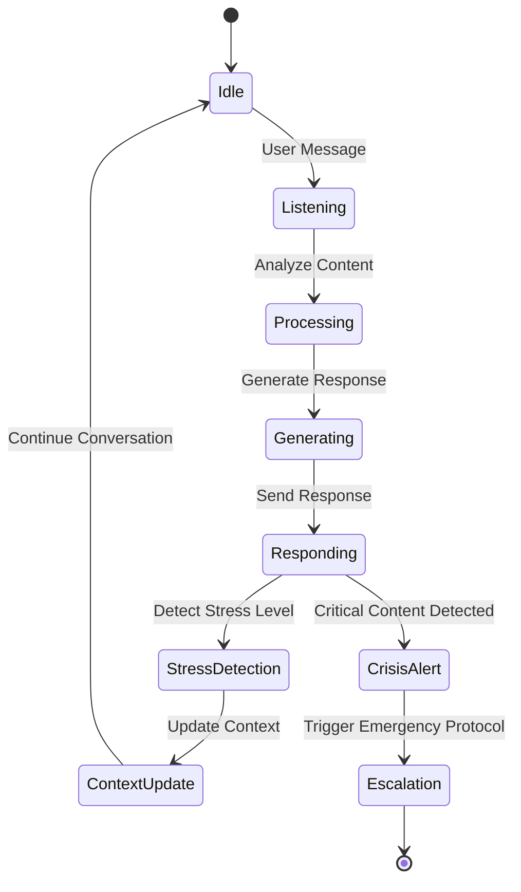

**Diagram sources**
- [user_routes.py:1055-1172](file://backend/app/routes/user_routes.py#L1055-L1172)
- [predictor.py:486-542](file://backend/ml_model/predictor.py#L486-L542)

### Context Preservation and Enhancement

The system maintains conversation context through multiple mechanisms:

- **Recent Test History Integration**: Automatically incorporates user's latest stress assessment results
- **Temporal Context**: Maintains conversation flow and topic continuity
- **User Profile Context**: References user demographics and preferences
- **Session Memory**: Tracks conversation progression and user engagement patterns

**Section sources**
- [user_routes.py:1070-1079](file://backend/app/routes/user_routes.py#L1070-L1079)
- [user_routes.py:1124-1165](file://backend/app/routes/user_routes.py#L1124-L1165)

## Sentiment Analysis Capabilities

The chatbot incorporates advanced sentiment analysis to detect emotional states, identify potential crisis situations, and adapt response strategies accordingly.

### Multi-layered Sentiment Detection

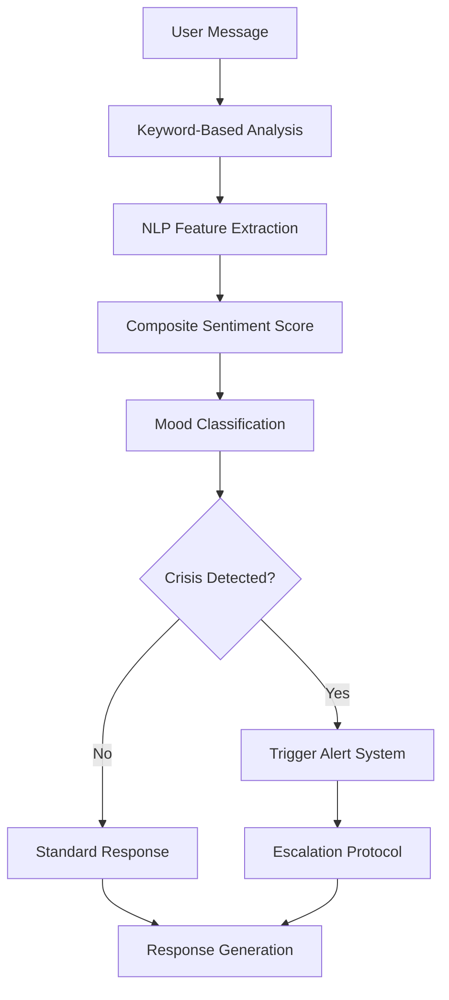

**Diagram sources**
- [predictor.py:486-542](file://backend/ml_model/predictor.py#L486-L542)

### Crisis Detection and Response

The sentiment analysis system includes sophisticated crisis detection mechanisms:

- **Suicidal Ideation Detection**: Identifies potentially dangerous language patterns
- **Emergency Signal Recognition**: Detects immediate danger indicators
- **Risk Assessment Scoring**: Quantifies crisis severity levels
- **Automatic Escalation**: Triggers appropriate intervention protocols

**Section sources**
- [predictor.py:491-542](file://backend/ml_model/predictor.py#L491-L542)
- [user_routes.py:1132-1158](file://backend/app/routes/user_routes.py#L1132-L1158)

## Real-time Stress Detection Algorithms

The system employs sophisticated algorithms to detect and assess stress levels during chat interactions, combining multiple data sources for comprehensive analysis.

### Stress Level Classification System

The real-time stress detection operates on a four-point scale:

| Stress Level | Description | Numerical Range | Confidence Threshold |
|--------------|-------------|-----------------|---------------------|
| 0 | Low | 0.0 - 0.25 | High |
| 1 | Moderate | 0.25 - 0.50 | Medium-High |
| 2 | High | 0.50 - 0.75 | Medium |
| 3 | Severe | 0.75 - 1.0 | Low-Medium |

### Detection Methodology

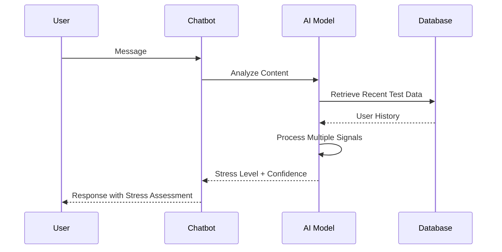

**Diagram sources**
- [user_routes.py:1070-1079](file://backend/app/routes/user_routes.py#L1070-L1079)
- [user_routes.py:1124-1165](file://backend/app/routes/user_routes.py#L1124-L1165)

**Section sources**
- [user_routes.py:1092-1094](file://backend/app/routes/user_routes.py#L1092-L1094)
- [predictor.py:486-542](file://backend/ml_model/predictor.py#L486-L542)

## Response Generation Logic

The chatbot's response generation system combines AI intelligence with therapeutic guidelines to provide effective, personalized support.

### Response Processing Pipeline

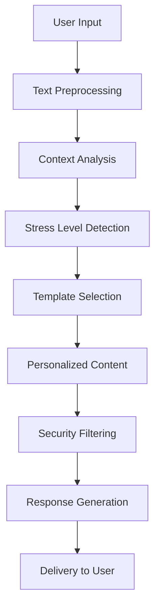

**Diagram sources**
- [user_routes.py:1081-1094](file://backend/app/routes/user_routes.py#L1081-L1094)
- [user_routes.py:1124-1165](file://backend/app/routes/user_routes.py#L1124-L1165)

### Therapeutic Response Guidelines

The system follows established CBT principles and therapeutic guidelines:

- **Empathetic Communication**: Maintains supportive, non-judgmental tone
- **CBT Integration**: Incorporates cognitive behavioral techniques when appropriate
- **Practical Coping Strategies**: Provides actionable stress management techniques
- **Professional Referral**: Encourages professional help for severe cases
- **Cultural Sensitivity**: Adapts responses to diverse backgrounds and contexts

**Section sources**
- [user_routes.py:1085-1090](file://backend/app/routes/user_routes.py#L1085-L1090)
- [user_routes.py:1160-1165](file://backend/app/routes/user_routes.py#L1160-L1165)

## Contextual Awareness Features

The chatbot maintains comprehensive contextual awareness to provide relevant, timely responses that consider the user's complete situation.

### Multi-dimensional Context Integration

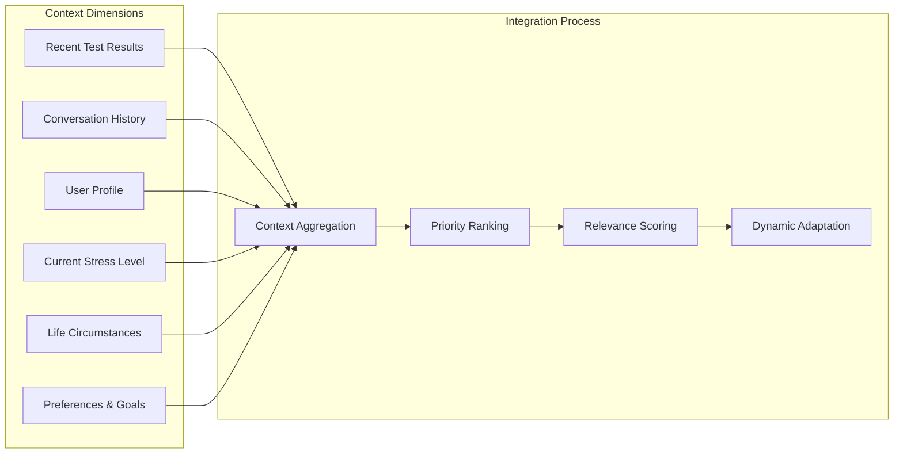

**Diagram sources**
- [user_routes.py:1070-1079](file://backend/app/routes/user_routes.py#L1070-L1079)
- [recommendation_engine.py:17-58](file://backend/app/recommendation_engine.py#L17-L58)

### Dynamic Context Updates

The system continuously updates context based on:

- **Conversation Progression**: Tracks evolving topics and user interests
- **Stress Level Changes**: Adapts responses based on detected stress patterns
- **User Feedback**: Incorporates explicit user preferences and feedback
- **Temporal Factors**: Considers time-sensitive circumstances and life events

**Section sources**
- [user_routes.py:1075-1079](file://backend/app/routes/user_routes.py#L1075-L1079)
- [recommendation_engine.py:33-46](file://backend/app/recommendation_engine.py#L33-L46)

## Chatbot Role in Stress Counseling

The AI chatbot serves as a comprehensive stress counseling companion, providing therapeutic support while maintaining appropriate boundaries and professional standards.

### Therapeutic Functions

The chatbot performs multiple therapeutic roles:

- **Active Listening**: Provides undivided attention to user concerns
- **Emotional Support**: Offers empathy and understanding during difficult times
- **Stress Education**: Teaches stress recognition and management techniques
- **Goal Setting**: Helps users establish realistic, achievable stress management goals
- **Progress Monitoring**: Tracks improvement and celebrates milestones

### Professional Boundaries

The system maintains clear professional boundaries:

- **Non-Diagnostic Capability**: Cannot replace professional diagnosis or treatment
- **Referral Promotion**: Encourages professional help when indicated
- **Crisis Protocol**: Has established protocols for emergency situations
- **Confidentiality Assurance**: Protects user privacy and sensitive information

**Section sources**
- [user_routes.py:1081-1090](file://backend/app/routes/user_routes.py#L1081-L1090)
- [recommendation_engine.py:334-342](file://backend/app/recommendation_engine.py#L334-L342)

## Crisis Intervention Protocols

The system includes comprehensive crisis intervention protocols designed to identify and respond to emergency situations effectively.

### Crisis Detection Mechanisms

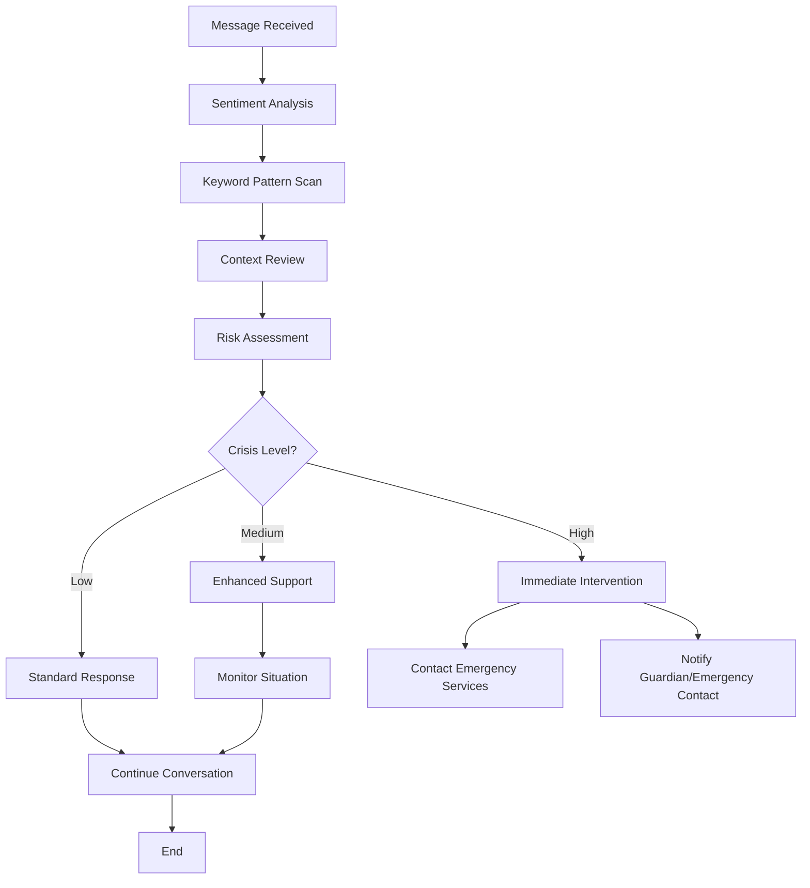

**Diagram sources**
- [predictor.py:486-542](file://backend/ml_model/predictor.py#L486-L542)
- [predictor.py:472-484](file://backend/ml_model/predictor.py#L472-L484)

### Intervention Levels

The system implements tiered intervention approaches:

- **Level 1 (Low Risk)**: Standard supportive responses with gentle guidance
- **Level 2 (Medium Risk)**: Enhanced monitoring and additional support resources
- **Level 3 (High Risk)**: Immediate emergency contact and professional intervention

**Section sources**
- [predictor.py:472-484](file://backend/ml_model/predictor.py#L472-L484)
- [user_routes.py:1132-1158](file://backend/app/routes/user_routes.py#L1132-L1158)

## Escalation Procedures

The escalation procedures ensure appropriate care is provided when users require more intensive support than the AI chatbot can offer.

### Escalation Triggers

Escalation occurs when any of the following conditions are met:

- **Crisis Detection**: Clear indication of suicidal ideation or immediate danger
- **Severe Stress Patterns**: Persistent severe stress with no improvement
- **Clinical Indicators**: Signs of clinical depression or anxiety disorders
- **User Request**: Explicit request for professional help
- **Safety Concerns**: Evidence of harm to self or others

### Escalation Workflow

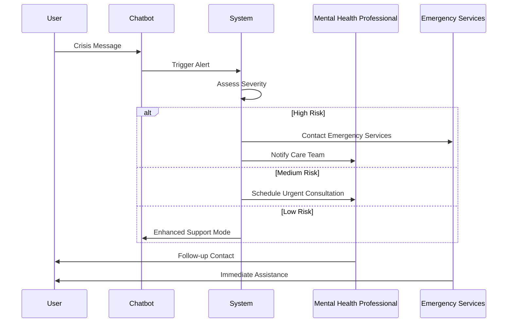

**Diagram sources**
- [predictor.py:472-484](file://backend/ml_model/predictor.py#L472-L484)
- [user_routes.py:1115-1122](file://backend/app/routes/user_routes.py#L1115-L1122)

**Section sources**
- [predictor.py:465-470](file://backend/ml_model/predictor.py#L465-L470)
- [user_routes.py:1115-1122](file://backend/app/routes/user_routes.py#L1115-L1122)

## Conversation State Management

The system maintains sophisticated conversation state management to ensure coherent, meaningful interactions that adapt to user needs and progress over time.

### State Components

The conversation state includes multiple interconnected components:

- **Message History**: Complete conversation transcript with timestamps
- **Context Variables**: Dynamic variables tracking conversation focus and themes
- **User Preferences**: Individualized preferences for communication style and topics
- **Stress Metrics**: Real-time stress level tracking and historical patterns
- **Goal Tracking**: Progress toward stress management objectives
- **Response Templates**: Contextually appropriate response templates and scripts

### State Persistence and Recovery

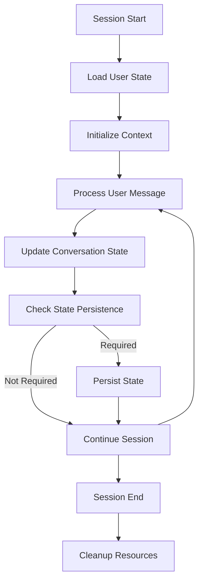

**Diagram sources**
- [user_routes.py:1055-1172](file://backend/app/routes/user_routes.py#L1055-L1172)
- [progress_tracker.py:135-165](file://backend/app/progress_tracker.py#L135-L165)

**Section sources**
- [user_routes.py:1055-1172](file://backend/app/routes/user_routes.py#L1055-L1172)
- [progress_tracker.py:131-134](file://backend/app/progress_tracker.py#L131-L134)

## Message Routing

The message routing system efficiently directs user communications through appropriate channels based on content, urgency, and user needs.

### Routing Logic

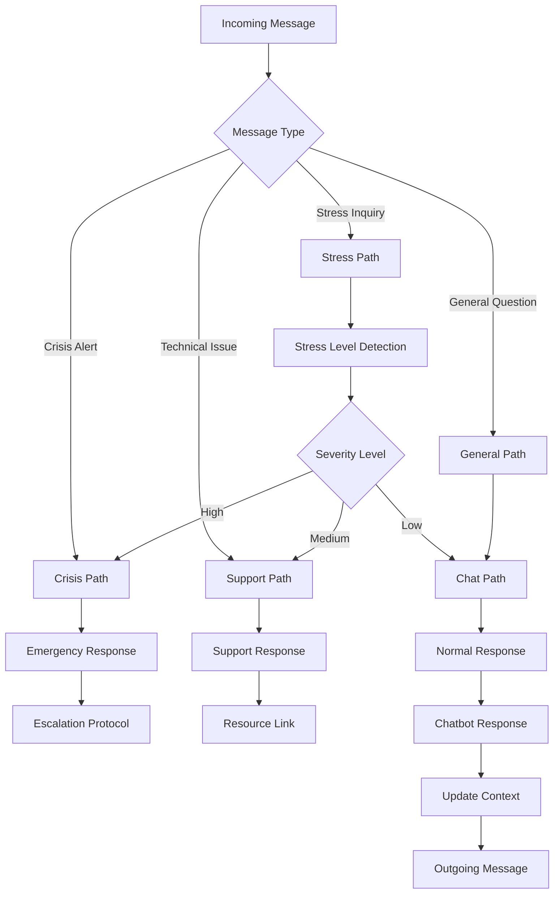

**Diagram sources**
- [user_routes.py:1055-1172](file://backend/app/routes/user_routes.py#L1055-L1172)
- [predictor.py:416-470](file://backend/ml_model/predictor.py#L416-L470)

### Priority Handling

The system implements priority-based routing:

- **Critical Messages**: Immediate processing for crisis situations
- **High Priority**: Urgent professional consultations and referrals
- **Medium Priority**: Standard support and general inquiries
- **Low Priority**: Administrative and non-urgent matters

**Section sources**
- [user_routes.py:1055-1172](file://backend/app/routes/user_routes.py#L1055-L1172)
- [predictor.py:416-470](file://backend/ml_model/predictor.py#L416-L470)

## Integration with User Assessment System

The chatbot seamlessly integrates with the comprehensive user assessment system to provide contextually informed responses based on historical data and current state.

### Assessment Data Integration

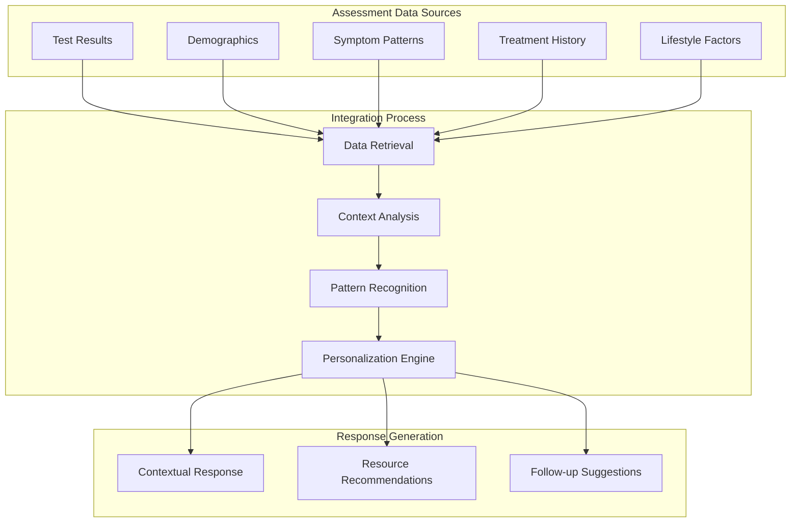

**Diagram sources**
- [user_routes.py:1070-1079](file://backend/app/routes/user_routes.py#L1070-L1079)
- [recommendation_engine.py:17-58](file://backend/app/recommendation_engine.py#L17-L58)

### Historical Context Utilization

The system leverages comprehensive historical data:

- **Stress Level Trends**: Analysis of stress patterns over time
- **Response Patterns**: Understanding of user communication styles
- **Treatment Effectiveness**: Evaluation of past interventions
- **Demographic Influences**: Age, gender, and cultural factors
- **Lifestyle Correlations**: Work, family, and environmental influences

**Section sources**
- [user_routes.py:1070-1079](file://backend/app/routes/user_routes.py#L1070-L1079)
- [recommendation_engine.py:33-46](file://backend/app/recommendation_engine.py#L33-L46)

## Personalized Stress Management Advice

The chatbot provides highly personalized stress management advice tailored to each user's unique circumstances, preferences, and progress.

### Personalization Framework

The personalization system considers multiple factors:

- **Individual Stress Triggers**: Identified patterns and situations
- **Preferred Coping Mechanisms**: Effective techniques discovered through interaction
- **Lifestyle Constraints**: Work schedule, family responsibilities, and physical limitations
- **Previous Treatment Responses**: What has worked or not worked in the past
- **Current Life Stage**: Age-appropriate and situationally relevant advice

### Advice Categories

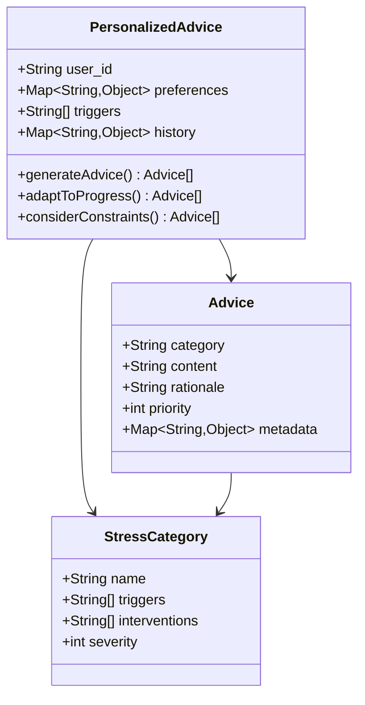

**Diagram sources**
- [recommendation_engine.py:17-58](file://backend/app/recommendation_engine.py#L17-L58)
- [recommendation_engine.py:308-361](file://backend/app/recommendation_engine.py#L308-L361)

### Dynamic Adaptation

The advice system continuously adapts based on:

- **User Feedback**: Direct input about what works and what doesn't
- **Progress Indicators**: Observable changes in stress patterns
- **Life Changes**: New circumstances affecting stress levels
- **Seasonal Variations**: Time-of-year influences on stress
- **External Events**: Major life events and stress triggers

**Section sources**
- [recommendation_engine.py:17-58](file://backend/app/recommendation_engine.py#L17-L58)
- [recommendation_engine.py:308-361](file://backend/app/recommendation_engine.py#L308-L361)

## Resource Connection Features

The chatbot facilitates connections to appropriate resources and support systems based on user needs and assessment results.

### Resource Discovery System

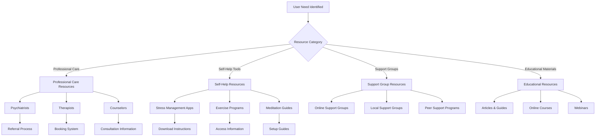

**Diagram sources**
- [recommendation_engine.py:327-385](file://backend/app/recommendation_engine.py#L327-L385)
- [recommendation_engine.py:453-489](file://backend/app/recommendation_engine.py#L453-L489)

### Resource Matching Algorithm

The system uses sophisticated algorithms to match users with appropriate resources:

- **Needs Assessment**: Comprehensive evaluation of user requirements
- **Resource Availability**: Real-time checking of resource capacity and availability
- **Geographic Proximity**: Location-based resource recommendations
- **Cost Considerations**: Budget-friendly option suggestions
- **Accessibility Factors**: Accommodation for disabilities and special needs

**Section sources**
- [recommendation_engine.py:327-385](file://backend/app/recommendation_engine.py#L327-L385)
- [recommendation_engine.py:453-489](file://backend/app/recommendation_engine.py#L453-L489)

## Performance Considerations

The chatbot system is designed for optimal performance under various load conditions while maintaining response quality and user experience.

### Scalability Features

- **Asynchronous Processing**: Non-blocking operations for improved responsiveness
- **Caching Strategies**: Intelligent caching of frequently accessed data
- **Load Balancing**: Distribution of requests across multiple processing instances
- **Resource Pooling**: Efficient management of external API connections
- **Memory Management**: Optimized memory usage for long conversation sessions

### Response Time Optimization

The system implements multiple strategies to minimize response latency:

- **Pre-warming**: Loading frequently used models and data in advance
- **Batch Processing**: Combining similar operations when possible
- **Edge Computing**: Proximity processing for geographic distribution
- **Compression**: Efficient data transmission and storage
- **Connection Reuse**: Maintaining persistent connections to external services

### Quality Assurance

- **Model Versioning**: Controlled deployment of AI model updates
- **A/B Testing**: Gradual rollout of new features and improvements
- **Performance Monitoring**: Real-time tracking of system performance metrics
- **Error Rate Tracking**: Continuous monitoring of system reliability
- **User Satisfaction Metrics**: Ongoing evaluation of response quality

## Troubleshooting Guide

Common issues and their solutions for the AI chatbot system.

### API Integration Issues

**Problem**: Groq API connection failures
**Solution**: 
- Verify API key configuration in environment variables
- Check network connectivity and firewall settings
- Monitor API rate limits and implement retry logic
- Validate model availability and configuration

**Problem**: Slow response times
**Solution**:
- Implement connection pooling for external API calls
- Add caching for frequently requested data
- Optimize model loading and initialization
- Monitor and scale server resources as needed

### Conversation State Issues

**Problem**: Context loss during conversations
**Solution**:
- Verify session management and state persistence
- Check database connectivity and performance
- Implement state synchronization across server instances
- Add state recovery mechanisms for failed sessions

**Problem**: Inconsistent stress level detection
**Solution**:
- Validate input data formatting and preprocessing
- Check model version consistency across environments
- Implement fallback mechanisms for model failures
- Add logging and monitoring for detection accuracy

### User Experience Issues

**Problem**: Chatbot responses seem generic or unhelpful
**Solution**:
- Review context integration and utilization
- Check sentiment analysis accuracy and thresholds
- Implement user feedback collection and analysis
- Add A/B testing for response optimization

**Problem**: Escalation protocol not triggering appropriately
**Solution**:
- Review crisis detection thresholds and criteria
- Check emergency contact configuration and connectivity
- Implement manual override capabilities for staff
- Add monitoring and alerting for missed escalations

**Section sources**
- [user_routes.py:1115-1122](file://backend/app/routes/user_routes.py#L1115-L1122)
- [predictor.py:486-542](file://backend/ml_model/predictor.py#L486-L542)

## Conclusion

The AI chatbot system integrated with the stress detection platform represents a comprehensive, scalable solution for mental health support. Through sophisticated AI integration, real-time stress detection, and personalized therapeutic approaches, the system provides valuable support for individuals managing stress-related challenges.

The system's strength lies in its multi-modal approach, combining conversational AI with established therapeutic principles and clinical expertise. The integration with the broader assessment and recommendation system ensures continuity of care and personalized support throughout the user's journey.

Key advantages of the system include:

- **Real-time Intelligence**: Advanced algorithms for immediate stress detection and response
- **Personalized Support**: Tailored interventions based on individual user profiles and needs
- **Professional Integration**: Seamless connection to professional care when indicated
- **Scalable Architecture**: Robust infrastructure supporting growth and increased demand
- **Privacy and Security**: Strong data protection measures maintaining user confidentiality

The chatbot system continues to evolve through ongoing research, user feedback, and technological advancement, ensuring it remains at the forefront of AI-powered mental health support solutions.