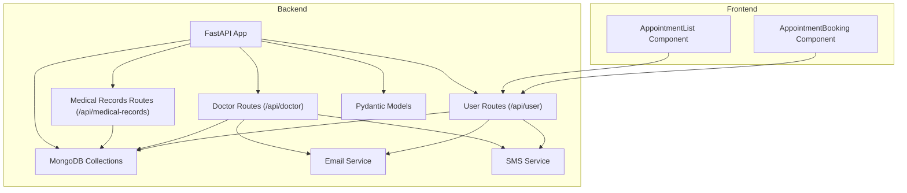
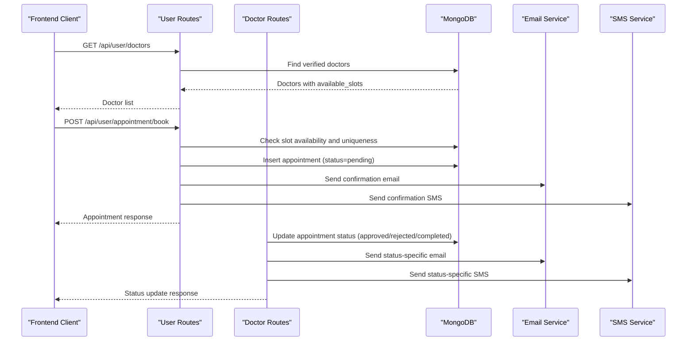
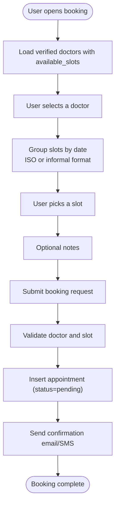
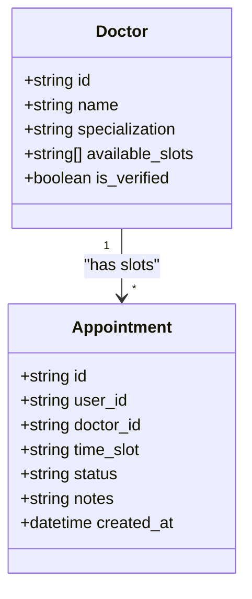
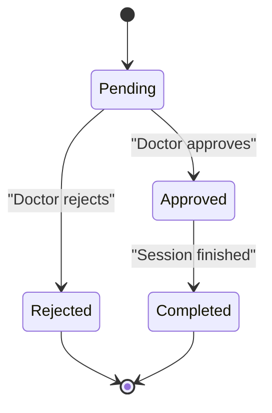
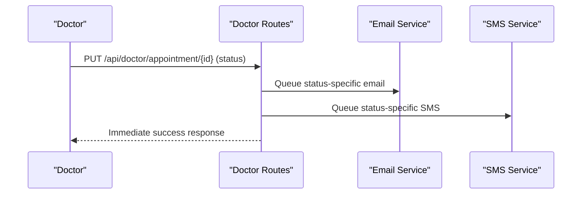
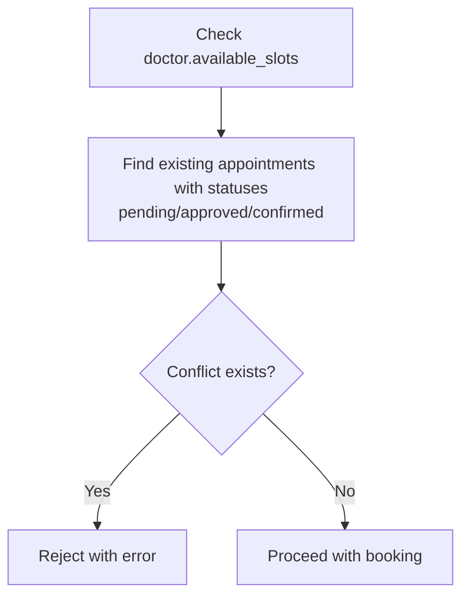
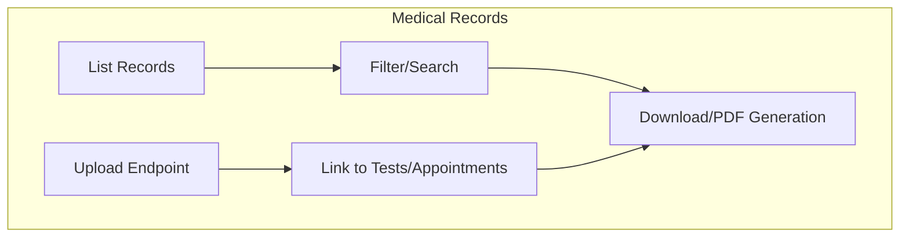
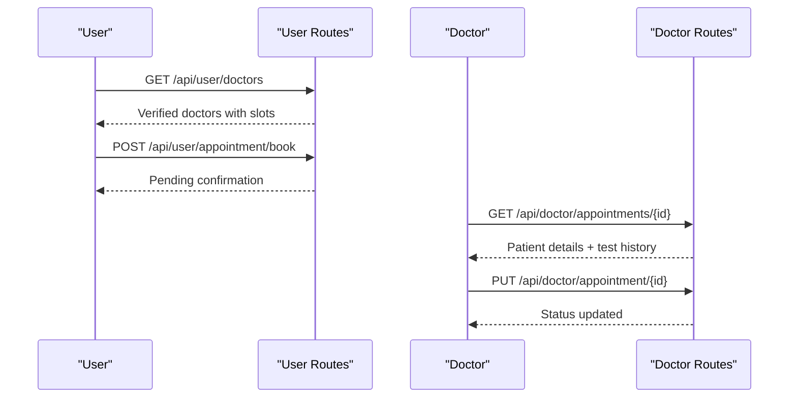
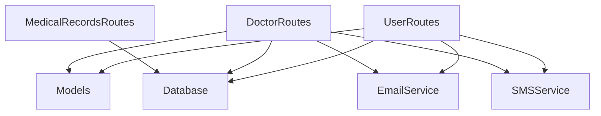

# Appointment Scheduling System

<cite>
**Referenced Files in This Document**
- [main.py](file://backend/app/main.py)
- [models.py](file://backend/app/models.py)
- [database.py](file://backend/app/database.py)
- [user_routes.py](file://backend/app/routes/user_routes.py)
- [doctor_routes.py](file://backend/app/routes/doctor_routes.py)
- [medical_records_routes.py](file://backend/app/routes/medical_records_routes.py)
- [email_service.py](file://backend/app/email_service.py)
- [sms_service.py](file://backend/app/sms_service.py)
- [analytics_engine.py](file://backend/app/analytics_engine.py)
- [AppointmentBooking.tsx](file://frontend/src/components/AppointmentBooking.tsx)
- [AppointmentList.tsx](file://frontend/src/components/AppointmentList.tsx)
</cite>

## Table of Contents
1. [Introduction](#introduction)
2. [Project Structure](#project-structure)
3. [Core Components](#core-components)
4. [Architecture Overview](#architecture-overview)
5. [Detailed Component Analysis](#detailed-component-analysis)
6. [Dependency Analysis](#dependency-analysis)
7. [Performance Considerations](#performance-considerations)
8. [Troubleshooting Guide](#troubleshooting-guide)
9. [Conclusion](#conclusion)

## Introduction
This document describes the doctor-patient appointment scheduling system within the AI Stress Detector platform. It covers the booking interface, availability management, calendar integration, appointment status tracking, notification system, capacity management, conflict resolution, and integration with the medical records system for pre-appointment preparation and post-appointment follow-up documentation. The system supports seamless workflows between user and doctor dashboards, ensuring secure, real-time communication and efficient scheduling.

## Project Structure
The system is built with a FastAPI backend and a React/TypeScript frontend. The backend organizes functionality by domain:
- Routes: `/api/user`, `/api/doctor`, `/api/medical-records`
- Models: Pydantic models for request/response validation
- Services: Email and SMS notification services
- Database: MongoDB collections for users, doctors, appointments, tests, and medical records
- Frontend: Components for booking and managing appointments

**Diagram sources**
- [main.py:52-79](file://backend/app/main.py#L52-L79)
- [user_routes.py:32-36](file://backend/app/routes/user_routes.py#L32-L36)
- [doctor_routes.py:22-22](file://backend/app/routes/doctor_routes.py#L22-L22)
- [medical_records_routes.py:40-41](file://backend/app/routes/medical_records_routes.py#L40-L41)

**Section sources**
- [main.py:52-137](file://backend/app/main.py#L52-L137)
- [user_routes.py:32-36](file://backend/app/routes/user_routes.py#L32-L36)
- [doctor_routes.py:22-22](file://backend/app/routes/doctor_routes.py#L22-L22)
- [medical_records_routes.py:40-41](file://backend/app/routes/medical_records_routes.py#L40-L41)

## Core Components
- Appointment Models: Define request/response structures for booking, updates, and status transitions.
- User Routes: Provide doctor discovery, appointment booking, and user appointment listing.
- Doctor Routes: Enable doctor-side appointment management with status updates and notifications.
- Medical Records Routes: Support uploading, organizing, and linking medical documents to appointments/tests.
- Notification Services: Asynchronous email and SMS delivery for appointment confirmations, approvals, rejections, and completions.
- Database Layer: MongoDB collections with optimized indexes for performance and scalability.

**Section sources**
- [models.py:95-114](file://backend/app/models.py#L95-L114)
- [user_routes.py:896-1049](file://backend/app/routes/user_routes.py#L896-L1049)
- [doctor_routes.py:48-364](file://backend/app/routes/doctor_routes.py#L48-L364)
- [medical_records_routes.py:149-500](file://backend/app/routes/medical_records_routes.py#L149-L500)
- [email_service.py:17-493](file://backend/app/email_service.py#L17-L493)
- [database.py:111-115](file://backend/app/database.py#L111-L115)

## Architecture Overview
The system follows a layered architecture:
- Presentation Layer: React components for user and doctor dashboards
- Application Layer: FastAPI routes handling business logic
- Domain Layer: Models and services for notifications and analytics
- Data Access Layer: MongoDB collections with indexing and connection pooling

**Diagram sources**
- [user_routes.py:896-1049](file://backend/app/routes/user_routes.py#L896-L1049)
- [doctor_routes.py:171-267](file://backend/app/routes/doctor_routes.py#L171-L267)
- [email_service.py:235-429](file://backend/app/email_service.py#L235-L429)
- [sms_service.py:154-192](file://backend/app/sms_service.py#L154-L192)

## Detailed Component Analysis

### Booking Interface Implementation
The frontend booking component provides a guided, step-by-step process:
- Step 1: Select a doctor from the list of verified doctors with available slots
- Step 2: Choose an available time slot from grouped dates
- Step 3: Enter optional notes for the appointment
- Step 4: Submit the booking request

**Diagram sources**
- [AppointmentBooking.tsx:19-68](file://frontend/src/components/AppointmentBooking.tsx#L19-L68)
- [AppointmentBooking.tsx:90-117](file://frontend/src/components/AppointmentBooking.tsx#L90-L117)
- [user_routes.py:953-1049](file://backend/app/routes/user_routes.py#L953-L1049)

**Section sources**
- [AppointmentBooking.tsx:19-68](file://frontend/src/components/AppointmentBooking.tsx#L19-L68)
- [AppointmentBooking.tsx:90-117](file://frontend/src/components/AppointmentBooking.tsx#L90-L117)
- [user_routes.py:953-1049](file://backend/app/routes/user_routes.py#L953-L1049)

### Availability Management and Calendar Integration
- Doctor availability is represented as an array of time slots per doctor.
- The system supports both ISO-formatted timestamps and informal day/time strings.
- Frontend groups slots by date for intuitive selection.
- Backend validates that the chosen slot exists in the doctor's available_slots and is not already booked for pending/approved/confirmed statuses.

**Diagram sources**
- [models.py:52-72](file://backend/app/models.py#L52-L72)
- [models.py:95-109](file://backend/app/models.py#L95-L109)
- [user_routes.py:988-990](file://backend/app/routes/user_routes.py#L988-L990)

**Section sources**
- [models.py:52-72](file://backend/app/models.py#L52-L72)
- [models.py:95-109](file://backend/app/models.py#L95-L109)
- [user_routes.py:988-990](file://backend/app/routes/user_routes.py#L988-L990)

### Appointment Status Tracking
The system tracks four statuses: pending, approved, rejected, and completed. Doctors update status through dedicated endpoints, which trigger asynchronous notifications to users via email and SMS.

**Diagram sources**
- [doctor_routes.py:171-267](file://backend/app/routes/doctor_routes.py#L171-L267)
- [doctor_routes.py:269-364](file://backend/app/routes/doctor_routes.py#L269-L364)

**Section sources**
- [doctor_routes.py:171-267](file://backend/app/routes/doctor_routes.py#L171-L267)
- [doctor_routes.py:269-364](file://backend/app/routes/doctor_routes.py#L269-L364)

### Notification System
Notifications are sent asynchronously to avoid blocking API responses:
- Booking confirmation email/SMS
- Approval email/SMS
- Rejection email/SMS with optional reason
- Completion email/SMS

**Diagram sources**
- [doctor_routes.py:208-260](file://backend/app/routes/doctor_routes.py#L208-L260)
- [doctor_routes.py:338-357](file://backend/app/routes/doctor_routes.py#L338-L357)
- [email_service.py:235-429](file://backend/app/email_service.py#L235-L429)
- [sms_service.py:154-192](file://backend/app/sms_service.py#L154-L192)

**Section sources**
- [email_service.py:235-429](file://backend/app/email_service.py#L235-L429)
- [sms_service.py:154-192](file://backend/app/sms_service.py#L154-L192)
- [doctor_routes.py:208-260](file://backend/app/routes/doctor_routes.py#L208-L260)

### Capacity Management and Conflict Resolution
- Conflict detection prevents double-booking by checking existing appointments with statuses pending, approved, or confirmed for the same doctor and time slot.
- Capacity is implicitly managed by the doctor's available_slots array; the system enforces uniqueness per slot.

**Diagram sources**
- [user_routes.py:976-986](file://backend/app/routes/user_routes.py#L976-L986)

**Section sources**
- [user_routes.py:976-986](file://backend/app/routes/user_routes.py#L976-L986)

### Waitlist Functionality
The current implementation does not include explicit waitlist functionality. When a slot is unavailable, the system returns an error indicating the time slot is already booked. Future enhancements could introduce a queue mechanism for high-demand slots.

[No sources needed since this section provides conceptual guidance]

### Integration with Medical Records System
- Pre-appointment: Users can upload relevant medical documents to support their consultation.
- Post-appointment: Sessions notes and reports can be linked to medical records for continuity of care.
- The system supports filtering, downloading, and bulk downloads of records, with storage limits and metadata management.

**Diagram sources**
- [medical_records_routes.py:149-278](file://backend/app/routes/medical_records_routes.py#L149-L278)
- [medical_records_routes.py:284-500](file://backend/app/routes/medical_records_routes.py#L284-L500)

**Section sources**
- [medical_records_routes.py:149-278](file://backend/app/routes/medical_records_routes.py#L149-L278)
- [medical_records_routes.py:284-500](file://backend/app/routes/medical_records_routes.py#L284-L500)

### User and Doctor Dashboards Integration
- User dashboard: Browse verified doctors, view available slots, book appointments, and track status.
- Doctor dashboard: View upcoming appointments, approve/reject requests, and mark sessions as completed.
- Both views leverage shared backend endpoints and models for consistent data exchange.

**Diagram sources**
- [user_routes.py:896-951](file://backend/app/routes/user_routes.py#L896-L951)
- [user_routes.py:953-1049](file://backend/app/routes/user_routes.py#L953-L1049)
- [doctor_routes.py:48-134](file://backend/app/routes/doctor_routes.py#L48-L134)
- [doctor_routes.py:171-267](file://backend/app/routes/doctor_routes.py#L171-L267)

**Section sources**
- [user_routes.py:896-951](file://backend/app/routes/user_routes.py#L896-L951)
- [user_routes.py:953-1049](file://backend/app/routes/user_routes.py#L953-L1049)
- [doctor_routes.py:48-134](file://backend/app/routes/doctor_routes.py#L48-L134)
- [doctor_routes.py:171-267](file://backend/app/routes/doctor_routes.py#L171-L267)

## Dependency Analysis
The system exhibits clear separation of concerns:
- Routes depend on models for validation and database for persistence
- Notifications are decoupled via service abstractions
- Database access is centralized through a single module with connection pooling and indexes

**Diagram sources**
- [user_routes.py:8-28](file://backend/app/routes/user_routes.py#L8-L28)
- [doctor_routes.py:16-21](file://backend/app/routes/doctor_routes.py#L16-L21)
- [medical_records_routes.py:29-38](file://backend/app/routes/medical_records_routes.py#L29-L38)

**Section sources**
- [user_routes.py:8-28](file://backend/app/routes/user_routes.py#L8-L28)
- [doctor_routes.py:16-21](file://backend/app/routes/doctor_routes.py#L16-L21)
- [medical_records_routes.py:29-38](file://backend/app/routes/medical_records_routes.py#L29-L38)

## Performance Considerations
- Database connection pooling and optimized indexes improve query performance and concurrency.
- Aggregation pipelines reduce N+1 query patterns for doctor appointment listings and statistics.
- Asynchronous notifications prevent blocking API responses.
- Pagination and sorting are applied to large collections (tests, appointments, medical records).

[No sources needed since this section provides general guidance]

## Troubleshooting Guide
Common issues and resolutions:
- Database connectivity failures: The server attempts graceful degradation and logs connection errors.
- Invalid IDs: Route handlers validate ObjectId formats and return descriptive errors.
- Authorization violations: Routes enforce object-level authorization to prevent cross-user access.
- Storage limits: Medical records upload enforces per-user storage limits and validates file types and sizes.
- Notification failures: Email/SMS sending occurs asynchronously; failures are logged but do not block request completion.

**Section sources**
- [database.py:31-54](file://backend/app/database.py#L31-L54)
- [user_routes.py:504-519](file://backend/app/routes/user_routes.py#L504-L519)
- [medical_records_routes.py:171-187](file://backend/app/routes/medical_records_routes.py#L171-L187)
- [email_service.py:27-56](file://backend/app/email_service.py#L27-L56)

## Conclusion
The appointment scheduling system integrates a robust booking interface, strict availability and conflict management, comprehensive notification workflows, and seamless medical records integration. Its modular architecture, optimized database access, and asynchronous services ensure scalability and reliability for both users and doctors.