# Core Features

<cite>
**Referenced Files in This Document**
- [backend/app/main.py](file://backend/app/main.py)
- [backend/app/models.py](file://backend/app/models.py)
- [backend/app/routers/user_routes.py](file://backend/app/routers/user_routes.py)
- [backend/app/routers/doctor_routes.py](file://backend/app/routers/doctor_routes.py)
- [backend/app/routers/admin_routes.py](file://backend/app/routers/admin_routes.py)
- [backend/app/routers/medical_records_routes.py](file://backend/app/routers/medical_records_routes.py)
- [backend/ml_model/predictor.py](file://backend/ml_model/predictor.py)
- [backend/app/recommendation_engine.py](file://backend/app/recommendation_engine.py)
- [backend/app/progress_tracker.py](file://backend/app/progress_tracker.py)
- [backend/app/analytics_engine.py](file://backend/app/analytics_engine.py)
- [backend/app/email_service.py](file://backend/app/email_service.py)
- [backend/app/sms_service.py](file://backend/app/sms_service.py)
- [backend/app/report_generator.py](file://backend/app/report_generator.py)
</cite>

## Table of Contents
1. [Introduction](#introduction)
2. [Project Structure](#project-structure)
3. [Core Components](#core-components)
4. [Architecture Overview](#architecture-overview)
5. [Detailed Component Analysis](#detailed-component-analysis)
6. [Dependency Analysis](#dependency-analysis)
7. [Performance Considerations](#performance-considerations)
8. [Troubleshooting Guide](#troubleshooting-guide)
9. [Conclusion](#conclusion)

## Introduction
This document explains the core features of the AI Stress Level Analyzer platform. It covers the three-dashboard system (User, Doctor, Admin), the Cognitive Behavioral Therapy (CBT)-based questionnaire with real-time validation, the AI-powered stress prediction engine, the AI chatbot functionality, the medical records management system, gamification elements, and the appointment scheduling system. Each feature’s purpose, user workflow, and integration with other system components are described to help both technical and non-technical stakeholders understand how the platform works.

## Project Structure
The backend is a FastAPI application that exposes REST endpoints organized by role (user, doctor, admin) and features (medical records, analytics). Machine learning inference and recommendation logic are encapsulated in dedicated modules. Supporting services handle email/SMS notifications and PDF report generation.

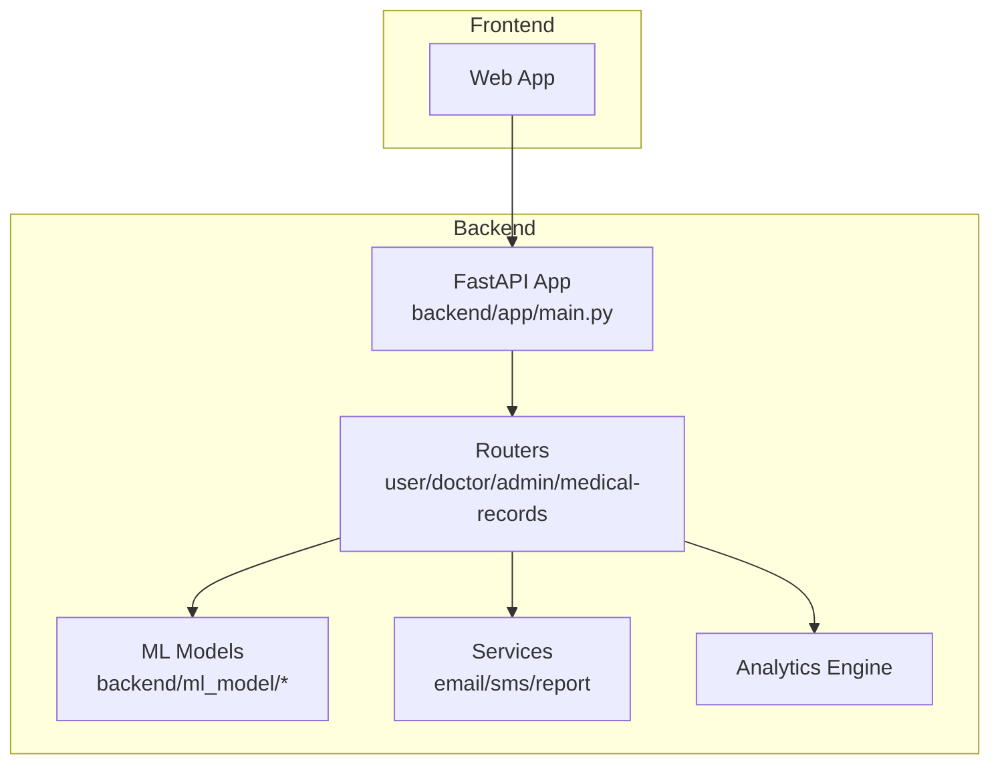

**Diagram sources**
- [backend/app/main.py](file://backend/app/main.py)
- [backend/app/routers/user_routes.py](file://backend/app/routers/user_routes.py)
- [backend/app/routers/doctor_routes.py](file://backend/app/routers/doctor_routes.py)
- [backend/app/routers/admin_routes.py](file://backend/app/routers/admin_routes.py)
- [backend/app/routers/medical_records_routes.py](file://backend/app/routers/medical_records_routes.py)
- [backend/ml_model/predictor.py](file://backend/ml_model/predictor.py)
- [backend/app/email_service.py](file://backend/app/email_service.py)
- [backend/app/sms_service.py](file://backend/app/sms_service.py)
- [backend/app/report_generator.py](file://backend/app/report_generator.py)
- [backend/app/analytics_engine.py](file://backend/app/analytics_engine.py)

**Section sources**
- [backend/app/main.py](file://backend/app/main.py)

## Core Components
- Three dashboards:
  - User dashboard: self-assessment, progress tracking, recommendations, gamification, and basic health insights.
  - Doctor dashboard: patient management, appointment workflows, clinical summaries, and analytics.
  - Admin dashboard: system-wide statistics, user/doctor oversight, and advanced analytics.
- CBT-based questionnaire: 18-item assessment with real-time validation and multimodal scoring.
- AI stress prediction engine: ensemble model with SHAP explainability, trend analysis, and crisis detection.
- AI chatbot: real-time stress detection and counseling with keyword-based sentiment analysis.
- Medical records management: secure storage, metadata tagging, linking to test results, and PDF generation.
- Gamification: points, badges, streaks, levels, and progress tracking.
- Appointment scheduling: booking, approvals, reminders, and integrated notifications.
- Notifications: email and SMS for test results, appointments, and alerts.

**Section sources**
- [backend/app/models.py](file://backend/app/models.py)
- [backend/app/routers/user_routes.py](file://backend/app/routers/user_routes.py)
- [backend/app/routers/doctor_routes.py](file://backend/app/routers/doctor_routes.py)
- [backend/app/routers/admin_routes.py](file://backend/app/routers/admin_routes.py)
- [backend/app/routers/medical_records_routes.py](file://backend/app/routers/medical_records_routes.py)
- [backend/ml_model/predictor.py](file://backend/ml_model/predictor.py)
- [backend/app/recommendation_engine.py](file://backend/app/recommendation_engine.py)
- [backend/app/progress_tracker.py](file://backend/app/progress_tracker.py)
- [backend/app/analytics_engine.py](file://backend/app/analytics_engine.py)
- [backend/app/email_service.py](file://backend/app/email_service.py)
- [backend/app/sms_service.py](file://backend/app/sms_service.py)
- [backend/app/report_generator.py](file://backend/app/report_generator.py)

## Architecture Overview
The system is modular and role-based. Routers define endpoints for each dashboard. Business logic is implemented in services and engines. ML models and recommendation systems are decoupled for scalability. Notifications and reporting are separate services to keep routers lean.

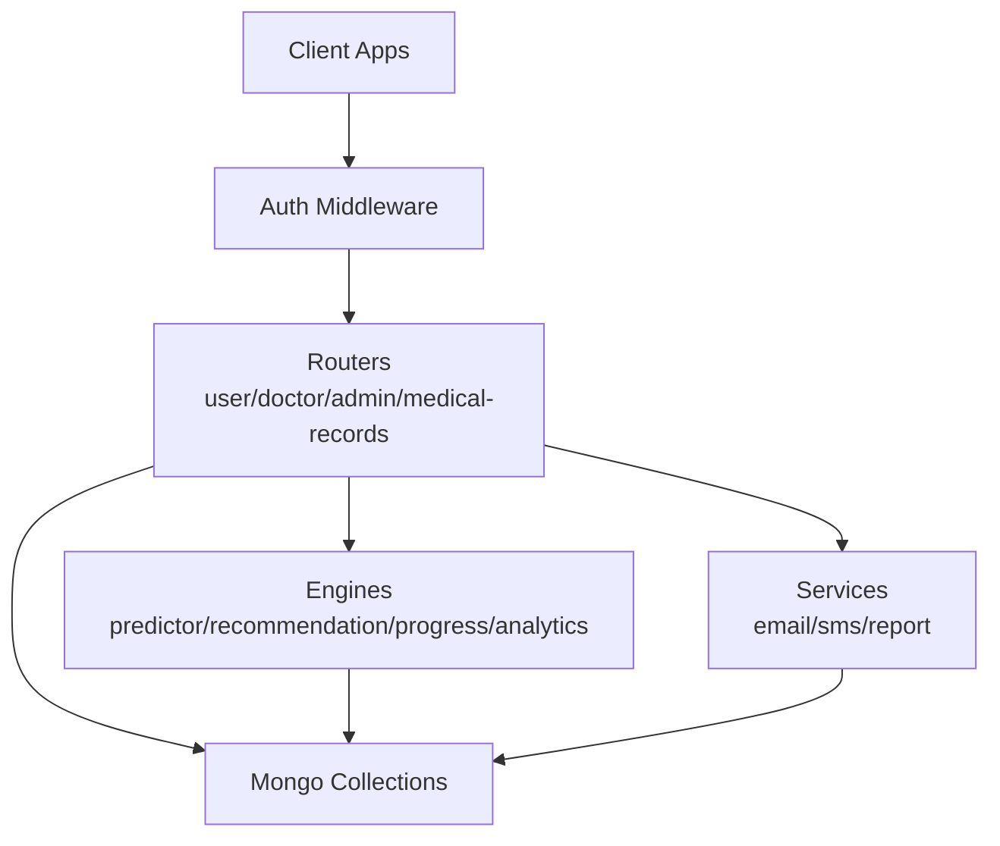

**Diagram sources**
- [backend/app/main.py](file://backend/app/main.py)
- [backend/app/routers/user_routes.py](file://backend/app/routers/user_routes.py)
- [backend/app/routers/doctor_routes.py](file://backend/app/routers/doctor_routes.py)
- [backend/app/routers/admin_routes.py](file://backend/app/routers/admin_routes.py)
- [backend/app/routers/medical_records_routes.py](file://backend/app/routers/medical_records_routes.py)
- [backend/ml_model/predictor.py](file://backend/ml_model/predictor.py)
- [backend/app/recommendation_engine.py](file://backend/app/recommendation_engine.py)
- [backend/app/progress_tracker.py](file://backend/app/progress_tracker.py)
- [backend/app/analytics_engine.py](file://backend/app/analytics_engine.py)
- [backend/app/email_service.py](file://backend/app/email_service.py)
- [backend/app/sms_service.py](file://backend/app/sms_service.py)
- [backend/app/report_generator.py](file://backend/app/report_generator.py)

## Detailed Component Analysis

### Three-Dashboard System
- User dashboard
  - Self-assessment: 18-question CBT survey with real-time validation and multimodal scoring.
  - Progress tracking: history, trends, and personal analytics.
  - Recommendations: AI-ranked, personalized actions with tracking and reminders.
  - Gamification: points, badges, streaks, levels, and achievements.
  - Notifications: email/SMS for results and alerts.
- Doctor dashboard
  - Patient management: view appointments, patient test histories, and latest results.
  - Clinical workflows: approve/reject/update appointments with automated notifications.
  - Analytics: doctor effectiveness and patient outcomes.
- Admin dashboard
  - System administration: stats, user/doctor listings, verification, and analytics.
  - Oversight: manage users/doctors and monitor platform health.

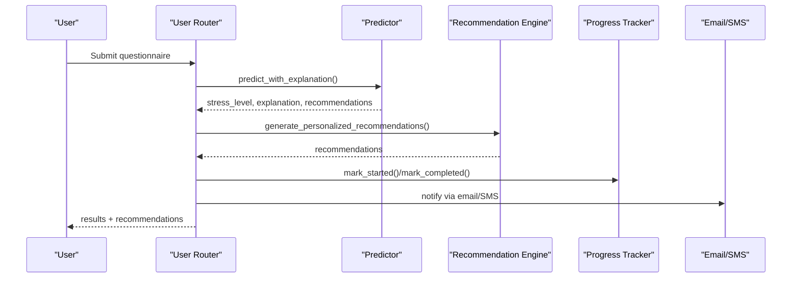

**Diagram sources**
- [backend/app/routers/user_routes.py](file://backend/app/routers/user_routes.py)
- [backend/ml_model/predictor.py](file://backend/ml_model/predictor.py)
- [backend/app/recommendation_engine.py](file://backend/app/recommendation_engine.py)
- [backend/app/progress_tracker.py](file://backend/app/progress_tracker.py)
- [backend/app/email_service.py](file://backend/app/email_service.py)
- [backend/app/sms_service.py](file://backend/app/sms_service.py)

**Section sources**
- [backend/app/routers/user_routes.py](file://backend/app/routers/user_routes.py)
- [backend/app/routers/doctor_routes.py](file://backend/app/routers/doctor_routes.py)
- [backend/app/routers/admin_routes.py](file://backend/app/routers/admin_routes.py)
- [backend/app/progress_tracker.py](file://backend/app/progress_tracker.py)

### Cognitive Behavioral Therapy Questionnaire System
- 18-question CBT-based survey covering emotional, physical, cognitive, behavioral, and stressor domains.
- Real-time validation ensures 18 responses within 1–5 scale.
- Multimodal scoring pipeline:
  - Neural network scorer (if available) for keyword-derived numeric scores.
  - Groq LLM fallback for robust conversion.
  - Keyword-based scoring as last resort.
- SHAP explainability and category-level analysis included in predictions.

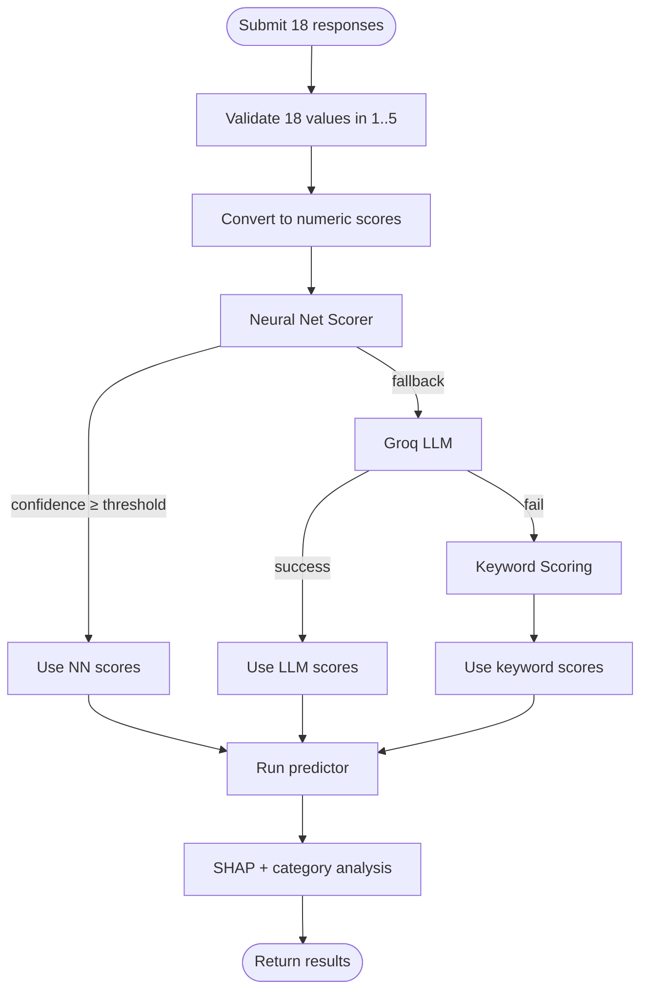

**Diagram sources**
- [backend/app/routers/user_routes.py](file://backend/app/routers/user_routes.py)
- [backend/ml_model/predictor.py](file://backend/ml_model/predictor.py)

**Section sources**
- [backend/app/routers/user_routes.py](file://backend/app/routers/user_routes.py)
- [backend/ml_model/predictor.py](file://backend/ml_model/predictor.py)

### AI-Powered Stress Prediction Engine
- Ensemble model with SHAP explainability, continuous stress score, and risk factor identification.
- Trend analysis: detects worsening/improving/stable patterns and forecasts future levels.
- Crisis detection: flags severe stress episodes and recommends actions.
- Confidence and probability outputs enable transparency and trust.

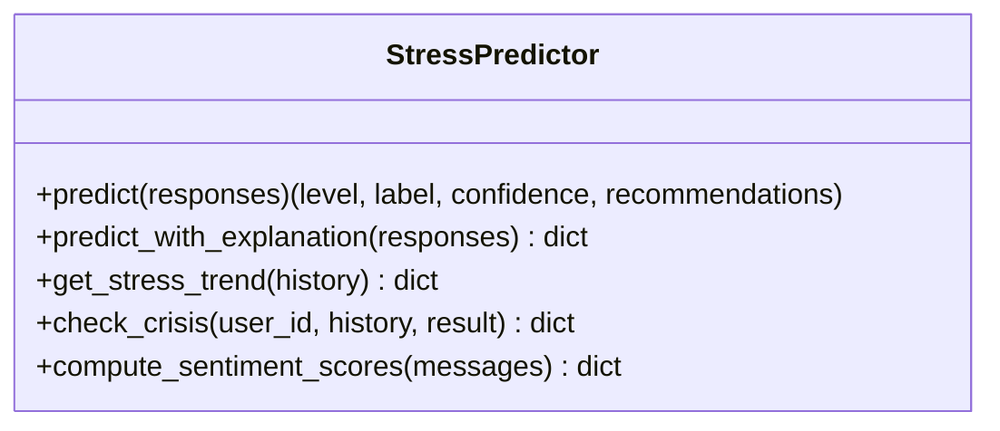

**Diagram sources**
- [backend/ml_model/predictor.py](file://backend/ml_model/predictor.py)

**Section sources**
- [backend/ml_model/predictor.py](file://backend/ml_model/predictor.py)

### AI Chatbot Functionality
- Real-time stress detection and counseling via keyword-based sentiment analysis.
- Crisis word detection triggers higher-severity actions.
- Integrates with predictor sentiment scoring for consistency.

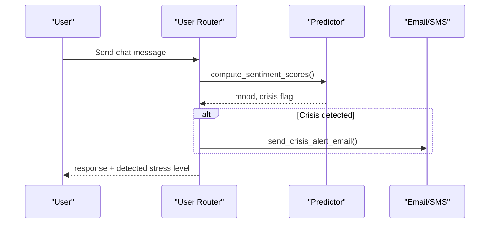

**Diagram sources**
- [backend/app/routers/user_routes.py](file://backend/app/routers/user_routes.py)
- [backend/ml_model/predictor.py](file://backend/ml_model/predictor.py)
- [backend/app/email_service.py](file://backend/app/email_service.py)

**Section sources**
- [backend/app/routers/user_routes.py](file://backend/app/routers/user_routes.py)
- [backend/ml_model/predictor.py](file://backend/ml_model/predictor.py)
- [backend/app/email_service.py](file://backend/app/email_service.py)

### Medical Records Management System
- Secure upload with file validation, hashing, and storage limits.
- Metadata management, filtering, and tagging.
- Linking to stress test results with automatic PDF generation.
- Download with activity logging and bulk ZIP support.

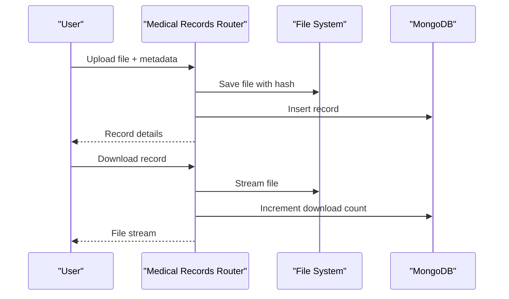

**Diagram sources**
- [backend/app/routers/medical_records_routes.py](file://backend/app/routers/medical_records_routes.py)

**Section sources**
- [backend/app/routers/medical_records_routes.py](file://backend/app/routers/medical_records_routes.py)
- [backend/app/models.py](file://backend/app/models.py)
- [backend/app/report_generator.py](file://backend/app/report_generator.py)

### Gamification Elements
- Points, badges, streaks, and levels drive engagement.
- Achievement tracking includes meditation, exercise, journaling, and therapy sessions.
- Leaderboard capability and level progression with thresholds.

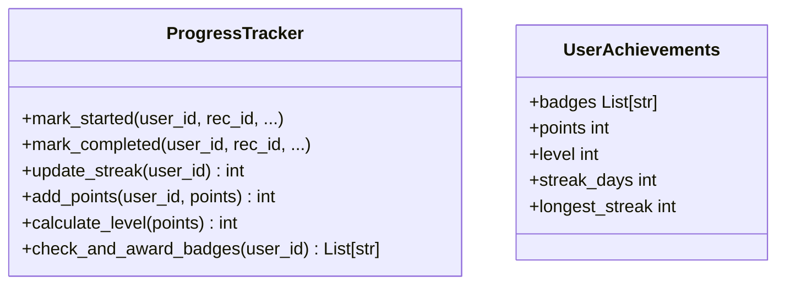

**Diagram sources**
- [backend/app/progress_tracker.py](file://backend/app/progress_tracker.py)

**Section sources**
- [backend/app/progress_tracker.py](file://backend/app/progress_tracker.py)

### Appointment Scheduling System
- Users book appointments; doctors approve/reject/update statuses.
- Integrated notifications via email and SMS.
- Doctor dashboard aggregates patient test history for informed consultations.

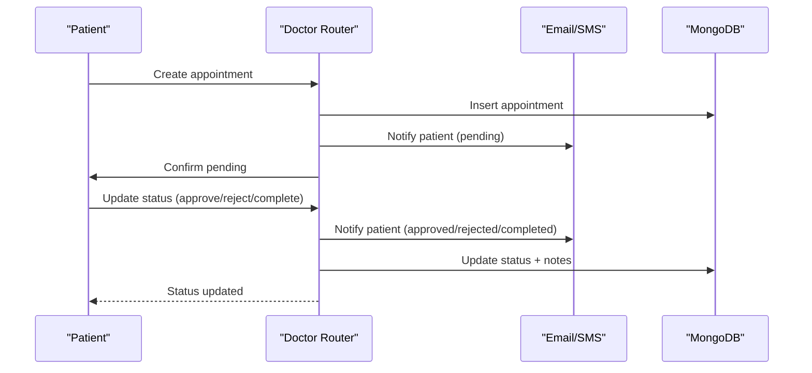

**Diagram sources**
- [backend/app/routers/doctor_routes.py](file://backend/app/routers/doctor_routes.py)
- [backend/app/email_service.py](file://backend/app/email_service.py)
- [backend/app/sms_service.py](file://backend/app/sms_service.py)

**Section sources**
- [backend/app/routers/doctor_routes.py](file://backend/app/routers/doctor_routes.py)
- [backend/app/email_service.py](file://backend/app/email_service.py)
- [backend/app/sms_service.py](file://backend/app/sms_service.py)

### Recommendation Engine
- Generates categorized recommendations (immediate, daily, weekly, lifestyle, professional).
- Personalizes recommendations using user profile and stress history.
- Integrates with ranking module for relevance.

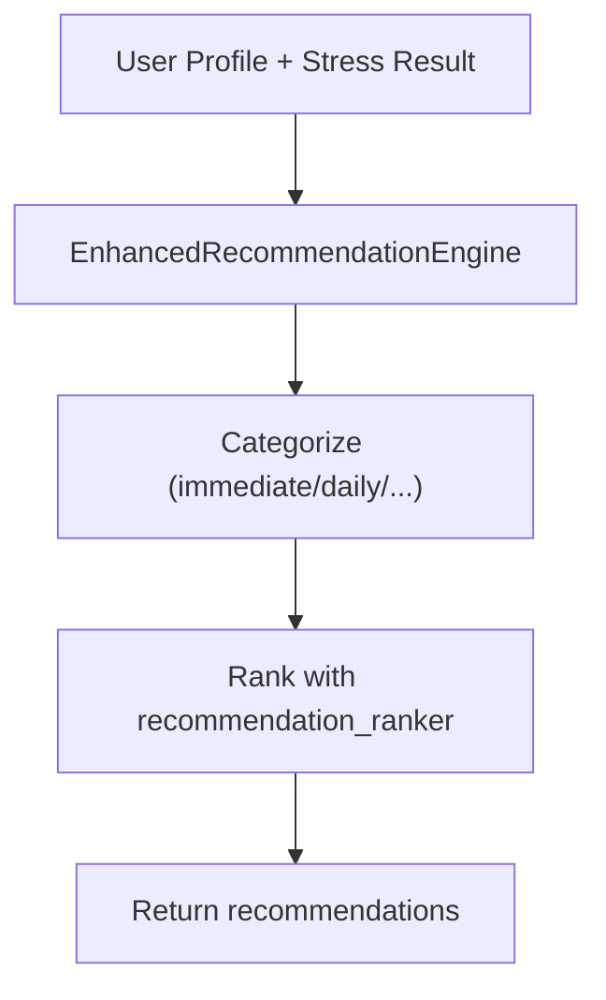

**Diagram sources**
- [backend/app/recommendation_engine.py](file://backend/app/recommendation_engine.py)

**Section sources**
- [backend/app/recommendation_engine.py](file://backend/app/recommendation_engine.py)

### Analytics Engine
- Platform-wide insights: trends, demographics, and doctor effectiveness.
- Personal analytics for users: trends, gaps, and category changes.
- Smart doctor matching based on specialization and effectiveness.

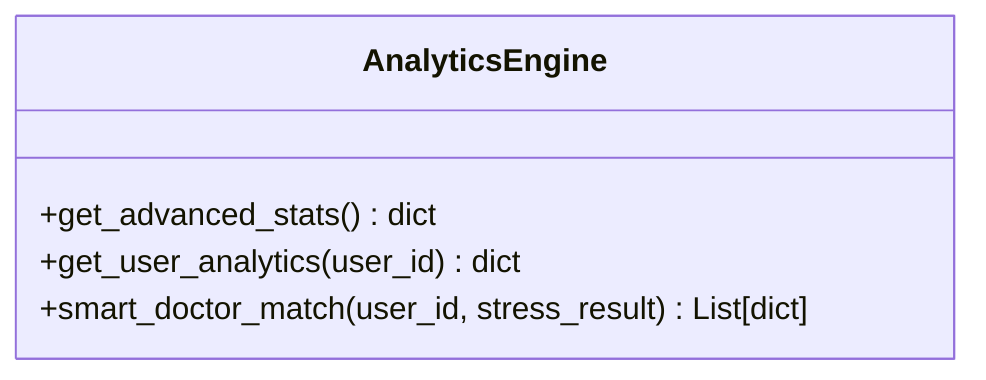

**Diagram sources**
- [backend/app/analytics_engine.py](file://backend/app/analytics_engine.py)

**Section sources**
- [backend/app/analytics_engine.py](file://backend/app/analytics_engine.py)

## Dependency Analysis
- Routers depend on models, services, and engines.
- Predictor and recommendation engine are standalone modules.
- Progress tracker and analytics operate on MongoDB collections.
- Notifications are independent services invoked by routers.

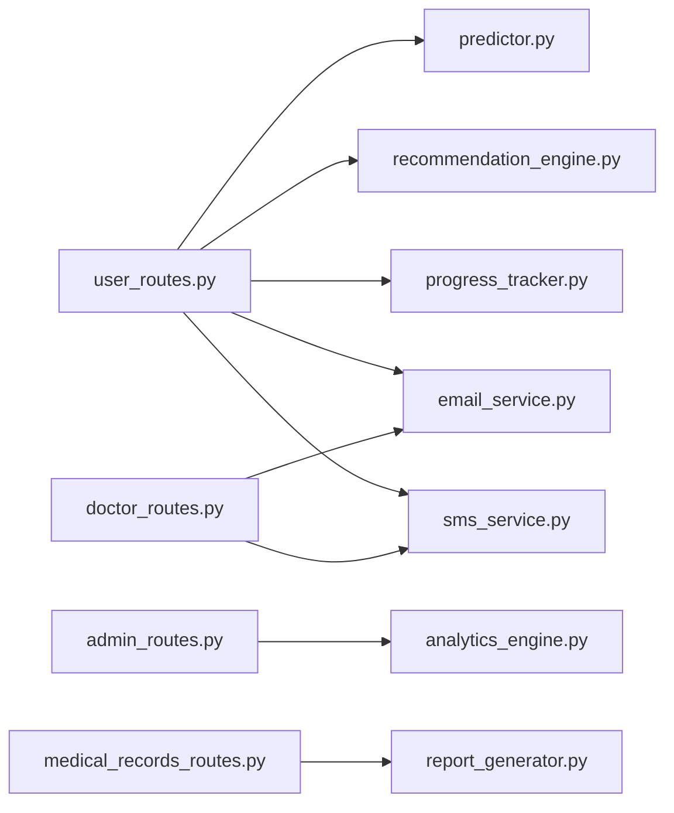

**Diagram sources**
- [backend/app/routers/user_routes.py](file://backend/app/routers/user_routes.py)
- [backend/app/routers/doctor_routes.py](file://backend/app/routers/doctor_routes.py)
- [backend/app/routers/admin_routes.py](file://backend/app/routers/admin_routes.py)
- [backend/app/routers/medical_records_routes.py](file://backend/app/routers/medical_records_routes.py)
- [backend/ml_model/predictor.py](file://backend/ml_model/predictor.py)
- [backend/app/recommendation_engine.py](file://backend/app/recommendation_engine.py)
- [backend/app/progress_tracker.py](file://backend/app/progress_tracker.py)
- [backend/app/analytics_engine.py](file://backend/app/analytics_engine.py)
- [backend/app/email_service.py](file://backend/app/email_service.py)
- [backend/app/sms_service.py](file://backend/app/sms_service.py)
- [backend/app/report_generator.py](file://backend/app/report_generator.py)

**Section sources**
- [backend/app/routers/user_routes.py](file://backend/app/routers/user_routes.py)
- [backend/app/routers/doctor_routes.py](file://backend/app/routers/doctor_routes.py)
- [backend/app/routers/admin_routes.py](file://backend/app/routers/admin_routes.py)
- [backend/app/routers/medical_records_routes.py](file://backend/app/routers/medical_records_routes.py)
- [backend/ml_model/predictor.py](file://backend/ml_model/predictor.py)
- [backend/app/recommendation_engine.py](file://backend/app/recommendation_engine.py)
- [backend/app/progress_tracker.py](file://backend/app/progress_tracker.py)
- [backend/app/analytics_engine.py](file://backend/app/analytics_engine.py)
- [backend/app/email_service.py](file://backend/app/email_service.py)
- [backend/app/sms_service.py](file://backend/app/sms_service.py)
- [backend/app/report_generator.py](file://backend/app/report_generator.py)

## Performance Considerations
- Database queries are optimized with aggregation pipelines (e.g., doctor appointments).
- Asynchronous notifications prevent blocking responses.
- Model loading includes integrity checks and fallbacks to ensure reliability.
- Recommendation ranking and analytics leverage efficient data structures and caching-friendly designs.

[No sources needed since this section provides general guidance]

## Troubleshooting Guide
- Authentication and authorization: ensure role-based access controls are enforced on endpoints.
- Email/SMS credentials: configure environment variables; otherwise, notifications will be disabled.
- File uploads: verify allowed extensions, sizes, and storage limits; check MIME detection availability.
- Model integrity: if model files are corrupted, the system auto-reloads or retrains.
- Notifications: verify provider settings and network connectivity.

**Section sources**
- [backend/app/main.py](file://backend/app/main.py)
- [backend/app/email_service.py](file://backend/app/email_service.py)
- [backend/app/sms_service.py](file://backend/app/sms_service.py)
- [backend/app/routers/medical_records_routes.py](file://backend/app/routers/medical_records_routes.py)
- [backend/ml_model/predictor.py](file://backend/ml_model/predictor.py)

## Conclusion
The AI Stress Level Analyzer integrates a robust three-dashboard system, a validated CBT questionnaire, an explainable AI prediction engine, a chatbot for real-time support, secure medical records management, gamification, and appointment workflows. These components collaborate through well-defined routers, services, and engines to deliver a scalable, transparent, and user-centric mental health platform.