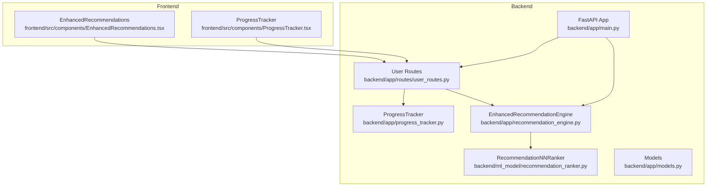
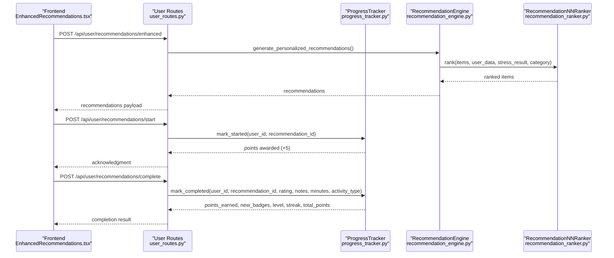
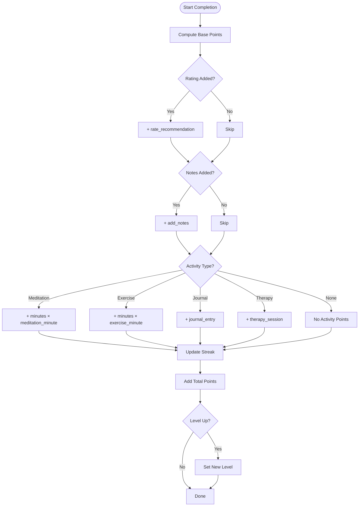
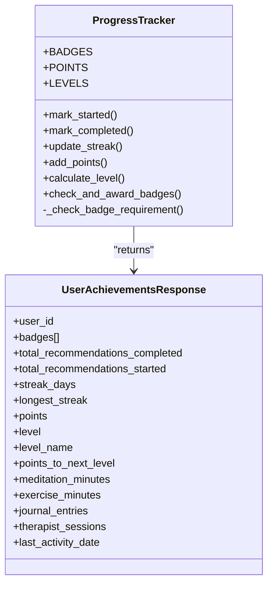
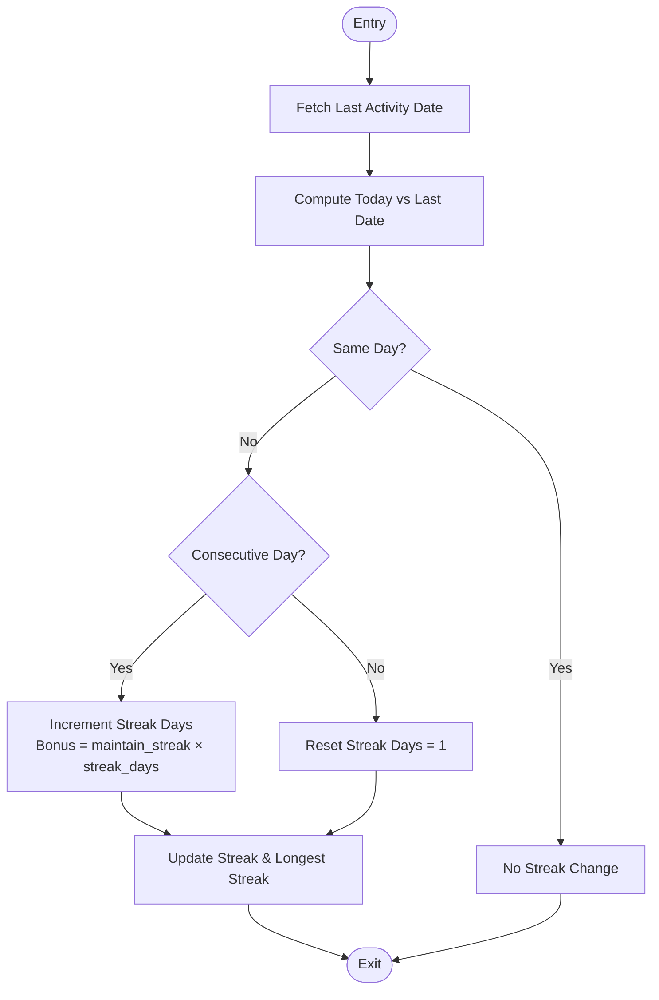
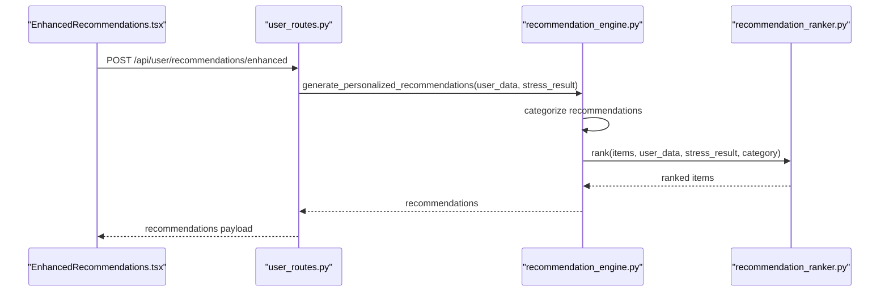
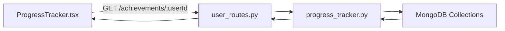
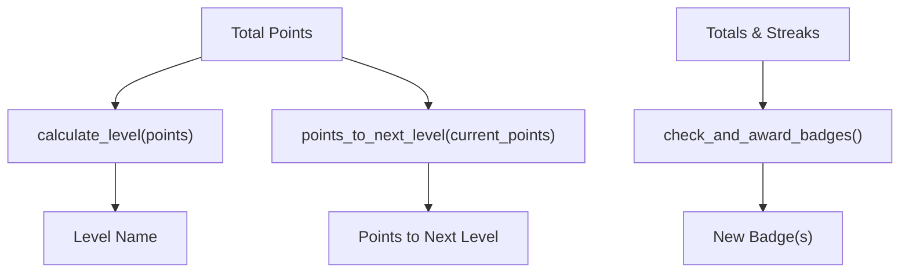
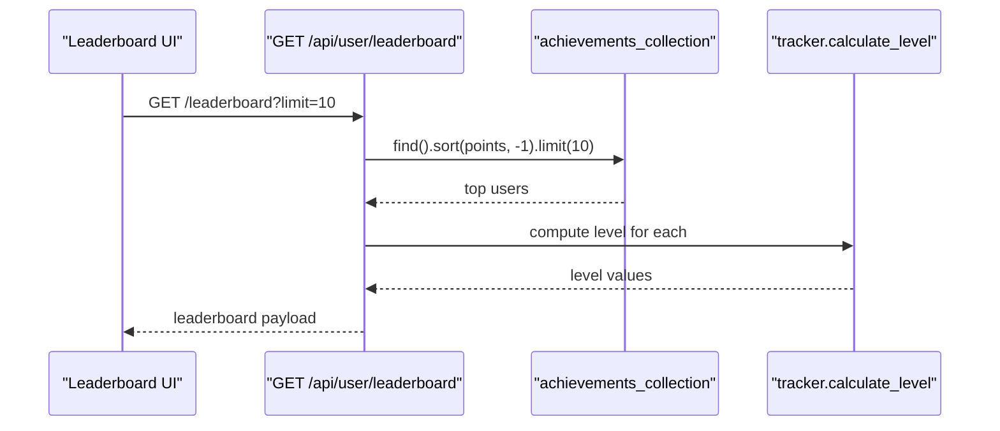
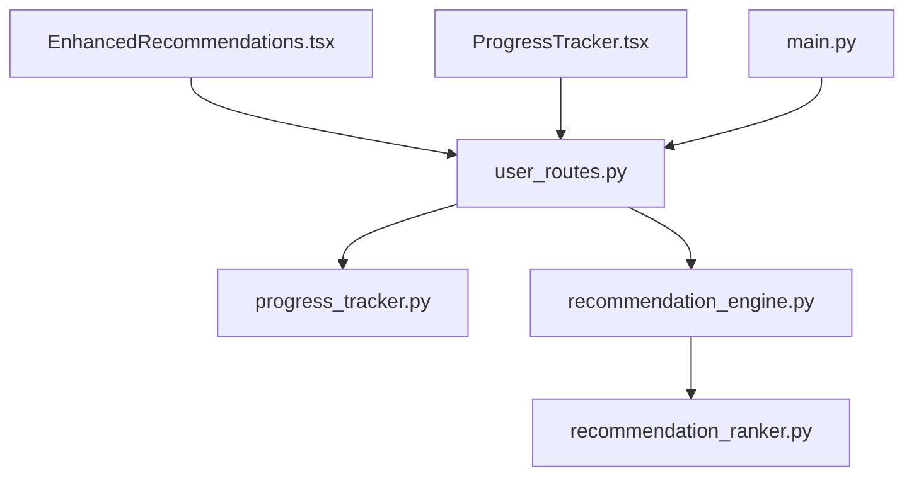

# Gamification System

<cite>
**Referenced Files in This Document**
- [progress_tracker.py](file://backend/app/progress_tracker.py)
- [models.py](file://backend/app/models.py)
- [recommendation_engine.py](file://backend/app/recommendation_engine.py)
- [recommendation_ranker.py](file://backend/ml_model/recommendation_ranker.py)
- [user_routes.py](file://backend/app/routes/user_routes.py)
- [ProgressTracker.tsx](file://frontend/src/components/ProgressTracker.tsx)
- [EnhancedRecommendations.tsx](file://frontend/src/components/EnhancedRecommendations.tsx)
- [main.py](file://backend/app/main.py)
</cite>

## Table of Contents
1. [Introduction](#introduction)
2. [Project Structure](#project-structure)
3. [Core Components](#core-components)
4. [Architecture Overview](#architecture-overview)
5. [Detailed Component Analysis](#detailed-component-analysis)
6. [Dependency Analysis](#dependency-analysis)
7. [Performance Considerations](#performance-considerations)
8. [Troubleshooting Guide](#troubleshooting-guide)
9. [Conclusion](#conclusion)
10. [Appendices](#appendices)

## Introduction
This document describes the gamification system that enhances user engagement and adherence to stress management programs. It covers the points accumulation mechanism, badge achievement system, streak tracking, integration with the recommendation engine for personalized experiences, progress tracking, milestone recognition, rewards, and leaderboard features. It also outlines the psychological principles underpinning the gamification approach, user motivation factors, behavioral change support mechanisms, and the balance between gamification effectiveness and therapeutic appropriateness.

## Project Structure
The gamification system spans backend services and frontend components:
- Backend core: Progress tracking and gamification engine, recommendation engine, and route handlers.
- Frontend components: Recommendations display and progress tracker UI.
- ML ranking module: Neural network-based personalization for recommendations.

**Diagram sources**
- [progress_tracker.py:48-454](file://backend/app/progress_tracker.py#L48-L454)
- [recommendation_engine.py:11-554](file://backend/app/recommendation_engine.py#L11-L554)
- [recommendation_ranker.py:9-108](file://backend/ml_model/recommendation_ranker.py#L9-L108)
- [user_routes.py:759-890](file://backend/app/routes/user_routes.py#L759-L890)
- [models.py:148-245](file://backend/app/models.py#L148-L245)
- [main.py:52-80](file://backend/app/main.py#L52-L80)
- [EnhancedRecommendations.tsx:13-84](file://frontend/src/components/EnhancedRecommendations.tsx#L13-L84)
- [ProgressTracker.tsx:9-77](file://frontend/src/components/ProgressTracker.tsx#L9-L77)

**Section sources**
- [progress_tracker.py:1-454](file://backend/app/progress_tracker.py#L1-L454)
- [recommendation_engine.py:1-554](file://backend/app/recommendation_engine.py#L1-L554)
- [recommendation_ranker.py:1-108](file://backend/ml_model/recommendation_ranker.py#L1-L108)
- [user_routes.py:759-890](file://backend/app/routes/user_routes.py#L759-L890)
- [models.py:148-245](file://backend/app/models.py#L148-L245)
- [main.py:52-80](file://backend/app/main.py#L52-L80)
- [EnhancedRecommendations.tsx:1-84](file://frontend/src/components/EnhancedRecommendations.tsx#L1-L84)
- [ProgressTracker.tsx:1-77](file://frontend/src/components/ProgressTracker.tsx#L1-L77)

## Core Components
- ProgressTracker: Central gamification engine managing points, levels, streaks, badges, and milestones.
- EnhancedRecommendationEngine: Generates personalized recommendations and integrates with neural ranking.
- RecommendationNNRanker: Neural network ranker for personalizing recommendation order.
- User Routes: Expose endpoints for achievements, leaderboard, and recommendation lifecycle.
- Frontend Components: Display progress, badges, leaderboard, and enable user actions.

Key gamification mechanics:
- Points accumulation for starting, completing, rating, and adding notes to recommendations; activity minutes; therapy sessions.
- Streak calculation with daily maintenance bonuses scaling by consecutive days.
- Level progression with named tiers and points-to-next-level computation.
- Badge system with requirements based on totals and streaks.
- Leaderboard retrieval by points.

**Section sources**
- [progress_tracker.py:48-317](file://backend/app/progress_tracker.py#L48-L317)
- [recommendation_engine.py:17-58](file://backend/app/recommendation_engine.py#L17-L58)
- [recommendation_ranker.py:70-104](file://backend/ml_model/recommendation_ranker.py#L70-L104)
- [user_routes.py:759-890](file://backend/app/routes/user_routes.py#L759-L890)
- [models.py:209-245](file://backend/app/models.py#L209-L245)
- [ProgressTracker.tsx:9-77](file://frontend/src/components/ProgressTracker.tsx#L9-L77)
- [EnhancedRecommendations.tsx:35-75](file://frontend/src/components/EnhancedRecommendations.tsx#L35-L75)

## Architecture Overview
The gamification pipeline connects user actions to points, streaks, badges, and levels, while recommendations are personalized and ranked to improve adherence.

**Diagram sources**
- [EnhancedRecommendations.tsx:24-75](file://frontend/src/components/EnhancedRecommendations.tsx#L24-L75)
- [user_routes.py:759-890](file://backend/app/routes/user_routes.py#L759-L890)
- [progress_tracker.py:135-235](file://backend/app/progress_tracker.py#L135-L235)
- [recommendation_engine.py:17-58](file://backend/app/recommendation_engine.py#L17-L58)
- [recommendation_ranker.py:70-104](file://backend/ml_model/recommendation_ranker.py#L70-L104)

## Detailed Component Analysis

### Points Accumulation Mechanism
- Starting a recommendation: small points award to encourage initiation.
- Completing a recommendation: base points plus optional bonuses for rating and notes.
- Activity tracking: meditation, exercise, journal entries, and therapy sessions contribute minutes or fixed points.
- Streak maintenance: bonus points scale with consecutive days, incentivizing continuity.

**Diagram sources**
- [progress_tracker.py:167-235](file://backend/app/progress_tracker.py#L167-L235)
- [progress_tracker.py:237-290](file://backend/app/progress_tracker.py#L237-L290)

**Section sources**
- [progress_tracker.py:105-117](file://backend/app/progress_tracker.py#L105-L117)
- [progress_tracker.py:167-235](file://backend/app/progress_tracker.py#L167-L235)
- [progress_tracker.py:276-290](file://backend/app/progress_tracker.py#L276-L290)

### Badge Achievement System
- Badge definitions include first steps, weekly/monthly milestones, activity thresholds, and completion quality targets.
- Eligibility checked via regex-based requirement expressions against aggregated stats.
- New badges appended to user achievements upon discovery.

**Diagram sources**
- [progress_tracker.py:51-129](file://backend/app/progress_tracker.py#L51-L129)
- [progress_tracker.py:318-374](file://backend/app/progress_tracker.py#L318-L374)
- [models.py:209-225](file://backend/app/models.py#L209-L225)

**Section sources**
- [progress_tracker.py:51-103](file://backend/app/progress_tracker.py#L51-L103)
- [progress_tracker.py:318-374](file://backend/app/progress_tracker.py#L318-L374)
- [models.py:209-225](file://backend/app/models.py#L209-L225)

### Streak Tracking Functionality
- Daily streak computed from last activity date; consecutive-day increments yield increasing bonuses.
- Longest streak tracked and updated when exceeded.
- Same-day activity does not alter streak; missing a day resets to 1.

**Diagram sources**
- [progress_tracker.py:237-274](file://backend/app/progress_tracker.py#L237-L274)

**Section sources**
- [progress_tracker.py:237-274](file://backend/app/progress_tracker.py#L237-L274)

### Integration with Recommendation Engine
- Recommendations are personalized and ranked using a neural network trained on synthetic features.
- Categories include immediate, daily, weekly, lifestyle, professional, and personalized tips.
- Ranking considers stress level, category urgency, difficulty, effectiveness, age, and priority.

**Diagram sources**
- [EnhancedRecommendations.tsx:24-33](file://frontend/src/components/EnhancedRecommendations.tsx#L24-L33)
- [recommendation_engine.py:17-58](file://backend/app/recommendation_engine.py#L17-L58)
- [recommendation_ranker.py:70-104](file://backend/ml_model/recommendation_ranker.py#L70-L104)

**Section sources**
- [recommendation_engine.py:17-58](file://backend/app/recommendation_engine.py#L17-L58)
- [recommendation_ranker.py:70-104](file://backend/ml_model/recommendation_ranker.py#L70-L104)

### Progress Tracking Implementation
- Frontend displays streak, level, points, badges, and statistics.
- Achievements are fetched from backend and rendered reactively.

**Diagram sources**
- [ProgressTracker.tsx:9-77](file://frontend/src/components/ProgressTracker.tsx#L9-L77)
- [user_routes.py:759-784](file://backend/app/routes/user_routes.py#L759-L784)
- [progress_tracker.py:399-416](file://backend/app/progress_tracker.py#L399-L416)

**Section sources**
- [ProgressTracker.tsx:9-77](file://frontend/src/components/ProgressTracker.tsx#L9-L77)
- [user_routes.py:759-784](file://backend/app/routes/user_routes.py#L759-L784)
- [progress_tracker.py:399-416](file://backend/app/progress_tracker.py#L399-L416)

### Milestone Recognition and Rewards
- Levels: Named tiers with minimum point thresholds; points-to-next-level computed dynamically.
- Badges: Achievement badges unlock upon meeting criteria; UI surfaces new badges after completion.
- Streaks: Daily maintenance bonuses increase with consecutive days; longest streak preserved.

**Diagram sources**
- [progress_tracker.py:292-316](file://backend/app/progress_tracker.py#L292-L316)
- [progress_tracker.py:318-344](file://backend/app/progress_tracker.py#L318-L344)

**Section sources**
- [progress_tracker.py:119-129](file://backend/app/progress_tracker.py#L119-L129)
- [progress_tracker.py:292-316](file://backend/app/progress_tracker.py#L292-L316)
- [progress_tracker.py:318-344](file://backend/app/progress_tracker.py#L318-L344)

### Leaderboard System
- Top users retrieved by points descending with pagination.
- Includes rank, name, points, level, and badge count.

**Diagram sources**
- [user_routes.py:860-890](file://backend/app/routes/user_routes.py#L860-L890)

**Section sources**
- [user_routes.py:860-890](file://backend/app/routes/user_routes.py#L860-L890)
- [progress_tracker.py:435-454](file://backend/app/progress_tracker.py#L435-L454)

### Psychological Principles and Motivation Factors
- Variable reward schedules: Points and streak bonuses vary by effort and consistency.
- Mastery and competence: Level-ups and badges signal progress and capability growth.
- Social comparison and status: Leaderboards foster healthy competition and visibility.
- Self-determination: Autonomy in choosing activities and scheduling; relatedness through community resources.
- Loss aversion: Streak reset discourages gaps; maintenance bonuses penalize breaks.
- Behavioral momentum: Small initiation rewards encourage continued participation.

[No sources needed since this section provides general guidance]

### Behavioral Change Support Mechanisms
- Immediate feedback loops: Points and badges after actions.
- Habit formation: Daily recommendations and streak maintenance.
- Personalization: AI-ranked recommendations align with user needs and stress levels.
- Therapeutic appropriateness: Higher urgency recommendations for severe stress; crisis resources included.

[No sources needed since this section provides general guidance]

### Social Features and Community Engagement
- Leaderboard promotes friendly competition.
- Community resources and support groups recommendations.
- Professional help pathways escalate when needed.

[No sources needed since this section provides general guidance]

### Balance Between Gamification Effectiveness and Therapeutic Appropriateness
- Gamification supports engagement without overshadowing clinical care.
- Severity-aware recommendations ensure appropriate escalation.
- Avoidance of punitive mechanics; emphasis on encouragement and progress.

[No sources needed since this section provides general guidance]

## Dependency Analysis
The gamification system depends on:
- Backend route handlers for achievements and leaderboard.
- Progress tracker for calculations and persistence.
- Recommendation engine and neural ranker for personalization.
- Frontend components for rendering and user interaction.

**Diagram sources**
- [EnhancedRecommendations.tsx:13-84](file://frontend/src/components/EnhancedRecommendations.tsx#L13-L84)
- [ProgressTracker.tsx:9-77](file://frontend/src/components/ProgressTracker.tsx#L9-L77)
- [user_routes.py:759-890](file://backend/app/routes/user_routes.py#L759-L890)
- [progress_tracker.py:48-454](file://backend/app/progress_tracker.py#L48-L454)
- [recommendation_engine.py:11-554](file://backend/app/recommendation_engine.py#L11-L554)
- [recommendation_ranker.py:9-108](file://backend/ml_model/recommendation_ranker.py#L9-L108)
- [main.py:52-80](file://backend/app/main.py#L52-L80)

**Section sources**
- [user_routes.py:759-890](file://backend/app/routes/user_routes.py#L759-L890)
- [progress_tracker.py:48-454](file://backend/app/progress_tracker.py#L48-L454)
- [recommendation_engine.py:11-554](file://backend/app/recommendation_engine.py#L11-L554)
- [recommendation_ranker.py:9-108](file://backend/ml_model/recommendation_ranker.py#L9-L108)
- [main.py:52-80](file://backend/app/main.py#L52-L80)

## Performance Considerations
- Minimize database queries by batching updates and caching frequently accessed achievements.
- Rank recommendations server-side to avoid heavy client computations.
- Use pagination for leaderboards to limit result sets.
- Debounce frontend requests during rapid user interactions.

[No sources needed since this section provides general guidance]

## Troubleshooting Guide
Common issues and resolutions:
- Achievement updates failing silently: Verify database connection and collection initialization.
- Leaderboard returns empty: Confirm achievements collection population and sort operation.
- Streak not updating: Ensure last_activity_date is stored and timezone handling is consistent.
- Badge checks not triggering: Validate requirement expressions and stats aggregation.

**Section sources**
- [progress_tracker.py:418-434](file://backend/app/progress_tracker.py#L418-L434)
- [user_routes.py:867-890](file://backend/app/routes/user_routes.py#L867-L890)
- [progress_tracker.py:346-373](file://backend/app/progress_tracker.py#L346-L373)

## Conclusion
The gamification system integrates points, streaks, badges, and levels with personalized recommendations to drive sustained engagement in stress management. By combining behavioral science principles with therapeutic appropriateness, it supports long-term adherence while maintaining safety and well-being.

[No sources needed since this section summarizes without analyzing specific files]

## Appendices

### API Definitions
- GET /api/user/achievements/{user_id}: Returns user achievements, badges, points, level, and stats.
- GET /api/user/leaderboard?limit=N: Returns top users by points with rank, name, points, level, and badge count.
- POST /api/user/recommendations/enhanced: Returns personalized, ranked recommendations.
- POST /api/user/recommendations/start: Starts a recommendation and awards partial points.
- POST /api/user/recommendations/complete: Completes a recommendation and returns points, new badges, level, streak, and total points.

**Section sources**
- [user_routes.py:759-890](file://backend/app/routes/user_routes.py#L759-L890)
- [models.py:148-204](file://backend/app/models.py#L148-L204)