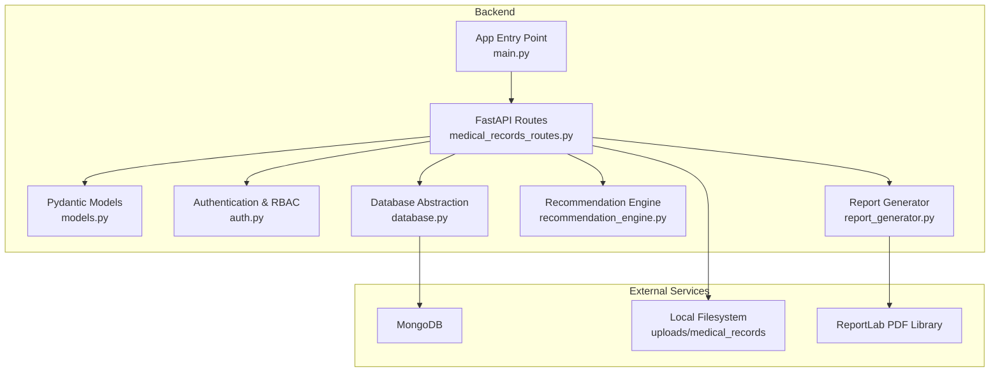
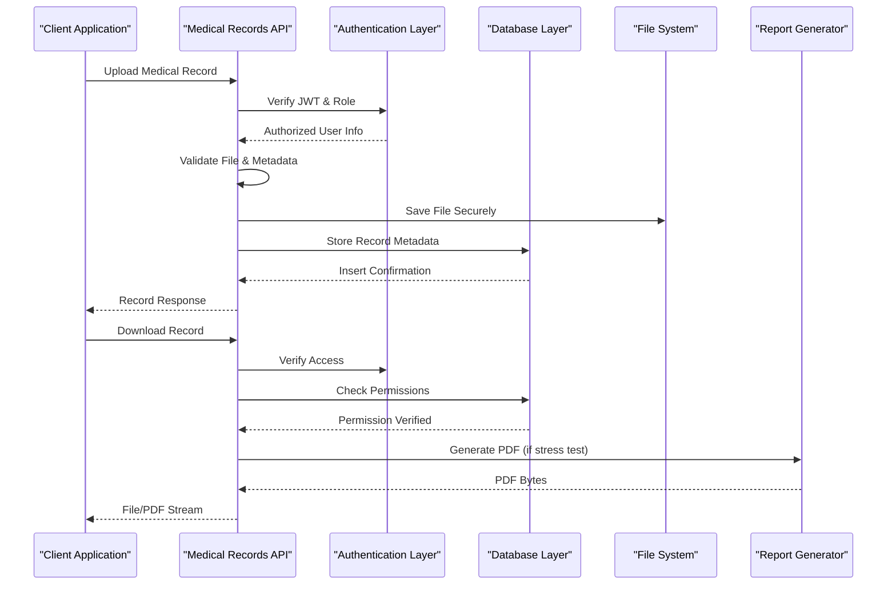
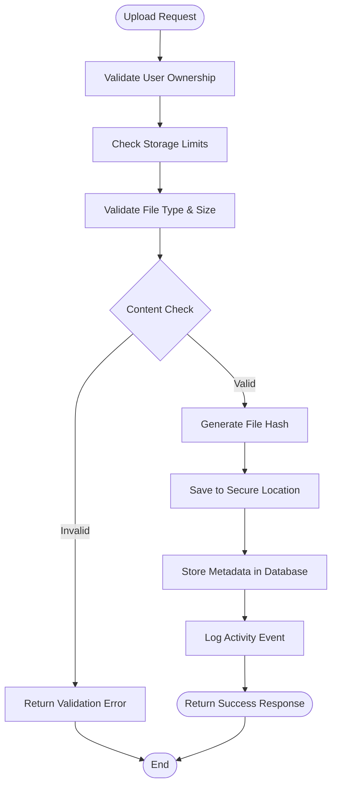
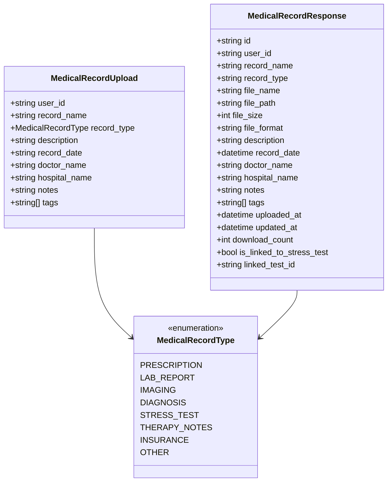
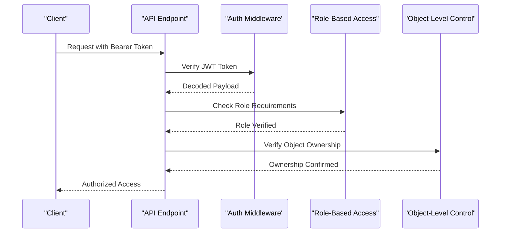
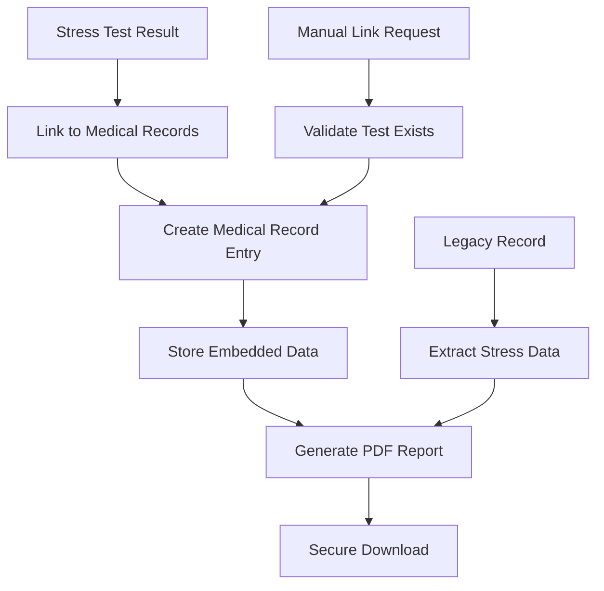
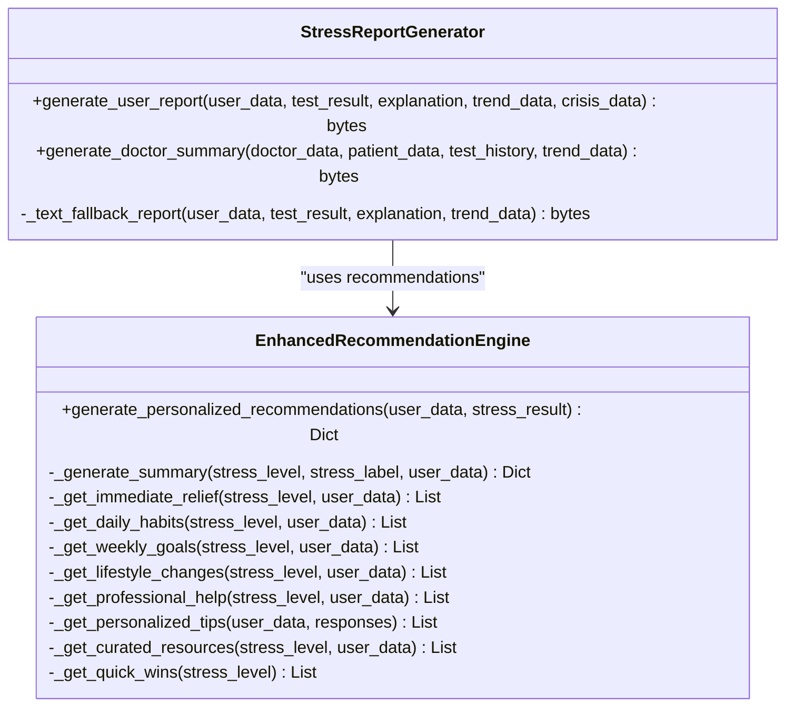
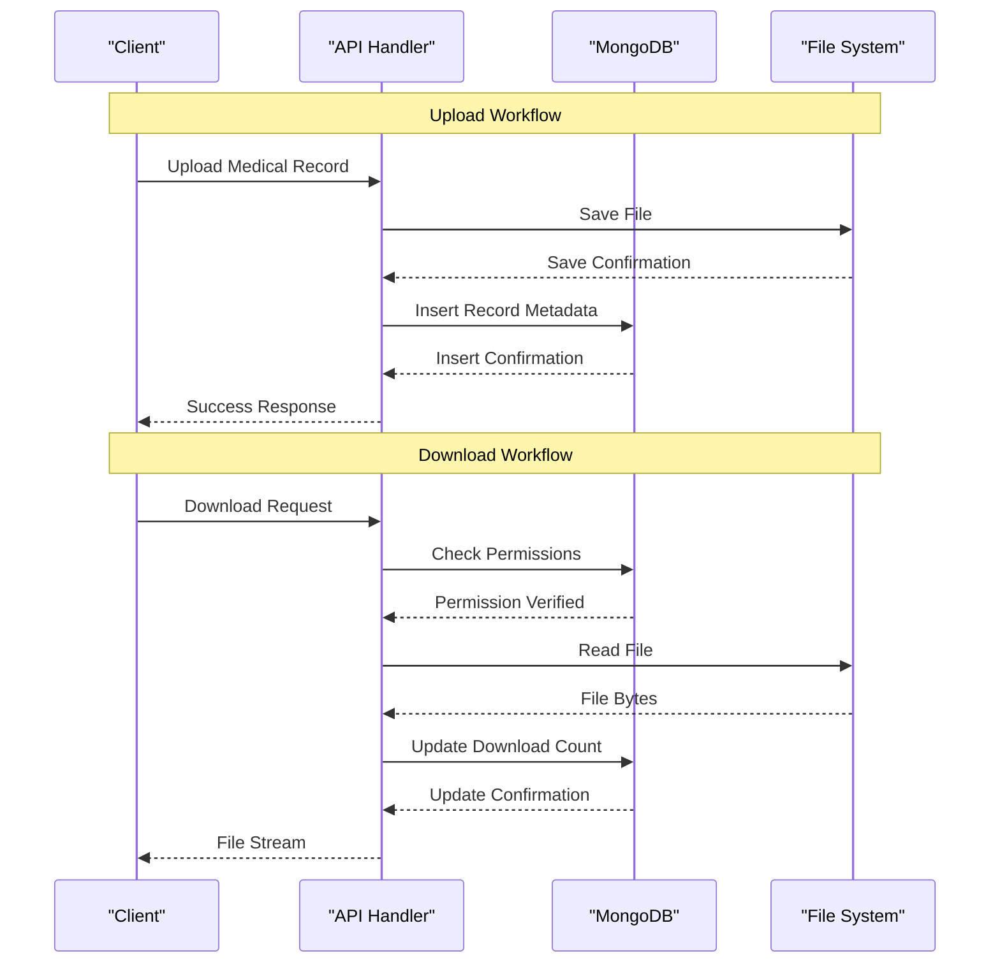
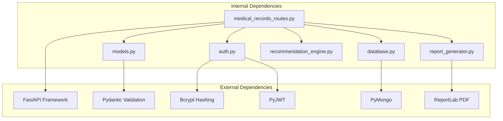

# Medical Records Management

<cite>
**Referenced Files in This Document**
- [models.py](file://backend/app/models.py)
- [medical_records_routes.py](file://backend/app/routes/medical_records_routes.py)
- [auth.py](file://backend/app/auth.py)
- [database.py](file://backend/app/database.py)
- [recommendation_engine.py](file://backend/app/recommendation_engine.py)
- [report_generator.py](file://backend/app/report_generator.py)
- [main.py](file://backend/app/main.py)
- [config.py](file://backend/app/config.py)
- [README.md](file://README.md)
</cite>

## Table of Contents
1. [Introduction](#introduction)
2. [Project Structure](#project-structure)
3. [Core Components](#core-components)
4. [Architecture Overview](#architecture-overview)
5. [Detailed Component Analysis](#detailed-component-analysis)
6. [Dependency Analysis](#dependency-analysis)
7. [Performance Considerations](#performance-considerations)
8. [Troubleshooting Guide](#troubleshooting-guide)
9. [HIPAA Compliance and Security Measures](#hipaa-compliance-and-security-measures)
10. [Conclusion](#conclusion)

## Introduction
This document provides comprehensive documentation for the secure medical records management system within the AI Stress Level Analyzer platform. It covers file upload and storage mechanisms, metadata extraction processes, access control implementation, integration between medical records and stress test results, report generation capabilities, data synchronization workflows, document classification system, secure storage protocols, retrieval mechanisms, integration with the recommendation engine for personalized treatment plans, HIPAA compliance measures, audit trails, and data retention policies. It also addresses supported file formats, size limitations, and security measures for protecting sensitive health information.

## Project Structure
The medical records management system is implemented as part of the backend FastAPI application. Key components include:
- Route handlers for medical records operations
- Data models for validation and response formatting
- Authentication and authorization utilities
- Database abstraction and indexing
- Report generation for stress test records
- Recommendation engine integration

**Diagram sources**
- [medical_records_routes.py:1-1054](file://backend/app/routes/medical_records_routes.py#L1-L1054)
- [models.py:273-440](file://backend/app/models.py#L273-L440)
- [auth.py:1-190](file://backend/app/auth.py#L1-L190)
- [database.py:1-509](file://backend/app/database.py#L1-L509)
- [recommendation_engine.py:1-554](file://backend/app/recommendation_engine.py#L1-L554)
- [report_generator.py:1-341](file://backend/app/report_generator.py#L1-L341)
- [main.py:1-137](file://backend/app/main.py#L1-L137)

**Section sources**
- [README.md:69-86](file://README.md#L69-L86)
- [main.py:70-79](file://backend/app/main.py#L70-L79)

## Core Components
The medical records system comprises several core components:

### Data Models
The system defines comprehensive Pydantic models for:
- Medical record upload and response
- Record metadata and filtering
- Test result integration
- Download operations
- Statistics and activity logging

### Route Handlers
REST endpoints handle:
- File upload with validation and storage
- Metadata CRUD operations
- Secure download with PDF generation for stress tests
- Bulk downloads
- Statistics and linking with stress tests

### Authentication and Authorization
JWT-based authentication with role-based access control ensures:
- Object-level authorization for medical records
- Protected endpoints requiring proper roles
- Token validation and user existence checks

### Database Layer
MongoDB integration with:
- Proper indexing for performance
- Soft deletion mechanism
- Activity logging
- Storage limit enforcement

**Section sources**
- [models.py:273-440](file://backend/app/models.py#L273-L440)
- [medical_records_routes.py:149-278](file://backend/app/routes/medical_records_routes.py#L149-L278)
- [auth.py:98-151](file://backend/app/auth.py#L98-L151)
- [database.py:148-286](file://backend/app/database.py#L148-L286)

## Architecture Overview
The medical records system follows a layered architecture with clear separation of concerns:

**Diagram sources**
- [medical_records_routes.py:149-278](file://backend/app/routes/medical_records_routes.py#L149-L278)
- [auth.py:98-151](file://backend/app/auth.py#L98-L151)
- [database.py:148-158](file://backend/app/database.py#L148-L158)

## Detailed Component Analysis

### File Upload and Storage Mechanism
The upload system implements comprehensive validation and secure storage:

**Diagram sources**
- [medical_records_routes.py:149-278](file://backend/app/routes/medical_records_routes.py#L149-L278)
- [medical_records_routes.py:68-131](file://backend/app/routes/medical_records_routes.py#L68-L131)

Key features:
- **File Validation**: Extension checking, MIME type verification, and content signature validation
- **Security Measures**: Unique filename generation, path sanitization, and hash-based integrity verification
- **Storage Limits**: Per-user storage quota enforcement (100MB default)
- **Metadata Storage**: Complete record metadata stored in MongoDB with soft deletion support

**Section sources**
- [medical_records_routes.py:44-48](file://backend/app/routes/medical_records_routes.py#L44-L48)
- [medical_records_routes.py:68-131](file://backend/app/routes/medical_records_routes.py#L68-L131)
- [medical_records_routes.py:189-209](file://backend/app/routes/medical_records_routes.py#L189-L209)

### Metadata Extraction and Classification
The system supports comprehensive metadata extraction and classification:

**Diagram sources**
- [models.py:299-351](file://backend/app/models.py#L299-L351)
- [models.py:312-332](file://backend/app/models.py#L312-L332)
- [models.py:276-285](file://backend/app/models.py#L276-L285)

**Section sources**
- [models.py:276-285](file://backend/app/models.py#L276-L285)
- [models.py:299-351](file://backend/app/models.py#L299-L351)
- [models.py:312-332](file://backend/app/models.py#L312-L332)

### Access Control Implementation
The system implements robust access control through multiple layers:

**Diagram sources**
- [auth.py:98-151](file://backend/app/auth.py#L98-L151)
- [medical_records_routes.py:284-308](file://backend/app/routes/medical_records_routes.py#L284-L308)

Access control features:
- **JWT-based Authentication**: Secure token-based user identification
- **Role-Based Access Control**: User, doctor, and admin role differentiation
- **Object-Level Authorization**: Ensures users can only access their own records
- **Endpoint Protection**: All medical records endpoints require proper authorization

**Section sources**
- [auth.py:98-151](file://backend/app/auth.py#L98-L151)
- [medical_records_routes.py:284-308](file://backend/app/routes/medical_records_routes.py#L284-L308)
- [medical_records_routes.py:359-385](file://backend/app/routes/medical_records_routes.py#L359-L385)

### Integration with Stress Test Results
The system seamlessly integrates medical records with stress test results:

**Diagram sources**
- [medical_records_routes.py:941-1004](file://backend/app/routes/medical_records_routes.py#L941-L1004)
- [medical_records_routes.py:805-872](file://backend/app/routes/medical_records_routes.py#L805-L872)

Integration features:
- **Automatic Linking**: Stress tests can be automatically linked to medical records
- **Embedded Data Storage**: Stress test data stored directly in the medical record
- **PDF Generation**: Professional PDF reports generated for stress test records
- **Legacy Support**: Backward compatibility with existing records

**Section sources**
- [medical_records_routes.py:941-1004](file://backend/app/routes/medical_records_routes.py#L941-L1004)
- [medical_records_routes.py:805-872](file://backend/app/routes/medical_records_routes.py#L805-L872)

### Report Generation Capabilities
The system provides comprehensive report generation for medical records:

**Diagram sources**
- [report_generator.py:38-235](file://backend/app/report_generator.py#L38-L235)
- [recommendation_engine.py:11-58](file://backend/app/recommendation_engine.py#L11-L58)

Report generation features:
- **Professional PDF Templates**: Custom-designed templates for user and doctor reports
- **Stress Analysis Integration**: Incorporates stress test results and recommendations
- **Crisis Detection**: Automatic crisis alert generation for severe cases
- **Trend Analysis**: Historical trend visualization and prediction
- **Multi-format Support**: Both PDF and text fallback reporting

**Section sources**
- [report_generator.py:38-235](file://backend/app/report_generator.py#L38-L235)
- [recommendation_engine.py:11-58](file://backend/app/recommendation_engine.py#L11-L58)

### Data Synchronization Workflows
The system maintains data consistency through synchronized operations:

**Diagram sources**
- [medical_records_routes.py:149-278](file://backend/app/routes/medical_records_routes.py#L149-L278)
- [medical_records_routes.py:786-885](file://backend/app/routes/medical_records_routes.py#L786-L885)

Synchronization features:
- **Atomic Operations**: File and metadata operations are coordinated
- **Consistency Guarantees**: Download counters and activity logs maintained
- **Error Recovery**: Graceful handling of partial failures
- **Audit Trail**: Complete activity logging for all operations

**Section sources**
- [medical_records_routes.py:786-885](file://backend/app/routes/medical_records_routes.py#L786-L885)
- [medical_records_routes.py:133-143](file://backend/app/routes/medical_records_routes.py#L133-L143)

## Dependency Analysis
The medical records system has well-defined dependencies and relationships:

**Diagram sources**
- [medical_records_routes.py:24-38](file://backend/app/routes/medical_records_routes.py#L24-L38)
- [auth.py:12-14](file://backend/app/auth.py#L12-L14)
- [database.py:15-21](file://backend/app/database.py#L15-L21)
- [report_generator.py:11-19](file://backend/app/report_generator.py#L11-L19)

Dependency characteristics:
- **Low Coupling**: Modules have minimal interdependencies
- **Clear Interfaces**: Well-defined function signatures and return types
- **External Library Usage**: Strategic use of specialized libraries for specific tasks
- **Configuration Management**: Environment-based configuration for secrets and settings

**Section sources**
- [medical_records_routes.py:24-38](file://backend/app/routes/medical_records_routes.py#L24-L38)
- [auth.py:12-14](file://backend/app/auth.py#L12-L14)
- [database.py:15-21](file://backend/app/database.py#L15-L21)

## Performance Considerations
The system implements several performance optimizations:

### Database Indexing Strategy
- **Compound Indexes**: Multi-field indexes for common query patterns
- **Text Search Indexes**: Full-text search capabilities for record names and descriptions
- **Performance Monitoring**: Background index creation to minimize startup impact

### Connection Pooling
- **MongoDB Connection Pooling**: Configured with 50 max connections for high concurrency
- **Timeout Management**: Optimized timeouts for reliable operation under load
- **Retry Logic**: Automatic retry for write operations

### File System Optimization
- **Streaming Responses**: Large file downloads use streaming to reduce memory usage
- **Bulk Operations**: ZIP generation for multiple file downloads
- **Memory Management**: In-memory ZIP creation for efficient bulk downloads

**Section sources**
- [database.py:30-41](file://backend/app/database.py#L30-L41)
- [database.py:164-286](file://backend/app/database.py#L164-L286)
- [medical_records_routes.py:887-935](file://backend/app/routes/medical_records_routes.py#L887-L935)

## Troubleshooting Guide
Common issues and their resolutions:

### File Upload Issues
- **Invalid File Type**: Ensure files match allowed extensions (.pdf, .jpg, .jpeg, .png, .doc, .docx)
- **File Too Large**: Files must be under 10MB limit
- **Storage Quota Exceeded**: Users have 100MB storage limit per account
- **Permission Denied**: Verify JWT token and user ownership

### Download Issues
- **File Not Found**: Check if file exists on filesystem and metadata is correct
- **Access Denied**: Verify user has permission to access the record
- **PDF Generation Failures**: Ensure stress test data is available for PDF generation

### Database Connectivity
- **Connection Timeout**: Check MongoDB service status and network connectivity
- **Index Creation Failures**: Verify database permissions and available disk space
- **Authentication Errors**: Confirm database credentials and network access

**Section sources**
- [medical_records_routes.py:68-131](file://backend/app/routes/medical_records_routes.py#L68-L131)
- [medical_records_routes.py:786-885](file://backend/app/routes/medical_records_routes.py#L786-L885)
- [database.py:48-54](file://backend/app/database.py#L48-L54)

## HIPAA Compliance and Security Measures

### Security Controls
The system implements comprehensive security measures aligned with HIPAA requirements:

**Authentication & Authorization**
- JWT-based authentication with configurable expiration
- Role-based access control (user, doctor, admin)
- Object-level authorization for medical records
- Password hashing with bcrypt (72-byte truncation per specification)

**Data Protection**
- File encryption at rest using filesystem-level protection
- Secure filename generation preventing path traversal attacks
- Content validation preventing malicious file execution
- Hash-based file integrity verification

**Audit Logging**
- Comprehensive activity logging for all medical record operations
- Timestamped audit trails for compliance tracking
- User action monitoring and reporting capabilities

**Data Retention**
- Soft deletion mechanism preserving audit trails
- Configurable storage limits preventing unlimited growth
- Automated cleanup procedures for orphaned files

### Compliance Features
- **Minimum Necessary Access**: Users can only access their own records
- **Integrity Controls**: File hash verification ensures data integrity
- **Access Logging**: Complete audit trail of all access and modifications
- **Data Portability**: Export capabilities for patient data requests

**Section sources**
- [auth.py:33-43](file://backend/app/auth.py#L33-L43)
- [medical_records_routes.py:133-143](file://backend/app/routes/medical_records_routes.py#L133-L143)
- [database.py:494-501](file://backend/app/database.py#L494-L501)

## Conclusion
The medical records management system provides a comprehensive, secure, and HIPAA-compliant solution for handling sensitive health information. Its layered architecture ensures robust security while maintaining high performance and usability. Key strengths include:

- **Comprehensive Security**: Multi-layered authentication, authorization, and encryption
- **Flexible Integration**: Seamless integration with stress testing and recommendation systems
- **Scalable Architecture**: Optimized database design and connection pooling
- **Audit Compliance**: Complete activity logging and retention policies
- **User Experience**: Intuitive APIs with comprehensive error handling

The system successfully balances security requirements with functional needs, providing healthcare providers and patients with a reliable platform for managing medical records in a secure and compliant manner.