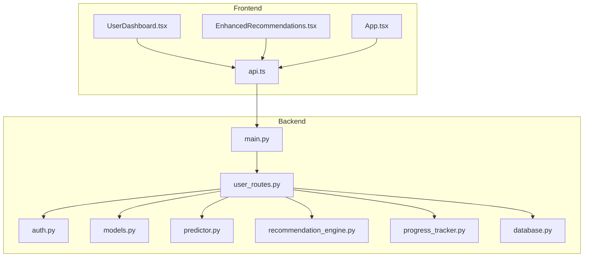
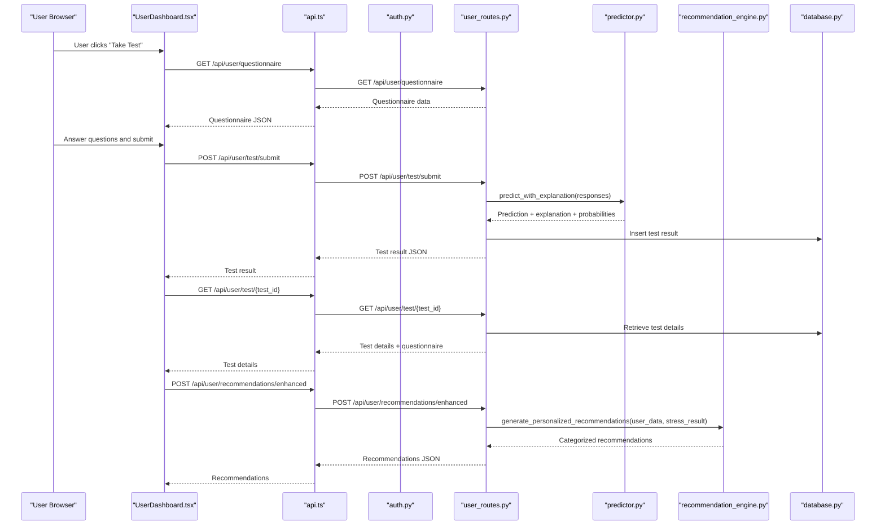
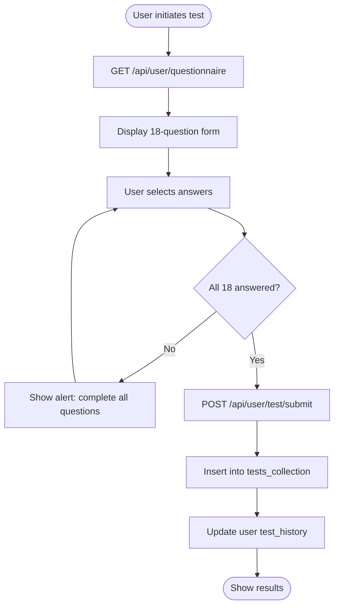
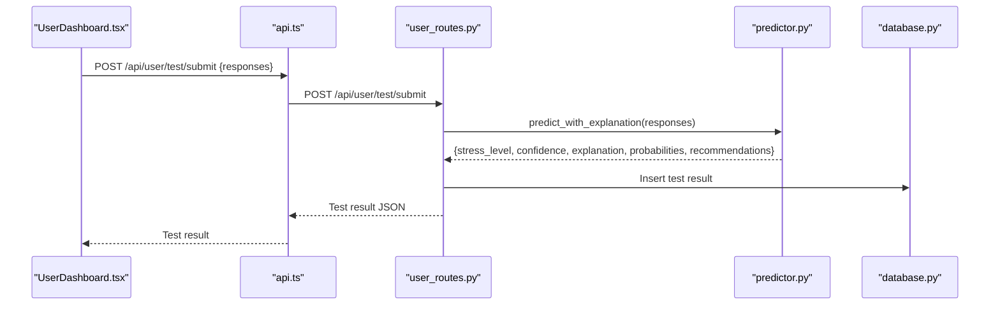
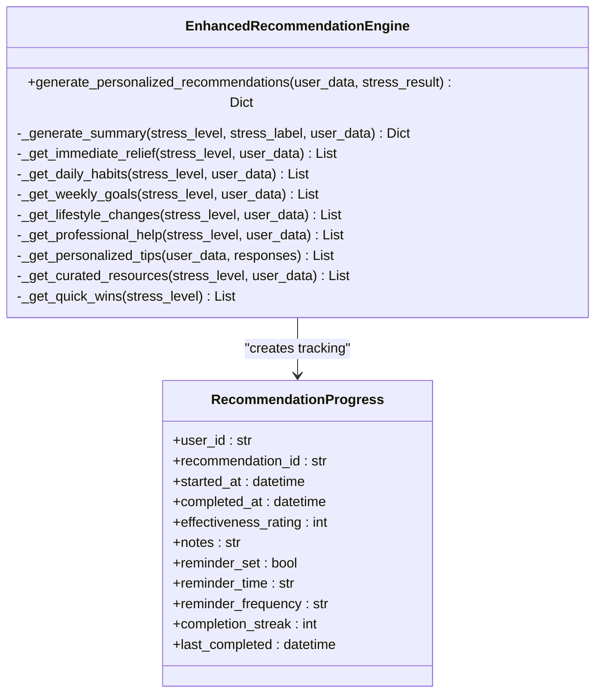
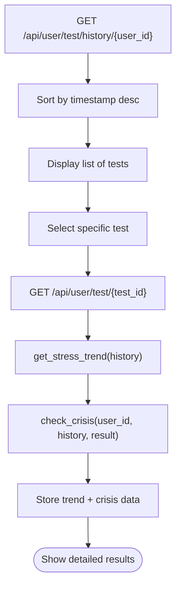
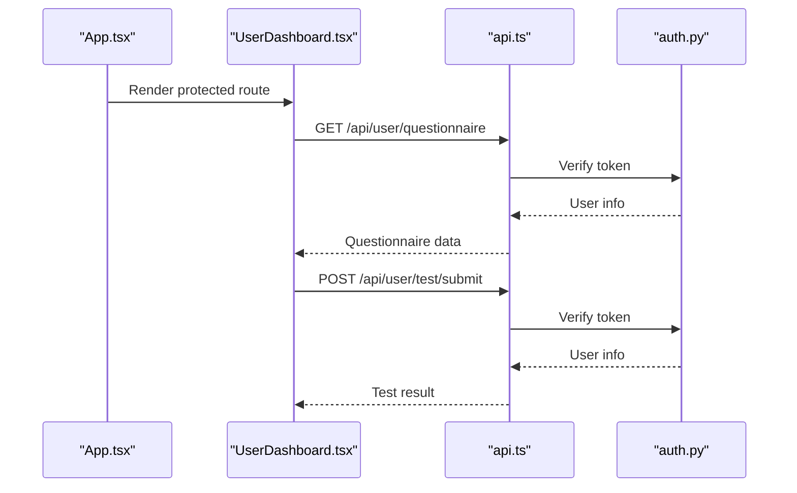
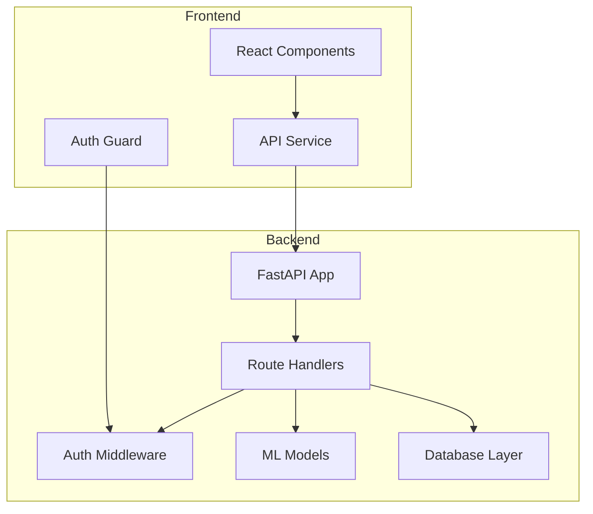

# Assessment Workflow and Integration

<cite>
**Referenced Files in This Document**
- [main.py](file://backend/app/main.py)
- [user_routes.py](file://backend/app/routes/user_routes.py)
- [auth_routes.py](file://backend/app/routes/auth_routes.py)
- [auth.py](file://backend/app/auth.py)
- [models.py](file://backend/app/models.py)
- [predictor.py](file://backend/ml_model/predictor.py)
- [recommendation_engine.py](file://backend/app/recommendation_engine.py)
- [progress_tracker.py](file://backend/app/progress_tracker.py)
- [database.py](file://backend/app/database.py)
- [UserDashboard.tsx](file://frontend/src/pages/UserDashboard.tsx)
- [EnhancedRecommendations.tsx](file://frontend/src/components/EnhancedRecommendations.tsx)
- [api.ts](file://frontend/src/services/api.ts)
- [App.tsx](file://frontend/src/App.tsx)
</cite>

## Table of Contents
1. [Introduction](#introduction)
2. [Project Structure](#project-structure)
3. [Core Components](#core-components)
4. [Architecture Overview](#architecture-overview)
5. [Detailed Component Analysis](#detailed-component-analysis)
6. [Dependency Analysis](#dependency-analysis)
7. [Performance Considerations](#performance-considerations)
8. [Troubleshooting Guide](#troubleshooting-guide)
9. [Conclusion](#conclusion)

## Introduction
This document describes the complete stress assessment workflow from user initiation to result delivery and recommendation integration. It covers the step-by-step process including questionnaire access, real-time validation, submission handling, result processing, integration with the recommendation engine, test history management, progress tracking, frontend integration points, and user experience considerations. The workflow spans both frontend and backend systems with secure authentication, robust data validation, and personalized recommendations powered by machine learning.

## Project Structure
The system consists of:
- Backend API built with FastAPI, providing user, authentication, recommendation, progress tracking, and analytics endpoints
- Machine learning models for stress prediction, SHAP-based explainability, and recommendation ranking
- Frontend built with React/Vite, consuming the backend API and managing user interactions

**Diagram sources**
- [main.py:52-80](file://backend/app/main.py#L52-L80)
- [user_routes.py:32-39](file://backend/app/routes/user_routes.py#L32-L39)
- [auth.py:98-151](file://backend/app/auth.py#L98-L151)
- [models.py:78-89](file://backend/app/models.py#L78-L89)
- [predictor.py:119-185](file://backend/ml_model/predictor.py#L119-L185)
- [recommendation_engine.py:17-58](file://backend/app/recommendation_engine.py#L17-L58)
- [progress_tracker.py:48-134](file://backend/app/progress_tracker.py#L48-L134)
- [database.py:88-162](file://backend/app/database.py#L88-L162)
- [UserDashboard.tsx:129-228](file://frontend/src/pages/UserDashboard.tsx#L129-L228)
- [EnhancedRecommendations.tsx:24-42](file://frontend/src/components/EnhancedRecommendations.tsx#L24-L42)
- [api.ts:14-19](file://frontend/src/services/api.ts#L14-L19)

**Section sources**
- [main.py:52-80](file://backend/app/main.py#L52-L80)
- [user_routes.py:32-39](file://backend/app/routes/user_routes.py#L32-L39)
- [database.py:88-162](file://backend/app/database.py#L88-L162)

## Core Components
- Authentication and Authorization: JWT-based authentication with role-based access control and middleware enforcement
- Assessment Engine: Questionnaire retrieval, validation, ML prediction with SHAP explainability, and trend/crisis detection
- Recommendation Engine: AI-powered, personalized recommendations with categorization and ranking
- Progress Tracker: Gamification system with points, badges, streaks, and achievement tracking
- Frontend Services: Axios-based API client with automatic token injection and error handling
- Database Layer: MongoDB with connection pooling and optimized indexes

**Section sources**
- [auth.py:98-151](file://backend/app/auth.py#L98-L151)
- [user_routes.py:171-184](file://backend/app/routes/user_routes.py#L171-L184)
- [predictor.py:119-185](file://backend/ml_model/predictor.py#L119-L185)
- [recommendation_engine.py:17-58](file://backend/app/recommendation_engine.py#L17-L58)
- [progress_tracker.py:48-134](file://backend/app/progress_tracker.py#L48-L134)
- [api.ts:215-235](file://frontend/src/services/api.ts#L215-L235)
- [database.py:30-46](file://backend/app/database.py#L30-L46)

## Architecture Overview
The assessment workflow follows a client-server architecture with the frontend driving user interactions and the backend orchestrating data processing and ML inference.

**Diagram sources**
- [UserDashboard.tsx:129-228](file://frontend/src/pages/UserDashboard.tsx#L129-L228)
- [api.ts:14-19](file://frontend/src/services/api.ts#L14-L19)
- [auth.py:98-151](file://backend/app/auth.py#L98-L151)
- [user_routes.py:171-184](file://backend/app/routes/user_routes.py#L171-L184)
- [user_routes.py:407-499](file://backend/app/routes/user_routes.py#L407-L499)
- [user_routes.py:534-569](file://backend/app/routes/user_routes.py#L534-L569)
- [user_routes.py:575-647](file://backend/app/routes/user_routes.py#L575-L647)
- [predictor.py:146-185](file://backend/ml_model/predictor.py#L146-L185)
- [recommendation_engine.py:17-58](file://backend/app/recommendation_engine.py#L17-L58)
- [database.py:106-115](file://backend/app/database.py#L106-L115)

## Detailed Component Analysis

### Questionnaire Access and Real-Time Validation
- Frontend loads the 18-question CBT-based questionnaire from the backend
- Real-time validation prevents submission until all questions are answered
- Timer-based auto-submission ensures timely completion
- Duplicate submission prevention avoids race conditions

**Diagram sources**
- [UserDashboard.tsx:129-228](file://frontend/src/pages/UserDashboard.tsx#L129-L228)
- [user_routes.py:171-184](file://backend/app/routes/user_routes.py#L171-L184)
- [user_routes.py:407-499](file://backend/app/routes/user_routes.py#L407-L499)

**Section sources**
- [UserDashboard.tsx:129-228](file://frontend/src/pages/UserDashboard.tsx#L129-L228)
- [user_routes.py:171-184](file://backend/app/routes/user_routes.py#L171-L184)
- [user_routes.py:407-499](file://backend/app/routes/user_routes.py#L407-L499)

### Submission Handling and Result Processing
- Backend validates response count and range (1-5 per question)
- ML predictor computes stress level, confidence, continuous score, and recommendations
- SHAP-based explainability identifies top contributing factors
- Trend analysis and crisis detection provide contextual insights
- Results stored with timestamps and user associations

**Diagram sources**
- [UserDashboard.tsx:204-228](file://frontend/src/pages/UserDashboard.tsx#L204-L228)
- [user_routes.py:407-499](file://backend/app/routes/user_routes.py#L407-L499)
- [predictor.py:146-185](file://backend/ml_model/predictor.py#L146-L185)

**Section sources**
- [user_routes.py:407-499](file://backend/app/routes/user_routes.py#L407-L499)
- [predictor.py:119-185](file://backend/ml_model/predictor.py#L119-L185)

### Recommendation Engine Integration
- Enhanced recommendations generated based on latest test result and user history
- Categorization includes immediate relief, daily habits, weekly goals, lifestyle changes, professional help, personalized tips, curated resources, and quick wins
- AI-powered ranking considers user profile and stress patterns
- Frontend displays recommendations with filtering and quick actions

**Diagram sources**
- [recommendation_engine.py:17-58](file://backend/app/recommendation_engine.py#L17-L58)
- [recommendation_engine.py:135-141](file://backend/app/recommendation_engine.py#L135-L141)
- [models.py:190-203](file://backend/app/models.py#L190-L203)

**Section sources**
- [user_routes.py:575-647](file://backend/app/routes/user_routes.py#L575-L647)
- [recommendation_engine.py:17-58](file://backend/app/recommendation_engine.py#L17-L58)
- [EnhancedRecommendations.tsx:24-42](file://frontend/src/components/EnhancedRecommendations.tsx#L24-L42)

### Test History Management and Progress Tracking
- Test history retrieval with object-level authorization
- Trend analysis using linear regression on continuous scores
- Crisis detection based on severity thresholds and patterns
- Progress tracking with reminders, streaks, and gamification points
- Achievement system with badges and level progression

**Diagram sources**
- [user_routes.py:501-532](file://backend/app/routes/user_routes.py#L501-L532)
- [user_routes.py:534-569](file://backend/app/routes/user_routes.py#L534-L569)
- [predictor.py:363-414](file://backend/ml_model/predictor.py#L363-L414)
- [predictor.py:416-484](file://backend/ml_model/predictor.py#L416-L484)

**Section sources**
- [user_routes.py:501-569](file://backend/app/routes/user_routes.py#L501-L569)
- [predictor.py:363-484](file://backend/ml_model/predictor.py#L363-L484)
- [progress_tracker.py:48-134](file://backend/app/progress_tracker.py#L48-L134)

### Frontend Integration Points and User Interface
- Protected routing ensures only authenticated users access dashboards
- API service injects JWT tokens automatically and handles auth errors
- User dashboard provides tabbed navigation for test, chatbot, history, appointments, and records
- Real-time questionnaire interface with progress indicators and timers
- Recommendation display with category filtering and quick actions

**Diagram sources**
- [App.tsx:16-28](file://frontend/src/App.tsx#L16-L28)
- [UserDashboard.tsx:129-228](file://frontend/src/pages/UserDashboard.tsx#L129-L228)
- [api.ts:215-235](file://frontend/src/services/api.ts#L215-L235)
- [auth.py:98-151](file://backend/app/auth.py#L98-L151)

**Section sources**
- [App.tsx:16-28](file://frontend/src/App.tsx#L16-L28)
- [UserDashboard.tsx:129-228](file://frontend/src/pages/UserDashboard.tsx#L129-L228)
- [api.ts:215-235](file://frontend/src/services/api.ts#L215-L235)

## Dependency Analysis
The system exhibits layered dependencies with clear separation of concerns:

**Diagram sources**
- [main.py:52-80](file://backend/app/main.py#L52-L80)
- [user_routes.py:32-39](file://backend/app/routes/user_routes.py#L32-L39)
- [auth.py:98-151](file://backend/app/auth.py#L98-L151)
- [database.py:88-162](file://backend/app/database.py#L88-L162)

**Section sources**
- [main.py:52-80](file://backend/app/main.py#L52-L80)
- [user_routes.py:32-39](file://backend/app/routes/user_routes.py#L32-L39)
- [auth.py:98-151](file://backend/app/auth.py#L98-L151)
- [database.py:88-162](file://backend/app/database.py#L88-L162)

## Performance Considerations
- Database connection pooling with 50 max connections and optimized timeouts
- Pre-computed indexes on frequently queried fields (user_id, timestamp, status)
- SHAP model loading with integrity checks and fallback mechanisms
- JWT token caching and automatic injection to minimize overhead
- Frontend state management to avoid unnecessary re-renders
- Asynchronous processing for recommendation generation and ML inference

## Troubleshooting Guide
Common issues and resolutions:
- Authentication failures: Verify JWT token presence and expiration; check auth middleware configuration
- Database connectivity: Confirm MongoDB connection string and network accessibility; review connection pool settings
- Model loading errors: Ensure ML model files exist and pass integrity checks; verify SHA256 hashes
- CORS issues: Configure ALLOWED_ORIGINS environment variable with actual frontend URLs
- Duplicate submissions: Frontend prevents multiple submissions; backend validates response arrays
- Authorization errors: Verify user roles and object-level permissions for test and recommendation endpoints

**Section sources**
- [auth.py:98-151](file://backend/app/auth.py#L98-L151)
- [database.py:30-46](file://backend/app/database.py#L30-L46)
- [main.py:32-50](file://backend/app/main.py#L32-L50)
- [UserDashboard.tsx:204-228](file://frontend/src/pages/UserDashboard.tsx#L204-L228)
- [user_routes.py:534-569](file://backend/app/routes/user_routes.py#L534-L569)

## Conclusion
The stress assessment workflow integrates frontend user experience with backend ML-powered processing and personalized recommendations. The system emphasizes security through JWT authentication, data validation, and authorization controls. The recommendation engine leverages user history and stress patterns to deliver actionable insights, while the progress tracking system encourages sustained engagement through gamification. Database optimizations and frontend performance considerations ensure responsive interactions across the entire assessment lifecycle.