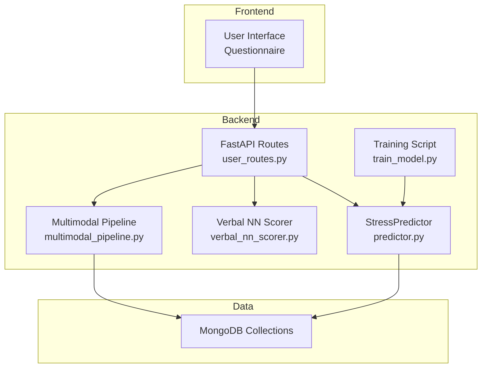
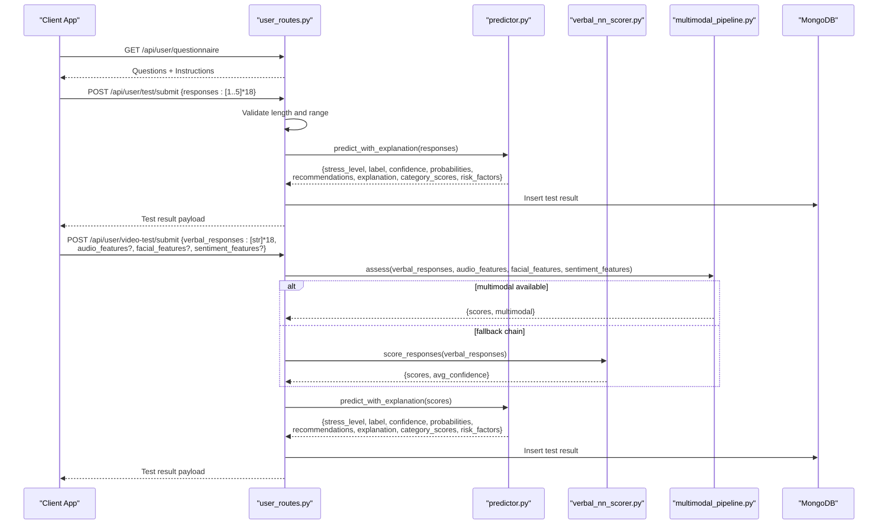
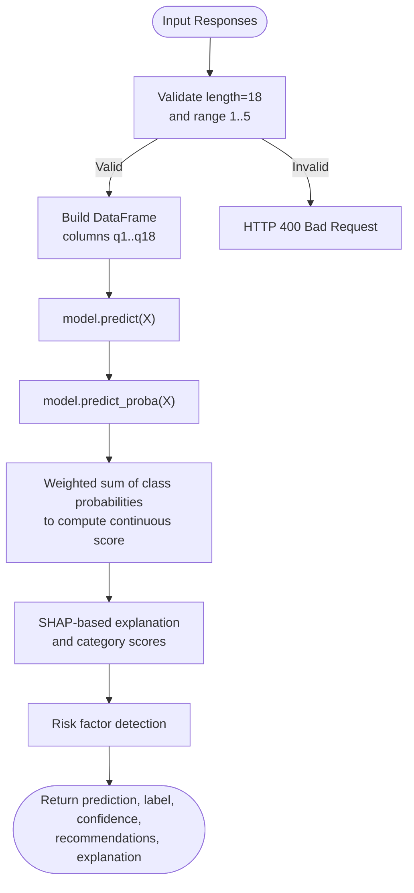
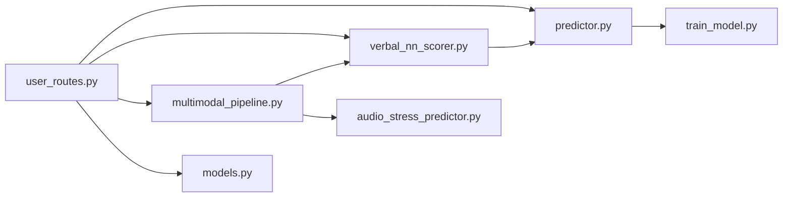

# CBT Questionnaire Design

<cite>
**Referenced Files in This Document**
- [README.md](file://README.md)
- [user_routes.py](file://backend/app/routes/user_routes.py)
- [predictor.py](file://backend/ml_model/predictor.py)
- [train_model.py](file://backend/ml_model/train_model.py)
- [verbal_nn_scorer.py](file://backend/ml_model/verbal_nn_scorer.py)
- [multimodal_pipeline.py](file://backend/ml_model/multimodal_pipeline.py)
- [models.py](file://backend/app/models.py)
</cite>

## Table of Contents
1. [Introduction](#introduction)
2. [Project Structure](#project-structure)
3. [Core Components](#core-components)
4. [Architecture Overview](#architecture-overview)
5. [Detailed Component Analysis](#detailed-component-analysis)
6. [Dependency Analysis](#dependency-analysis)
7. [Performance Considerations](#performance-considerations)
8. [Troubleshooting Guide](#troubleshooting-guide)
9. [Conclusion](#conclusion)

## Introduction
This document describes the Cognitive Behavioral Therapy (CBT)-based 18-question stress assessment questionnaire integrated into the AI Stress Level Analyzer. It covers the questionnaire structure, response scale, scoring methodology, category-based analysis, validation and error handling, and integration with the machine learning prediction pipeline. It also explains how the system supports both structured Likert-scale responses and multimodal natural language processing for real-time validation and enhanced insights.

## Project Structure
The questionnaire is part of a full-stack application with:
- A FastAPI backend exposing REST endpoints for retrieving questions and submitting responses
- A machine learning module that performs classification, explainability, and risk factor detection
- Optional multimodal fusion that integrates natural language, audio, and facial cues for robust stress scoring

**Diagram sources**
- [user_routes.py:150-184](file://backend/app/routes/user_routes.py#L150-L184)
- [predictor.py:32-185](file://backend/ml_model/predictor.py#L32-L185)
- [verbal_nn_scorer.py:12-151](file://backend/ml_model/verbal_nn_scorer.py#L12-L151)
- [multimodal_pipeline.py:11-183](file://backend/ml_model/multimodal_pipeline.py#L11-L183)
- [train_model.py:79-195](file://backend/ml_model/train_model.py#L79-L195)

**Section sources**
- [README.md:69-86](file://README.md#L69-L86)
- [user_routes.py:150-184](file://backend/app/routes/user_routes.py#L150-L184)

## Core Components
- Questionnaire definition and retrieval endpoint
- Structured Likert-scale scoring and validation
- Machine learning prediction with SHAP-based explainability
- Category-level analysis and risk factor identification
- Multimodal fusion for enhanced scoring and confidence
- Training pipeline and model persistence

**Section sources**
- [user_routes.py:150-184](file://backend/app/routes/user_routes.py#L150-L184)
- [predictor.py:119-185](file://backend/ml_model/predictor.py#L119-L185)
- [verbal_nn_scorer.py:121-147](file://backend/ml_model/verbal_nn_scorer.py#L121-L147)
- [multimodal_pipeline.py:74-179](file://backend/ml_model/multimodal_pipeline.py#L74-L179)
- [train_model.py:79-195](file://backend/ml_model/train_model.py#L79-L195)

## Architecture Overview
The questionnaire submission flow integrates structured responses with machine learning prediction and optional multimodal enhancement.

**Diagram sources**
- [user_routes.py:171-184](file://backend/app/routes/user_routes.py#L171-L184)
- [user_routes.py:407-499](file://backend/app/routes/user_routes.py#L407-L499)
- [user_routes.py:308-400](file://backend/app/routes/user_routes.py#L308-L400)
- [predictor.py:146-185](file://backend/ml_model/predictor.py#L146-L185)
- [verbal_nn_scorer.py:121-147](file://backend/ml_model/verbal_nn_scorer.py#L121-L147)
- [multimodal_pipeline.py:74-179](file://backend/ml_model/multimodal_pipeline.py#L74-L179)

## Detailed Component Analysis

### Questionnaire Definition and Categories
- The questionnaire consists of 18 questions organized into five categories:
  - Emotional State (Q1–Q3)
  - Physical Symptoms (Q4–Q7)
  - Cognitive Patterns (Q8–Q11)
  - Behavioral Changes (Q12–Q14)
  - Life Stressors (Q15–Q18)
- Each question is mapped to a category and a clinical rationale aligned with CBT principles.

**Section sources**
- [user_routes.py:150-169](file://backend/app/routes/user_routes.py#L150-L169)
- [README.md:345-366](file://README.md#L345-L366)

### Response Scale and Instructions
- Responses use a 1–5 Likert scale with explicit labels:
  - 1 = Never/Not at all
  - 2 = Rarely/Slightly
  - 3 = Sometimes/Moderately
  - 4 = Often/Very
  - 5 = Always/Extremely
- The retrieval endpoint returns the instructions and scale mapping for display.

**Section sources**
- [user_routes.py:171-184](file://backend/app/routes/user_routes.py#L171-L184)
- [README.md:368-375](file://README.md#L368-L375)

### Validation Rules and Input Sanitization
- Submission validation enforces:
  - Exactly 18 responses
  - Each response is an integer within [1, 5]
- On failure, the backend raises HTTP 400 with a descriptive error message.
- The Pydantic model for structured submissions also validates the list length and element types.

**Section sources**
- [user_routes.py:412-416](file://backend/app/routes/user_routes.py#L412-L416)
- [models.py:78-89](file://backend/app/models.py#L78-L89)

### Scoring Methodology and ML Integration
- The machine learning model expects a 18-element vector of integers in [1, 5].
- The predictor:
  - Validates input length and range
  - Converts responses to a DataFrame with columns q1..q18
  - Produces a predicted stress level (0–3), label, confidence, and recommendations
  - Computes continuous score as a weighted sum of class probabilities
- The training script builds an ensemble model (Random Forest + Gradient Boosting + Logistic Regression) with probability calibration and saves metadata for integrity checks.

**Diagram sources**
- [predictor.py:119-185](file://backend/ml_model/predictor.py#L119-L185)
- [train_model.py:79-195](file://backend/ml_model/train_model.py#L79-L195)

**Section sources**
- [predictor.py:119-185](file://backend/ml_model/predictor.py#L119-L185)
- [train_model.py:79-195](file://backend/ml_model/train_model.py#L79-L195)

### Category-Based Analysis and Risk Factors
- Category scores are computed by averaging responses within each category:
  - Severity thresholds: <2 low, <3 moderate, <4 high, ≥4 severe
- Risk factors include:
  - Sleep disruption (Q6 ≥ 4)
  - Combined withdrawal/negative thoughts/overwhelm (Q9, Q13, Q14 ≥ 4)
  - Cardiovascular stress (Q7 ≥ 4)
  - Compound external stress (Q16 and Q18 ≥ 4)
  - Global high average (>4.0)
- These heuristics inform recommendations and crisis detection.

**Section sources**
- [predictor.py:258-306](file://backend/ml_model/predictor.py#L258-L306)

### Natural Language Processing and Multimodal Fusion
- Natural language responses are scored via a neural network model that maps textual intensity to 1–5 scores.
- The multimodal pipeline:
  - Normalizes text average score to a 0–1 signal
  - Incorporates audio features (e.g., speaking rate) and facial/sentiment signals
  - Applies adaptive weights based on model confidence and feature availability
  - Adjusts scores and stress level when audio or text confidence is high and consistent
- The pipeline returns a fused stress level, confidence, and detailed input signals.

**Section sources**
- [verbal_nn_scorer.py:12-151](file://backend/ml_model/verbal_nn_scorer.py#L12-L151)
- [multimodal_pipeline.py:11-183](file://backend/ml_model/multimodal_pipeline.py#L11-L183)

### Real-Time Validation Mechanisms
- The backend validates:
  - Number of responses (must be 18)
  - Range of each response (must be 1–5)
- The frontend prevents submission until all questions are answered and coordinates auto-submit timing.
- The multimodal pipeline provides confidence-aware adjustments and fallbacks when audio or text signals are weak.

**Section sources**
- [user_routes.py:412-416](file://backend/app/routes/user_routes.py#L412-L416)
- [frontend UserDashboard.tsx:183-202](file://frontend/src/pages/UserDashboard.tsx#L183-L202)

### Recommendations and Trend/Crisis Detection
- Recommendations are generated based on stress level and selected high-scoring responses.
- Trend analysis computes slope, volatility, recent average, and forecasted next level using historical tests.
- Crisis detection evaluates current level, consecutive severe assessments, and spikes from prior tests.

**Section sources**
- [predictor.py:308-484](file://backend/ml_model/predictor.py#L308-L484)

## Dependency Analysis
The questionnaire and ML pipeline depend on:
- FastAPI routes for serving questions and accepting submissions
- Pydantic models for request validation
- Scikit-learn models for classification and SHAP-based explainability
- Optional Groq LLM for natural language scoring fallback
- MongoDB for storing test results and user history

**Diagram sources**
- [user_routes.py:19-28](file://backend/app/routes/user_routes.py#L19-L28)
- [predictor.py:10](file://backend/ml_model/predictor.py#L10)
- [verbal_nn_scorer.py:1-10](file://backend/ml_model/verbal_nn_scorer.py#L1-L10)
- [multimodal_pipeline.py:5-6](file://backend/ml_model/multimodal_pipeline.py#L5-L6)
- [models.py:7-13](file://backend/app/models.py#L7-L13)

**Section sources**
- [user_routes.py:19-28](file://backend/app/routes/user_routes.py#L19-L28)
- [predictor.py:10](file://backend/ml_model/predictor.py#L10)
- [verbal_nn_scorer.py:1-10](file://backend/ml_model/verbal_nn_scorer.py#L1-L10)
- [multimodal_pipeline.py:5-6](file://backend/ml_model/multimodal_pipeline.py#L5-L6)
- [models.py:7-13](file://backend/app/models.py#L7-L13)

## Performance Considerations
- The Random Forest ensemble balances accuracy and speed; SHAP explanations rely on a dedicated tree model for interpretability.
- Multimodal fusion dynamically weights inputs based on confidence, reducing reliance on weak signals.
- Training metadata and integrity checks ensure model reliability and enable periodic retraining.

[No sources needed since this section provides general guidance]

## Troubleshooting Guide
Common issues and resolutions:
- Missing or corrupted model files: The predictor auto-trains on startup using the training script and metadata.
- Invalid submission format: Ensure exactly 18 integers in [1, 5]; the backend returns HTTP 400 with a clear message.
- Multimodal pipeline failures: The system falls back to text-only scoring; verify audio feature coverage and confidence thresholds.
- Frontend submission errors: Confirm all questions are answered and the submission button is not clicked prematurely.

**Section sources**
- [predictor.py:81-98](file://backend/ml_model/predictor.py#L81-L98)
- [user_routes.py:412-416](file://backend/app/routes/user_routes.py#L412-L416)
- [multimodal_pipeline.py:74-179](file://backend/ml_model/multimodal_pipeline.py#L74-L179)

## Conclusion
The CBT-based 18-question stress assessment integrates robust validation, structured scoring, and advanced machine learning to deliver reliable stress predictions. The system supports both traditional Likert-scale submissions and multimodal natural language processing, enabling real-time validation and enhanced insights. With category-based analysis, risk factor detection, and trend/crisis monitoring, it provides a comprehensive foundation for personalized stress management and clinical decision support.