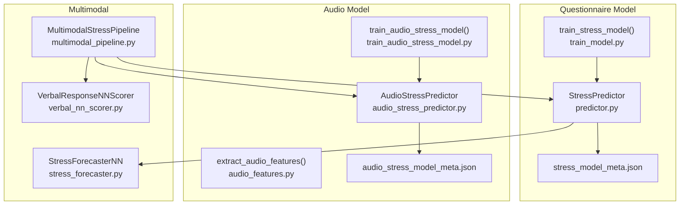
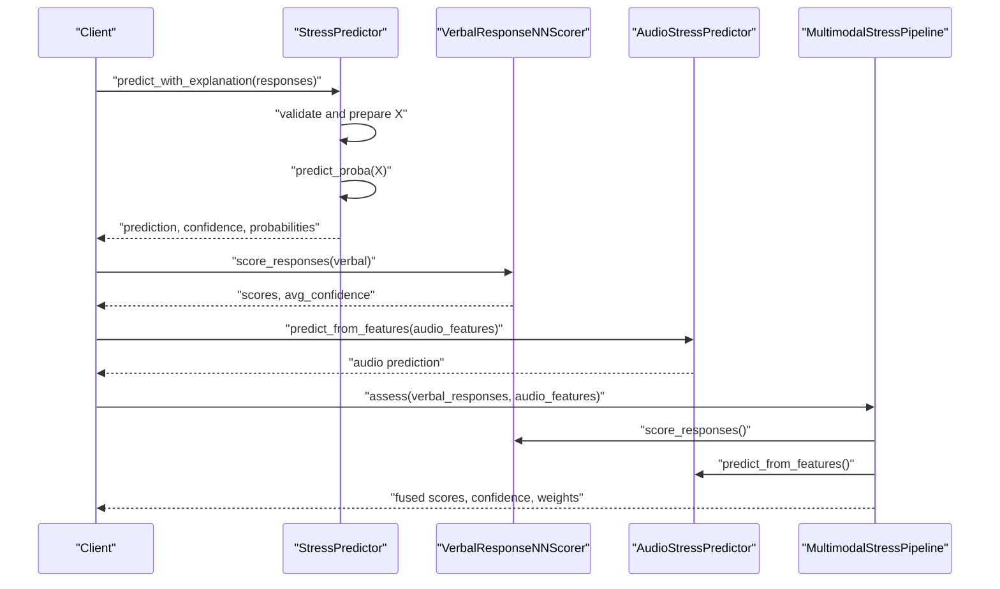
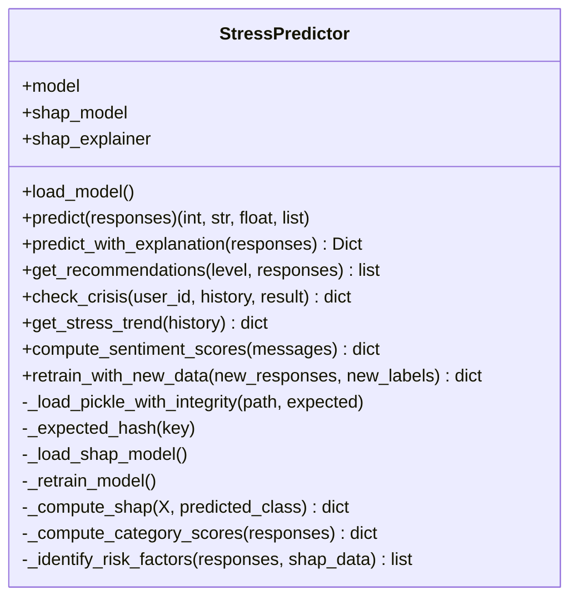
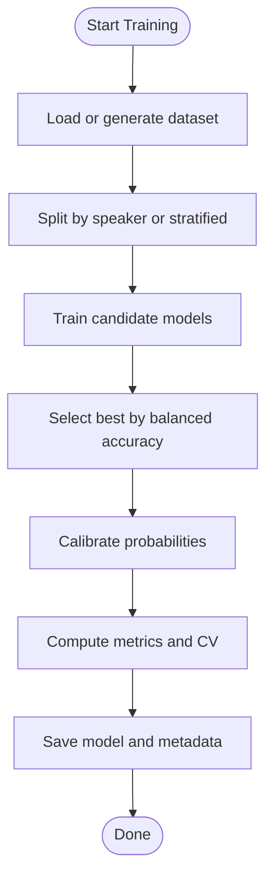
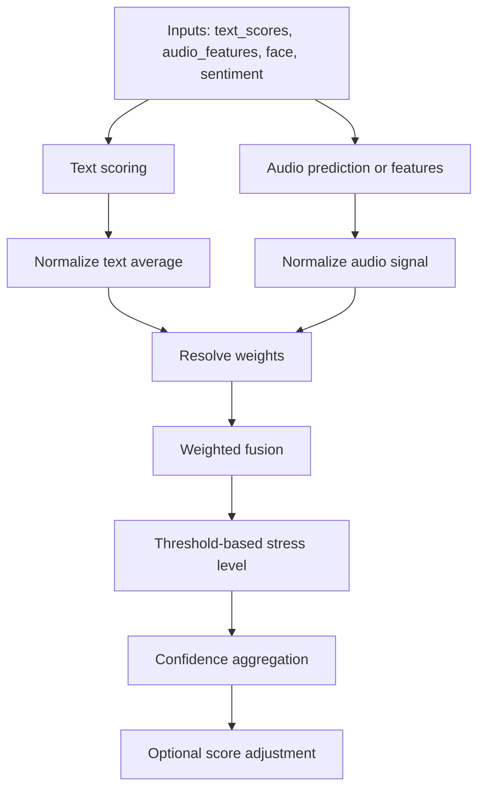
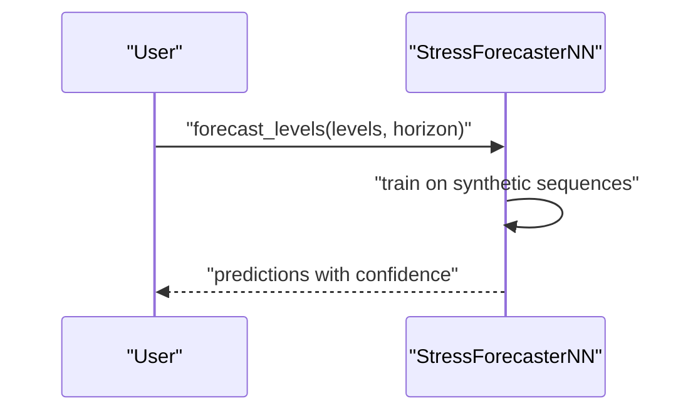
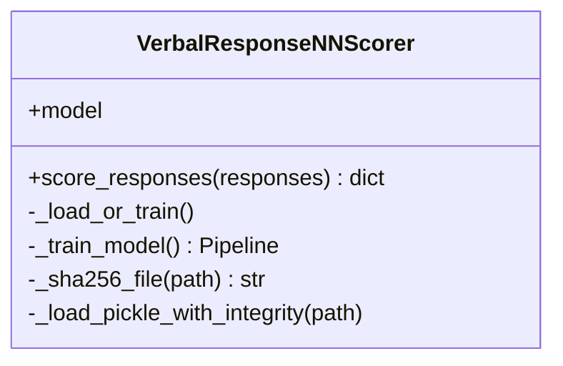
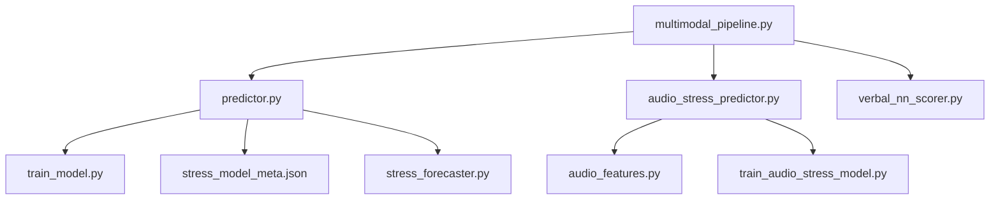

# Machine Learning Model Implementation

<cite>
**Referenced Files in This Document**
- [predictor.py](file://backend/ml_model/predictor.py)
- [train_model.py](file://backend/ml_model/train_model.py)
- [stress_model_meta.json](file://backend/ml_model/stress_model_meta.json)
- [audio_stress_predictor.py](file://backend/ml_model/audio_stress_predictor.py)
- [audio_features.py](file://backend/ml_model/audio_features.py)
- [train_audio_stress_model.py](file://backend/ml_model/train_audio_stress_model.py)
- [multimodal_pipeline.py](file://backend/ml_model/multimodal_pipeline.py)
- [stress_forecaster.py](file://backend/ml_model/stress_forecaster.py)
- [verbal_nn_scorer.py](file://backend/ml_model/verbal_nn_scorer.py)
- [VOICE_STRESS_TRAINING.md](file://backend/ml_model/VOICE_STRESS_TRAINING.md)
- [prepare_emodb_manifest.py](file://backend/ml_model/prepare_emodb_manifest.py)
- [audio_dataset_tools.py](file://backend/ml_model/audio_dataset_tools.py)
- [emodb_stress_manifest.csv](file://backend/ml_model/emodb_stress_manifest.csv)
</cite>

## Table of Contents
1. [Introduction](#introduction)
2. [Project Structure](#project-structure)
3. [Core Components](#core-components)
4. [Architecture Overview](#architecture-overview)
5. [Detailed Component Analysis](#detailed-component-analysis)
6. [Dependency Analysis](#dependency-analysis)
7. [Performance Considerations](#performance-considerations)
8. [Troubleshooting Guide](#troubleshooting-guide)
9. [Conclusion](#conclusion)
10. [Appendices](#appendices)

## Introduction
This document describes the ensemble machine learning implementation used for stress level prediction in the AI-STRESS-DETECTOR project. It covers the questionnaire-based model, the audio-only stress classifier, multimodal fusion, explainability via SHAP, and operational aspects such as model persistence, integrity checks, and automatic retraining. The stress classification system uses four ordinal classes: Low, Moderate, High, and Severe. Probability scoring and confidence estimation are provided, along with category-level analysis and clinical risk factor identification.

## Project Structure
The machine learning stack resides under backend/ml_model and consists of:
- Questionnaire-based ensemble model and predictor
- Audio-only stress classifier and feature extraction
- Multimodal fusion pipeline integrating text, audio, and auxiliary signals
- Forecaster for short-term stress trajectory predictions
- Verbal neural network scorer for converting natural language responses into 1–5 scores
- Training utilities and documentation for voice stress modeling

**Diagram sources**
- [predictor.py:32-590](file://backend/ml_model/predictor.py#L32-L590)
- [train_model.py:79-195](file://backend/ml_model/train_model.py#L79-L195)
- [stress_model_meta.json:1-31](file://backend/ml_model/stress_model_meta.json#L1-L31)
- [audio_stress_predictor.py:13-157](file://backend/ml_model/audio_stress_predictor.py#L13-L157)
- [audio_features.py:261-352](file://backend/ml_model/audio_features.py#L261-L352)
- [train_audio_stress_model.py:261-417](file://backend/ml_model/train_audio_stress_model.py#L261-L417)
- [multimodal_pipeline.py:11-183](file://backend/ml_model/multimodal_pipeline.py#L11-L183)
- [verbal_nn_scorer.py:12-151](file://backend/ml_model/verbal_nn_scorer.py#L12-L151)
- [stress_forecaster.py:7-96](file://backend/ml_model/stress_forecaster.py#L7-L96)

**Section sources**
- [predictor.py:32-590](file://backend/ml_model/predictor.py#L32-L590)
- [train_model.py:79-195](file://backend/ml_model/train_model.py#L79-L195)
- [audio_stress_predictor.py:13-157](file://backend/ml_model/audio_stress_predictor.py#L13-L157)
- [audio_features.py:261-352](file://backend/ml_model/audio_features.py#L261-L352)
- [multimodal_pipeline.py:11-183](file://backend/ml_model/multimodal_pipeline.py#L11-L183)
- [stress_forecaster.py:7-96](file://backend/ml_model/stress_forecaster.py#L7-L96)
- [verbal_nn_scorer.py:12-151](file://backend/ml_model/verbal_nn_scorer.py#L12-L151)

## Core Components
- Questionnaire-based ensemble model: Soft-voting ensemble of Random Forest, Gradient Boosting, and Logistic Regression with isotonic probability calibration. Provides class predictions, per-class probabilities, and confidence derived from the predicted class’s probability.
- Audio-only stress classifier: Trains an ensemble of tree-based and linear models on hand-crafted voice features; saves a dedicated tree model for SHAP explainability.
- Multimodal fusion: Combines textual, audio, and auxiliary signals into a fused stress level with dynamic weighting and confidence estimation.
- Forecaster: Autoregressive neural network for short-term stress trajectory forecasting.
- Verbal neural network scorer: Lightweight MLP that converts natural language responses into 1–5 scores per question.
- Integrity and persistence: SHA-256 integrity checks for pickled models, environment variable overrides, and automatic retraining when models are missing or corrupted.

**Section sources**
- [predictor.py:32-590](file://backend/ml_model/predictor.py#L32-L590)
- [train_model.py:79-195](file://backend/ml_model/train_model.py#L79-L195)
- [audio_stress_predictor.py:13-157](file://backend/ml_model/audio_stress_predictor.py#L13-L157)
- [train_audio_stress_model.py:261-417](file://backend/ml_model/train_audio_stress_model.py#L261-L417)
- [multimodal_pipeline.py:11-183](file://backend/ml_model/multimodal_pipeline.py#L11-L183)
- [stress_forecaster.py:7-96](file://backend/ml_model/stress_forecaster.py#L7-L96)
- [verbal_nn_scorer.py:12-151](file://backend/ml_model/verbal_nn_scorer.py#L12-L151)

## Architecture Overview
The system integrates three primary prediction pathways:
- Text-only: Natural language responses scored by a neural scorer, then aggregated into a 1–5 scale per question.
- Audio-only: Extracted voice features fed into a trained audio classifier.
- Multimodal: Fused combination of text, audio, and auxiliary signals with adaptive weights and confidence.

**Diagram sources**
- [predictor.py:119-185](file://backend/ml_model/predictor.py#L119-L185)
- [verbal_nn_scorer.py:121-147](file://backend/ml_model/verbal_nn_scorer.py#L121-L147)
- [audio_stress_predictor.py:97-153](file://backend/ml_model/audio_stress_predictor.py#L97-L153)
- [multimodal_pipeline.py:74-179](file://backend/ml_model/multimodal_pipeline.py#L74-L179)

## Detailed Component Analysis

### Questionnaire-Based Ensemble Model
- Model composition: Soft-voting ensemble of Random Forest, Gradient Boosting, and Logistic Regression; isotonic calibration applied to the ensemble to improve probability reliability.
- Training data: Either a large synthetic dataset or a CSV dataset; stratified train/test split; cross-validation performed on the base ensemble.
- Prediction pipeline: Validates input shape and response range, constructs a DataFrame, runs predict and predict_proba, computes confidence from the predicted class’s probability, and generates recommendations.
- Metadata: Saved alongside the model, including dataset path, rows, feature list, model type, and SHA-256 hashes for integrity verification.
- Automatic retraining: If the persisted model fails integrity checks or is missing, the predictor triggers a retrain and replaces the invalid file.

**Diagram sources**
- [predictor.py:32-590](file://backend/ml_model/predictor.py#L32-L590)

**Section sources**
- [predictor.py:32-590](file://backend/ml_model/predictor.py#L32-L590)
- [train_model.py:79-195](file://backend/ml_model/train_model.py#L79-L195)
- [stress_model_meta.json:1-31](file://backend/ml_model/stress_model_meta.json#L1-L31)

### Audio Stress Classifier
- Feature extraction: Hand-crafted voice features computed from PCM WAV files, including energy, spectral, pitch, jitter/shimmer, pause/voiced ratios, MFCC statistics, and speech turn density.
- Training: Candidate models include ensemble of Random Forest/Extra Trees with Logistic Regression; optional SVM and Extra Trees baselines; best model selected by balanced accuracy; cross-validation performed with speaker-aware splits when possible.
- Persistence and integrity: Trained model and metadata saved; metadata includes feature set, class distribution, cross-validation metrics, and top feature importances.
- Prediction: Loads model and metadata, supports both feature vectors and direct WAV file input; returns stress level, confidence, normalized stress, and per-class probabilities.

**Diagram sources**
- [train_audio_stress_model.py:261-417](file://backend/ml_model/train_audio_stress_model.py#L261-L417)
- [audio_features.py:261-352](file://backend/ml_model/audio_features.py#L261-L352)

**Section sources**
- [audio_stress_predictor.py:13-157](file://backend/ml_model/audio_stress_predictor.py#L13-L157)
- [audio_features.py:261-352](file://backend/ml_model/audio_features.py#L261-L352)
- [train_audio_stress_model.py:261-417](file://backend/ml_model/train_audio_stress_model.py#L261-L417)
- [VOICE_STRESS_TRAINING.md:1-189](file://backend/ml_model/VOICE_STRESS_TRAINING.md#L1-L189)

### Multimodal Fusion Pipeline
- Inputs: Text scores from verbal neural scorer, audio features or audio prediction, optional facial and sentiment features.
- Signal normalization: Text average mapped to 0–1; speaking rate signal normalized around 140 WPM; audio signal from trained model or heuristic.
- Dynamic weights: Adjusted based on audio prediction confidence and whether imputation was used; higher weights for audio when confident and complete.
- Fused stress level: Determined by thresholds; confidence combines text confidence, audio confidence, and fusion margin.
- Adjustment: When audio prediction is highly confident and severe, scores and fused level may be boosted.

**Diagram sources**
- [multimodal_pipeline.py:74-179](file://backend/ml_model/multimodal_pipeline.py#L74-L179)

**Section sources**
- [multimodal_pipeline.py:11-183](file://backend/ml_model/multimodal_pipeline.py#L11-L183)

### Forecaster for Short-Term Trajectories
- Model: Autoregressive neural network trained on synthetic stress sequences with drift and noise.
- Inputs: Recent stress levels; windowed autoregression.
- Outputs: Predictions for next steps with label conversion and confidence based on historical variance.

**Diagram sources**
- [stress_forecaster.py:45-82](file://backend/ml_model/stress_forecaster.py#L45-L82)

**Section sources**
- [stress_forecaster.py:7-96](file://backend/ml_model/stress_forecaster.py#L7-L96)

### Verbal Neural Network Scorer
- Purpose: Convert natural language responses into 1–5 scores per question using a small MLP with TF-IDF features.
- Special handling: Inverts the score for a satisfaction question to align with stress direction.
- Integrity: Loads or trains the model with SHA-256 integrity check against an environment variable.

**Diagram sources**
- [verbal_nn_scorer.py:12-151](file://backend/ml_model/verbal_nn_scorer.py#L12-L151)

**Section sources**
- [verbal_nn_scorer.py:12-151](file://backend/ml_model/verbal_nn_scorer.py#L12-L151)

## Dependency Analysis
- Cohesion: Each component encapsulates a single responsibility—training, prediction, explainability, or fusion—promoting modularity.
- Coupling: The multimodal pipeline depends on the questionnaire predictor, audio predictor, and verbal scorer; the predictor depends on training utilities and metadata; the audio pipeline depends on feature extraction and training utilities.
- External dependencies: scikit-learn for models and utilities; joblib/pickle for persistence; SHAP for explainability (optional); NumPy/Pandas for data manipulation.

**Diagram sources**
- [predictor.py:32-590](file://backend/ml_model/predictor.py#L32-L590)
- [train_model.py:79-195](file://backend/ml_model/train_model.py#L79-L195)
- [audio_stress_predictor.py:13-157](file://backend/ml_model/audio_stress_predictor.py#L13-L157)
- [audio_features.py:261-352](file://backend/ml_model/audio_features.py#L261-L352)
- [train_audio_stress_model.py:261-417](file://backend/ml_model/train_audio_stress_model.py#L261-L417)
- [multimodal_pipeline.py:11-183](file://backend/ml_model/multimodal_pipeline.py#L11-L183)
- [verbal_nn_scorer.py:12-151](file://backend/ml_model/verbal_nn_scorer.py#L12-L151)
- [stress_forecaster.py:7-96](file://backend/ml_model/stress_forecaster.py#L7-L96)

**Section sources**
- [predictor.py:32-590](file://backend/ml_model/predictor.py#L32-L590)
- [train_model.py:79-195](file://backend/ml_model/train_model.py#L79-L195)
- [audio_stress_predictor.py:13-157](file://backend/ml_model/audio_stress_predictor.py#L13-L157)
- [audio_features.py:261-352](file://backend/ml_model/audio_features.py#L261-L352)
- [train_audio_stress_model.py:261-417](file://backend/ml_model/train_audio_stress_model.py#L261-L417)
- [multimodal_pipeline.py:11-183](file://backend/ml_model/multimodal_pipeline.py#L11-L183)
- [verbal_nn_scorer.py:12-151](file://backend/ml_model/verbal_nn_scorer.py#L12-L151)
- [stress_forecaster.py:7-96](file://backend/ml_model/stress_forecaster.py#L7-L96)

## Performance Considerations
- Calibration: Isotonic calibration improves probability reliability for the questionnaire model, aiding confidence interpretation.
- Cross-validation: Base ensemble evaluated with cross-validation; audio model uses stratified or speaker-aware splits when available.
- Class balancing: Uses balanced class weights in tree-based models and balanced subsampling in some audio pipelines.
- Feature importance: Random Forest importances and permutation importance computed for interpretability and potential feature selection.
- Computational cost: SHAP computations require a tree-based model; fallback to model-level feature importances when SHAP is unavailable.

[No sources needed since this section provides general guidance]

## Troubleshooting Guide
- Model integrity failures: If SHA-256 mismatches occur, the system raises an error and attempts to retrain. Ensure environment variables for expected hashes match the persisted metadata.
- Missing or corrupted model files: The predictor and audio predictor automatically trigger retraining when files are absent or fail integrity checks.
- Audio feature extraction errors: If audio files are unreadable or unsupported, feature extraction raises exceptions; use PCM WAV files and ensure proper paths.
- SHAP availability: If SHAP is not installed, the system falls back to tree-based feature importances; install SHAP for full explainability.
- Dataset issues: For audio training, ensure manifests include required columns and speaker IDs for speaker-aware evaluation; use the provided manifest preparation scripts.

**Section sources**
- [predictor.py:73-79](file://backend/ml_model/predictor.py#L73-L79)
- [audio_stress_predictor.py:37-51](file://backend/ml_model/audio_stress_predictor.py#L37-L51)
- [train_audio_stress_model.py:368-401](file://backend/ml_model/train_audio_stress_model.py#L368-L401)
- [audio_dataset_tools.py:112-137](file://backend/ml_model/audio_dataset_tools.py#L112-L137)
- [prepare_emodb_manifest.py:47-102](file://backend/ml_model/prepare_emodb_manifest.py#L47-L102)

## Conclusion
The system provides a robust, modular framework for stress level prediction across modalities. The questionnaire-based ensemble offers reliable probabilistic predictions with calibrated confidence and SHAP-based explainability. The audio-only classifier leverages hand-crafted voice features with speaker-aware training and evaluation. The multimodal pipeline integrates diverse inputs with dynamic weighting and confidence aggregation. Operational safeguards include integrity checks, automatic retraining, and clear metadata for reproducibility.

[No sources needed since this section summarizes without analyzing specific files]

## Appendices

### Model Metadata Management
- Questionnaire model metadata includes dataset path, rows, features, model type, accuracy, cross-validation metrics, and SHA-256 hashes.
- Audio model metadata includes feature source, split method, class distribution, cross-validation results, and top feature importances.

**Section sources**
- [stress_model_meta.json:1-31](file://backend/ml_model/stress_model_meta.json#L1-L31)
- [audio_stress_predictor.py:52-56](file://backend/ml_model/audio_stress_predictor.py#L52-L56)
- [train_audio_stress_model.py:370-399](file://backend/ml_model/train_audio_stress_model.py#L370-L399)

### SHAP Explainability Implementation
- SHAP TreeExplainer used when a tree-based model is available; otherwise, model-level feature importances are used as a fallback.
- Top contributing questions are identified by absolute SHAP values or importances, with impact direction indicated.

**Section sources**
- [predictor.py:187-256](file://backend/ml_model/predictor.py#L187-L256)

### Feature Engineering Process
- Questionnaire features: 18 questions scored 1–5; synthetic generation with class-specific distributions; optional retraining with new labeled data appended to CSV.
- Audio features: Energy, spectral, pitch, jitter/shimmer, pause/voiced ratios, MFCC statistics, and speech turn density; computed from PCM WAV files.

**Section sources**
- [train_model.py:26-77](file://backend/ml_model/train_model.py#L26-L77)
- [audio_features.py:261-352](file://backend/ml_model/audio_features.py#L261-L352)

### Model Persistence and Integrity Checking
- Pickle-based persistence with SHA-256 integrity verification; environment variables override expected hashes when provided.
- Automatic retraining triggered on load failure or missing files.

**Section sources**
- [predictor.py:48-79](file://backend/ml_model/predictor.py#L48-L79)
- [verbal_nn_scorer.py:28-35](file://backend/ml_model/verbal_nn_scorer.py#L28-L35)
- [audio_stress_predictor.py:44-50](file://backend/ml_model/audio_stress_predictor.py#L44-L50)

### Automatic Retraining Capabilities
- Questionnaire model: Retrains when the persisted model is missing or integrity check fails; optionally retrain with new labeled data appended to the training CSV.
- Audio model: Retrains from manifest or precomputed features; selects best model by balanced accuracy.

**Section sources**
- [predictor.py:81-98](file://backend/ml_model/predictor.py#L81-L98)
- [train_model.py:79-195](file://backend/ml_model/train_model.py#L79-L195)
- [train_audio_stress_model.py:261-417](file://backend/ml_model/train_audio_stress_model.py#L261-L417)

### Deployment Considerations
- Ensure SHAP is installed for full explainability; otherwise, fallbacks are used.
- Use speaker-aware splits for audio models; validate class distribution and balanced accuracy.
- Monitor model integrity via SHA-256 hashes and enable automatic retraining for resilience.

**Section sources**
- [VOICE_STRESS_TRAINING.md:180-189](file://backend/ml_model/VOICE_STRESS_TRAINING.md#L180-L189)