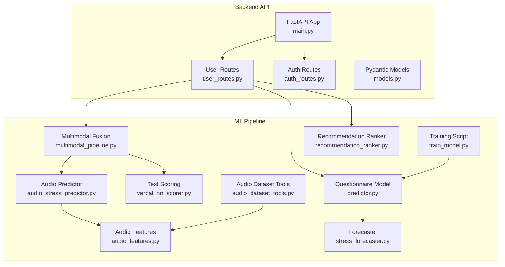
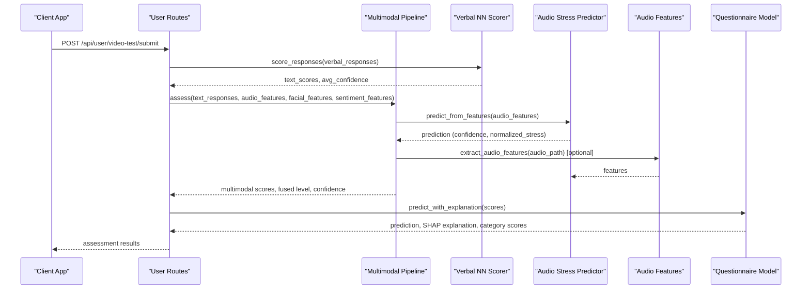
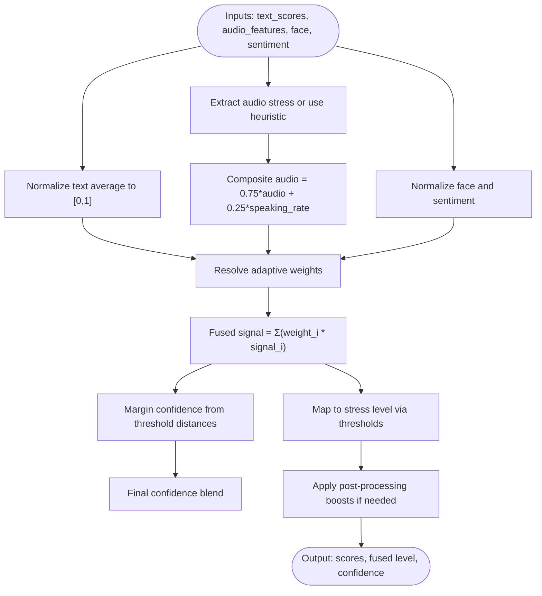
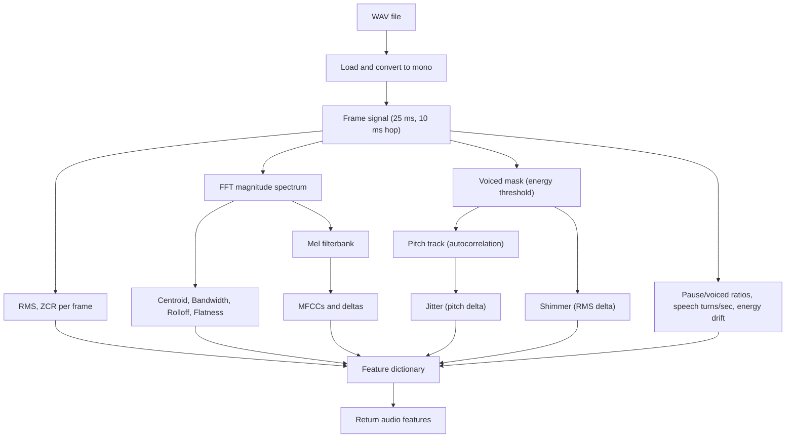
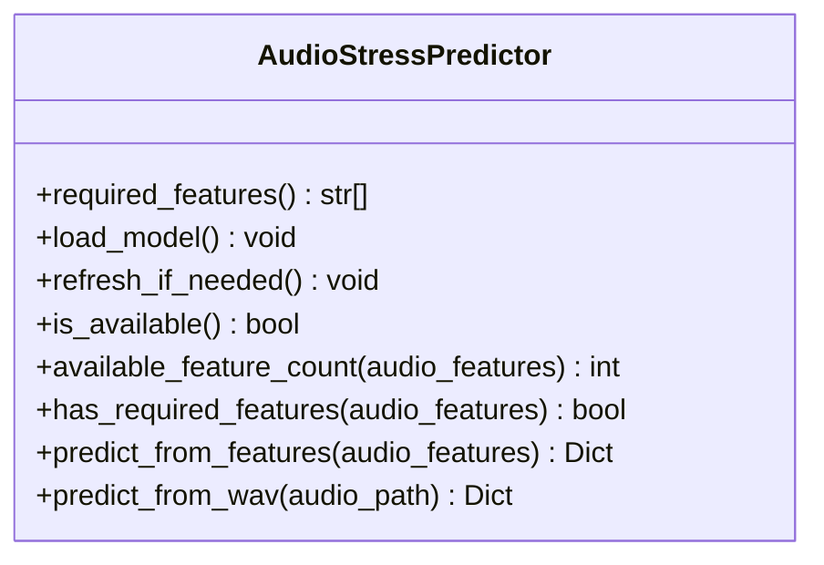
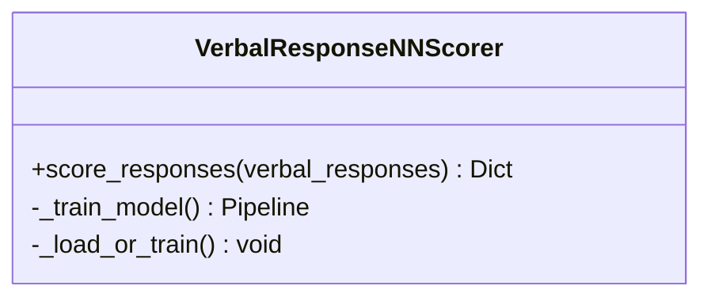
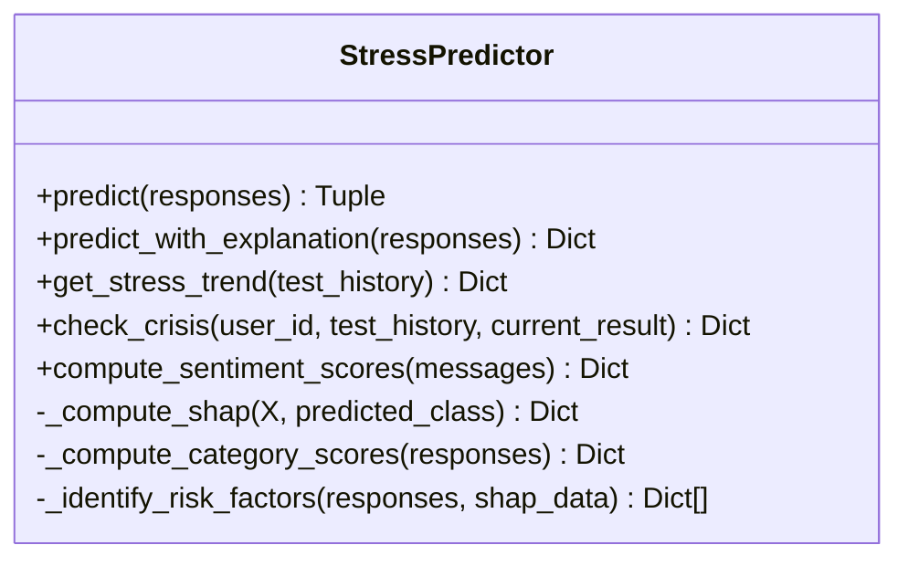
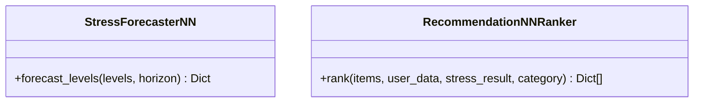
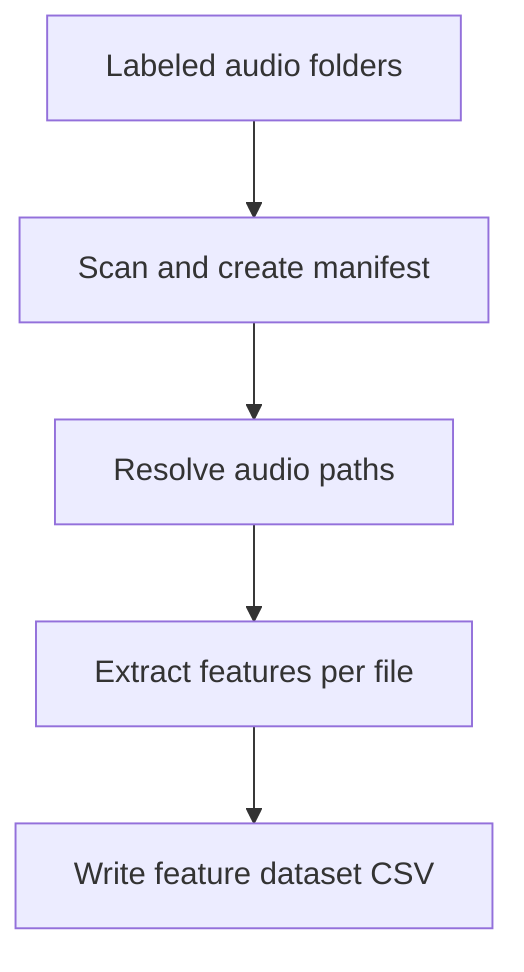
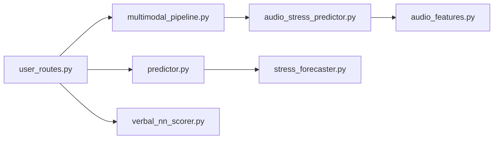

# Multimodal Prediction Pipeline

<cite>
**Referenced Files in This Document**
- [main.py](file://backend/app/main.py)
- [user_routes.py](file://backend/app/routes/user_routes.py)
- [auth_routes.py](file://backend/app/routes/auth_routes.py)
- [models.py](file://backend/app/models.py)
- [multimodal_pipeline.py](file://backend/ml_model/multimodal_pipeline.py)
- [audio_stress_predictor.py](file://backend/ml_model/audio_stress_predictor.py)
- [audio_features.py](file://backend/ml_model/audio_features.py)
- [verbal_nn_scorer.py](file://backend/ml_model/verbal_nn_scorer.py)
- [predictor.py](file://backend/ml_model/predictor.py)
- [train_model.py](file://backend/ml_model/train_model.py)
- [stress_forecaster.py](file://backend/ml_model/stress_forecaster.py)
- [recommendation_ranker.py](file://backend/ml_model/recommendation_ranker.py)
- [audio_dataset_tools.py](file://backend/ml_model/audio_dataset_tools.py)
</cite>

## Table of Contents
1. [Introduction](#introduction)
2. [Project Structure](#project-structure)
3. [Core Components](#core-components)
4. [Architecture Overview](#architecture-overview)
5. [Detailed Component Analysis](#detailed-component-analysis)
6. [Dependency Analysis](#dependency-analysis)
7. [Performance Considerations](#performance-considerations)
8. [Troubleshooting Guide](#troubleshooting-guide)
9. [Conclusion](#conclusion)

## Introduction
This document describes the multimodal stress prediction system that integrates text-based questionnaire responses with voice analysis to produce robust stress assessments. The pipeline extracts features from audio recordings, scores textual responses, fuses modalities with adaptive weighting, and provides SHAP-based explainability for model interpretation. It also includes confidence estimation, trend forecasting, and recommendation ranking to support clinical decision-making and user engagement.

## Project Structure
The system is organized into:
- Backend API (FastAPI): Routes for user assessments, authentication, and integrations
- Machine Learning module: Feature extraction, audio modeling, multimodal fusion, and explainability
- Data utilities: Manifest generation and feature dataset building for audio training

**Diagram sources**
- [main.py:53-137](file://backend/app/main.py#L53-L137)
- [user_routes.py:19-329](file://backend/app/routes/user_routes.py#L19-L329)
- [multimodal_pipeline.py:11-183](file://backend/ml_model/multimodal_pipeline.py#L11-L183)
- [audio_stress_predictor.py:13-157](file://backend/ml_model/audio_stress_predictor.py#L13-L157)
- [audio_features.py:261-352](file://backend/ml_model/audio_features.py#L261-L352)
- [verbal_nn_scorer.py:12-151](file://backend/ml_model/verbal_nn_scorer.py#L12-L151)
- [predictor.py:32-590](file://backend/ml_model/predictor.py#L32-L590)
- [train_model.py:79-195](file://backend/ml_model/train_model.py#L79-L195)
- [stress_forecaster.py:7-96](file://backend/ml_model/stress_forecaster.py#L7-L96)
- [recommendation_ranker.py:9-108](file://backend/ml_model/recommendation_ranker.py#L9-L108)
- [audio_dataset_tools.py:160-238](file://backend/ml_model/audio_dataset_tools.py#L160-L238)

**Section sources**
- [main.py:53-137](file://backend/app/main.py#L53-L137)
- [user_routes.py:19-329](file://backend/app/routes/user_routes.py#L19-L329)

## Core Components
- MultimodalStressPipeline: Integrates text, audio, facial, and sentiment signals into a fused stress score with adaptive weights and confidence margins
- AudioStressPredictor: Loads a trained audio classifier, validates required features, and predicts stress levels from audio features
- AudioFeatures: Extracts robust acoustic features from WAV files for stress detection
- VerbalResponseNNScorer: Converts natural language answers into 1–5 scores using a lightweight neural network
- StressPredictor: Trained ensemble model for questionnaire-based stress prediction with SHAP explainability and risk factor identification
- StressForecasterNN: Autoregressive neural network for short-term stress trajectory forecasting
- RecommendationNNRanker: Neural network ranker for personalizing recommendations based on user and stress profile
- AudioDatasetTools: Utilities to build manifests and feature datasets from labeled audio collections

**Section sources**
- [multimodal_pipeline.py:11-183](file://backend/ml_model/multimodal_pipeline.py#L11-L183)
- [audio_stress_predictor.py:13-157](file://backend/ml_model/audio_stress_predictor.py#L13-L157)
- [audio_features.py:261-352](file://backend/ml_model/audio_features.py#L261-L352)
- [verbal_nn_scorer.py:12-151](file://backend/ml_model/verbal_nn_scorer.py#L12-L151)
- [predictor.py:32-590](file://backend/ml_model/predictor.py#L32-L590)
- [stress_forecaster.py:7-96](file://backend/ml_model/stress_forecaster.py#L7-L96)
- [recommendation_ranker.py:9-108](file://backend/ml_model/recommendation_ranker.py#L9-L108)
- [audio_dataset_tools.py:160-238](file://backend/ml_model/audio_dataset_tools.py#L160-L238)

## Architecture Overview
The multimodal pipeline orchestrates three primary data streams:
- Text stream: Natural language answers scored to 1–5 per question
- Audio stream: Acoustic features extracted from voice recordings and classified by a trained model
- Auxiliary streams: Facial and sentiment features (when available) to enrich the fusion

**Diagram sources**
- [user_routes.py:308-400](file://backend/app/routes/user_routes.py#L308-L400)
- [multimodal_pipeline.py:74-183](file://backend/ml_model/multimodal_pipeline.py#L74-L183)
- [audio_stress_predictor.py:97-153](file://backend/ml_model/audio_stress_predictor.py#L97-L153)
- [audio_features.py:261-352](file://backend/ml_model/audio_features.py#L261-L352)
- [verbal_nn_scorer.py:121-151](file://backend/ml_model/verbal_nn_scorer.py#L121-L151)
- [predictor.py:146-185](file://backend/ml_model/predictor.py#L146-L185)

## Detailed Component Analysis

### Multimodal Fusion Engine
The fusion engine transforms heterogeneous inputs into a unified stress metric:
- Text normalization: Scales mean scores to [0,1]
- Audio signals: Uses either trained model output (normalized stress) or heuristic composite (stress + speaking rate)
- Facial and sentiment: Optional inputs normalized to [0,1]
- Adaptive weights: Adjusted based on audio model availability, confidence, and feature coverage
- Confidence margin: Derived from distance to fusion thresholds to quantify decision certainty
- Post-processing boosts: Amplifies scores when audio detects high stress and adjusts fused level accordingly

**Diagram sources**
- [multimodal_pipeline.py:74-183](file://backend/ml_model/multimodal_pipeline.py#L74-L183)

**Section sources**
- [multimodal_pipeline.py:11-183](file://backend/ml_model/multimodal_pipeline.py#L11-L183)

### Audio Processing Workflow
Voice recording processing includes:
- WAV loading and mono conversion with peak normalization
- Frame-wise spectral features: RMS, ZCR, spectral centroid/bandwidth/rolloff, flatness
- MFCCs and deltas computed from Mel-filterbank energies
- Pitch estimation via autocorrelation with voicing thresholding
- Local jitter/shimmer estimation from pitch and RMS deltas
- Pause ratio, voiced ratio, speech turns per second, and energy drift

**Diagram sources**
- [audio_features.py:60-352](file://backend/ml_model/audio_features.py#L60-L352)

**Section sources**
- [audio_features.py:261-352](file://backend/ml_model/audio_features.py#L261-L352)

### Audio Classifier and Feature Validation
The audio predictor:
- Loads a trained model and metadata from disk
- Validates required features against the model’s expected feature set
- Prepares a DataFrame row with NaN padding for missing features
- Produces a stress level, confidence, and normalized stress for fusion
- Supports prediction from pre-extracted features or direct WAV path

**Diagram sources**
- [audio_stress_predictor.py:13-157](file://backend/ml_model/audio_stress_predictor.py#L13-L157)

**Section sources**
- [audio_stress_predictor.py:74-153](file://backend/ml_model/audio_stress_predictor.py#L74-L153)

### Textual Response Scoring
The verbal NN scorer:
- Uses a lightweight MLP with TF-IDF features over 1–2 grams
- Provides per-question scores and average confidence
- Applies a special inversion for the satisfaction question (Q15) to align directionality

**Diagram sources**
- [verbal_nn_scorer.py:12-151](file://backend/ml_model/verbal_nn_scorer.py#L12-L151)

**Section sources**
- [verbal_nn_scorer.py:121-151](file://backend/ml_model/verbal_nn_scorer.py#L121-L151)

### Questionnaire Model and Explainability
The questionnaire model:
- Trained ensemble with soft voting and isotonic calibration
- SHAP TreeExplainer-based explanations with top contributing questions
- Category-level scoring and risk factor identification
- Continuous stress score derived from class probabilities

**Diagram sources**
- [predictor.py:32-590](file://backend/ml_model/predictor.py#L32-L590)

**Section sources**
- [predictor.py:119-185](file://backend/ml_model/predictor.py#L119-L185)
- [train_model.py:79-195](file://backend/ml_model/train_model.py#L79-L195)

### Trend Forecasting and Recommendation Ranking
- StressForecasterNN: Autoregressive MLP forecasts next levels with confidence based on historical variance
- RecommendationNNRanker: Scores and ranks recommendations by stress level, category, difficulty, effectiveness, age, and priority

**Diagram sources**
- [stress_forecaster.py:7-96](file://backend/ml_model/stress_forecaster.py#L7-L96)
- [recommendation_ranker.py:9-108](file://backend/ml_model/recommendation_ranker.py#L9-L108)

**Section sources**
- [stress_forecaster.py:45-82](file://backend/ml_model/stress_forecaster.py#L45-L82)
- [recommendation_ranker.py:70-104](file://backend/ml_model/recommendation_ranker.py#L70-L104)

### Audio Dataset Preparation
Utilities to:
- Scan labeled audio folders and create manifests
- Resolve audio paths and featurize WAVs into structured datasets
- Support skip-failed mode for robust batch processing

**Diagram sources**
- [audio_dataset_tools.py:64-238](file://backend/ml_model/audio_dataset_tools.py#L64-L238)

**Section sources**
- [audio_dataset_tools.py:160-238](file://backend/ml_model/audio_dataset_tools.py#L160-L238)

## Dependency Analysis
Key internal dependencies:
- user_routes depends on multimodal_pipeline, verbal_nn_scorer, and predictor
- multimodal_pipeline depends on audio_stress_predictor and verbal_nn_scorer
- audio_stress_predictor depends on audio_features
- predictor depends on stress_forecaster for trend analysis

**Diagram sources**
- [user_routes.py:19-329](file://backend/app/routes/user_routes.py#L19-L329)
- [multimodal_pipeline.py:5-6](file://backend/ml_model/multimodal_pipeline.py#L5-L6)
- [audio_stress_predictor.py:10](file://backend/ml_model/audio_stress_predictor.py#L10)
- [predictor.py:10](file://backend/ml_model/predictor.py#L10)

**Section sources**
- [user_routes.py:19-329](file://backend/app/routes/user_routes.py#L19-L329)
- [multimodal_pipeline.py:5-6](file://backend/ml_model/multimodal_pipeline.py#L5-L6)
- [audio_stress_predictor.py:10](file://backend/ml_model/audio_stress_predictor.py#L10)
- [predictor.py:10](file://backend/ml_model/predictor.py#L10)

## Performance Considerations
- Feature extraction is CPU-bound; batch processing and caching can improve throughput
- Audio model loading checks timestamps to avoid repeated reloads
- SHAP computations are optional and fall back to model-level feature importances when unavailable
- Confidence blending reduces sensitivity to noisy inputs by incorporating margin proximity to thresholds
- Recommendation ranking uses a small synthetic dataset to initialize; real-world tuning improves personalization

[No sources needed since this section provides general guidance]

## Troubleshooting Guide
Common issues and resolutions:
- Audio model not available: Check model and metadata files exist and are readable; ensure required features match the model’s expectation
- Missing audio features: The predictor pads missing features with NaN; ensure sufficient coverage for reliable predictions
- SHAP failures: The system falls back to model-level feature importances; verify tree-based model availability
- Empty or corrupted WAV files: Feature extraction raises explicit errors; validate audio files and sample widths
- Multimodal fusion fallback: If audio model is unavailable, the pipeline still produces results using text and heuristic audio signals

**Section sources**
- [audio_stress_predictor.py:37-72](file://backend/ml_model/audio_stress_predictor.py#L37-L72)
- [audio_stress_predictor.py:97-135](file://backend/ml_model/audio_stress_predictor.py#L97-L135)
- [predictor.py:187-234](file://backend/ml_model/predictor.py#L187-L234)
- [audio_features.py:60-94](file://backend/ml_model/audio_features.py#L60-L94)
- [multimodal_pipeline.py:91-96](file://backend/ml_model/multimodal_pipeline.py#L91-L96)

## Conclusion
The multimodal stress prediction pipeline integrates textual and vocal cues with robust feature engineering and adaptive fusion. It provides interpretable predictions via SHAP, supports trend forecasting, and offers personalized recommendations. The modular design enables incremental improvements across modalities and ensures resilience when individual components are unavailable.