# Stress Assessment System

<cite>
**Referenced Files in This Document**
- [README.md](file://README.md)
- [ARCHITECTURE_EXPLAINED.md](file://ARCHITECTURE_EXPLAINED.md)
- [backend/app/main.py](file://backend/app/main.py)
- [backend/app/models.py](file://backend/app/models.py)
- [backend/app/routers/user_routes.py](file://backend/app/routers/user_routes.py)
- [backend/ml_model/predictor.py](file://backend/ml_model/predictor.py)
- [backend/ml_model/multimodal_pipeline.py](file://backend/ml_model/multimodal_pipeline.py)
- [backend/ml_model/audio_stress_predictor.py](file://backend/ml_model/audio_stress_predictor.py)
- [backend/ml_model/audio_features.py](file://backend/ml_model/audio_features.py)
- [backend/ml_model/verbal_nn_scorer.py](file://backend/ml_model/verbal_nn_scorer.py)
- [backend/app/recommendation_engine.py](file://backend/app/recommendation_engine.py)
- [backend/app/progress_tracker.py](file://backend/app/progress_tracker.py)
</cite>

## Table of Contents
1. [Introduction](#introduction)
2. [Project Structure](#project-structure)
3. [Core Components](#core-components)
4. [Architecture Overview](#architecture-overview)
5. [Detailed Component Analysis](#detailed-component-analysis)
6. [Dependency Analysis](#dependency-analysis)
7. [Performance Considerations](#performance-considerations)
8. [Troubleshooting Guide](#troubleshooting-guide)
9. [Conclusion](#conclusion)
10. [Appendices](#appendices)

## Introduction
This document describes the Cognitive Behavioral Therapy (CBT)-based stress assessment system. The platform offers:
- An 18-question CBT-based questionnaire (1–5 Likert scale)
- Real-time validation and scoring
- Ensemble machine learning model for stress prediction with SHAP explainability
- Multimodal pipeline integrating text responses and voice analysis
- Enhanced recommendation engine and gamification/progress tracking
- Secure API with JWT authentication and role-based access control

The system supports three primary dashboards: user, doctor, and admin, and integrates with MongoDB for persistence.

## Project Structure
The repository is a full-stack application with a Python FastAPI backend and a React/TypeScript frontend. The backend organizes concerns into:
- Application entry and routing
- Authentication and models
- ML models and pipelines
- Recommendation engine and progress tracking
- Analytics and reporting

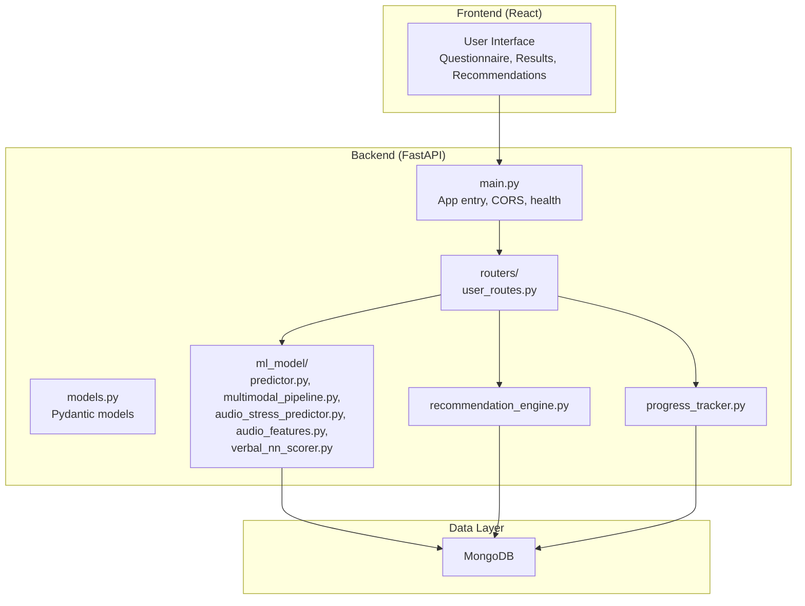

**Diagram sources**
- [backend/app/main.py:52-80](file://backend/app/main.py#L52-L80)
- [backend/app/routers/user_routes.py:32-39](file://backend/app/routers/user_routes.py#L32-L39)
- [backend/app/models.py:1-40](file://backend/app/models.py#L1-L40)
- [backend/ml_model/predictor.py:32-46](file://backend/ml_model/predictor.py#L32-L46)
- [backend/ml_model/multimodal_pipeline.py:11-12](file://backend/ml_model/multimodal_pipeline.py#L11-L12)
- [backend/app/recommendation_engine.py:11-16](file://backend/app/recommendation_engine.py#L11-L16)
- [backend/app/progress_tracker.py:48-50](file://backend/app/progress_tracker.py#L48-L50)

**Section sources**
- [README.md:698-761](file://README.md#L698-L761)
- [backend/app/main.py:52-80](file://backend/app/main.py#L52-L80)

## Core Components
- Questionnaire and validation: The user route exposes a 18-question CBT survey with a 1–5 scale and enforces strict validation (count and bounds).
- ML predictor: Loads an ensemble model, performs prediction, SHAP-based explanations, category scoring, risk factor identification, and continuous score computation.
- Multimodal fusion: Combines text (questionnaire), audio (voice), sentiment, and optional facial features into a fused stress signal with adaptive weighting.
- Audio processing: Extracts acoustic features from WAV files and optionally predicts stress from features.
- Recommendations: Generates personalized, categorized recommendations and ranks them using a neural ranker.
- Progress tracking: Gamification system with badges, streaks, points, and level progression.

**Section sources**
- [backend/app/routers/user_routes.py:150-184](file://backend/app/routers/user_routes.py#L150-L184)
- [backend/ml_model/predictor.py:119-185](file://backend/ml_model/predictor.py#L119-L185)
- [backend/ml_model/multimodal_pipeline.py:74-179](file://backend/ml_model/multimodal_pipeline.py#L74-L179)
- [backend/ml_model/audio_features.py:261-351](file://backend/ml_model/audio_features.py#L261-L351)
- [backend/app/recommendation_engine.py:17-58](file://backend/app/recommendation_engine.py#L17-L58)
- [backend/app/progress_tracker.py:48-130](file://backend/app/progress_tracker.py#L48-L130)

## Architecture Overview
The system follows a layered architecture:
- Presentation: React frontend renders the questionnaire, displays results, and shows recommendations.
- API: FastAPI routes handle authentication, validation, ML inference, and persistence.
- ML: Ensemble model with SHAP explainability; multimodal fusion pipeline; audio feature extraction and prediction.
- Persistence: MongoDB collections for users, tests, appointments, achievements, and progress.

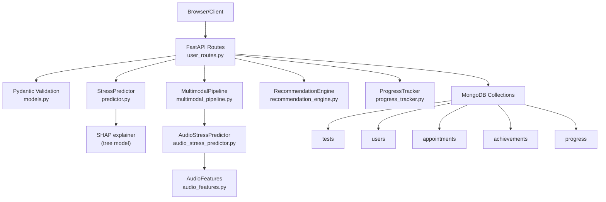

**Diagram sources**
- [backend/app/routers/user_routes.py:407-499](file://backend/app/routers/user_routes.py#L407-L499)
- [backend/app/models.py:78-90](file://backend/app/models.py#L78-L90)
- [backend/ml_model/predictor.py:146-185](file://backend/ml_model/predictor.py#L146-L185)
- [backend/ml_model/multimodal_pipeline.py:74-179](file://backend/ml_model/multimodal_pipeline.py#L74-L179)
- [backend/ml_model/audio_stress_predictor.py:13-29](file://backend/ml_model/audio_stress_predictor.py#L13-L29)
- [backend/ml_model/audio_features.py:261-351](file://backend/ml_model/audio_features.py#L261-L351)
- [backend/app/recommendation_engine.py:17-58](file://backend/app/recommendation_engine.py#L17-L58)
- [backend/app/progress_tracker.py:135-235](file://backend/app/progress_tracker.py#L135-L235)

## Detailed Component Analysis

### Questionnaire and Real-Time Validation
- The questionnaire is served with categories and a 1–5 scale.
- Submission endpoint validates:
  - Exactly 18 responses
  - Each response is an integer within 1–5
- On success, the backend invokes the ML predictor and persists the result.

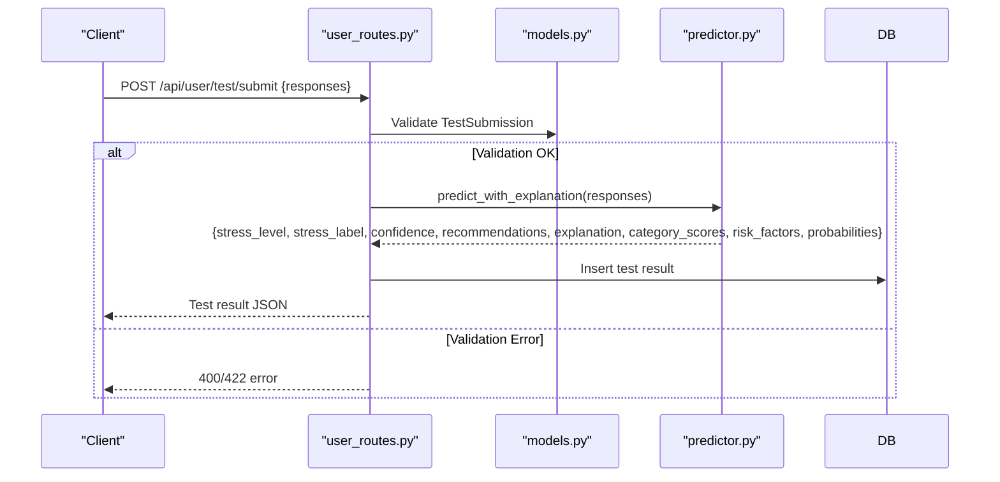

**Diagram sources**
- [backend/app/routers/user_routes.py:407-499](file://backend/app/routers/user_routes.py#L407-L499)
- [backend/app/models.py:78-90](file://backend/app/models.py#L78-L90)
- [backend/ml_model/predictor.py:146-185](file://backend/ml_model/predictor.py#L146-L185)

**Section sources**
- [backend/app/routers/user_routes.py:150-184](file://backend/app/routers/user_routes.py#L150-L184)
- [backend/app/routers/user_routes.py:407-499](file://backend/app/routers/user_routes.py#L407-L499)
- [backend/app/models.py:78-90](file://backend/app/models.py#L78-L90)

### Ensemble ML Model and Scoring
- The StressPredictor loads a trained ensemble model and a SHAP-compatible tree model.
- Prediction pipeline:
  - Input: 18-item vector on 1–5 scale
  - Output: stress level (0–3), label, confidence, recommendations
  - Continuous score: weighted sum of class probabilities
  - SHAP explanation: top contributors per prediction
  - Category scores: per-domain averages and severities
  - Risk factors: derived from responses and SHAP insights

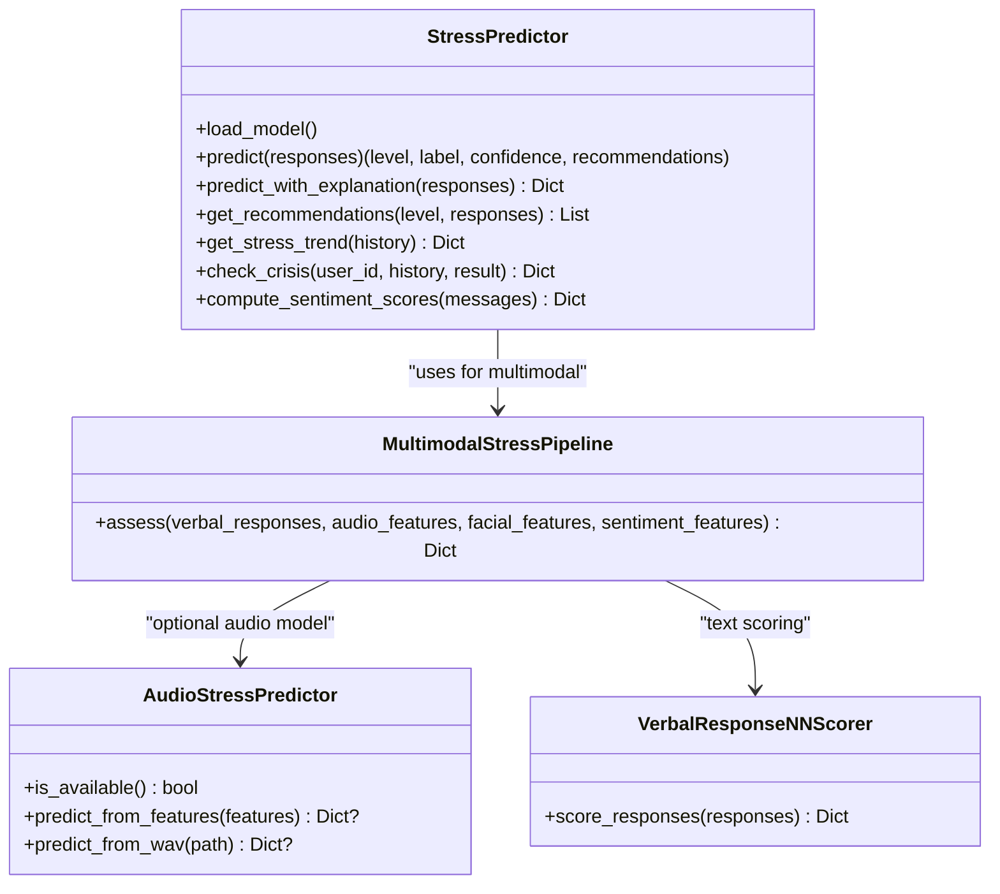

**Diagram sources**
- [backend/ml_model/predictor.py:32-118](file://backend/ml_model/predictor.py#L32-L118)
- [backend/ml_model/multimodal_pipeline.py:11-12](file://backend/ml_model/multimodal_pipeline.py#L11-L12)
- [backend/ml_model/audio_stress_predictor.py:13-29](file://backend/ml_model/audio_stress_predictor.py#L13-L29)
- [backend/ml_model/verbal_nn_scorer.py:12-18](file://backend/ml_model/verbal_nn_scorer.py#L12-L18)

**Section sources**
- [backend/ml_model/predictor.py:119-185](file://backend/ml_model/predictor.py#L119-L185)
- [backend/ml_model/predictor.py:187-256](file://backend/ml_model/predictor.py#L187-L256)
- [backend/ml_model/predictor.py:258-306](file://backend/ml_model/predictor.py#L258-L306)
- [backend/ml_model/predictor.py:363-484](file://backend/ml_model/predictor.py#L363-L484)

### Multimodal Stress Prediction Pipeline
- Inputs:
  - Text: 18 verbal answers converted to 1–5 scores (neural scorer or keyword fallback)
  - Audio: optional acoustic features; optional trained model prediction
  - Sentiment: keyword-based negative sentiment score
  - Facial: optional stress proxy
- Normalization and fusion:
  - Text average mapped to 0–1
  - Audio composite (model prediction or heuristic) and speaking rate signal
  - Adaptive weights based on audio confidence and availability
  - Fused signal thresholded to stress levels
- Confidence aggregation and optional score adjustment

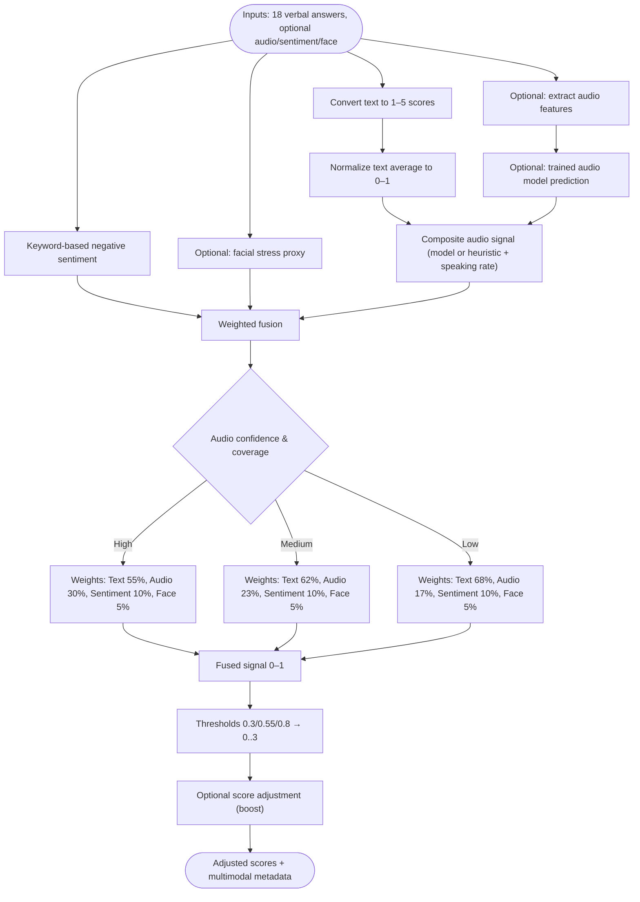

**Diagram sources**
- [backend/ml_model/multimodal_pipeline.py:74-179](file://backend/ml_model/multimodal_pipeline.py#L74-L179)
- [backend/ml_model/audio_stress_predictor.py:97-135](file://backend/ml_model/audio_stress_predictor.py#L97-L135)
- [backend/ml_model/audio_features.py:261-351](file://backend/ml_model/audio_features.py#L261-L351)
- [backend/ml_model/verbal_nn_scorer.py:121-147](file://backend/ml_model/verbal_nn_scorer.py#L121-L147)

**Section sources**
- [backend/ml_model/multimodal_pipeline.py:74-179](file://backend/ml_model/multimodal_pipeline.py#L74-L179)

### Audio Feature Extraction and Prediction
- WAV loading and normalization to mono
- Framing with 25 ms frames and 10 ms hop
- Feature extraction: RMS, ZCR, spectral features, MFCCs (mean/std, deltas), pitch, jitter/shimmer, prosodic measures
- Optional trained model prediction from features

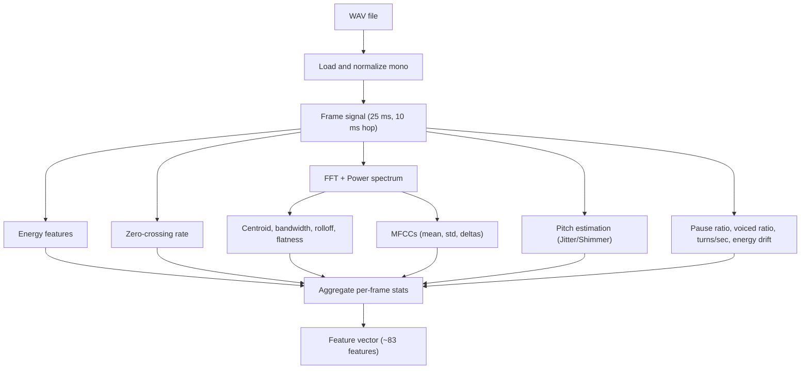

**Diagram sources**
- [backend/ml_model/audio_features.py:60-94](file://backend/ml_model/audio_features.py#L60-L94)
- [backend/ml_model/audio_features.py:261-351](file://backend/ml_model/audio_features.py#L261-L351)

**Section sources**
- [backend/ml_model/audio_features.py:261-351](file://backend/ml_model/audio_features.py#L261-L351)
- [backend/ml_model/audio_stress_predictor.py:97-153](file://backend/ml_model/audio_stress_predictor.py#L97-L153)

### SHAP Explainability Framework
- After prediction, SHAP computes per-feature contributions for the predicted class.
- Fallback to model-level feature importances when SHAP is unavailable.
- Outputs top factors, response values, and impact direction.

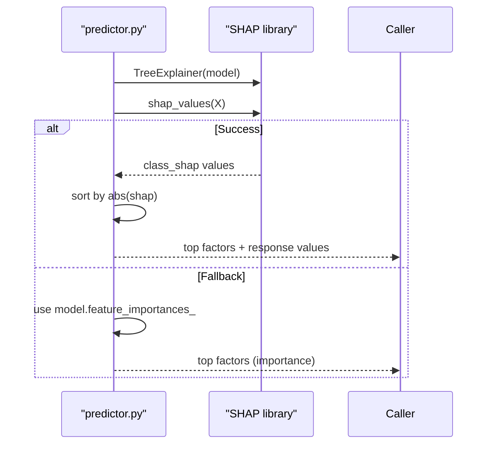

**Diagram sources**
- [backend/ml_model/predictor.py:187-256](file://backend/ml_model/predictor.py#L187-L256)

**Section sources**
- [backend/ml_model/predictor.py:187-256](file://backend/ml_model/predictor.py#L187-L256)

### Assessment Workflow: From Initiation to Result Delivery
- User initiates assessment via the questionnaire or video test (verbal responses).
- Backend validates inputs and converts text responses to 1–5 scores (neural scorer, Groq LLM, or keyword fallback).
- Multimodal fusion optionally incorporates audio features and sentiment.
- ML predictor returns stress level, confidence, continuous score, recommendations, SHAP explanation, category scores, and risk factors.
- Test history and trend analysis are computed; optional crisis detection triggers alerts.
- Results are persisted to MongoDB and returned to the client.

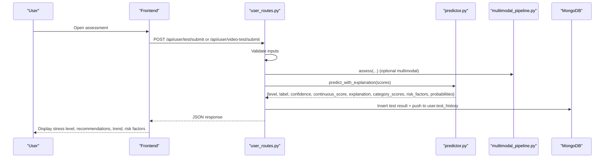

**Diagram sources**
- [backend/app/routers/user_routes.py:308-400](file://backend/app/routers/user_routes.py#L308-L400)
- [backend/app/routers/user_routes.py:407-499](file://backend/app/routers/user_routes.py#L407-L499)
- [backend/ml_model/predictor.py:146-185](file://backend/ml_model/predictor.py#L146-L185)
- [backend/ml_model/multimodal_pipeline.py:74-179](file://backend/ml_model/multimodal_pipeline.py#L74-L179)

**Section sources**
- [backend/app/routers/user_routes.py:308-400](file://backend/app/routers/user_routes.py#L308-L400)
- [backend/app/routers/user_routes.py:407-499](file://backend/app/routers/user_routes.py#L407-L499)

### Test History Management and Progress Tracking
- Test history retrieval by user ID with authorization checks.
- Trend analysis via linear regression on stress levels and forecast computation.
- Crisis detection based on recent assessments and spikes.
- Gamification and progress tracking:
  - Start/complete recommendations with reminders
  - Points, streaks, badges, and level progression
  - Leaderboard and achievement updates

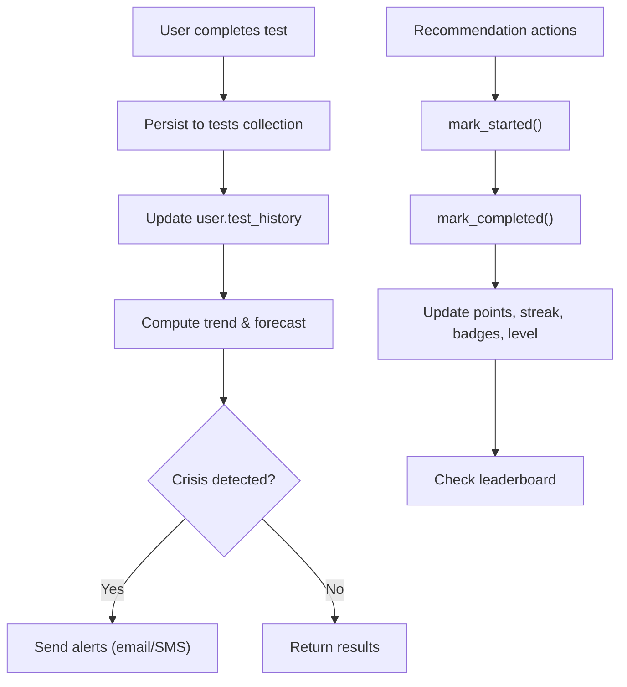

**Diagram sources**
- [backend/app/routers/user_routes.py:501-569](file://backend/app/routers/user_routes.py#L501-L569)
- [backend/ml_model/predictor.py:363-484](file://backend/ml_model/predictor.py#L363-L484)
- [backend/app/progress_tracker.py:135-235](file://backend/app/progress_tracker.py#L135-L235)

**Section sources**
- [backend/app/routers/user_routes.py:501-569](file://backend/app/routers/user_routes.py#L501-L569)
- [backend/ml_model/predictor.py:363-484](file://backend/ml_model/predictor.py#L363-L484)
- [backend/app/progress_tracker.py:135-235](file://backend/app/progress_tracker.py#L135-L235)

### Integration with Recommendation Engine
- Generates categorized recommendations (immediate, daily, weekly, lifestyle, professional).
- Personalizes recommendations using user profile and stress history.
- Ranks recommendations using a neural ranker.

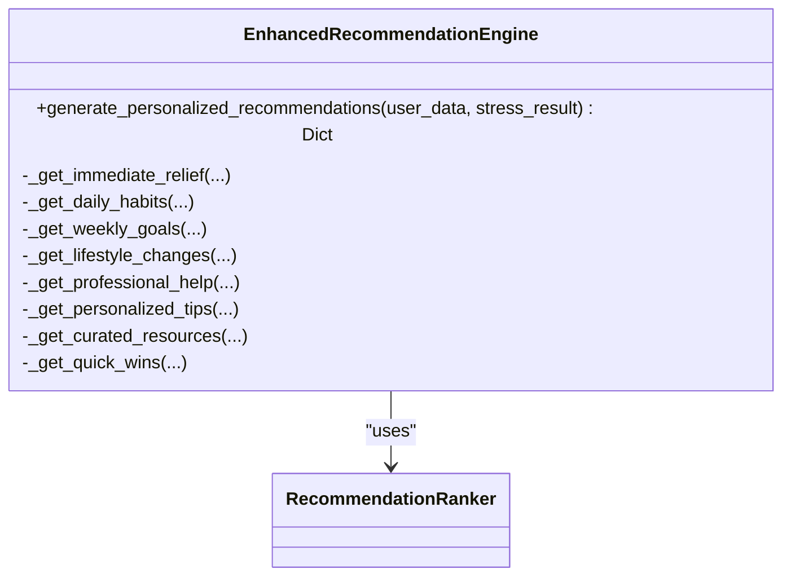

**Diagram sources**
- [backend/app/recommendation_engine.py:11-58](file://backend/app/recommendation_engine.py#L11-L58)

**Section sources**
- [backend/app/recommendation_engine.py:17-58](file://backend/app/recommendation_engine.py#L17-L58)

## Dependency Analysis
- FastAPI app initialization and routing:
  - CORS configuration, router inclusion, and health checks
- Route dependencies:
  - Pydantic models for validation
  - ML predictor and multimodal pipeline
  - Recommendation engine and progress tracker
- ML dependencies:
  - Ensemble model and SHAP-compatible tree model
  - Audio feature extraction and optional trained audio model
  - Verbal neural scorer with TF-IDF and MLP

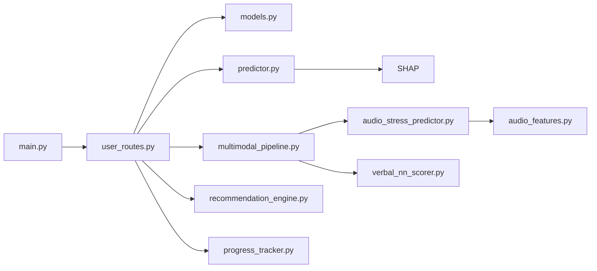

**Diagram sources**
- [backend/app/main.py:52-80](file://backend/app/main.py#L52-L80)
- [backend/app/routers/user_routes.py:18-29](file://backend/app/routers/user_routes.py#L18-L29)
- [backend/ml_model/predictor.py:32-46](file://backend/ml_model/predictor.py#L32-L46)
- [backend/ml_model/multimodal_pipeline.py:5-7](file://backend/ml_model/multimodal_pipeline.py#L5-L7)
- [backend/ml_model/audio_stress_predictor.py:13-29](file://backend/ml_model/audio_stress_predictor.py#L13-L29)
- [backend/ml_model/audio_features.py:261-351](file://backend/ml_model/audio_features.py#L261-L351)
- [backend/ml_model/verbal_nn_scorer.py:12-18](file://backend/ml_model/verbal_nn_scorer.py#L12-L18)

**Section sources**
- [backend/app/main.py:52-80](file://backend/app/main.py#L52-L80)
- [backend/app/routers/user_routes.py:18-29](file://backend/app/routers/user_routes.py#L18-L29)

## Performance Considerations
- Model loading and caching:
  - Ensemble model loaded once at import time; SHAP-compatible tree model used for explanations.
- Inference speed:
  - Single-row DataFrame prediction; minimal overhead for SHAP computation.
- Audio processing:
  - Feature extraction is CPU-bound; batching or async processing could improve throughput.
- Multimodal fusion:
  - Adaptive weighting avoids heavy computations when audio is unavailable.
- Persistence:
  - MongoDB writes occur after validation and prediction; ensure indexing on user_id and timestamps for history queries.

[No sources needed since this section provides general guidance]

## Troubleshooting Guide
- Model not found or corrupted:
  - The predictor auto-reloads and retrains from the dataset on startup.
- Audio model not available:
  - The multimodal pipeline gracefully falls back to text-only scoring.
- Validation failures:
  - Ensure exactly 18 responses within 1–5; otherwise, the API returns 400/422.
- CORS and frontend/backend mismatch:
  - Configure ALLOWED_ORIGINS in environment variables to include frontend URLs.
- Health checks:
  - Use the health endpoint to verify database connectivity.

**Section sources**
- [backend/ml_model/predictor.py:81-98](file://backend/ml_model/predictor.py#L81-L98)
- [backend/ml_model/multimodal_pipeline.py:74-179](file://backend/ml_model/multimodal_pipeline.py#L74-L179)
- [backend/app/routers/user_routes.py:412-416](file://backend/app/routers/user_routes.py#L412-L416)
- [backend/app/main.py:32-50](file://backend/app/main.py#L32-L50)
- [backend/app/main.py:114-132](file://backend/app/main.py#L114-L132)

## Conclusion
The CBT-based stress assessment system combines robust real-time validation, explainable ML predictions, and multimodal fusion to deliver accurate and interpretable stress assessments. The integrated recommendation engine and gamification system support sustained user engagement and progress tracking. The modular backend architecture and clear separation of concerns enable maintainability and extensibility.

[No sources needed since this section summarizes without analyzing specific files]

## Appendices

### API Endpoints Overview
- Authentication and user management endpoints are documented in the project’s README.
- Key endpoints for assessment:
  - GET /api/user/questionnaire
  - POST /api/user/test/submit
  - POST /api/user/video-test/submit
  - GET /api/user/test/history/{user_id}
  - GET /api/user/test/{test_id}

**Section sources**
- [README.md:506-548](file://README.md#L506-L548)