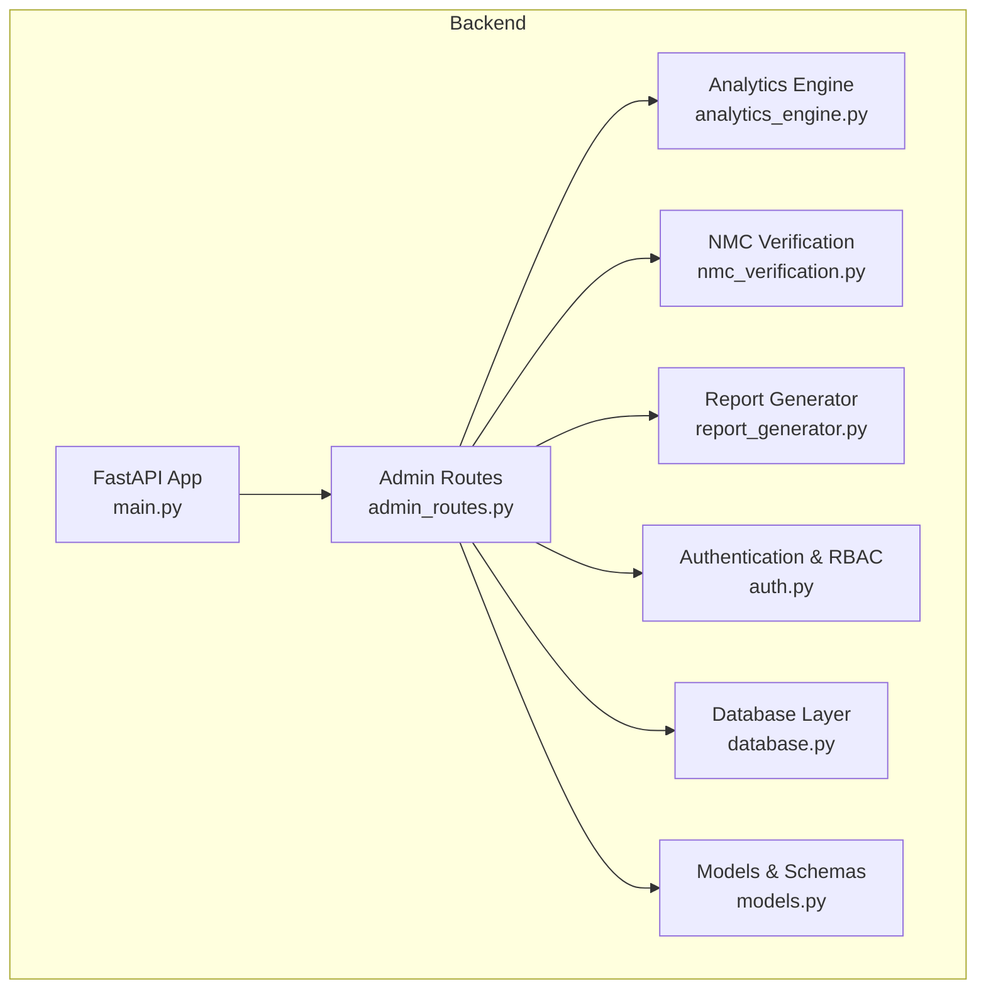
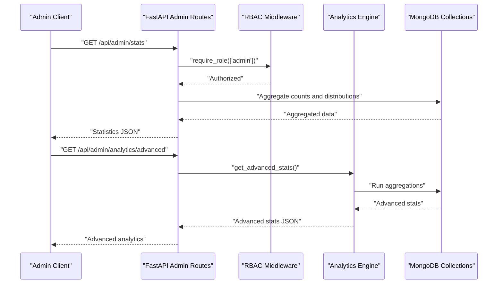
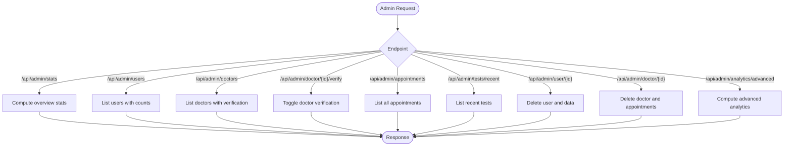
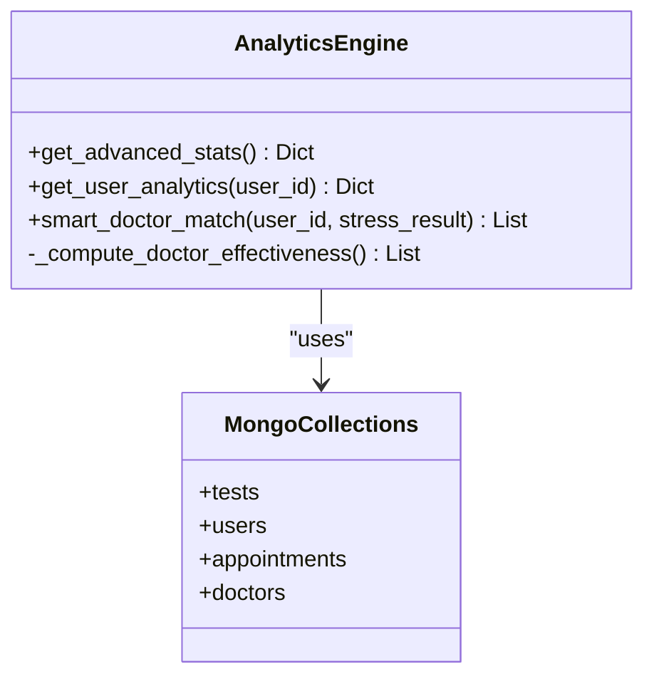
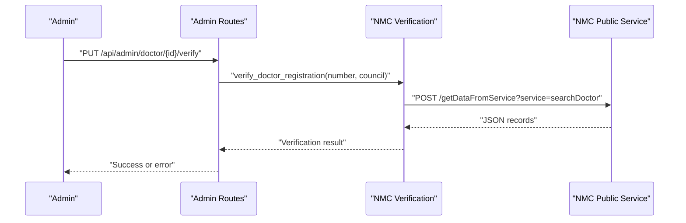
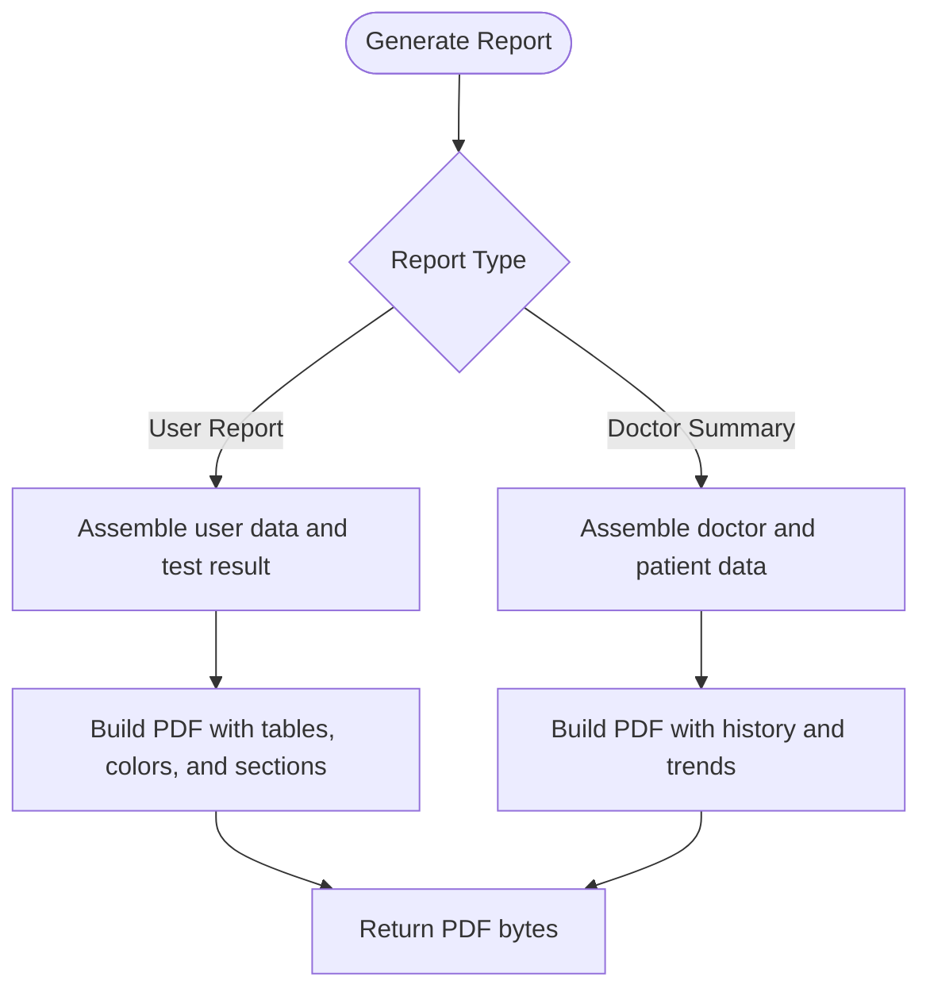
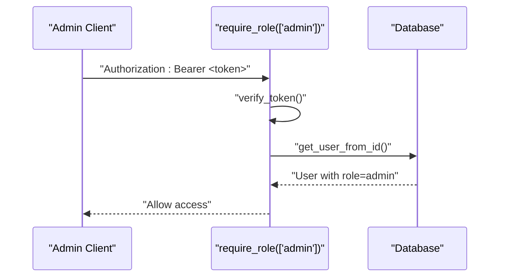
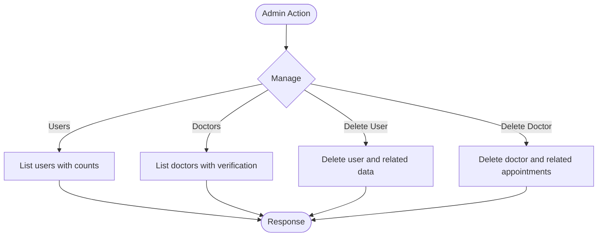
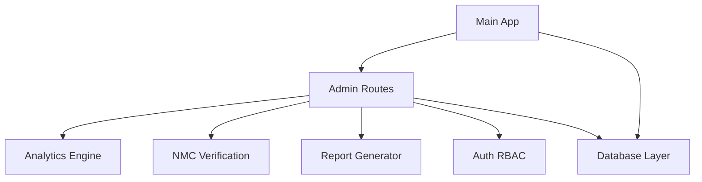

# Admin Dashboard

<cite>
**Referenced Files in This Document**
- [admin_routes.py](file://backend/app/routes/admin_routes.py)
- [analytics_engine.py](file://backend/app/analytics_engine.py)
- [nmc_verification.py](file://backend/app/nmc_verification.py)
- [report_generator.py](file://backend/app/report_generator.py)
- [models.py](file://backend/app/models.py)
- [auth.py](file://backend/app/auth.py)
- [database.py](file://backend/app/database.py)
- [main.py](file://backend/app/main.py)
- [config.py](file://backend/app/config.py)
- [recommendation_engine.py](file://backend/app/recommendation_engine.py)
- [progress_tracker.py](file://backend/app/progress_tracker.py)
- [README.md](file://README.md)
</cite>

## Table of Contents
1. [Introduction](#introduction)
2. [Project Structure](#project-structure)
3. [Core Components](#core-components)
4. [Architecture Overview](#architecture-overview)
5. [Detailed Component Analysis](#detailed-component-analysis)
6. [Dependency Analysis](#dependency-analysis)
7. [Performance Considerations](#performance-considerations)
8. [Troubleshooting Guide](#troubleshooting-guide)
9. [Conclusion](#conclusion)
10. [Appendices](#appendices)

## Introduction
This document provides comprehensive documentation for the Admin Dashboard system within the AI Stress Level Analyzer platform. It covers analytics and reporting, user and doctor management, verification workflows, administrative controls, and system monitoring. The Admin Dashboard exposes endpoints for administrators to oversee platform usage, monitor user and doctor activity, verify professional credentials, and generate actionable insights from aggregated data.

## Project Structure
The Admin Dashboard is implemented as part of the FastAPI backend under the routes module. It integrates with the analytics engine, verification utilities, and the database layer to provide a unified administrative interface.

**Diagram sources**
- [main.py:52-80](file://backend/app/main.py#L52-L80)
- [admin_routes.py:9-12](file://backend/app/routes/admin_routes.py#L9-L12)
- [analytics_engine.py:11-18](file://backend/app/analytics_engine.py#L11-L18)
- [nmc_verification.py:10-12](file://backend/app/nmc_verification.py#L10-L12)
- [report_generator.py:38-48](file://backend/app/report_generator.py#L38-L48)
- [auth.py:16-18](file://backend/app/auth.py#L16-L18)
- [database.py:88-115](file://backend/app/database.py#L88-L115)
- [models.py:16-146](file://backend/app/models.py#L16-L146)

**Section sources**
- [README.md:69-86](file://README.md#L69-L86)
- [main.py:52-80](file://backend/app/main.py#L52-L80)

## Core Components
- Admin routes: Provides endpoints for statistics, user and doctor management, verification, appointments, and advanced analytics.
- Analytics engine: Computes platform-wide insights, trends, demographics, and doctor effectiveness.
- NMC verification: Validates doctor licenses against the National Medical Commission registry.
- Report generator: Produces PDF reports for users and doctors.
- Authentication and RBAC: Enforces role-based access control for admin endpoints.
- Database layer: Manages collections and indexes for efficient querying.
- Models and schemas: Define request/response structures for admin operations.

**Section sources**
- [admin_routes.py:14-225](file://backend/app/routes/admin_routes.py#L14-L225)
- [analytics_engine.py:20-199](file://backend/app/analytics_engine.py#L20-L199)
- [nmc_verification.py:147-215](file://backend/app/nmc_verification.py#L147-L215)
- [report_generator.py:38-341](file://backend/app/report_generator.py#L38-L341)
- [auth.py:98-151](file://backend/app/auth.py#L98-L151)
- [database.py:88-302](file://backend/app/database.py#L88-L302)
- [models.py:16-146](file://backend/app/models.py#L16-L146)

## Architecture Overview
The Admin Dashboard sits behind role-based access control and interacts with the analytics engine and database layer to serve administrative insights and actions.

**Diagram sources**
- [admin_routes.py:14-62](file://backend/app/routes/admin_routes.py#L14-L62)
- [admin_routes.py:217-225](file://backend/app/routes/admin_routes.py#L217-L225)
- [analytics_engine.py:20-199](file://backend/app/analytics_engine.py#L20-L199)
- [auth.py:98-151](file://backend/app/auth.py#L98-L151)

## Detailed Component Analysis

### Admin Routes
The admin routes module defines endpoints for:
- Overview statistics: total users, doctors, verified/unverified counts, test counts, appointment statuses, and stress distribution.
- User listing: comprehensive user details including test and appointment counts and latest stress level.
- Doctor listing: verification status, NMC profile, availability, and appointment counts.
- Doctor verification: toggle verification flag for a given doctor.
- Appointments listing: all appointments with user and doctor identifiers.
- Recent tests: latest tests with user information.
- User deletion: cascade delete user data and associated records.
- Doctor deletion: cascade delete doctor’s appointments.
- Advanced analytics: compute platform-wide insights via the analytics engine.

**Diagram sources**
- [admin_routes.py:14-225](file://backend/app/routes/admin_routes.py#L14-L225)

**Section sources**
- [admin_routes.py:14-225](file://backend/app/routes/admin_routes.py#L14-L225)

### Analytics Engine
The analytics engine computes:
- Platform overview: total tests, weekly/monthly counts, average stress level, active users, and crisis alerts.
- Daily trends: counts, average stress, and severe counts grouped by date.
- Location-based stress: counts and averages by user location.
- Peak hours: most active testing hours.
- Age group analysis: stress distribution across age buckets.
- Doctor effectiveness: average stress reduction per doctor based on pre/post test comparisons.
- User analytics: personal trends, category changes, and history.
- Smart doctor matching: rank doctors by specialization, effectiveness, availability, and urgency.

**Diagram sources**
- [analytics_engine.py:11-384](file://backend/app/analytics_engine.py#L11-L384)

**Section sources**
- [analytics_engine.py:20-199](file://backend/app/analytics_engine.py#L20-L199)
- [analytics_engine.py:201-245](file://backend/app/analytics_engine.py#L201-L245)
- [analytics_engine.py:247-307](file://backend/app/analytics_engine.py#L247-L307)
- [analytics_engine.py:309-378](file://backend/app/analytics_engine.py#L309-L378)

### Doctor Verification System
The NMC verification system validates doctor licenses against the National Medical Council registry:
- Normalizes registration numbers and resolves state medical council IDs.
- Builds human-readable NMC profile from raw records.
- Searches the NMC public service endpoint and selects the best matching record.
- Returns verification status, error messages, and details.

**Diagram sources**
- [admin_routes.py:127-140](file://backend/app/routes/admin_routes.py#L127-L140)
- [nmc_verification.py:147-215](file://backend/app/nmc_verification.py#L147-L215)

**Section sources**
- [nmc_verification.py:59-111](file://backend/app/nmc_verification.py#L59-L111)
- [nmc_verification.py:147-215](file://backend/app/nmc_verification.py#L147-L215)

### Reporting System
The report generator produces:
- User stress assessment reports with patient info, results, probabilities, category analysis, risk factors, trend analysis, recommendations, and crisis alerts.
- Doctor summary reports with patient history and trend analysis.
- PDF rendering using ReportLab with custom styles and colors; falls back to plain text if ReportLab is unavailable.

**Diagram sources**
- [report_generator.py:38-341](file://backend/app/report_generator.py#L38-L341)

**Section sources**
- [report_generator.py:41-235](file://backend/app/report_generator.py#L41-L235)
- [report_generator.py:271-337](file://backend/app/report_generator.py#L271-L337)

### Administrative Controls and Security
- Role-based access control: endpoints enforce admin role via a dependency that validates JWT and checks user existence.
- Protected endpoints: all admin routes require a valid bearer token with admin role.
- Health checks: backend exposes a health endpoint that pings the database to verify connectivity.
- Database initialization: admin initialization and index creation occur on startup.

**Diagram sources**
- [auth.py:98-151](file://backend/app/auth.py#L98-L151)
- [main.py:114-132](file://backend/app/main.py#L114-L132)

**Section sources**
- [auth.py:98-151](file://backend/app/auth.py#L98-L151)
- [main.py:81-98](file://backend/app/main.py#L81-L98)
- [database.py:307-339](file://backend/app/database.py#L307-L339)

### User and Doctor Management
- User listing: aggregates test and appointment counts and includes latest stress level.
- Doctor listing: includes verification flags, NMC profile, and availability.
- Deletion: cascades deletes for user and doctor records to maintain referential integrity.

**Diagram sources**
- [admin_routes.py:64-98](file://backend/app/routes/admin_routes.py#L64-L98)
- [admin_routes.py:100-125](file://backend/app/routes/admin_routes.py#L100-L125)
- [admin_routes.py:181-198](file://backend/app/routes/admin_routes.py#L181-L198)
- [admin_routes.py:200-214](file://backend/app/routes/admin_routes.py#L200-L214)

**Section sources**
- [admin_routes.py:64-98](file://backend/app/routes/admin_routes.py#L64-L98)
- [admin_routes.py:100-125](file://backend/app/routes/admin_routes.py#L100-L125)
- [admin_routes.py:181-198](file://backend/app/routes/admin_routes.py#L181-L198)
- [admin_routes.py:200-214](file://backend/app/routes/admin_routes.py#L200-L214)

### System Monitoring and Indexes
- Database indexes: optimized compound and single-field indexes for users, doctors, tests, appointments, progress tracking, achievements, OTPs, and medical records to improve query performance.
- Admin initialization: creates default admin if not present and enforces secure password via environment variable.
- Database statistics: provides counts for users, doctors, verified doctors, tests, appointments, achievements, active progress, and medical records.

**Section sources**
- [database.py:164-302](file://backend/app/database.py#L164-L302)
- [database.py:307-339](file://backend/app/database.py#L307-L339)
- [database.py:391-415](file://backend/app/database.py#L391-L415)

### Recommendations and Progress Tracking (Supporting Admin Insights)
- Enhanced recommendation engine: generates categorized recommendations and ranks them using a neural network-based ranker.
- Progress tracker: tracks user progress, awards badges, manages streaks, and calculates achievements with points and levels.

**Section sources**
- [recommendation_engine.py:11-554](file://backend/app/recommendation_engine.py#L11-L554)
- [progress_tracker.py:48-454](file://backend/app/progress_tracker.py#L48-L454)

## Dependency Analysis
The Admin Dashboard depends on:
- FastAPI application and router registration.
- Analytics engine for computed insights.
- NMC verification for doctor license validation.
- Report generator for PDF report creation.
- Authentication middleware for role enforcement.
- Database layer for data access and indexing.

**Diagram sources**
- [admin_routes.py:9-12](file://backend/app/routes/admin_routes.py#L9-L12)
- [analytics_engine.py:11-18](file://backend/app/analytics_engine.py#L11-L18)
- [nmc_verification.py:10-12](file://backend/app/nmc_verification.py#L10-L12)
- [report_generator.py:38-48](file://backend/app/report_generator.py#L38-L48)
- [auth.py:16-18](file://backend/app/auth.py#L16-L18)
- [database.py:88-115](file://backend/app/database.py#L88-L115)
- [main.py:70-79](file://backend/app/main.py#L70-L79)

**Section sources**
- [admin_routes.py:9-12](file://backend/app/routes/admin_routes.py#L9-L12)
- [main.py:70-79](file://backend/app/main.py#L70-L79)

## Performance Considerations
- Connection pooling and timeouts: MongoDB client configured with maxPoolSize and timeouts to handle concurrent requests efficiently.
- Indexes: extensive indexing on frequently queried fields and compound indexes for common aggregation patterns.
- Aggregation pipelines: analytics engine uses efficient aggregation stages to compute counts, averages, and distributions.
- Recommendations ranking: leverages a neural network-based ranker to personalize recommendations while maintaining performance.

[No sources needed since this section provides general guidance]

## Troubleshooting Guide
- Admin authentication failures: ensure the Authorization header contains a valid bearer token with admin role; verify token expiration and user existence.
- Database connectivity issues: health endpoint pings the database; check MONGODB_URL and network connectivity.
- Admin initialization: verify ADMIN_PASSWORD environment variable is set; default admin is created only if not present.
- NMC verification errors: confirm NMC service availability and correct registration number/council mapping.

**Section sources**
- [auth.py:98-151](file://backend/app/auth.py#L98-L151)
- [main.py:114-132](file://backend/app/main.py#L114-L132)
- [database.py:307-339](file://backend/app/database.py#L307-L339)
- [nmc_verification.py:147-215](file://backend/app/nmc_verification.py#L147-L215)

## Conclusion
The Admin Dashboard provides a robust administrative interface for overseeing the AI Stress Level Analyzer platform. It offers comprehensive analytics, user and doctor management, verification workflows, and reporting capabilities. With strong security enforcement, optimized database access, and scalable architecture, it supports effective platform monitoring and operational oversight.

[No sources needed since this section summarizes without analyzing specific files]

## Appendices

### Administrative Workflows
- Verify a doctor: call the doctor verification endpoint with the doctor’s ID and desired verification state.
- Generate advanced analytics: request advanced platform analytics to receive trends, demographics, and doctor effectiveness.
- Manage users/doctors: list all users/doctors, view detailed profiles, and delete accounts with associated data.
- Generate reports: produce user and doctor reports for documentation and communication.

**Section sources**
- [admin_routes.py:127-140](file://backend/app/routes/admin_routes.py#L127-L140)
- [admin_routes.py:217-225](file://backend/app/routes/admin_routes.py#L217-L225)
- [admin_routes.py:64-98](file://backend/app/routes/admin_routes.py#L64-L98)
- [admin_routes.py:100-125](file://backend/app/routes/admin_routes.py#L100-L125)
- [report_generator.py:41-235](file://backend/app/report_generator.py#L41-L235)

### System Configuration Options
- Environment variables: JWT secret, admin password, MongoDB URL, AI chatbot keys, email settings, and CORS origins.
- Database configuration: connection pooling, timeouts, and index creation on startup.

**Section sources**
- [config.py:3-22](file://backend/app/config.py#L3-L22)
- [database.py:26-41](file://backend/app/database.py#L26-L41)
- [database.py:164-302](file://backend/app/database.py#L164-L302)

### Integration with External Verification Systems
- NMC verification: integrates with the National Medical Commission public service to validate doctor licenses and build NMC profiles.

**Section sources**
- [nmc_verification.py:10-12](file://backend/app/nmc_verification.py#L10-L12)
- [nmc_verification.py:147-215](file://backend/app/nmc_verification.py#L147-L215)