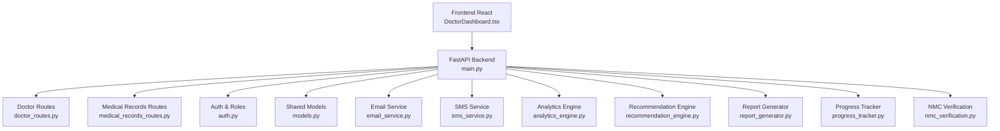
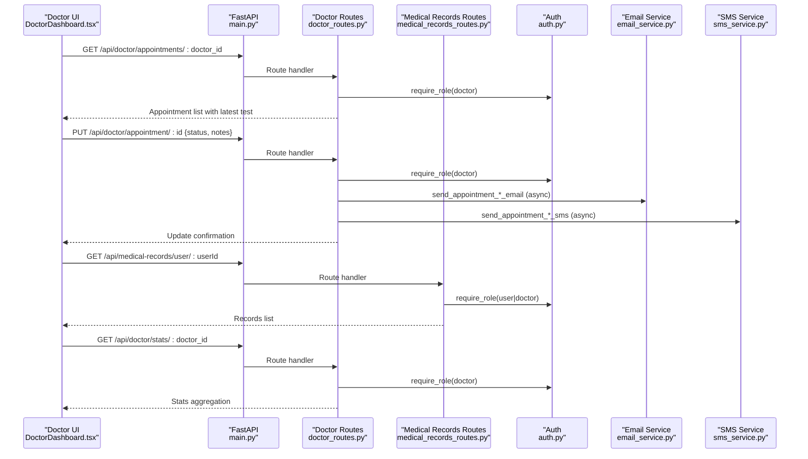
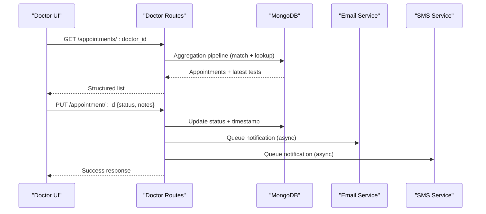
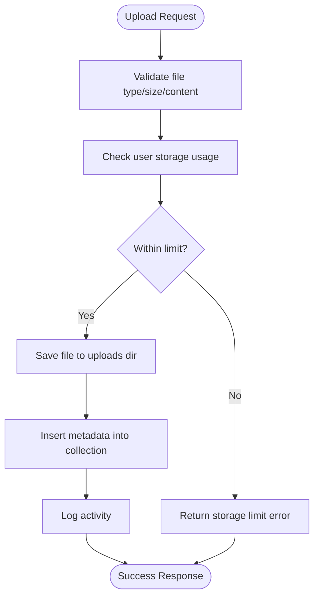
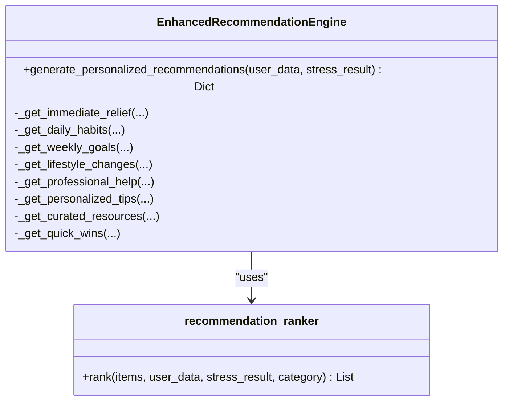
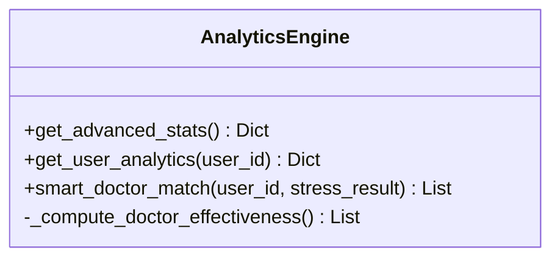
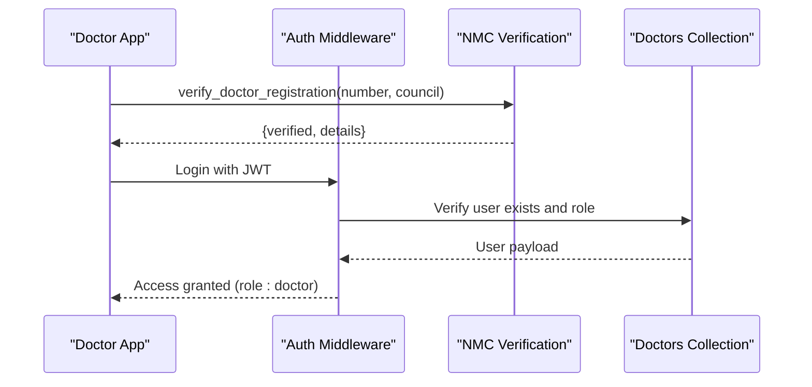
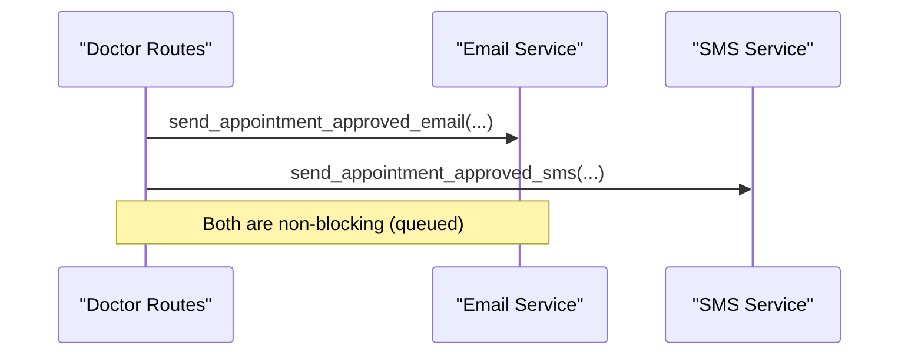
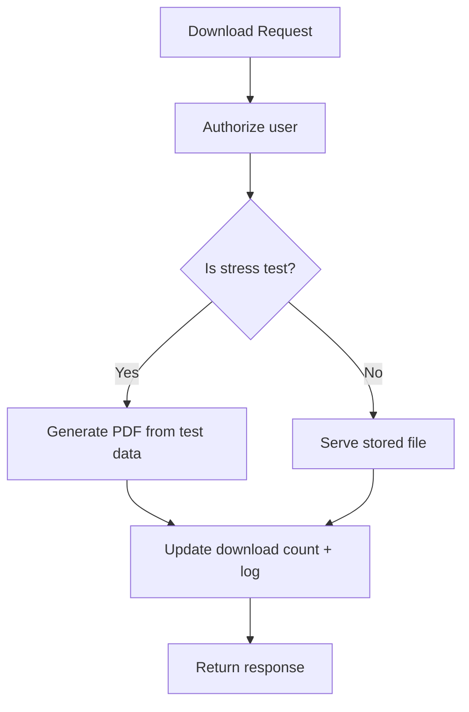
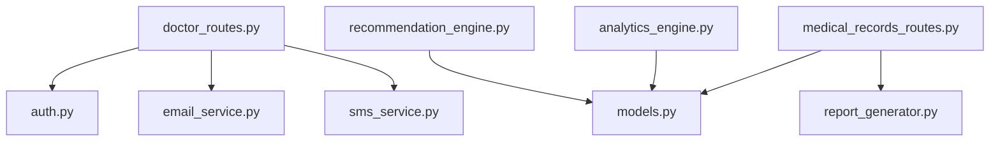

# Doctor Dashboard

<cite>
**Referenced Files in This Document**
- [main.py](file://backend/app/main.py)
- [doctor_routes.py](file://backend/app/routes/doctor_routes.py)
- [models.py](file://backend/app/models.py)
- [auth.py](file://backend/app/auth.py)
- [nmc_verification.py](file://backend/app/nmc_verification.py)
- [medical_records_routes.py](file://backend/app/routes/medical_records_routes.py)
- [analytics_engine.py](file://backend/app/analytics_engine.py)
- [recommendation_engine.py](file://backend/app/recommendation_engine.py)
- [email_service.py](file://backend/app/email_service.py)
- [sms_service.py](file://backend/app/sms_service.py)
- [report_generator.py](file://backend/app/report_generator.py)
- [progress_tracker.py](file://backend/app/progress_tracker.py)
- [DoctorDashboard.tsx](file://frontend/src/pages/DoctorDashboard.tsx)
</cite>

## Table of Contents
1. [Introduction](#introduction)
2. [Project Structure](#project-structure)
3. [Core Components](#core-components)
4. [Architecture Overview](#architecture-overview)
5. [Detailed Component Analysis](#detailed-component-analysis)
6. [Dependency Analysis](#dependency-analysis)
7. [Performance Considerations](#performance-considerations)
8. [Troubleshooting Guide](#troubleshooting-guide)
9. [Conclusion](#conclusion)
10. [Appendices](#appendices)

## Introduction
This document describes the Doctor Dashboard functionality for the AI Stress Level Analyzer platform. It covers:
- Patient management: search, profile viewing, and test result review
- Appointment scheduling: booking management, availability checking, and status tracking
- Clinical decision support: patient history analysis, trend visualization, and risk factor assessment
- Medical records integration: secure access to documents and test results
- Doctor verification and role-based access control
- Examples of workflows, interaction patterns, and privacy considerations
- Integration with the recommendation system and analytics tools for outcomes tracking

## Project Structure
The backend is a FastAPI application with modular routing and strong separation of concerns:
- Application entrypoint initializes routes and database connections
- Doctor-focused endpoints under /api/doctor
- Medical records endpoints under /api/medical-records
- Shared models, auth, and services for email/SMS notifications
- Frontend React page integrates with backend APIs

**Diagram sources**
- [main.py:52-79](file://backend/app/main.py#L52-L79)
- [doctor_routes.py:22-400](file://backend/app/routes/doctor_routes.py#L22-L400)
- [medical_records_routes.py:40-1054](file://backend/app/routes/medical_records_routes.py#L40-L1054)
- [auth.py:98-151](file://backend/app/auth.py#L98-L151)
- [models.py:16-440](file://backend/app/models.py#L16-L440)
- [email_service.py:17-493](file://backend/app/email_service.py#L17-L493)
- [sms_service.py:29-249](file://backend/app/sms_service.py#L29-L249)
- [analytics_engine.py:11-384](file://backend/app/analytics_engine.py#L11-L384)
- [recommendation_engine.py:11-554](file://backend/app/recommendation_engine.py#L11-L554)
- [report_generator.py:38-341](file://backend/app/report_generator.py#L38-L341)
- [progress_tracker.py:48-454](file://backend/app/progress_tracker.py#L48-L454)
- [nmc_verification.py:147-215](file://backend/app/nmc_verification.py#L147-L215)

**Section sources**
- [main.py:52-137](file://backend/app/main.py#L52-L137)
- [doctor_routes.py:22-400](file://backend/app/routes/doctor_routes.py#L22-L400)
- [medical_records_routes.py:40-1054](file://backend/app/routes/medical_records_routes.py#L40-L1054)
- [auth.py:98-151](file://backend/app/auth.py#L98-L151)
- [models.py:16-440](file://backend/app/models.py#L16-L440)
- [email_service.py:17-493](file://backend/app/email_service.py#L17-L493)
- [sms_service.py:29-249](file://backend/app/sms_service.py#L29-L249)
- [analytics_engine.py:11-384](file://backend/app/analytics_engine.py#L11-L384)
- [recommendation_engine.py:11-554](file://backend/app/recommendation_engine.py#L11-L554)
- [report_generator.py:38-341](file://backend/app/report_generator.py#L38-L341)
- [progress_tracker.py:48-454](file://backend/app/progress_tracker.py#L48-L454)
- [nmc_verification.py:147-215](file://backend/app/nmc_verification.py#L147-L215)
- [DoctorDashboard.tsx:1-256](file://frontend/src/pages/DoctorDashboard.tsx#L1-L256)

## Core Components
- Doctor appointment management: list, approve/reject, mark completed, and statistics
- Medical records: upload, list, filter, download, bulk download, and linking stress tests
- Recommendation system: personalized recommendations and ranking
- Analytics engine: platform-wide insights, doctor effectiveness, and user analytics
- Notifications: asynchronous email/SMS for appointment updates
- Verification and access control: JWT-based role gating and NMC verification
- Reporting: PDF generation for stress assessments and doctor summaries

**Section sources**
- [doctor_routes.py:48-400](file://backend/app/routes/doctor_routes.py#L48-L400)
- [medical_records_routes.py:149-1054](file://backend/app/routes/medical_records_routes.py#L149-L1054)
- [recommendation_engine.py:11-554](file://backend/app/recommendation_engine.py#L11-L554)
- [analytics_engine.py:11-384](file://backend/app/analytics_engine.py#L11-L384)
- [email_service.py:17-493](file://backend/app/email_service.py#L17-L493)
- [sms_service.py:29-249](file://backend/app/sms_service.py#L29-L249)
- [auth.py:98-151](file://backend/app/auth.py#L98-L151)
- [nmc_verification.py:147-215](file://backend/app/nmc_verification.py#L147-L215)
- [report_generator.py:38-341](file://backend/app/report_generator.py#L38-L341)

## Architecture Overview
The Doctor Dashboard orchestrates multiple backend services and integrates with the frontend:
- Authentication middleware enforces role-based access (doctor)
- Doctor routes aggregate appointment and test data efficiently
- Medical records routes manage secure storage and retrieval
- Recommendation and analytics engines enrich decision-making
- Notification services provide timely updates via email/SMS

**Diagram sources**
- [main.py:70-79](file://backend/app/main.py#L70-L79)
- [doctor_routes.py:48-400](file://backend/app/routes/doctor_routes.py#L48-L400)
- [medical_records_routes.py:284-407](file://backend/app/routes/medical_records_routes.py#L284-L407)
- [auth.py:98-151](file://backend/app/auth.py#L98-L151)
- [email_service.py:292-429](file://backend/app/email_service.py#L292-L429)
- [sms_service.py:172-220](file://backend/app/sms_service.py#L172-L220)
- [DoctorDashboard.tsx:19-47](file://frontend/src/pages/DoctorDashboard.tsx#L19-L47)

## Detailed Component Analysis

### Doctor Appointment Management
- Endpoint: GET /api/doctor/appointments/{doctor_id}
  - Aggregates appointments and joins latest tests in a single query
  - Returns structured appointment data with test history and latest test
- Endpoint: PUT /api/doctor/appointment/{appointment_id}
  - Updates status and notes; validates ownership and status values
  - Asynchronously sends email/SMS notifications upon approval/rejection/completion
- Endpoint: GET /api/doctor/stats/{doctor_id}
  - Computes counts per status for dashboard cards

**Diagram sources**
- [doctor_routes.py:48-134](file://backend/app/routes/doctor_routes.py#L48-L134)
- [doctor_routes.py:171-267](file://backend/app/routes/doctor_routes.py#L171-L267)
- [doctor_routes.py:366-399](file://backend/app/routes/doctor_routes.py#L366-L399)
- [email_service.py:292-429](file://backend/app/email_service.py#L292-L429)
- [sms_service.py:172-220](file://backend/app/sms_service.py#L172-L220)

**Section sources**
- [doctor_routes.py:48-134](file://backend/app/routes/doctor_routes.py#L48-L134)
- [doctor_routes.py:171-267](file://backend/app/routes/doctor_routes.py#L171-L267)
- [doctor_routes.py:366-399](file://backend/app/routes/doctor_routes.py#L366-L399)
- [DoctorDashboard.tsx:19-47](file://frontend/src/pages/DoctorDashboard.tsx#L19-L47)

### Medical Records Integration
- Upload: POST /api/medical-records/upload with form fields and file
  - Validates file type, size, and content; enforces storage limits
  - Stores metadata and logs activity
- List: GET /api/medical-records/user/{user_id} with filters
  - Supports type/date/search/tag filters; enforces object-level authorization
- Download: GET /api/medical-records/download/{record_id}
  - Generates PDF for stress tests; otherwise serves file
  - Increments download counters and logs activity
- Bulk download: POST /api/medical-records/download/bulk
  - Streams ZIP archive of selected records
- Link stress test: POST /api/medical-records/link-stress-test
  - Creates a medical record entry linked to a stress test
- Statistics: GET /api/medical-records/stats/{user_id}
  - Computes totals, sizes, and recent uploads

**Diagram sources**
- [medical_records_routes.py:149-278](file://backend/app/routes/medical_records_routes.py#L149-L278)
- [medical_records_routes.py:284-407](file://backend/app/routes/medical_records_routes.py#L284-L407)
- [medical_records_routes.py:786-885](file://backend/app/routes/medical_records_routes.py#L786-L885)
- [medical_records_routes.py:887-935](file://backend/app/routes/medical_records_routes.py#L887-L935)
- [medical_records_routes.py:941-1004](file://backend/app/routes/medical_records_routes.py#L941-L1004)
- [medical_records_routes.py:1010-1054](file://backend/app/routes/medical_records_routes.py#L1010-L1054)

**Section sources**
- [medical_records_routes.py:149-278](file://backend/app/routes/medical_records_routes.py#L149-L278)
- [medical_records_routes.py:284-407](file://backend/app/routes/medical_records_routes.py#L284-L407)
- [medical_records_routes.py:786-885](file://backend/app/routes/medical_records_routes.py#L786-L885)
- [medical_records_routes.py:887-935](file://backend/app/routes/medical_records_routes.py#L887-L935)
- [medical_records_routes.py:941-1004](file://backend/app/routes/medical_records_routes.py#L941-L1004)
- [medical_records_routes.py:1010-1054](file://backend/app/routes/medical_records_routes.py#L1010-L1054)

### Recommendation System Integration
- Personalized recommendations are generated based on user profile and stress results
- Categories include immediate, daily, weekly, lifestyle, professional, and quick wins
- Recommendations are ranked using a neural network-based ranker

**Diagram sources**
- [recommendation_engine.py:11-554](file://backend/app/recommendation_engine.py#L11-L554)

**Section sources**
- [recommendation_engine.py:11-554](file://backend/app/recommendation_engine.py#L11-L554)

### Analytics Tools for Outcome Tracking
- Platform overview: total tests, weekly/monthly counts, average stress, active users
- Daily trends: counts, average stress, severe counts over time
- Demographics: stress by location and age buckets
- Doctor effectiveness: average improvement per doctor based on pre/post test comparisons
- Smart doctor matching: ranks doctors by specialization, effectiveness, availability

**Diagram sources**
- [analytics_engine.py:11-384](file://backend/app/analytics_engine.py#L11-L384)

**Section sources**
- [analytics_engine.py:11-384](file://backend/app/analytics_engine.py#L11-L384)

### Doctor Verification and Role-Based Access Control
- JWT-based authentication with role enforcement
- Doctor registration verification via NMC (Indian Medical Council) database
- Role gating ensures endpoints are accessible only by authenticated doctors

**Diagram sources**
- [auth.py:98-151](file://backend/app/auth.py#L98-L151)
- [nmc_verification.py:147-215](file://backend/app/nmc_verification.py#L147-L215)

**Section sources**
- [auth.py:98-151](file://backend/app/auth.py#L98-L151)
- [nmc_verification.py:147-215](file://backend/app/nmc_verification.py#L147-L215)

### Notifications: Email and SMS
- Asynchronous email/SMS for appointment updates
- Templates for confirmation, approval, rejection, completion
- SMS templates for OTP, welcome, and appointment events

**Diagram sources**
- [doctor_routes.py:208-260](file://backend/app/routes/doctor_routes.py#L208-L260)
- [email_service.py:292-429](file://backend/app/email_service.py#L292-L429)
- [sms_service.py:172-220](file://backend/app/sms_service.py#L172-L220)

**Section sources**
- [doctor_routes.py:208-260](file://backend/app/routes/doctor_routes.py#L208-L260)
- [email_service.py:292-429](file://backend/app/email_service.py#L292-L429)
- [sms_service.py:172-220](file://backend/app/sms_service.py#L172-L220)

### Reporting and Data Privacy
- PDF generation for stress assessments and doctor summaries
- Secure downloads with download counters and audit logs
- Data privacy safeguards:
  - Object-level authorization on reads/writes
  - File paths not exposed in API responses
  - Storage quotas and cleanup policies

**Diagram sources**
- [medical_records_routes.py:786-885](file://backend/app/routes/medical_records_routes.py#L786-L885)
- [report_generator.py:271-337](file://backend/app/report_generator.py#L271-L337)

**Section sources**
- [medical_records_routes.py:786-885](file://backend/app/routes/medical_records_routes.py#L786-L885)
- [report_generator.py:271-337](file://backend/app/report_generator.py#L271-L337)

## Dependency Analysis
- Doctor routes depend on:
  - MongoDB collections for appointments/tests/users
  - Auth role checker for access control
  - Email/SMS services for notifications
- Medical records routes depend on:
  - File system for uploads
  - MongoDB for metadata
  - Report generator for PDFs
- Analytics and recommendation engines depend on shared models and collections

**Diagram sources**
- [doctor_routes.py:12-21](file://backend/app/routes/doctor_routes.py#L12-L21)
- [medical_records_routes.py:29-38](file://backend/app/routes/medical_records_routes.py#L29-L38)
- [analytics_engine.py:14-18](file://backend/app/analytics_engine.py#L14-L18)
- [recommendation_engine.py:9](file://backend/app/recommendation_engine.py#L9)

**Section sources**
- [doctor_routes.py:12-21](file://backend/app/routes/doctor_routes.py#L12-L21)
- [medical_records_routes.py:29-38](file://backend/app/routes/medical_records_routes.py#L29-L38)
- [analytics_engine.py:14-18](file://backend/app/analytics_engine.py#L14-L18)
- [recommendation_engine.py:9](file://backend/app/recommendation_engine.py#L9)

## Performance Considerations
- Aggregation pipelines minimize N+1 queries for appointments and tests
- Asynchronous notifications prevent blocking API responses
- File validation and storage quotas prevent abuse
- Pagination and sorting on list endpoints improve UX and reduce payload sizes

[No sources needed since this section provides general guidance]

## Troubleshooting Guide
Common issues and resolutions:
- Authentication failures: ensure Authorization header contains a valid bearer token with correct role
- Storage limit exceeded: user’s total file size exceeds 100 MB; prompt to delete or compress
- Invalid record/user ID formats: ensure ObjectId format for endpoints requiring IDs
- Email/SMS disabled: configure environment variables for sender credentials and provider keys
- NMC verification errors: confirm registration number and state medical council selection

**Section sources**
- [auth.py:98-151](file://backend/app/auth.py#L98-L151)
- [medical_records_routes.py:171-177](file://backend/app/routes/medical_records_routes.py#L171-L177)
- [medical_records_routes.py:366-373](file://backend/app/routes/medical_records_routes.py#L366-L373)
- [email_service.py:17-26](file://backend/app/email_service.py#L17-L26)
- [sms_service.py:40-57](file://backend/app/sms_service.py#L40-L57)
- [nmc_verification.py:147-215](file://backend/app/nmc_verification.py#L147-L215)

## Conclusion
The Doctor Dashboard integrates appointment management, medical records, recommendations, analytics, and secure notifications into a cohesive workflow. Strong role-based access control, efficient data aggregation, and robust privacy safeguards enable doctors to manage patients effectively while maintaining compliance and performance.

[No sources needed since this section summarizes without analyzing specific files]

## Appendices

### Example Workflows
- Doctor views upcoming appointments and latest stress test results
- Approves an appointment, triggering asynchronous email/SMS notifications
- Reviews a patient’s test history and downloads a PDF report
- Links a stress test result to a medical record for archival

**Section sources**
- [DoctorDashboard.tsx:19-47](file://frontend/src/pages/DoctorDashboard.tsx#L19-L47)
- [doctor_routes.py:48-134](file://backend/app/routes/doctor_routes.py#L48-L134)
- [doctor_routes.py:171-267](file://backend/app/routes/doctor_routes.py#L171-L267)
- [medical_records_routes.py:786-885](file://backend/app/routes/medical_records_routes.py#L786-L885)
- [medical_records_routes.py:941-1004](file://backend/app/routes/medical_records_routes.py#L941-L1004)

### Data Privacy Considerations
- Object-level authorization on all read/update/delete endpoints
- File paths are not exposed; only metadata is returned
- Download counts and logs track access without leaking sensitive paths
- Storage quotas protect system resources

**Section sources**
- [medical_records_routes.py:295-308](file://backend/app/routes/medical_records_routes.py#L295-L308)
- [medical_records_routes.py:366-385](file://backend/app/routes/medical_records_routes.py#L366-L385)
- [medical_records_routes.py:786-885](file://backend/app/routes/medical_records_routes.py#L786-L885)