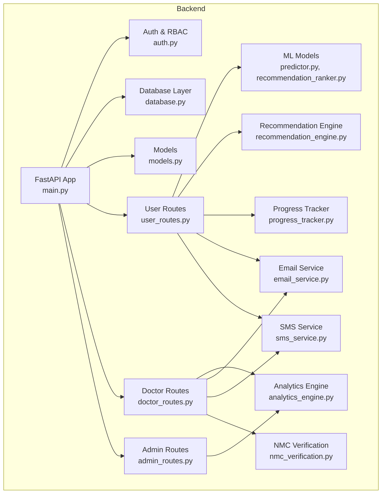
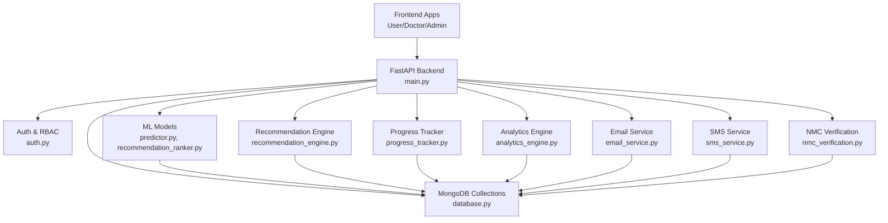
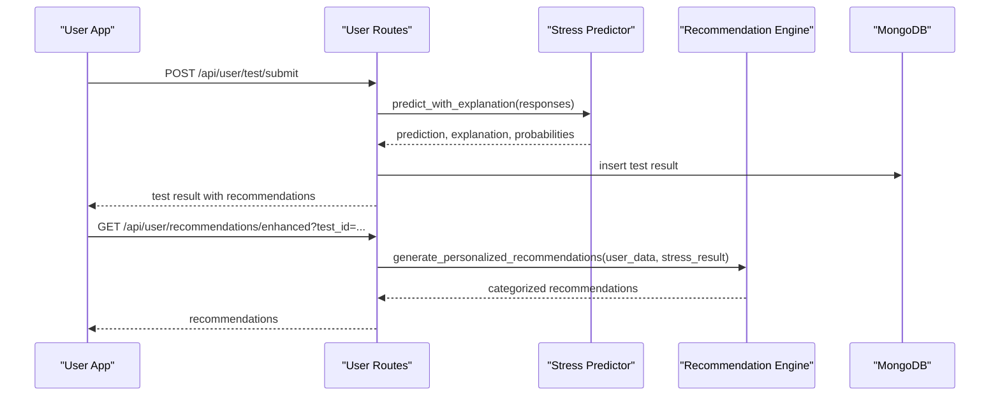
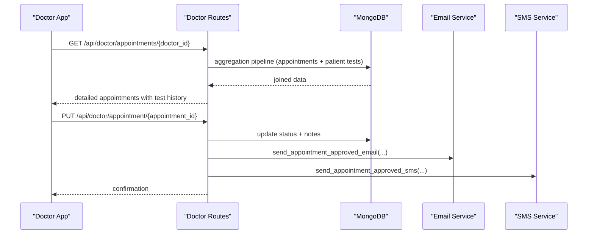
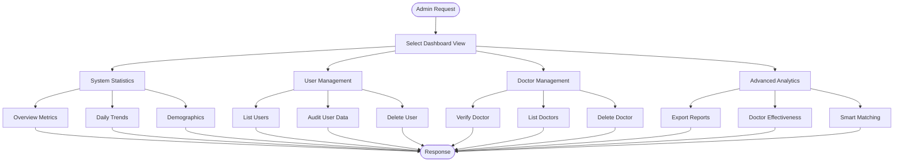
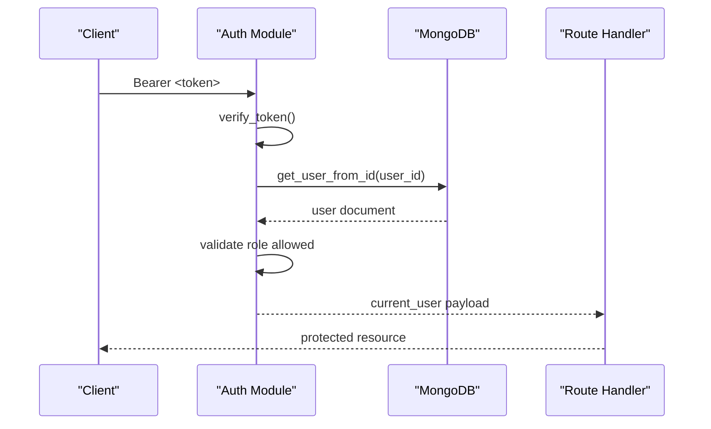
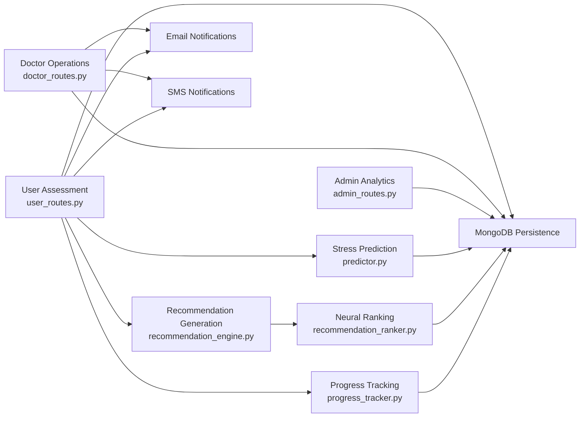
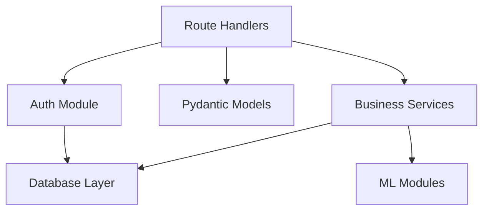

# Three-Dashboard System

<cite>
**Referenced Files in This Document**
- [main.py](file://backend/app/main.py)
- [auth.py](file://backend/app/auth.py)
- [database.py](file://backend/app/database.py)
- [models.py](file://backend/app/models.py)
- [user_routes.py](file://backend/app/routes/user_routes.py)
- [doctor_routes.py](file://backend/app/routes/doctor_routes.py)
- [admin_routes.py](file://backend/app/routes/admin_routes.py)
- [progress_tracker.py](file://backend/app/progress_tracker.py)
- [recommendation_engine.py](file://backend/app/recommendation_engine.py)
- [analytics_engine.py](file://backend/app/analytics_engine.py)
- [email_service.py](file://backend/app/email_service.py)
- [sms_service.py](file://backend/app/sms_service.py)
- [predictor.py](file://backend/ml_model/predictor.py)
- [recommendation_ranker.py](file://backend/ml_model/recommendation_ranker.py)
- [nmc_verification.py](file://backend/app/nmc_verification.py)
</cite>

## Table of Contents
1. [Introduction](#introduction)
2. [Project Structure](#project-structure)
3. [Core Components](#core-components)
4. [Architecture Overview](#architecture-overview)
5. [Detailed Component Analysis](#detailed-component-analysis)
6. [Dependency Analysis](#dependency-analysis)
7. [Performance Considerations](#performance-considerations)
8. [Troubleshooting Guide](#troubleshooting-guide)
9. [Conclusion](#conclusion)

## Introduction
This document describes the three-dashboard system architecture for an AI-powered stress detection and management platform. The system comprises three distinct dashboards:
- User dashboard: self-assessment workflows, progress tracking, personal health records, and a recommendation system
- Doctor dashboard: patient management, appointment scheduling, test result review, and clinical decision support
- Admin dashboard: system analytics, user management, doctor verification, and administrative controls

The backend is built with FastAPI and MongoDB, featuring role-based access control (RBAC), JWT-based authentication, asynchronous notifications, and advanced analytics. The frontend integrates with these APIs to deliver a responsive user experience.

## Project Structure
The backend is organized into modular components:
- Application entry point and middleware configuration
- Authentication and authorization utilities
- Database abstraction and indexing
- Pydantic models for request/response validation
- Route modules for each dashboard
- Business logic modules for recommendations, progress tracking, analytics, and notifications
- Machine learning modules for stress prediction and recommendation ranking

**Diagram sources**
- [main.py:52-79](file://backend/app/main.py#L52-L79)
- [auth.py:98-151](file://backend/app/auth.py#L98-L151)
- [database.py:88-159](file://backend/app/database.py#L88-L159)
- [models.py:16-440](file://backend/app/models.py#L16-L440)
- [user_routes.py:32-36](file://backend/app/routes/user_routes.py#L32-L36)
- [doctor_routes.py:22-22](file://backend/app/routes/doctor_routes.py#L22-L22)
- [admin_routes.py:9-9](file://backend/app/routes/admin_routes.py#L9-L9)
- [predictor.py:32-46](file://backend/ml_model/predictor.py#L32-L46)
- [recommendation_ranker.py:9-108](file://backend/ml_model/recommendation_ranker.py#L9-L108)
- [recommendation_engine.py:11-554](file://backend/app/recommendation_engine.py#L11-L554)
- [progress_tracker.py:48-134](file://backend/app/progress_tracker.py#L48-L134)
- [analytics_engine.py:11-384](file://backend/app/analytics_engine.py#L11-L384)
- [email_service.py:17-493](file://backend/app/email_service.py#L17-L493)
- [sms_service.py:29-249](file://backend/app/sms_service.py#L29-L249)
- [nmc_verification.py:88-215](file://backend/app/nmc_verification.py#L88-L215)

**Section sources**
- [main.py:52-137](file://backend/app/main.py#L52-L137)
- [database.py:88-302](file://backend/app/database.py#L88-L302)

## Core Components
- Role-Based Access Control (RBAC): JWT-based authentication with role checks for user, doctor, and admin
- Data Models: Comprehensive Pydantic models for user, doctor, test, appointment, recommendation, and analytics entities
- Routing: Modular route handlers under /api/user, /api/doctor, and /api/admin with strict authorization
- ML Pipeline: Stress prediction with SHAP explanations, category scoring, and trend analysis
- Recommendation System: AI-ranked, personalized recommendations with gamification and progress tracking
- Notifications: Asynchronous email and SMS services for appointments, alerts, and results
- Analytics: Population-level insights, doctor effectiveness, and personal analytics
- Verification: NMC-based doctor verification integration

**Section sources**
- [auth.py:98-151](file://backend/app/auth.py#L98-L151)
- [models.py:16-440](file://backend/app/models.py#L16-L440)
- [user_routes.py:32-36](file://backend/app/routes/user_routes.py#L32-L36)
- [doctor_routes.py:22-22](file://backend/app/routes/doctor_routes.py#L22-L22)
- [admin_routes.py:9-9](file://backend/app/routes/admin_routes.py#L9-L9)
- [predictor.py:146-185](file://backend/ml_model/predictor.py#L146-L185)
- [recommendation_engine.py:17-58](file://backend/app/recommendation_engine.py#L17-L58)
- [progress_tracker.py:48-134](file://backend/app/progress_tracker.py#L48-L134)
- [analytics_engine.py:20-199](file://backend/app/analytics_engine.py#L20-L199)
- [email_service.py:17-493](file://backend/app/email_service.py#L17-L493)
- [sms_service.py:29-249](file://backend/app/sms_service.py#L29-L249)
- [nmc_verification.py:88-215](file://backend/app/nmc_verification.py#L88-L215)

## Architecture Overview
The system follows a layered architecture:
- Presentation: Frontend applications consume RESTful APIs exposed by FastAPI
- Application: Route handlers orchestrate business logic, ML inference, and persistence
- Domain Services: Recommendation engine, analytics engine, progress tracker
- Infrastructure: Database, email, and SMS providers

**Diagram sources**
- [main.py:52-79](file://backend/app/main.py#L52-L79)
- [auth.py:98-151](file://backend/app/auth.py#L98-L151)
- [database.py:88-159](file://backend/app/database.py#L88-L159)
- [predictor.py:32-46](file://backend/ml_model/predictor.py#L32-L46)
- [recommendation_engine.py:11-16](file://backend/app/recommendation_engine.py#L11-L16)
- [progress_tracker.py:48-50](file://backend/app/progress_tracker.py#L48-L50)
- [analytics_engine.py:11-19](file://backend/app/analytics_engine.py#L11-L19)
- [email_service.py:17-27](file://backend/app/email_service.py#L17-L27)
- [sms_service.py:29-48](file://backend/app/sms_service.py#L29-L48)
- [nmc_verification.py:10-14](file://backend/app/nmc_verification.py#L10-L14)

## Detailed Component Analysis

### User Dashboard Implementation
The User dashboard encompasses:
- Self-assessment workflows: CBT-based questionnaire, video assessment, and multimodal scoring
- Results and explanations: SHAP-based explanations, category scores, risk factors, and trend analysis
- Personal health records: Secure storage and retrieval of medical documents
- Recommendation system: AI-ranked, personalized recommendations with gamification and reminders
- Profile management: Editable user profile with privacy controls

**Diagram sources**
- [user_routes.py:407-499](file://backend/app/routes/user_routes.py#L407-L499)
- [predictor.py:146-185](file://backend/ml_model/predictor.py#L146-L185)
- [recommendation_engine.py:17-58](file://backend/app/recommendation_engine.py#L17-L58)

Key implementation highlights:
- Questionnaire definition and scoring logic
- Multimodal assessment pipeline with fallbacks
- SHAP-based explanations and risk factor identification
- Trend analysis and crisis detection
- Recommendation generation with AI ranking

**Section sources**
- [user_routes.py:150-499](file://backend/app/routes/user_routes.py#L150-L499)
- [predictor.py:146-484](file://backend/ml_model/predictor.py#L146-L484)
- [recommendation_engine.py:17-554](file://backend/app/recommendation_engine.py#L17-L554)
- [recommendation_ranker.py:70-104](file://backend/ml_model/recommendation_ranker.py#L70-L104)

### Doctor Dashboard Functionality
The Doctor dashboard enables:
- Patient management: View upcoming and past appointments with patient test histories
- Appointment scheduling: Approve, reject, or mark appointments as completed with automated notifications
- Test result review: Access detailed patient assessment results and trends
- Clinical decision support: Doctor effectiveness analytics and smart matching for appointments

**Diagram sources**
- [doctor_routes.py:48-134](file://backend/app/routes/doctor_routes.py#L48-L134)
- [doctor_routes.py:171-267](file://backend/app/routes/doctor_routes.py#L171-L267)
- [email_service.py:292-338](file://backend/app/email_service.py#L292-L338)
- [sms_service.py:172-186](file://backend/app/sms_service.py#L172-L186)

Operational enhancements:
- Aggregation pipeline to minimize N+1 queries
- Asynchronous email/SMS notifications
- Role-based authorization for appointment updates
- Doctor effectiveness analytics for performance insights

**Section sources**
- [doctor_routes.py:48-399](file://backend/app/routes/doctor_routes.py#L48-L399)
- [analytics_engine.py:201-245](file://backend/app/analytics_engine.py#L201-L245)
- [email_service.py:292-429](file://backend/app/email_service.py#L292-L429)
- [sms_service.py:172-220](file://backend/app/sms_service.py#L172-L220)

### Admin Dashboard Features
The Admin dashboard provides:
- System analytics: Platform-wide statistics, trends, and demographics
- User management: View, audit, and delete users with their test and appointment history
- Doctor verification: Verify and manage healthcare professionals
- Administrative controls: System health monitoring and analytics exports

**Diagram sources**
- [admin_routes.py:14-62](file://backend/app/routes/admin_routes.py#L14-L62)
- [admin_routes.py:64-98](file://backend/app/routes/admin_routes.py#L64-L98)
- [admin_routes.py:100-125](file://backend/app/routes/admin_routes.py#L100-L125)
- [admin_routes.py:127-140](file://backend/app/routes/admin_routes.py#L127-L140)
- [admin_routes.py:142-158](file://backend/app/routes/admin_routes.py#L142-L158)
- [admin_routes.py:160-179](file://backend/app/routes/admin_routes.py#L160-L179)
- [admin_routes.py:181-198](file://backend/app/routes/admin_routes.py#L181-L198)
- [admin_routes.py:200-214](file://backend/app/routes/admin_routes.py#L200-L214)
- [admin_routes.py:217-224](file://backend/app/routes/admin_routes.py#L217-L224)

Administrative capabilities:
- Comprehensive statistics and recent activity
- User and doctor lifecycle management
- Advanced analytics including trends and effectiveness
- Secure deletion with cascading cleanup

**Section sources**
- [admin_routes.py:14-224](file://backend/app/routes/admin_routes.py#L14-L224)
- [analytics_engine.py:20-199](file://backend/app/analytics_engine.py#L20-L199)

### Role-Based Access Control and Security
The system enforces RBAC through JWT-based authentication:
- Token creation with user_id, role, and email claims
- Middleware role checking for each route
- Dynamic user lookup across collections
- Secure password hashing and environment-driven secrets

**Diagram sources**
- [auth.py:57-151](file://backend/app/auth.py#L57-L151)
- [database.py:73-96](file://backend/app/database.py#L73-L96)

Security measures:
- Environment-configured JWT secret and algorithm
- Password hashing with bcrypt
- Role-based authorization decorators
- Token expiration and revocation via expiry

**Section sources**
- [auth.py:45-151](file://backend/app/auth.py#L45-L151)
- [database.py:307-338](file://backend/app/database.py#L307-L338)

### Data Flow Between Dashboards and Backend Services
The data flow integrates ML inference, recommendation generation, and persistence:
- User assessments trigger ML prediction with explanations
- Recommendations are generated and ranked using neural networks
- Progress tracking maintains gamified engagement
- Notifications are dispatched asynchronously
- Analytics engines aggregate insights across collections

**Diagram sources**
- [user_routes.py:407-499](file://backend/app/routes/user_routes.py#L407-L499)
- [predictor.py:146-185](file://backend/ml_model/predictor.py#L146-L185)
- [recommendation_engine.py:17-58](file://backend/app/recommendation_engine.py#L17-L58)
- [recommendation_ranker.py:70-104](file://backend/ml_model/recommendation_ranker.py#L70-L104)
- [progress_tracker.py:135-235](file://backend/app/progress_tracker.py#L135-L235)
- [doctor_routes.py:208-260](file://backend/app/routes/doctor_routes.py#L208-L260)
- [email_service.py:58-66](file://backend/app/email_service.py#L58-L66)
- [sms_service.py:129-133](file://backend/app/sms_service.py#L129-L133)

**Section sources**
- [user_routes.py:407-753](file://backend/app/routes/user_routes.py#L407-L753)
- [doctor_routes.py:48-399](file://backend/app/routes/doctor_routes.py#L48-L399)
- [admin_routes.py:14-224](file://backend/app/routes/admin_routes.py#L14-L224)
- [predictor.py:146-484](file://backend/ml_model/predictor.py#L146-L484)
- [recommendation_engine.py:17-554](file://backend/app/recommendation_engine.py#L17-L554)
- [recommendation_ranker.py:70-104](file://backend/ml_model/recommendation_ranker.py#L70-L104)
- [progress_tracker.py:135-235](file://backend/app/progress_tracker.py#L135-L235)
- [email_service.py:58-66](file://backend/app/email_service.py#L58-L66)
- [sms_service.py:129-133](file://backend/app/sms_service.py#L129-L133)

## Dependency Analysis
The system exhibits clear separation of concerns with minimal coupling:
- Routes depend on auth, models, and services
- Services encapsulate business logic and ML integration
- Database layer abstracts persistence and indexing
- Notification services are decoupled and asynchronous

**Diagram sources**
- [user_routes.py:1-32](file://backend/app/routes/user_routes.py#L1-L32)
- [auth.py:1-21](file://backend/app/auth.py#L1-L21)
- [models.py:1-12](file://backend/app/models.py#L1-L12)
- [database.py:1-24](file://backend/app/database.py#L1-L24)

**Section sources**
- [user_routes.py:1-32](file://backend/app/routes/user_routes.py#L1-L32)
- [doctor_routes.py:1-22](file://backend/app/routes/doctor_routes.py#L1-L22)
- [admin_routes.py:1-9](file://backend/app/routes/admin_routes.py#L1-L9)
- [auth.py:1-21](file://backend/app/auth.py#L1-L21)
- [database.py:1-24](file://backend/app/database.py#L1-L24)

## Performance Considerations
- Database optimization: Connection pooling, extensive indexing, and aggregation pipelines
- Asynchronous operations: Background threads for email/SMS to avoid blocking responses
- Efficient queries: Aggregation joins and compound indexes for frequent lookups
- Model integrity: SHA-256 verification for ML model files
- Scalability: Horizontal scaling of MongoDB with replica sets and sharding

[No sources needed since this section provides general guidance]

## Troubleshooting Guide
Common issues and resolutions:
- Authentication failures: Verify JWT_SECRET_KEY and token validity
- Database connectivity: Check MONGODB_URL and serverSelectionTimeoutMS
- Email/SMS configuration: Confirm provider credentials and environment variables
- Model loading errors: Validate model file integrity and metadata hashes
- Index creation failures: Ensure database availability and permissions

**Section sources**
- [auth.py:24-31](file://backend/app/auth.py#L24-L31)
- [database.py:30-54](file://backend/app/database.py#L30-L54)
- [email_service.py:18-26](file://backend/app/email_service.py#L18-L26)
- [sms_service.py:40-58](file://backend/app/sms_service.py#L40-L58)
- [predictor.py:73-98](file://backend/ml_model/predictor.py#L73-L98)

## Conclusion
The three-dashboard system delivers a robust, scalable, and secure platform for stress assessment and management. Its modular architecture, comprehensive RBAC, advanced ML capabilities, and asynchronous notification system provide a solid foundation for user engagement, clinical workflows, and administrative oversight. The system emphasizes performance through optimized database operations and efficient ML inference while maintaining strong security practices and extensibility for future enhancements.