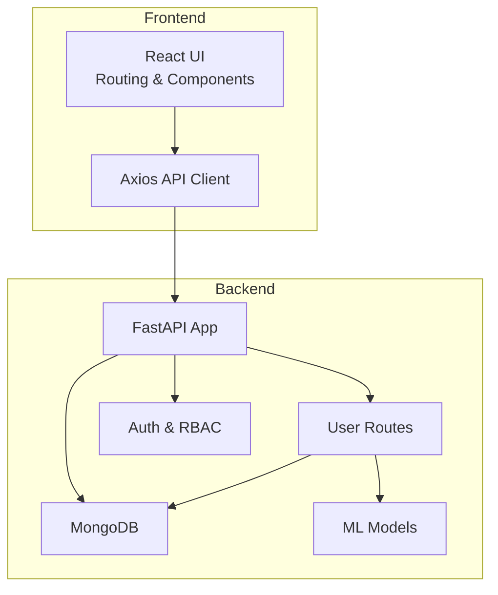
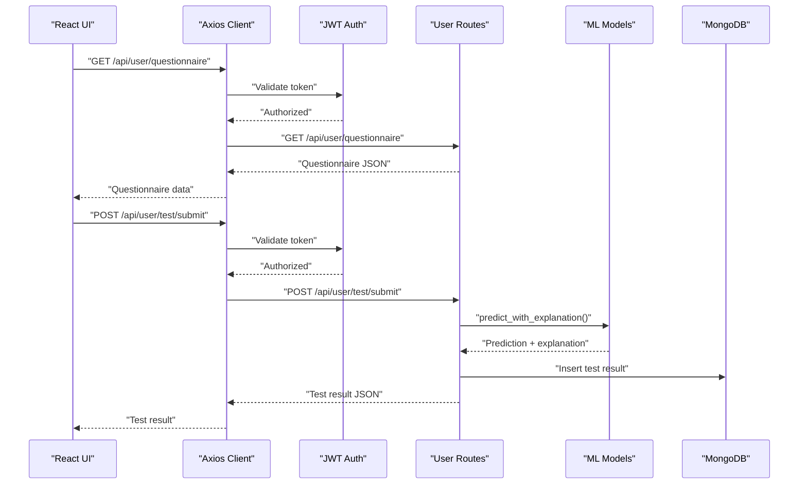
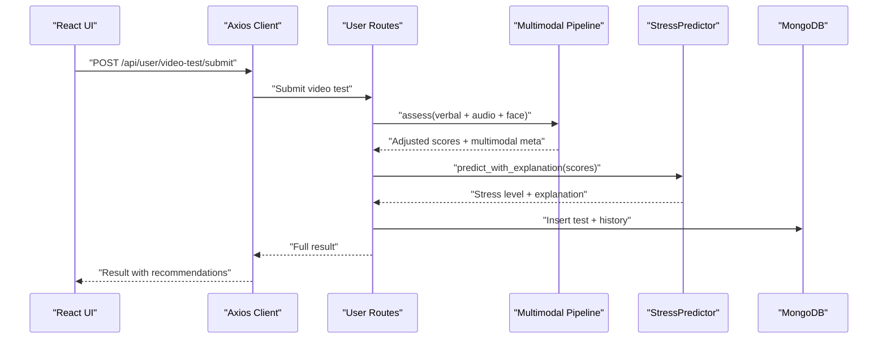
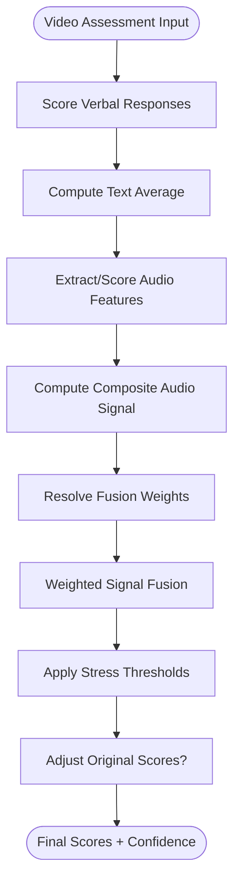
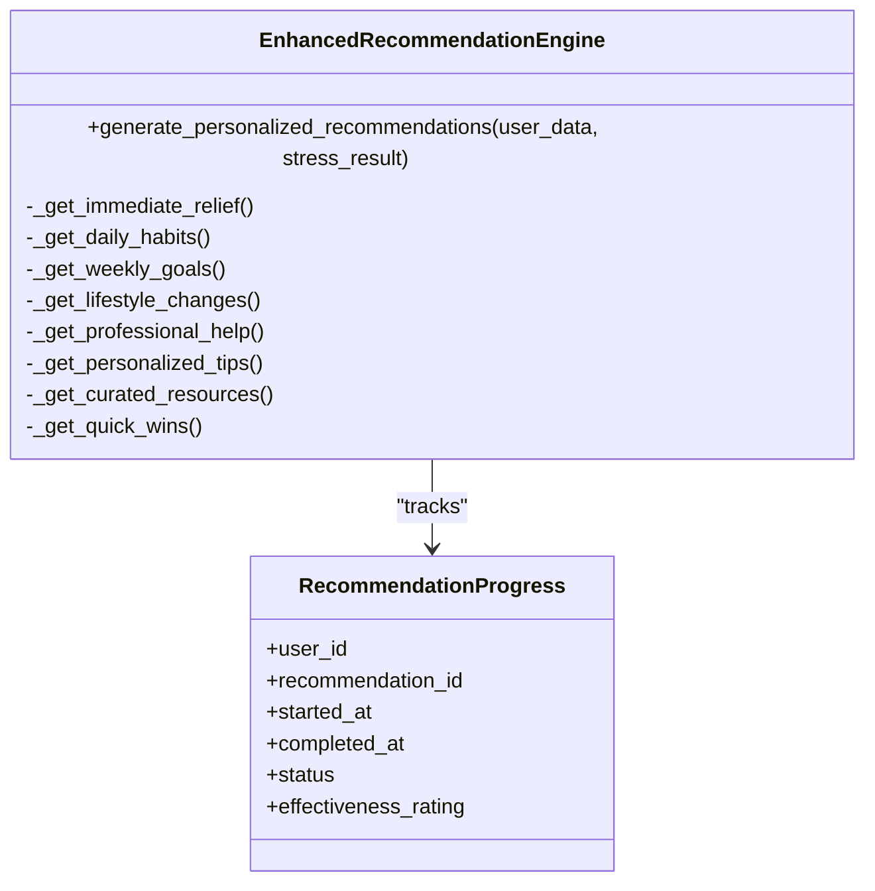
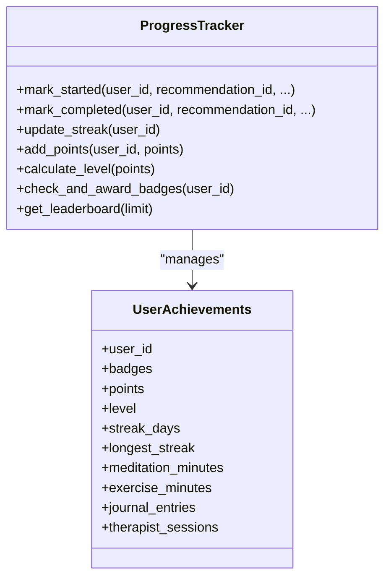
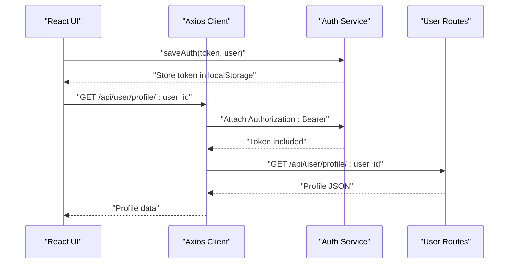
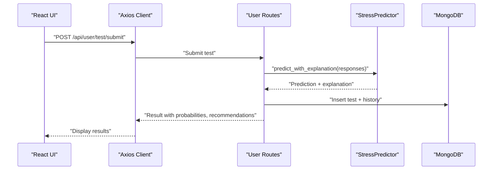
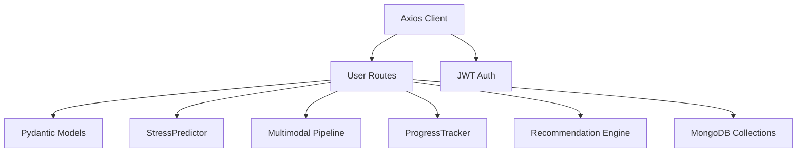

# User Dashboard

<cite>
**Referenced Files in This Document**
- [main.py](file://backend/app/main.py)
- [user_routes.py](file://backend/app/routes/user_routes.py)
- [models.py](file://backend/app/models.py)
- [progress_tracker.py](file://backend/app/progress_tracker.py)
- [recommendation_engine.py](file://backend/app/recommendation_engine.py)
- [predictor.py](file://backend/ml_model/predictor.py)
- [multimodal_pipeline.py](file://backend/ml_model/multimodal_pipeline.py)
- [api.ts](file://frontend/src/services/api.ts)
- [ARCHITECTURE_EXPLAINED.md](file://ARCHITECTURE_EXPLAINED.md)
- [README.md](file://README.md)
</cite>

## Table of Contents
1. [Introduction](#introduction)
2. [Project Structure](#project-structure)
3. [Core Components](#core-components)
4. [Architecture Overview](#architecture-overview)
5. [Detailed Component Analysis](#detailed-component-analysis)
6. [Dependency Analysis](#dependency-analysis)
7. [Performance Considerations](#performance-considerations)
8. [Troubleshooting Guide](#troubleshooting-guide)
9. [Conclusion](#conclusion)

## Introduction
This document provides comprehensive documentation for the User Dashboard implementation of the AI Stress Detector platform. It covers the end-to-end user journey including the 18-question CBT-based stress questionnaire, multimodal video assessment with real-time prediction results, personalized recommendation engine integration, gamification and progress tracking, achievement system, dashboard routing, user profile management, and security considerations for user-specific data access.

## Project Structure
The User Dashboard spans both backend and frontend components:
- Backend: FastAPI application exposing REST endpoints for user profile, questionnaire, video assessment, recommendations, progress tracking, and analytics.
- ML Models: Stress prediction engine, multimodal fusion pipeline, and recommendation ranking.
- Frontend: React-based client communicating with the backend via Axios, implementing routing and UI components for the user dashboard.

**Diagram sources**
- [main.py:52-79](file://backend/app/main.py#L52-L79)
- [user_routes.py:32-39](file://backend/app/routes/user_routes.py#L32-L39)

**Section sources**
- [main.py:52-137](file://backend/app/main.py#L52-L137)
- [README.md:69-87](file://README.md#L69-L87)

## Core Components
- User Profile Management: Retrieve and update user profile with role-based authorization.
- CBT Questionnaire: Serve 18-question stress assessment with Likert-scale instructions.
- Video Assessment: Multimodal processing combining textual, audio, and facial signals with real-time prediction.
- Recommendation Engine: Personalized, categorized recommendations with start/completion tracking.
- Progress & Gamification: Points, badges, streaks, and level progression tracking.
- Achievement System: Badge acquisition, milestone tracking, and user statistics display.
- Analytics Integration: Stress trend analysis and user analytics.
- Security: JWT-based authentication, role-based access control, and CORS configuration.

**Section sources**
- [user_routes.py:45-124](file://backend/app/routes/user_routes.py#L45-L124)
- [user_routes.py:171-184](file://backend/app/routes/user_routes.py#L171-L184)
- [user_routes.py:308-400](file://backend/app/routes/user_routes.py#L308-L400)
- [recommendation_engine.py:11-58](file://backend/app/recommendation_engine.py#L11-L58)
- [progress_tracker.py:48-454](file://backend/app/progress_tracker.py#L48-L454)
- [predictor.py:146-185](file://backend/ml_model/predictor.py#L146-L185)
- [multimodal_pipeline.py:74-179](file://backend/ml_model/multimodal_pipeline.py#L74-L179)

## Architecture Overview
The User Dashboard follows a layered architecture:
- Presentation Layer: React components handle routing and UI rendering.
- Service Layer: Axios client encapsulates API communication and authentication.
- Application Layer: FastAPI routes implement business logic with Pydantic validation.
- Data Layer: MongoDB stores user profiles, test results, recommendations progress, and achievements.
- ML Layer: Predictive models and pipelines provide stress level predictions and explanations.

**Diagram sources**
- [user_routes.py:171-184](file://backend/app/routes/user_routes.py#L171-L184)
- [user_routes.py:407-499](file://backend/app/routes/user_routes.py#L407-L499)
- [predictor.py:146-185](file://backend/ml_model/predictor.py#L146-L185)

## Detailed Component Analysis

### Self-Assessment Workflow
The self-assessment workflow supports two modalities:
- Traditional 18-question CBT questionnaire with Likert-scale responses.
- Video-based assessment integrating verbal responses with multimodal signals (audio, facial, sentiment) for enhanced prediction.

**Diagram sources**
- [user_routes.py:308-400](file://backend/app/routes/user_routes.py#L308-L400)
- [multimodal_pipeline.py:74-179](file://backend/ml_model/multimodal_pipeline.py#L74-L179)
- [predictor.py:146-185](file://backend/ml_model/predictor.py#L146-L185)

**Section sources**
- [user_routes.py:150-184](file://backend/app/routes/user_routes.py#L150-L184)
- [user_routes.py:308-400](file://backend/app/routes/user_routes.py#L308-L400)
- [predictor.py:146-185](file://backend/ml_model/predictor.py#L146-L185)
- [multimodal_pipeline.py:74-179](file://backend/ml_model/multimodal_pipeline.py#L74-L179)

### Multimodal Processing and Real-Time Prediction
The multimodal pipeline fuses textual, audio, and auxiliary signals:
- Textual signal derived from neural scoring of verbal responses.
- Audio signal from trained model or heuristic features (e.g., speaking rate).
- Composite audio signal combining acoustic and prosodic features.
- Weighted fusion with adaptive thresholds and confidence adjustment.
- Adjustment of original scores when audio confidence is high and stress level is elevated.

**Diagram sources**
- [multimodal_pipeline.py:74-179](file://backend/ml_model/multimodal_pipeline.py#L74-L179)

**Section sources**
- [multimodal_pipeline.py:74-179](file://backend/ml_model/multimodal_pipeline.py#L74-L179)

### Recommendation Engine Integration
The enhanced recommendation engine provides personalized, categorized recommendations:
- Immediate relief techniques (2-5 minutes).
- Daily habits (15-30 minutes).
- Weekly goals (1-2 hours).
- Lifestyle changes (ongoing).
- Professional help (urgent/high-risk scenarios).
- Personalized tips based on demographics and response patterns.
- Curated external resources and quick wins.

Recommendations are ranked using a neural ranker tailored to user profile and stress history.

**Diagram sources**
- [recommendation_engine.py:11-58](file://backend/app/recommendation_engine.py#L11-L58)
- [models.py:173-204](file://backend/app/models.py#L173-L204)

**Section sources**
- [recommendation_engine.py:17-58](file://backend/app/recommendation_engine.py#L17-L58)
- [models.py:148-204](file://backend/app/models.py#L148-L204)

### Progress Tracking and Gamification
The progress tracker implements:
- Points system for completing recommendations, maintaining streaks, adding notes, setting reminders, and engaging in activities.
- Badges for milestones (first step, getting started, week warrior, month master, stress crusher, zen master, fitness fan, journal enthusiast, therapy champion, perfectionist).
- Level progression with thresholds and calculated points to next level.
- Streak tracking with maintenance bonuses and longest streak persistence.
- Activity-specific metrics (meditation minutes, exercise minutes, journal entries, therapy sessions).

**Diagram sources**
- [progress_tracker.py:48-454](file://backend/app/progress_tracker.py#L48-L454)

**Section sources**
- [progress_tracker.py:48-454](file://backend/app/progress_tracker.py#L48-L454)
- [README.md:589-628](file://README.md#L589-L628)

### Achievement System
Achievement tracking includes:
- Badge acquisition upon meeting criteria.
- Milestone tracking for recommendations completed and streaks maintained.
- User statistics display (points, level, streaks, activity totals).
- Leaderboard functionality (top users by points).

**Section sources**
- [user_routes.py:759-803](file://backend/app/routes/user_routes.py#L759-L803)
- [progress_tracker.py:318-344](file://backend/app/progress_tracker.py#L318-L344)
- [progress_tracker.py:435-454](file://backend/app/progress_tracker.py#L435-L454)

### Dashboard Routing and User Profile Management
- Routing: The frontend uses React Router to navigate between pages (e.g., UserDashboard, Login, Register).
- Profile endpoints: Retrieve and update user profile with validation and role-based authorization.
- Authorization: JWT bearer tokens are attached to requests; unauthorized access redirects to login.

**Diagram sources**
- [api.ts:215-235](file://frontend/src/services/api.ts#L215-L235)
- [user_routes.py:45-124](file://backend/app/routes/user_routes.py#L45-L124)

**Section sources**
- [api.ts:215-235](file://frontend/src/services/api.ts#L215-L235)
- [user_routes.py:45-124](file://backend/app/routes/user_routes.py#L45-L124)

### Integration with ML Prediction System
- Questionnaire submission invokes the stress predictor to compute stress level, confidence, category scores, risk factors, and SHAP-based explanations.
- Video assessment integrates multimodal pipeline for enhanced prediction with confidence adjustments.
- Trend analysis and crisis detection leverage historical test data.

**Diagram sources**
- [user_routes.py:407-499](file://backend/app/routes/user_routes.py#L407-L499)
- [predictor.py:146-185](file://backend/ml_model/predictor.py#L146-L185)

**Section sources**
- [user_routes.py:407-499](file://backend/app/routes/user_routes.py#L407-L499)
- [predictor.py:146-185](file://backend/ml_model/predictor.py#L146-L185)

### Examples of User Interactions and Data Flow Patterns
- User completes questionnaire and receives instant prediction with recommendations.
- User initiates video assessment, provides verbal responses, and obtains multimodal-enhanced results.
- User starts and completes recommendations, earning points and potential badges.
- User views test history, trend analysis, and analytics insights.
- User updates profile information with validation and role-based restrictions.

**Section sources**
- [user_routes.py:171-184](file://backend/app/routes/user_routes.py#L171-L184)
- [user_routes.py:308-400](file://backend/app/routes/user_routes.py#L308-L400)
- [user_routes.py:575-753](file://backend/app/routes/user_routes.py#L575-L753)
- [predictor.py:363-414](file://backend/ml_model/predictor.py#L363-L414)

### Security Considerations for User-Specific Data Access
- JWT-based authentication with bearer tokens attached to all protected requests.
- Role-based access control (user, doctor, admin) enforced on endpoints.
- Input validation using Pydantic models to prevent malformed requests.
- CORS configuration restricted to allowed origins.
- Object-level authorization ensuring users can only access their own data.
- Secure storage of secrets via environment variables.

**Section sources**
- [api.ts:215-235](file://frontend/src/services/api.ts#L215-L235)
- [user_routes.py:45-124](file://backend/app/routes/user_routes.py#L45-L124)
- [main.py:32-68](file://backend/app/main.py#L32-L68)
- [README.md:630-641](file://README.md#L630-L641)

## Dependency Analysis
The User Dashboard relies on several key dependencies:
- FastAPI for routing and middleware.
- Pydantic for request/response validation.
- MongoDB for persistent storage.
- ML models for inference and explainability.
- Axios for frontend API communication.

**Diagram sources**
- [user_routes.py:8-29](file://backend/app/routes/user_routes.py#L8-L29)
- [models.py:7-11](file://backend/app/models.py#L7-L11)
- [predictor.py:32-45](file://backend/ml_model/predictor.py#L32-L45)
- [multimodal_pipeline.py:11-12](file://backend/ml_model/multimodal_pipeline.py#L11-L12)
- [progress_tracker.py:48-134](file://backend/app/progress_tracker.py#L48-L134)
- [recommendation_engine.py:11-16](file://backend/app/recommendation_engine.py#L11-L16)

**Section sources**
- [user_routes.py:8-29](file://backend/app/routes/user_routes.py#L8-L29)
- [models.py:7-11](file://backend/app/models.py#L7-L11)

## Performance Considerations
- Model loading at startup with integrity checks and auto-retraining safeguards.
- SHAP explainability computation with fallback mechanisms when unavailable.
- Multimodal fusion with adaptive weighting to improve robustness under varying input quality.
- Asynchronous LLM scoring with fallback chains for resilience.
- Efficient database queries with indexing on user_id and timestamps for test history.

[No sources needed since this section provides general guidance]

## Troubleshooting Guide
Common issues and resolutions:
- Backend model not found: The predictor auto-trains on startup if the model file is missing or corrupted.
- Frontend API connection failures: Verify backend is running, ALLOWED_ORIGINS includes frontend URL, and VITE_API_URL is correctly set.
- Authentication errors: Ensure JWT token exists in localStorage and is attached to requests; expired tokens trigger automatic logout.
- Authorization failures: Confirm role-based permissions and object-level authorization rules for accessing user data.

**Section sources**
- [predictor.py:81-98](file://backend/ml_model/predictor.py#L81-L98)
- [README.md:683-688](file://README.md#L683-L688)
- [api.ts:224-235](file://frontend/src/services/api.ts#L224-L235)
- [user_routes.py:501-559](file://backend/app/routes/user_routes.py#L501-L559)

## Conclusion
The User Dashboard delivers a comprehensive, secure, and scalable solution for stress assessment and management. It combines validated CBT methodologies with advanced machine learning, multimodal processing, and gamification to engage users and drive positive behavioral change. The modular architecture ensures maintainability, while robust security measures protect user privacy and data integrity.