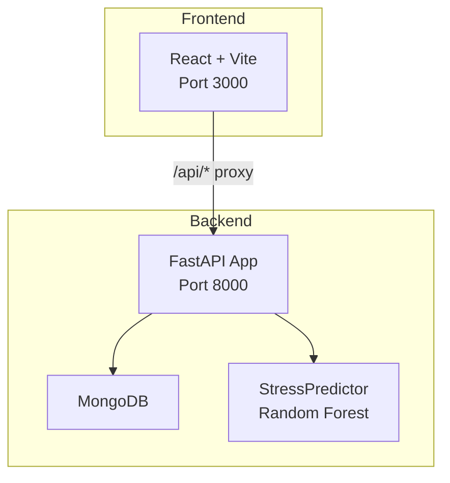
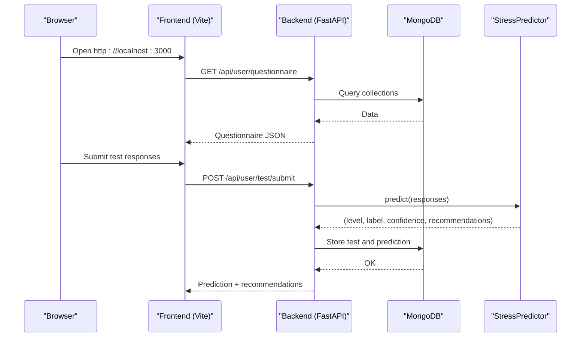
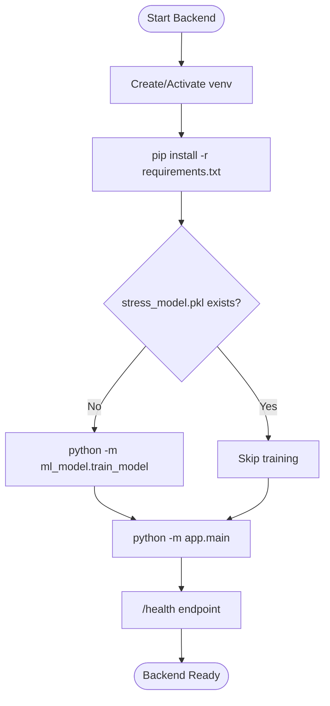
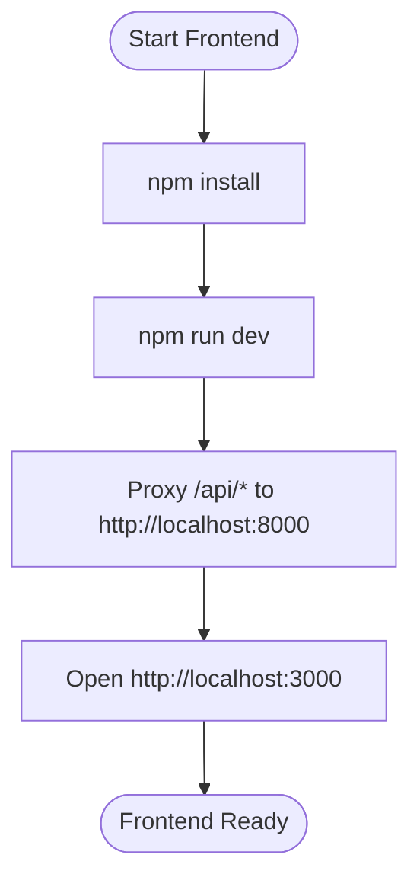
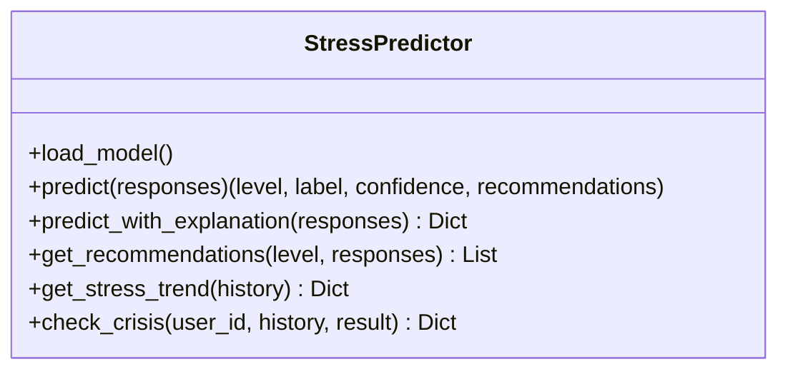
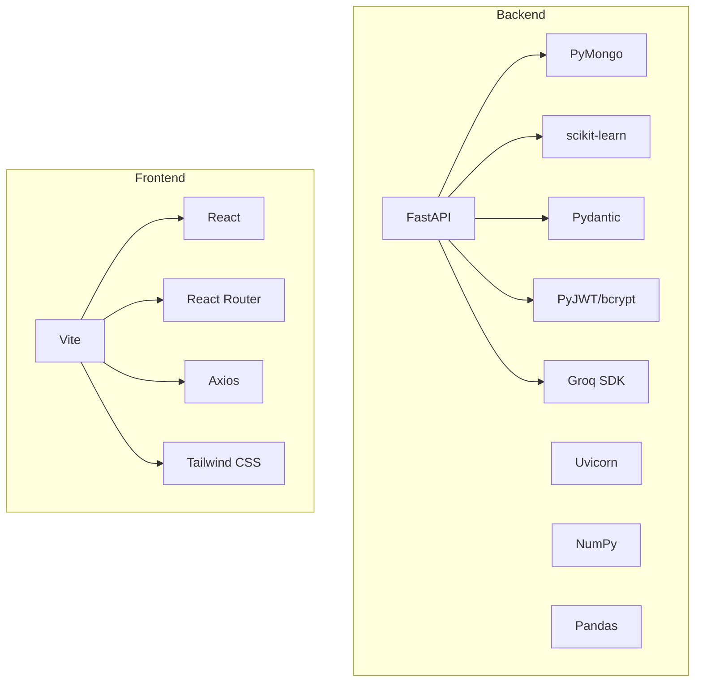

# Getting Started

<cite>
**Referenced Files in This Document**
- [README.md](file://README.md)
- [backend/requirements.txt](file://backend/requirements.txt)
- [frontend/package.json](file://frontend/package.json)
- [backend/app/main.py](file://backend/app/main.py)
- [backend/app/config.py](file://backend/app/config.py)
- [backend/app/database.py](file://backend/app/database.py)
- [backend/ml_model/train_model.py](file://backend/ml_model/train_model.py)
- [backend/ml_model/predictor.py](file://backend/ml_model/predictor.py)
- [start.sh](file://start.sh)
- [start.bat](file://start.bat)
- [frontend/vite.config.ts](file://frontend/vite.config.ts)
- [frontend/src/services/api.ts](file://frontend/src/services/api.ts)
- [test.sh](file://test.sh)
- [test.bat](file://test.bat)
- [backend/ml_model/VOICE_STRESS_TRAINING.md](file://backend/ml_model/VOICE_STRESS_TRAINING.md)
</cite>

## Table of Contents
1. [Introduction](#introduction)
2. [Project Structure](#project-structure)
3. [Core Components](#core-components)
4. [Architecture Overview](#architecture-overview)
5. [Detailed Component Analysis](#detailed-component-analysis)
6. [Dependency Analysis](#dependency-analysis)
7. [Performance Considerations](#performance-considerations)
8. [Troubleshooting Guide](#troubleshooting-guide)
9. [Conclusion](#conclusion)
10. [Appendices](#appendices)

## Introduction
This guide helps you install and run the AI Stress Level Analyzer locally for development and testing. It covers prerequisites, environment setup, database configuration, API keys, ML model initialization, and verification steps. It also outlines prerequisites for optional audio processing and multimodal capabilities.

## Project Structure
The project is a full-stack application:
- Backend: FastAPI server with Python, MongoDB, and machine learning inference/training.
- Frontend: React + TypeScript with Vite dev server and proxy to the backend.
- ML: Scikit-learn-based stress classifier and optional audio stress pipeline.

**Diagram sources**
- [frontend/vite.config.ts:10-17](file://frontend/vite.config.ts#L10-L17)
- [backend/app/main.py:134-137](file://backend/app/main.py#L134-L137)
- [backend/app/database.py:30-41](file://backend/app/database.py#L30-L41)
- [backend/ml_model/predictor.py:32-46](file://backend/ml_model/predictor.py#L32-L46)

**Section sources**
- [README.md:69-86](file://README.md#L69-L86)
- [frontend/vite.config.ts:10-17](file://frontend/vite.config.ts#L10-L17)
- [backend/app/main.py:134-137](file://backend/app/main.py#L134-L137)
- [backend/app/database.py:30-41](file://backend/app/database.py#L30-L41)

## Core Components
- Backend API server with authentication, routes, and database integration.
- Machine learning module that loads a trained model and provides predictions.
- Frontend proxy configured to forward API calls to the backend.
- Scripts to quickly start both backend and frontend, and to run tests.

**Section sources**
- [backend/app/main.py:52-79](file://backend/app/main.py#L52-L79)
- [backend/ml_model/predictor.py:32-46](file://backend/ml_model/predictor.py#L32-L46)
- [frontend/vite.config.ts:10-17](file://frontend/vite.config.ts#L10-L17)
- [start.sh:44-71](file://start.sh#L44-L71)
- [start.bat:56-60](file://start.bat#L56-L60)

## Architecture Overview
The system integrates:
- Frontend (React/Vite) proxies API calls to the backend.
- Backend (FastAPI) serves REST endpoints, manages MongoDB, and orchestrates ML inference.
- ML module loads a trained model and optionally computes SHAP explanations.
- Optional audio processing pipeline for voice-based stress features.

**Diagram sources**
- [frontend/vite.config.ts:10-17](file://frontend/vite.config.ts#L10-L17)
- [backend/app/main.py:70-78](file://backend/app/main.py#L70-L78)
- [backend/app/database.py:164-302](file://backend/app/database.py#L164-L302)
- [backend/ml_model/predictor.py:119-144](file://backend/ml_model/predictor.py#L119-L144)

## Detailed Component Analysis

### Backend Setup (Development)
- Create and activate a Python virtual environment.
- Install dependencies from requirements.txt.
- Train the ML model (required on first run).
- Start the backend server.

**Diagram sources**
- [backend/requirements.txt:1-22](file://backend/requirements.txt#L1-L22)
- [backend/ml_model/train_model.py:79-91](file://backend/ml_model/train_model.py#L79-L91)
- [backend/app/main.py:134-137](file://backend/app/main.py#L134-L137)

**Section sources**
- [README.md:396-416](file://README.md#L396-L416)
- [backend/requirements.txt:1-22](file://backend/requirements.txt#L1-L22)
- [backend/ml_model/train_model.py:79-91](file://backend/ml_model/train_model.py#L79-L91)
- [backend/app/main.py:134-137](file://backend/app/main.py#L134-L137)

### Frontend Setup (Development)
- Install Node.js and npm.
- Install dependencies from package.json.
- Start the Vite dev server.
- Configure proxy to forward /api/* to the backend.

**Diagram sources**
- [frontend/package.json:5-9](file://frontend/package.json#L5-L9)
- [frontend/vite.config.ts:10-17](file://frontend/vite.config.ts#L10-L17)

**Section sources**
- [README.md:421-433](file://README.md#L421-L433)
- [frontend/package.json:5-9](file://frontend/package.json#L5-L9)
- [frontend/vite.config.ts:10-17](file://frontend/vite.config.ts#L10-L17)

### Environment Variables and Secrets
Create a .env file in the backend root with required and optional variables:
- Required: JWT_SECRET_KEY, ADMIN_PASSWORD, MONGODB_URL.
- AI Chatbot: GROQ_API_KEY, GROQ_CHAT_MODEL.
- Email: SMTP_SERVER, SMTP_PORT, SMTP_USERNAME, SMTP_PASSWORD, FROM_EMAIL.
- Optional: SMS provider settings, ALLOWED_ORIGINS, ACCESS_TOKEN_EXPIRE_MINUTES.

**Section sources**
- [README.md:445-478](file://README.md#L445-L478)
- [backend/app/config.py:9-21](file://backend/app/config.py#L9-L21)

### Database Configuration
- Default MongoDB URL: mongodb://localhost:27017/aistressdetector.
- On startup, the backend initializes indexes and admin user if missing.
- Collections created automatically: users, doctors, admins, tests, appointments, medical_records, recommendation_progress, user_achievements, resources, reminders, otps.

**Section sources**
- [README.md:482-503](file://README.md#L482-L503)
- [backend/app/database.py:30-41](file://backend/app/database.py#L30-L41)
- [backend/app/database.py:164-302](file://backend/app/database.py#L164-L302)

### API Endpoints Overview
- Authentication: register user/doctor, login, verify OTP, resend OTP.
- User: questionnaire, submit test, history, book appointments, chatbot.
- Doctor: appointments, stats.
- Admin: stats, manage users/doctors, appointments.

**Section sources**
- [README.md:506-548](file://README.md#L506-L548)

### ML Model Execution
- The StressPredictor loads a trained model and returns stress level, confidence, and recommendations.
- If the model file is missing or corrupted, it auto-trains on startup.
- SHAP-based explanations are computed when available; otherwise feature importance is used.

**Diagram sources**
- [backend/ml_model/predictor.py:32-46](file://backend/ml_model/predictor.py#L32-L46)
- [backend/ml_model/predictor.py:119-144](file://backend/ml_model/predictor.py#L119-L144)
- [backend/ml_model/predictor.py:308-361](file://backend/ml_model/predictor.py#L308-L361)

**Section sources**
- [backend/ml_model/predictor.py:81-98](file://backend/ml_model/predictor.py#L81-L98)
- [backend/ml_model/train_model.py:147-190](file://backend/ml_model/train_model.py#L147-L190)

### Audio Processing and Multimodal Pipeline (Optional)
- The repository includes scripts and manifests for preparing datasets and training audio-based stress models.
- Voice stress training requires real labeled audio; synthetic data is not sufficient for production-grade accuracy.
- Recommended dataset layout and feature extraction pipeline are documented.

**Section sources**
- [backend/ml_model/VOICE_STRESS_TRAINING.md:1-189](file://backend/ml_model/VOICE_STRESS_TRAINING.md#L1-L189)

## Dependency Analysis
- Backend dependencies include FastAPI, Uvicorn, PyMongo, scikit-learn, NumPy, Pandas, Pydantic, JWT, bcrypt, Groq SDK, and others.
- Frontend dependencies include React, React Router, Axios, Tailwind CSS, and Vite.

**Diagram sources**
- [backend/requirements.txt:1-22](file://backend/requirements.txt#L1-L22)
- [frontend/package.json:10-16](file://frontend/package.json#L10-L16)

**Section sources**
- [backend/requirements.txt:1-22](file://backend/requirements.txt#L1-L22)
- [frontend/package.json:10-16](file://frontend/package.json#L10-L16)

## Performance Considerations
- Backend uses connection pooling and optimized timeouts for MongoDB.
- Indexes are created on frequently queried fields to improve performance.
- The ML model uses a calibrated ensemble for robust predictions.

**Section sources**
- [backend/app/database.py:30-41](file://backend/app/database.py#L30-L41)
- [backend/app/database.py:164-302](file://backend/app/database.py#L164-L302)
- [backend/ml_model/train_model.py:94-117](file://backend/ml_model/train_model.py#L94-L117)

## Troubleshooting Guide
Common issues and resolutions:
- MongoDB not running: Start the service using OS-specific commands.
- Backend port in use: Change the port in the backend startup configuration.
- Model not found: The backend auto-trains on startup; you can also run the training script manually.
- Frontend API connection issues: Ensure backend is running, ALLOWED_ORIGINS includes frontend URL, and Vite proxy settings are correct.

**Section sources**
- [README.md:664-696](file://README.md#L664-L696)
- [backend/app/main.py:134-137](file://backend/app/main.py#L134-L137)
- [frontend/vite.config.ts:10-17](file://frontend/vite.config.ts#L10-L17)

## Conclusion
You now have the steps to install, configure, and run the AI Stress Level Analyzer locally. Use the provided scripts to start both backend and frontend, verify the health endpoints, and explore the API documentation. For production deployments, ensure proper secrets management, CORS configuration, and database availability.

## Appendices

### System Requirements
- Python 3.10+ (backend)
- Node.js 18+ and npm (frontend)
- MongoDB (local or Atlas)

**Section sources**
- [README.md:379-383](file://README.md#L379-L383)

### Quick Start Scripts
- Linux/macOS: start.sh sets up backend, trains the model if needed, starts backend and frontend.
- Windows: start.bat sets up backend and starts the backend server.

**Section sources**
- [start.sh:18-71](file://start.sh#L18-L71)
- [start.bat:36-60](file://start.bat#L36-L60)

### Verification Steps
- Confirm MongoDB is reachable.
- Confirm backend health endpoint returns operational status.
- Confirm frontend is reachable and proxied to the backend.
- Confirm ML model file exists or is generated on startup.
- Run automated tests with test.sh or test.bat.

**Section sources**
- [test.sh:39-82](file://test.sh#L39-L82)
- [test.bat:13-45](file://test.bat#L13-L45)