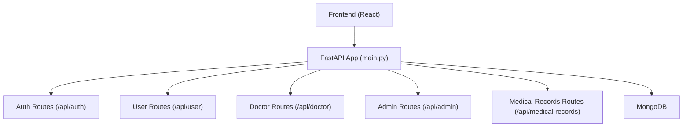
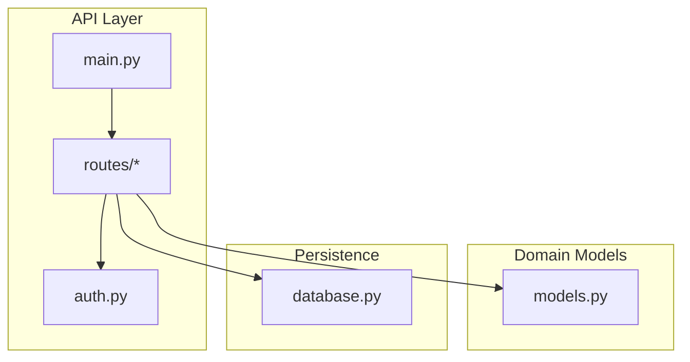
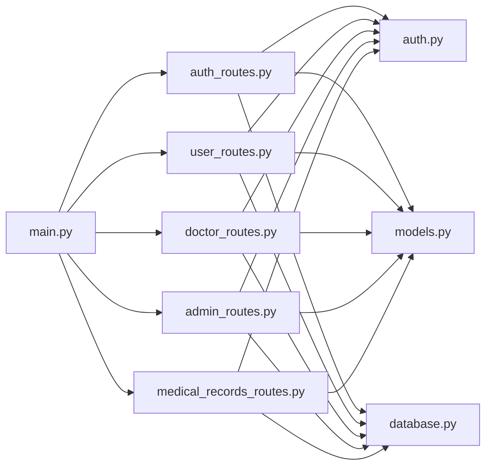

# API Design and Patterns

<cite>
**Referenced Files in This Document**
- [main.py](file://backend/app/main.py)
- [auth.py](file://backend/app/auth.py)
- [models.py](file://backend/app/models.py)
- [config.py](file://backend/app/config.py)
- [database.py](file://backend/app/database.py)
- [auth_routes.py](file://backend/app/routes/auth_routes.py)
- [user_routes.py](file://backend/app/routes/user_routes.py)
- [doctor_routes.py](file://backend/app/routes/doctor_routes.py)
- [admin_routes.py](file://backend/app/routes/admin_routes.py)
- [medical_records_routes.py](file://backend/app/routes/medical_records_routes.py)
- [forgot_password_routes.py](file://backend/app/forgot_password_routes.py)
- [README.md](file://README.md)
- [ARCHITECTURE_EXPLAINED.md](file://ARCHITECTURE_EXPLAINED.md)
</cite>

## Table of Contents
1. [Introduction](#introduction)
2. [Project Structure](#project-structure)
3. [Core Components](#core-components)
4. [Architecture Overview](#architecture-overview)
5. [Detailed Component Analysis](#detailed-component-analysis)
6. [Dependency Analysis](#dependency-analysis)
7. [Performance Considerations](#performance-considerations)
8. [Troubleshooting Guide](#troubleshooting-guide)
9. [Conclusion](#conclusion)
10. [Appendices](#appendices)

## Introduction
This document provides comprehensive API design and patterns documentation for the FastAPI-based RESTful services powering the AI Stress Level Analyzer. It covers endpoint groups (authentication, user management, doctor operations, admin functions, and medical records), request/response schemas, validation, routing, dependency injection, exception handling, authentication/authorization, versioning, error responses, rate limiting policies, pagination/filtering/sorting, and optional WebSocket patterns. The guide is intended for both technical and non-technical audiences.

## Project Structure
The backend is a FastAPI application that wires multiple route modules under a unified API router. It integrates with MongoDB for persistence, uses Pydantic for validation, and implements JWT-based authentication with role-based access control (RBAC). The application exposes Swagger/OpenAPI docs at the root `/docs`.

**Diagram sources**
- [main.py:52-79](file://backend/app/main.py#L52-L79)
- [auth_routes.py:32](file://backend/app/routes/auth_routes.py#L32)
- [user_routes.py:32](file://backend/app/routes/user_routes.py#L32)
- [doctor_routes.py:22](file://backend/app/routes/doctor_routes.py#L22)
- [admin_routes.py:9](file://backend/app/routes/admin_routes.py#L9)
- [medical_records_routes.py:40](file://backend/app/routes/medical_records_routes.py#L40)

**Section sources**
- [main.py:52-137](file://backend/app/main.py#L52-L137)
- [README.md:506-549](file://README.md#L506-L549)

## Core Components
- FastAPI application with CORS configuration and router inclusion
- JWT-based authentication and RBAC via dependency injection
- Pydantic models for request/response validation
- MongoDB collections abstraction with connection pooling and indexes
- Modular route groups for distinct functional domains

Key implementation highlights:
- Application entry and router wiring: [main.py:52-79](file://backend/app/main.py#L52-L79)
- Authentication utilities and token validation: [auth.py:24-190](file://backend/app/auth.py#L24-L190)
- Data models for all endpoints: [models.py:16-440](file://backend/app/models.py#L16-L440)
- Database connection and indexes: [database.py:26-302](file://backend/app/database.py#L26-L302)
- Settings configuration: [config.py:3-22](file://backend/app/config.py#L3-L22)

**Section sources**
- [main.py:52-137](file://backend/app/main.py#L52-L137)
- [auth.py:24-190](file://backend/app/auth.py#L24-L190)
- [models.py:16-440](file://backend/app/models.py#L16-L440)
- [database.py:26-302](file://backend/app/database.py#L26-L302)
- [config.py:3-22](file://backend/app/config.py#L3-L22)

## Architecture Overview
The API follows a layered architecture:
- Entry point initializes FastAPI, middleware, and routers
- Routes define endpoint groups with explicit HTTP methods and URL patterns
- Dependencies inject authentication and authorization checks
- Pydantic models validate inputs and serialize outputs
- MongoDB collections encapsulate persistence logic

**Diagram sources**
- [main.py:52-79](file://backend/app/main.py#L52-L79)
- [auth.py:98-151](file://backend/app/auth.py#L98-L151)
- [models.py:16-440](file://backend/app/models.py#L16-L440)
- [database.py:88-158](file://backend/app/database.py#L88-L158)

## Detailed Component Analysis

### Authentication Group (/api/auth)
Purpose: Registration, login, OTP verification, password reset, and document upload for users.

Endpoints:
- POST /api/auth/register/user
  - Request: [UserRegister:16-25](file://backend/app/models.py#L16-L25)
  - Response: [TokenResponse:119-123](file://backend/app/models.py#L119-L123)
  - Status: 201 Created, 400 Bad Request
  - Notes: Sends OTP via email/SMS; user not yet verified
- POST /api/auth/register/doctor
  - Request: [DoctorRegister:52-61](file://backend/app/models.py#L52-L61)
  - Response: [TokenResponse:119-123](file://backend/app/models.py#L119-L123)
  - Status: 201 Created, 400 Bad Request, 503 Service Unavailable (NMC verification)
  - Notes: NMC license validation and admin approval workflow
- POST /api/auth/verify-otp
  - Request: [OTPVerify:125-127](file://backend/app/models.py#L125-L127)
  - Response: [UserResponse:37-47](file://backend/app/models.py#L37-L47) with verification flags
  - Status: 200 OK, 400 Bad Request
- POST /api/auth/resend-otp
  - Request: [ResendOTPRequest:129-131](file://backend/app/models.py#L129-L131)
  - Response: JSON message
  - Status: 200 OK
- POST /api/auth/upload-medical-document
  - Request: multipart/form-data (file), depends on role=user
  - Response: JSON with filename
  - Status: 200 OK, 400 Bad Request, 500 Internal Server Error
- POST /api/auth/login
  - Request: [UserLogin:33-35](file://backend/app/models.py#L33-L35)
  - Response: [TokenResponse:119-123](file://backend/app/models.py#L119-L123)
  - Status: 200 OK, 401 Unauthorized, 403 Forbidden (verification/pending approval)
- POST /api/auth/change-password
  - Request: [ChangePassword:132-135](file://backend/app/models.py#L132-L135)
  - Response: JSON message
  - Status: 200 OK, 400 Bad Request, 401 Unauthorized, 404 Not Found
- POST /api/auth/forgot-password
  - Request: [ForgotPasswordRequest:24-25](file://backend/app/forgot_password_routes.py#L24-L25)
  - Response: JSON with email
  - Status: 200 OK, 404 Not Found
- POST /api/auth/verify-reset-otp
  - Request: [VerifyResetOTPRequest:27-29](file://backend/app/forgot_password_routes.py#L27-L29)
  - Response: JSON with email
  - Status: 200 OK, 400 Bad Request
- POST /api/auth/reset-password
  - Request: [ResetPasswordRequest:31-34](file://backend/app/forgot_password_routes.py#L31-L34)
  - Response: JSON message
  - Status: 200 OK, 400 Bad Request, 404 Not Found

Validation and serialization:
- Pydantic models enforce field constraints and types
- Responses are serialized via Pydantic models

Authentication and permissions:
- Login returns JWT; subsequent endpoints require Authorization: Bearer <token>
- Role-based access enforced via [require_role:98-151](file://backend/app/auth.py#L98-L151)
- Doctor registration requires NMC verification and admin approval

Rate limiting:
- Not implemented at the application level; consider external rate limiting or middleware

Examples:
- curl login:
  - curl -X POST http://localhost:8000/api/auth/login -H "Content-Type: application/json" -d '{"email":"user@example.com","password":"SecurePass123"}'
- curl register user:
  - curl -X POST http://localhost:8000/api/auth/register/user -H "Content-Type: application/json" -d '{"name":"John Doe","email":"john@example.com","password":"SecurePass123","age":30,"gender":"Male","location":"City"}'

**Section sources**
- [auth_routes.py:68-596](file://backend/app/routes/auth_routes.py#L68-L596)
- [models.py:16-135](file://backend/app/models.py#L16-L135)
- [auth.py:98-190](file://backend/app/auth.py#L98-L190)
- [forgot_password_routes.py:38-161](file://backend/app/forgot_password_routes.py#L38-L161)

### User Group (/api/user)
Purpose: Questionnaire, stress testing, recommendations, achievements, and chatbot.

Endpoints:
- GET /api/user/profile/{user_id}
  - Requires: user/admin
  - Response: JSON profile fields
  - Status: 200 OK, 400 Bad Request, 403 Forbidden, 404 Not Found
- PUT /api/user/profile/{user_id}
  - Request: [ProfileUpdate:137-142](file://backend/app/models.py#L137-L142)
  - Response: Updated profile JSON
  - Status: 200 OK, 400 Bad Request, 403 Forbidden, 404 Not Found
- GET /api/user/questionnaire
  - Response: JSON with questions and scale
  - Status: 200 OK
- POST /api/user/test/submit
  - Request: [TestSubmission:78-79](file://backend/app/models.py#L78-L79)
  - Response: [TestResponse:81-89](file://backend/app/models.py#L81-L89)
  - Status: 200 OK, 400 Bad Request, 500 Internal Server Error
- POST /api/user/video-test/submit
  - Request: [VideoTestSubmission:190-194](file://backend/app/routes/user_routes.py#L190-L194)
  - Response: Full test result with multimodal metadata
  - Status: 200 OK, 400 Bad Request, 500 Internal Server Error
- GET /api/user/test/history/{user_id}
  - Requires: user/admin/doctor
  - Response: List of test summaries
  - Status: 200 OK, 400 Bad Request, 403 Forbidden, 404 Not Found
- GET /api/user/test/{test_id}
  - Requires: user/doctor/admin
  - Response: Detailed test with questions
  - Status: 200 OK, 400 Bad Request, 403 Forbidden, 404 Not Found
- POST /api/user/recommendations/enhanced
  - Query param: test_id
  - Response: Enhanced recommendations
  - Status: 200 OK, 400 Bad Request, 403 Forbidden, 404 Not Found, 500 Internal Server Error
- POST /api/user/recommendations/start
  - Request: [RecommendationProgressCreate:173-178](file://backend/app/models.py#L173-L178)
  - Response: Progress tracking result
  - Status: 200 OK, 403 Forbidden, 500 Internal Server Error
- POST /api/user/recommendations/complete
  - Request: [RecommendationProgressComplete:181-188](file://backend/app/models.py#L181-L188)
  - Response: Progress tracking result
  - Status: 200 OK, 403 Forbidden, 500 Internal Server Error
- DELETE /api/user/recommendations/{user_id}/{recommendation_id}
  - Response: JSON message
  - Status: 200 OK, 403 Forbidden, 500 Internal Server Error
- POST /api/user/recommendations/save
  - Query params: user_id, recommendation_id
  - Response: JSON message
  - Status: 200 OK, 403 Forbidden, 500 Internal Server Error
- GET /api/user/achievements/{user_id}
  - Response: [UserAchievementsResponse:209-225](file://backend/app/models.py#L209-L225)
  - Status: 200 OK, 403 Forbidden, 500 Internal Server Error

Pagination, filtering, sorting:
- Not applicable for these endpoints; results are returned as lists without pagination

Examples:
- curl get questionnaire:
  - curl -H "Authorization: Bearer $TOKEN" http://localhost:8000/api/user/questionnaire
- curl submit test:
  - curl -X POST http://localhost:8000/api/user/test/submit -H "Authorization: Bearer $TOKEN" -H "Content-Type: application/json" -d '{"responses":[3,4,2,5,3,4,2,3,4,3,2,1,4,3,5,4,3,2]}'

**Section sources**
- [user_routes.py:45-800](file://backend/app/routes/user_routes.py#L45-L800)
- [models.py:78-225](file://backend/app/models.py#L78-L225)

### Doctor Group (/api/doctor)
Purpose: Manage appointments, view patient history, and get statistics.

Endpoints:
- GET /api/doctor/appointments/{doctor_id}
  - Response: List of appointments with patient test history (aggregated)
  - Status: 200 OK, 403 Forbidden
- GET /api/doctor/appointment/{appointment_id}/patient-tests
  - Response: Patient tests for an appointment
  - Status: 200 OK, 404 Not Found
- PUT /api/doctor/appointment/{appointment_id}
  - Request: [AppointmentUpdate:111-113](file://backend/app/models.py#L111-L113)
  - Response: JSON with status update
  - Status: 200 OK, 400 Bad Request, 403 Forbidden, 404 Not Found
- PUT /api/doctor/appointment/{appointment_id}/status
  - Alternative endpoint with same semantics
  - Status: 200 OK, 400 Bad Request, 403 Forbidden, 404 Not Found
- GET /api/doctor/stats/{doctor_id}
  - Response: Appointment counts by status
  - Status: 200 OK, 403 Forbidden

Notes:
- Aggregation pipelines optimize queries to fetch appointments and related test history in a single operation

Examples:
- curl update appointment:
  - curl -X PUT http://localhost:8000/api/doctor/appointment/... -H "Authorization: Bearer $TOKEN" -H "Content-Type: application/json" -d '{"status":"approved","notes":"See you at 10am"}'

**Section sources**
- [doctor_routes.py:48-400](file://backend/app/routes/doctor_routes.py#L48-L400)
- [models.py:111-113](file://backend/app/models.py#L111-L113)

### Admin Group (/api/admin)
Purpose: Platform-wide analytics, user/doctor management, and administrative actions.

Endpoints:
- GET /api/admin/stats
  - Response: Overview, appointments breakdown, stress distribution, recent activity counts
  - Status: 200 OK
- GET /api/admin/users
  - Response: List of users with counts and latest stress
  - Status: 200 OK
- GET /api/admin/doctors
  - Response: List of doctors with verification and appointment counts
  - Status: 200 OK
- PUT /api/admin/doctor/{id}/verify
  - Response: JSON message
  - Status: 200 OK, 404 Not Found
- GET /api/admin/appointments
  - Response: List of all appointments
  - Status: 200 OK
- GET /api/admin/tests/recent
  - Query param: limit
  - Response: List of recent tests with user info
  - Status: 200 OK
- DELETE /api/admin/user/{id}
  - Response: JSON message
  - Status: 200 OK, 404 Not Found
- DELETE /api/admin/doctor/{id}
  - Response: JSON message
  - Status: 200 OK, 404 Not Found
- GET /api/admin/analytics/advanced
  - Response: Advanced platform analytics
  - Status: 200 OK, 500 Internal Server Error

Examples:
- curl get admin stats:
  - curl -H "Authorization: Bearer $TOKEN" http://localhost:8000/api/admin/stats

**Section sources**
- [admin_routes.py:14-225](file://backend/app/routes/admin_routes.py#L14-L225)

### Medical Records Group (/api/medical-records)
Purpose: Secure upload, retrieval, update, deletion, and download of medical records; linking stress tests.

Endpoints:
- POST /api/medical-records/upload
  - Request: multipart/form-data with form fields and file
  - Response: [MedicalRecordResponse:312-332](file://backend/app/models.py#L312-L332)
  - Status: 201 Created, 400 Bad Request, 403 Forbidden, 500 Internal Server Error
  - Notes: Enforces storage limits and file validation
- GET /api/medical-records/user/{user_id}
  - Query params: record_type, from_date, to_date, search
  - Response: List of [MedicalRecordResponse:312-332](file://backend/app/models.py#L312-L332)
  - Status: 200 OK, 400 Bad Request, 403 Forbidden
- GET /api/medical-records/{record_id}
  - Response: [MedicalRecordResponse:312-332](file://backend/app/models.py#L312-L332)
  - Status: 200 OK, 400 Bad Request, 403 Forbidden, 404 Not Found
- PUT /api/medical-records/{record_id}
  - Request: [MedicalRecordUpdate:334-343](file://backend/app/models.py#L334-L343)
  - Response: [MedicalRecordResponse:312-332](file://backend/app/models.py#L312-L332)
  - Status: 200 OK, 400 Bad Request, 403 Forbidden, 404 Not Found
- DELETE /api/medical-records/{record_id}
  - Query param: permanent (boolean)
  - Response: JSON message
  - Status: 200 OK, 403 Forbidden, 404 Not Found
- GET /api/medical-records/download/{record_id}
  - Response: FileResponse or PDF stream (for stress test records)
  - Status: 200 OK, 400 Bad Request, 403 Forbidden, 404 Not Found
- POST /api/medical-records/download/bulk
  - Request: [BulkDownloadRequest:397-401](file://backend/app/models.py#L397-L401)
  - Response: ZIP stream
  - Status: 200 OK, 400 Bad Request, 403 Forbidden, 404 Not Found
- POST /api/medical-records/link-stress-test
  - Request: [TestResultAdd:357-363](file://backend/app/models.py#L357-L363)
  - Response: JSON with record_id and stress_test_id
  - Status: 200 OK, 400 Bad Request, 404 Not Found
- GET /api/medical-records/stats/{user_id}
  - Response: [MedicalRecordStats:406-416](file://backend/app/models.py#L406-L416)
  - Status: 200 OK, 403 Forbidden

Pagination, filtering, sorting:
- Filtering: record_type, from_date, to_date, search query
- Sorting: default sorts by uploaded_at desc
- Pagination: not implemented; consider adding limit/skip or cursor-based pagination

Examples:
- curl upload record:
  - curl -X POST http://localhost:8000/api/medical-records/upload -H "Authorization: Bearer $TOKEN" -F "user_id=..." -F "record_name=..." -F "record_type=..." -F "file=@/path/to/file.pdf"

**Section sources**
- [medical_records_routes.py:149-1054](file://backend/app/routes/medical_records_routes.py#L149-L1054)
- [models.py:300-416](file://backend/app/models.py#L300-L416)

### Dependency Injection and Exception Handling
- Authentication dependency: [require_role:98-151](file://backend/app/auth.py#L98-L151) parses Authorization header, verifies JWT, checks user existence, and enforces role constraints
- Current user dependency: [get_current_user:153-189](file://backend/app/auth.py#L153-L189) performs similar checks for single-user access
- Route-level dependencies: Each endpoint uses Depends(require_role([...])) to enforce permissions
- Exception handling: FastAPI raises HTTPException with appropriate status codes; Pydantic validation errors return 422 Unprocessable Entity

**Section sources**
- [auth.py:98-190](file://backend/app/auth.py#L98-L190)
- [auth_routes.py:324-327](file://backend/app/routes/auth_routes.py#L324-L327)
- [user_routes.py:46-75](file://backend/app/routes/user_routes.py#L46-L75)
- [doctor_routes.py:48-175](file://backend/app/routes/doctor_routes.py#L48-L175)
- [admin_routes.py:14-225](file://backend/app/routes/admin_routes.py#L14-L225)
- [medical_records_routes.py:284-357](file://backend/app/routes/medical_records_routes.py#L284-L357)

### API Versioning and Error Response Formats
- Versioning: Application version set in FastAPI constructor; no URL path versioning
- Error responses: Consistent JSON with message/detail fields; status codes reflect semantics (400, 401, 403, 404, 422, 500)

**Section sources**
- [main.py:53-57](file://backend/app/main.py#L53-L57)
- [auth_routes.py:242-246](file://backend/app/routes/auth_routes.py#L242-L246)
- [user_routes.py:506-510](file://backend/app/routes/user_routes.py#L506-L510)

### Rate Limiting Policies
- Not implemented in the application code; consider using FastAPI middleware or external solutions (e.g., NGINX, cloud gateways)

**Section sources**
- [auth_routes.py:324-375](file://backend/app/routes/auth_routes.py#L324-L375)
- [user_routes.py:407-499](file://backend/app/routes/user_routes.py#L407-L499)
- [doctor_routes.py:171-267](file://backend/app/routes/doctor_routes.py#L171-L267)
- [admin_routes.py:14-225](file://backend/app/routes/admin_routes.py#L14-L225)
- [medical_records_routes.py:149-278](file://backend/app/routes/medical_records_routes.py#L149-L278)

### Pagination, Filtering, and Sorting
- Medical records endpoints support filtering by type/date/search and default descending sort by upload date
- Other endpoints return full lists without pagination; consider adding limit/skip or cursor-based pagination for scalability

**Section sources**
- [medical_records_routes.py:284-357](file://backend/app/routes/medical_records_routes.py#L284-L357)

### WebSocket Endpoints and Real-Time Communication
- No WebSocket endpoints are present in the current codebase
- Real-time features rely on polling and asynchronous notifications (email/SMS) triggered by events

**Section sources**
- [doctor_routes.py:208-260](file://backend/app/routes/doctor_routes.py#L208-L260)
- [user_routes.py:370-381](file://backend/app/routes/user_routes.py#L370-L381)

## Dependency Analysis
The application exhibits clear separation of concerns:
- Entry point wires routers and middleware
- Routes depend on auth utilities and database collections
- Models define validation contracts
- Database module centralizes connection and indexing

**Diagram sources**
- [main.py:52-79](file://backend/app/main.py#L52-L79)
- [auth_routes.py:32](file://backend/app/routes/auth_routes.py#L32)
- [user_routes.py:32](file://backend/app/routes/user_routes.py#L32)
- [doctor_routes.py:22](file://backend/app/routes/doctor_routes.py#L22)
- [admin_routes.py:9](file://backend/app/routes/admin_routes.py#L9)
- [medical_records_routes.py:40](file://backend/app/routes/medical_records_routes.py#L40)
- [auth.py:24-190](file://backend/app/auth.py#L24-L190)
- [models.py:16-440](file://backend/app/models.py#L16-L440)
- [database.py:88-158](file://backend/app/database.py#L88-L158)

**Section sources**
- [main.py:52-137](file://backend/app/main.py#L52-L137)
- [auth.py:24-190](file://backend/app/auth.py#L24-L190)
- [models.py:16-440](file://backend/app/models.py#L16-L440)
- [database.py:88-158](file://backend/app/database.py#L88-L158)

## Performance Considerations
- Connection pooling and timeouts: MongoDB client configured with maxPoolSize/minPoolSize and timeouts
- Indexes: Extensive indexes created for collections to optimize frequent queries
- Aggregation pipelines: Doctor routes use aggregation to reduce N+1 queries
- Recommendations: Progress tracking and achievement calculations performed in-memory with minimal DB writes

Recommendations:
- Add pagination for large lists (e.g., user/admin endpoints)
- Implement Redis caching for frequently accessed metadata
- Consider async workers for heavy operations (e.g., bulk downloads)

**Section sources**
- [database.py:30-41](file://backend/app/database.py#L30-L41)
- [database.py:164-302](file://backend/app/database.py#L164-L302)
- [doctor_routes.py:52-87](file://backend/app/routes/doctor_routes.py#L52-L87)

## Troubleshooting Guide
Common issues and resolutions:
- Authentication failures:
  - Ensure Authorization: Bearer <token> header is present
  - Verify token is not expired and payload contains user_id/role/email
- Role/access violations:
  - Confirm user role matches endpoint requirements
  - Check that user_id in token matches requested resource
- Validation errors:
  - Review Pydantic model constraints (e.g., field lengths, enums)
- Database connectivity:
  - Confirm MongoDB URL and credentials
  - Check server logs for connection errors

**Section sources**
- [auth.py:153-189](file://backend/app/auth.py#L153-L189)
- [auth_routes.py:377-439](file://backend/app/routes/auth_routes.py#L377-L439)
- [database.py:26-54](file://backend/app/database.py#L26-L54)

## Conclusion
The API employs a clean, modular FastAPI architecture with strong validation, robust authentication/authorization, and optimized database access patterns. While comprehensive coverage of all endpoints is provided, enhancements such as pagination, rate limiting, and WebSocket support could further improve scalability and user experience.

## Appendices

### API Versioning Approach
- Application version set in FastAPI app; no URL path versioning
- Health endpoint includes version and feature flags

**Section sources**
- [main.py:53-57](file://backend/app/main.py#L53-L57)
- [main.py:114-132](file://backend/app/main.py#L114-L132)

### Error Response Format
- Consistent JSON with message/detail fields
- Appropriate HTTP status codes

**Section sources**
- [auth_routes.py:242-246](file://backend/app/routes/auth_routes.py#L242-L246)
- [user_routes.py:506-510](file://backend/app/routes/user_routes.py#L506-L510)

### Example Requests and Responses
- Authentication:
  - curl -X POST http://localhost:8000/api/auth/login -H "Content-Type: application/json" -d '{"email":"user@example.com","password":"SecurePass123"}'
  - Response: TokenResponse with access_token and user claims
- User questionnaire:
  - curl -H "Authorization: Bearer $TOKEN" http://localhost:8000/api/user/questionnaire
  - Response: JSON with questions and scale
- Submit test:
  - curl -X POST http://localhost:8000/api/user/test/submit -H "Authorization: Bearer $TOKEN" -H "Content-Type: application/json" -d '{"responses":[3,4,2,5,3,4,2,3,4,3,2,1,4,3,5,4,3,2]}'
  - Response: TestResponse with stress level, confidence, recommendations

**Section sources**
- [auth_routes.py:377-439](file://backend/app/routes/auth_routes.py#L377-L439)
- [user_routes.py:171-184](file://backend/app/routes/user_routes.py#L171-L184)
- [user_routes.py:407-499](file://backend/app/routes/user_routes.py#L407-L499)