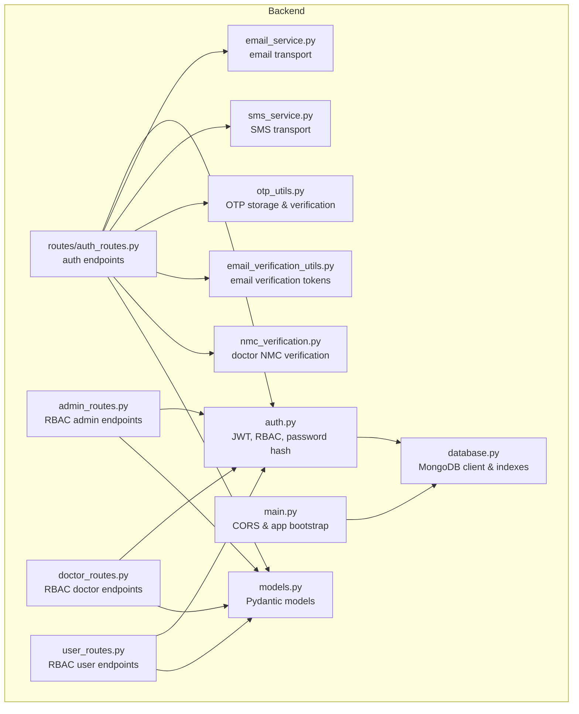
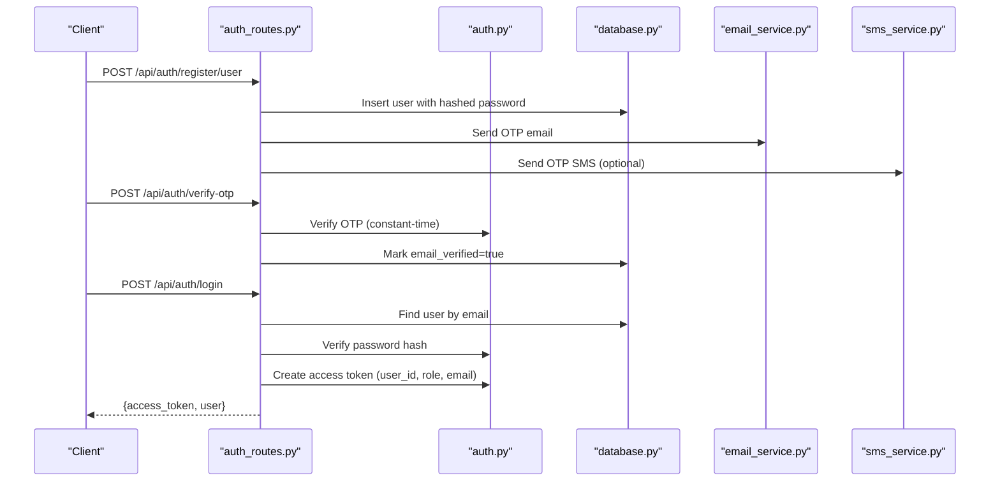
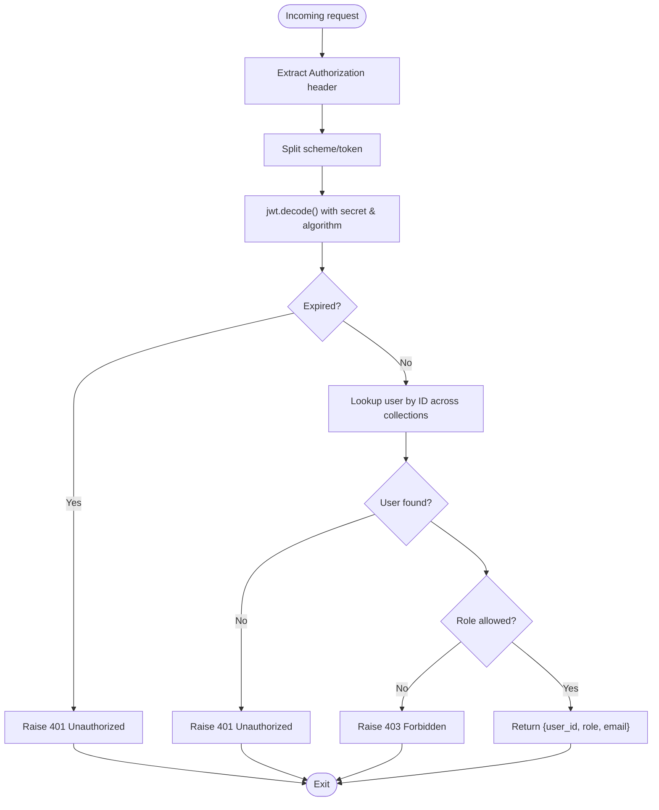
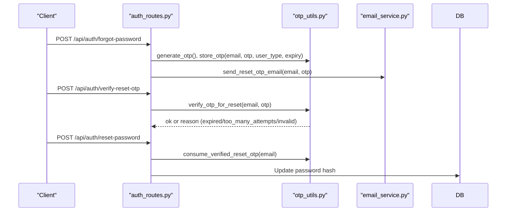
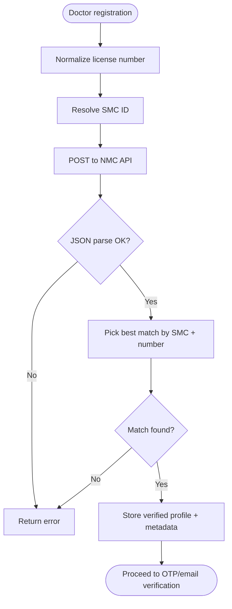
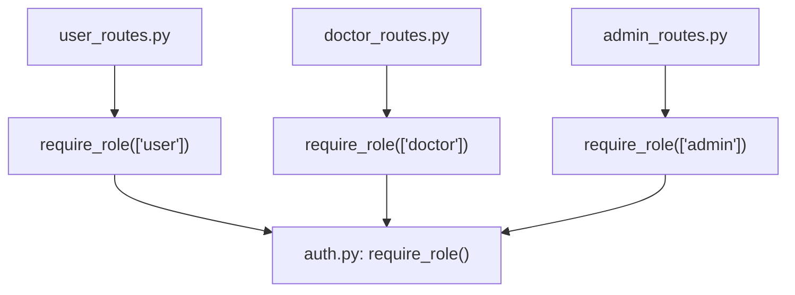
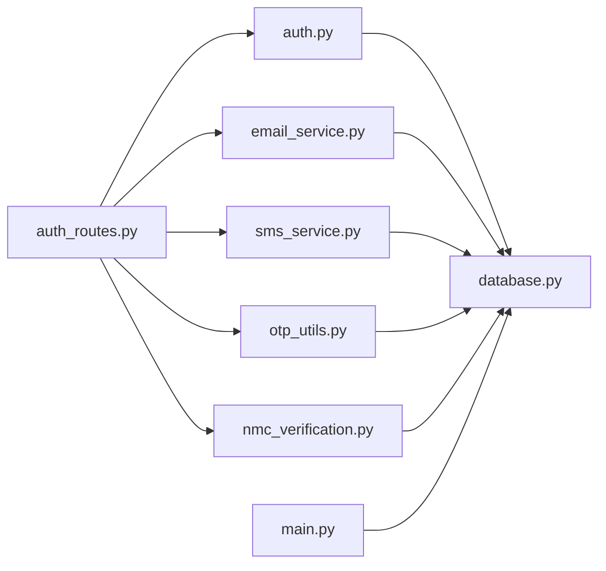

# Authentication and Security

<cite>
**Referenced Files in This Document**
- [auth.py](file://backend/app/auth.py)
- [main.py](file://backend/app/main.py)
- [config.py](file://backend/app/config.py)
- [models.py](file://backend/app/models.py)
- [auth_routes.py](file://backend/app/routes/auth_routes.py)
- [email_verification_utils.py](file://backend/app/email_verification_utils.py)
- [otp_utils.py](file://backend/app/otp_utils.py)
- [nmc_verification.py](file://backend/app/nmc_verification.py)
- [email_service.py](file://backend/app/email_service.py)
- [sms_service.py](file://backend/app/sms_service.py)
- [database.py](file://backend/app/database.py)
- [admin_routes.py](file://backend/app/routes/admin_routes.py)
- [doctor_routes.py](file://backend/app/routes/doctor_routes.py)
- [user_routes.py](file://backend/app/routes/user_routes.py)
</cite>

## Table of Contents
1. [Introduction](#introduction)
2. [Project Structure](#project-structure)
3. [Core Components](#core-components)
4. [Architecture Overview](#architecture-overview)
5. [Detailed Component Analysis](#detailed-component-analysis)
6. [Dependency Analysis](#dependency-analysis)
7. [Performance Considerations](#performance-considerations)
8. [Troubleshooting Guide](#troubleshooting-guide)
9. [Conclusion](#conclusion)
10. [Appendices](#appendices)

## Introduction
This document explains the authentication and security system of the AI Stress Level Analyzer. It covers JWT-based authentication, role-based access control (RBAC), email verification and OTP workflows, NMC verification for doctors, password hashing, sessionless token management, and operational security controls such as CORS configuration, rate limiting, and brute-force protections. It also outlines secure API usage guidelines and mitigations for common vulnerabilities.

## Project Structure
The authentication and security logic is primarily implemented in the backend application under the app directory. Key areas include:
- JWT utilities and RBAC middleware
- Authentication routes (registration, login, OTP, password reset)
- Email and SMS services
- OTP and email verification utilities
- NMC verification for doctor accounts
- Database configuration and indexes
- CORS configuration in the main application entry point

**Diagram sources**
- [auth.py:1-190](file://backend/app/auth.py#L1-L190)
- [auth_routes.py:1-596](file://backend/app/routes/auth_routes.py#L1-L596)
- [email_service.py:1-493](file://backend/app/email_service.py#L1-L493)
- [sms_service.py:1-249](file://backend/app/sms_service.py#L1-L249)
- [otp_utils.py:1-162](file://backend/app/otp_utils.py#L1-L162)
- [email_verification_utils.py:1-62](file://backend/app/email_verification_utils.py#L1-L62)
- [nmc_verification.py:1-215](file://backend/app/nmc_verification.py#L1-L215)
- [database.py:1-509](file://backend/app/database.py#L1-L509)
- [main.py:1-137](file://backend/app/main.py#L1-L137)
- [models.py:1-440](file://backend/app/models.py#L1-L440)
- [admin_routes.py:1-225](file://backend/app/routes/admin_routes.py#L1-L225)
- [doctor_routes.py:1-400](file://backend/app/routes/doctor_routes.py#L1-L400)
- [user_routes.py:1-800](file://backend/app/routes/user_routes.py#L1-L800)

**Section sources**
- [main.py:52-68](file://backend/app/main.py#L52-L68)
- [database.py:26-55](file://backend/app/database.py#L26-L55)

## Core Components
- JWT-based authentication and RBAC:
  - Token creation with user_id, role, and email, plus expiration
  - Token validation with signature and expiration checks
  - Role-based dependency for enforcing access policies
  - User lookup across collections by ID
- Password hashing:
  - bcrypt-based hashing with truncation to 72 bytes
- OTP and email verification:
  - 6-digit OTP generation with configurable expiry
  - Attempt limits and constant-time comparison
  - Email and SMS delivery for verification and resets
- NMC verification for doctors:
  - Validation against NMC public registry with normalization and matching
- CORS configuration:
  - Environment-driven allowed origins with strict validation
- Database and indexes:
  - Connection pooling, timeouts, and TTL-based OTP cleanup
  - Indexes for performance and uniqueness constraints

**Section sources**
- [auth.py:45-190](file://backend/app/auth.py#L45-L190)
- [otp_utils.py:38-162](file://backend/app/otp_utils.py#L38-L162)
- [email_verification_utils.py:8-62](file://backend/app/email_verification_utils.py#L8-L62)
- [nmc_verification.py:147-215](file://backend/app/nmc_verification.py#L147-L215)
- [main.py:32-68](file://backend/app/main.py#L32-L68)
- [database.py:30-509](file://backend/app/database.py#L30-L509)

## Architecture Overview
The authentication and security architecture centers on JWT bearer tokens passed in Authorization headers. Routes enforce RBAC via a dependency that validates tokens, resolves user identity, and enforces role-based access. Supporting services handle OTP generation and delivery, email/SMS notifications, and doctor NMC verification.

**Diagram sources**
- [auth_routes.py:68-440](file://backend/app/routes/auth_routes.py#L68-L440)
- [auth.py:33-190](file://backend/app/auth.py#L33-L190)
- [database.py:88-103](file://backend/app/database.py#L88-L103)
- [email_service.py:119-165](file://backend/app/email_service.py#L119-L165)
- [sms_service.py:135-152](file://backend/app/sms_service.py#L135-L152)

## Detailed Component Analysis

### JWT Authentication and RBAC
- Token creation:
  - Payload includes user_id, role, email, issued-at, and expiration
  - Algorithm and secret loaded from environment
- Token validation:
  - Decoding with algorithm and secret
  - Expiration and invalid-token handling
- RBAC enforcement:
  - require_role dependency extracts Bearer token from Authorization header
  - Verifies token, resolves user by ID across users/doctors/admins
  - Checks role membership against allowed roles
  - Returns current user info for downstream endpoints
- Current-user extraction:
  - get_current_user performs the same validation for single-role usage

**Diagram sources**
- [auth.py:98-190](file://backend/app/auth.py#L98-L190)

**Section sources**
- [auth.py:23-56](file://backend/app/auth.py#L23-L56)
- [auth.py:57-72](file://backend/app/auth.py#L57-L72)
- [auth.py:98-151](file://backend/app/auth.py#L98-L151)
- [auth.py:153-190](file://backend/app/auth.py#L153-L190)

### Password Hashing and Validation
- bcrypt hashing:
  - Password truncated to 72 bytes before hashing
  - Salt generated per password
  - Stored as plain string after hashing
- Password verification:
  - Constant-time comparison against stored hash
  - Used during login and password change flows

**Section sources**
- [auth.py:33-43](file://backend/app/auth.py#L33-L43)
- [auth_routes.py:442-474](file://backend/app/routes/auth_routes.py#L442-L474)

### Email Verification and OTP Workflow
- OTP generation and storage:
  - 6-digit numeric OTP
  - Configurable expiry (minutes)
  - Attempt limits (default 3) with constant-time comparison
  - TTL-based cleanup for persistent OTP storage
- Verification flow:
  - Registration triggers OTP send for both email and optional SMS
  - OTP verification marks email_verified and removes OTP
- Reset flow:
  - Separate OTP verification step with “verified” flag
  - Atomic consumption of verified OTP for password reset
- Email verification tokens:
  - One-time use tokens with expiration for alternate flows

**Diagram sources**
- [auth_routes.py:481-596](file://backend/app/routes/auth_routes.py#L481-L596)
- [otp_utils.py:93-142](file://backend/app/otp_utils.py#L93-L142)
- [email_service.py:72-113](file://backend/app/email_service.py#L72-L113)

**Section sources**
- [otp_utils.py:38-91](file://backend/app/otp_utils.py#L38-L91)
- [otp_utils.py:93-142](file://backend/app/otp_utils.py#L93-L142)
- [email_verification_utils.py:8-48](file://backend/app/email_verification_utils.py#L8-L48)
- [auth_routes.py:236-304](file://backend/app/routes/auth_routes.py#L236-L304)
- [auth_routes.py:306-322](file://backend/app/routes/auth_routes.py#L306-L322)

### Doctor NMC Verification
- Input normalization and validation:
  - License number normalization and format validation
  - State medical council resolution to internal ID
- External verification:
  - Calls NMC public API with registration number and SMC ID
  - Parses and selects best-matching record
- Storage:
  - Verified profile built and stored with timestamps and metadata

**Diagram sources**
- [nmc_verification.py:147-215](file://backend/app/nmc_verification.py#L147-L215)
- [auth_routes.py:134-234](file://backend/app/routes/auth_routes.py#L134-L234)

**Section sources**
- [nmc_verification.py:59-110](file://backend/app/nmc_verification.py#L59-L110)
- [nmc_verification.py:147-215](file://backend/app/nmc_verification.py#L147-L215)
- [auth_routes.py:134-234](file://backend/app/routes/auth_routes.py#L134-L234)

### Role-Based Access Control (RBAC)
- Roles:
  - user, doctor, admin
- Enforcement:
  - require_role dependency ensures token validity and role presence
  - Per-route decorators apply to admin, doctor, and user endpoints
- Examples:
  - Admin-only stats and user/doctor management
  - Doctor-only appointment management and updates
  - User-only profile, test history, and recommendations

**Diagram sources**
- [user_routes.py:45-123](file://backend/app/routes/user_routes.py#L45-L123)
- [doctor_routes.py:48-134](file://backend/app/routes/doctor_routes.py#L48-L134)
- [admin_routes.py:14-98](file://backend/app/routes/admin_routes.py#L14-L98)
- [auth.py:98-151](file://backend/app/auth.py#L98-L151)

**Section sources**
- [admin_routes.py:14-98](file://backend/app/routes/admin_routes.py#L14-L98)
- [doctor_routes.py:48-134](file://backend/app/routes/doctor_routes.py#L48-L134)
- [user_routes.py:45-123](file://backend/app/routes/user_routes.py#L45-L123)
- [auth.py:98-151](file://backend/app/auth.py#L98-L151)

### CORS Configuration
- Origins are loaded from environment and validated:
  - Only http/https schemes with non-empty netlocs are accepted
  - Defaults to localhost origins if none valid
- Middleware applied globally to allow credentials, specific methods, and headers

**Section sources**
- [main.py:32-68](file://backend/app/main.py#L32-L68)

### Secure API Usage Guidelines
- Always send Authorization: Bearer <token> for protected endpoints
- Use HTTPS in production to protect tokens and payloads
- Treat tokens as secrets; never log or expose them
- Respect role boundaries; do not attempt to access resources outside your role
- For doctor endpoints, ensure you own the appointment or patient context
- For admin actions, verify you have admin privileges

[No sources needed since this section provides general guidance]

## Dependency Analysis
The authentication system relies on several modules with clear boundaries:
- auth.py depends on PyJWT, bcrypt, and MongoDB collections
- auth_routes.py depends on auth.py, email_service, sms_service, otp_utils, nmc_verification, and database collections
- otp_utils.py and email_verification_utils.py encapsulate OTP and token persistence
- database.py centralizes MongoDB client, collections, and indexes
- main.py configures CORS and loads environment variables

**Diagram sources**
- [auth_routes.py:1-31](file://backend/app/routes/auth_routes.py#L1-L31)
- [auth.py:16-18](file://backend/app/auth.py#L16-L18)
- [email_service.py:17-26](file://backend/app/email_service.py#L17-L26)
- [sms_service.py:29-57](file://backend/app/sms_service.py#L29-L57)
- [otp_utils.py:8](file://backend/app/otp_utils.py#L8)
- [nmc_verification.py:1-9](file://backend/app/nmc_verification.py#L1-L9)
- [database.py:13-24](file://backend/app/database.py#L13-L24)
- [main.py:10-15](file://backend/app/main.py#L10-L15)

**Section sources**
- [auth_routes.py:1-31](file://backend/app/routes/auth_routes.py#L1-L31)
- [auth.py:16-18](file://backend/app/auth.py#L16-L18)
- [database.py:13-24](file://backend/app/database.py#L13-L24)

## Performance Considerations
- Database connection pooling and timeouts:
  - Max pool size, min pool size, and socket/server timeouts improve concurrency and reliability
- Indexes:
  - Unique and compound indexes on email, license_number, timestamps, and composite queries
  - TTL index on OTPs for automatic cleanup
- Asynchronous notifications:
  - Email and SMS are sent asynchronously to avoid blocking responses
- Aggregation pipelines:
  - Doctor appointment listing uses aggregation to reduce round-trips

**Section sources**
- [database.py:30-509](file://backend/app/database.py#L30-L509)
- [email_service.py:58-66](file://backend/app/email_service.py#L58-L66)
- [sms_service.py:129-133](file://backend/app/sms_service.py#L129-L133)
- [doctor_routes.py:52-87](file://backend/app/routes/doctor_routes.py#L52-L87)

## Troubleshooting Guide
Common issues and resolutions:
- Invalid or expired token:
  - Ensure the Authorization header uses Bearer scheme and the token is within expiry
  - Tokens are validated with algorithm and secret from environment
- User not found or role mismatch:
  - Confirm the user_id exists in users/doctors/admins collections
  - Verify role assignment and that the user is not locked/disabled
- OTP errors:
  - Too many attempts or expired OTP will invalidate the code
  - Verify email/SMS delivery and check OTP storage TTL
- NMC verification failures:
  - Ensure license number and state medical council are valid
  - External service availability may cause temporary failures
- CORS errors:
  - Configure ALLOWED_ORIGINS with exact scheme/host/port combinations
- Database connectivity:
  - Check MongoDB URL and credentials; verify server selection and socket timeouts

**Section sources**
- [auth.py:57-72](file://backend/app/auth.py#L57-L72)
- [otp_utils.py:61-91](file://backend/app/otp_utils.py#L61-L91)
- [nmc_verification.py:172-177](file://backend/app/nmc_verification.py#L172-L177)
- [main.py:32-68](file://backend/app/main.py#L32-L68)
- [database.py:30-55](file://backend/app/database.py#L30-L55)

## Conclusion
The AI Stress Level Analyzer implements a robust, layered security model centered on JWT bearer tokens, strong password hashing, and role-based access control. Supporting mechanisms include OTP-based email verification, optional SMS notifications, doctor NMC verification, and strict CORS configuration. Operational improvements such as database pooling, TTL-based OTP cleanup, and asynchronous notifications enhance both security and performance. Adhering to the secure usage guidelines and monitoring logs will help maintain a resilient and trustworthy system.

## Appendices

### Security Controls Checklist
- Transport security:
  - Enforce HTTPS in production
  - Use secure cookies and SameSite attributes where applicable
- Secrets management:
  - Store JWT_SECRET_KEY, SMTP credentials, and API keys in environment variables
- Input validation and sanitization:
  - Leverage Pydantic models for request validation
  - Sanitize and validate file uploads and user inputs
- Injection prevention:
  - Use parameterized queries and avoid dynamic query construction
  - Validate and sanitize external API inputs (NMC verification)
- XSS protection:
  - Escape HTML in server-rendered content; prefer client-side templating libraries with escaping
- Rate limiting and brute-force protection:
  - Implement rate limiting at the gateway or middleware
  - Enforce OTP attempt caps and lockout policies
- Logging and monitoring:
  - Log authentication events and anomalies without sensitive data
  - Monitor failed login attempts and suspicious activities

[No sources needed since this section provides general guidance]