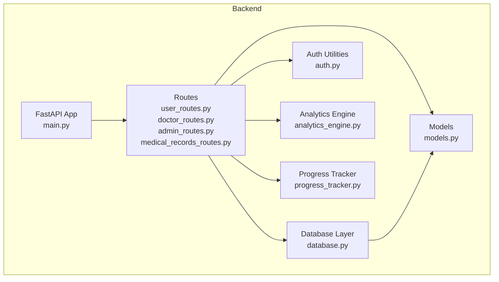
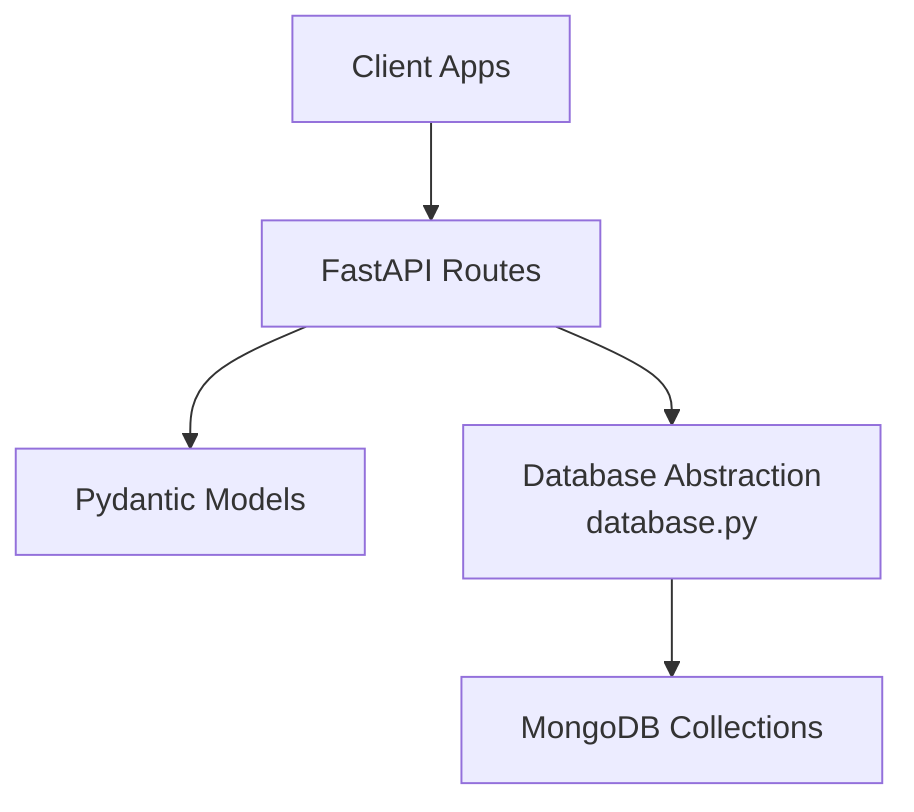
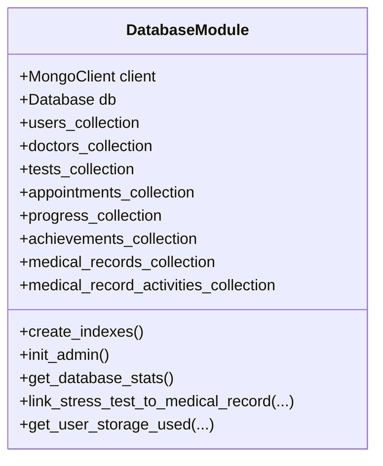
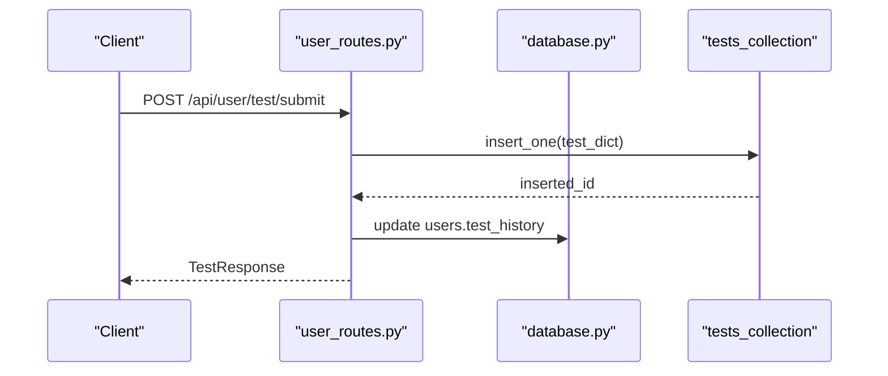
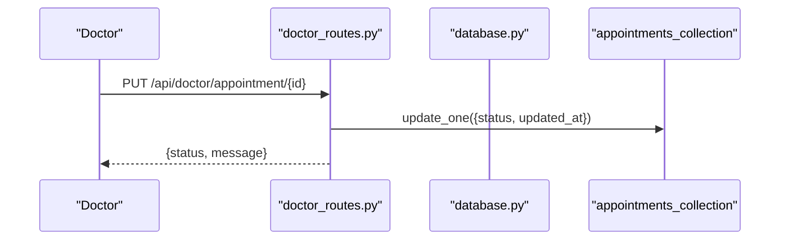
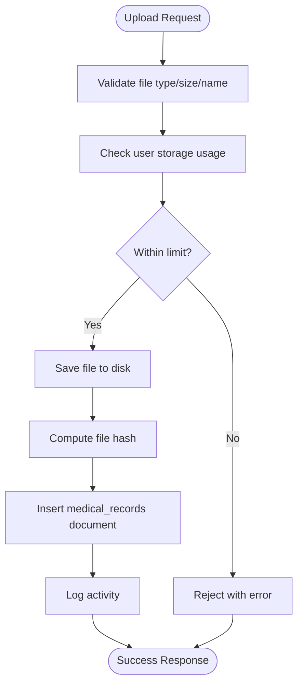
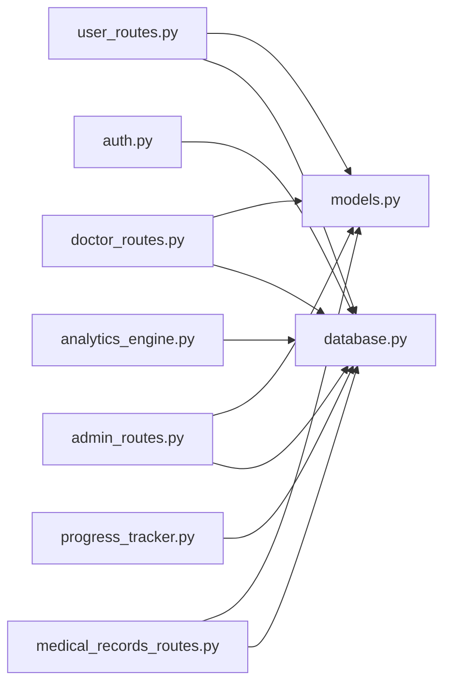

# Data Models and Database Design

<cite>
**Referenced Files in This Document**
- [models.py](file://backend/app/models.py)
- [database.py](file://backend/app/database.py)
- [config.py](file://backend/app/config.py)
- [auth.py](file://backend/app/auth.py)
- [main.py](file://backend/app/main.py)
- [user_routes.py](file://backend/app/routes/user_routes.py)
- [doctor_routes.py](file://backend/app/routes/doctor_routes.py)
- [admin_routes.py](file://backend/app/routes/admin_routes.py)
- [medical_records_routes.py](file://backend/app/routes/medical_records_routes.py)
- [progress_tracker.py](file://backend/app/progress_tracker.py)
- [analytics_engine.py](file://backend/app/analytics_engine.py)
</cite>

## Table of Contents
1. [Introduction](#introduction)
2. [Project Structure](#project-structure)
3. [Core Components](#core-components)
4. [Architecture Overview](#architecture-overview)
5. [Detailed Component Analysis](#detailed-component-analysis)
6. [Dependency Analysis](#dependency-analysis)
7. [Performance Considerations](#performance-considerations)
8. [Troubleshooting Guide](#troubleshooting-guide)
9. [Conclusion](#conclusion)
10. [Appendices](#appendices)

## Introduction
This document describes the data models and database design for the AI Stress Level Analyzer. It covers the MongoDB schema design for users, doctors, patients, tests, appointments, medical records, and administrative data structures. It documents the Pydantic models used for validation and serialization, the database abstraction layer and repository-like pattern, indexing strategies, and data access patterns. It also includes examples of insertion, querying, and aggregation operations, along with integrity, consistency, and performance considerations.

## Project Structure
The backend is organized around FastAPI routes, a central database module, and shared models. Collections are defined centrally and accessed by route handlers. Authentication utilities integrate with the database for role-based access control.

**Diagram sources**
- [main.py:52-80](file://backend/app/main.py#L52-L80)
- [user_routes.py:32-39](file://backend/app/routes/user_routes.py#L32-L39)
- [doctor_routes.py:22-22](file://backend/app/routes/doctor_routes.py#L22-L22)
- [admin_routes.py:9-12](file://backend/app/routes/admin_routes.py#L9-L12)
- [medical_records_routes.py:40-41](file://backend/app/routes/medical_records_routes.py#L40-L41)
- [models.py:7-11](file://backend/app/models.py#L7-L11)
- [database.py:15-24](file://backend/app/database.py#L15-L24)
- [auth.py:18-21](file://backend/app/auth.py#L18-L21)
- [analytics_engine.py:14-18](file://backend/app/analytics_engine.py#L14-L18)
- [progress_tracker.py:131-133](file://backend/app/progress_tracker.py#L131-L133)

**Section sources**
- [main.py:52-80](file://backend/app/main.py#L52-L80)
- [database.py:88-159](file://backend/app/database.py#L88-L159)
- [models.py:16-440](file://backend/app/models.py#L16-L440)

## Core Components
- Pydantic models define request/response shapes and validation rules for all entities.
- MongoDB collections are exposed as typed variables for centralized access.
- Indexes are created at startup to optimize frequent queries.
- Route handlers orchestrate data insertion, updates, and aggregations.
- Analytics and progress tracking rely on collection access and aggregation pipelines.

Key areas covered:
- User and doctor profiles
- Test submissions and results
- Appointments and doctor workflows
- Medical records and downloads
- Administrative analytics and stats
- Gamification and progress tracking

**Section sources**
- [models.py:16-440](file://backend/app/models.py#L16-L440)
- [database.py:88-302](file://backend/app/database.py#L88-L302)
- [user_routes.py:45-569](file://backend/app/routes/user_routes.py#L45-L569)
- [doctor_routes.py:48-400](file://backend/app/routes/doctor_routes.py#L48-L400)
- [admin_routes.py:14-225](file://backend/app/routes/admin_routes.py#L14-L225)
- [medical_records_routes.py:149-800](file://backend/app/routes/medical_records_routes.py#L149-L800)
- [progress_tracker.py:48-454](file://backend/app/progress_tracker.py#L48-L454)
- [analytics_engine.py:20-384](file://backend/app/analytics_engine.py#L20-L384)

## Architecture Overview
The system uses a layered architecture:
- Presentation: FastAPI routes
- Application: Business logic in routes and services
- Persistence: Centralized MongoDB access via typed collections
- Validation: Pydantic models for request/response validation

**Diagram sources**
- [main.py:71-79](file://backend/app/main.py#L71-L79)
- [models.py:16-440](file://backend/app/models.py#L16-L440)
- [database.py:88-159](file://backend/app/database.py#L88-L159)

## Detailed Component Analysis

### Pydantic Models and Validation
The models define strict schemas for all entities, including:
- User registration and profile updates
- Doctor registration and verification metadata
- Test submission and result structures
- Appointment creation, updates, and responses
- Medical record upload, filtering, and download
- Enhanced recommendations and progress tracking
- Analytics and chatbot message/response structures

Validation rules include:
- Field constraints (min/max length, numeric ranges)
- Enumerations for record types and file formats
- Email and phone number formats
- Password and OTP constraints

These models ensure consistent validation across endpoints and enable automatic OpenAPI documentation.

**Section sources**
- [models.py:16-440](file://backend/app/models.py#L16-L440)

### Database Abstraction and Repository Pattern
The database module centralizes:
- MongoDB client initialization with connection pooling and timeouts
- Typed collection variables for all collections
- Index creation for performance
- Helper functions for common operations (e.g., user lookup, admin init, stats)
- Utility functions for medical records (linking tests to records, storage usage)

The “repository” pattern is implemented by exposing collections and helper functions, allowing route handlers to operate on typed collections without duplicating connection logic.

**Diagram sources**
- [database.py:26-55](file://backend/app/database.py#L26-L55)
- [database.py:88-159](file://backend/app/database.py#L88-L159)
- [database.py:164-302](file://backend/app/database.py#L164-L302)
- [database.py:307-339](file://backend/app/database.py#L307-L339)
- [database.py:391-416](file://backend/app/database.py#L391-L416)
- [database.py:447-493](file://backend/app/database.py#L447-L493)
- [database.py:494-502](file://backend/app/database.py#L494-L502)

**Section sources**
- [database.py:26-55](file://backend/app/database.py#L26-L55)
- [database.py:88-159](file://backend/app/database.py#L88-L159)
- [database.py:164-302](file://backend/app/database.py#L164-L302)
- [database.py:307-339](file://backend/app/database.py#L307-L339)
- [database.py:391-416](file://backend/app/database.py#L391-L416)
- [database.py:447-493](file://backend/app/database.py#L447-L493)
- [database.py:494-502](file://backend/app/database.py#L494-L502)

### Users and Doctors
- Users: email uniqueness, age range, gender enumeration, optional phone number, email verification flag.
- Doctors: license number uniqueness, verification flags, state council, specialization, availability slots, phone number.

Collections:
- users_collection
- doctors_collection
- admin_collection

Indexes:
- Unique indexes on email and license number
- Additional indexes for verification and creation time

Access patterns:
- Route handlers enforce role-based access and object-level authorization
- Helpers support user lookup across roles

**Section sources**
- [models.py:16-73](file://backend/app/models.py#L16-L73)
- [database.py:88-103](file://backend/app/database.py#L88-L103)
- [database.py:177-191](file://backend/app/database.py#L177-L191)
- [user_routes.py:45-124](file://backend/app/routes/user_routes.py#L45-L124)
- [doctor_routes.py:48-134](file://backend/app/routes/doctor_routes.py#L48-L134)
- [auth.py:73-96](file://backend/app/auth.py#L73-L96)

### Tests and Results
- TestSubmission: 18-item scale responses
- TestResponse/TestResultAdd/TestResultResponse: stress level, label, confidence, recommendations, timestamps, and linkage to medical records

Collections:
- tests_collection

Indexes:
- user_id ascending
- timestamp descending
- compound index (user_id, timestamp desc)

Access patterns:
- Insert test results with enriched metadata
- Retrieve test history and details with authorization checks
- Link test results to medical records

**Diagram sources**
- [user_routes.py:407-499](file://backend/app/routes/user_routes.py#L407-L499)
- [database.py:196-203](file://backend/app/database.py#L196-L203)

**Section sources**
- [models.py:78-90](file://backend/app/models.py#L78-L90)
- [models.py:357-378](file://backend/app/models.py#L357-L378)
- [database.py:105-115](file://backend/app/database.py#L105-L115)
- [database.py:196-203](file://backend/app/database.py#L196-L203)
- [user_routes.py:407-499](file://backend/app/routes/user_routes.py#L407-L499)
- [user_routes.py:501-569](file://backend/app/routes/user_routes.py#L501-L569)

### Appointments
- AppointmentCreate/AppointmentResponse/AppointmentUpdate: doctor_id, time_slot, status, notes, timestamps
- Doctor endpoints optimize queries using aggregation pipelines to join appointments with recent tests

Collections:
- appointments_collection

Indexes:
- user_id, doctor_id, status, created_at
- compound indexes for doctor-centric queries

Access patterns:
- Doctor can only update appointments they own
- Asynchronous notifications for status changes

**Diagram sources**
- [doctor_routes.py:171-267](file://backend/app/routes/doctor_routes.py#L171-L267)
- [database.py:208-221](file://backend/app/database.py#L208-L221)

**Section sources**
- [models.py:95-114](file://backend/app/models.py#L95-L114)
- [database.py:111-115](file://backend/app/database.py#L111-L115)
- [database.py:208-221](file://backend/app/database.py#L208-L221)
- [doctor_routes.py:48-134](file://backend/app/routes/doctor_routes.py#L48-L134)
- [doctor_routes.py:171-267](file://backend/app/routes/doctor_routes.py#L171-L267)

### Medical Records
- MedicalRecordUpload/MedicalRecordResponse/MedicalRecordUpdate/MedicalRecordFilter: metadata, file info, tags, linking to stress tests
- DownloadRequest/DownloadResponse/BulkDownloadRequest: secure download URLs and bulk operations
- MedicalRecordStats: storage usage and counts

Collections:
- medical_records_collection
- medical_record_activities_collection

Indexes:
- user_id, record_type, uploaded_at, deleted
- compound indexes for user-type and user-deleted-date
- text index for searchable fields
- activity logs indexed by record_id and timestamp

Access patterns:
- Upload validates file type and size, computes hash, enforces storage limits
- Filters support type/date/search/tags
- Downloads generate temporary URLs and track activity
- Link stress tests to records automatically

**Diagram sources**
- [medical_records_routes.py:68-131](file://backend/app/routes/medical_records_routes.py#L68-L131)
- [medical_records_routes.py:149-278](file://backend/app/routes/medical_records_routes.py#L149-L278)
- [database.py:256-286](file://backend/app/database.py#L256-L286)

**Section sources**
- [models.py:300-352](file://backend/app/models.py#L300-L352)
- [models.py:383-401](file://backend/app/models.py#L383-L401)
- [models.py:406-417](file://backend/app/models.py#L406-L417)
- [database.py:148-159](file://backend/app/database.py#L148-L159)
- [database.py:256-286](file://backend/app/database.py#L256-L286)
- [medical_records_routes.py:68-131](file://backend/app/routes/medical_records_routes.py#L68-L131)
- [medical_records_routes.py:149-278](file://backend/app/routes/medical_records_routes.py#L149-L278)
- [medical_records_routes.py:284-407](file://backend/app/routes/medical_records_routes.py#L284-L407)
- [medical_records_routes.py:413-500](file://backend/app/routes/medical_records_routes.py#L413-L500)
- [medical_records_routes.py:506-547](file://backend/app/routes/medical_records_routes.py#L506-L547)
- [medical_records_routes.py:786-800](file://backend/app/routes/medical_records_routes.py#L786-L800)

### Enhanced Recommendations and Progress Tracking
- EnhancedRecommendation/GetEnhancedRecommendationsRequest: recommendation metadata and scheduling
- RecommendationProgressCreate/RecommendationProgressComplete/RecommendationProgress: tracking completion and reminders
- ProgressTracker: gamification, badges, points, streaks, levels

Collections:
- progress_collection
- achievements_collection

Indexes:
- unique compound index on (user_id, recommendation_id)
- indexes on user_id, status, timestamps

Access patterns:
- Start/complete recommendations with points and badges
- Track streaks and levels
- Leaderboards and personal analytics

**Section sources**
- [models.py:148-204](file://backend/app/models.py#L148-L204)
- [models.py:173-189](file://backend/app/models.py#L173-L189)
- [progress_tracker.py:48-454](file://backend/app/progress_tracker.py#L48-L454)
- [database.py:226-234](file://backend/app/database.py#L226-L234)
- [user_routes.py:575-754](file://backend/app/routes/user_routes.py#L575-L754)

### Analytics and Administration
- AnalyticsEngine: platform-wide stats, daily trends, location and age distributions, doctor effectiveness
- Admin routes: comprehensive stats, user and doctor listings, verification, and deletion

Collections:
- tests_collection, users_collection, appointments_collection, doctors_collection

Access patterns:
- Aggregation pipelines for counts, averages, and joins
- Admin endpoints enforce role-based access

**Section sources**
- [analytics_engine.py:20-384](file://backend/app/analytics_engine.py#L20-L384)
- [admin_routes.py:14-225](file://backend/app/routes/admin_routes.py#L14-L225)
- [doctor_routes.py:366-400](file://backend/app/routes/doctor_routes.py#L366-L400)

## Dependency Analysis
- Routes depend on models for validation and on database collections for persistence.
- Auth utilities depend on database collections for user lookup and role enforcement.
- Analytics and progress trackers depend on collections for aggregation and updates.
- Config defines environment-driven settings for database and email.

**Diagram sources**
- [models.py:29-33](file://backend/app/models.py#L29-L33)
- [database.py:14-18](file://backend/app/database.py#L14-L18)
- [auth.py:18-18](file://backend/app/auth.py#L18-L18)
- [admin_routes.py:4-7](file://backend/app/routes/admin_routes.py#L4-L7)
- [user_routes.py:8-18](file://backend/app/routes/user_routes.py#L8-L18)
- [doctor_routes.py:16-20](file://backend/app/routes/doctor_routes.py#L16-L20)
- [medical_records_routes.py:29-38](file://backend/app/routes/medical_records_routes.py#L29-L38)
- [analytics_engine.py:14-18](file://backend/app/analytics_engine.py#L14-L18)
- [progress_tracker.py:131-133](file://backend/app/progress_tracker.py#L131-L133)

**Section sources**
- [models.py:29-33](file://backend/app/models.py#L29-L33)
- [database.py:14-18](file://backend/app/database.py#L14-L18)
- [auth.py:18-18](file://backend/app/auth.py#L18-L18)
- [admin_routes.py:4-7](file://backend/app/routes/admin_routes.py#L4-L7)
- [user_routes.py:8-18](file://backend/app/routes/user_routes.py#L8-L18)
- [doctor_routes.py:16-20](file://backend/app/routes/doctor_routes.py#L16-L20)
- [medical_records_routes.py:29-38](file://backend/app/routes/medical_records_routes.py#L29-L38)
- [analytics_engine.py:14-18](file://backend/app/analytics_engine.py#L14-L18)
- [progress_tracker.py:131-133](file://backend/app/progress_tracker.py#L131-L133)

## Performance Considerations
- Connection pooling: maxPoolSize=50, minPoolSize=10, with timeouts for responsiveness and reliability.
- Indexes: created for all frequently queried fields and compound keys to accelerate lookups and sorts.
- Aggregation: doctor appointment listing uses a single aggregation pipeline to join appointments with recent tests.
- Background operations: email/SMS notifications are queued asynchronously to avoid blocking responses.
- Storage limits: enforced per-user to prevent runaway growth.

[No sources needed since this section provides general guidance]

## Troubleshooting Guide
Common issues and resolutions:
- Database connection failures: The module attempts connection with timeouts and falls back to graceful degradation. Check environment variables and network connectivity.
- Index creation errors: Index creation runs at startup; failures are logged but do not crash the service.
- Authorization errors: Ensure JWT bearer tokens are present and valid; role checks enforce access.
- File upload errors: Validate file type, size, and content; ensure upload directory exists and is writable.
- Storage limit exceeded: Monitor user storage usage and enforce limits during upload.

**Section sources**
- [database.py:31-55](file://backend/app/database.py#L31-L55)
- [database.py:164-302](file://backend/app/database.py#L164-L302)
- [auth.py:98-151](file://backend/app/auth.py#L98-L151)
- [medical_records_routes.py:68-131](file://backend/app/routes/medical_records_routes.py#L68-L131)
- [main.py:94-98](file://backend/app/main.py#L94-L98)

## Conclusion
The AI Stress Level Analyzer employs a robust, validated, and scalable data layer built on MongoDB and Pydantic models. Centralized database abstractions and repository-style access patterns simplify development while strong indexes and aggregation pipelines ensure performance. Role-based access control and authorization checks protect sensitive data. The design supports extensibility for future enhancements such as schema migrations and additional analytics.

[No sources needed since this section summarizes without analyzing specific files]

## Appendices

### Example Operations

- Insert a test result
  - Endpoint: POST /api/user/test/submit
  - Behavior: Validates responses, predicts stress level, persists test, updates user’s test history, and triggers notifications.

- Retrieve user test history
  - Endpoint: GET /api/user/test/history/{user_id}
  - Behavior: Returns ordered list of tests with stress level and timestamp; enforces object-level authorization.

- Update appointment status
  - Endpoint: PUT /api/doctor/appointment/{id}
  - Behavior: Updates status and notes; asynchronously sends email/SMS notifications.

- Upload a medical record
  - Endpoint: POST /api/medical-records/upload
  - Behavior: Validates file, computes hash, enforces storage limits, inserts record, and logs activity.

- Link stress test to medical record
  - Behavior: Creates a medical record entry referencing a test result; marks linkage and stores test data.

- Compute platform analytics
  - Endpoint: GET /api/admin/analytics/advanced
  - Behavior: Aggregates tests, users, appointments, and doctors to produce comprehensive insights.

**Section sources**
- [user_routes.py:407-499](file://backend/app/routes/user_routes.py#L407-L499)
- [user_routes.py:501-569](file://backend/app/routes/user_routes.py#L501-L569)
- [doctor_routes.py:171-267](file://backend/app/routes/doctor_routes.py#L171-L267)
- [medical_records_routes.py:149-278](file://backend/app/routes/medical_records_routes.py#L149-L278)
- [database.py:447-493](file://backend/app/database.py#L447-L493)
- [admin_routes.py:217-225](file://backend/app/routes/admin_routes.py#L217-L225)

### Schema Evolution Practices
- Use environment-driven configuration for database URLs and feature toggles.
- Add indexes at startup and monitor for conflicts; handle failures gracefully.
- Version models with backward-compatible additions; deprecate fields carefully.
- Maintain migration scripts for schema changes; keep indexes aligned with new queries.
- Validate new fields with Pydantic constraints and update route handlers accordingly.

[No sources needed since this section provides general guidance]